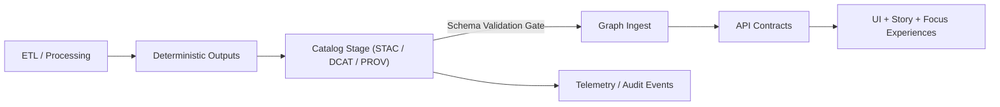

# 🧩 Schemas


Machine-validated contracts for **KFM catalogs**, **provenance**, **narratives**, **UI registries**, and **telemetry**.

---

## 📌 What this folder is

The `schemas/` directory contains contract schemas (primarily **JSON Schema**) that define and validate KFM’s structured artifacts.

KFM is explicitly **contract-first**:
- Schemas (and API contracts) are **first-class repo artifacts**
- Schema changes require **disciplined versioning**
- **No data enters the graph or UI** unless it passes validation with complete required metadata ✅

This enforces the catalog stage as a formal gatekeeper: **malformed metadata doesn’t propagate** downstream into the Graph, API, or UI.

---

## 🗺️ Pipeline checkpoint map



Schemas enforce the contract boundary at **every** handoff:
- **Catalog schemas**: validate “what exists” + “what it means”
- **Story Node schemas**: validate narrative structure + citations/IDs
- **UI schemas**: validate renderable registries/configs (no ad-hoc assumptions)
- **Telemetry schemas**: standardize events/logs for observability + auditability

---

## 🧭 Table of contents

- [🗂️ Directory layout](#️-directory-layout)
- [🔗 Where validated artifacts live](#-where-validated-artifacts-live)
- [🧱 Schema conventions](#-schema-conventions)
- [🧪 Minimal workflow](#-minimal-work-example)
- [🧬 Versioning + compatibility rules](#-versioning--compatibility-rules)
- [✅ Definition of Done](#-validation--definition-of-done)
- [❓ Open questions](#-open-questions--todo)
- [🕰️ Version history](#️-version-history)
- [🔗 References](#-references)

---

## 🗂️ Directory layout

### 📁 Canonical `schemas/` layout (emoji format)

```text
📁 schemas/                                   # JSON Schemas / shapes for KFM contracts
├── 📄 README.md                              # This file
├── 📁 stac/                                  # KFM-STAC profile schemas (Collections/Items)
├── 📁 dcat/                                  # KFM-DCAT profile schemas (dataset metadata)
├── 📁 prov/                                  # KFM-PROV profile schemas (lineage records)
├── 📁 storynodes/                            # Story Node front-matter + structure schemas
├── 📁 ui/                                    # UI registry / layer-spec schemas
└── 📁 telemetry/                             # Telemetry / logs / event schemas
```

> ⭐ Recommendation (optional):  
> If schema reuse grows, add a shared folder:  
> `📁 schemas/_shared/` for common `$defs` (IDs, timestamps, extents, licensing blocks, etc.).

---

## 🔗 Where validated artifacts live

### Canonical output locations (schema-validated)

```text
📁 data/
├── 📁 stac/
│   ├── 📁 collections/                       # STAC Collections (must validate)
│   └── 📁 items/                             # STAC Items (must validate)
├── 📁 catalog/
│   └── 📁 dcat/                              # DCAT dataset metadata (must validate)
└── 📁 prov/                                  # PROV lineage records (must validate)
```

> If your repo uses different paths, align to the **Master Guide’s canonical structure** and update this README accordingly.

---

## 🧱 Schema conventions

### ✅ Required conventions (recommended default)

- **Every schema must have**:
  - `$schema` (draft identifier)
  - `$id` (stable canonical identifier)
  - `title`, `description`
  - `type`, `required`, and clear constraints
- Prefer `$defs` for shared shapes and reuse
- Prefer explicit `additionalProperties: false` (or `unevaluatedProperties: false`) for “registry-like” objects to prevent silent drift

> ⚠️ JSON Schema draft/version  
> The canonical draft is **not confirmed in this repo yet** (see TODO).  
> Until confirmed, treat schema draft selection as a **single-repo decision** and keep it consistent.

### 🏷️ Naming conventions

A practical, searchable naming pattern:

```text
<domain>.<artifact>.<profile>.schema.json

Examples:
stac.item.v11.schema.json
stac.collection.v11.schema.json
dcat.dataset.v11.schema.json
prov.lineage_record.v11.schema.json
ui.layer_registry.v11.schema.json
telemetry.event.v11.schema.json
```

### 🧷 `$id` conventions (recommended)

Use stable, versioned `$id`s so validators and downstream tools can cache and reference correctly:

```json
{
  "$id": "kfm://schemas/stac/item/v11",
  "$schema": "https://json-schema.org/draft/2020-12/schema"
}
```

> If your repo already uses HTTP-based `$id`s (e.g., a docs site), keep it consistent and versioned.

---

## 🧪 Minimal Work Example

### ✅ Validate one artifact against its schema (tool-agnostic)

1) Identify the artifact type and location:
- STAC Item / Collection → `data/stac/items/` or `data/stac/collections/`
- DCAT dataset metadata → `data/catalog/dcat/`
- PROV lineage record → `data/prov/`

2) Select the matching schema under `schemas/<domain>/`

3) Run a validator (tooling is repo-dependent):

```bash
# Python (jsonschema) — validates a JSON instance against a JSON Schema
python -m jsonschema -i data/stac/items/<item>.json schemas/stac/stac.item.v11.schema.json

# Node (AJV) — validates a JSON instance against a JSON Schema
npx ajv validate -s schemas/stac/stac.item.v11.schema.json -d data/stac/items/<item>.json
```

> 💡 Tip: Keep at least one known-valid example JSON per schema to reduce regressions.

---

## 🧬 Versioning + compatibility rules

KFM schema changes must be treated like API changes.

### Compatibility levels

- **Patch (non-breaking)** ✅  
  Wording/description clarifications, examples, tightening constraints that do not break valid instances
- **Minor (backward-compatible additive)** ✅  
  New optional fields, new schema file(s), new examples/test fixtures
- **Major (breaking)** 🚨  
  Required field changes, semantic meaning changes, enum removals, structural reshapes, new validation constraints that break existing valid instances

### Breaking change rule

If it breaks existing valid data **in the wild**:
- **Create a versioned schema** (e.g., `v12`)
- Keep the prior schema available
- Add **migration notes** (what changed, how to update instances)

### Deprecation guidance (recommended)

- Mark deprecated fields clearly (schema `description` + optional `deprecated: true` if supported by your tooling)
- Keep deprecated fields readable for at least one full minor cycle unless security/governance requires immediate removal

---

## ✅ Validation / Definition of Done

For changes under `schemas/` to be merge-ready:

- [ ] Schema files are syntactically valid and loadable by the repo’s validator(s).
- [ ] Schema changes follow contract-first expectations: **versioning and compatibility are addressed**.
- [ ] At least one example or test fixture demonstrates validity for each new/changed schema.
- [ ] Downstream break risk is documented (**Graph/API/UI impacts**).
- [ ] No governance/sensitivity violations are introduced  
      (e.g., no new fields that would require publishing restricted locations without review).
- [ ] CI checks pass, including schema validation and any repo validation steps.

---

## ❓ Open Questions / TODO

- [ ] Confirm the canonical JSON Schema draft/version used across KFM validators.
- [ ] Confirm whether DCAT validation is JSON Schema only, or also SHACL/ShEx.
- [ ] Confirm whether per-domain READMEs exist or are desired under `schemas/<domain>/README.md`.
- [ ] Confirm the exact local validation command(s) used in CI (e.g., `schema-lint`) and document them here.
- [ ] Confirm whether schemas are published/served (registry) or used only in-repo.

---

## 🟢 Status

**Draft.** Intended as a scaffold aligned to KFM’s contract-first + validation-gated pipeline.  
Update once concrete schema files and validator commands are confirmed.

---

## 🕰️ Version History

- **v1.1.0-draft (2026-01-06):** Added front-matter, schema conventions, naming rules, and versioning/compatibility guidance.
- **v1.0.0-draft (2025-12-31):** Initial scaffold for `schemas/README.md` with emoji layout + contract-first guidance.

---

## 🔗 References

Expected canonical references (some paths not confirmed in repo; see Master Guide / standards index):

- `docs/MASTER_GUIDE_v13.md` — canonical pipeline and repo structure
- `docs/templates/TEMPLATE__KFM_UNIVERSAL_DOC.md` — governed documentation template
- `docs/standards/KFM_STAC_PROFILE.md` — KFM STAC profile (v11)
- `docs/standards/KFM_DCAT_PROFILE.md` — KFM DCAT profile (v11)
- `docs/standards/KFM_PROV_PROFILE.md` — KFM PROV profile (v11)
- `docs/standards/KFM_MARKDOWN_FORMATTING_GUIDE.md` — front-matter + section rules
- `docs/governance/ROOT_GOVERNANCE.md`, `ETHICS.md`, `SOVEREIGNTY.md` — governance and sensitivity rules
