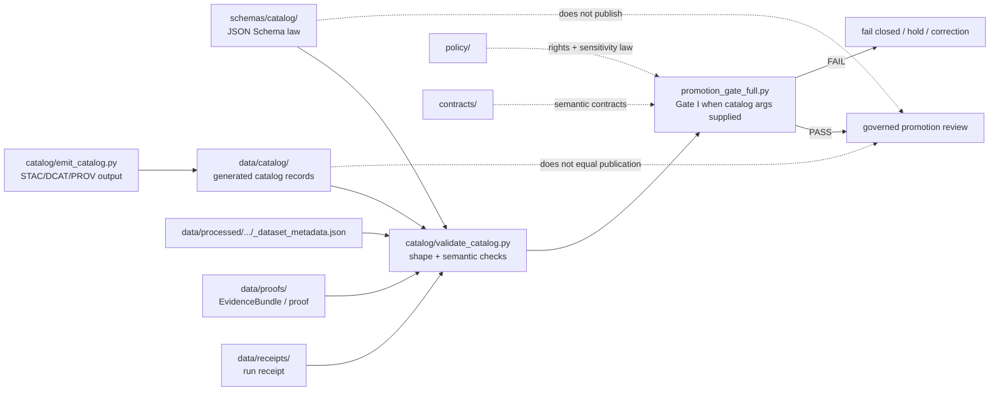

<!-- [KFM_META_BLOCK_V2]
doc_id: kfm://doc/NEEDS_VERIFICATION__schemas_catalog_readme
title: Catalog Schemas
type: standard
version: v1
status: draft
owners: NEEDS_VERIFICATION__schema_or_catalog_stewards
created: NEEDS_VERIFICATION__YYYY-MM-DD
updated: 2026-04-25
policy_label: NEEDS_VERIFICATION__public_or_internal
related: [
  ../README.md,
  ../../pipelines/kansas_biodiversity_etl/catalog/README.md,
  ../../pipelines/kansas_biodiversity_etl/catalog/emit_catalog.py,
  ../../pipelines/kansas_biodiversity_etl/catalog/validate_catalog.py,
  ../../pipelines/kansas_biodiversity_etl/validate/README.md,
  ../../data/catalog/README.md,
  ../../data/catalog/stac/README.md,
  ../../data/catalog/dcat/README.md,
  ../../data/catalog/prov/README.md,
  ../../contracts/README.md,
  ../../policy/README.md
]
tags: [kfm, schemas, catalog, stac, dcat, prov, evidencebundle, spec-hash, validation]
notes: [
  "New README for schemas/catalog/.",
  "Documents proposed canonical schema home for catalog JSON shapes consumed by catalog validators.",
  "Does not claim schema files exist until branch-local inventory confirms them.",
  "Pipeline-local catalog gates enforce additional semantic rules beyond JSON Schema."
]
[/KFM_META_BLOCK_V2] -->

<a id="top"></a>

# Catalog Schemas

Canonical schema lane for KFM catalog JSON shapes: STAC Collection, STAC Item, DCAT Dataset, and PROV lineage documents.

<div align="left">


</div>

| Impact field | Value |
| --- | --- |
| **Status** | `experimental` |
| **Owners** | `NEEDS_VERIFICATION__schema_or_catalog_stewards` |
| **Path** | `schemas/catalog/README.md` |
| **Primary role** | shared schema authority for catalog JSON shapes |
| **Consumers** | catalog emitters, catalog validators, promotion gates, fixtures, tests |
| **Quick jumps** | [Scope](#scope) · [Repo fit](#repo-fit) · [Accepted inputs](#accepted-inputs) · [Exclusions](#exclusions) · [Directory tree](#directory-tree) · [Quickstart](#quickstart) · [Usage](#usage) · [Diagram](#diagram) · [Schema matrix](#schema-matrix) · [Task list](#task-list--definition-of-done) · [FAQ](#faq) · [Appendix](#appendix) |

> [!IMPORTANT]
> `schemas/catalog/` defines reusable **structure law**. It must not become a pipeline implementation directory, catalog artifact store, proof store, policy bundle, or publication lane.

> [!NOTE]
> JSON Schema can prove required shape. It does not prove catalog truth by itself. KFM catalog validators still need semantic checks such as `spec_hash` alignment, EvidenceBundle linkage, receipt/proof linkage, partition consistency, and fail-closed promotion behavior.

---

## Scope

`schemas/catalog/` is the proposed shared schema home for catalog records used across KFM catalog closure.

The immediate workstream is the Kansas biodiversity ETL catalog lane, which emits and validates:

- STAC Collection,
- STAC partition Items,
- DCAT Dataset,
- PROV lineage document.

Those catalog artifacts are generated by pipeline-local tooling, but their reusable machine shapes belong here rather than inside the pipeline.

### What belongs in this lane

| Schema family | Purpose |
| --- | --- |
| STAC Collection | dataset-level discovery record for a cataloged candidate |
| STAC Item | partition-level discovery record carrying KFM identity fields |
| DCAT Dataset | dataset/distribution description with rights and access metadata |
| PROV document | lineage document linking dataset, EvidenceBundle, receipt, catalog records, and source URIs |
| shared definitions | repeated KFM fields such as `kfm:spec_hash`, dataset ID, record counts, and catalog links |

### What this lane does **not** decide

Schemas here should not decide:

- whether a dataset is publishable,
- whether a license is admissible,
- whether sensitive geometry may be exposed,
- whether a receipt proof is valid,
- whether catalog closure passes Gate I,
- whether an artifact moves to `data/published/`.

Those are validation, policy, proof, and promotion responsibilities.

[Back to top](#top)

---

## Repo fit

`schemas/catalog/` sits in the shared schema authority layer. Pipeline-local tools consume these schemas; they should not define parallel schema law.

| Relation | Surface | Role | Status |
| --- | --- | --- | --- |
| Schema parent | [`../README.md`](../README.md) | shared schema-family orientation | **NEEDS VERIFICATION** |
| Biodiversity catalog lane | [`../../pipelines/kansas_biodiversity_etl/catalog/README.md`](../../pipelines/kansas_biodiversity_etl/catalog/README.md) | documents catalog emission, validation, Gate I, and output placement | **PROPOSED / NEEDS VERIFICATION** |
| Catalog emitter | [`../../pipelines/kansas_biodiversity_etl/catalog/emit_catalog.py`](../../pipelines/kansas_biodiversity_etl/catalog/emit_catalog.py) | emits STAC/DCAT/PROV JSON that should validate against these schemas | **PROPOSED / NEEDS VERIFICATION** |
| Catalog validator | [`../../pipelines/kansas_biodiversity_etl/catalog/validate_catalog.py`](../../pipelines/kansas_biodiversity_etl/catalog/validate_catalog.py) | can consume these schemas and enforce semantic catalog closure | **PROPOSED / NEEDS VERIFICATION** |
| Promotion validator | [`../../pipelines/kansas_biodiversity_etl/validate/README.md`](../../pipelines/kansas_biodiversity_etl/validate/README.md) | documents fail-closed candidate validation and shared-law boundaries | **PROPOSED / NEEDS VERIFICATION** |
| Data catalog | [`../../data/catalog/README.md`](../../data/catalog/README.md) | generated catalog artifact storage | **NEEDS VERIFICATION** |
| Contracts | [`../../contracts/README.md`](../../contracts/README.md) | semantic contracts and runtime meaning | **NEEDS VERIFICATION** |
| Policy | [`../../policy/README.md`](../../policy/README.md) | rights, sensitivity, geoprivacy, and release policy | **NEEDS VERIFICATION** |

### Authority split

```text
schemas/catalog/          -> reusable JSON shape
contracts/                -> semantic meaning and interface contracts
policy/                   -> release law, rights, sensitivity, obligations
pipelines/.../catalog/    -> emits and validates candidate catalog records
data/catalog/             -> stores generated catalog records
data/proofs/              -> stores proof/evidence artifacts
data/receipts/            -> stores process-memory receipts
data/published/           -> governed publication state
```

[Back to top](#top)

---

## Accepted inputs

This directory accepts schema-authoring materials only.

| Accepted input | Examples | Required posture |
| --- | --- | --- |
| JSON Schema files | `stac_collection.schema.json`, `stac_item.schema.json` | reusable, versioned, and pipeline-independent |
| shared schema definitions | `definitions.schema.json` | common KFM fields such as `kfm:spec_hash` |
| schema fixtures | minimal valid/invalid examples if repo convention allows | must not contain real sensitive coordinates |
| schema README/docs | this file and focused schema notes | must distinguish schema checks from policy/gate checks |
| validator references | examples showing how validators consume schemas | examples only unless implementation is verified |

### Minimal proposed schema set

```text
schemas/catalog/
├── README.md
├── stac_collection.schema.json
├── stac_item.schema.json
├── dcat_dataset.schema.json
├── prov_document.schema.json
└── definitions.schema.json
```

[Back to top](#top)

---

## Exclusions

| Does **not** belong here | Better home | Why |
| --- | --- | --- |
| generated STAC/DCAT/PROV catalog records | `../../data/catalog/` | schemas are law, not generated artifacts |
| pipeline emitter code | `../../pipelines/.../catalog/` | implementation belongs with the pipeline |
| catalog validator code | `../../pipelines/.../catalog/` or shared validators | schemas do not execute gates |
| EvidenceBundles and proof packs | `../../data/proofs/` | proof custody is separate |
| run receipts | `../../data/receipts/` | receipts are process memory |
| published aliases | `../../data/published/` | schema files must not imply release state |
| rights/sensitivity policy | `../../policy/` | policy must remain explicit and independently testable |
| raw/work/quarantine data | `../../data/raw/`, `../../data/work/`, `../../data/quarantine/` | schemas must not store source or failed data |
| exact sensitive occurrence fixtures | restricted fixture storage or synthetic redacted fixtures | public schemas must not leak protected locations |

[Back to top](#top)

---

## Directory tree

> [!NOTE]
> The tree below is **PROPOSED** until the active branch confirms these schema files.

```text
schemas/
└── catalog/
    ├── README.md
    ├── definitions.schema.json
    ├── stac_collection.schema.json
    ├── stac_item.schema.json
    ├── dcat_dataset.schema.json
    └── prov_document.schema.json
```

### Optional future fixture shape

```text
schemas/catalog/
└── fixtures/
    ├── valid/
    │   ├── stac_collection.json
    │   ├── stac_item.json
    │   ├── dcat_dataset.json
    │   └── prov_document.json
    └── invalid/
        ├── stac_collection_missing_spec_hash.json
        ├── stac_item_wrong_type.json
        ├── dcat_missing_distribution.json
        └── prov_missing_dataset_entity.json
```

> [!WARNING]
> If catalog fixtures include biodiversity examples, use synthetic or public-safe records only. Do not include exact rare-species or restricted occurrence coordinates.

[Back to top](#top)

---

## Quickstart

### Validate one generated catalog object

```bash
python -m jsonschema \
  -i data/catalog/stac/kansas_biodiversity_occurrences/collection.json \
  schemas/catalog/stac_collection.schema.json
```

### Validate all generated catalog families

```bash
python -m jsonschema \
  -i data/catalog/stac/kansas_biodiversity_occurrences/collection.json \
  schemas/catalog/stac_collection.schema.json

python -m jsonschema \
  -i data/catalog/stac/kansas_biodiversity_occurrences/year=2026-month=04.item.json \
  schemas/catalog/stac_item.schema.json

python -m jsonschema \
  -i data/catalog/dcat/kansas_biodiversity_occurrences.dataset.json \
  schemas/catalog/dcat_dataset.schema.json

python -m jsonschema \
  -i data/catalog/prov/kansas_biodiversity_occurrences.prov.json \
  schemas/catalog/prov_document.schema.json
```

> [!NOTE]
> `jsonschema` CLI availability is **NEEDS VERIFICATION** in the active developer environment. If the repo already uses another validator command, prefer the repo-confirmed entrypoint.

### Expected pipeline integration

The catalog validator should load this directory as a schema root:

```bash
python pipelines/kansas_biodiversity_etl/catalog/validate_catalog.py \
  --metadata data/processed/kansas_occurrences/_dataset_metadata.json \
  --stac-root data/catalog/stac/kansas_biodiversity_occurrences \
  --dcat data/catalog/dcat/kansas_biodiversity_occurrences.dataset.json \
  --prov data/catalog/prov/kansas_biodiversity_occurrences.prov.json \
  --schema-root schemas/catalog
```

The `--schema-root` option is **PROPOSED** until implemented.

[Back to top](#top)

---

## Usage

### Schema checks vs gate checks

| Check type | Owned by | Example |
| --- | --- | --- |
| required field exists | `schemas/catalog/` | STAC Item has `type`, `properties`, `assets` |
| field type is valid | `schemas/catalog/` | `kfm:records` is an integer |
| semantic identity alignment | catalog validator / promotion gate | STAC, DCAT, PROV, and metadata share `spec_hash` |
| receipt proof verification | attestation / promotion gate | receipt bytes match proof hash |
| rights/sensitivity decisions | policy + validation | restricted records cannot expose geometry |
| publication decision | promotion path | artifact may move to `data/published/` |

### Recommended schema strictness

Start intentionally small and fail closed on the fields KFM depends on.

| Schema | Required minimum |
| --- | --- |
| `stac_collection.schema.json` | `type`, `stac_version`, `id`, `links`, `summaries.kfm:spec_hash` |
| `stac_item.schema.json` | `type`, `stac_version`, `id`, `collection`, `properties.kfm:spec_hash`, `assets` |
| `dcat_dataset.schema.json` | `@type`, `@id`, `dct:identifier`, `kfm:spec_hash`, `dcat:distribution` |
| `prov_document.schema.json` | `entity.dataset`, `entity.dataset.kfm:spec_hash`, `activity`, `wasGeneratedBy` |
| `definitions.schema.json` | shared `spec_hash`, dataset ID, link, timestamp, count definitions |

### Naming rules

| Pattern | Reason |
| --- | --- |
| `*.schema.json` | makes schema files discoverable and distinguishes them from generated examples |
| `definitions.schema.json` | keeps shared KFM fields from drifting across files |
| lowercase family names | matches existing schema-family conventions and avoids path churn |
| no pipeline name in schema file | schema is reusable beyond Kansas biodiversity |

[Back to top](#top)

---

## Diagram



[Back to top](#top)

---

## Schema matrix

| File | Status | Primary consumer | Notes |
| --- | --- | --- | --- |
| `definitions.schema.json` | **PROPOSED** | all catalog schemas | shared KFM definitions |
| `stac_collection.schema.json` | **PROPOSED** | `validate_catalog.py`, catalog tests | validates dataset-level catalog discovery shape |
| `stac_item.schema.json` | **PROPOSED** | `validate_catalog.py`, catalog tests | validates partition-level discovery shape |
| `dcat_dataset.schema.json` | **PROPOSED** | `validate_catalog.py`, catalog tests | validates dataset/distribution shape |
| `prov_document.schema.json` | **PROPOSED** | `validate_catalog.py`, catalog tests | validates lineage shape |

### Failure codes to align with validators

| Schema failure | Suggested validator reason |
| --- | --- |
| STAC Collection shape invalid | `invalid_stac_collection_schema` |
| STAC Item shape invalid | `invalid_stac_item_schema:<file>` |
| DCAT shape invalid | `invalid_dcat_schema` |
| PROV shape invalid | `invalid_prov_schema` |
| schema file missing | `catalog_schema_missing:<file>` |
| schema root missing | `schema_root_missing` |

[Back to top](#top)

---

## Task list & definition of done

### README definition of done

- [ ] KFM Meta Block V2 placeholders are resolved or explicitly left for review.
- [ ] Path, owners, status, badges, and quick jumps are present.
- [ ] The README makes schema authority distinct from pipeline implementation.
- [ ] Accepted inputs and exclusions are explicit.
- [ ] Diagram reflects real KFM trust boundaries.
- [ ] Claims about file existence remain **PROPOSED / NEEDS VERIFICATION** until branch-confirmed.
- [ ] Links are relative and reviewable.

### Schema implementation definition of done

- [ ] `definitions.schema.json` exists.
- [ ] `stac_collection.schema.json` exists.
- [ ] `stac_item.schema.json` exists.
- [ ] `dcat_dataset.schema.json` exists.
- [ ] `prov_document.schema.json` exists.
- [ ] Schemas require `kfm:spec_hash` where catalog identity depends on it.
- [ ] Schemas avoid embedding policy decisions.
- [ ] Schemas avoid requiring real sensitive coordinates.
- [ ] `validate_catalog.py` can load schema root or clearly documents why schema validation remains separate.
- [ ] Positive schema fixtures pass.
- [ ] Negative schema fixtures fail closed.
- [ ] Makefile or test target includes schema validation once implementation is verified.

### Review questions

- [ ] Is this schema reusable beyond one pipeline?
- [ ] Does any schema accidentally decide policy?
- [ ] Does any schema duplicate contract text better owned by `contracts/`?
- [ ] Does any schema require generated paths that only exist in a local workstation?
- [ ] Do validators still enforce semantic checks after schema validation passes?

[Back to top](#top)

---

## FAQ

### Why put catalog schemas under `schemas/catalog/` instead of the pipeline?

Because schemas are shared law. The pipeline emits and validates catalog artifacts, but schema authority should not be forked inside a lane-local implementation directory.

### Are these full STAC, DCAT, and PROV standards?

No. The proposed files are KFM-focused schema guards for the catalog shapes this repo emits. They should preserve the project’s required fields and identity posture without pretending to fully encode every external standard rule.

### Does schema validation replace `validate_catalog.py`?

No. Schema validation checks shape. `validate_catalog.py` should also check semantic closure, especially `spec_hash` agreement across metadata, STAC, DCAT, and PROV.

### Can schema validation decide publication?

No. Publication remains a governed state transition. Passing schemas only means catalog objects have the required shape.

### Should schemas include sensitive biodiversity rules?

Only structural rules. Rights, sensitivity, geoprivacy, and release decisions belong in policy and fail-closed validators.

[Back to top](#top)

---

## Appendix

<details>
<summary>Illustrative schema-root validator wiring</summary>

```python
# Illustrative only — implement according to active repo dependency choices.
from pathlib import Path
import json
import jsonschema

def load_json(path: Path) -> dict:
    return json.loads(path.read_text(encoding="utf-8"))

def validate_with_schema(instance_path: Path, schema_path: Path) -> None:
    instance = load_json(instance_path)
    schema = load_json(schema_path)
    jsonschema.validate(instance=instance, schema=schema)
```

</details>

<details>
<summary>Open verification backlog</summary>

| Item | Status | Why it matters |
| --- | --- | --- |
| Confirm `schemas/catalog/` exists on active branch. | **NEEDS VERIFICATION** | This README may be new. |
| Confirm schema owners. | **NEEDS VERIFICATION** | Owners should come from CODEOWNERS or steward decision. |
| Confirm allowed `policy_label`. | **NEEDS VERIFICATION** | Meta block must not invent policy labels. |
| Confirm schema validation dependency. | **NEEDS VERIFICATION** | `jsonschema` CLI/library may not be installed. |
| Confirm generated catalog shape after latest emitter changes. | **NEEDS VERIFICATION** | Schemas must match emitted records, not stale examples. |
| Confirm validator failure-code names. | **NEEDS VERIFICATION** | Reason codes should match implementation. |
| Confirm whether schema files need `$id` values. | **NEEDS VERIFICATION** | Avoid fabricating canonical URLs. |
| Confirm schema versioning convention. | **NEEDS VERIFICATION** | Avoid path churn and ambiguous compatibility. |

</details>

<details>
<summary>Illustrative file list for first implementation PR</summary>

```text
schemas/catalog/README.md
schemas/catalog/definitions.schema.json
schemas/catalog/stac_collection.schema.json
schemas/catalog/stac_item.schema.json
schemas/catalog/dcat_dataset.schema.json
schemas/catalog/prov_document.schema.json
pipelines/kansas_biodiversity_etl/catalog/validate_catalog.py
pipelines/kansas_biodiversity_etl/catalog/tests/test_validate_catalog.py
```

</details>

[Back to top](#top)
