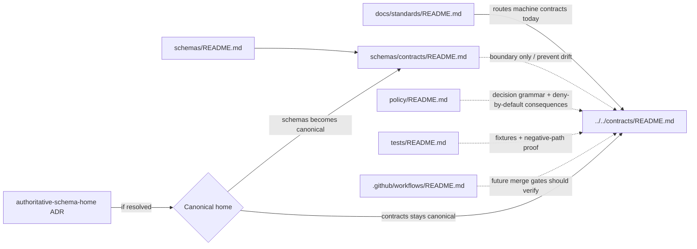

<!-- [KFM_META_BLOCK_V2]
doc_id: kfm://doc/TBD-VERIFY-schemas-contracts-readme
title: schemas/contracts
type: standard
version: v1
status: draft
owners: @bartytime4life
created: YYYY-MM-DD
updated: YYYY-MM-DD
policy_label: TBD-VERIFY
related: [../README.md, ../../contracts/README.md, ../../docs/standards/README.md, ../../policy/README.md, ../../tests/README.md, ../../.github/workflows/README.md]
tags: [kfm, schemas, contracts]
notes: [Owner comes from current CODEOWNERS global fallback; created/updated and policy_label still need branch-history verification; schema-home authority remains unresolved.]
[/KFM_META_BLOCK_V2] -->

# schemas/contracts

_Boundary README for the `schemas/contracts/` sub-lane while KFM keeps trust-bearing contract law singular and prevents a parallel schema universe from growing by accident._

> **Status:** experimental  
> **Doc status:** draft  
> **Owners:** `@bartytime4life` *(current strongest verified signal is the CODEOWNERS global fallback; no narrower `/schemas/` rule was directly verified)*  
>        
> **Repo fit:** path `schemas/contracts/README.md` · upstream [`../README.md`](../README.md) · current working contract lane [`../../contracts/README.md`](../../contracts/README.md) · standards routing [`../../docs/standards/README.md`](../../docs/standards/README.md) · policy lane [`../../policy/README.md`](../../policy/README.md) · verification lane [`../../tests/README.md`](../../tests/README.md) · workflow lane [`../../.github/workflows/README.md`](../../.github/workflows/README.md)  
> **Quick jumps:** [Scope](#scope) · [Repo fit](#repo-fit) · [Accepted inputs](#accepted-inputs) · [Exclusions](#exclusions) · [Directory tree](#directory-tree) · [Quickstart](#quickstart) · [Usage](#usage) · [Diagram](#diagram) · [Tables](#tables) · [Task list](#task-list-and-definition-of-done) · [FAQ](#faq) · [Appendix](#appendix)  
>
> [!IMPORTANT]
> The current public branch already exposes `schemas/contracts/README.md`, so this path is a real repo surface, not a hypothetical folder. But the stronger adjacent documentation signal still routes machine contracts toward [`../../contracts/`](../../contracts/README.md), and schema-home authority remains unresolved.
>
> [!WARNING]
> Until the authoritative schema home is explicitly resolved, adding the same trust-bearing family to both `schemas/contracts/` and `../../contracts/` is drift, not defense in depth.

## Scope

`schemas/contracts/` exists to make one narrow thing explicit: **this path is visible, but it is not silently canonical**.

Today, the safest reading is that this sub-lane is a **boundary and migration-control surface**. It should help contributors understand where trust-bearing contract families belong, what must stay out of this directory while authority is unsettled, and what would have to change if the repo later chose `schemas/` as the canonical root.

That gives this README four practical jobs:

1. record the path-level reality of `schemas/contracts/` without overstating maturity,
2. keep the current stronger signal toward `../../contracts/` visible,
3. block “helpful” duplicate contract trees from appearing in two places at once, and
4. provide a controlled handoff plan if schema authority later moves here.

### Truth posture used here

| Marker | Meaning in this README |
|---|---|
| **CONFIRMED** | Directly visible on the current public branch or directly grounded in stable KFM doctrine already used by adjacent repo docs |
| **INFERRED** | Strongly implied by surrounding repo docs or repo-grounded audit work, but not re-proven from a mounted checkout in this session |
| **PROPOSED** | A future-safe structure or migration step that fits KFM doctrine but is not asserted as live repo reality |
| **UNKNOWN / NEEDS VERIFICATION** | Active-branch parity, authoritative schema-home ADR, live `*.schema.json` inventory, fixture density, merge-blocking workflow depth, and any branch-local validator implementation |

[Back to top](#schemascontracts)

## Repo fit

| Item | Value |
|---|---|
| Path | `schemas/contracts/README.md` |
| Directory role | Boundary contract for the `schemas/contracts/` sub-lane |
| Current working authority signal | `../../contracts/README.md` remains the stronger adjacent machine-contract signal |
| Standards signal | `../../docs/standards/README.md` routes API endpoint schemas and machine contracts to `../../contracts/` |
| Policy/verification dependencies | `../../policy/README.md` and `../../tests/README.md` define the executable and proof-facing neighbors this lane must not duplicate |
| Workflow dependency | `../../.github/workflows/README.md` is the downstream lane for any future validator gate |
| Ownership signal | `@bartytime4life` via current CODEOWNERS global fallback |
| Working rule | This README should reduce ambiguity, not create a second authoritative contract registry |

### Current verified snapshot

| Surface or signal | Current visible state | Why it matters here |
|---|---|---|
| `schemas/contracts/README.md` | Present on public `main` | This sub-lane is real and needs an explicit role |
| `schemas/README.md` | Still describes `schemas/` as a boundary lane with authority unresolved | Parent-lane guidance still matters and should not be bypassed |
| `../../contracts/README.md` | Documents the stronger working contract lane plus a proposed first-wave schema family under `contracts/v1/...` | Current contract work should still point there unless authority changes |
| `../../docs/standards/README.md` | Routes API endpoint schemas and machine contracts to `../../contracts/` | Standards currently reinforce `contracts/` as the safer home |
| `../../tests/README.md` | Treats fixtures and contract validation as test-surface responsibilities | Verification belongs with `tests/`, not here |
| `../../.github/workflows/README.md` | Current public workflow lane is README-only | Merge-blocking schema enforcement is not yet evidenced as checked-in workflow YAML on public `main` |

> [!NOTE]
> This README intentionally does **not** claim that authority has already moved into `schemas/contracts/`. Its role is to make the sub-lane legible while the repo finishes that decision. If the parent `schemas/README.md` still implies a README-only tree, update that parent snapshot in the same change stream so local path truth and parent-lane truth do not diverge.

[Back to top](#schemascontracts)

## Accepted inputs

Material that belongs in `schemas/contracts/` **right now** is narrow on purpose:

| Belongs here now | Why it belongs here |
|---|---|
| This README | The lane is publicly visible and needs an explicit boundary contract |
| Authority-resolution notes specific to this sub-lane | They explain how this path relates to `schemas/` and `../../contracts/` |
| Transition guidance or migration notes | They keep a future move explicit instead of accidental |
| Clearly labeled non-authoritative generated outputs **only if the repo later designates them** | Acceptable only when the repo marks them as compiled or mirrored artifacts, not source-of-truth contracts |
| Short maintenance notes about path ownership, validator references, or de-duplication rules | Useful when they prevent parallel contract law |

### Minimum bar for anything added here

- It is clearly marked **authoritative** or **non-authoritative**.
- It does not duplicate a live authoritative family already owned elsewhere.
- It keeps links to `../../contracts/`, `../../policy/`, `../../tests/`, and `../../.github/workflows/` current.
- It makes schema-home authority clearer than before, not foggier.

## Exclusions

The following do **not** belong here as canonical source-of-truth assets unless the repo explicitly changes direction:

| Does **not** belong here now | Put it here instead | Why |
|---|---|---|
| New authoritative `*.schema.json` contract families | [`../../contracts/`](../../contracts/README.md) | That is still the stronger current working signal for machine contracts |
| Valid / invalid fixture packs | [`../../tests/`](../../tests/README.md) | Fixtures belong with verification and negative-path proof |
| Policy bundles, Rego rules, reason codes, obligation codes, reviewer-role registries | [`../../policy/`](../../policy/README.md) or the confirmed shared-vocab lane | Policy should stay executable and reviewable, not forked through a schema sub-lane |
| Runtime emitters, resolvers, DTO code, or service handlers | app / package implementation surfaces | Consumers should reference contracts, not live inside them |
| Standards profiles and interoperability rules | [`../../docs/standards/`](../../docs/standards/README.md) | Standards explain cross-cutting rules; they are not this lane’s job |
| Workflow YAML and merge-gate wiring | [`../../.github/workflows/`](../../.github/workflows/README.md) | CI enforces contract law; it is not the contract law |
| Release artifacts, receipts, proof packs, or published evidence bundles as the primary record | their governed artifact or release lanes | This directory may describe contract families, but it is not the runtime artifact store |

> [!CAUTION]
> “Temporary copies” are especially dangerous here. Once two paths both look official, reviewers, validators, and downstream code can follow different trees without noticing.

[Back to top](#schemascontracts)

## Directory tree

### Current confirmed local snapshot

```text
schemas/
├── README.md
└── contracts/
    └── README.md
```

### Current neighboring surfaces that govern this lane

```text
contracts/
└── README.md

docs/standards/
└── README.md

policy/
└── README.md

tests/
└── README.md

.github/workflows/
└── README.md
```

### Safe convergence shape while authority remains unresolved

```text
repo-root/
├── contracts/
│   ├── README.md
│   └── v1/...
├── tests/
│   └── fixtures/
│       └── contracts/
│           └── v1/...
└── schemas/
    ├── README.md
    └── contracts/
        └── README.md
```

The layout above is the safest current shape because it keeps `schemas/contracts/` visible without silently turning it into a second canonical tree.

## Quickstart

### Safe inspection loop

```bash
# inspect the local schema/contract lanes without assuming authority
sed -n '1,220p' schemas/README.md
sed -n '1,220p' schemas/contracts/README.md
sed -n '1,260p' contracts/README.md
sed -n '1,220p' docs/standards/README.md
sed -n '1,220p' policy/README.md
sed -n '1,220p' tests/README.md
sed -n '1,220p' .github/workflows/README.md

# inspect what actually exists in the schemas surface
find schemas -maxdepth 4 -type f 2>/dev/null | sort

# inspect current authority language before adding files
git grep -nE 'authoritative schema home|parallel schema|machine contracts|schema home' -- \
  schemas contracts docs .github 2>/dev/null || true

# inspect whether real machine-readable schemas exist yet
find contracts schemas -type f \( -name '*.schema.json' -o -name '*.json' \) 2>/dev/null | sort
```

### Safe contributor rule

1. Read [`../README.md`](../README.md) first.
2. Read [`../../contracts/README.md`](../../contracts/README.md) second.
3. Read [`../../docs/standards/README.md`](../../docs/standards/README.md) third.
4. If authority is still unresolved, **do not** add the same trust-bearing family in both locations.
5. If validator paths, fixture paths, or ownership language change, update this file and its sibling README surfaces in the same reviewed change.

> [!TIP]
> The safe first move is rarely “add a schema here.” The safe first move is usually “resolve authority, then add the family once.”

[Back to top](#schemascontracts)

## Usage

### For maintainers

Use this file to keep `schemas/contracts/` honest. If the repo keeps `../../contracts/` canonical, this README should stay lean, documentary, and anti-duplication. If authority ever moves here, update sibling docs, validator paths, fixture paths, and workflow references **together**, not one surface at a time.

### For contributors

Treat this directory as **boundary-first** until the repo says more. That means:

- do not assume this path is canonical just because it exists;
- do not park a “temporary” schema family here while keeping another copy under `../../contracts/`;
- do not place fixtures here when the proof burden belongs in `../../tests/`;
- do not blur standards, policy, contracts, and runtime code into one folder because the names feel adjacent.

### For reviewers

Reject changes that do any of the following:

- introduce the same trust-bearing family in both `schemas/contracts/` and `../../contracts/`;
- move validator paths without updating sibling README guidance;
- add authoritative schemas here without an explicit authority decision;
- use this path to smuggle policy, runtime, or release artifacts into the wrong lane.

### For future migration

If the repo later decides that `schemas/` becomes canonical, do the full move:

1. write the decision down,
2. update `../../contracts/README.md`,
3. update `../README.md`,
4. update this README,
5. update `../../docs/standards/README.md`,
6. update fixture and workflow paths, and
7. update consumer docs and emitters that point to the old root.

## Diagram



Reading rule: this sub-lane should **reduce ambiguity now** and make an eventual migration **explicit later**.

## Tables

### A. Authority-state behavior matrix

| Authority state | What `schemas/contracts/README.md` should do | What it should not do |
|---|---|---|
| **Unresolved** *(today’s safest reading)* | Describe boundaries, point to the stronger adjacent signal, block duplicate families | Pretend canonical contract law already lives here |
| **`../../contracts/` canonical** | Remain a pointer and migration-control surface | Host competing source-of-truth schemas |
| **`schemas/contracts/` canonical** | Become the local index for contract families and own the canonical tree | Leave sibling docs, fixtures, and workflows pointing at stale paths |

### B. Placement decision matrix

| Candidate change | Belongs in `schemas/contracts/` now? | Better home | Why |
|---|---|---|---|
| New authoritative runtime envelope schema | No | `../../contracts/` | Current stronger contract signal remains there |
| New correction notice schema | No | `../../contracts/` | Correction lineage is a trust-bearing contract family |
| Valid / invalid fixture packs | No | `../../tests/` | Negative-path proof belongs with verification |
| Reason / obligation / reviewer-role registries | No | `../../policy/` or a confirmed shared-vocab lane | Avoid free-text drift and duplicate policy authority |
| Boundary guidance for this sub-lane | Yes | `schemas/contracts/README.md` | This is the right place to explain the path |
| Explicit migration notes tied to this sub-lane | Yes | `schemas/contracts/README.md` | Keeps future moves reviewable |
| Generated mirror bundle | Maybe, but only if clearly marked non-authoritative | Depends on explicit repo decision | Generated outputs are acceptable only when authority is singular and the mirror cannot be mistaken for source of truth |

### C. If authority ever flips here, which families move first? *(PROPOSED handoff map)*

| Trust-bearing family | Current documented starter path | Why it matters |
|---|---|---|
| `header_profile` | `../../contracts/v1/common/header_profile.schema.json` | Shared grammar for later families |
| `decision_envelope` | `../../contracts/v1/policy/decision_envelope.schema.json` | Machine-readable deny-by-default policy result |
| `evidence_bundle` | `../../contracts/v1/evidence/evidence_bundle.schema.json` | Inspectable evidence drill-through |
| `runtime_response_envelope` | `../../contracts/v1/runtime/runtime_response_envelope.schema.json` | Finite runtime outcomes and cite-or-abstain |
| `correction_notice` | `../../contracts/v1/correction/correction_notice.schema.json` | Visible correction lineage |
| `release_manifest` | `../../contracts/v1/release/release_manifest.schema.json` | Publication as a governed state transition |
| `source_descriptor` | `../../contracts/v1/source/source_descriptor.schema.json` | Governed source admission |
| `dataset_version` | `../../contracts/v1/data/dataset_version.schema.json` | Canonical truth and version identity |

> [!NOTE]
> The table above is a **handoff map**, not permission to fork those families into two live homes.

[Back to top](#schemascontracts)

## Task list and definition of done

- [x] `schemas/contracts/README.md` is treated as a real repo path, not a ghost folder.
- [x] The current stronger adjacent signal toward `../../contracts/` is explicit.
- [x] The boundary between schemas, contracts, policy, tests, and workflow lanes is explicit.
- [x] Relative links point to the current governing neighbors.
- [ ] An ADR or equivalent repo decision resolves the authoritative schema home.
- [ ] `schemas/README.md`, this file, and `../../contracts/README.md` converge on the same authority story.
- [ ] One canonical path owns first-wave trust-bearing schema families.
- [ ] Companion fixtures exist in the confirmed fixture home.
- [ ] Merge-blocking validation is checked in and points at one canonical tree.
- [ ] If this path stays non-authoritative, any generated outputs are labeled so clearly that reviewers cannot mistake them for source-of-truth contracts.
- [ ] If this path becomes canonical, sibling docs, tests, and workflows are updated in the same change stream.

## FAQ

### Is `schemas/contracts/` canonical today?

No. The safest current reading is that schema-home authority is still unresolved, while the stronger adjacent signal for machine contracts remains `../../contracts/`.

### Why keep this path visible at all?

Because the path already exists publicly. Ignoring it would hide ambiguity instead of governing it.

### Should I add `*.schema.json` files here right now?

Not unless the repo has explicitly moved canonical authority here. Without that decision, the safer action is to add authoritative families once, in the canonical home only.

### Does this README deprecate `../../contracts/README.md`?

No. It does the opposite: it keeps the stronger current signal toward `../../contracts/` visible while stopping this sub-lane from becoming an accidental fork.

### If the repo later chooses `schemas/` as canonical, is this file enough?

No. The README is only one part of the move. The authority decision, sibling READMEs, fixtures, validators, workflows, and consumer docs all need to move together.

## Appendix

<details>
<summary><strong>Appendix — same-change update checklist if authority changes</strong></summary>

### If <code>../../contracts/</code> stays canonical

- Keep this README boundary-first and pointer-like.
- Keep authoritative schema families under the canonical `contracts/` tree only.
- Keep fixtures under the confirmed `tests/` fixture home.
- Update this file whenever canonical paths, validator commands, or review rules change.

### If <code>schemas/contracts/</code> becomes canonical

1. Write the authority decision as an ADR.
2. Update `../README.md` and `../../contracts/README.md` in the same pull request.
3. Move or regenerate schema families into the new canonical root without leaving two source-of-truth trees behind.
4. Update fixture paths and validator paths.
5. Update workflow docs and any checked-in workflow YAML.
6. Update consumer docs, route-family notes, and any runtime emitters that point to the old root.
7. Re-run link, schema, and fixture validation before merge.

### Migration rule that should never be skipped

Do **not** migrate piecemeal. KFM’s trust posture depends on singular, reviewable authority. A half-moved schema system is harder to audit than either old arrangement.

</details>

[Back to top](#schemascontracts)
