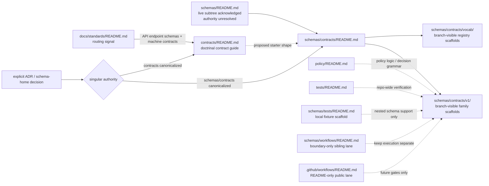

<!-- [KFM_META_BLOCK_V2]
doc_id: kfm://doc/TBD-VERIFY-schemas-contracts-readme
title: schemas/contracts
type: standard
version: v1
status: draft
owners: @bartytime4life
created: YYYY-MM-DD
updated: YYYY-MM-DD
policy_label: TBD-VERIFY
related: [../README.md, ../tests/README.md, ../workflows/README.md, ./v1/README.md, ./vocab/README.md, ../../contracts/README.md, ../../docs/standards/README.md, ../../policy/README.md, ../../tests/README.md, ../../.github/workflows/README.md]
tags: [kfm, schemas, contracts]
notes: [Owner is grounded from current public .github/CODEOWNERS global fallback; created/updated/policy_label/doc_id still need history or registry verification; public main materially exposes schemas/contracts/v1 and schemas/contracts/vocab; canonical schema-home authority remains unresolved across adjacent docs.]
[/KFM_META_BLOCK_V2] -->

# schemas/contracts

_Boundary-and-inventory README for the live `schemas/contracts/` subtree: current public `main` shows real machine-file scaffolds here, while canonical schema-home authority remains unresolved._

> **Status:** experimental  
> **Doc status:** draft  
> **Owners:** `@bartytime4life` *(current strongest verified owner signal is the public `.github/CODEOWNERS` global fallback; no narrower `/schemas/` or `/schemas/contracts/` rule was directly verified on public `main`)*  
>        
> **Repo fit:** path `schemas/contracts/README.md` · parent [`../README.md`](../README.md) · local sublanes [`./v1/README.md`](./v1/README.md) and [`./vocab/README.md`](./vocab/README.md) · sibling schema lanes [`../tests/README.md`](../tests/README.md) and [`../workflows/README.md`](../workflows/README.md) · doctrinal contract guide [`../../contracts/README.md`](../../contracts/README.md) · standards routing [`../../docs/standards/README.md`](../../docs/standards/README.md) · policy lane [`../../policy/README.md`](../../policy/README.md) · repo-wide verification lane [`../../tests/README.md`](../../tests/README.md) · workflow lane [`../../.github/workflows/README.md`](../../.github/workflows/README.md)  
> **Accepted inputs:** local subtree inventory and boundary guidance; additive updates to already-visible `v1/` scaffold files and `vocab/` registries; authority-resolution notes; local migration notes; clearly marked non-authoritative helpers only where explicitly designated  
> **Exclusions:** executable policy logic; repo-wide verification suites; workflow YAML; runtime code; release artifacts as the primary record; duplicate copies of the same family or vocabulary under a competing root  
> **Quick jumps:** [Scope](#scope) · [Repo fit](#repo-fit) · [Accepted inputs](#accepted-inputs) · [Exclusions](#exclusions) · [Directory tree](#directory-tree) · [Quickstart](#quickstart) · [Usage](#usage) · [Diagram](#diagram) · [Tables](#tables) · [Task list](#task-list-and-definition-of-done) · [FAQ](#faq) · [Appendix](#appendix)

> [!IMPORTANT]
> Current public `main` no longer shows `schemas/contracts/` as README-only. This lane now materially exposes `v1/` and `vocab/` subtrees, including first-wave `*.schema.json` scaffold files and three starter JSON vocabulary registries.

> [!WARNING]
> File presence here does **not** settle canonical authority. The parent [`../README.md`](../README.md) now acknowledges the live `schemas/` subtree, but adjacent doctrinal and standards surfaces still route machine contracts more strongly toward [`../../contracts/`](../../contracts/README.md) and keep schema-home authority unresolved.

> [!NOTE]
> The current problem is no longer “does this subtree exist?”  
> It is “how do we document it honestly without letting branch-visible files outrun authority law?”  
> Keep tree snapshots and authority wording synchronized across [`../README.md`](../README.md), this file, [`./v1/README.md`](./v1/README.md), [`./vocab/README.md`](./vocab/README.md), [`../tests/README.md`](../tests/README.md), [`../workflows/README.md`](../workflows/README.md), [`../../contracts/README.md`](../../contracts/README.md), and [`../../docs/standards/README.md`](../../docs/standards/README.md) whenever this lane changes materially.

## Scope

`schemas/contracts/` exists to make one narrow thing explicit:

**this lane is real, machine-file-bearing, and still not silently canonical.**

That is a different posture from both of the simpler stories that are now too weak:

- the older “there is effectively nothing here” story; and
- the equally unsafe “the files are here, so authority must already have moved” story.

Today, this README should do four jobs well:

1. record the current public tree under `schemas/contracts/` without overstating maturity;
2. distinguish **branch-visible machine-file reality** from **settled canonical authority**;
3. prevent the repo from carrying one human-readable contract story in `contracts/` and a second silent machine-file story in `schemas/` without saying so; and
4. give contributors a safe review discipline while the subtree remains scaffold-heavy and authority-sensitive.

### Truth posture used here

| Marker | Meaning in this README |
|---|---|
| **CONFIRMED** | Directly visible on current public `main` or directly grounded in adjacent public KFM README surfaces inspected for this revision |
| **INFERRED** | Strongly implied by surrounding repo docs and lane boundaries, but not formally resolved as canonical law |
| **PROPOSED** | Safe next-step guidance that fits the visible tree and current KFM doctrine, but is not asserted as settled implementation fact |
| **UNKNOWN / NEEDS VERIFICATION** | Not established strongly enough to present as current repo law, platform settings, or authoritative-home resolution |

[Back to top](#schemascontracts)

## Repo fit

| Item | Value |
|---|---|
| Path | `schemas/contracts/README.md` |
| Directory role | Boundary-and-inventory README for the live `schemas/contracts/` subtree |
| Parent lane | [`../README.md`](../README.md) |
| Local children | [`./v1/`](./v1/) · [`./vocab/`](./vocab/) |
| Sibling schema-adjacent lanes | [`../tests/README.md`](../tests/README.md) · [`../workflows/README.md`](../workflows/README.md) |
| Doctrinal routing signal | [`../../contracts/README.md`](../../contracts/README.md) and [`../../docs/standards/README.md`](../../docs/standards/README.md) still point more strongly toward `contracts/` as the human-readable machine-contract lane |
| Repo-wide neighbors | [`../../policy/README.md`](../../policy/README.md) · [`../../tests/README.md`](../../tests/README.md) · [`../../.github/workflows/README.md`](../../.github/workflows/README.md) |
| Ownership signal | `@bartytime4life` via public `.github/CODEOWNERS` global fallback |
| Workflow signal | public `.github/workflows/` remains README-only on public `main`, so merge-gate depth is still not provable from checked-in YAML |
| Working rule | Keep the subtree inspectable, but do not let current branch-visible files silently settle canonical authority by inertia |

### Current verified snapshot

| Surface or signal | Current visible state | Why it matters here |
|---|---|---|
| `schemas/contracts/README.md` | Present and substantive | This lane already has a real repo path and must stay tree-accurate |
| `schemas/contracts/v1/README.md` | Present and substantive | The versioned contract-family lane is already documented locally |
| `schemas/contracts/vocab/README.md` | Present and substantive | The shared registry lane is already documented locally |
| `schemas/contracts/v1/` | Present with `README.md` plus family subdirectories | First-wave contract families are now branch-visible here |
| `schemas/contracts/v1/*/*.schema.json` | Present across `common/`, `correction/`, `data/`, `evidence/`, `policy/`, `release/`, `runtime/`, and `source/` | A real schema lane exists here, even though the current files remain scaffold-state |
| Representative opened `v1` schema file | Placeholder body (`{}`) | Current child-lane maturity is still scaffold-heavy |
| `schemas/contracts/vocab/` | Present with `README.md`, `reason_codes.json`, `obligation_codes.json`, and `reviewer_roles.json` | Shared registry files are now machine-visible here |
| Representative opened vocab file | Placeholder body (`{}`) | Registry placement is real; starter semantics are not yet populated |
| `../README.md` | Now explicitly says `schemas/` is no longer README-only and still warns that machine-file presence under `schemas/contracts/` does not settle authority | Parent lane no longer erases current tree reality, but it still does not resolve canonical-home law |
| `../tests/README.md` and `../tests/fixtures/` | Nested schema-test scaffolds are visible, including `fixtures/contracts/v1/{valid,invalid}` | Local schema-adjacent fixture scaffolds exist, but they do not outrank repo-wide test law |
| `../workflows/README.md` | Present, README-only boundary lane | A local schema/workflow topic lane exists, but it is not executable workflow inventory |
| `../../contracts/README.md` | Present and substantive, but the public `contracts/` tree remains README-only | Human-readable contract guidance and machine-file placement are split across roots |
| `../../docs/standards/README.md` | Still routes “API endpoint schemas and machine contracts” to `../../contracts/` | Standards routing still reinforces `contracts/` language |
| `../../tests/README.md` | Still describes repo-wide governed verification as the stronger verification surface | Fixture and proof burdens should not drift here casually |
| `../../.github/workflows/README.md` | Public workflow lane is README-only | Current public tree still does not prove merge-blocking schema validation YAML |

> [!TIP]
> The safe current reading is neither “canonical here” nor “empty here.”  
> It is: **machine files are here; canonical law is still unsettled.**

[Back to top](#schemascontracts)

## Accepted inputs

Material that belongs in `schemas/contracts/` **right now** is broader than “README only,” but it is still deliberately narrow.

| Belongs here now | Why it belongs here |
|---|---|
| This README and child README sync changes | The lane is real and its tree, role, and authority posture must stay legible |
| Inventory and migration notes for `./v1/` and `./vocab/` | The subtree now contains real machine-facing files and needs explicit change discipline |
| Additive updates to already-visible scaffold schema files under `./v1/` | These files already exist here on public `main`; pretending otherwise would be less truthful than governing them carefully |
| Additive updates to already-visible shared registry files under `./vocab/` | The current branch-visible machine-file lane for these starter registries is here |
| Authority-resolution notes tied to this exact subtree | This path sits at the center of the current root-split tension |
| Clearly labeled non-authoritative generated helpers or mirrors, but only if the repo explicitly designates that pattern | Acceptable only when the authority story stays singular and reviewable |

### Minimum bar for anything added here

- It makes a clear distinction between **branch-visible file presence** and **settled canonical authority**.
- It does **not** create or preserve a second live copy of the same family or registry under `../../contracts/`.
- It keeps links to `../../contracts/`, `../../policy/`, `../../tests/`, and `../../.github/workflows/` current.
- It states whether a file is still scaffold-state or is intended to become substantively enforced.
- It makes tree-shape prose more accurate than before, not more nostalgic.

[Back to top](#schemascontracts)

## Exclusions

The following do **not** belong here by default.

| Does **not** belong here as canonical truth | Put it here instead | Why |
|---|---|---|
| Executable policy bodies, Rego rules, or decision logic | [`../../policy/`](../../policy/README.md) | Policy should remain executable and reviewable in one governed lane |
| Repo-wide validation packs, release drills, rollback suites, or broad verification harnesses | [`../../tests/`](../../tests/README.md) | Repo-wide proof burden belongs with the stronger governed verification surface |
| Workflow YAML, runner definitions, or merge-gate orchestration | [`../../.github/workflows/`](../../.github/workflows/README.md) | CI/CD execution belongs in the workflow lane, not inside schema scaffolding |
| Runtime code, DTO emitters, resolvers, service handlers, or UI logic | app / package implementation surfaces | Contracts should govern those surfaces, not absorb them |
| Long-form standards doctrine, profiles, or interoperability guidance | [`../../docs/standards/`](../../docs/standards/README.md) | Standards are cross-cutting rules, not this subtree’s canonical home |
| Parallel copies of already-visible `v1` family files or `vocab` registries under `../../contracts/` or another root | one decided authoritative home only | Duplicate authority is worse than visible incompleteness |
| Entirely new family roots beyond the current first wave, added without explicit authority discussion | resolve authority first or update all affected boundary docs in the same PR | Unresolved schema-home law is not permission for quiet sprawl |

> [!CAUTION]
> The highest-risk failure mode here is not missing content.  
> It is **split authority that looks accidental enough to survive review**.

[Back to top](#schemascontracts)

## Directory tree

### Current public `schemas/` snapshot relevant to this lane

```text
schemas/
├── README.md
├── contracts/
│   ├── README.md
│   ├── v1/
│   │   ├── README.md
│   │   ├── common/
│   │   ├── correction/
│   │   ├── data/
│   │   ├── evidence/
│   │   ├── policy/
│   │   ├── release/
│   │   ├── runtime/
│   │   └── source/
│   └── vocab/
│       ├── README.md
│       ├── obligation_codes.json
│       ├── reason_codes.json
│       └── reviewer_roles.json
├── schemas/
│   └── README.md
├── standards/
│   └── README.md
├── tests/
│   ├── README.md
│   └── fixtures/
│       └── contracts/
│           └── v1/
│               ├── invalid/
│               └── valid/
└── workflows/
    └── README.md
```

### Current public `schemas/contracts/` subtree

```text
schemas/contracts/
├── README.md
├── v1/
│   ├── README.md
│   ├── common/
│   │   ├── README.md
│   │   └── header_profile.schema.json
│   ├── correction/
│   │   ├── README.md
│   │   └── correction_notice.schema.json
│   ├── data/
│   │   ├── README.md
│   │   └── dataset_version.schema.json
│   ├── evidence/
│   │   ├── README.md
│   │   └── evidence_bundle.schema.json
│   ├── policy/
│   │   ├── README.md
│   │   └── decision_envelope.schema.json
│   ├── release/
│   │   ├── README.md
│   │   └── release_manifest.schema.json
│   ├── runtime/
│   │   ├── README.md
│   │   └── runtime_response_envelope.schema.json
│   └── source/
│       ├── README.md
│       └── source_descriptor.schema.json
└── vocab/
    ├── README.md
    ├── obligation_codes.json
    ├── reason_codes.json
    └── reviewer_roles.json
```

### Neighboring public surfaces that still shape authority

```text
contracts/
└── README.md

docs/standards/
└── README.md

policy/
└── README.md

tests/
└── README.md

.github/workflows/
└── README.md
```

[Back to top](#schemascontracts)

## Quickstart

### Safe inspection loop

```bash
# 1) Inspect the live subtree exactly as checked out
find schemas/contracts -maxdepth 4 \( -type d -o -type f \) | sort

# 2) Read the local lane before changing it
sed -n '1,240p' schemas/contracts/README.md
sed -n '1,240p' schemas/contracts/v1/README.md
sed -n '1,240p' schemas/contracts/vocab/README.md

# 3) Read the parent and sibling schema lanes that shape boundary decisions
sed -n '1,240p' schemas/README.md
sed -n '1,220p' schemas/tests/README.md
sed -n '1,220p' schemas/workflows/README.md

# 4) Read the competing authority and routing surfaces
sed -n '1,280p' contracts/README.md
sed -n '1,240p' docs/standards/README.md
sed -n '1,240p' policy/README.md
sed -n '1,260p' tests/README.md
sed -n '1,240p' .github/workflows/README.md

# 5) Inspect current placeholder bodies before claiming maturity
for f in \
  schemas/contracts/v1/common/header_profile.schema.json \
  schemas/contracts/v1/correction/correction_notice.schema.json \
  schemas/contracts/v1/data/dataset_version.schema.json \
  schemas/contracts/v1/evidence/evidence_bundle.schema.json \
  schemas/contracts/v1/policy/decision_envelope.schema.json \
  schemas/contracts/v1/release/release_manifest.schema.json \
  schemas/contracts/v1/runtime/runtime_response_envelope.schema.json \
  schemas/contracts/v1/source/source_descriptor.schema.json \
  schemas/contracts/vocab/reason_codes.json \
  schemas/contracts/vocab/obligation_codes.json \
  schemas/contracts/vocab/reviewer_roles.json
do
  printf '\n== %s ==\n' "$f"
  cat "$f"
done

# 6) Search for authority and duplication language before adding anything
git grep -nE 'authoritative schema|schema home|parallel schema|contracts/v1|schemas/contracts/v1|contracts/vocab|schemas/contracts/vocab' -- \
  schemas contracts docs tests .github 2>/dev/null || true
```

### Safe contributor rule

1. Read [`../README.md`](../README.md) first.
2. Read [`./v1/README.md`](./v1/README.md) and [`./vocab/README.md`](./vocab/README.md) second.
3. If your change touches fixtures or workflow-adjacent wording, read [`../tests/README.md`](../tests/README.md) and [`../workflows/README.md`](../workflows/README.md) next.
4. Read [`../../contracts/README.md`](../../contracts/README.md) and [`../../docs/standards/README.md`](../../docs/standards/README.md) before claiming authority movement.
5. If a file already exists here, treat edits as **contract work**, not casual cleanup.
6. Do **not** add or preserve the same trust-bearing family or registry in both `schemas/contracts/` and `../../contracts/`.
7. When tree shape or authority wording changes, update sibling boundary READMEs in the same reviewed PR.

> [!TIP]
> The safe first move is no longer “pretend nothing lives here.”  
> The safe first move is: **inspect what is here, then avoid letting file presence outrun authority law.**

[Back to top](#schemascontracts)

## Usage

### For maintainers

Use this file to keep `schemas/contracts/` honest in both directions:

- do not let older README-only assumptions erase current machine-file reality;
- do not let current machine-file reality silently harden into canonical law without an explicit decision.

When this subtree changes, the review question is not only “what file was added?” It is also “what did that addition do to the repo’s authority story?”

### For contributors

Treat this lane as **authority-sensitive scaffold plus current inventory**.

That means:

- improving the existing subtree is valid work;
- claiming more enforcement than the current files prove is not;
- adding second copies of the same family elsewhere is drift;
- changing a JSON schema or shared registry value here should travel with any affected docs, fixtures, policy references, and examples.

### For reviewers

Reject changes that do any of the following:

- document `schemas/contracts/` as if it were still effectively empty;
- treat branch-visible files here as conclusive proof that authority has already moved;
- add a second live copy of the same family or registry under `../../contracts/`;
- say merge-blocking validation already exists without checked-in YAML evidence;
- leave `schemas/README.md`, this file, child `v1` / `vocab` READMEs, and sibling schema-lane READMEs telling different tree or authority stories.

### For future reconciliation

There are only two healthy end states:

1. **Canonicalize here.**  
   `schemas/contracts/` becomes the singular machine-file home, adjacent docs are updated to say so, and `contracts/README.md` becomes a doctrinal pointer or coordinated companion.

2. **Collapse back to `contracts/`.**  
   Current branch-visible files move or become explicitly generated mirrors/pointers, and this subtree stops acting like a quiet second source of truth.

What should not survive is the current split forever.

[Back to top](#schemascontracts)

## Diagram



Reading rule: **current file placement is real; canonical-home law still needs an explicit verdict.**

[Back to top](#schemascontracts)

## Tables

### A. Branch-visible first-wave inventory

| Area | Current visible file(s) | Current body state | What that means now |
|---|---|---|---|
| `v1/common/` | `header_profile.schema.json` | representative opened file is `{}` | Shared-header family is branch-visible, but still scaffold-state |
| `v1/correction/` | `correction_notice.schema.json` | scaffold-state | Correction-family lane exists here, not just in doctrine |
| `v1/data/` | `dataset_version.schema.json` | scaffold-state | Dataset-version lane is materialized, but not yet substantively authored |
| `v1/evidence/` | `evidence_bundle.schema.json` | scaffold-state | Evidence-bundle lane exists as a file-bearing scaffold |
| `v1/policy/` | `decision_envelope.schema.json` | scaffold-state | Decision-envelope family is visible here, but not yet populated |
| `v1/release/` | `release_manifest.schema.json` | scaffold-state | Release-manifest lane is machine-visible, still placeholder-only |
| `v1/runtime/` | `runtime_response_envelope.schema.json` | scaffold-state | Runtime-envelope family is materialized, not yet semantically filled |
| `v1/source/` | `source_descriptor.schema.json` | scaffold-state | Source-admission family is machine-visible here |
| `vocab/` | `reason_codes.json`, `obligation_codes.json`, `reviewer_roles.json` | representative opened file is `{}` | Shared registry lane exists, but starter semantics are still empty |

### B. Authority-tension matrix

| Evidence surface | What it says today | Practical consequence |
|---|---|---|
| Public `schemas/contracts/` tree | Machine-facing scaffold files now live here | You cannot truthfully document this lane as empty |
| `../README.md` | Parent `schemas/README.md` now acknowledges the live subtree and keeps schema-home authority unresolved | Parent no longer erases current tree reality, but it still does not settle authority |
| `../../contracts/README.md` | Human-readable contract guide still uses `contracts/` as the stronger starter publication lane and keeps canonical-home authority unresolved | You cannot truthfully document authority as settled here either |
| `../../docs/standards/README.md` | Routes API endpoint schemas and machine contracts toward `../../contracts/` | Standards routing still points away from the live machine-file subtree |
| `../tests/README.md` and `../workflows/README.md` | Nested schema-adjacent scaffolds exist locally | Local fixture/topic lanes are real, but they do not outrank repo-wide test or workflow homes |
| `../../tests/README.md` and `../../.github/workflows/README.md` | Verification remains stronger repo-wide; public workflow lane is still README-only | Current subtree presence is not the same as proven enforcement |

### C. Edit decision matrix

| Candidate change | Safe now? | Conditions |
|---|---|---|
| Improve this README, child READMEs, or sibling schema-lane README sync | Yes | Keep inventory and authority language accurate |
| Fill in an already-visible `v1/*/*.schema.json` scaffold file | Yes, but authority-sensitive | Treat as contract work; update affected docs, fixtures, policy references, and examples |
| Add values to existing `vocab/*.json` registries | Yes, additively | Keep meanings stable; update downstream references together |
| Create the same family or registry under `../../contracts/` as well | No | Resolve authority first |
| Introduce a completely new family root beyond the current first wave | Needs verification | Do it only with explicit authority discussion and sibling-doc synchronization |
| Claim merge-blocking validation already governs this subtree | No | Public `main` still does not show checked-in workflow YAMLs here |

[Back to top](#schemascontracts)

## Task list and definition of done

- [x] `schemas/contracts/README.md` is treated as a real repo path.
- [x] The current branch-visible `v1/` and `vocab/` lanes are explicit.
- [x] The split between branch-visible machine files and unresolved canonical-home law is explicit.
- [x] Relative links point to current local and adjacent authority surfaces.
- [x] The directory tree reflects current public `main` instead of older README-only assumptions.
- [ ] `schemas/README.md`, this file, `schemas/contracts/v1/README.md`, `schemas/contracts/vocab/README.md`, `schemas/tests/README.md`, and `schemas/workflows/README.md` keep the same tree and authority story.
- [ ] `../../contracts/README.md` and `../../docs/standards/README.md` reconcile doctrinal routing with current machine-file placement or explicitly document a pointer/mirror strategy.
- [ ] Placeholder schema and registry files graduate beyond `{}` where intended.
- [ ] Fixture-home, policy-home, and workflow-gate rules are explicit and non-duplicative.
- [ ] One authoritative root owns contract families and shared registries.
- [ ] Merge-time validation is checked in against the decided canonical tree.
- [ ] If this subtree is not canonical long term, its mirror/pointer strategy is documented and reviewable.

## FAQ

### Is `schemas/contracts/` canonical today?

Not proven. What **is** proven is that current public `main` now exposes real machine-facing scaffold files here. What remains unresolved is whether that branch-visible placement is the long-term singular authority.

### Is this lane still “boundary-only”?

No. It is now a **boundary-and-inventory** lane. The subtree contains real JSON-bearing scaffold files, so the README must document them honestly.

### Does `schemas/README.md` still act like `schemas/` is README-only?

No. The parent lane now explicitly acknowledges the live `schemas/` subtree. What it still does **not** do is declare `schemas/contracts/` the singular canonical contract home.

### Are the current schema and registry bodies substantive yet?

Not from the public files opened for this revision. Current public child docs describe the first wave as scaffold-state, and representative opened raw files are still `{}`.

### Should I add the same family under `../../contracts/` too?

No. Until canonical-home law is resolved, dual maintenance is drift.

### Does this README deprecate `../../contracts/README.md`?

No. It makes the split visible. `../../contracts/README.md` remains an important doctrinal guide, but current public `main` also has branch-visible machine files under `schemas/contracts/`.

### Where should fixtures, policy rules, and workflow gates live?

The stronger current homes remain [`../../tests/`](../../tests/README.md), [`../../policy/`](../../policy/README.md), and [`../../.github/workflows/`](../../.github/workflows/README.md). Nested `schemas/` scaffolds do not override those repo-wide lanes by accident.

## Appendix

<details>
<summary><strong>Appendix — same-change reconciliation checklist</strong></summary>

### When this subtree changes materially

Update these surfaces in the same reviewed change where applicable:

1. `schemas/README.md`
2. `schemas/contracts/README.md`
3. `schemas/contracts/v1/README.md`
4. `schemas/contracts/vocab/README.md`
5. `schemas/tests/README.md`
6. `schemas/workflows/README.md`
7. `contracts/README.md`
8. `docs/standards/README.md`
9. `tests/README.md` and any touched `tests/contracts/**` or `schemas/tests/fixtures/**` surfaces
10. `.github/workflows/README.md` if validation claims or workflow expectations change

### If authority resolves toward `schemas/contracts/`

- say so explicitly in an ADR or equivalent decision record;
- update `contracts/README.md` and `docs/standards/README.md` to stop routing readers elsewhere;
- wire tests and workflow gates against the canonical subtree;
- remove or demote any duplicate contract-story language that implies a second home.

### If authority resolves back toward `contracts/`

- move or regenerate current machine files in a reviewable sequence;
- leave a thin pointer or generated-output explanation here rather than a stale quasi-home;
- update every child README under `schemas/contracts/` so the subtree cannot be mistaken for canonical truth.

### Migration rule that should never be skipped

Do **not** let one root carry the prose while the other root carries the files without an explicit explanation. In KFM, silent split authority is a governance bug.

</details>

[Back to top](#schemascontracts)
