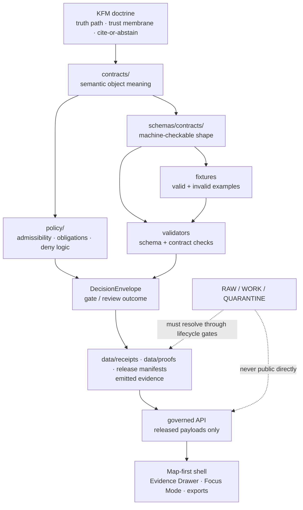

<!-- [KFM_META_BLOCK_V2]
doc_id: kfm://doc/<TODO-VERIFY-UUID>
title: schemas/contracts
type: standard
version: v1
status: draft
owners: <TODO-VERIFY-OWNERS>
created: <TODO-VERIFY-CREATED-DATE>
updated: 2026-04-23
policy_label: <TODO-VERIFY-POLICY-LABEL>
related: [../README.md, ./v1/README.md, ./vocab/README.md, ../../contracts/README.md, ../tests/README.md, ../../tests/contracts/README.md, ../../policy/README.md, ../../docs/standards/README.md]
tags: [kfm, schemas, contracts, machine-contracts, governance]
notes: [doc_id owners created policy_label and adjacent link existence need mounted-repo verification, schema-home authority between contracts and schemas remains unresolved pending ADR]
[/KFM_META_BLOCK_V2] -->

<a id="top"></a>

# `schemas/contracts`

Machine-checkable contract shapes for KFM trust objects, runtime envelopes, release artifacts, and governed evidence payloads.

> [!IMPORTANT]
> **Impact block**  
> **Status:** experimental  
> **Owners:** `<TODO-VERIFY-OWNERS>`  
> **Path:** `schemas/contracts/README.md`  
> **Authority posture:** **NEEDS VERIFICATION** — this lane documents the schema-side contract boundary, but final `contracts/` versus `schemas/contracts/` authority must be settled by repo evidence or ADR.  
>
> 
> 
> 
> 
> 
>
> **Quick jumps:** [Scope](#scope) · [Repo fit](#repo-fit) · [Accepted inputs](#accepted-inputs) · [Exclusions](#exclusions) · [Directory tree](#directory-tree) · [Quickstart](#quickstart) · [Usage](#usage) · [Contract boundary](#contract-boundary) · [Object families](#object-families) · [Diagram](#diagram) · [Review gates](#review-gates) · [FAQ](#faq) · [Appendix](#appendix)

---

## Scope

`schemas/contracts/` is the schema-side boundary for KFM contract shapes.

It exists to make trust-bearing objects machine-checkable without letting executable schemas silently replace semantic doctrine, policy decisions, source authority, or emitted proof artifacts.

Use this lane for:

- versioned JSON Schema or repo-native schema files for contract objects;
- schema-family README files that explain placement, versioning, and validation expectations;
- schema-side controlled vocabulary registries where this repo intentionally keeps machine values close to validation;
- cross-links from machine shapes to semantic contract docs, fixtures, policy, validators, and release evidence.

**Current posture:** **PROPOSED / NEEDS VERIFICATION** for exact current branch inventory. The KFM corpus strongly supports this boundary, but a mounted checkout must still verify the actual file list, schema bodies, validator commands, and CI enforcement before any implementation-depth claim is made.

<p align="right"><a href="#top">Back to top ↑</a></p>

---

## Repo fit

This README is the parent boundary document for schema-side contract materials under `schemas/`.

| Direction | Surface | Expected relationship | Verification posture |
| --- | --- | --- | --- |
| Upstream | [`../README.md`](../README.md) | Parent `schemas/` lane: overall schema boundary and subtree inventory. | **NEEDS VERIFICATION** |
| Lateral | [`../../contracts/README.md`](../../contracts/README.md) | Semantic contract lane: object meaning, invariants, lifecycle semantics, and reviewer-facing explanation. | **NEEDS VERIFICATION** |
| Lateral | [`../../policy/README.md`](../../policy/README.md) | Policy lane: release/runtime admissibility, denial logic, rights, sensitivity, and obligations. | **NEEDS VERIFICATION** |
| Lateral | [`../../docs/standards/README.md`](../../docs/standards/README.md) | Standards lane: repo-wide schema, metadata, and documentation conventions. | **NEEDS VERIFICATION** |
| Downstream | [`./v1/README.md`](./v1/README.md) | Versioned machine contract lane for first-wave schema families. | **NEEDS VERIFICATION** |
| Downstream | [`./vocab/README.md`](./vocab/README.md) | Schema-side controlled vocabulary lane, if this repo keeps value registries here. | **NEEDS VERIFICATION** |
| Verification | [`../tests/README.md`](../tests/README.md) | Schema-adjacent fixture lane, where present. | **NEEDS VERIFICATION** |
| Verification | [`../../tests/contracts/README.md`](../../tests/contracts/README.md) | Root contract test lane for executable checks, reports, and regression pressure. | **NEEDS VERIFICATION** |

> [!WARNING]
> Do not infer implementation maturity from the existence of this README. A schema family is not “live” until its schema body, valid and invalid fixtures, validator command, CI or review gate, semantic contract link, and rollback/versioning rule are all verified.

<p align="right"><a href="#top">Back to top ↑</a></p>

---

## Accepted inputs

Only put materials here when they clarify or validate KFM machine contract shape.

| Input class | Belongs here when... | Example shape | Status |
| --- | --- | --- | --- |
| Versioned contract schema | It defines a machine-checkable shape for a trust-bearing object. | `v1/runtime/runtime_response_envelope.schema.json` | **PROPOSED / NEEDS VERIFICATION** |
| Schema-family README | It explains local schema rules, required fixtures, and downstream consumers. | `v1/evidence/README.md` | **PROPOSED** |
| Controlled vocabulary registry | It is intentionally machine-readable and used by schemas or validators. | `vocab/reason_codes.json` | **NEEDS VERIFICATION** |
| Schema index or crosswalk | It maps `$id`, family, owner, fixtures, validators, and semantic docs. | `v1/SCHEMA_INDEX.md` | **PROPOSED** |
| Migration note | It explains version compatibility or supersession without mutating released contracts silently. | `v1/MIGRATION_NOTES.md` | **PROPOSED** |

The safest rule: **schema files belong here only when their meaning is traceable elsewhere and their behavior is testable.**

---

## Exclusions

These materials do **not** belong in `schemas/contracts/`.

| Do not place here | Better home | Why |
| --- | --- | --- |
| Semantic object doctrine | `../../contracts/` or `../../docs/` | Schema shape must not be the only source of meaning. |
| Policy rules, obligations, and deny logic | `../../policy/` | Policy decides admissibility; schemas constrain shape. |
| Valid and invalid fixtures | `../tests/` or `../../tests/contracts/` | Fixtures prove behavior and should not blur with definitions. |
| Emitted receipts, proof packs, manifests, or bundles | `../../data/receipts/`, `../../data/proofs/`, `../../data/catalog/`, or release lanes | Emitted artifacts are instances, not normative definitions. |
| Runtime route handlers or UI components | `../../apps/`, `../../packages/`, or UI lanes | Code consumes contracts; it should not own contract authority. |
| Exploratory packet material | `../../docs/intake/` or lineage/archive lanes | Ideas must be promoted before becoming contract shape. |
| External source payload mirrors | `../../data/raw/`, source registry, or quarantine/work zones | Source payloads are evidence inputs, not schema authority. |

<p align="right"><a href="#top">Back to top ↑</a></p>

---

## Directory tree

Expected shape to verify before merge:

```text
schemas/contracts/
├── README.md
├── v1/
│   ├── README.md
│   ├── governance/
│   │   └── *.schema.json
│   ├── evidence/
│   │   └── *.schema.json
│   ├── release/
│   │   └── *.schema.json
│   ├── runtime/
│   │   └── *.schema.json
│   └── source/
│       └── *.schema.json
└── vocab/
    ├── README.md
    ├── reason_codes.json
    ├── obligation_codes.json
    └── reviewer_roles.json
```

**NEEDS VERIFICATION:** Do not treat this tree as current branch fact until `find` output confirms it.

---

## Quickstart

Run these checks before editing or reviewing this lane.

```bash
# 1. Inspect the target lane exactly as the checked-out branch exposes it.
find schemas/contracts -maxdepth 5 -type f | sort

# 2. Inspect adjacent semantic, policy, fixture, and verification surfaces.
find contracts -maxdepth 4 -type f 2>/dev/null | sort
find schemas/tests -maxdepth 5 -type f 2>/dev/null | sort
find tests/contracts -maxdepth 5 -type f 2>/dev/null | sort
find policy -maxdepth 4 -type f 2>/dev/null | sort

# 3. Re-open the boundary docs together before changing authority language.
sed -n '1,260p' schemas/README.md
sed -n '1,260p' schemas/contracts/README.md
sed -n '1,260p' contracts/README.md
sed -n '1,260p' policy/README.md
sed -n '1,260p' tests/contracts/README.md

# 4. Search for existing object-family names before inventing new ones.
git grep -nE \
  'SourceDescriptor|EvidenceBundle|DecisionEnvelope|ReleaseManifest|RuntimeResponseEnvelope|CorrectionNotice|run_receipt|ai_receipt|ValidationReport|DatasetVersion' \
  -- schemas contracts policy tests docs data apps packages .github 2>/dev/null || true
```

Candidate schema validation command, to replace with the repo-native validator once verified:

```bash
# Illustrative only. Use the repo's checked-in validator when available.
python -m jsonschema --help
```

> [!TIP]
> A clean `find` listing is evidence. A remembered path is not.

<p align="right"><a href="#top">Back to top ↑</a></p>

---

## Usage

### Add or revise a contract schema

1. Confirm whether the object already has a semantic definition in `../../contracts/` or `../../docs/`.
2. Confirm whether an ADR or schema-home rule already decides `contracts/` versus `schemas/contracts/`.
3. Add or update the schema only under a versioned family such as `v1/<family>/`.
4. Link the schema to:
   - semantic contract documentation;
   - valid and invalid fixtures;
   - validator command or tool entry point;
   - policy obligations or denial rules, where relevant;
   - emitted object family, if instances exist.
5. Add a migration note when the change affects compatibility.
6. Avoid silent mutation of released `v1` shapes. Prefer versioned successors or clearly documented compatibility windows.

### Review a contract schema

Use this review posture:

| Check | Pass condition |
| --- | --- |
| Authority | Semantic meaning is linked outside the schema file. |
| Shape | Schema is machine-checkable and names its dialect or repo-native validator. |
| Fixtures | At least one valid and one invalid fixture exist or are explicitly scheduled. |
| Policy | Rights, sensitivity, release, or runtime obligations are linked where relevant. |
| Runtime | API/UI consumers receive only governed envelopes or released payloads. |
| Release | Published instances can point back to evidence, policy, review, and correction state. |
| Rollback | Breaking change has migration, supersession, or versioning path. |

---

## Contract boundary

KFM’s contract system should keep these layers separate.

| Layer | Owns | Must not silently own |
| --- | --- | --- |
| `contracts/` | Object meaning, field intent, lifecycle semantics, invariants, review-facing explanation. | Executable validation as the only expression of truth. |
| `schemas/contracts/` | Machine-checkable shape, required fields, enums, fragments, and versioned schema files. | Semantic doctrine, source authority, or policy decisions. |
| `policy/` | Release/runtime admissibility, obligations, denial logic, rights, sensitivity, and fail-closed behavior. | Generic object semantics or schema ownership. |
| `schemas/tests/` and `tests/contracts/` | Valid and invalid examples, regression fixtures, validators, and execution proof. | Normative object definitions. |
| `data/receipts/`, `data/proofs/`, `data/catalog/`, release lanes | Emitted instances and publication evidence. | Contract definitions or schema law. |

> [!CAUTION]
> The object family can be mature in doctrine while still being immature in implementation. Keep **CONFIRMED doctrine**, **PROPOSED schema wave**, and **UNKNOWN runtime depth** visibly separate.

<p align="right"><a href="#top">Back to top ↑</a></p>

---

## Object families

The following object-family map reflects recurring KFM doctrine and schema-wave pressure. It does not prove the current branch already contains complete schemas, fixtures, validators, or emitted instances.

| Object family | Contract role | Truth-path position | Schema-lane posture |
| --- | --- | --- | --- |
| `SourceDescriptor` | Declares source identity, rights, cadence, source role, and admission posture. | Source edge / RAW admission | **PROPOSED / NEEDS VERIFICATION** |
| `DatasetVersion` | Gives stable identity to processed or release-candidate data. | PROCESSED / release candidate | **PROPOSED** |
| `run_receipt` | Records what ran, against what inputs, with what outputs and checks. | WORK / validation / promotion memory | **PROPOSED / NEEDS VERIFICATION** |
| `ai_receipt` | Records material model-assisted activity without making model output root truth. | AI-mediated process memory | **PROPOSED / NEEDS VERIFICATION** |
| `ValidationReport` | Carries machine-readable check results and failure reasons. | WORK / QUARANTINE / pre-promotion | **PROPOSED** |
| `EvidenceBundle` | Resolves support for a claim, feature, layer, or runtime answer. | CATALOG / PUBLISHED / shell trust | **PROPOSED / NEEDS VERIFICATION** |
| `DecisionEnvelope` | Carries policy, review, promotion, or gate result with reasons and obligations. | Policy / review / promotion / runtime gate | **PROPOSED / NEEDS VERIFICATION** |
| `ReleaseManifest` | States what was released, with digest identity, evidence basis, and assets. | Promotion / publication | **PROPOSED / NEEDS VERIFICATION** |
| `RuntimeResponseEnvelope` | Carries finite user-facing outcomes such as answer, abstain, deny, or error with evidence linkage. | Governed API / public or steward surface | **PROPOSED / NEEDS VERIFICATION** |
| `CorrectionNotice` | Preserves visible correction, supersession, withdrawal, or rollback lineage. | Post-publication correction | **PROPOSED / NEEDS VERIFICATION** |

### Outcome grammar

Different surfaces need different finite verbs.

| Surface | Candidate outcomes | Meaning |
| --- | --- | --- |
| Runtime / public response | `ANSWER`, `ABSTAIN`, `DENY`, `ERROR` | What the user receives. |
| Gate / review evaluation | `PASS`, `HOLD`, `DENY`, `ERROR` | What the checker decides. |
| Release-state receipt | `PROMOTED`, `BLOCKED`, `REVERTED` | What happened to the candidate. |

**NEEDS VERIFICATION:** Final enum names and locations must match the repo’s actual vocabularies and policy fixtures before merge.

---

## Diagram



The diagram is intentionally boundary-first: schemas help make contracts executable, but they do not bypass evidence, policy, review, release, or correction state.

<p align="right"><a href="#top">Back to top ↑</a></p>

---

## Review gates

A PR touching this lane should not merge until these items are answered.

- [ ] **Authority:** Is the semantic contract home linked?
- [ ] **Schema home:** Is the `contracts/` versus `schemas/contracts/` placement decision already settled, or clearly marked **NEEDS VERIFICATION**?
- [ ] **Object family:** Does the change reuse a known KFM object family when possible?
- [ ] **No drift:** Does the PR avoid divergent definitions in root `contracts/` and `schemas/contracts/`?
- [ ] **Fixtures:** Are valid and invalid examples present, or is the fixture gap explicitly tracked?
- [ ] **Policy:** Are rights, sensitivity, release, and runtime denial conditions linked where relevant?
- [ ] **Validation:** Is the validator command real, documented, and runnable in the target repo?
- [ ] **Runtime:** Are outward responses still behind governed APIs and finite envelopes?
- [ ] **Release:** Are receipts, proofs, manifests, and catalog records kept separate from definitions?
- [ ] **Rollback:** Does a breaking change use a versioned successor or compatibility note rather than silent overwrite?

### Definition of done

This README is doing its job when a maintainer can answer four questions quickly:

1. What belongs in `schemas/contracts/`?
2. What belongs somewhere else?
3. What evidence is needed before a schema is treated as active?
4. How does a schema connect to evidence, policy, fixtures, validators, runtime, release, and rollback?

---

## FAQ

### Is `schemas/contracts/` the canonical contract home?

**NEEDS VERIFICATION.** Current doctrine supports a split where `contracts/` explains object meaning and `schemas/contracts/` carries executable shape. Final authority must be verified against the mounted repo or settled by ADR.

### Can a schema file define KFM truth by itself?

No. A schema can constrain shape. KFM truth still depends on source role, evidence linkage, policy posture, review state, release state, and correction lineage.

### Are fixtures stored here?

Not by default. Keep fixtures in `schemas/tests/`, `tests/contracts/`, or the repo’s verified fixture home. This lane should link to fixtures, not absorb them casually.

### Can a runtime response cite a schema instead of an EvidenceBundle?

No. Runtime responses may validate against schemas, but consequential claims must resolve to admissible evidence through an EvidenceBundle or equivalent governed evidence object.

### What should happen when a field changes?

Treat field changes as compatibility events. Update semantic docs, schema, fixtures, validators, object-map references, downstream consumers, and migration notes together. If the contract is released, prefer a versioned successor.

<p align="right"><a href="#top">Back to top ↑</a></p>

---

## Appendix

<details>
<summary>Glossary</summary>

| Term | Working meaning in this lane |
| --- | --- |
| Machine contract | A schema or equivalent executable definition that validates the shape of a trust-bearing object. |
| Semantic contract | Human-readable object meaning, lifecycle role, invariants, and review guidance. |
| Fixture | A valid or invalid example used to prove contract behavior. |
| Receipt | Process-memory record of what ran, with what inputs, outputs, and checks. |
| Proof | Release-significant evidence, not merely an execution log. |
| EvidenceBundle | Governed support package that connects a claim or visible feature to evidence. |
| DecisionEnvelope | Structured decision result with outcome, reasons, obligations, and policy/review context. |
| RuntimeResponseEnvelope | Governed outward response shape for answer, abstain, deny, or error behavior. |
| ReleaseManifest | Object that states what was released, under what identity and evidence basis. |
| CorrectionNotice | Visible record of correction, supersession, withdrawal, or rollback lineage. |

</details>

<details>
<summary>Illustrative schema header pattern — not canonical until verified</summary>

```json
{
  "$schema": "https://json-schema.org/draft/2020-12/schema",
  "$id": "kfm://schema/<TODO-VERIFY-FAMILY>/<TODO-VERIFY-NAME>/v1",
  "title": "<TODO-VERIFY-NAME>",
  "type": "object",
  "additionalProperties": false,
  "required": ["schema_version"],
  "properties": {
    "schema_version": {
      "type": "string",
      "const": "v1"
    }
  }
}
```

Use the repo’s actual schema dialect, `$id` convention, naming convention, and validator before committing.

</details>

<details>
<summary>Minimum evidence needed to upgrade this lane from experimental</summary>

| Evidence item | Why it matters |
| --- | --- |
| Mounted repo tree and commit SHA | Confirms actual files and branch context. |
| `schemas/contracts/**` inventory | Confirms real child lanes and schema bodies. |
| Root `contracts/**` inventory | Confirms semantic contract coverage and overlap. |
| Fixture inventory | Resolves valid/invalid example placement. |
| Validator commands | Grounds this README in executable checks. |
| Workflow YAML or required checks | Distinguishes documentation intent from enforced gate. |
| Emitted examples | Shows whether receipts, manifests, EvidenceBundles, and runtime envelopes exist in practice. |
| CODEOWNERS or reviewer rule | Confirms owners and review burden. |

</details>
