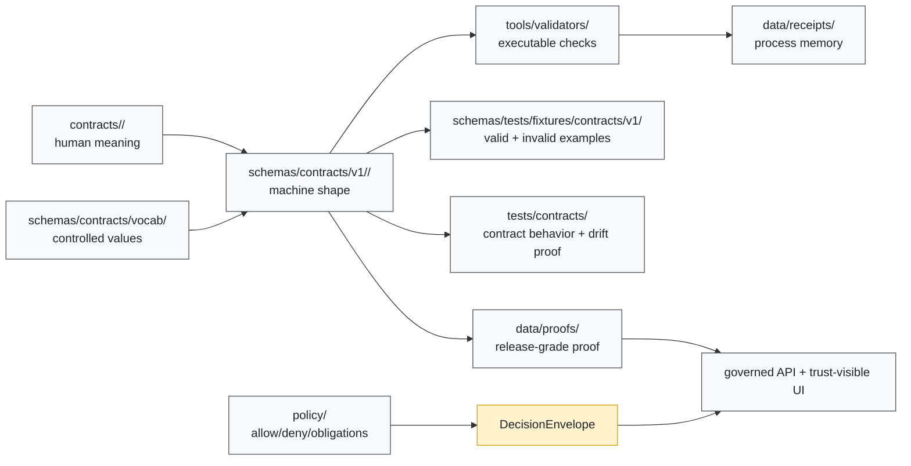

<!-- [KFM_META_BLOCK_V2]
doc_id: kfm://doc/NEEDS-VERIFICATION
title: schemas/contracts/v1
type: standard
version: v1
status: draft
owners: @bartytime4life
created: NEEDS-VERIFICATION
updated: 2026-04-22
policy_label: NEEDS-VERIFICATION
related: [../../README.md, ../README.md, ../vocab/README.md, ../../tests/README.md, ../../../contracts/README.md, ../../../policy/README.md, ../../../tests/contracts/README.md, ../../../tools/validators/README.md, ../../../data/receipts/README.md, ../../../data/proofs/README.md, ../../../docs/standards/README.md, ./common/header_profile.schema.json, ./source/source_descriptor.schema.json, ./data/dataset_version.schema.json, ./evidence/evidence_bundle.schema.json, ./policy/decision_envelope.schema.json, ./release/release_manifest.schema.json, ./runtime/runtime_response_envelope.schema.json, ./correction/correction_notice.schema.json]
tags: [kfm, schemas, contracts, v1, json-schema, evidence, policy, release, runtime, correction]
notes: [README-like standard doc for the versioned machine-contract schema family; active checkout was not mounted in this session; doc_id, created date, policy label, exact active branch contents, and final schema-home ADR status need verification; owner is based on retrieved repo-facing documentation and should be rechecked against CODEOWNERS before merge.]
[/KFM_META_BLOCK_V2] -->

<a id="top"></a>

# `schemas/contracts/v1`

Versioned machine-contract schema families for KFM trust objects: source, data, evidence, policy, release, runtime, correction, and shared headers.

> [!IMPORTANT]
> **Status:** `experimental` · **Doc status:** `draft` · **Owners:** `@bartytime4life` · **Path:** `schemas/contracts/v1/`  
> **Schema authority:** `NEEDS VERIFICATION` — this directory is a versioned machine-schema scaffold, not proof by itself that contracts are enforcement-grade.  
> **Quick jumps:** [Scope](#scope) · [Repo fit](#repo-fit) · [Inputs](#inputs) · [Exclusions](#exclusions) · [Directory tree](#directory-tree) · [Family map](#family-map) · [Quickstart](#quickstart) · [Diagram](#diagram) · [Definition of done](#definition-of-done) · [Open checks](#open-checks)
>
> 
> 
> 
> 
> 

---

## Scope

`schemas/contracts/v1/` is the **versioned machine-shape lane** for first-wave KFM contract objects.

It should answer one narrow question:

> “What structure must this v1 trust object have before validators, fixtures, policy gates, governed APIs, release tooling, or UI trust surfaces are allowed to consume it?”

It does **not** decide whether a record is publishable, sensitive, authoritative, released, or safe to expose. Those decisions belong to policy, review, receipts, proof packs, and governed release state.

### Current truth posture

| Claim | Label | Working reading |
|---|---:|---|
| This lane is part of the KFM contract/schema lattice. | **CONFIRMED** from retrieved repo-facing docs | Treat it as a real schema-family surface, not an idea scratchpad. |
| `contracts/`, `schemas/`, `policy/`, `tests/`, `tools/validators/`, `data/receipts/`, and `data/proofs/` have distinct responsibilities. | **CONFIRMED doctrine / PROPOSED enforcement** | Keep meaning, shape, permission, proof, and process memory separate. |
| First-wave schema families are visible here. | **CONFIRMED** from retrieved repo-facing docs | Family names can be referenced, but schema maturity still needs direct checkout verification. |
| File presence equals validation readiness. | **FALSE / DO NOT CLAIM** | A placeholder schema is not an enforceable contract. |
| Active branch, exact file bodies, merge-blocking checks, and platform settings are known. | **UNKNOWN** | Re-run the checks below in the mounted repo before claiming enforcement. |

[Back to top](#top)

---

## Repo fit

This README sits in the middle of KFM’s trust-object control plane.

| Direction | Surface | Role |
|---|---|---|
| Parent schema boundary | [`../../README.md`](../../README.md) | Explains the broader `schemas/` subtree and its relationship to contracts, fixtures, standards, and workflows. |
| Parent contract-schema lane | [`../README.md`](../README.md) | Defines the `schemas/contracts/` family and its v1 / vocab split. |
| Shared vocabulary | [`../vocab/README.md`](../vocab/README.md) | Holds reason, obligation, reviewer-role, and other controlled-value registries when represented as schema-side JSON. |
| Schema-side fixtures | [`../../tests/README.md`](../../tests/README.md) | Nested fixture scaffold for schema-adjacent valid/invalid examples. |
| Human contract meaning | [`../../../contracts/README.md`](../../../contracts/README.md) | Defines what trust-bearing objects mean and where human-readable contract doctrine lives. |
| Policy authority | [`../../../policy/README.md`](../../../policy/README.md) | Owns allow/deny/abstain/hold behavior, obligations, sensitivity decisions, and publication controls. |
| Contract-facing tests | [`../../../tests/contracts/README.md`](../../../tests/contracts/README.md) | Proves valid and invalid object behavior, schema drift, and negative paths. |
| Validator implementation | [`../../../tools/validators/README.md`](../../../tools/validators/README.md) | Executes shape, linkage, promotion, and domain-specific checks. |
| Process memory | [`../../../data/receipts/README.md`](../../../data/receipts/README.md) | Stores run, validation, ingest, model, and other receipt instances. |
| Release-grade proof | [`../../../data/proofs/README.md`](../../../data/proofs/README.md) | Stores proof-bearing release/correction/publication artifacts. |
| Standards and authoring | [`../../../docs/standards/README.md`](../../../docs/standards/README.md) | Keeps markdown, schema, and governance documentation expectations aligned. |
| Workflow boundary | [`../../../.github/workflows/README.md`](../../../.github/workflows/README.md) | Documents automation intent; exact checked-in YAML and branch enforcement remain `NEEDS VERIFICATION`. |

### Division of labor

| Surface | Owns | Must not silently do |
|---|---|---|
| `contracts/` | Human-readable meaning, lifecycle role, field-family rationale | Pretend to be machine validation by prose alone |
| `schemas/contracts/v1/` | Machine-readable structural shape for v1 objects | Decide policy, rights, sensitivity, or release safety |
| `policy/` | Permission, denial, obligations, sensitivity, publication controls | Hide schema shape requirements |
| `tests/contracts/` | Valid/invalid contract behavior and drift proof | Become the canonical schema registry |
| `tools/validators/` | Executable checks and reports | Create hidden policy or hidden publication paths |
| `data/receipts/` | Process memory and run facts | Replace proof packs or canonical records |
| `data/proofs/` | Release-grade proof and verification artifacts | Replace source evidence or schema definitions |

[Back to top](#top)

---

## Inputs

The following belong in this directory **only when they are versioned machine-contract schemas**.

| Accepted input | Examples | Required posture |
|---|---|---|
| JSON Schema or equivalent machine-shape definitions for v1 trust objects | `source_descriptor.schema.json`, `evidence_bundle.schema.json` | Must link back to human contract meaning and tests. |
| Shared structural profiles used by multiple object families | `common/header_profile.schema.json` | Must remain generic enough to avoid domain-specific leakage. |
| Family README updates that clarify schema placement | Child README updates under `runtime/`, `source/`, etc. | Must preserve unresolved authority notes until ADRs settle them. |
| Additive v1-compatible schema evolution | New optional field, tighter description, added `$defs` | Must include fixtures and validator/test impact notes. |
| Explicit compatibility notes for v1 consumers | Deprecation warnings, successor references | Must avoid deleting or breaking prior valid examples without review. |

> [!TIP]
> A good schema PR touches more than a schema. It usually updates a human contract page, valid/invalid fixtures, validator notes, tests, and this README’s family map.

[Back to top](#top)

---

## Exclusions

| Does **not** belong here | Put it here instead |
|---|---|
| Human-readable doctrine for what a contract object means | [`../../../contracts/README.md`](../../../contracts/README.md) and the relevant contract lane |
| Policy bundles, Rego rules, publication decisions, reason/obligation law | [`../../../policy/README.md`](../../../policy/README.md) |
| Root-level contract tests, drift checks, runtime proof cases | [`../../../tests/contracts/README.md`](../../../tests/contracts/README.md) and [`../../../tests/e2e/README.md`](../../../tests/e2e/README.md) |
| Schema-side valid/invalid fixture payloads | [`../../tests/README.md`](../../tests/README.md), unless repo ADR moves fixture authority |
| Run receipts, ingest receipts, validation receipts, AI receipts | [`../../../data/receipts/README.md`](../../../data/receipts/README.md) |
| Release proof packs, signature bundles, public proof objects | [`../../../data/proofs/README.md`](../../../data/proofs/README.md) |
| Source data, raw extracts, quarantined inputs, derived map tiles | Governed `data/` lifecycle zones, not this schema directory |
| Runtime app code, evidence resolvers, UI components, model adapters | `apps/`, `packages/`, or another implementation lane after repo inspection |
| Claims that v1 is fully enforced end to end | Nowhere until schema bodies, fixtures, validators, tests, workflows, and proof artifacts are directly verified |

[Back to top](#top)

---

## Directory tree

### Current documented family shape

```text
schemas/contracts/v1/
├── README.md
├── common/
│   └── header_profile.schema.json
├── correction/
│   └── correction_notice.schema.json
├── data/
│   └── dataset_version.schema.json
├── evidence/
│   └── evidence_bundle.schema.json
├── policy/
│   └── decision_envelope.schema.json
├── release/
│   └── release_manifest.schema.json
├── runtime/
│   └── runtime_response_envelope.schema.json
└── source/
    └── source_descriptor.schema.json
```

> [!WARNING]
> The tree above is a documented scaffold signal. Re-check it in the active checkout before merge:
>
> ```bash
> find schemas/contracts/v1 -maxdepth 3 -type f | sort
> ```

### Adjacent schema-side companions

```text
schemas/contracts/
├── v1/
│   └── ...
└── vocab/
    ├── obligation_codes.json
    ├── reason_codes.json
    └── reviewer_roles.json

schemas/tests/
└── fixtures/
    └── contracts/
        └── v1/
            ├── invalid/
            └── valid/
```

[Back to top](#top)

---

## Family map

| Family | Current schema file | Primary purpose | Minimum companion burden |
|---|---|---|---|
| `common/` | [`./common/header_profile.schema.json`](./common/header_profile.schema.json) | Shared header/profile fields such as schema version, object type, identifiers, audit references, timestamps, and policy labels. | Cross-family examples; no domain-specific meaning hidden here. |
| `source/` | [`./source/source_descriptor.schema.json`](./source/source_descriptor.schema.json) | Declares source identity, steward/owner, authority role, rights posture, cadence, support, validation plan, citation guidance, and publication intent. | Source-admission contract page, valid/invalid descriptors, connector/admission validator. |
| `data/` | [`./data/dataset_version.schema.json`](./data/dataset_version.schema.json) | Carries versioned candidate or promoted subject-set identity, temporal basis, support, provenance, and release readiness. | Dataset-version fixtures, lineage checks, catalog/promotion validator references. |
| `evidence/` | [`./evidence/evidence_bundle.schema.json`](./evidence/evidence_bundle.schema.json) | Packages EvidenceRefs and support for a claim, feature, story, export preview, or runtime answer. | Bundle fixtures, citation-resolution tests, rights/sensitivity and correction-lineage checks. |
| `policy/` | [`./policy/decision_envelope.schema.json`](./policy/decision_envelope.schema.json) | Expresses machine-readable policy decision state: outcome, reason codes, obligation codes, policy basis, scope, actor/reviewer, audit reference, effective window. | Policy fixtures, reason/obligation registry links, deny/abstain negative tests. |
| `release/` | [`./release/release_manifest.schema.json`](./release/release_manifest.schema.json) | Binds outward release scope to assets, distributions, digests, catalog refs, proof refs, review state, rollback posture, and correction posture. | Release manifest examples, proof-pack links, rollback/correction drills. |
| `runtime/` | [`./runtime/runtime_response_envelope.schema.json`](./runtime/runtime_response_envelope.schema.json) | Makes governed API and Focus/Drawer runtime outcomes inspectable, finite, citation-aware, policy-aware, and auditable. | Golden examples for `ANSWER`, `ABSTAIN`, `DENY`, `ERROR`; runtime proof fixtures; citation validation. |
| `correction/` | [`./correction/correction_notice.schema.json`](./correction/correction_notice.schema.json) | Preserves visible lineage for supersession, withdrawal, replacement releases, stale surfaces, rebuild refs, public note, and correction cause. | Correction fixtures, stale-state drills, release/correction crosslinks. |

### First-wave review rule

A first-wave schema is **not done** when the file exists.

It is done when the object family has:

1. a human-readable contract,
2. a machine schema,
3. at least one valid fixture,
4. at least one invalid fixture,
5. a validator or test reference,
6. policy/vocabulary links where decisions or obligations are involved,
7. release/correction implications documented where applicable.

[Back to top](#top)

---

## Quickstart

Use these commands from the repository root.

### 1. Inspect the schema lane

```bash
find schemas/contracts/v1 -maxdepth 3 -type f | sort
find schemas/contracts/vocab -maxdepth 2 -type f 2>/dev/null | sort
find schemas/tests/fixtures/contracts/v1 -maxdepth 3 -type f 2>/dev/null | sort
```

### 2. Inspect adjacent authority surfaces

```bash
find contracts policy tests/contracts tools/validators data/receipts data/proofs -maxdepth 3 -type f 2>/dev/null | sort
```

### 3. Check schema files are parseable JSON

```bash
python - <<'PY'
import json
from pathlib import Path

root = Path("schemas/contracts/v1")
failures = []

for path in sorted(root.rglob("*.json")):
    try:
        json.loads(path.read_text(encoding="utf-8"))
    except Exception as exc:
        failures.append((str(path), str(exc)))

if failures:
    for path, error in failures:
        print(f"FAIL {path}: {error}")
    raise SystemExit(1)

print("OK: all schemas/contracts/v1 JSON files parsed")
PY
```

### 4. Search for authority drift before adding files

```bash
git grep -nE \
  "schema[-_ ]home|canonical schema|machine contract|SourceDescriptor|EvidenceBundle|DecisionEnvelope|RuntimeResponseEnvelope|CorrectionNotice|ReleaseManifest" \
  -- contracts schemas docs policy tests tools .github 2>/dev/null
```

### 5. Validate with the repo-native runner

```bash
# NEEDS VERIFICATION:
# Replace this with the mounted repo's actual validation command once confirmed.
# Examples may include pytest, pnpm, make, uv, tox, or a repo-local validator wrapper.
```

[Back to top](#top)

---

## Diagram



Reading rule: schemas define **shape**. They do not substitute for evidence, policy, validation, review, promotion, or proof.

[Back to top](#top)

---

## Versioning rules

| Change type | v1 handling | Review burden |
|---|---|---|
| Add optional descriptive field | Usually compatible | Update fixtures and downstream readers if the field is surfaced. |
| Add required field | Potentially breaking | Requires ADR or explicit compatibility note, invalid-fixture update, validator update, and downstream migration plan. |
| Tighten enum or controlled vocabulary | Potentially breaking | Coordinate with `schemas/contracts/vocab/`, `policy/`, fixtures, and validators. |
| Change object meaning | Not a schema-only change | Update human contract docs first; policy/release review may be required. |
| Change publication, correction, or runtime outcome semantics | Trust-surface change | Requires proof/correction/runtime tests and release note. |
| Remove or rename a field | Breaking | Prefer v2 or deprecation window; preserve v1 consumers unless the ADR says otherwise. |

> [!CAUTION]
> Do not “fix” schema-home ambiguity by duplicating divergent definitions in both `contracts/` and `schemas/`. Resolve the authority question explicitly, then keep the two surfaces synchronized by role.

[Back to top](#top)

---

## Definition of done

Before a PR touching `schemas/contracts/v1/` is ready for review:

- [ ] The active checkout confirms the target path and family directory exist, or the PR creates them deliberately.
- [ ] The schema file parses as JSON.
- [ ] The schema uses a clear `$schema`, `$id` or equivalent identifier strategy once the repo’s convention is verified.
- [ ] The schema names its object family and version.
- [ ] The human contract page is linked or created.
- [ ] At least one valid fixture exists or is explicitly deferred with a tracked reason.
- [ ] At least one invalid fixture exists for the highest-risk failure mode.
- [ ] A contract-facing test or validator reference is linked.
- [ ] Policy, reason codes, obligation codes, reviewer roles, or sensitivity rules are linked when relevant.
- [ ] Release, correction, rollback, receipt, and proof implications are documented when the object affects publication or runtime behavior.
- [ ] The change is additive, or a versioning / migration / ADR path is included.
- [ ] This README’s family map is updated when a family is added, renamed, or materially changed.

[Back to top](#top)

---

## Open checks

| Check | Status | Why it remains open |
|---|---:|---|
| `doc_id` for this README | **NEEDS VERIFICATION** | No mounted document registry was available in this session. |
| Created date | **NEEDS VERIFICATION** | Existing file creation history was not available. |
| Policy label | **NEEDS VERIFICATION** | Public visibility is not the same as an approved policy label. |
| CODEOWNERS coverage for `/schemas/` | **NEEDS VERIFICATION** | Retrieved docs indicate `@bartytime4life`, but a narrower active-branch rule must be checked. |
| Schema-home ADR | **NEEDS VERIFICATION** | KFM docs repeatedly identify `contracts/` vs `schemas/contracts/` authority as unresolved or requiring explicit division of labor. |
| Exact v1 schema bodies | **NEEDS VERIFICATION** | Retrieved docs describe scaffold / placeholder-heavy state; active file contents must be reopened. |
| Fixture-home authority | **NEEDS VERIFICATION** | Schema-side fixtures and root contract tests both appear in the documentation lattice. |
| Merge-blocking validation | **UNKNOWN** | Workflow YAML, branch protection, and CI enforcement were not directly verified. |
| Runtime envelope negative-path proof | **UNKNOWN** | Golden examples for `ANSWER`, `ABSTAIN`, `DENY`, and `ERROR` must be surfaced before runtime enforcement claims. |

[Back to top](#top)

---

## Appendix

<details>
<summary><strong>Appendix A — Contract-family glossary</strong></summary>

| Object family | Short meaning | Typical schema home |
|---|---|---|
| `SourceDescriptor` | Admission contract for a source, endpoint, dataset, or source family. | `source/` |
| `IngestReceipt` | Process-memory record that a fetch or landing event occurred. | `source/`, `data/`, or a future receipt family once ADR-settled |
| `ValidationReport` | Machine-readable result of validation checks. | `data/`, `policy/`, or future reports family once ADR-settled |
| `DatasetVersion` | Versioned candidate or promoted dataset identity. | `data/` |
| `CatalogClosure` | STAC / DCAT / PROV and release-linked metadata closure. | future catalog or release family once ADR-settled |
| `DecisionEnvelope` | Policy-significant decision and obligation carrier. | `policy/` |
| `ReviewRecord` | Human review, approval, denial, escalation, or note record. | future governance/review family once ADR-settled |
| `ReleaseManifest` | Release scope, assets, proof refs, and rollback/correction posture. | `release/` |
| `ProjectionBuildReceipt` | Process memory for derived tiles, indexes, graph projections, scenes, or other rebuildable projections. | future receipt/projection family once ADR-settled |
| `EvidenceBundle` | Evidence support package for a claim, feature, story, export, or answer. | `evidence/` |
| `RuntimeResponseEnvelope` | Accountable outward response wrapper for governed API / Focus / UI surfaces. | `runtime/` |
| `CorrectionNotice` | Visible lineage object for correction, supersession, withdrawal, or stale-public-surface handling. | `correction/` |

</details>

<details>
<summary><strong>Appendix B — Reviewer prompts</strong></summary>

Use these prompts when reviewing schema PRs:

- Does this schema validate only structure, or is it accidentally encoding policy?
- Is the human contract page updated with the same object meaning?
- Are reason codes and obligation codes drawn from a controlled registry instead of free text?
- Does every public-facing runtime or release object resolve back to evidence and policy state?
- Are rights, sensitivity, review state, and correction posture represented where needed?
- Is a placeholder schema being described as enforceable?
- Are valid and invalid fixtures realistic enough to catch the failure this contract is meant to prevent?
- Does the change preserve `RAW -> WORK/QUARANTINE -> PROCESSED -> CATALOG/TRIPLET -> PUBLISHED`?
- Would a normal public client still use governed APIs and released artifacts rather than canonical/internal stores?

</details>

[Back to top](#top)
