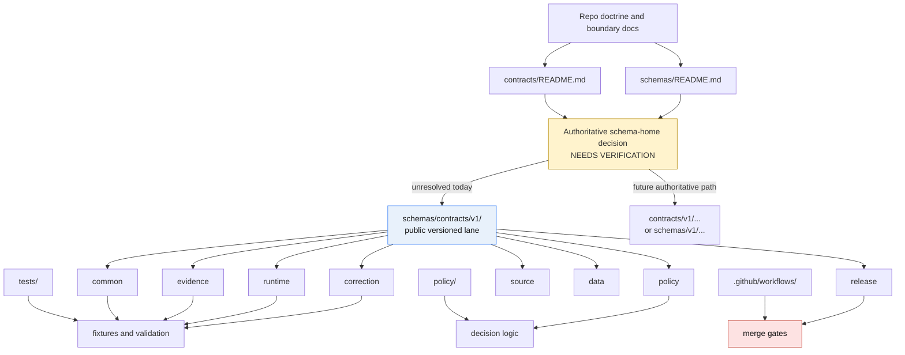

<!-- [KFM_META_BLOCK_V2]
doc_id: kfm://doc/NEEDS-VERIFICATION
title: schemas/contracts/v1
type: standard
version: v1
status: draft
owners: @bartytime4life
created: YYYY-MM-DD
updated: 2026-03-24
policy_label: NEEDS-VERIFICATION
related: [../README.md, ../../README.md, ../../../contracts/README.md, ../../../docs/standards/README.md, ../../../tests/README.md, ../../../policy/README.md, ../../../.github/workflows/README.md]
tags: [kfm, schemas, contracts, v1]
notes: [Owner uses CODEOWNERS global fallback, created date and doc_id need verification, authoritative schema home is still unresolved in current public evidence]
[/KFM_META_BLOCK_V2] -->

# `schemas/contracts/v1`
Versioned boundary guide and current-state index for the public `schemas/contracts/v1/` contract-family lane.

> [!IMPORTANT]
> **Status:** experimental · **Owners:** `@bartytime4life` · **Path:** `schemas/contracts/v1/README.md`  
> **Current role:** this file should describe the public `schemas/contracts/v1/` subtree honestly **without** pretending that schema-home authority is already settled.


**Quick jumps:** [Scope](#scope) · [Repo fit](#repo-fit) · [Inputs](#inputs) · [Exclusions](#exclusions) · [Current verified snapshot](#current-verified-snapshot) · [Directory tree](#directory-tree) · [Quickstart](#quickstart) · [Usage](#usage) · [Diagram](#diagram) · [Family registry](#family-registry) · [Definition of done](#definition-of-done) · [FAQ](#faq) · [Appendix](#appendix)

---

## Scope

This directory is the **versioned public lane** for the first-wave contract families currently exposed under `schemas/contracts/v1/`.

In its current repo-facing form, this README should do four jobs:

1. record what the public tree actually contains;
2. keep schema-home ambiguity visible rather than smoothing it away;
3. prevent silent duplication between `schemas/` and `contracts/`; and
4. give contributors a safe review path while the repo moves from scaffolded structure toward machine-checkable contract enforcement.

### Status vocabulary used here

| Label | Meaning in this file |
|---|---|
| **CONFIRMED** | Directly visible in the current public repo surface. |
| **INFERRED** | Strongly suggested by adjacent docs, but not directly proven here. |
| **PROPOSED** | Recommended working pattern, not current-state fact. |
| **UNKNOWN** | Not verified from the current public evidence reviewed for this revision. |
| **NEEDS VERIFICATION** | A specific value or authority decision is still open and should be checked before treating it as settled. |

[Back to top](#schemascontractsv1)

## Repo fit

| Field | Value |
|---|---|
| **Path** | `schemas/contracts/v1/README.md` |
| **Audience** | Maintainers working on machine contracts, contract-family documentation, schema-home reconciliation, and test/CI follow-through. |
| **Immediate parent** | `../README.md` |
| **Upstream context** | `../../README.md`, `../../../contracts/README.md`, `../../../docs/standards/README.md` |
| **Adjacent enforcement surfaces** | `../../../tests/README.md`, `../../../policy/README.md`, `../../../.github/workflows/README.md` |
| **Downstream family lanes** | `./common/`, `./correction/`, `./data/`, `./evidence/`, `./policy/`, `./release/`, `./runtime/`, `./source/` |

### Upstream and downstream relationships

- **Upstream doctrine / boundary docs**
  - [`../../README.md`](../../README.md)
  - [`../README.md`](../README.md)
  - [`../../../contracts/README.md`](../../../contracts/README.md)
  - [`../../../docs/standards/README.md`](../../../docs/standards/README.md)
- **Operationally adjacent docs**
  - [`../../../tests/README.md`](../../../tests/README.md)
  - [`../../../policy/README.md`](../../../policy/README.md)
  - [`../../../.github/workflows/README.md`](../../../.github/workflows/README.md)
- **Downstream family indexes / files**
  - [`./common/`](./common/)
  - [`./correction/`](./correction/)
  - [`./data/`](./data/)
  - [`./evidence/`](./evidence/)
  - [`./policy/`](./policy/)
  - [`./release/`](./release/)
  - [`./runtime/`](./runtime/)
  - [`./source/`](./source/)

> [!WARNING]
> **Do not read this path as automatic proof of authority.** Current public repo evidence still shows competing schema surfaces (`schemas/` and `contracts/`) and cross-doc tension about which one is canonical. This README must preserve that tension until an explicit ADR or equivalent repo decision resolves it.

[Back to top](#schemascontractsv1)

## Inputs

### Accepted inputs

This directory should accept only material that clearly belongs to the `v1` contract-family lane.

| Accepted here | Why |
|---|---|
| Version-local README improvements | Keeps the lane navigable and reviewable. |
| Version-local inventory updates | Records current public reality as the tree changes. |
| Links to family-specific schema files already present in this subtree | Keeps navigation local and predictable. |
| Authority notes and reconciliation guidance | This lane sits in an unresolved schema-home boundary. |
| Family-level documentation that explains purpose, status, and next verification burden | Helpful without inventing implementation maturity. |
| Generated or mirrored outputs **only if** the repo later formalizes that pattern | Safe if the authority decision explicitly supports it. |

### Expected inputs before this lane becomes strong

If this subtree is going to become more than scaffold:

1. the repo needs one authoritative schema-home decision;
2. family files need substantive JSON Schema bodies rather than placeholders;
3. valid and invalid fixtures need to exist and be linkable to tests; and
4. workflow automation needs to prove these files actually gate trust-bearing changes.

[Back to top](#schemascontractsv1)

## Exclusions

This directory should **not** become a grab-bag contract graveyard.

| Excluded from this path | Put it here instead |
|---|---|
| Competing canonical copies of the same trust-bearing family in both `schemas/` and `contracts/` | Resolve schema authority first, then keep only the authoritative copy plus any explicitly declared mirror/pointer strategy. |
| Policy bundles, rule code, or review logic | `../../../policy/` |
| Fixture inventories, regression packs, or runnable test harnesses | `../../../tests/` |
| Workflow YAML and merge-gate mechanics | `../../../.github/workflows/` |
| Release proof packs, manifests, rollback drill outputs | release / proof-pack lanes defined by release and operations docs, not here |
| UI payload examples that are really product-surface contracts | app / shell contract lanes once those are explicitly defined |
| Domain-specific semantics, ETL notes, or publication policies | domain, pipeline, or policy docs |

> [!CAUTION]
> This directory should not silently absorb governance work that belongs to policy, tests, workflows, or release evidence. A tidy-looking folder that hides boundary mixing is worse than an incomplete one that states its limits plainly.

[Back to top](#schemascontractsv1)

## Current verified snapshot

The current public repo surface shows that `schemas/contracts/v1/` is **no longer only an idea**: the subtree exists and contains the first-wave family names. At the same time, the surrounding docs still do **not** prove that this lane is the canonical machine-contract home.

### What is currently visible

| Surface | Current state |
|---|---|
| `schemas/contracts/v1/` directory | **CONFIRMED** present |
| Family subdirectories | **CONFIRMED**: `common`, `correction`, `data`, `evidence`, `policy`, `release`, `runtime`, `source` |
| Family README files | **CONFIRMED** present in at least the reviewed family directories; current visible pattern is scaffold-style README text |
| Placeholder schema bodies | **CONFIRMED** for several first-wave files reviewed directly; see registry below |
| Authoritative schema-home decision | **UNKNOWN / NEEDS VERIFICATION** |
| Runnable fixtures linked to this lane | **UNKNOWN** from this path alone |
| Merge-blocking workflow YAML enforcing this lane | **UNKNOWN** from this path alone; adjacent workflow docs currently describe placeholder-only workflow inventory |

### Boundary note: current cross-doc tension

There is an important current-state mismatch that this README should preserve instead of smoothing away:

- the public tree now exposes a real `schemas/contracts/v1/` subtree;
- top-level schema guidance still warns about dual schema surfaces and unresolved authority; and
- adjacent docs point machine contracts toward `contracts/` while this `schemas/`-side versioned lane is already present.

That means this README must behave as an **honest inventory and boundary guide**, not as a premature declaration that the ambiguity is over.

[Back to top](#schemascontractsv1)

## Directory tree

```text
schemas/contracts/
├── README.md
├── vocab/
└── v1/
    ├── README.md
    ├── common/
    │   ├── README.md
    │   └── header_profile.schema.json
    ├── correction/
    │   ├── README.md
    │   └── correction_notice.schema.json
    ├── data/
    │   ├── README.md
    │   └── dataset_version.schema.json
    ├── evidence/
    │   ├── README.md
    │   └── evidence_bundle.schema.json
    ├── policy/
    │   ├── README.md
    │   └── decision_envelope.schema.json
    ├── release/
    │   ├── README.md
    │   └── release_manifest.schema.json
    ├── runtime/
    │   ├── README.md
    │   └── runtime_response_envelope.schema.json
    └── source/
        ├── README.md
        └── source_descriptor.schema.json
```

### Reading rule for the tree

- Tree presence is **CONFIRMED**.
- Tree presence is **not** the same thing as substantive contract maturity.
- Where a raw file body was directly re-opened in this revision and was still `{}`, that is called out in the registry below.
- Where a filename was confirmed through directory listing but the body was not re-opened in this revision, this README marks it **NEEDS VERIFICATION** instead of guessing.

[Back to top](#schemascontractsv1)

## Quickstart

Use this path first as an inspection lane, not as a place to assume contract maturity.

```bash
# 1) Inventory the v1 lane
find schemas/contracts/v1 -maxdepth 3 -type f | sort

# 2) Compare the schemas-side lane with the contracts-side docs
find contracts -maxdepth 3 -type f | sort

# 3) Inspect adjacent trust surfaces before editing schemas
find tests -maxdepth 3 -type f | sort
find policy -maxdepth 3 -type f | sort
find .github/workflows -maxdepth 2 -type f | sort

# 4) Re-open the boundary docs that govern how this lane should be read
sed -n '1,220p' schemas/README.md
sed -n '1,220p' schemas/contracts/README.md
sed -n '1,220p' contracts/README.md
sed -n '1,220p' docs/standards/README.md
```

### Safe review sequence

1. Re-read `schemas/README.md` and `contracts/README.md`.
2. Confirm whether an ADR or equivalent repo decision has resolved schema authority.
3. Inspect whether the file you want to edit is still placeholder-only.
4. Check for tests, fixtures, and workflow hooks that would prove the file matters operationally.
5. Only then decide whether the change belongs here, in `contracts/`, or in a non-schema lane.

> [!TIP]
> If you cannot say which directory is authoritative **before** you edit a trust-bearing family, pause and resolve that question first. Silent duplication is harder to unwind than a deliberate delay.

[Back to top](#schemascontractsv1)

## Usage

### Recommended use right now

Use this README as:

- a versioned index for the current public `schemas/contracts/v1/` tree;
- a warning surface against schema-home drift;
- a contributor checkpoint before adding or expanding any trust-bearing family; and
- a reconciliation aid between scaffolded repo structure and actual machine-enforced contract work.

### Recommended use after authority is resolved

| If `schemas/` becomes authoritative | If `contracts/` becomes authoritative |
|---|---|
| Expand this README into the normative v1 contract index and keep `contracts/` as pointer/generated output only if explicitly declared. | Convert this README into a pointer or mirror guide and move normative contract maintenance to `contracts/`-side versioned lanes. |

### Update rules

- Keep relative links stable.
- Prefer **small, reviewable updates** over wholesale rewrites.
- Do not remove explicit uncertainty labels until public evidence supports the stronger claim.
- When a schema body becomes substantive, update the family registry and note the first linked fixture/test surface.
- When workflow enforcement lands, add the exact workflow file and validation command to this README.

[Back to top](#schemascontractsv1)

## Diagram



### Interpretation

The diagram is intentionally conservative:

- `schemas/contracts/v1/` is shown as a **real public lane**;
- the authority decision is still highlighted as unresolved; and
- tests, policy, and workflows remain separate surfaces that must exist before this lane can honestly be called enforced.

[Back to top](#schemascontractsv1)

## Family registry

| Family | Path | Public visibility | Current note |
|---|---|---|---|
| Common | [`./common/header_profile.schema.json`](./common/header_profile.schema.json) | **CONFIRMED** | Raw body inspected in this revision and currently `{}`. |
| Policy | [`./policy/decision_envelope.schema.json`](./policy/decision_envelope.schema.json) | **CONFIRMED** | Raw body inspected in this revision and currently `{}`. |
| Evidence | [`./evidence/evidence_bundle.schema.json`](./evidence/evidence_bundle.schema.json) | **CONFIRMED** | Raw body inspected in this revision and currently `{}`. |
| Runtime | [`./runtime/runtime_response_envelope.schema.json`](./runtime/runtime_response_envelope.schema.json) | **CONFIRMED** | Raw body inspected in this revision and currently `{}`. |
| Correction | [`./correction/correction_notice.schema.json`](./correction/correction_notice.schema.json) | **CONFIRMED** | Raw body inspected in this revision and currently `{}`. |
| Release | [`./release/release_manifest.schema.json`](./release/release_manifest.schema.json) | **CONFIRMED** | Raw body inspected in this revision and currently `{}`. |
| Source | [`./source/source_descriptor.schema.json`](./source/source_descriptor.schema.json) | **CONFIRMED** | Filename confirmed through directory listing; body **NEEDS VERIFICATION** in this revision. |
| Data | [`./data/dataset_version.schema.json`](./data/dataset_version.schema.json) | **CONFIRMED** | Filename confirmed through directory listing; body **NEEDS VERIFICATION** in this revision. |

### Why this registry matters

This table is meant to stop a common documentation failure mode: a versioned contract lane can look mature from folder names alone even when the actual schema bodies are still placeholders.

[Back to top](#schemascontractsv1)

## Definition of done

A revision to this README is in good shape when the following are true:

- [ ] title, path, and quick jumps all match the file’s actual role;
- [ ] current public tree contents are described honestly;
- [ ] schema-home ambiguity is visible, not hidden;
- [ ] relative links resolve to adjacent repo docs;
- [ ] the directory tree matches the public branch snapshot being described;
- [ ] the family registry distinguishes **present**, **placeholder**, and **needs verification** states;
- [ ] no section implies live schema enforcement, fixtures, or workflow gates without evidence;
- [ ] the Mermaid diagram still reflects the actual boundary condition;
- [ ] contributors can tell what belongs here and what belongs elsewhere;
- [ ] any future authority decision can be merged into this file without a full rewrite.

### Review gates for maintainers

| Gate | Pass condition |
|---|---|
| **Truth gate** | No unsupported authority claim slips in. |
| **Boundary gate** | The file does not blur `schemas/`, `contracts/`, `tests/`, `policy/`, and workflow responsibilities. |
| **Navigation gate** | A new maintainer can find every family lane and its adjacent docs quickly. |
| **Drift gate** | The file would make silent duplication harder, not easier. |

[Back to top](#schemascontractsv1)

## FAQ

### Is `schemas/contracts/v1/` the canonical machine-contract home?

**UNKNOWN / NEEDS VERIFICATION.** The public tree now contains this versioned lane, but surrounding repo docs still record unresolved schema-home authority and point machine contracts toward `contracts/` in at least one adjacent standards surface.

### Why not just rewrite this as a normative contract spec index right now?

Because the current public evidence does not yet prove that this side of the repo is the canonical trust-bearing schema home, and several reviewed schema bodies are still placeholder-only.

### Should new schemas be added here today?

Only after checking authority, adjacent docs, and enforcement surfaces. A new file in the wrong home is not harmless scaffolding if reviewers later treat it as contract law.

### Why are placeholder bodies called out so directly?

Because this repo’s doctrine is evidence-first and anti-theater. A directory can be useful while still being visibly incomplete.

### What should happen when the ADR lands?

Update this README immediately:

- if this lane becomes authoritative, convert it into the normative `v1` index;
- if `contracts/` becomes authoritative, convert this lane into an explicit pointer/mirror guide; and
- in either case, remove ambiguity **only after** the authority decision is public and linkable.

[Back to top](#schemascontractsv1)

## Appendix

<details>
<summary><strong>Observed public files in this lane</strong></summary>

### Reviewed directly in this revision

- `./common/header_profile.schema.json`
- `./policy/decision_envelope.schema.json`
- `./evidence/evidence_bundle.schema.json`
- `./runtime/runtime_response_envelope.schema.json`
- `./correction/correction_notice.schema.json`
- `./release/release_manifest.schema.json`

### Confirmed by directory listing in this revision

- `./source/source_descriptor.schema.json`
- `./data/dataset_version.schema.json`
- family README files under the reviewed family lanes

### Still open for later verification

- whether this subtree is authoritative, mirrored, or transitional;
- whether fixtures exist and bind to this subtree;
- whether policy bundles or workflow gates consume this lane directly;
- whether top-level `schemas/README.md` will be updated to reflect the now-public subtree.

</details>

<details>
<summary><strong>Contributor checklist before editing a trust-bearing family</strong></summary>

1. Re-open `contracts/README.md` and `schemas/README.md`.
2. Confirm whether an ADR or equivalent repo decision now resolves schema home.
3. Inspect the target schema body instead of assuming it is substantive.
4. Check for fixtures and workflow validation.
5. Update this README if the public inventory or authority posture changes.

</details>

---

This README should remain intentionally honest: **useful now, stronger later, and never more certain than the repo evidence allows.**
