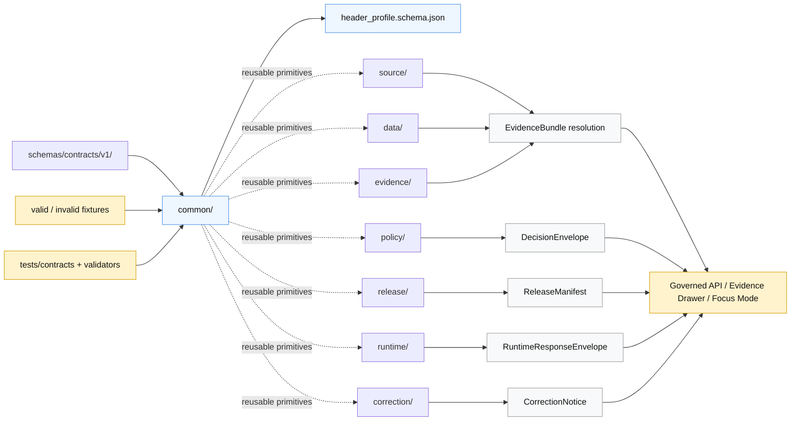

<!-- [KFM_META_BLOCK_V2]
doc_id: kfm://doc/<TODO-VERIFY-UUID>
title: common
type: standard
version: v1
status: draft
owners: <TODO-VERIFY-OWNERS>
created: <TODO-VERIFY-CREATED-DATE>
updated: 2026-04-23
policy_label: <TODO-VERIFY-POLICY-LABEL>
related: [../README.md, ../../README.md, ../../../README.md, ../../vocab/README.md, ../../../../contracts/README.md, ../../../../policy/README.md, ../../../../tests/contracts/README.md, ../../../tests/fixtures/contracts/v1/README.md]
tags: [kfm, schemas, contracts, common]
notes: [doc_id owners created date and policy label need repository verification, common lane is for cross-family primitives only, schema-home authority remains review-sensitive until ADR or mounted repo evidence confirms it]
[/KFM_META_BLOCK_V2] -->

<a id="top"></a>

# `common`

Shared, lane-agnostic schema primitives for the KFM v1 contract surface.

> **Status:** experimental  
> **Owners:** `<TODO-VERIFY-OWNERS>`  
> **Path:** `schemas/contracts/v1/common/`  
> **Repo fit:** child lane of [`../README.md`](../README.md) inside the versioned contract-schema family; upstream schema context at [`../../README.md`](../../README.md) and [`../../../README.md`](../../../README.md); adjacent human contract context at [`../../../../contracts/README.md`](../../../../contracts/README.md); downstream fixture and verification pressure at [`../../../tests/fixtures/contracts/v1/README.md`](../../../tests/fixtures/contracts/v1/README.md) and [`../../../../tests/contracts/README.md`](../../../../tests/contracts/README.md).  
>    

**Quick jumps:** [Scope](#scope) · [Repo fit](#repo-fit) · [Inputs](#accepted-inputs) · [Exclusions](#exclusions) · [Directory tree](#directory-tree) · [Usage](#usage) · [Diagram](#diagram) · [Definition of done](#definition-of-done) · [FAQ](#faq)

---

## Scope

`common/` is the narrowest shared schema lane under `schemas/contracts/v1/`.

It should hold only **small, reusable primitives** that multiple contract families can import without weakening family boundaries. A common schema is appropriate here only when moving it into a domain, runtime, evidence, policy, release, source, data, or correction lane would cause duplication or field drift across the v1 contract surface.

> [!IMPORTANT]
> “Common” does **not** mean “miscellaneous.”  
> If a schema carries policy meaning, evidence meaning, release meaning, source authority, runtime outcome, correction lineage, or domain semantics, it belongs in the owning sibling lane, not here.

### Current evidence snapshot

| Item | Status | README posture |
| --- | --- | --- |
| `schemas/contracts/v1/common/` is a named v1 family lane in repo-facing documentation | **CONFIRMED from available project documentation / NEEDS VERIFICATION in mounted repo** | Treat the path as a real intended schema lane, but do not overclaim current schema maturity. |
| `header_profile.schema.json` is referenced as a visible first-wave common schema | **CONFIRMED from available project documentation / NEEDS VERIFICATION for body content** | Link and document the role without claiming deep enforcement. |
| `run_receipt` placement has appeared in multiple nearby patterns, including `common`, `receipts`, and `runtime` variants | **CONFLICTED / NEEDS VERIFICATION** | Do not settle ownership here without ADR or mounted repo evidence. |
| KFM proof-object families require valid and invalid fixtures, validators, and README mentions before maturity claims | **CONFIRMED doctrine / PROPOSED enforcement** | Keep the definition of done fixture-first and test-visible. |

[Back to top](#top)

---

## Repo fit

### Upstream authority surfaces

| Surface | Relationship to `common/` | What this README assumes |
| --- | --- | --- |
| [`../../../README.md`](../../../README.md) | Parent `schemas/` boundary | Schema docs should avoid becoming runtime, policy, or data-lifecycle docs. |
| [`../../README.md`](../../README.md) | `schemas/contracts/` boundary | Machine contracts are versioned and review-sensitive. |
| [`../README.md`](../README.md) | v1 family index | `common/` participates in the v1 contract family and should not fork naming rules. |
| [`../../vocab/README.md`](../../vocab/README.md) | Shared vocabularies | Enumerated reason, obligation, or reviewer-role vocabularies should live there unless a schema proves otherwise. |
| [`../../../../contracts/README.md`](../../../../contracts/README.md) | Human contract lane | Narrative contract semantics should remain visible outside machine schemas. |
| [`../../../../policy/README.md`](../../../../policy/README.md) | Allow, deny, abstain, rights, and sensitivity logic | Common schemas may carry references used by policy, but they do not own policy decisions. |

### Downstream dependents

| Dependent | Use of `common/` | Boundary rule |
| --- | --- | --- |
| Sibling v1 schema lanes | Import low-level reusable structures | Sibling lanes own their consequential semantics. |
| Fixtures | Exercise shared primitives with valid and invalid examples | Fixtures prove behavior; they do not create schema authority by themselves. |
| Validators | Check schema shape, references, and drift | Validators should fail closed when required common fields are malformed. |
| Governed API and UI payloads | Consume already-governed contracts | Public clients should not use `common/` as a direct data source. |
| Release and proof tooling | Reference shared identity, version, timestamp, or header profile fields | Receipts, proofs, manifests, and bundles remain separate object families. |

[Back to top](#top)

---

## Accepted inputs

This directory should accept only cross-cutting schema assets that are **small, stable, reusable, and lane-neutral**.

| Accepted input | Example | Why it belongs here | Status |
| --- | --- | --- | --- |
| Shared header/profile primitives | [`header_profile.schema.json`](./header_profile.schema.json) | Multiple contract families may need a consistent profile/header shape. | **CONFIRMED path signal / NEEDS VERIFICATION body** |
| Shared reference fragments | `schema_version`, `generated_at`, `spec_hash`, `audit_ref` definitions | Prevents every family from inventing field grammar independently. | **PROPOSED until schema body exists** |
| Shared structural constraints | object metadata, version markers, canonical hash references | Stabilizes contract shape without absorbing domain meaning. | **PROPOSED** |
| Common examples that support schema review | minimal valid/invalid header profile fixtures | Keeps Git review concrete and deterministic. | **PROPOSED** |

### Acceptance test for new common schemas

A new file belongs in `common/` only when reviewers can answer **yes** to all four questions:

1. Is the structure used by more than one v1 contract family?
2. Is the structure free of domain-specific meaning?
3. Would placing it in a sibling lane cause duplication or drift?
4. Can at least one valid and one invalid fixture prove the boundary without network access?

[Back to top](#top)

---

## Exclusions

| Do not put this here | Owning home | Why |
| --- | --- | --- |
| Source identity, source role, cadence, rights, access mode | [`../source/`](../source/) | Source authority is not a generic primitive. |
| Evidence packages, EvidenceRef resolution, citation closure | [`../evidence/`](../evidence/) | Evidence is a trust object, not a header fragment. |
| Policy decisions, reason codes, obligations, deny/abstain grammar | [`../policy/`](../policy/) and [`../../vocab/`](../../vocab/) | Policy logic and vocabularies must remain inspectable. |
| Release manifests, publication proof, rollback targets | [`../release/`](../release/) | Publication is a governed state transition. |
| Runtime response envelopes and Focus/API outcomes | [`../runtime/`](../runtime/) | Runtime outcomes carry trust-visible behavior. |
| Dataset versions or processed data identity | [`../data/`](../data/) | Data lifecycle identity is not a common utility bucket. |
| Correction notices and supersession lineage | [`../correction/`](../correction/) | Correction lineage must remain explicit. |
| Domain-specific overlays | domain lanes such as `hydrology/`, `fauna/`, `archaeology/` when present | Domain risk, sensitivity, and source roles vary by lane. |
| Fixtures, tests, validators, or generated reports | `schemas/tests/`, `tests/contracts/`, `tools/validators/` | Execution artifacts should not be mixed with schema definitions. |

[Back to top](#top)

---

## Directory tree

### Current intended lane shape

```text
schemas/contracts/v1/common/
├── README.md
└── header_profile.schema.json
```

### Nearby v1 family context

```text
schemas/contracts/v1/
├── common/
├── correction/
├── data/
├── evidence/
├── policy/
├── release/
├── runtime/
└── source/
```

### Fixture and verification neighbors

```text
schemas/tests/fixtures/contracts/v1/
├── invalid/
└── valid/

tests/contracts/
└── README.md
```

> [!NOTE]
> The tree above is a documentation-facing target view, not a claim that every file is populated or enforced in the current mounted workspace. Before widening this lane, inspect the checked-out branch and update this README if the real tree differs.

[Back to top](#top)

---

## Quickstart

Use this lane with an inspection-first workflow.

### 1. Inspect the branch before changing common contracts

```bash
sed -n '1,220p' schemas/contracts/v1/README.md 2>/dev/null || true
sed -n '1,220p' schemas/contracts/v1/common/README.md 2>/dev/null || true
find schemas/contracts/v1/common -maxdepth 2 -type f 2>/dev/null | sort
```

### 2. Compare sibling lanes before adding a shared primitive

```bash
find schemas/contracts/v1 \
  -maxdepth 2 \
  -type f \
  \( -name '*.schema.json' -o -name 'README.md' \) \
  2>/dev/null | sort
```

### 3. Check fixture and test pressure

```bash
find schemas/tests/fixtures/contracts/v1 -maxdepth 4 -type f 2>/dev/null | sort
find tests/contracts -maxdepth 4 -type f 2>/dev/null | sort
```

### 4. Search for ownership conflicts before naming a field

```bash
grep -RIn \
  -e 'header_profile' \
  -e 'spec_hash' \
  -e 'run_receipt' \
  -e 'schema_version' \
  -e 'generated_at' \
  -e 'audit_ref' \
  schemas contracts tests policy docs .github 2>/dev/null || true
```

[Back to top](#top)

---

## Usage

### Use common primitives by reference, not by copy

Prefer a `$ref` to a shared primitive when a sibling schema needs the same low-level structure.

```json
{
  "$ref": "../common/header_profile.schema.json"
}
```

If the consuming schema needs to add evidence, policy, release, runtime, or domain meaning, define that meaning in the owning lane and import only the reusable structural piece from `common/`.

### Keep common fields boring

A common field should be predictable and easy to test. Good candidates are stable structural markers such as version identifiers, generated timestamps, deterministic hash references, and compact profile objects.

A common field should not decide whether something is publishable, sensitive, authoritative, reviewed, corrected, or safe to show. Those are governance decisions and belong in their owning contract families.

### Treat shared hashes as identity aids, not truth

`spec_hash` and related digest fields can support deterministic identity and replay discipline, but a hash does not prove a claim. It only helps identify the spec, batch, artifact, or contract surface being discussed.

> [!WARNING]
> Do not let a shared primitive become a shortcut around EvidenceBundle resolution, policy decision, review state, release manifest closure, or correction lineage.

[Back to top](#top)

---

## Diagram



[Back to top](#top)

---

## Contract map

| Schema or candidate | Role | Owning status | Minimum review burden |
| --- | --- | --- | --- |
| [`header_profile.schema.json`](./header_profile.schema.json) | Shared profile/header primitive for v1 contract payloads | **CONFIRMED path signal / NEEDS VERIFICATION body** | Verify populated schema body, `$id`, `$schema`, examples, and consumers. |
| `spec_hash` definition | Deterministic spec or artifact identity reference | **PROPOSED common fragment** | Confirm canonicalization rule and owning proof object before extracting. |
| `generated_at` definition | Timestamp marker for generated artifacts | **PROPOSED common fragment** | Confirm time format and clock-source expectations. |
| `schema_version` definition | Version marker for payloads | **PROPOSED common fragment** | Confirm whether this is global, family-local, or file-local. |
| `audit_ref` definition | Pointer to receipt, proof, or review artifact | **PROPOSED common fragment** | Confirm it does not collapse receipts, proofs, bundles, and manifests. |
| `run_receipt` schema | Execution receipt object | **CONFLICTED placement** | Do not add or move here until ADR or mounted repo evidence resolves ownership. |

[Back to top](#top)

---

## Definition of done

A stronger `common/` lane is ready when the following are true:

- [ ] `header_profile.schema.json` is not an empty placeholder.
- [ ] Every common schema has a stable `$id`, `$schema`, `title`, and clear version posture.
- [ ] At least one valid fixture exists for each common schema.
- [ ] At least one invalid fixture exists for each common schema.
- [ ] Invalid fixtures are named by failure reason.
- [ ] No common schema contains source authority, evidence closure, policy outcome, release proof, runtime outcome, correction lineage, or domain-specific semantics.
- [ ] Sibling lanes import common primitives by `$ref` rather than copying field definitions.
- [ ] `contracts/`, `schemas/contracts/v1/`, fixture homes, and `tests/contracts/` are linked from this README.
- [ ] Any `run_receipt` or proof-carrier placement decision is recorded in an ADR or equivalent documentation.
- [ ] README claims match checked-out repo reality and do not imply unverified workflow, validator, or runtime enforcement.
- [ ] Rollback is simple: revert the common schema change and update any sibling `$ref` consumers in the same PR.

[Back to top](#top)

---

## FAQ

### Is `common/` the canonical home for all shared proof objects?

No. `common/` is for low-level reusable primitives. Proof objects such as `EvidenceBundle`, `DecisionEnvelope`, `ReleaseManifest`, `RuntimeResponseEnvelope`, `CorrectionNotice`, `SourceDescriptor`, and `DatasetVersion` should remain in their owning lanes unless an ADR says otherwise.

### Should `run_receipt` live here?

**UNKNOWN / NEEDS VERIFICATION.** Project materials show strong recurrence for `run_receipt`, but placement signals vary. Until mounted repo evidence or an ADR settles the home, this README should not move `run_receipt` into `common/` by assertion.

### Can a common schema make a public claim valid?

No. A common schema can make a payload shape more consistent. Public validity still depends on evidence closure, source role, policy posture, review state, release state, and correction lineage.

### Can downstream code import directly from `common/`?

Yes, but only for reusable structural validation. Public clients and ordinary UI surfaces should consume governed API payloads, released artifacts, and trust-visible envelopes rather than treating shared schema fragments as data products.

[Back to top](#top)

---

## Appendix

<details>
<summary><strong>Change checklist for maintainers</strong></summary>

Before merging a change under `schemas/contracts/v1/common/`, verify:

- [ ] The new primitive is used or expected by more than one schema family.
- [ ] The change does not duplicate a sibling lane’s contract.
- [ ] The change does not silently rename existing KFM terms.
- [ ] The schema has at least one valid and one invalid fixture.
- [ ] The invalid fixture proves a meaningful failure.
- [ ] Any validator or test path is documented without overclaiming CI enforcement.
- [ ] The README’s evidence snapshot still matches the branch.
- [ ] Relative links are still valid from this directory.
- [ ] Backward compatibility or breaking-change handling is explicit.

</details>

<details>
<summary><strong>Reviewer prompts for schema-home ambiguity</strong></summary>

Use these prompts when `common/` becomes a pressure point between `contracts/` and `schemas/`:

1. Is this a human contract explanation or a machine schema?
2. Is the same object already defined in a sibling v1 lane?
3. Does the proposed common primitive reduce drift or hide meaning?
4. Does a domain lane need a profile overlay instead of a shared primitive?
5. Will rollback be obvious if the primitive is wrong?
6. Does this change require ADR review?

</details>

[Back to top](#top)
