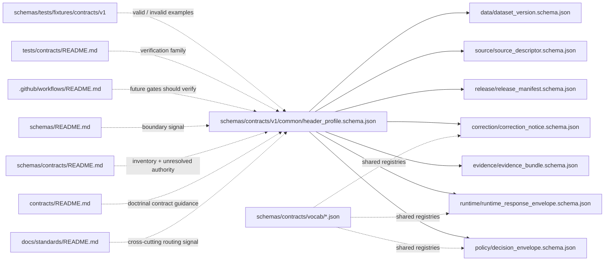

# `common`
Shared contract primitives and header-profile guidance for the `schemas/contracts/v1/common/` lane.

> [!IMPORTANT]
> **Status:** experimental · **Doc status:** draft · **Owners:** `@bartytime4life` *(via `.github/CODEOWNERS` global fallback; no narrower `/schemas/` rule is separately verified on public `main`)* · **Path:** `schemas/contracts/v1/common/README.md`
>
> **Repo fit:** child lane of [`../README.md`](../README.md) inside the live `schemas/contracts/v1/` inventory; broader boundary docs in [`../../README.md`](../../README.md), [`../../../README.md`](../../../README.md), [`../../../../contracts/README.md`](../../../../contracts/README.md), and [`../../../../docs/standards/README.md`](../../../../docs/standards/README.md); sibling family lanes in [`../runtime/README.md`](../runtime/README.md), [`../evidence/README.md`](../evidence/README.md), [`../policy/README.md`](../policy/README.md), [`../release/README.md`](../release/README.md), [`../source/README.md`](../source/README.md), [`../data/README.md`](../data/README.md), and [`../correction/README.md`](../correction/README.md); vocab lane in [`../../vocab/README.md`](../../vocab/README.md); fixture landing zone in [`../../../tests/fixtures/contracts/v1/README.md`](../../../tests/fixtures/contracts/v1/README.md)
>
>     
>
> **Quick jumps:** [Scope](#scope) · [Repo fit](#repo-fit) · [Inputs](#inputs) · [Exclusions](#exclusions) · [Directory tree](#directory-tree) · [Quickstart](#quickstart) · [Usage](#usage) · [Diagram](#diagram) · [Tables](#tables) · [Task list and definition of done](#task-list-and-definition-of-done) · [FAQ](#faq) · [Appendix](#appendix)
>
> Current public `main` already materializes this lane with `README.md` and `header_profile.schema.json`, but `header_profile.schema.json` is still placeholder-only (`{}`).

> [!WARNING]
> Public-tree materialization is **not** the same thing as settled canonical authority.
> Adjacent repo docs still either route machine contracts more strongly toward `contracts/` or explicitly keep schema-home authority unresolved. This README must document the live branch-visible lane **without** quietly declaring that split finished.

> [!NOTE]
> `common` here means **shared contract-object header / profile grammar**, not HTTP request headers, transport metadata, or framework-specific wire concerns.

---

## Scope

`schemas/contracts/v1/common/` is the narrow lane for **shared contract grammar** that more than one `v1` family should be able to reuse safely.

In practical KFM terms, this lane is where a file like `header_profile.schema.json` should standardize the boring-but-critical pieces that otherwise drift by copy-paste: contract identity, version grammar, audit linkage, explicit time-role conventions, and other truly cross-family primitives.

This README should do four jobs:

1. record what the public tree actually contains;
2. explain what a `common/` lane is for;
3. keep schema-home ambiguity visible rather than smoothing it away; and
4. stop `common/` from becoming a junk drawer that swallows family-specific semantics.

### Working role

A strong `common/` lane is intentionally small.

It should help sibling families stay coherent without flattening them into one mega-schema. A good `common/` header profile reduces repeated boilerplate; a bad one hides real semantic differences between source admission, policy decisioning, runtime outcomes, release proof, and correction lineage.

### Status vocabulary used here

| Label | Meaning in this file |
|---|---|
| **CONFIRMED** | Directly visible in the current public repo surface |
| **INFERRED** | Strongly suggested by adjacent docs, but not directly proven here |
| **PROPOSED** | Recommended working pattern, not current-state fact |
| **UNKNOWN** | Not verified from the current public evidence reviewed for this revision |
| **NEEDS VERIFICATION** | A specific value or authority decision is still open and should be checked before treating it as settled |

[Back to top](#common)

## Repo fit

| Aspect | Value |
|---|---|
| **Lane path** | `schemas/contracts/v1/common/` |
| **Parent inventory** | [`../README.md`](../README.md) |
| **Broader boundary docs** | [`../../README.md`](../../README.md), [`../../../README.md`](../../../README.md), [`../../../../contracts/README.md`](../../../../contracts/README.md), [`../../../../docs/standards/README.md`](../../../../docs/standards/README.md) |
| **Sibling family lanes** | [`../runtime/README.md`](../runtime/README.md), [`../evidence/README.md`](../evidence/README.md), [`../policy/README.md`](../policy/README.md), [`../release/README.md`](../release/README.md), [`../source/README.md`](../source/README.md), [`../data/README.md`](../data/README.md), [`../correction/README.md`](../correction/README.md) |
| **Vocab lane** | [`../../vocab/README.md`](../../vocab/README.md) |
| **Validation surfaces** | [`../../../tests/fixtures/contracts/v1/README.md`](../../../tests/fixtures/contracts/v1/README.md), [`../../../../tests/README.md`](../../../../tests/README.md), [`../../../../tests/contracts/README.md`](../../../../tests/contracts/README.md), [`../../../../.github/workflows/README.md`](../../../../.github/workflows/README.md) |
| **Machine file in this lane** | [`./header_profile.schema.json`](./header_profile.schema.json) |
| **Current public signal** | The lane is branch-visible on public `main` with a checked-in schema placeholder |
| **Current authority posture** | **UNKNOWN / NEEDS VERIFICATION** |
| **Reading rule** | Treat branch-visible machine files as current inventory truth; do **not** mistake them for proof that canonical-home law or enforcement depth is settled |

### Current verified snapshot

| Observation | Status | Why it matters |
|---|---|---|
| `schemas/contracts/v1/common/` exists on the current public branch | **CONFIRMED** | This lane is real, not hypothetical |
| `README.md` currently contains scaffold-only placeholder text | **CONFIRMED** | This file needs a real family explanation |
| `header_profile.schema.json` exists | **CONFIRMED** | A machine-file scaffold is already present where this lane expects it |
| `header_profile.schema.json` currently has body `{}` | **CONFIRMED** | Shared contract grammar is not yet encoded at field level on the public branch |
| Parent `schemas/contracts/v1/` inventory exists and lists all first-wave family lanes | **CONFIRMED** | `common/` should align to the visible `v1/` family split, not invent a new one |
| `schemas/contracts/vocab/` is visible with starter JSON registries | **CONFIRMED** | Shared enums and registries already have a lane that is *not* `common/` |
| `schemas/tests/fixtures/contracts/v1/{valid,invalid}` is visible | **CONFIRMED** | This lane has a branch-visible fixture landing zone nearby |
| `tests/contracts/README.md` exists as a contract-facing verification family | **CONFIRMED** | Verification already has a repo-visible human surface even though runner depth remains unproven |
| Public `main` proves an active merge-blocking workflow for this lane | **UNKNOWN** | `.github/workflows/` is still README-only on the current public branch |
| Canonical schema authority between `contracts/` and `schemas/` is fully settled | **NEEDS VERIFICATION** | Adjacent docs still keep that decision open |

> [!TIP]
> Keep `common/` **boring**.
> If a field is only meaningful to one family, it probably does **not** belong here.

[Back to top](#common)

## Inputs

### Accepted inputs

This lane should accept only material that clearly belongs to the **shared** `v1` contract grammar.

| What belongs here | Why it belongs here |
|---|---|
| Human-readable explanation of the shared `header_profile` role | This README is the reader-facing contract map for the lane |
| `header_profile.schema.json` once it becomes substantive | The branch-visible machine file already lives here |
| Small reusable schema fragments or `$defs` that truly apply across multiple sibling families | Shared grammar belongs here only when semantics are genuinely shared |
| Cross-family identity / version / audit / time-role guidance | These are the highest-value shared primitives |
| Authority notes and migration guidance | This lane lives inside an unresolved schema-home split |
| Cross-links to vocab, fixtures, policy, and workflow surfaces | Shared grammar is only useful if contributors can follow it outward |

### Expected inputs before this lane becomes strong

If this lane is going to become more than scaffold:

1. `header_profile.schema.json` needs a real JSON Schema body;
2. at least one sibling family should either reuse it or explicitly document why it does not;
3. valid and invalid fixtures need to exist and be inspectable; and
4. the repo needs a checked-in validator path and a workflow gate that makes drift visible.

## Exclusions

This lane should **not** become a catch-all for every field that looks important.

| Excluded from this path | Put it here instead |
|---|---|
| Family-specific schemas such as runtime outcome bodies, release proof shapes, or correction payloads | Their sibling family lanes under `../` |
| Shared reason / obligation / reviewer registries | [`../../vocab/README.md`](../../vocab/README.md) |
| Executable policy bundles or rule logic | [`../../../../policy/README.md`](../../../../policy/README.md) |
| Full valid / invalid fixture packs as the primary record | [`../../../tests/fixtures/contracts/v1/README.md`](../../../tests/fixtures/contracts/v1/README.md) and [`../../../../tests/contracts/README.md`](../../../../tests/contracts/README.md) |
| Runtime handlers, resolvers, DTOs, UI payload builders, or adapters | `apps/`, `packages/`, or another verified implementation lane |
| HTTP request headers, auth headers, or transport-specific metadata | Route / OpenAPI / implementation surfaces |
| Claims that this lane is already merge-blocking, canonical, or runtime-enforced | Nowhere until the checked-out branch proves them |

### Common-lane rule of thumb

A field belongs in `common/` only if:

- more than one family needs it,
- those families need it with the **same** semantics, and
- keeping it local would create avoidable drift.

If any one of those fails, leave the field in the more specific family lane.

[Back to top](#common)

## Directory tree

### Current public snapshot

```text
schemas/contracts/v1/common/
├── README.md
└── header_profile.schema.json
```

### Nearby branch-visible context

```text
schemas/
├── README.md
├── contracts/
│   ├── README.md
│   ├── v1/
│   │   ├── README.md
│   │   ├── common/
│   │   ├── correction/
│   │   ├── data/
│   │   ├── evidence/
│   │   ├── policy/
│   │   ├── release/
│   │   ├── runtime/
│   │   └── source/
│   └── vocab/
│       ├── README.md
│       ├── obligation_codes.json
│       ├── reason_codes.json
│       └── reviewer_roles.json
└── tests/
    └── fixtures/
        └── contracts/
            └── v1/
                ├── invalid/
                ├── valid/
                └── README.md
```

### Safe future shape for this lane

```text
schemas/contracts/v1/common/
├── README.md
└── header_profile.schema.json
```

> [!NOTE]
> Keep the common lane shallow unless the repo makes a conscious decision to introduce more shared primitives.
> A tiny, explicit lane is safer than a hidden mini-framework.

## Quickstart

Inspect the lane exactly as the checked-out branch exposes it:

```bash
sed -n '1,240p' schemas/contracts/v1/common/README.md
cat schemas/contracts/v1/common/header_profile.schema.json
```

Inspect the parent inventory and authority split before changing anything:

```bash
sed -n '1,260p' schemas/contracts/v1/README.md
sed -n '1,260p' schemas/contracts/README.md
sed -n '1,260p' schemas/README.md
sed -n '1,260p' contracts/README.md
sed -n '1,220p' docs/standards/README.md
```

Inspect the shared vocab and fixture landing zones this lane should stay aligned with:

```bash
sed -n '1,220p' schemas/contracts/vocab/README.md
sed -n '1,240p' tests/contracts/README.md
find schemas/tests/fixtures/contracts/v1 -maxdepth 2 -type d | sort
```

Search for downstream references before changing names or semantics:

```bash
grep -RIn "header_profile\|schema_version\|object_type\|audit_ref" \
  schemas contracts tests docs policy .github 2>/dev/null || true
```

### Illustrative validator shape only

> [!CAUTION]
> The command below is **illustrative only**.
> Do **not** claim it as current repo behavior until a real validator entrypoint and checked-in fixture file exist.

```bash
python -m jsonschema \
  -i schemas/tests/fixtures/contracts/v1/valid/header_profile.min.valid.json \
  schemas/contracts/v1/common/header_profile.schema.json
```

[Back to top](#common)

## Usage

### Read this lane safely

A safe reading order is:

1. read this README for current-state truth and exclusions;
2. read [`../README.md`](../README.md) for version-lane context;
3. inspect [`./header_profile.schema.json`](./header_profile.schema.json);
4. inspect [`../../vocab/README.md`](../../vocab/README.md);
5. inspect [`../../../../tests/contracts/README.md`](../../../../tests/contracts/README.md) and [`../../../tests/fixtures/contracts/v1/README.md`](../../../tests/fixtures/contracts/v1/README.md); and
6. inspect [`../../../../.github/workflows/README.md`](../../../../.github/workflows/README.md) before claiming automation coverage.

### Evolve `header_profile.schema.json` safely

1. retire the `{}` placeholder first;
2. keep the shared field set **small** and clearly cross-family;
3. use family-specific lanes for family-specific semantics;
4. add valid and invalid fixtures in the same change stream;
5. update the sibling and parent README surfaces when authority language changes; and
6. only then strengthen claims about enforcement.

### Shared-header design rules

A good shared header profile should standardize **references and grammar**, not swallow full business meaning.

Use these rules:

- standardize **identity**, not family outcome semantics;
- standardize **time format expectations**, but prefer family-specific time-role names such as `evaluated_at`, `released_at`, or `observed_at` instead of one vague `timestamp`;
- standardize **audit linkage** and optional cross-object refs;
- reuse shared registries instead of inventing lane-local enums; and
- prefer composition (`$ref`, `$defs`, or equivalent) over copy-paste.

### Illustrative starter shape only

> [!NOTE]
> The member names below are **PROPOSED naming aids**, not confirmed current repo keys.

```json
{
  "$schema": "https://json-schema.org/draft/2020-12/schema",
  "title": "KFM Common Contract Header Profile",
  "type": "object",
  "required": ["schema_version", "object_type", "object_id"],
  "properties": {
    "schema_version": { "type": "string" },
    "object_type": { "type": "string" },
    "object_id": { "type": "string" },
    "audit_ref": { "type": "string" },
    "profile_version": { "type": "string" }
  },
  "additionalProperties": true
}
```

This is intentionally small.

The point of `common/` is not to prove the whole object. The point is to give sibling families one stable way to say, “this is what kind of trust-bearing object I am, which version of the contract I follow, and how an auditor can join me back to the rest of the evidence system.”

## Diagram



## Tables

### A. Shared-header doctrinal minimums

The table below is a **working design aid** for `header_profile.schema.json`.

The middle column uses **illustrative JSON member names** only. Those names are **PROPOSED**, not confirmed current repo keys.

| Shared concern | Illustrative member name (**PROPOSED**) | Why a common lane may own it |
|---|---|---|
| Schema / contract version | `schema_version` | Every trust-bearing object needs an explicit contract version |
| Object family or type token | `object_type` | Readers and validators need to know what kind of object they are looking at |
| Stable object identifier | `object_id` | Cross-object joins and audit reconstruction fail if each family invents its own root identity grammar |
| Audit join key | `audit_ref` | KFM repeatedly treats audit linkage as part of accountable trust state |
| Profile / grammar version | `profile_version` | Lets families say which shared grammar they inherit |
| Explicit time-role field(s) | family-specific names, not one global `timestamp` | KFM stresses explicit time semantics rather than vague timestamps |
| Optional decision / release / correction refs | `decision_ref`, `release_ref`, `supersedes_ref` | These are often shared reference *shapes* even when family meaning differs |
| Optional rights / sensitivity marker when relevant | `rights_state` or equivalent | Public consequence often depends on rights / sensitivity posture being visible |

> [!IMPORTANT]
> `common/` should define the **shape** of shared primitives where that helps more than one family.
> It should **not** force every family to carry every field.

### B. Common-lane boundary matrix

| Candidate change | Belongs in `common/`? | Better home | Why |
|---|---|---|---|
| Shared identity / version / audit grammar | Yes | `./header_profile.schema.json` | This is exactly the narrow purpose of the lane |
| Runtime result enums such as `ANSWER`, `ABSTAIN`, `DENY`, `ERROR` | Usually no | `../runtime/` and/or `../../vocab/` | Outcome semantics are not generic header grammar |
| Reason / obligation / reviewer registries | No | `../../vocab/` | Shared enums already have a visible lane |
| Release-proof-specific fields | No | `../release/` | Release burden is family-specific |
| Correction / supersession workflow semantics | Usually no | `../correction/` | Visible lineage rules belong to correction-specific objects |
| Full valid / invalid fixture packs | No | `../../../tests/fixtures/contracts/v1/` and `../../../../tests/contracts/` | Tests should consume the common lane, not be hidden inside it |
| Policy logic or executable allow / deny rules | No | `../../../../policy/` | Shared grammar is not executable policy |
| HTTP request / response header concerns | No | API / implementation surfaces | This `header_profile` is about contract objects, not transport |

### C. Sync obligations for this README

| If this changes | Update these too | Why |
|---|---|---|
| Current tree inventory | [`../README.md`](../README.md), [`../../README.md`](../../README.md), [`../../../README.md`](../../../README.md) | Local truth should not drift away from parent inventory docs |
| Authority language | [`../../../../contracts/README.md`](../../../../contracts/README.md), [`../../../../docs/standards/README.md`](../../../../docs/standards/README.md) | The repo still carries a visible schema-home split |
| Shared-field naming or registry references | [`../../vocab/README.md`](../../vocab/README.md), [`../../../../policy/README.md`](../../../../policy/README.md), [`../../../../tests/contracts/README.md`](../../../../tests/contracts/README.md) | Shared grammar changes have downstream policy and verification consequences |
| Validator / fixture references | [`../../../tests/fixtures/contracts/v1/README.md`](../../../tests/fixtures/contracts/v1/README.md), [`../../../../.github/workflows/README.md`](../../../../.github/workflows/README.md) | README claims should stay synchronized with executable reality |

[Back to top](#common)

## Task list and definition of done

- [ ] This README reflects the actual current public tree for `schemas/contracts/v1/common/`.
- [ ] `header_profile.schema.json` is no longer placeholder-only.
- [ ] Shared grammar stays **small** and clearly cross-family.
- [ ] At least one sibling family either reuses the common header profile or explicitly documents why it does not.
- [ ] Valid and invalid examples for the common header profile exist in the visible fixture lane.
- [ ] A real validator command is linked from checked-in repo surfaces.
- [ ] Workflow documentation points to an actual checked-in gate once one exists.
- [ ] Authority wording stays synchronized across `schemas/README.md`, `schemas/contracts/README.md`, `schemas/contracts/v1/README.md`, `contracts/README.md`, and `docs/standards/README.md`.
- [ ] No duplicate canonical copy of the same shared header profile is introduced under a competing root.
- [ ] A reviewer can tell, without guessing, whether this lane is still scaffold-only or has become enforcement-grade.

### Review checks before merge

Ask these questions:

1. Does the proposed field truly belong to more than one family?
2. Does it carry the same semantics everywhere it is reused?
3. Is the change making authority clearer, or murkier?
4. Did fixtures, docs, and any validator references move together?
5. Would a future reviewer understand the difference between **shared grammar** and **family semantics** after this change?

## FAQ

### Is `common/` the same thing as HTTP headers?

No.

This lane is about the shared header / profile grammar of **contract objects**. It is not about transport headers, auth headers, or framework request metadata.

### Is `schemas/contracts/v1/common/` now the canonical schema home?

Not conclusively.

It is the current public branch-visible machine-file lane for this family. Adjacent repo docs still keep canonical-home authority unresolved.

### Why have a `common/` lane if only one schema file is visible today?

Because shared grammar is easy to get wrong quietly.

A small `common/` lane can prevent repeated identity, version, and audit fields from drifting across sibling families. It earns its keep only if it stays narrow.

### Should every family inherit from `header_profile.schema.json`?

Only when the shared primitives genuinely match.

Common reuse is helpful when semantics are shared. It is harmful when it hides real differences that should stay local to `runtime/`, `release/`, `source/`, `evidence/`, or `correction/`.

### Why not put reason and obligation enums here too?

Because the repo already exposes a dedicated vocab lane under [`../../vocab/README.md`](../../vocab/README.md).

`common/` should not absorb every shared thing just because it is nearby.

### Does the presence of this lane prove merge-blocking enforcement already exists?

No.

Current public `main` still documents `.github/workflows/` as README-only. File presence here is inventory truth, not enforcement proof.

## Appendix

<details>
<summary>Relative link map</summary>

### Upstream and boundary docs

- Parent version inventory: [`../README.md`](../README.md)
- `schemas/contracts/` boundary + inventory: [`../../README.md`](../../README.md)
- `schemas/` top-level boundary lane: [`../../../README.md`](../../../README.md)
- Doctrinal contract guide: [`../../../../contracts/README.md`](../../../../contracts/README.md)
- Cross-cutting standards routing: [`../../../../docs/standards/README.md`](../../../../docs/standards/README.md)

### Adjacent operational docs

- Policy lane: [`../../../../policy/README.md`](../../../../policy/README.md)
- Repo-wide tests lane: [`../../../../tests/README.md`](../../../../tests/README.md)
- Contract-facing verification lane: [`../../../../tests/contracts/README.md`](../../../../tests/contracts/README.md)
- Workflow lane: [`../../../../.github/workflows/README.md`](../../../../.github/workflows/README.md)

### Nearby local lanes

- Shared vocab lane: [`../../vocab/README.md`](../../vocab/README.md)
- Fixture landing zone: [`../../../tests/fixtures/contracts/v1/README.md`](../../../tests/fixtures/contracts/v1/README.md)
- Runtime: [`../runtime/README.md`](../runtime/README.md)
- Evidence: [`../evidence/README.md`](../evidence/README.md)
- Policy family: [`../policy/README.md`](../policy/README.md)
- Release: [`../release/README.md`](../release/README.md)
- Source: [`../source/README.md`](../source/README.md)
- Data: [`../data/README.md`](../data/README.md)
- Correction: [`../correction/README.md`](../correction/README.md)

</details>

<details>
<summary>One-sentence maintenance rule</summary>

Keep `common/` small, cross-family, and honest: shared grammar belongs here; family meaning, executable policy, fixtures, and implementation claims do not.

</details>
