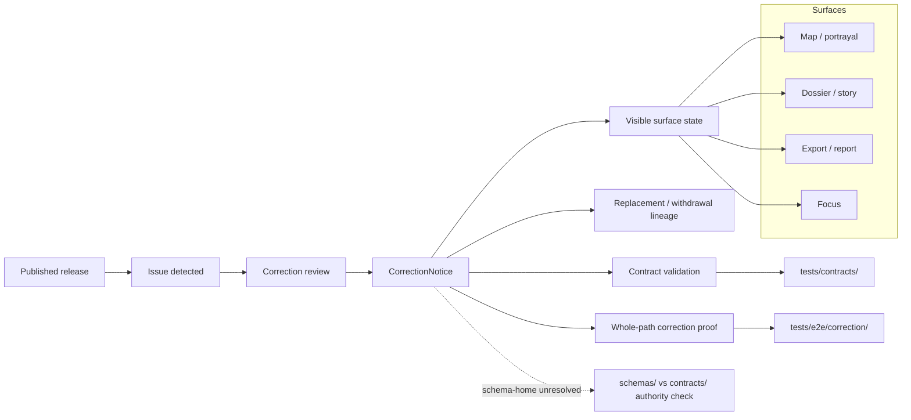

<!-- [KFM_META_BLOCK_V2]
doc_id: kfm://doc/<NEEDS-VERIFICATION-UUID>
title: Correction Contracts v1
type: standard
version: v1
status: draft
owners: @bartytime4life
created: <NEEDS-VERIFICATION-YYYY-MM-DD>
updated: <NEEDS-VERIFICATION-YYYY-MM-DD>
policy_label: <NEEDS-VERIFICATION>
related: [schemas/contracts/v1/README.md, schemas/contracts/v1/correction/correction_notice.schema.json, tests/contracts/README.md, tests/e2e/correction/README.md, schemas/tests/fixtures/contracts/v1/README.md, .github/workflows/README.md]
tags: [kfm, contracts, schemas, correction, correction-notice]
notes: [Current branch now includes a Draft 2020-12 starter body in correction_notice.schema.json plus v1 valid/invalid fixtures and a contract-floor unit test; schema-home authority, dates, doc_id, and policy label still need direct branch-level verification.]
[/KFM_META_BLOCK_V2] -->

# Correction Contracts v1

Boundary-and-inventory README for the live `schemas/contracts/v1/correction/` lane and the current public state of `correction_notice.schema.json`.

> [!IMPORTANT]
> **Status:** experimental  
> **Doc status:** draft  
> **Owners:** `@bartytime4life` *(current strongest visible signal is the public `.github/CODEOWNERS` global fallback; no narrower `/schemas/contracts/v1/correction/` owner rule was directly verified on public `main`)*  
> **Path:** `schemas/contracts/v1/correction/README.md`  
> **Family file:** [`./correction_notice.schema.json`](./correction_notice.schema.json)  
>        
> **Quick jumps:** [Scope](#scope) · [Repo fit](#repo-fit) · [Accepted inputs](#accepted-inputs) · [Exclusions](#exclusions) · [Current verified snapshot](#current-verified-snapshot) · [Directory tree](#directory-tree) · [Quickstart](#quickstart) · [Usage](#usage) · [Diagram](#diagram) · [Contract shape](#contract-shape) · [Validation & gates](#validation--gates) · [Task list](#task-list--definition-of-done) · [FAQ](#faq) · [Appendix](#appendix)

> [!WARNING]
> Current public `main` proves this correction lane is real, but adjacent repo docs still do **not** settle whether `schemas/` or `contracts/` is the authoritative machine-contract home. The local `correction_notice.schema.json` file now contains a Draft 2020-12 starter contract body.

> [!NOTE]
> The KFM Meta Block v2 above uses reviewable placeholders for `doc_id`, `created`, `updated`, and `policy_label` because those values were not directly confirmed from the public repo surfaces reviewed for this revision.

| At a glance | Working rule |
|---|---|
| Family role | Preserve visible lineage under supersession, withdrawal, narrowing, or reissue |
| Current local inventory | `README.md` + `correction_notice.schema.json` |
| Current schema body | Draft 2020-12 starter schema |
| Stronger neighboring proof surfaces | [`tests/contracts/`](../../../../tests/contracts/README.md) for contract-facing validation; [`tests/e2e/correction/`](../../../../tests/e2e/correction/README.md) for whole-path correction proof |
| Local schema-side fixture scaffold | [`schemas/tests/fixtures/contracts/v1/`](../../../tests/fixtures/contracts/v1/README.md) exists generically, but no correction-specific fixture leaf was directly verified here |
| Authority posture | **UNKNOWN / NEEDS VERIFICATION** between `schemas/` and `contracts/` |

## Scope

`schemas/contracts/v1/correction/` is the correction-family lane inside the public `schemas/contracts/v1/` subtree.

Its job is narrow but consequential: make correction semantics legible, keep post-publication change visible, and prevent contributors from confusing a visible scaffold with a finished trust-bearing contract. In KFM doctrine, correction is not a hidden overwrite, a quiet file replacement, or a UI-only warning. It is a governed state transition that preserves lineage across released objects and outward-facing surfaces.

This README should do four jobs well:

1. describe what the current public tree actually proves about this lane
2. preserve doctrinal minimums for `CorrectionNotice`
3. keep schema-home ambiguity visible instead of smoothing it away
4. point correction work toward the right neighboring proof surfaces

### Truth posture used here

| Label | Meaning in this README |
|---|---|
| **CONFIRMED** | Directly visible in the current public repo surface, or directly anchored in stable KFM doctrine already used by adjacent docs |
| **INFERRED** | Strongly suggested by neighboring repo docs or doctrine, but not directly proven from this specific path |
| **PROPOSED** | Safe next-step structure or maintenance guidance, not current-state fact |
| **UNKNOWN** | Not directly verified from the reviewed public evidence |
| **NEEDS VERIFICATION** | A specific value, ownership detail, authority decision, or enforcement claim must be checked before treating it as settled |

[Back to top](#correction-contracts-v1)

## Repo fit

| Field | Value |
|---|---|
| **Path** | `schemas/contracts/v1/correction/README.md` |
| **Purpose** | Boundary README for the correction-family lane under the public `schemas/contracts/v1/` tree |
| **Immediate parent** | [`../README.md`](../README.md) |
| **Parent contract lane** | [`../../README.md`](../../README.md) |
| **Parent schema root** | [`../../../README.md`](../../../README.md) |
| **Root repo posture** | [`../../../../README.md`](../../../../README.md) |
| **Stronger current doctrinal contract signal** | [`../../../../contracts/README.md`](../../../../contracts/README.md) |
| **Stronger repo-wide verification signal** | [`../../../../tests/README.md`](../../../../tests/README.md) |
| **Contract-facing verification signal** | [`../../../../tests/contracts/README.md`](../../../../tests/contracts/README.md) |
| **Whole-path correction proof signal** | [`../../../../tests/e2e/correction/README.md`](../../../../tests/e2e/correction/README.md) |
| **Schema-side fixture scaffold** | [`../../../tests/fixtures/contracts/v1/README.md`](../../../tests/fixtures/contracts/v1/README.md) |
| **Workflow / merge-gate signal** | [`../../../../.github/workflows/README.md`](../../../../.github/workflows/README.md) |
| **Local family file** | [`./correction_notice.schema.json`](./correction_notice.schema.json) |
| **Audience** | Maintainers working on correction-family contract definition, schema-home reconciliation, fixture/test follow-through, and fail-closed correction semantics |
| **Authority posture** | **UNKNOWN / NEEDS VERIFICATION** |

### Path reconciliation note

Earlier doctrine and starter examples sometimes name non-versioned placeholder paths such as `contracts/correction/correction_notice.schema.json`.

Current public `main` now proves a live `schemas/contracts/v1/correction/` lane exists. That visibility matters. It still does **not** settle canonical authority by itself, because neighboring `schemas/` and `contracts/` docs continue to describe schema-home authority as unresolved.

### Upstream and downstream links

| Direction | Surface | Why it matters | Status |
|---|---|---|---|
| Upstream | [`../README.md`](../README.md) | Defines the `v1` family lattice and the current public placeholder state of first-wave schema files | **CONFIRMED** |
| Upstream | [`../../../../contracts/README.md`](../../../../contracts/README.md) | Keeps correction aligned with KFM’s stronger current human-readable contract doctrine | **CONFIRMED** |
| Upstream | [`../../../../README.md`](../../../../README.md) | Preserves repo-root truth path, trust membrane, and inspectable-claim posture | **CONFIRMED** |
| Lateral | [`../../../../tests/contracts/README.md`](../../../../tests/contracts/README.md) | Sharper current home for contract-facing validation and valid/invalid case burden | **CONFIRMED** |
| Lateral | [`../../../../tests/e2e/correction/README.md`](../../../../tests/e2e/correction/README.md) | Sharper current home for visible correction, stale-state, and supersession drills | **CONFIRMED** |
| Lateral | [`../../../tests/fixtures/contracts/v1/README.md`](../../../tests/fixtures/contracts/v1/README.md) | Generic schema-side fixture scaffold exists, but authority remains unresolved | **CONFIRMED** |
| Lateral | [`../../../../policy/README.md`](../../../../policy/README.md) | Correction may carry deny-by-default, narrowing, or review-bearing consequences | **CONFIRMED** |
| Lateral | [`../../../../.github/workflows/README.md`](../../../../.github/workflows/README.md) | Bounds workflow claims to public checked-in evidence | **CONFIRMED** |
| Downstream | `map`, `dossier`, `story`, `export`, `Focus` surfaces | Correction state must remain visible where users encounter released meaning | **CONFIRMED doctrinally** |
| Downstream | future executable correction drills | This family should eventually feed real contract validation and whole-path proof | **PROPOSED** |

[Back to top](#correction-contracts-v1)

## Accepted inputs

This directory should accept only material that clearly belongs to the correction-family contract lane.

### Belongs here

| Accepted here | Why it belongs here |
|---|---|
| Version-local README improvements | Keeps the family lane reviewable and truthful |
| Family-level notes about `CorrectionNotice` semantics | Makes correction doctrine legible without inventing implementation maturity |
| Links to local family files already present in this directory | Keeps navigation local and predictable |
| Authority-resolution notes specific to the correction family | This lane sits inside an unresolved schema-home boundary |
| Explicit status notes about placeholder bodies, missing fixtures, or missing gates | Reduces trust theater |
| Clearly labeled illustrative examples or pointers | Safe only when they do **not** masquerade as canonical emitted correction evidence |

### Minimum bar before this lane becomes strong

If this lane is going to become more than scaffold, four things need to become visible together:

1. one authoritative schema-home decision
2. a substantive `correction_notice.schema.json` body
3. contract-facing valid and invalid cases that prove the family matters operationally
4. whole-path correction proof that exercises visible downstream state

[Back to top](#correction-contracts-v1)

## Exclusions

This directory should stay small, explicit, and hard to misread.

| Excluded from this path | Put it here instead | Why |
|---|---|---|
| Emitted correction notices, release proof packs, signed bundles, rollback drill outputs | release / proof / runtime artifact lanes *(path still needs direct verification by branch)* | This path is for contract shape, not emitted evidence |
| Policy bundles, decision logic, or reviewer workflow definitions | [`../../../../policy/`](../../../../policy/) | Policy must stay executable and reviewable |
| Contract-facing valid/invalid packs intended to back real runners | [`../../../../tests/contracts/`](../../../../tests/contracts/) | Verification belongs with the stronger test lane unless authority is explicitly changed |
| Whole-path supersession or stale-visible drills | [`../../../../tests/e2e/correction/`](../../../../tests/e2e/correction/) | End-to-end burden belongs in the correction proof leaf |
| Workflow YAML and merge-gate orchestration | [`../../../../.github/workflows/`](../../../../.github/workflows/) | Enforcement belongs with workflow inventory |
| Runtime DTOs, API handlers, or shell payload renderers | app / package / runtime implementation surfaces | Consumers should depend on contracts, not live inside them |
| Duplicate authoritative copies of the same trust-bearing family under both `schemas/` and `contracts/` | one canonical root plus any explicitly documented pointer / mirror strategy | Parallel schema law creates drift |
| UI-only warning text without contract linkage | trust-surface docs or product-surface lanes | Correction semantics must stay machine-checkable |

> [!CAUTION]
> A tidy directory is not the same thing as a governed correction surface.

[Back to top](#correction-contracts-v1)

## Current verified snapshot

| Surface | Current public `main` state | Working meaning |
|---|---|---|
| `schemas/contracts/v1/correction/` | **CONFIRMED** present | The correction-family lane is a real checked-in public path |
| `./README.md` | **CONFIRMED** present | This directory already has a substantive family README surface |
| `./correction_notice.schema.json` | **CONFIRMED** present | The family filename is materialized |
| `./correction_notice.schema.json` body | **CONFIRMED** Draft 2020-12 starter body is present | The local schema now encodes a first-wave contract floor, but full enforcement maturity still needs broader suite coverage |
| [`../../../../tests/e2e/correction/README.md`](../../../../tests/e2e/correction/README.md) | **CONFIRMED** present; current public leaf is README-only | Whole-path correction proof has a named home, but executable depth remains **NEEDS VERIFICATION** |
| [`../../../../tests/contracts/README.md`](../../../../tests/contracts/README.md) | **CONFIRMED** present and explicitly names `CorrectionNotice` in the family role | Stronger contract-facing validation surface exists outside this schema lane |
| [`../../../tests/fixtures/contracts/v1/README.md`](../../../tests/fixtures/contracts/v1/README.md) plus `valid/` and `invalid/` leaves | **CONFIRMED** present as generic schema-side fixture scaffold | Versioned generic fixture scaffolding exists, but no correction-specific fixture payloads were directly verified here |
| [`../../../../.github/workflows/README.md`](../../../../.github/workflows/README.md) | **CONFIRMED** present and states current public `.github/workflows/` is README-only | Public workflow documentation exists, but no checked-in public workflow YAML gate is proven from this revision |
| [`../../../../contracts/README.md`](../../../../contracts/README.md) and [`../../../README.md`](../../../README.md) | **CONFIRMED** both visible; authority remains unresolved | Do not treat path visibility here as proof that the repo has settled canonical schema home |
| `.github/CODEOWNERS` | **CONFIRMED** global fallback covers the repo; no narrower correction-path rule was directly verified | `@bartytime4life` is the strongest visible owner signal, but narrower ownership remains **NEEDS VERIFICATION** |

### Working interpretation

Right now this lane proves five things and no more:

1. the correction family name is real in the public tree
2. the local README is substantive
3. the local schema filename exists
4. adjacent correction-proof and contract-validation lanes exist elsewhere in the repo
5. local contract implementation maturity is improving with a checked-in starter schema body, but broader cross-family validation is still incomplete

[Back to top](#correction-contracts-v1)

## Directory tree

### Current public snapshot

```text
schemas/contracts/v1/correction/
├── README.md
└── correction_notice.schema.json

tests/contracts/
└── README.md

tests/e2e/correction/
└── README.md

schemas/tests/fixtures/contracts/v1/
├── README.md
├── valid/
│   └── README.md
└── invalid/
    └── README.md
```

### Reading rule for the tree

- The local correction lane is **CONFIRMED**.
- The local schema file body is currently placeholder-only `{}`.
- The public repo currently proves a correction-specific e2e leaf and a stronger contract-facing verification family.
- The public repo also proves a generic schema-side `valid/` / `invalid/` scaffold, but not a correction-specific fixture leaf inside it.
- None of the above silently resolves canonical contract-home or canonical fixture-home law.

[Back to top](#correction-contracts-v1)

## Quickstart

Use this path as an **inspection lane first**.

```bash
# 1) Re-open the local correction family
sed -n '1,260p' schemas/contracts/v1/correction/README.md
cat schemas/contracts/v1/correction/correction_notice.schema.json

# 2) Re-open the boundary docs that govern how this lane should be read
sed -n '1,260p' schemas/contracts/v1/README.md
sed -n '1,220p' schemas/contracts/README.md
sed -n '1,220p' schemas/README.md
sed -n '1,220p' contracts/README.md

# 3) Inspect adjacent proof surfaces before editing the schema body
sed -n '1,240p' tests/contracts/README.md
sed -n '1,260p' tests/e2e/correction/README.md
sed -n '1,240p' schemas/tests/README.md
sed -n '1,240p' schemas/tests/fixtures/contracts/v1/README.md
sed -n '1,220p' .github/workflows/README.md

# 4) Verify current visible ownership signal
sed -n '1,120p' .github/CODEOWNERS
```

### Safe review sequence

1. Re-read the parent `schemas/` and `contracts/` boundary docs.
2. Confirm whether an ADR or equivalent repo decision has resolved schema-home authority.
3. Inspect the raw body of `correction_notice.schema.json` instead of assuming it is substantive.
4. Check whether the active branch contains correction-specific cases under the stronger validation or e2e lanes.
5. Only then decide whether the change belongs here, in `contracts/`, in `tests/contracts/`, in `tests/e2e/correction/`, or in a non-schema lane.

> [!TIP]
> If you cannot answer “which directory is authoritative?” before editing a trust-bearing family, pause there first.

[Back to top](#correction-contracts-v1)

## Usage

### Recommended use right now

Use this README as:

- a correction-family index for the current public `schemas/contracts/v1/correction/` lane
- a warning surface against schema-home drift
- a contributor checkpoint before expanding `correction_notice.schema.json`
- a reminder that visible correction lineage is downstream of release scope, review, policy, and proof

### When to issue a correction doctrinally

A correction-family contract is appropriate when a **released** object needs one of the following visible state changes:

- **SUPERSEDE** — a newer release or corrected object replaces the prior one
- **WITHDRAW** — the prior object must no longer be public-safe
- **NARROW** — exposure must be reduced, generalized, or otherwise made safer
- **REISSUE** — a corrected release replaces the original while preserving lineage

> [!NOTE]
> Those type labels are useful starter language, but the exact enum remains **PROPOSED / NEEDS VERIFICATION** until the local schema body or an explicit shared vocabulary proves it.

### What the contract must protect

Correction should preserve all of the following:

- lineage to the affected release or artifact
- a visible public note or outward-facing explanation
- downstream rebuild references where derived delivery must change
- surface-state propagation so stale claims do not persist
- audit linkage for review, policy, and rollback investigation

### Working local rule

Route work by burden, not by convenience:

| If the change is mainly about… | Prefer this lane |
|---|---|
| local family semantics, boundary wording, or schema-shape guidance | `schemas/contracts/v1/correction/` |
| valid / invalid object shape proof | [`tests/contracts/`](../../../../tests/contracts/README.md) |
| visible supersession, stale-state, or correction propagation end to end | [`tests/e2e/correction/`](../../../../tests/e2e/correction/README.md) |
| schema-side illustrative or mirror fixture scaffolds | [`schemas/tests/`](../../../tests/README.md) |
| policy consequence, reason codes, or narrowing obligations | [`policy/`](../../../../policy/README.md) |

[Back to top](#correction-contracts-v1)

## Diagram



> [!NOTE]
> The diagram shows doctrinal dependencies and current repo-facing proof lanes. It does **not** claim that executable validators or e2e drills are already mounted on current public `main`.

[Back to top](#correction-contracts-v1)

## Contract shape

### What this branch now proves locally

| Local fact | Meaning |
|---|---|
| `correction_notice.schema.json` exists | The family filename is materialized in the `schemas/` lane |
| `correction_notice.schema.json` now has a Draft 2020-12 body | The local field list now has a machine-checkable starter floor |
| this README already contains doctrinal field guidance | The repo has contract intent documented even though machine enforcement is not yet proven locally |

### Confirmed doctrinal minimum contract floor

These are the **CONFIRMED doctrinal minimums** for `CorrectionNotice`.

| Field or concept | Why it matters |
|---|---|
| affected releases | identifies what changed |
| replacement releases | points to the authoritative replacement when one exists |
| affected surface classes | forces propagation beyond storage-only corrections |
| rebuild refs | ties correction to derived rebuild work where needed |
| cause | preserves the reason for change |
| public note | gives outward users visible explanation |

### Strong candidate first-wave additions

These are **PROPOSED** but strong candidates for the first executable contract wave.

| Proposed field | Why it is useful |
|---|---|
| `correction_id` | stable identity for audit, references, and diffs |
| `correction_type` | structured supersede / withdraw / narrow / reissue handling |
| `targets` | explicit target list for release IDs, dataset IDs, or artifact IDs |
| `reason_code` | aligns correction to shared policy vocabulary instead of free text |
| `issued_at` / `effective_at` | separates issuance from effect time |
| `audit_ref` | joins correction to logs, policy decisions, and review evidence |
| `replaces` / `replaced_by` | makes bidirectional lineage machine-readable |

### Surface propagation

A correction is incomplete if it updates storage but leaves public surfaces unchanged.

| Surface | Why propagation matters |
|---|---|
| map / tile / portrayal | prevents stale visual claims from persisting |
| dossier | prevents detail views from presenting outdated released state |
| story | preserves narrative trust and avoids silent historical drift |
| export / report | keeps packaged outward artifacts aligned with release truth |
| Focus / governed assistance | forces runtime surfaces to show superseded, withdrawn, or correction-pending state |

### Illustrative payload

The example below is **illustrative**, not a confirmed mounted payload.

```json
{
  "kind": "CorrectionNotice",
  "schema_version": "v1",
  "correction_id": "cn.example.2026-03-28.001",
  "correction_type": "SUPERSEDE",
  "targets": [
    "rel.example.2026-03-01.v1"
  ],
  "replacement_releases": [
    "rel.example.2026-03-15.v2"
  ],
  "reason_code": "validation.schema_failed",
  "issued_at": "2026-03-28T00:00:00Z",
  "effective_at": "2026-03-28T00:00:00Z",
  "audit_ref": "audit:correction:example:001",
  "affected_surface_classes": [
    "map",
    "dossier",
    "story",
    "export",
    "focus"
  ],
  "rebuild_refs": [
    "pbr.example.001"
  ],
  "public_note": "This release has been superseded by a corrected release.",
  "replaces": [
    "rel.example.2026-03-01.v1"
  ]
}
```

[Back to top](#correction-contracts-v1)

## Lifecycle context

The correction-family lifecycle is not free-form.

| Lifecycle phase | Expected meaning |
|---|---|
| opened | a correction case exists and has entered governance |
| triaged | the issue has been classified and routed |
| approved | the correction is ready for outward publication |
| notice published | the visible correction artifact exists |
| rebuild complete | affected derived delivery has been updated where required |
| closed | the correction workflow has finished with lineage preserved |

### Event intent

These event families are doctrine-aligned starter language. They are **not** presented here as a confirmed current checked-in event registry.

| Event family | Why it matters |
|---|---|
| `correction.case.opened` | marks entry into governed correction handling |
| `correction.notice.published` | exposes the outward change event |
| `projection.rebuilt` | links correction to downstream rebuild evidence |

[Back to top](#correction-contracts-v1)

## Validation & gates

### Current public proof surfaces

| Surface | Current public signal | Working use |
|---|---|---|
| [`tests/contracts/`](../../../../tests/contracts/README.md) | README-bearing family explicitly names `CorrectionNotice` in contract-facing validation scope | strong candidate home for valid / invalid case packs and shape validation |
| [`tests/e2e/correction/`](../../../../tests/e2e/correction/README.md) | README-bearing correction proof leaf exists | strong candidate home for visible supersession / stale-state drills |
| [`schemas/tests/fixtures/contracts/v1/`](../../../tests/fixtures/contracts/v1/README.md) | generic schema-side `valid/` / `invalid/` scaffold exists | possible local mirror / illustrative scaffold, not a settled canonical fixture home |
| [`.github/workflows/README.md`](../../../../.github/workflows/README.md) | workflow lane is documented, but current public tree is README-only there | bounds any merge-gate or validator claim to **NEEDS VERIFICATION** |

### Schema posture

| Rule | Status |
|---|---|
| JSON Schema Draft 2020-12 should be the contract dialect | **CONFIRMED doctrinally** |
| additive evolution should be the default | **CONFIRMED doctrinally** |
| breaking changes should be deliberate, versioned, and paired with fixture + doc updates | **CONFIRMED doctrinally** |
| fail-closed field discipline (`additionalProperties: false` or equivalent) is a strong starter posture | **PROPOSED** |
| the local schema body is already substantive on current public `main` | **FALSE / not supported** |

### Minimum executable proof

A correction-family contract is not operational until it can prove all of the following:

- the schema compiles
- valid fixtures pass
- invalid fixtures fail
- one correction drill shows visible downstream state change
- at least one post-correction outward-facing sample reflects the corrected state
- the active branch shows where contract validation and whole-path proof actually run

### Illustrative validator shape

The command below is **illustrative only**. It should not be treated as a current repo entrypoint until a real validator, fixture home, and authoritative schema source are checked in together.

```bash
python -m jsonschema \
  -i <authoritative-fixture-home>/correction_notice.supersession.valid.json \
  schemas/contracts/v1/correction/correction_notice.schema.json
```

### Minimum correction drill

A thin but honest correction drill should prove three linked objects:

1. a **previous** release-backed object
2. a `CorrectionNotice` object that **supersedes**, **withdraws**, **narrows**, or **reissues** it
3. a **post-correction** outward-facing sample that shows a finite visible state such as `SUPERSEDED`, `WITHDRAWN`, `STALE-VISIBLE`, or `CORRECTION-PENDING`

[Back to top](#correction-contracts-v1)

## Task list — definition of done

- [ ] one authoritative schema-home decision is recorded or explicitly linked
- [x] `correction_notice.schema.json` now has a JSON Schema Draft 2020-12 starter body
- [ ] contract-facing valid / invalid cases exist in the authoritative verification lane
- [ ] any schema-side `valid/` / `invalid/` mirrors are explicitly marked non-authoritative, generated, or pointer-only
- [ ] at least one correction drill exists under `tests/e2e/correction/**`
- [ ] shared reason / obligation vocabulary is referenced instead of copied into this namespace
- [ ] this README, parent boundary docs, and sibling lanes agree on schema-home and fixture-home language
- [ ] workflow docs and active gates are reverified before anyone calls this lane enforced
- [ ] outward-facing correction-state semantics are documented and stable

[Back to top](#correction-contracts-v1)

## FAQ

### Why is correction its own contract family?

Because KFM treats correction as a governed publication change, not as a hidden replacement. A dedicated contract makes lineage, cause, and downstream propagation inspectable.

### Why does this README keep talking about authority?

Because the public repo currently exposes a real `schemas/contracts/v1/` subtree **and** a stronger root `contracts/` doctrine surface at the same time. Until the repo resolves which one is canonical, a correction-family README that ignores that split becomes misleading.

### Is correction only for withdrawal?

No. The family must handle supersession, narrowing / generalization, reissue, and withdrawal without erasing prior public state.

### Are the filenames in this README fixed?

No. The object role matters more than the literal filename. What **is** fixed today is only the current public path visibility reviewed for this revision.

### Can a correction exist without downstream rebuild work?

Sometimes yes, but only if no derived delivery surface is affected. If a public map, portrayal, export, dossier, or runtime surface changes meaning, rebuild linkage should remain visible.

[Back to top](#correction-contracts-v1)

## Appendix

<details>
<summary><strong>Open verification items</strong></summary>

1. Confirm whether `schemas/` or `contracts/` is the authoritative machine-contract home for `CorrectionNotice`.
2. Confirm whether `correction_notice.schema.json` should stay here, become a pointer, or become a generated mirror if authority resolves elsewhere.
3. Confirm the exact `correction_type` enum and whether it is registry-backed.
4. Confirm the authoritative correction fixture home between `tests/contracts/**`, `tests/e2e/correction/**`, `schemas/tests/**`, and any branch-local alternative.
5. Confirm the actual validator entrypoint, runner, and merge-gate workflow behavior on the active branch.
6. Confirm whether a correction runbook already exists under `docs/` or another human-guidance surface.
7. Confirm `doc_id`, `created`, `updated`, and `policy_label` values for the KFM meta block.
8. Confirm whether narrower path ownership than the public global CODEOWNERS fallback exists on the checked-out branch.

</details>

<details>
<summary><strong>Editing rules for future maintainers</strong></summary>

- Keep doctrinal claims stronger than path claims.
- Prefer stable semantics over brittle filename mythology.
- Do not collapse superseded, withdrawn, narrowed, reissued, stale-visible, or correction-pending into one generic warning state.
- Do not let runtime or UI language outrun what the correction contract and proof lanes can actually prove.
- When branch-level evidence strengthens a claim, update the README in the same change stream as the schema, tests, or workflow surfaces that justify it.
- If schema-home or fixture-home authority is resolved, reconcile this file with `schemas/README.md`, `schemas/contracts/README.md`, `schemas/contracts/v1/README.md`, `contracts/README.md`, and adjacent `tests/` docs together.
- Do not let a schema-side scaffold quietly harden into canonical law by inertia.

</details>

[Back to top](#correction-contracts-v1)
