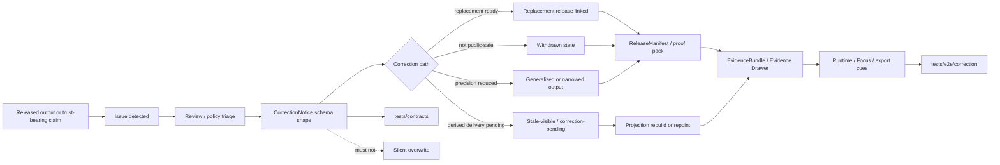

<!-- [KFM_META_BLOCK_V2]
doc_id: kfm://doc/NEEDS_VERIFICATION__schemas_contracts_v1_correction_readme
title: Correction Contracts v1
type: standard
version: v1
status: draft
owners: @bartytime4life
created: NEEDS_VERIFICATION__YYYY-MM-DD
updated: NEEDS_VERIFICATION__YYYY-MM-DD
policy_label: NEEDS_VERIFICATION__public_or_restricted
related: [../README.md, ../../README.md, ../../../README.md, ../../../../README.md, ../../../../contracts/README.md, ../../../../policy/README.md, ../../../../tests/contracts/README.md, ../../../../tests/e2e/correction/README.md, ../../../../data/receipts/README.md, ../../../../data/proofs/README.md, ../../../../.github/CODEOWNERS]
tags: [kfm, schemas, contracts, correction, correction-notice, governance]
notes: [doc_id, created, updated, and policy_label remain review placeholders; owner follows current broad CODEOWNERS fallback; this README is orientation and boundary documentation, not proof that correction_notice.schema.json is enforcement-grade]
[/KFM_META_BLOCK_V2] -->

<a id="top"></a>

# Correction Contracts v1

Versioned schema-lane guidance for KFM `CorrectionNotice` objects and the correction lineage surfaces that depend on them.

> [!IMPORTANT]
> **Status:** `experimental` · **Doc status:** `draft`  
> **Owners:** `@bartytime4life`  
> **Path:** `schemas/contracts/v1/correction/README.md`  
> **Family file:** [`./correction_notice.schema.json`](./correction_notice.schema.json)  
> **Repo fit:** child lane under [`../README.md`](../README.md), inside [`../../README.md`](../../README.md) and [`../../../README.md`](../../../README.md); upstream of correction fixtures, validators, proofs, release state, Evidence Drawer payloads, Focus behavior, and whole-path correction drills  
> **Quick jumps:** [Scope](#scope) · [Repo fit](#repo-fit) · [Accepted inputs](#accepted-inputs) · [Exclusions](#exclusions) · [Current snapshot](#current-snapshot) · [Directory tree](#directory-tree) · [Quickstart](#quickstart) · [Usage](#usage) · [Diagram](#diagram) · [Contract shape](#contract-shape) · [Validation & gates](#validation--gates) · [Task list](#task-list--definition-of-done) · [FAQ](#faq) · [Appendix](#appendix)  
>
> 
> 
> 
> 
> 
> 
> 

> [!CAUTION]
> This directory can make a correction object structurally valid. It does **not** decide whether a correction is publishable, policy-safe, sufficiently reviewed, or fully propagated to public surfaces.

---

## Scope

`schemas/contracts/v1/correction/` is the versioned machine-schema lane for KFM correction-family objects.

Its job is narrow and trust-critical:

1. keep `CorrectionNotice` structure explicit enough to validate;
2. preserve correction, supersession, withdrawal, narrowing, and reissue lineage;
3. prevent placeholder schema files from being mistaken for enforcement-grade contracts;
4. point contributors to the correct neighboring homes for policy, fixtures, receipts, proofs, release manifests, and end-to-end correction drills.

A correction in KFM is not a hidden overwrite. It is a governed state transition that keeps affected users, reviewers, release surfaces, and downstream derived products aware that something changed.

### Truth posture used here

| Label | Meaning in this README |
|---|---|
| **CONFIRMED** | Directly visible in the checked public repo surface or strongly anchored in controlling KFM doctrine. |
| **INFERRED** | Strongly suggested by adjacent docs or repeated doctrine, but not proven from this file alone. |
| **PROPOSED** | A safe next-step structure or maintenance rule, not current implementation proof. |
| **UNKNOWN** | Not verified strongly enough from the available repo and corpus evidence. |
| **NEEDS VERIFICATION** | Requires direct active-branch inspection before being treated as settled. |

[Back to top](#top)

---

## Repo fit

| Field | Value |
|---|---|
| **Path** | `schemas/contracts/v1/correction/README.md` |
| **Primary purpose** | Boundary README for correction-family schema work under the `schemas/contracts/v1/` tree |
| **Local schema** | [`./correction_notice.schema.json`](./correction_notice.schema.json) |
| **Immediate parent** | [`../README.md`](../README.md) |
| **Parent contract-schema lane** | [`../../README.md`](../../README.md) |
| **Parent schema root** | [`../../../README.md`](../../../README.md) |
| **Repo root posture** | [`../../../../README.md`](../../../../README.md) |
| **Human contract doctrine** | [`../../../../contracts/README.md`](../../../../contracts/README.md) |
| **Policy boundary** | [`../../../../policy/README.md`](../../../../policy/README.md) |
| **Contract-facing tests** | [`../../../../tests/contracts/README.md`](../../../../tests/contracts/README.md) |
| **Whole-path correction proof** | [`../../../../tests/e2e/correction/README.md`](../../../../tests/e2e/correction/README.md) |
| **Receipt boundary** | [`../../../../data/receipts/README.md`](../../../../data/receipts/README.md) |
| **Proof boundary** | [`../../../../data/proofs/README.md`](../../../../data/proofs/README.md) |
| **Workflow boundary** | [`../../../../.github/workflows/README.md`](../../../../.github/workflows/README.md) |
| **Ownership signal** | [`../../../../.github/CODEOWNERS`](../../../../.github/CODEOWNERS) |
| **Audience** | Contract/schema maintainers, reviewers, policy stewards, release reviewers, and contributors touching correction lineage |

### Division of labor

| Surface | Owns | Must not silently do |
|---|---|---|
| `contracts/` | Human-readable meaning, field intent, lifecycle role, invariants | Pretend prose is executable validation |
| `schemas/contracts/v1/` | Versioned machine-readable object shape | Decide rights, sensitivity, publication, or release safety |
| `policy/` | Allow, deny, abstain, hold, obligation, sensitivity, and publication controls | Hide policy decisions inside schema text |
| `tests/contracts/` | Valid/invalid object examples and contract drift proof | Become a second canonical schema registry |
| `tests/e2e/correction/` | Visible whole-path correction behavior | Replace schema, policy, receipt, or proof authority |
| `data/receipts/` | Append-only process memory and replay/audit context | Replace proof packs or release manifests |
| `data/proofs/` | Release-grade proof and correction evidence | Replace canonical source evidence or schema definitions |

[Back to top](#top)

---

## Accepted inputs

This directory should accept only material that belongs to the correction-family machine-schema lane.

| Accepted here | Why it belongs here | Required posture |
|---|---|---|
| `CorrectionNotice` schema updates | Defines versioned machine shape for correction notices | Must link to contract meaning, fixtures, policy, and validation impact. |
| Correction-specific `$defs` or schema fragments | Keeps shared correction structure reusable inside v1 | Must not duplicate broader shared vocabulary without a reason. |
| Family README updates | Keeps lane status, scope, and boundaries truthful | Must preserve uncertainty labels where authority is unresolved. |
| Compatibility notes for v1 consumers | Helps avoid silent breaking changes | Must identify successor fields, deprecation paths, and validation changes. |
| Clearly marked illustrative payloads | Helps reviewers understand intended shape | Must not masquerade as emitted proof or production evidence. |
| Authority-resolution notes | This lane sits inside a known `schemas/` vs `contracts/` authority boundary | Must point to ADR or review item when unresolved. |

### Minimum bar before this lane is strong

This lane becomes meaningfully stronger only when these are visible together:

1. a settled schema-home decision or ADR;
2. a substantive `correction_notice.schema.json` with required fields and bounded enums;
3. at least one valid and one invalid `CorrectionNotice` example;
4. a repo-native validator or contract test that exercises the examples;
5. policy/readiness notes for correction, withdrawal, supersession, and narrowing;
6. an end-to-end correction drill showing that public-facing state does not silently overwrite.

[Back to top](#top)

---

## Exclusions

| Excluded from this path | Put it here instead | Why |
|---|---|---|
| Emitted correction notices, signed bundles, release proof packs, rollback drill outputs | `data/proofs/` or release-bearing artifact lanes | This path defines shape; it does not store release evidence. |
| Run, ingest, validation, watcher, or correction-process receipts | [`../../../../data/receipts/`](../../../../data/receipts/) | Receipts are process memory, not schema authority. |
| Policy bundles, decision logic, reason-code behavior, or reviewer workflow rules | [`../../../../policy/`](../../../../policy/) | Permission and obligation logic must stay independently reviewable. |
| Contract-facing valid/invalid packs for real runners | [`../../../../tests/contracts/`](../../../../tests/contracts/) | Verification belongs with the test family unless an ADR says otherwise. |
| Whole-path supersession, stale-visible, withdrawal, or replacement drills | [`../../../../tests/e2e/correction/`](../../../../tests/e2e/correction/) | End-to-end behavior belongs in the correction proof leaf. |
| Runtime DTOs, API handlers, model adapters, or shell renderers | app, package, or runtime implementation surfaces | Consumers should depend on contracts, not live inside them. |
| UI-only warning text without contract linkage | UI docs or trust-surface docs | Correction semantics must stay machine-checkable. |
| Duplicate authoritative schema definitions under parallel homes | one canonical root plus documented mirror/pointer strategy | Parallel schema law creates drift. |

> [!WARNING]
> A tidy schema directory is not the same thing as a governed correction surface. Correction becomes real only when schema, policy, proof, receipts, release state, and visible outward cues agree.

[Back to top](#top)

---

## Current snapshot

This snapshot is a review aid. Recheck the active branch before treating it as merge evidence.

| Surface | Current reading | Working meaning |
|---|---|---|
| `schemas/contracts/v1/correction/` | **CONFIRMED** path on public `main` | The correction-family schema lane is real. |
| `README.md` | **CONFIRMED** present | The lane has boundary documentation. |
| `correction_notice.schema.json` | **CONFIRMED** present | The family filename is materialized. |
| schema body | **CONFIRMED skeletal placeholder** | The current body is permissive and not enforcement-grade. |
| `tests/e2e/correction/README.md` | **CONFIRMED** present | Whole-path correction proof has a named home. |
| executable correction drills | **NEEDS VERIFICATION** | Directory docs do not prove runner-backed coverage. |
| schema-home authority | **UNKNOWN / NEEDS VERIFICATION** | Do not treat path visibility as final authority settlement. |
| current owner | **CONFIRMED broad fallback** | `@bartytime4life` covers `/schemas/` until narrower owners are verified. |

### Schema maturity reading

| Maturity | Meaning | May claim |
|---|---|---|
| **Skeletal placeholder** | File exists but permits too much or lacks required field constraints | Boundary exists; enforcement does not. |
| **Draft schema** | Required fields, types, and local enums exist but tests are incomplete | Shape is reviewable; enforcement is partial. |
| **Contract-backed schema** | Schema has valid/invalid examples and validator coverage | Shape is testable. |
| **Release-gated schema** | CI/policy/release gates consume it and block drift | Schema affects governed release behavior. |

[Back to top](#top)

---

## Directory tree

### Current lane shape

```text
schemas/contracts/v1/correction/
├── README.md
└── correction_notice.schema.json
```

### Adjacent proof and validation surfaces

```text
tests/
├── contracts/
│   └── README.md
└── e2e/
    └── correction/
        └── README.md

data/
├── receipts/
│   └── README.md
└── proofs/
    └── README.md
```

### Proposed maturity shape

```text
schemas/contracts/v1/correction/
├── README.md
├── correction_notice.schema.json
└── _defs/                         # PROPOSED, only if shared correction defs justify it

tests/contracts/fixtures/correction/
├── valid/
│   └── correction_notice.supersede.valid.json
└── invalid/
    ├── correction_notice.missing_affected_release.invalid.json
    └── correction_notice.missing_public_note.invalid.json
```

> [!TIP]
> Add new files only when they remove ambiguity. A schema lane with fewer, well-linked artifacts is stronger than a decorative file tree.

[Back to top](#top)

---

## Quickstart

Use this directory as an inspection lane before editing schema shape.

```bash
# 1) Re-open the local correction family.
sed -n '1,260p' schemas/contracts/v1/correction/README.md
cat schemas/contracts/v1/correction/correction_notice.schema.json

# 2) Re-open the parent schema and contract boundaries.
sed -n '1,260p' schemas/contracts/v1/README.md
sed -n '1,220p' schemas/contracts/README.md
sed -n '1,220p' schemas/README.md
sed -n '1,220p' contracts/README.md

# 3) Inspect adjacent correction proof surfaces before changing shape.
sed -n '1,240p' tests/contracts/README.md
sed -n '1,260p' tests/e2e/correction/README.md
sed -n '1,220p' data/receipts/README.md
sed -n '1,220p' data/proofs/README.md

# 4) Confirm current ownership and automation boundary.
sed -n '1,160p' .github/CODEOWNERS
find .github/workflows -maxdepth 2 -type f 2>/dev/null | sort
sed -n '1,220p' .github/workflows/README.md 2>/dev/null || true

# 5) Search for correction vocabulary before inventing new names.
grep -RIn \
  -e 'CorrectionNotice' \
  -e 'correction_notice' \
  -e 'superseded' \
  -e 'withdrawn' \
  -e 'stale-visible' \
  -e 'correction-pending' \
  -e 'replacement release' \
  -e 'rollback' \
  schemas contracts policy tests data docs .github 2>/dev/null || true
```

### Safe local review sequence

1. Confirm the active branch and repo root.
2. Inspect the current raw `correction_notice.schema.json` body.
3. Re-read `schemas/`, `contracts/`, and `policy/` boundary docs.
4. Confirm whether an ADR has settled schema-home authority.
5. Confirm whether correction fixtures or executable drills already exist.
6. Decide whether the change belongs here, in `contracts/`, in `tests/contracts/`, in `tests/e2e/correction/`, in `policy/`, or in `data/proofs/`.

[Back to top](#top)

---

## Usage

### When this schema family applies

Use the correction schema family when a released or outward trust-bearing object needs a visible state change such as:

| Correction intent | Working meaning | Required visibility |
|---|---|---|
| `SUPERSEDE` | A newer release or object replaces the old one. | Old object points to replacement; replacement points back or carries lineage. |
| `WITHDRAW` | Prior object is no longer valid or public-safe. | Public-facing users see withdrawn/unavailable state instead of stale truth. |
| `NARROW` | Exposure or precision must be reduced. | Generalization or redaction reason remains visible. |
| `REISSUE` | A corrected release replaces the original. | Release history preserves both original and corrected context. |
| `STALE_VISIBLE` | Corrected scope exists but derived delivery is not rebuilt yet. | Users see stale/correction-pending state until rebuild or repoint completes. |

> [!NOTE]
> These labels are working vocabulary, not confirmed enum law. Treat them as **PROPOSED** until the schema body or shared vocabularies make them enforceable.

### Working local rule

Route work by burden:

| If the change is mainly about… | Prefer this lane |
|---|---|
| local schema shape for correction notices | `schemas/contracts/v1/correction/` |
| human-readable correction meaning | `contracts/` or correction contract docs |
| valid and invalid examples | `tests/contracts/` |
| full correction propagation | `tests/e2e/correction/` |
| deny/hold/narrow reason behavior | `policy/` |
| emitted correction proof | `data/proofs/` |
| process memory for correction handling | `data/receipts/` |
| release alias movement or withdrawal action | release/proof/runbook surfaces |

[Back to top](#top)

---

## Diagram



> [!IMPORTANT]
> The diagram shows governed dependency and proof responsibility. It does not claim that every edge is currently enforced by CI, runtime code, or release tooling.

[Back to top](#top)

---

## Contract shape

### Doctrinal minimum floor

`CorrectionNotice` exists to preserve visible lineage under change.

| Field or concept | Why it matters |
|---|---|
| affected releases | Identifies the release scope whose meaning changed. |
| replacement releases | Points to the corrected replacement when one exists. |
| affected surface classes | Forces propagation beyond storage-only corrections. |
| rebuild refs | Ties correction to derived rebuild or repoint work where needed. |
| cause | Preserves why the correction exists. |
| public note | Gives outward users an inspectable explanation. |

### Strong candidate first-wave fields

These are **PROPOSED** until encoded in schema and fixtures.

| Candidate field | Why it is useful |
|---|---|
| `correction_id` | Stable identity for audit, references, and diffs. |
| `schema_version` | Explicit version boundary for migration. |
| `correction_type` | Structured supersede, withdraw, narrow, reissue, or stale-visible handling. |
| `targets` | Explicit release, dataset, artifact, claim, layer, story, or export targets. |
| `replacement_releases` | Replacement linkage when a corrected release exists. |
| `reason_code` | Keeps correction cause aligned with controlled policy vocabulary. |
| `issued_at` | When the correction notice was created. |
| `effective_at` | When the correction takes effect for consumers. |
| `audit_ref` | Joins correction to audit, review, receipt, or policy evidence. |
| `affected_surface_classes` | Prevents map, story, export, Focus, or drawer drift. |
| `rebuild_refs` | Links derived layers or projections to rebuild work. |
| `public_note` | Human-visible correction explanation. |
| `replaces` / `replaced_by` | Machine-readable lineage across old and new objects. |

### Surface propagation checklist

A correction is incomplete if storage changes but outward surfaces stay stale.

| Surface class | Propagation burden |
|---|---|
| map / portrayal | Prevent stale visual claims from persisting. |
| dossier / detail view | Prevent unsupported detail pages from appearing current. |
| story | Preserve narrative trust and avoid silent historical drift. |
| export / report | Keep packaged outward artifacts aligned with release truth. |
| Focus / governed runtime | Force runtime responses to reflect superseded, withdrawn, narrowed, or pending state. |
| Evidence Drawer | Keep evidence, freshness, correction state, and replacement linkage visible. |

### Illustrative payload

The payload below is illustrative only. Do not treat it as a confirmed emitted artifact.

```json
{
  "kind": "CorrectionNotice",
  "schema_version": "v1",
  "correction_id": "cn.example.2026-03-28.001",
  "correction_type": "SUPERSEDE",
  "targets": [
    "release:example:2026-03-01:v1"
  ],
  "replacement_releases": [
    "release:example:2026-03-15:v2"
  ],
  "reason_code": "validation.schema_failed",
  "issued_at": "2026-03-28T00:00:00Z",
  "effective_at": "2026-03-28T00:00:00Z",
  "audit_ref": "audit:correction:example:001",
  "affected_surface_classes": [
    "map",
    "dossier",
    "story",
    "export",
    "focus",
    "evidence_drawer"
  ],
  "rebuild_refs": [
    "projection_build_receipt:example:001"
  ],
  "public_note": "This release has been superseded by a corrected release.",
  "replaces": [
    "release:example:2026-03-01:v1"
  ]
}
```

[Back to top](#top)

---

## Validation & gates

### What schema validation should prove

| Check | Failure should mean |
|---|---|
| Required identity fields exist | The notice cannot be referenced safely. |
| Affected target is present | The correction is not anchored to anything. |
| Correction type is recognized | Consumers cannot decide how to display or propagate it. |
| Public note or public-state reason exists where outward surfaces are affected | Users may see state change without explanation. |
| Replacement linkage is valid when correction type requires replacement | Supersession becomes a dead end. |
| Withdrawals do not require a replacement but do require clear unavailable state | System must not bluff around withdrawal. |
| Affected surface classes are explicit | Map/runtime/export/story drift can hide. |
| Audit, review, policy, or receipt linkage is present where required | Reviewers cannot reconstruct why the correction happened. |

### Safe command stance

The exact validator command is **NEEDS VERIFICATION** until the active repo’s runner, package manager, and schema tooling are confirmed.

```bash
# Safe inspection only; does not assume a validator package.
cat schemas/contracts/v1/correction/correction_notice.schema.json
find tests/contracts -maxdepth 5 -type f 2>/dev/null | sort
find schemas/tests/fixtures/contracts/v1 -maxdepth 5 -type f 2>/dev/null | sort
grep -RIn "correction_notice\|CorrectionNotice" tests schemas tools policy data docs 2>/dev/null || true
```

> [!TIP]
> The first validator PR should fail at least one intentionally invalid correction notice. A schema that only has a happy path is too easy to misunderstand.

[Back to top](#top)

---

## Task list / definition of done

### Before strengthening `correction_notice.schema.json`

- [ ] Confirm active branch and repo root.
- [ ] Confirm current schema-home authority between `schemas/` and `contracts/`.
- [ ] Confirm whether a correction ADR or schema-home ADR already exists.
- [ ] Confirm package manager and schema validator command.
- [ ] Confirm whether correction-specific fixtures already exist.
- [ ] Confirm current workflow enforcement before claiming CI coverage.
- [ ] Confirm whether `reason_codes`, `obligation_codes`, or correction status vocabularies are already defined.

### Minimum contract-backed state

- [ ] `correction_notice.schema.json` is no longer skeletal or permissive-only.
- [ ] Required fields cover affected target, correction type, cause/reason, issued time, public note or visibility state, and audit lineage.
- [ ] Schema has at least one valid fixture.
- [ ] Schema has at least one invalid fixture for missing affected target.
- [ ] Schema has at least one invalid fixture for unsupported correction type or missing outward explanation.
- [ ] Contract-facing tests or validators consume those fixtures.
- [ ] The README links to the validator or test command without inventing tooling.
- [ ] Policy docs or tests describe deny/hold/narrow obligations where relevant.
- [ ] Whole-path correction proof is represented under `tests/e2e/correction/` once executable depth exists.
- [ ] Release/proof docs show how emitted correction notices are stored without overwriting old release evidence.
- [ ] No public surface can silently display a corrected release as if no correction occurred.

### Review gates

- [ ] Links are relative and valid from this directory.
- [ ] Placeholder metadata remains visibly marked.
- [ ] Current-state claims are separated from proposed next steps.
- [ ] No implementation, runner, workflow, branch-protection, or publication claim appears without direct evidence.
- [ ] Examples are clearly illustrative unless they come from checked fixtures.
- [ ] Correction vocabulary stays aligned with shared vocabularies or is marked **PROPOSED**.

[Back to top](#top)

---

## FAQ

### Is `correction_notice.schema.json` itself a correction?

No. The schema describes the expected shape of a correction notice. An emitted correction notice belongs in a release/proof or correction-artifact lane, not in this schema directory.

### Does a valid schema mean a correction can be published?

No. Shape validity is only one gate. Publication also depends on policy, rights, sensitivity, review state, release scope, proof pack completeness, rollback readiness, and outward-surface propagation.

### Where should valid and invalid examples go?

Prefer `tests/contracts/` for contract-facing examples unless an ADR explicitly makes schema-side fixtures authoritative. Schema-side fixture scaffolds may exist, but they should not silently become the only proof surface.

### Where should whole-path correction behavior go?

Use `tests/e2e/correction/` when the proof must show visible supersession, withdrawal, replacement lineage, stale-visible state, or correction-pending behavior across outward surfaces.

### What is the difference between a correction notice and a rollback card?

A `CorrectionNotice` preserves visible lineage and explains what changed. A rollback card or rollback plan explains how to withdraw, disable, repoint, or recover affected artifacts. A mature correction flow may need both.

### Can a correction have no replacement release?

Yes, if the correct state is withdrawal or unavailable. That path must still be visible and must not imply a corrected replacement exists.

### Why keep the schema-home ambiguity visible?

Because KFM trust depends on knowing which surface owns meaning, which owns machine shape, which owns policy, and which stores emitted proof. Hiding unresolved authority makes later drift harder to detect.

[Back to top](#top)

---

## Appendix

<details>
<summary><strong>Correction object family map</strong></summary>

| Family | Relationship to correction |
|---|---|
| `SourceDescriptor` | May identify the source whose error, rights change, or source-status shift triggered correction. |
| `ValidationReport` | May identify the failed check or narrowed scope. |
| `DatasetVersion` | May identify affected and replacement processed state. |
| `DecisionEnvelope` | May carry policy outcome, reason codes, and obligations. |
| `ReviewRecord` | May record approval, denial, escalation, or steward note. |
| `ReleaseManifest` / `ReleaseProofPack` | Anchors affected release scope and replacement scope. |
| `ProjectionBuildReceipt` | Proves a derived layer was rebuilt or repointed. |
| `EvidenceBundle` | Keeps corrected support inspectable for claims, stories, exports, and runtime answers. |
| `RuntimeResponseEnvelope` | Lets runtime surfaces show corrected lineage, abstain, deny, or error when old state is invalid. |
| `CorrectionNotice` | Primary public or release-linked correction lineage object. |
| `run_receipt` | Process memory for the correction, validation, rebuild, or publication run. |

</details>

<details>
<summary><strong>Recommended invalid cases</strong></summary>

| Invalid case | Why it matters |
|---|---|
| missing affected target | A correction with no target cannot preserve lineage. |
| missing correction type | Consumers cannot decide display or propagation behavior. |
| unsupported correction type | Unknown behavior should fail closed. |
| supersession without replacement | Supersession becomes a dead end. |
| withdrawal with replacement required by mistake | Withdrawal must not invent a replacement. |
| affected public surface without public note | Users may see change without explanation. |
| derived layer affected without rebuild or stale-visible state | Map/export outputs may keep stale meaning. |
| missing audit or review linkage where policy says required | Correction cannot be reconstructed. |
| restricted/sensitive target exposed in public note | Correction must not leak what release gates protected. |

</details>

<details>
<summary><strong>Reviewer questions</strong></summary>

1. What release, artifact, claim, layer, story, export, or runtime surface is affected?
2. Is this a supersession, withdrawal, narrowing, reissue, stale-visible state, or another correction type?
3. What object carries the public explanation?
4. What object carries the review or policy basis?
5. Are affected and replacement scopes both traceable?
6. Which derived outputs must rebuild, repoint, or remain visibly stale?
7. Which fixtures prove the valid path and at least one invalid path?
8. Which validator or test command blocks drift?
9. Which public surfaces must display the correction cue?
10. What prevents silent overwrite?

</details>

[Back to top](#top)
