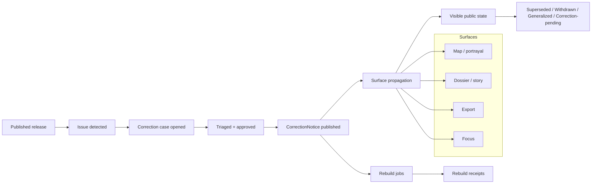

<!-- [KFM_META_BLOCK_V2]
doc_id: kfm://doc/<NEEDS-VERIFICATION-UUID>
title: Correction Contracts v1
type: standard
version: v1
status: draft
owners: <NEEDS-VERIFICATION>
created: <NEEDS-VERIFICATION-YYYY-MM-DD>
updated: <NEEDS-VERIFICATION-YYYY-MM-DD>
policy_label: <NEEDS-VERIFICATION>
related: [schemas/contracts/v1/correction/, <NEEDS-VERIFICATION: sibling contract-family docs>, <NEEDS-VERIFICATION: correction runbook>]
tags: [kfm, contracts, schemas, correction, correction-notice]
notes: [Current-session workspace evidence was PDF-only; exact repo owners, dates, sibling paths, and mounted schema files still need direct verification.]
[/KFM_META_BLOCK_V2] -->

# Correction Contracts v1

Versioned schema namespace for visible supersession, withdrawal, narrowing, and reissue artifacts.

> [!IMPORTANT]
> This README is source-grounded, but the current-session workspace exposed **PDF evidence only**. Exact sibling files, owners, dates, fixtures, and CI entrypoints remain **NEEDS VERIFICATION** unless directly rechecked in the mounted repository.

> **Status:** draft · experimental  
> **Owners:** `<NEEDS-VERIFICATION>`  
>       
> **Quick jumps:** [Scope](#scope) · [Repo fit](#repo-fit) · [Accepted inputs](#accepted-inputs) · [Exclusions](#exclusions) · [Directory tree](#directory-tree) · [Quickstart](#quickstart) · [Contract shape](#contract-shape) · [Diagram](#diagram--correction-flow) · [Validation](#validation--gates) · [Task list](#task-list--definition-of-done) · [FAQ](#faq) · [Appendix](#appendix)

## Scope

This directory is the **correction-family** contract namespace for KFM’s versioned schema layer.

Its primary job is to make **post-publication change visible and machine-checkable**. In KFM, correction is not a quiet overwrite, a file replacement, or a UI-only warning. It is a governed state transition that preserves lineage across released objects and public-facing surfaces.

This README treats **`CorrectionNotice`** as the central contract in this namespace.

### Truth posture used in this README

| Label | Meaning here |
|---|---|
| **CONFIRMED** | Directly supported by the attached KFM corpus. |
| **INFERRED** | Strongly implied by the corpus, but not directly proven as mounted repo reality in this session. |
| **PROPOSED** | A recommended working shape that fits KFM doctrine but is not confirmed implementation. |
| **NEEDS VERIFICATION** | A repo-specific detail not directly rechecked in the mounted workspace. |

[Back to top](#correction-contracts-v1)

## Repo fit

**Path:** `schemas/contracts/v1/correction/`  
**Upstream:** [Lifecycle context](#lifecycle-context) · [Validation & gates](#validation--gates)  
**Downstream:** [Surface propagation](#surface-propagation) · [Task list](#task-list--definition-of-done)

### Path note

The attached doctrine frequently describes starter artifact paths under a non-versioned placeholder such as `contracts/correction/correction_notice.schema.json`. This README adopts the **user-specified target path** `schemas/contracts/v1/correction/` without claiming that the older placeholder path was mounted repo reality.

### Upstream / downstream relationship map

| Direction | Relationship | Why it touches this directory | Status |
|---|---|---|---|
| Upstream | `ReleaseManifest` / `ReleaseProofPack` | Correction is post-release governance, so it attaches to released scope rather than bypassing it. | **CONFIRMED** |
| Upstream | `DecisionEnvelope` / `ReviewRecord` | Policy-significant change must remain review-bearing and auditable. | **CONFIRMED** |
| Downstream | map / tile / portrayal surfaces | Correction state must propagate so stale or superseded claims do not persist invisibly. | **CONFIRMED** |
| Downstream | dossier / story / export / Focus surfaces | KFM requires visible correction lineage across trust-visible public surfaces. | **CONFIRMED** |
| Adjacent | valid / invalid fixtures, policy registries, correction drills | These make the contract executable instead of purely documentary. | **PROPOSED** |
| Adjacent | runbooks and e2e correction tests | These keep documentation synchronized with correction behavior. | **PROPOSED** |

[Back to top](#correction-contracts-v1)

## Accepted inputs

This directory should contain or describe only **correction-family** material for this schema version.

Accepted inputs include:

- JSON Schema files for correction-family contracts in this namespace
- correction-specific example payloads or references to repo-wide fixture locations
- documentation that explains correction semantics, lifecycle placement, and propagation expectations
- references to shared vocabularies only when the vocabulary is owned elsewhere and **not duplicated** here

### What belongs here

| Belongs here | Why |
|---|---|
| `CorrectionNotice` schema material | It is the correction-family contract expressly named in KFM doctrine. |
| Correction field semantics | This directory is where contract meaning should stay close to machine-checkable shape. |
| Version-specific compatibility notes | Breaking or additive evolution rules belong close to the versioned schema family. |
| Links to correction drills / examples | Correction must be testable, not only described. |

## Exclusions

This directory should **not** become a catch-all for every release or runtime artifact.

| Excluded here | Goes elsewhere instead |
|---|---|
| `ReleaseManifest` / `ReleaseProofPack` | release-family contract namespace |
| `RuntimeResponseEnvelope` | runtime-family contract namespace |
| `EvidenceBundle` | runtime / evidence-family contract namespace |
| reason / obligation / rights / sensitivity registries | shared policy / vocabulary layer |
| lane-specific operator procedures | runbooks / operational docs |
| UI-only copy or alert text without contract linkage | trust-surface docs, not schema namespace |

> [!NOTE]
> A correction contract may reference these adjacent families, but it should not redefine their responsibilities here.

[Back to top](#correction-contracts-v1)

## Directory tree

```text
schemas/contracts/v1/correction/
├── README.md
└── correction_notice.schema.json              # PROPOSED / NEEDS VERIFICATION

tests/fixtures/contracts/v1/correction/        # PROPOSED / NEEDS VERIFICATION
├── valid/
└── invalid/

tests/e2e/correction/                          # PROPOSED / NEEDS VERIFICATION
```

If the mounted repo uses different fixture or test paths, update this tree to match the repo while preserving the same doctrinal roles.

## Quickstart

Use this namespace when a **released** public-safe object needs a visible post-publication change state.

1. Add or update the correction-family schema for this version.
2. Keep contract evolution additive by default.
3. Add **valid** and **invalid** fixtures.
4. Add at least one correction drill that proves downstream visibility.
5. Update this README whenever the contract role, required fields, or propagation expectations change.

### Illustrative example payload

The example below is **illustrative**, not a confirmed mounted payload.

```json
{
  "kind": "CorrectionNotice",
  "schema_version": "v1",
  "correction_id": "cn.example.2026-03-28.001",
  "correction_type": "SUPERSEDE",
  "targets": [
    "rel.example.2026-03-01.v1"
  ],
  "replacement_releases": [
    "rel.example.2026-03-15.v2"
  ],
  "reason_code": "validation.schema_failed",
  "issued_at": "2026-03-28T00:00:00Z",
  "effective_at": "2026-03-28T00:00:00Z",
  "audit_ref": "audit:correction:example:001",
  "affected_surface_classes": [
    "map",
    "dossier",
    "story",
    "export",
    "focus"
  ],
  "rebuild_refs": [
    "pbr.example.001"
  ],
  "public_note": "This release has been superseded by a corrected release.",
  "replaces": [
    "rel.example.2026-03-01.v1"
  ]
}
```

## Usage

### When to issue a correction

A correction-family contract is appropriate when a **released** object needs one of the following visible state changes:

- **SUPERSEDE** — a newer release or corrected object replaces the prior one
- **WITHDRAW** — the prior object must no longer be public-safe
- **NARROW** — exposure must be reduced, generalized, or otherwise made safer
- **REISSUE** — a corrected release replaces the original while preserving lineage

These type labels are useful, but the exact enum remains **PROPOSED / NEEDS VERIFICATION** until the mounted schema is surfaced.

### What the contract must protect

Correction must preserve all of the following:

- lineage to the affected release or artifact
- visible public note or outward-facing explanation
- downstream rebuild references where derived delivery must change
- surface-state propagation so stale claims do not persist
- audit linkage for review, policy, and rollback investigation

## Contract shape

### Confirmed minimum contract floor

These are the **CONFIRMED doctrinal minimums** for `CorrectionNotice`.

| Field or concept | Why it matters |
|---|---|
| affected releases | identifies what changed |
| replacement releases | points to the authoritative replacement when one exists |
| affected surface classes | forces propagation beyond storage-only corrections |
| rebuild refs | ties correction to derived rebuild work where needed |
| cause | preserves the reason for change |
| public note | gives outward users visible explanation |

### Repo-sharpening additions

These are **PROPOSED** but strong candidates for the first executable contract wave.

| Proposed field | Why it is useful |
|---|---|
| `correction_id` | stable identity for audit, references, and diffs |
| `correction_type` | structured supersede / withdraw / narrow / reissue handling |
| `targets` | explicit target list for release IDs, dataset IDs, or artifact IDs |
| `reason_code` | aligns correction to shared policy vocabulary instead of free text |
| `issued_at` / `effective_at` | separates issuance from effect time |
| `audit_ref` | joins correction to logs, policy decisions, and review evidence |
| `replaces` / `replaced_by` | makes bidirectional lineage machine-readable |

### Surface propagation

A correction is incomplete if it updates storage but leaves public surfaces unchanged.

At minimum, a correction notice should be able to affect:

| Surface | Why propagation matters |
|---|---|
| map / tile / portrayal | prevents stale visual claims from persisting |
| dossier | prevents detail views from presenting outdated released state |
| story | preserves narrative trust and avoids silent historical drift |
| export / report | keeps packaged outward artifacts aligned with release truth |
| Focus / governed assistance | forces runtime surfaces to show superseded, withdrawn, or correction-pending state |

[Back to top](#correction-contracts-v1)

## Diagram — correction flow



## Lifecycle context

The correction-family lifecycle is not free-form.

| Lifecycle phase | Expected meaning |
|---|---|
| opened | a correction case exists and has entered governance |
| triaged | the issue has been classified and routed |
| approved | the correction is ready for outward publication |
| notice published | the visible correction artifact exists |
| rebuild complete | affected derived delivery has been updated where required |
| closed | the correction workflow has finished with lineage preserved |

### Emitted event intent

| Event family | Why it matters |
|---|---|
| `correction.case.opened` | marks entry into governed correction handling |
| `correction.notice.published` | exposes the outward change event |
| `projection.rebuilt` | links correction to downstream rebuild evidence |

[Back to top](#correction-contracts-v1)

## Validation & gates

### Schema posture

| Rule | Status |
|---|---|
| JSON Schema Draft 2020-12 should be the contract dialect | **CONFIRMED** |
| additive evolution should be the default | **CONFIRMED** |
| breaking changes should be deliberate, versioned, and paired with fixture + doc updates | **CONFIRMED** |
| fail-closed field discipline (`additionalProperties: false` or equivalent) is a strong starter posture | **PROPOSED** |

### Minimum executable proof

A correction-family contract is not operational until it can prove all of the following:

- the schema compiles
- valid fixtures pass
- invalid fixtures fail
- one correction drill shows visible downstream state change
- at least one post-correction runtime or outward-facing sample reflects the corrected state

### Illustrative validator invocation

The command below is **illustrative pseudocode**. Exact repo paths and validator entrypoints remain **NEEDS VERIFICATION**.

```bash
python tools/validators/validate_contracts.py \
  --contracts-root <repo-root>/schemas/contracts/v1 \
  --fixtures-root <repo-root>/tests/fixtures/contracts/v1 \
  --vocab-root <repo-root>/contracts/vocab
```

### Recommended correction drill

A minimal correction drill should prove three linked objects:

1. a **previous** `ReleaseManifest` fixture  
2. a `CorrectionNotice` fixture that **supersedes** or **withdraws** it  
3. a **post-correction** outward-facing sample that shows a finite visible state such as `SUPERSEDED`, `WITHDRAWN`, or `CORRECTION-PENDING`

## Task list — definition of done

- [ ] correction-family schema compiles under JSON Schema Draft 2020-12
- [ ] valid fixture set exists
- [ ] invalid fixture set exists
- [ ] at least one correction drill proves supersession or withdrawal visibility
- [ ] shared reason-code vocabulary is referenced instead of copied into this namespace
- [ ] README reflects the current field set and propagation rules
- [ ] any breaking change is versioned and paired with updated fixtures
- [ ] outward-facing public note semantics are documented
- [ ] mounted repo paths and owners have been reverified before claiming this namespace is stable

[Back to top](#correction-contracts-v1)

## FAQ

### Why is correction its own contract family?

Because KFM treats correction as a governed publication change, not as a hidden replacement. A dedicated contract makes lineage, cause, and downstream propagation inspectable.

### Is correction only for withdrawal?

No. The correction family must handle supersession, narrowing/generalization, reissue, and withdrawal without erasing prior public state.

### Are the filenames in this README fixed?

No. The **object role** is the important part. Exact filenames and directory layout remain subject to mounted repo verification.

### Can a correction exist without downstream rebuild work?

Sometimes yes, but only if no derived delivery surface is affected. If a public map, portrayal, export, or runtime surface changes meaning, rebuild linkage should remain visible.

## Appendix

<details>
<summary><strong>Open verification items</strong></summary>

1. Confirm whether `correction_notice.schema.json` is already mounted in this directory.
2. Confirm whether fixtures live under `tests/fixtures/`, `fixtures/`, or another repo convention.
3. Confirm the exact correction-type enum and whether it is registry-backed.
4. Confirm owners, policy label, created date, and updated date for the meta block.
5. Confirm whether a correction runbook already exists and where it lives.
6. Confirm whether correction drills are colocated with contract tests or live under an e2e namespace.

</details>

<details>
<summary><strong>Editing rules for future maintainers</strong></summary>

- Keep doctrinal claims stronger than path claims.
- Prefer stable semantics over brittle filename mythology.
- Do not collapse superseded, withdrawn, generalized, or correction-pending into one generic warning state.
- Do not let runtime or UI language outrun what the correction contract can actually prove.
- When mounted repo evidence appears, replace placeholders with verified values rather than expanding inference.

</details>

[Back to top](#correction-contracts-v1)
