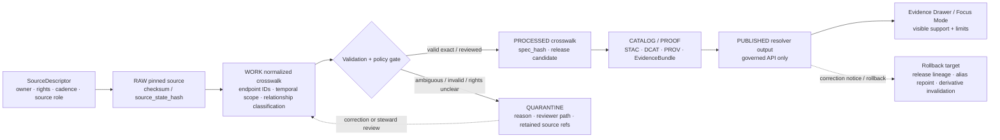

<!-- [KFM_META_BLOCK_V2]
doc_id: kfm://doc/TODO-ASSIGN-UUID
title: Crosswalk Contracts
type: standard
version: v1
status: draft
owners: TODO-CONFIRM-CONTRACT-SCHEMA-STEWARD
created: 2026-04-26
updated: 2026-04-26
intended_path: schemas/contracts/v1/crosswalk/README.md
policy_label: TODO-CONFIRM-POLICY-LABEL
evidence_mode: CORPUS_ONLY / NO_LOCAL_REPO_EVIDENCE
implementation_depth: UNKNOWN
source_status: GENERATED_THIS_RUN from uploaded Crosswalk Contracts markdown baseline; repo placement remains NEEDS_VERIFICATION
related:
  - TODO-CONFIRM-SCHEMA-HOME-ADR
  - TODO-CONFIRM-SCHEMA-INDEX
  - TODO-CONFIRM-RUNTIME-DECISION-ENVELOPE
  - TODO-CONFIRM-EVIDENCE-BUNDLE-CONTRACTS
tags:
  - kfm
  - schemas
  - contracts
  - crosswalk
  - identity
  - evidence
  - source-ledger
  - fail-closed
notes:
  - This README is written for repository adoption, but the target KFM checkout was not mounted during this drafting pass.
  - Treat paths, owners, sibling links, commands, schema names, fixture homes, CI references, and runtime behavior as PROPOSED until verified from current repository evidence.
[/KFM_META_BLOCK_V2] -->

<a id="top"></a>

# Crosswalk Contracts

<p align="center">
  <strong>Kansas Frontier Matrix</strong><br>
  Evidence-first • map-first • time-aware • governed
</p>

<p align="center">
  <a href="#scope">Scope</a> ·
  <a href="#operating-law">Operating law</a> ·
  <a href="#repo-fit">Repo fit</a> ·
  <a href="#accepted-inputs">Inputs</a> ·
  <a href="#contract-map">Contract map</a> ·
  <a href="#validation">Validation</a> ·
  <a href="#promotion-and-rollback">Promotion + rollback</a> ·
  <a href="#faq">FAQ</a>
</p>

<div align="center">


</div>

> [!IMPORTANT]
> This document is repo-ready guidance, not proof of current implementation. Claims about actual files, tests, workflows, routes, badges, owners, schemas, CI, or runtime behavior remain `UNKNOWN` until verified from current KFM repository evidence.

Versioned contract guidance for identity crosswalk schemas that make joins explicit, temporal, evidence-bound, reviewable, and fail-closed.

---

## Impact block

| Field | Value |
|---|---|
| **Status** | `draft` |
| **Owners** | `TODO-CONFIRM-CONTRACT-SCHEMA-STEWARD` |
| **Intended path** | `schemas/contracts/v1/crosswalk/README.md` |
| **Evidence mode** | `CORPUS_ONLY / NO_LOCAL_REPO_EVIDENCE` |
| **Implementation depth** | `UNKNOWN` |
| **Policy label** | `TODO-CONFIRM-POLICY-LABEL` |
| **Public posture** | Cite-or-abstain; fail closed on unresolved rights, sensitivity, ambiguity, or evidence closure |
| **Accepted inputs** | Shared crosswalk contract docs, JSON Schemas, enum fragments, examples, compatibility notes |
| **Exclusions** | Raw data, generated artifacts, policy code, validator implementation, UI code, tiles, release objects |
| **Repo verification note** | Do not convert candidate paths into markdown links until the active branch confirms those paths exist. |

| What this document does | What it does not do |
|---|---|
| Defines the governed role of shared identity crosswalk contracts. | Does not prove the target directory or schemas already exist. |
| Separates schema shape from validation, policy, evidence, release, and UI behavior. | Does not authorize public release of any crosswalk artifact. |
| Gives maintainers relationship semantics, lifecycle expectations, review gates, and rollback hooks. | Does not make crosswalk rows canonical truth. |
| Provides a safe starting point for schema and fixture work. | Does not replace EvidenceBundle resolution, policy review, or promotion. |

---

## Scope

This directory documents and, once implemented, should contain **machine-checkable contracts for identity crosswalks**.

In KFM, a crosswalk is not a convenience lookup table. It is a governed, versioned, evidence-bound bridge between identifiers, source versions, vocabularies, datasets, object systems, or release families where a join could change a public or semi-public claim.

Crosswalk contracts are needed when a downstream consumer asks questions such as:

- “Can this legacy identifier safely resolve to the current identifier?”
- “Did this source release split one feature into several features?”
- “Did several older identifiers merge into one current object?”
- “Should a join proceed, abstain, quarantine, deny, or require steward review?”
- “Which source descriptor, source artifact, release, evidence bundle, receipt, validation report, and policy decision supported this resolution?”

### Core rule

A crosswalk may support a claim only when its source descriptor, relationship classification, temporal scope, validation state, policy posture, release state, and evidence references are inspectable.

[Back to top](#top)

---

## Operating law

Crosswalks are high-risk because they can silently move meaning between systems. A wrong crosswalk can make a map, graph edge, API answer, Focus Mode summary, or exported story look authoritative while the underlying identity bridge is ambiguous.

| Rule | Meaning |
|---|---|
| **Crosswalks are bridges, not truth stores.** | They reconcile identifiers under stated evidence and temporal scope; they do not replace canonical source records or domain objects. |
| **Relationship type is mandatory.** | Every usable row must classify how identifiers relate. Hidden many-to-one or one-to-many joins are not acceptable. |
| **Temporal scope is mandatory.** | A crosswalk must know the source version, release/version time, valid time where known, and ingest/record time where applicable. |
| **Ambiguity is a first-class result.** | Ambiguous, split, merge, malformed, rights-uncertain, or unsupported rows are preserved and routed, not erased. |
| **Schema-valid is not release-approved.** | Schema validation proves shape only. Safe use requires source role, evidence closure, policy checks, review state, and promotion. |
| **Public clients use governed output.** | Normal UI surfaces use released resolver payloads or governed APIs, not raw, work, quarantine, or unreviewed crosswalk rows. |
| **AI explains; evidence decides.** | Evidence Drawer and Focus Mode may explain support and limits, but generated language never outranks EvidenceBundle, policy, review, or release state. |
| **Corrections must be reconstructable.** | Crosswalk releases need diff reports, release lineage, rollback targets, and correction notes when meaning changes. |

> [!WARNING]
> The primary failure mode is a “successful” join that should have abstained. Prefer `ABSTAIN`, quarantine, or steward review over false precision.

[Back to top](#top)

---

## Repo fit

| Field | Value |
|---|---|
| **Target path** | `schemas/contracts/v1/crosswalk/README.md` |
| **Doc type** | README-like standard doc |
| **Primary audience** | Contract/schema maintainers, data stewards, validator authors, governed API authors, Evidence Drawer and Focus Mode integrators |
| **Upstream surfaces** | Source descriptors, pinned source artifacts, domain identity specs, schema-home ADRs, validation fixtures, policy labels |
| **Downstream surfaces** | Validators, normalized crosswalk artifacts, identity resolvers, EvidenceBundles, DecisionEnvelopes, release manifests, governed APIs, map/UI trust payloads |
| **Trust boundary** | Schemas define shape; validators and policy gates decide admissibility; public clients consume governed resolver output, not raw crosswalk rows. |
| **Current repo status** | `UNKNOWN / NEEDS_VERIFICATION` — no mounted checkout was available during this drafting pass. |

### Candidate upstream and downstream links

The following are candidate path references. Keep them as plain text until the active branch confirms they exist.

| Relationship | Candidate path or surface | Status | Why it matters |
|---|---|---|---|
| Schema-home ADR | `docs/adr/ADR-0001-crosswalk-schema-home.md` | PROPOSED | Prevents duplicate authority between `contracts/` and `schemas/`. |
| Schema index | `schemas/contracts/v1/README.md` | NEEDS_VERIFICATION | Makes this lane discoverable from the machine-contract index. |
| Source descriptors | `data/registry/**/sources/*.yaml` | NEEDS_VERIFICATION | Crosswalk releases must know source role, rights, cadence, and version. |
| Hydrology extension | `schemas/contracts/v1/hydrology/nhdhr_crosswalk.schema.json` | PROPOSED / adjacent | Domain-specific NHDPlus HR / legacy COMID bridges should align with shared relationship semantics. |
| Runtime decision surface | `schemas/contracts/v1/runtime/decision_envelope.schema.json` | PROPOSED / adjacent | Ambiguous or denied joins should return finite, visible decision states. |
| Evidence support | `schemas/contracts/v1/evidence/` | NEEDS_VERIFICATION | Published crosswalk products must resolve EvidenceRefs to EvidenceBundles. |
| Tests and fixtures | `tests/contracts/`, `tests/fixtures/crosswalk/` | PROPOSED | Valid and invalid fixtures are required before promotion. |
| Validator home | `tools/validators/crosswalk/` | PROPOSED | Executable checks should not be hidden in schema prose. |
| Policy home | `policy/crosswalk/` | PROPOSED | Rights, sensitivity, source-role, ambiguity, and promotion behavior belong in policy. |

[Back to top](#top)

---

## Accepted inputs

This lane is for contract material that defines **crosswalk shape and semantics**.

Accepted content:

- `README.md` and schema-lane documentation.
- JSON Schema files for shared crosswalk object families.
- Shared enum fragments for relationship classification when the repo convention supports fragments.
- Contract examples that are clearly marked as illustrative or valid/invalid fixtures if the active branch keeps examples near schemas.
- Compatibility notes for domain-specific crosswalk contracts.
- References to validation expectations, without embedding validator implementation code.
- ADR references that explain why shared definitions belong here rather than in a domain lane.

Expected schema responsibilities:

| Responsibility | Contract expectation |
|---|---|
| Identity endpoints | Identifies both sides of the bridge without hiding source-system identity. |
| Source role | Preserves the source descriptor and source role used to justify the bridge. |
| Relationship classification | Distinguishes `exact`, `split`, `merge`, `no_legacy`, and `ambiguous` cases. |
| Temporal scope | Carries source version, release/version time, valid time where known, and ingest/record time where applicable. |
| Evidence binding | Points to source descriptors, source artifacts, run receipts, proof bundles, and EvidenceRefs. |
| Join decision support | Gives resolvers enough structure to return `ANSWER`, `ABSTAIN`, `DENY`, or `ERROR` through a governed runtime envelope where applicable. |
| Reversibility | Preserves source identifiers and relationship metadata so derived joins can be audited, corrected, superseded, or rolled back. |

[Back to top](#top)

---

## Exclusions

Do not put raw data, release artifacts, policy engines, validator implementation, or UI implementation in this directory.

| Excluded material | Goes instead | Reason |
|---|---|---|
| Raw crosswalk CSV, GDB, GeoJSON, service response, or downloaded source package | `data/raw/**` | Raw source material belongs in the lifecycle, not in schema definitions. |
| Normalized parquet / GeoParquet crosswalk outputs | `data/work/**` or `data/processed/**` | Generated artifacts must preserve run identity and lifecycle state. |
| Ambiguous, invalid, malformed, or rights-uncertain rows | `data/quarantine/**` | Quarantine is a first-class state with reasons and review path. |
| Source descriptor instances | `data/registry/**/sources/*.yaml` | Source governance lives in the registry. |
| Validation scripts | `tools/validators/**` | Executable validation logic should be discoverable and testable outside schemas. |
| Policy rules | `policy/**` | Rights, sensitivity, promotion, and deny/allow/abstain logic are policy surfaces. |
| EvidenceBundle, DecisionEnvelope, ReleaseManifest, RunReceipt, or AIReceipt instances | `data/proofs/**`, `data/receipts/**`, `data/manifests/**` | Emitted proof objects are not contract definitions. |
| MapLibre layers, tiles, or UI components | `data/published/**`, app/UI packages | Rendered delivery surfaces are downstream of governed evidence. |
| Domain-only identity rules | Domain-specific schema lanes | Shared contracts should not absorb every domain nuance. |

[Back to top](#top)

---

## Proposed directory tree

Target layout — **PROPOSED / NEEDS_VERIFICATION**:

```text
schemas/contracts/v1/crosswalk/
├── README.md
├── crosswalk_record.schema.json                 # PROPOSED
├── crosswalk_relationship.schema.json           # PROPOSED
├── crosswalk_decision.schema.json               # PROPOSED
├── crosswalk_diff_report.schema.json            # PROPOSED
├── crosswalk_quarantine_record.schema.json      # PROPOSED
└── defs/
    ├── identifier_ref.schema.json               # PROPOSED
    ├── relationship_type.schema.json            # PROPOSED
    └── crosswalk_reason_code.schema.json        # PROPOSED
```

> [!CAUTION]
> Do not create this tree blindly. First verify the active branch’s schema-home convention, naming convention, validator layout, fixture convention, and whether generic crosswalk contracts already exist elsewhere.

[Back to top](#top)

---

## Quickstart

Use this sequence only after the real KFM repository is mounted.

```bash
# Verify checkout and branch state first.
git status --short
git branch --show-current

# Confirm whether this README's target directory already exists.
test -d schemas/contracts/v1/crosswalk \
  && find schemas/contracts/v1/crosswalk -maxdepth 2 -type f | sort \
  || echo "NEEDS CREATION: schemas/contracts/v1/crosswalk"
```

Before adding or editing schemas:

1. Confirm whether `schemas/contracts/v1/` is the active machine-contract home.
2. Search for existing crosswalk, identity, hydrology, catalog, evidence, and runtime contracts.
3. Record the schema-home decision in an ADR if the repo has no existing decision.
4. Add valid and invalid fixtures before wiring validators into CI.
5. Keep ambiguous joins fail-closed until a resolver, policy gate, and reviewer path are proven.

Suggested no-network inspection commands:

```bash
find schemas contracts docs/adr tests tools policy data/registry \
  -maxdepth 4 \
  \( -iname '*crosswalk*' -o -iname '*identity*' -o -iname '*decision*' -o -iname '*evidence*' \) \
  -print 2>/dev/null | sort
```

[Back to top](#top)

---

## Usage

### Shared lane versus domain lane

Use this README to decide whether a proposed crosswalk schema belongs in the shared crosswalk lane or in a domain-specific lane.

| Put it here when the schema defines... | Put it in a domain lane when it depends on... |
|---|---|
| Reusable identifier references | Domain-specific identifiers or source vocabularies |
| Reusable relationship types | Domain-specific geometry rules |
| Ambiguity and reason-code structure | Domain-specific evidence thresholds |
| Evidence reference patterns | Domain-specific legal, cultural, sensitivity, or steward rules |
| Diff report shape | Domain-specific release semantics |
| Quarantine record shape | Source-family-specific rejection classes |
| Resolver-facing decision payload shape | A domain-specific resolver contract |

### Downstream behavior table

| Consumer | Uses this lane for | Must not do |
|---|---|---|
| Normalizers | Emit rows that match schema shape. | Silently collapse split, merge, or ambiguous cases. |
| Validators | Check required fields, enums, temporal fields, evidence refs, and source refs. | Treat schema-valid as release-approved. |
| Identity resolvers | Decide whether a join can proceed. | Expose raw ambiguous joins to public clients. |
| EvidenceBundle builders | Link crosswalk version, source descriptor, receipts, proof objects, and limitations. | Treat catalog records as proof by themselves. |
| Governed APIs | Return finite outcomes and reason codes. | Let browser/UI code infer source authority. |
| Evidence Drawer / Focus Mode | Explain crosswalk support and limitations. | Present generated text as stronger than the evidence bundle. |
| Release tooling | Compare versions and preserve correction lineage. | Overwrite prior releases without a diff, supersession, or rollback path. |

[Back to top](#top)

---

## Contract map

Candidate shared contract families — **PROPOSED**:

| Contract family | Purpose | Minimum fields or decisions | First gate |
|---|---|---|---|
| `identifier_ref` | Shared identifier reference fragment | system, namespace, value, version, authority role | schema lint |
| `relationship_type` | Shared enum fragment | known relationship values and descriptions | enum compatibility check |
| `crosswalk_reason_code` | Reusable reason codes | ambiguity, rights, missing evidence, unsupported source role, temporal mismatch, validation error | policy fixture review |
| `crosswalk_record` | One normalized mapping row or assertion | source ref, source version, from/to identifiers, relationship type, temporal fields, spec hash, evidence refs | JSON Schema + valid/invalid fixtures |
| `crosswalk_relationship` | Reusable relationship classification | `exact`, `split`, `merge`, `no_legacy`, `ambiguous`; direction rules; reason code | relationship classifier tests |
| `crosswalk_decision` | Resolver-facing join decision payload | outcome, reason code, crosswalk ref, ambiguity reason, obligations, evidence refs | resolver fixture tests |
| `crosswalk_diff_report` | Release-to-release change summary | added, removed, changed, split, merge, ambiguity counts, previous/new spec hashes | drift-diff validation |
| `crosswalk_quarantine_record` | Preserved rejected or ambiguous material | reason, row ref, source ref, proposed disposition, reviewer role | quarantine policy fixtures |

### Relationship type guidance

| Relationship type | Meaning | Default resolver posture |
|---|---|---|
| `exact` | One identifier maps to one counterpart under the stated source version and evidence scope. | May resolve if evidence, source role, temporal scope, review state, policy gates, and release state pass. |
| `split` | One prior identifier maps to multiple newer identifiers, or one source-side identifier has multiple target-side candidates. | `ABSTAIN` unless geometry, reachcode, temporal, or steward-approved disambiguation succeeds. |
| `merge` | Multiple prior identifiers map to one newer identifier, or multiple source-side records collapse into one target. | `ABSTAIN` or require review if the downstream claim depends on pre-merge distinction. |
| `no_legacy` | Current identity has no known legacy counterpart. | May proceed only for current-identity claims; do not fabricate a legacy key. |
| `ambiguous` | Relationship cannot be safely classified or resolved from available evidence. | Fail closed; quarantine or return `ABSTAIN` with reason. |

> [!TIP]
> Add new relationship types only through a compatibility note, schema version bump, and fixture update. Enums become public contract once downstream resolvers depend on them.

[Back to top](#top)

---

## Record anatomy

This is a contract shape guide, not a confirmed schema.

| Field group | Why it exists | Example fields |
|---|---|---|
| Crosswalk identity | Names the bridge and version. | `crosswalk_id`, `crosswalk_family`, `crosswalk_version`, `spec_hash` |
| Source support | Preserves source role and source version. | `source_ref`, `source_dataset`, `source_version`, `source_artifact_ref`, `source_state_hash` |
| Identifier endpoints | Names both sides without hiding system identity. | `from_identifier`, `to_identifier` |
| Relationship classification | Prevents silent one-to-many or many-to-one collapse. | `relationship_type`, `relationship_confidence`, `reason_code`, `relationship_notes` |
| Temporal scope | Prevents joins across incompatible releases or time windows. | `valid_time`, `recorded_at`, `ingested_at`, `release_time` |
| Evidence closure | Makes support reconstructable. | `evidence_refs`, `receipt_refs`, `validation_report_refs`, `policy_decision_ref` |
| Review and release | Prevents raw or unreviewed records from leaking into published outputs. | `review_state`, `release_state`, `limitations`, `obligations` |
| Correction lineage | Supports reversibility. | `supersedes`, `superseded_by`, `correction_notice_ref`, `rollback_ref` |

### Illustrative record shape

This example is **illustrative only**. It is not a confirmed schema and should not be copied into fixtures until the active branch confirms field names.

```json
{
  "crosswalk_id": "kfm:crosswalk:example:2026-04-26",
  "crosswalk_family": "example-identity-bridge",
  "crosswalk_version": "2026-04-26",
  "source_ref": "kfm:source:TODO",
  "source_dataset": "TODO-CONFIRM-SOURCE-DATASET",
  "source_version": "TODO-CONFIRM-SOURCE-VERSION",
  "source_artifact_ref": "kfm:artifact:TODO",
  "source_state_hash": "sha256:TODO",
  "from_identifier": {
    "system": "legacy-system",
    "namespace": "TODO",
    "value": "12345",
    "version": "legacy-release"
  },
  "to_identifier": {
    "system": "current-system",
    "namespace": "TODO",
    "value": "abcde",
    "version": "current-release"
  },
  "relationship_type": "exact",
  "relationship_confidence": "reviewed",
  "reason_code": "direct_source_mapping",
  "valid_time": {
    "valid_from": "2026-04-26",
    "valid_to": null
  },
  "recorded_at": "2026-04-26T00:00:00Z",
  "ingested_at": "2026-04-26T00:00:00Z",
  "spec_hash": "sha256:TODO",
  "evidence_refs": [
    "kfm:evidence:TODO"
  ],
  "receipt_refs": [
    "kfm:receipt:TODO"
  ],
  "review_state": "TODO-CONFIRM-ENUM",
  "release_state": "candidate",
  "limitations": [
    "Illustrative example only; source schema and repo field names need verification."
  ]
}
```

[Back to top](#top)

---

## Lifecycle flow

PROPOSED governed crosswalk flow:



The diagram is intentionally lifecycle-centered. It does not imply that raw crosswalk data, work products, or quarantine records are public surfaces.

[Back to top](#top)

---

## Finite outcomes

Resolver and runtime surfaces should make negative outcomes explicit.

| Condition | Default outcome | Required visible reason |
|---|---|---|
| Valid schema, trusted source role, closed evidence, passed policy, reviewed release | `ANSWER` | `resolved_by_released_crosswalk` |
| Missing source descriptor, source version, evidence ref, or EvidenceBundle | `ABSTAIN` | `missing_evidence` |
| `split`, `merge`, or `ambiguous` relationship without enough disambiguation | `ABSTAIN` | `ambiguous_crosswalk_relationship` |
| Rights, sensitivity, steward restriction, or policy block | `DENY` | `policy_denied` |
| Invalid JSON, malformed row, validator crash, or unreadable artifact | `ERROR` | `validation_or_runtime_error` |
| Current object has no legacy counterpart but the query requires legacy history | `ABSTAIN` | `no_legacy_counterpart` |
| Current object has no legacy counterpart and the query is current-only | `ANSWER` if other gates pass | `current_identity_only` |

[Back to top](#top)

---

## Validation

Validation should prove more than JSON shape. It should prove that unsafe joins fail closed.

### Minimum validation layers

| Layer | Purpose | Example checks |
|---|---|---|
| Schema validation | Contract shape | required fields, identifier refs, enum values, timestamps, arrays, nullability |
| Relationship classification | Join semantics | exact/split/merge/no_legacy/ambiguous fixtures; direction rules; no hidden many-to-many collapse |
| Temporal validation | Release compatibility | source version present; valid windows coherent; recorded/ingested time present where required |
| Evidence closure | Support reconstructability | EvidenceRefs resolve; source descriptor exists; receipt/proof refs present where required |
| Policy validation | Rights and sensitivity | unknown rights deny or abstain; restricted source role cannot authorize public release |
| Diff validation | Release-to-release drift | added/removed/changed/split/merge counts; prior and new spec hashes recorded |
| Public path validation | Trust membrane | no public route reads raw/work/quarantine/unreviewed rows |

### Fixture matrix

| Fixture | Expected outcome | Why it exists |
|---|---|---|
| valid exact mapping | `ANSWER` after release gates | proves happy path without weakening policy |
| missing source descriptor | `ABSTAIN` | prevents unsupported joins |
| missing source version | `ABSTAIN` or quarantine | prevents temporal drift |
| split mapping | `ABSTAIN` unless disambiguated | prevents one-to-many collapse |
| merge mapping | `ABSTAIN` or review | prevents many-to-one loss of distinction |
| no legacy current-only query | `ANSWER` if other gates pass | permits current claims without fake legacy IDs |
| no legacy history query | `ABSTAIN` | prevents fabricated historical continuity |
| ambiguous relationship | quarantine + `ABSTAIN` | preserves uncertainty |
| rights unknown | `DENY` or `ABSTAIN` according to policy | prevents unlawful or inappropriate release |
| invalid JSON | `ERROR` | distinguishes technical failure from evidence insufficiency |

### Suggested command shape

Adapt to the actual repo toolchain after inspection.

```bash
# PROPOSED only: adapt to repo-native validator commands.
python -m json.tool tests/fixtures/crosswalk/valid_exact.json >/dev/null
python tools/validators/crosswalk/validate_crosswalk.py tests/fixtures/crosswalk/valid_exact.json
python tools/validators/crosswalk/validate_crosswalk.py tests/fixtures/crosswalk/invalid_missing_source.json
python tools/validators/crosswalk/check_relationships.py tests/fixtures/crosswalk/relationships/
python tools/validators/crosswalk/check_diff_report.py tests/fixtures/crosswalk/diff_report.json
```

> [!NOTE]
> Commands above are a pattern, not a claim. Replace them with the repository’s actual validator language, package manager, and CI runner after inspection.

[Back to top](#top)

---

## Promotion and rollback

Promotion is a governed state transition, not a file move.

### Before merge

- [ ] Replace `TODO-ASSIGN-UUID` with a real `kfm://doc/<uuid>` value.
- [ ] Replace `TODO-CONFIRM-CONTRACT-SCHEMA-STEWARD` with the confirmed owner.
- [ ] Confirm `policy_label`.
- [ ] Verify whether `schemas/contracts/v1/crosswalk/` already exists.
- [ ] Confirm whether shared crosswalk contracts belong here or in a different schema home.
- [ ] Search for existing crosswalk, identity, hydrology, evidence, runtime, and catalog contracts.
- [ ] Avoid duplicate authority with any domain-specific crosswalk schemas.
- [ ] Confirm whether fixtures live beside schemas, under `tests/fixtures/`, or both.
- [ ] Add or update a schema-home ADR if the repo does not already settle this.
- [ ] Verify all relative links before converting path references into markdown links.

### Before publication or runtime use

- [ ] Source descriptor exists and includes owner, rights, cadence, source role, access method, citation text, and update/freshness expectations.
- [ ] Raw source artifact is pinned by checksum or source state hash.
- [ ] Relationship classifier covers `exact`, `split`, `merge`, `no_legacy`, and `ambiguous`.
- [ ] Ambiguous and invalid rows are preserved in quarantine with reasons.
- [ ] Processed crosswalk artifact carries `spec_hash`.
- [ ] Release candidate has a diff report.
- [ ] EvidenceRefs resolve to an EvidenceBundle.
- [ ] Policy decision is recorded and fail-closed on unknown rights or restricted release.
- [ ] DecisionEnvelope or runtime response can express `ANSWER`, `ABSTAIN`, `DENY`, and `ERROR` for unsafe joins.
- [ ] Public route reads only promoted resolver output.
- [ ] UI does not infer source rights, source authority, or relationship semantics from tiles or raw rows.

### Release object expectations

A release-significant crosswalk should be reconstructable through:

- source descriptor reference;
- raw artifact digest or source state hash;
- normalized artifact digest;
- `spec_hash`;
- validation report;
- policy decision;
- EvidenceBundle reference;
- diff report;
- review record;
- release manifest;
- rollback reference.

### Rollback triggers

Rollback or withdrawal should be available when:

- a source release is discovered to be superseded, withdrawn, or misread;
- a relationship type was misclassified;
- split/merge ambiguity was published as exact;
- source rights or sensitivity posture changes;
- an EvidenceBundle fails to resolve;
- a validator or policy gate was bypassed;
- a downstream API or UI used raw/work/quarantine rows as public truth.

Rollback should invalidate or repoint downstream derivatives, including resolver caches, API aliases, graph edges, map layers, search indexes, Evidence Drawer payloads, Focus Mode context, and story exports where applicable.

[Back to top](#top)

---

## Domain example: hydrology identity bridge

A hydrology crosswalk such as an NHDPlus HR Permanent Identifier ↔ legacy COMID bridge is a domain-specific example, not proof that this shared lane exists in the repository.

| Domain concern | Shared crosswalk alignment |
|---|---|
| Permanent Identifier and legacy COMID are not the same identifier system. | Use `identifier_ref` for both endpoints. |
| One legacy identifier may split, merge, or become ambiguous in a newer fabric. | Use shared `relationship_type` semantics. |
| A join may depend on geometry, reachcode, HUC12, or source version. | Keep domain-specific disambiguation fields in the hydrology schema. |
| Ambiguity can change public hydrology claims. | Return `ABSTAIN` or route to steward review. |
| Source release changes can alter mappings. | Emit a crosswalk diff report and supersession lineage. |

> [!TIP]
> Shared crosswalk contracts should provide reusable semantics. Hydrology should keep domain-specific evidence, geometry, reachcode, HUC, and water-network rules in its own lane.

[Back to top](#top)

---

## Failure modes

| Failure mode | Symptom | Required response |
|---|---|---|
| Silent split collapse | One legacy ID maps to multiple targets but API returns one as certain. | `ABSTAIN`, quarantine, or steward-approved disambiguation. |
| Silent merge collapse | Multiple legacy IDs collapse into one target and distinctions disappear. | Preserve all source IDs; require review for claims depending on the distinction. |
| Missing source version | Mapping cannot be tied to a release or snapshot. | Quarantine or `ABSTAIN`; do not publish as current truth. |
| Missing EvidenceBundle | UI or AI can explain result only by prose. | `ABSTAIN`; block public claim until evidence closes. |
| Rights unknown | Source allows internal use but public redistribution is unclear. | Fail closed; `DENY` or `ABSTAIN` based on policy. |
| Schema-valid but policy-unsafe | Row passes JSON Schema but source role is not authoritative. | Policy denies or requires review. |
| Raw row exposed to UI | Browser receives unpublished source row or quarantine row. | Treat as trust membrane breach; remove route and audit. |
| Diff omitted | New release overwrites prior mapping without explaining changes. | Block promotion; require diff report and supersession lineage. |
| AI overstates relationship | Focus Mode says “same feature” when relationship is ambiguous. | Enforce bounded answer with visible evidence and limitations. |

[Back to top](#top)

---

## Definition of done

This README is healthy when it:

- gives maintainers a clear home for shared crosswalk contracts;
- prevents identity joins from becoming silent, many-to-one or one-to-many trust breaks;
- keeps schemas, validators, policies, raw data, processed outputs, receipts, proofs, release manifests, and UI surfaces distinct;
- documents unknowns without upgrading them through tone;
- can be linked from the relevant schema index, object map, validator lane, hydrology identity ADR, evidence contract, and runtime decision contract;
- gives reviewers enough checklists to block unsafe promotion;
- gives future maintainers enough rollback hooks to reverse a bad crosswalk release.

[Back to top](#top)

---

## FAQ

### Is a crosswalk the same as canonical truth?

No. A crosswalk is an evidence-bound reconciliation artifact. It can support a join, but it does not replace canonical source records, domain objects, EvidenceBundles, policy decisions, review records, or release decisions.

### Can the UI read crosswalk files directly?

No. Public clients and normal UI surfaces should use governed resolver output and released artifacts. Raw, work, quarantine, and unreviewed crosswalk material are not public truth surfaces.

### Does a schema-valid crosswalk row mean the join is safe?

No. Schema validity proves shape, not admissibility. Safe use requires source role, temporal scope, relationship classification, policy checks, evidence closure, review state, and release state.

### Should ambiguous rows be deleted?

No. Preserve them in quarantine with reasons and a reviewer path. Deleting ambiguity makes future correction and audit harder.

### Can a domain keep a domain-specific crosswalk schema?

Yes. Domain-specific identity bridges can keep domain-specific schemas, fields, fixtures, and validators. Shared fields and relationship semantics should still align with this crosswalk lane to avoid drift.

### What should happen when a source releases a new crosswalk?

Re-run the normalizer, relationship classifier, diff report, fixtures, EvidenceBundle closure, policy gates, and promotion review. Do not overwrite the prior release without correction or supersession lineage.

### Can Focus Mode answer crosswalk questions?

Yes, but only over released, policy-safe evidence. If EvidenceRefs do not resolve, if the relationship is ambiguous, or if policy blocks exposure, Focus Mode should return `ABSTAIN` or `DENY`, not a fluent guess.

[Back to top](#top)

---

## Appendix

<details>
<summary><strong>Glossary</strong></summary>

| Term | Meaning in this README |
|---|---|
| **Crosswalk** | A versioned bridge between identifiers, systems, releases, vocabularies, or object families. |
| **Identity resolver** | Governed service or tool that uses crosswalk evidence and policy to decide whether a join can proceed. |
| **Relationship type** | Classification of how identifiers relate: `exact`, `split`, `merge`, `no_legacy`, or `ambiguous`. |
| **ABSTAIN** | Runtime outcome for cases where KFM has insufficient admissible evidence to answer safely. |
| **DENY** | Runtime or promotion outcome for cases where policy blocks exposure or release. |
| **ERROR** | Technical or process failure that prevents reliable evaluation. |
| **Quarantine** | Preserved non-public state for rejected, ambiguous, malformed, rights-uncertain, or sensitive material. |
| **spec_hash** | Deterministic hash identity for the normalized specification, batch, or artifact family. |
| **EvidenceBundle** | Release-significant support object resolving EvidenceRefs and limitations. |
| **DecisionEnvelope** | Finite decision object carrying outcome, reason codes, obligations, evidence refs, and audit refs. |
| **SourceDescriptor** | Registry record describing source owner, role, rights, cadence, access method, freshness, and validation expectations. |
| **ReleaseManifest** | Release object that binds artifacts, digests, evidence, policy, review, and rollback target. |
| **Diff report** | Release-to-release change report that makes added, removed, changed, split, merge, and ambiguity changes visible. |

</details>

<details>
<summary><strong>Open verification backlog</strong></summary>

- Confirm active repository topology and schema-home convention.
- Confirm whether generic crosswalk contracts already exist.
- Confirm whether hydrology crosswalk schemas should import shared crosswalk definitions or remain fully domain-local.
- Confirm owner / CODEOWNERS coverage for `schemas/contracts/v1/crosswalk/`.
- Confirm policy label for this README.
- Confirm fixture placement convention.
- Confirm JSON Schema draft/version target.
- Confirm validator language and CI runner.
- Confirm whether crosswalk decisions should reuse a runtime `DecisionEnvelope` schema or define a narrower domain decision schema.
- Confirm release object landing paths for EvidenceBundles, DecisionEnvelopes, diff reports, release manifests, and rollback manifests.
- Confirm whether the source registry uses YAML, JSON, or both.
- Confirm whether badges should be static placeholders or generated from verified workflow outputs.
- Confirm whether the documentation registry requires explicit successor/predecessor links.
- Confirm whether exact enum names should be uppercase or lowercase in runtime envelopes.

</details>

<details>
<summary><strong>Reviewer checklist</strong></summary>

- [ ] No statement claims implementation behavior without repo evidence.
- [ ] All TODOs are either resolved or intentionally left as TODOs.
- [ ] All candidate paths are verified before becoming markdown links.
- [ ] Crosswalk row examples are marked illustrative until schema fixtures exist.
- [ ] Relationship types are finite and testable.
- [ ] Ambiguity is preserved and visible.
- [ ] Public client access is limited to governed resolver output.
- [ ] EvidenceBundle resolution is required before consequential answers.
- [ ] Rollback and correction paths are stated.
- [ ] Domain-specific examples do not make shared contracts swallow domain nuance.

</details>

[Back to top](#top)
