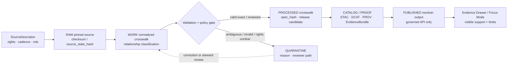

<!-- [KFM_META_BLOCK_V2]
doc_id: kfm://doc/TODO-NEEDS-UUID
title: Crosswalk Contracts
type: standard
version: v1
status: draft
owners: TODO-NEEDS-OWNER (contract/schema steward)
created: 2026-04-26
updated: 2026-04-26
policy_label: TODO-NEEDS-POLICY-LABEL
related: [TODO-NEEDS-REPO-LINK-VERIFICATION]
tags: [kfm, schemas, contracts, crosswalk, identity, evidence]
notes: [Created for schemas/contracts/v1/crosswalk/README.md; target repo was not mounted in the current session, so owners, policy label, doc_id UUID, sibling links, and existing schema inventory need repo-backed verification.]
[/KFM_META_BLOCK_V2] -->

<a id="top"></a>

# Crosswalk Contracts

Versioned contract guidance for identity crosswalk schemas that make joins explicit, temporal, evidence-bound, and fail-closed.

<div align="left">


</div>

> [!IMPORTANT]
> **Status:** experimental  
> **Owners:** `TODO-NEEDS-OWNER`  
> **Path:** `schemas/contracts/v1/crosswalk/README.md`  
> **Role:** shared schema-contract lane for governed identity bridges and join-risk controls  
> **Quick jumps:** [Scope](#scope) · [Repo fit](#repo-fit) · [Accepted inputs](#accepted-inputs) · [Exclusions](#exclusions) · [Directory tree](#directory-tree) · [Quickstart](#quickstart) · [Usage](#usage) · [Diagram](#diagram) · [Contract matrix](#contract-matrix) · [Review gates](#review-gates) · [FAQ](#faq) · [Appendix](#appendix)

> [!NOTE]
> **Current evidence posture:** this README is repo-ready, but the active KFM checkout was not available during this drafting pass. Treat file inventory, sibling links, schema names, owner fields, and CI commands as **PROPOSED** or **NEEDS VERIFICATION** until confirmed in the target branch.

---

## Scope

This directory documents and, once implemented, should contain **machine-checkable contracts for identity crosswalks**.

In KFM, a crosswalk is not a convenience lookup table. It is a governed, versioned, evidence-bound bridge between identifiers, source versions, vocabularies, datasets, or object systems where a join could change a public claim.

Crosswalk contracts are needed when a downstream consumer asks questions such as:

- “Can this legacy identifier safely resolve to the current identifier?”
- “Did this source release split one feature into several features?”
- “Did several older identifiers merge into one current object?”
- “Should a join proceed, abstain, quarantine, or require steward review?”
- “Which release, evidence bundle, receipt, and validation report supported this resolution?”

### Core rule

A crosswalk may support a claim only when its source descriptor, relationship classification, temporal scope, validation state, policy posture, and evidence references are inspectable.

[Back to top](#top)

---

## Repo fit

| Field | Value |
|---|---|
| **Target path** | `schemas/contracts/v1/crosswalk/README.md` |
| **Doc type** | README-like standard doc |
| **Primary audience** | contract/schema maintainers, data stewards, validator authors, governed API authors, Evidence Drawer / Focus Mode integrators |
| **Upstream surfaces** | source descriptors, pinned source artifacts, domain identity specs, schema-home ADRs, validation fixtures |
| **Downstream surfaces** | validators, normalized crosswalk artifacts, identity resolvers, EvidenceBundles, DecisionEnvelopes, release manifests, governed APIs, map/UI trust payloads |
| **Trust boundary** | schemas define the shape; validators and policy gates decide admissibility; public clients consume governed resolver output, not raw crosswalk rows |
| **Current repo status** | `NEEDS VERIFICATION` — no mounted checkout was available during this drafting pass |

### Upstream and downstream links

The following links are intentionally written as paths rather than markdown links until the active branch confirms they exist.

| Relationship | Candidate path or surface | Status | Why it matters |
|---|---:|---|---|
| Schema-home ADR | `docs/adr/ADR-0001-crosswalk-schema-home.md` | PROPOSED | Prevents duplicate authority between `contracts/` and `schemas/`. |
| Source descriptors | `data/registry/**/sources/*.yaml` | NEEDS VERIFICATION | Crosswalk releases must know source role, rights, cadence, and source version. |
| Hydrology extension | `schemas/contracts/v1/hydrology/nhdhr_crosswalk.schema.json` | PROPOSED / adjacent | Domain-specific NHDPlus HR / COMID bridge should extend or reference the shared crosswalk pattern. |
| Runtime decision surface | `schemas/contracts/v1/runtime/decision_envelope.schema.json` | PROPOSED / adjacent | Ambiguous or denied joins should return finite, visible decision states. |
| Evidence support | `schemas/contracts/v1/evidence/` | NEEDS VERIFICATION | Published crosswalk products must resolve EvidenceRefs to EvidenceBundles. |
| Tests and fixtures | `tests/contracts/`, `tests/fixtures/crosswalk/` | PROPOSED | Valid and invalid fixtures are required before promotion. |

[Back to top](#top)

---

## Accepted inputs

This directory is for contract material that defines **crosswalk shape and semantics**.

Accepted content:

- `README.md` and other schema-lane documentation.
- JSON Schema files for shared crosswalk object families.
- Shared enum fragments for relationship classification when the repo convention supports fragments.
- Contract examples that are clearly marked as illustrative or valid/invalid fixtures if the active branch keeps schema examples near schemas.
- Compatibility notes for domain-specific crosswalk contracts.
- References to validation expectations, but not validator implementation code.

Expected schema responsibilities:

| Responsibility | Contract expectation |
|---|---|
| Identity endpoints | Identifies both sides of the bridge without hiding source-system identity. |
| Relationship classification | Distinguishes `exact`, `split`, `merge`, `no_legacy`, and `ambiguous` cases. |
| Temporal scope | Carries source version, release/version time, valid time where known, and ingest/record time where applicable. |
| Evidence binding | Points to source descriptors, source artifacts, run receipts, proof bundles, and EvidenceRefs. |
| Join decision support | Gives resolvers enough structure to return `ANSWER`, `ABSTAIN`, `DENY`, or `ERROR` through the governed runtime envelope where applicable. |
| Reversibility | Preserves source identifiers and relationship metadata so derived joins can be audited and rolled back. |

[Back to top](#top)

---

## Exclusions

Do not put raw data, release artifacts, policy engines, or UI implementation in this directory.

| Excluded material | Goes instead | Reason |
|---|---:|---|
| Raw crosswalk CSV, GDB, GeoJSON, or service responses | `data/raw/**` | Raw source material belongs in the lifecycle, not in schema definitions. |
| Normalized parquet / GeoParquet crosswalk outputs | `data/work/**` or `data/processed/**` | Generated artifacts must preserve run identity and lifecycle state. |
| Ambiguous or invalid rows | `data/quarantine/**` | Quarantine is a first-class state with reasons and review path. |
| Source descriptor instances | `data/registry/**/sources/*.yaml` | Source governance lives in the registry. |
| Validation scripts | `tools/validators/**` | Executable validation logic should be discoverable and testable outside schemas. |
| Policy rules | `policy/**` | Rights, sensitivity, promotion, and deny/allow/abstain logic are policy surfaces. |
| EvidenceBundle, DecisionEnvelope, ReleaseManifest instances | `data/proofs/**`, `data/receipts/**`, `data/manifests/**` | Emitted proof objects are not contract definitions. |
| MapLibre layers, tiles, or UI components | `data/published/**`, app/UI packages | Rendered delivery surfaces are downstream of governed evidence. |
| Domain-only identity rules | domain-specific schema lanes | Shared contracts should not absorb every domain nuance. |

[Back to top](#top)

---

## Directory tree

Target layout — **PROPOSED / NEEDS VERIFICATION**:

```text
schemas/contracts/v1/crosswalk/
├── README.md
├── crosswalk_record.schema.json                 # PROPOSED
├── crosswalk_relationship.schema.json           # PROPOSED
├── crosswalk_decision.schema.json               # PROPOSED
├── crosswalk_diff_report.schema.json            # PROPOSED
├── crosswalk_quarantine_record.schema.json      # PROPOSED
└── defs/
    ├── relationship_type.schema.json            # PROPOSED
    └── identifier_ref.schema.json               # PROPOSED
```

> [!CAUTION]
> Do not create this tree blindly. First verify the active branch’s schema-home convention, naming convention, validator layout, and whether generic crosswalk contracts already exist elsewhere.

[Back to top](#top)

---

## Quickstart

Use this sequence after the real KFM repository is mounted.

```bash
# Verify the checkout and branch state first.
git status --short
git branch --show-current

# Confirm whether this README's target directory already exists.
test -d schemas/contracts/v1/crosswalk \
  && find schemas/contracts/v1/crosswalk -maxdepth 2 -type f | sort \
  || echo "NEEDS CREATION: schemas/contracts/v1/crosswalk"
```

Before adding or editing schemas:

1. Confirm whether `schemas/contracts/v1/` is the active machine-contract home.
2. Search for existing crosswalk, identity, hydrology, catalog, and runtime contracts.
3. Record the schema-home decision in an ADR if the repo has no existing decision.
4. Add valid and invalid fixtures before wiring validators into CI.
5. Keep ambiguous joins fail-closed until a resolver, policy gate, and reviewer path are proven.

```bash
# Suggested no-network inspection commands.
find schemas contracts docs/adr tests tools policy data/registry \
  -maxdepth 4 \
  \( -iname '*crosswalk*' -o -iname '*identity*' -o -iname '*decision*' \) \
  -print 2>/dev/null | sort
```

[Back to top](#top)

---

## Usage

### How maintainers should use this lane

Use this README to decide whether a proposed crosswalk schema belongs in the shared crosswalk lane or in a domain-specific lane.

A schema belongs here when it defines a reusable crosswalk concept:

- identifier references
- relationship types
- ambiguity fields
- evidence references
- diff report shape
- quarantine record shape
- common decision payload shape

A schema belongs in a domain lane when it depends on domain-specific identifiers, source vocabularies, geometry, or evidence rules.

### How downstream systems should use crosswalk contracts

| Consumer | Uses this lane for | Must not do |
|---|---|---|
| Normalizers | emit rows that match schema shape | silently collapse split or merge cases |
| Validators | check required fields, enums, temporal fields, and EvidenceRefs | treat schema-valid as release-approved |
| Identity resolvers | decide whether a join can proceed | expose raw ambiguous joins to public clients |
| EvidenceBundle builders | link crosswalk version, source descriptor, receipts, and proof objects | treat catalog records as proof by themselves |
| Governed APIs | return finite outcomes and reason codes | let browser/UI code infer source authority |
| Evidence Drawer / Focus Mode | explain crosswalk support and limitations | present generated text as stronger than the evidence bundle |

### Illustrative record shape

This example is **illustrative only**. It is not a confirmed schema and should not be copied into fixtures until the active branch confirms field names.

```json
{
  "crosswalk_id": "kfm:crosswalk:example:2026-04-26",
  "source_ref": "kfm:source:TODO",
  "source_dataset": "TODO-NEEDS-SOURCE-DATASET",
  "source_version": "TODO-NEEDS-SOURCE-VERSION",
  "from_identifier": {
    "system": "legacy-system",
    "value": "12345"
  },
  "to_identifier": {
    "system": "current-system",
    "value": "abcde"
  },
  "relationship_type": "exact",
  "valid_time": {
    "valid_from": "2026-04-26",
    "valid_to": null
  },
  "recorded_at": "2026-04-26T00:00:00Z",
  "spec_hash": "sha256:TODO",
  "evidence_refs": [
    "kfm:evidence:TODO"
  ],
  "limitations": [
    "Illustrative example only; source schema and repo field names need verification."
  ]
}
```

[Back to top](#top)

---

## Diagram

PROPOSED governed crosswalk flow:



The diagram is intentionally lifecycle-centered. It does not imply that raw crosswalk data, work products, or quarantine records are public surfaces.

[Back to top](#top)

---

## Contract matrix

Candidate shared contract families — **PROPOSED**:

| Contract family | Purpose | Minimum fields or decisions | First gate |
|---|---|---|---|
| `crosswalk_record` | One normalized mapping row or assertion | source ref, source version, from/to identifiers, relationship type, temporal fields, spec hash, evidence refs | JSON Schema + valid/invalid fixtures |
| `crosswalk_relationship` | Reusable relationship classification | `exact`, `split`, `merge`, `no_legacy`, `ambiguous`; direction rules; reason code | relationship classifier tests |
| `crosswalk_decision` | Resolver-facing join decision payload | decision outcome, reason code, crosswalk ref, ambiguity reason, obligations | resolver fixture tests |
| `crosswalk_diff_report` | Release-to-release change summary | added, removed, changed, split, merge, ambiguity counts, previous/new spec hashes | drift-diff validation |
| `crosswalk_quarantine_record` | Preserved rejected or ambiguous material | reason, row ref, source ref, proposed disposition, reviewer role | quarantine policy fixtures |
| `identifier_ref` | Shared identifier reference fragment | system, namespace, value, version, authority role | schema lint |
| `relationship_type` | Shared enum fragment | known relationship values and descriptions | enum compatibility check |

### Relationship type guidance

| Relationship type | Meaning | Default resolver posture |
|---|---|---|
| `exact` | One identifier maps to one counterpart under the stated source version and evidence scope. | May resolve if evidence, source role, and policy gates pass. |
| `split` | One prior identifier maps to multiple newer identifiers, or one source-side identifier has multiple target-side candidates. | ABSTAIN unless geometry, reachcode, temporal, or steward-approved disambiguation succeeds. |
| `merge` | Multiple prior identifiers map to one newer identifier, or multiple source-side records collapse into one target. | ABSTAIN or require review if the downstream claim depends on pre-merge distinction. |
| `no_legacy` | Current identity has no known legacy counterpart. | May proceed only for current-identity claims; do not fabricate a legacy key. |
| `ambiguous` | Relationship cannot be safely classified or resolved from available evidence. | Fail closed; quarantine or return ABSTAIN with reason. |

[Back to top](#top)

---

## Review gates

### Before merge

- [ ] Replace `TODO-NEEDS-UUID` with a real `kfm://doc/<uuid>` value.
- [ ] Replace `TODO-NEEDS-OWNER` with the confirmed contract/schema owner.
- [ ] Confirm `policy_label`.
- [ ] Verify whether `schemas/contracts/v1/crosswalk/` already exists.
- [ ] Confirm whether shared crosswalk contracts belong here or in a different schema home.
- [ ] Search for existing hydrology crosswalk contracts and avoid duplicate authority.
- [ ] Confirm whether fixtures live beside schemas, under `tests/fixtures/`, or both.
- [ ] Add or update a schema-home ADR if the repo does not already settle this.
- [ ] Verify all relative links before converting path references into markdown links.

### Before publication or runtime use

- [ ] Source descriptor exists and includes owner, rights, cadence, source role, and citation text.
- [ ] Raw source artifact is pinned by checksum or source state hash.
- [ ] Relationship classifier covers `exact`, `split`, `merge`, `no_legacy`, and `ambiguous`.
- [ ] Ambiguous and invalid rows are preserved in quarantine with reasons.
- [ ] Processed crosswalk artifact carries `spec_hash`.
- [ ] Release candidate has a diff report.
- [ ] EvidenceRefs resolve to an EvidenceBundle.
- [ ] DecisionEnvelope or runtime response can express ABSTAIN / DENY / ERROR for unsafe joins.
- [ ] Public route reads only promoted resolver output.
- [ ] UI does not infer source rights, authority, or relationship semantics from tiles or raw rows.

### Definition of done

This README is healthy when it:

- gives maintainers a clear home for shared crosswalk contracts;
- prevents identity joins from becoming silent, many-to-one or one-to-many trust breaks;
- keeps schemas, validators, policies, raw data, processed outputs, receipts, proofs, and UI surfaces distinct;
- documents unknowns without upgrading them through tone;
- can be linked from the relevant schema index, object map, validator lane, and hydrology identity ADR.

[Back to top](#top)

---

## FAQ

### Is a crosswalk the same as canonical truth?

No. A crosswalk is an evidence-bound reconciliation artifact. It can support a join, but it does not replace canonical source records, domain objects, EvidenceBundles, or release decisions.

### Can the UI read crosswalk files directly?

No. Public clients and normal UI surfaces should use governed resolver output and released artifacts. Raw, work, quarantine, and unreviewed crosswalk material are not public truth surfaces.

### Does a schema-valid crosswalk row mean the join is safe?

No. Schema validity proves shape, not admissibility. Safe use requires source role, temporal scope, relationship classification, policy checks, evidence closure, and release state.

### Should ambiguous rows be deleted?

No. Preserve them in quarantine with reasons and a reviewer path. Deleting ambiguity makes future correction and audit harder.

### Can hydrology keep a domain-specific crosswalk schema?

Yes. Domain-specific identity bridges such as NHDPlus HR Permanent Identifier ↔ legacy COMID can keep domain-specific schemas, fields, and fixtures. Shared fields and relationship semantics should still be aligned with this crosswalk lane to avoid drift.

### What should happen when a source releases a new crosswalk?

Re-run the normalizer, relationship classifier, diff report, fixtures, EvidenceBundle closure, policy gates, and promotion review. Do not overwrite the prior release without correction or supersession lineage.

[Back to top](#top)

---

## Appendix

<details>
<summary><strong>Glossary</strong></summary>

| Term | Meaning in this README |
|---|---|
| **Crosswalk** | A versioned bridge between identifiers, systems, releases, vocabularies, or object families. |
| **Identity resolver** | Governed service or tool that uses crosswalk evidence and policy to decide whether a join can proceed. |
| **Relationship type** | Classification of how identifiers relate: `exact`, `split`, `merge`, `no_legacy`, or `ambiguous`. |
| **ABSTAIN** | Runtime outcome for cases where KFM has insufficient admissible evidence to answer safely. |
| **Quarantine** | Preserved non-public state for rejected, ambiguous, malformed, rights-uncertain, or sensitive material. |
| **spec_hash** | Deterministic hash identity for the normalized specification, batch, or artifact family. |
| **EvidenceBundle** | Release-significant support object resolving EvidenceRefs and limitations. |
| **DecisionEnvelope** | Finite decision object carrying outcome, reason codes, obligations, evidence refs, and audit refs. |
| **SourceDescriptor** | Registry record describing source owner, role, rights, cadence, access method, freshness, and validation expectations. |

</details>

<details>
<summary><strong>Open verification backlog</strong></summary>

- Confirm active repository topology and schema-home convention.
- Confirm whether generic crosswalk contracts already exist.
- Confirm whether hydrology crosswalk schemas should import shared crosswalk definitions or remain fully domain-local.
- Confirm owner / CODEOWNERS coverage for `schemas/contracts/v1/crosswalk/`.
- Confirm policy label for this README.
- Confirm fixture placement convention.
- Confirm JSON Schema draft/version target.
- Confirm whether crosswalk decisions should reuse a runtime `DecisionEnvelope` schema or define a narrower domain decision schema.
- Confirm validator language and CI runner.
- Confirm release object landing paths for EvidenceBundles, DecisionEnvelopes, diff reports, and release manifests.

</details>

[Back to top](#top)
