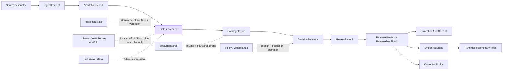

<!-- [KFM_META_BLOCK_V2]
doc_id: kfm://doc/<TODO-VERIFY-UUID>
title: data
type: standard
version: v1
status: draft
owners: @bartytime4life
created: <TODO-VERIFY-YYYY-MM-DD>
updated: <TODO-VERIFY-YYYY-MM-DD>
policy_label: <TODO-VERIFY-POLICY-LABEL>
related: [schemas/contracts/v1/README.md, schemas/contracts/README.md, contracts/README.md, docs/standards/README.md, policy/README.md, tests/README.md, tests/contracts/README.md, schemas/tests/README.md, schemas/tests/fixtures/README.md, schemas/tests/fixtures/contracts/README.md, schemas/tests/fixtures/contracts/v1/README.md, .github/workflows/README.md, schemas/contracts/v1/data/dataset_version.schema.json]
tags: [kfm, schemas, contracts, data, dataset-version]
notes: [Prepared from current public-main inspection and the attached KFM corpus; doc_id/created/updated/policy_label need verification; schema-home and fixture-home authority remain unresolved]
[/KFM_META_BLOCK_V2] -->

# data

_Dataset-version boundary guide and current-state index for the public `schemas/contracts/v1/data/` lane._

> [!NOTE]
> The KFM Meta Block v2 above uses reviewable placeholders for `doc_id`, `created`, `updated`, and `policy_label` because those values were not directly confirmed from the current public repo surfaces inspected for this revision.

> [!IMPORTANT]
> **Status:** experimental · **Doc status:** draft  
> **Owners:** `@bartytime4life` _via current public `.github/CODEOWNERS` global fallback; no narrower `/schemas/` or `/schemas/contracts/v1/data/` rule was directly verified_  
> **Path:** `schemas/contracts/v1/data/README.md`  
> **Repo fit:** child of [`../README.md`](../README.md) · subtree boundary [`../../README.md`](../../README.md) · parent schema lane [`../../../README.md`](../../../README.md) · stronger current human-readable machine-contract signal [`../../../../contracts/README.md`](../../../../contracts/README.md) · nested schema-side fixture lane [`../../../tests/README.md`](../../../tests/README.md) · version-local scaffold [`../../../tests/fixtures/contracts/v1/README.md`](../../../tests/fixtures/contracts/v1/README.md) · stronger root verification guides [`../../../../tests/README.md`](../../../../tests/README.md), [`../../../../tests/contracts/README.md`](../../../../tests/contracts/README.md) · policy routing [`../../../../policy/README.md`](../../../../policy/README.md) · standards routing [`../../../../docs/standards/README.md`](../../../../docs/standards/README.md) · workflow lane [`../../../../.github/workflows/README.md`](../../../../.github/workflows/README.md) · local schema [`./dataset_version.schema.json`](./dataset_version.schema.json)


**Quick jumps:** [Scope](#scope) · [Repo fit](#repo-fit) · [Accepted inputs](#accepted-inputs) · [Exclusions](#exclusions) · [Current verified snapshot](#current-verified-snapshot) · [Directory tree](#directory-tree) · [Quickstart](#quickstart) · [Usage](#usage) · [Diagram](#diagram) · [Tables](#tables) · [Task list / definition of done](#task-list--definition-of-done) · [FAQ](#faq) · [Appendix](#appendix)

> [!WARNING]
> Public `main` now exposes this lane, `./dataset_version.schema.json` as `{}`, and a schema-side fixture scaffold under [`../../../tests/fixtures/contracts/v1/`](../../../tests/fixtures/contracts/v1/).  
> Those visible files matter, but they do **not** settle canonical schema-home or fixture-home authority, and they do **not** by themselves prove merge-blocking validation on current public `main`.

## Scope

`schemas/contracts/v1/data/` is the versioned family lane for the **DatasetVersion** contract inside the visible `schemas/contracts/v1/` subtree.

This README should do six things well:

1. make the local lane legible without overstating implementation maturity,
2. keep `DatasetVersion` anchored to canonical-truth semantics rather than delivery convenience,
3. show where this lane sits relative to `contracts/`, `schemas/`, `policy/`, `tests/`, and workflow surfaces,
4. keep unresolved authority visible instead of silently declaring this path canonical,
5. distinguish the visible schema-side fixture scaffold from the stronger root verification lanes,
6. give future editors a narrow, reviewable place to evolve the data-family boundary.

### Truth posture used here

| Label | Meaning here | How to read it in this file |
|---|---|---|
| **CONFIRMED** | Directly visible in adjacent repo docs or current public tree structure | Safe to treat as present now |
| **INFERRED** | Strong consequence of repeated contract doctrine, but not directly encoded in the local placeholder schema yet | Useful for boundary explanation, not for implementation claims |
| **PROPOSED** | Recommended next shape or sync rule for this lane | Treat as change guidance |
| **UNKNOWN** | Not directly reverified from the visible repo surfaces used for this revision | Do not convert into fact |
| **NEEDS VERIFICATION** | Worth checking before relying on it operationally | Leave visible until rechecked |

### Working reading of `DatasetVersion`

Within current KFM doctrine, **DatasetVersion** is the contract family that carries an authoritative candidate or promoted subject set after validation and before outward catalog closure.

In practical repo terms, this lane should stay centered on:

- stable identity,
- version identity,
- support and time semantics,
- provenance and lineage links,
- validation and release linkage,
- visible correction compatibility.

Until [`./dataset_version.schema.json`](./dataset_version.schema.json) becomes more than `{}`, this README should keep that burden explicit rather than implying that field-level law is already encoded locally.

[Back to top](#data)

## Repo fit

| Aspect | Current role |
|---|---|
| **Directory** | `schemas/contracts/v1/data/` |
| **Primary job** | Hold the data-family README and the visible `DatasetVersion` schema stub for the versioned contracts subtree |
| **Immediate parent** | [`../README.md`](../README.md) — the `schemas/contracts/v1/` lane guide |
| **Boundary context** | [`../../README.md`](../../README.md) — `schemas/contracts/` guide with schema-home ambiguity kept visible |
| **Parent schema boundary** | [`../../../README.md`](../../../README.md) — `schemas/` as live-tree index plus unresolved schema-home authority |
| **Stronger current human-readable contract signal** | [`../../../../contracts/README.md`](../../../../contracts/README.md) |
| **Nested schema-side fixture scaffold** | [`../../../tests/README.md`](../../../tests/README.md) and [`../../../tests/fixtures/contracts/v1/README.md`](../../../tests/fixtures/contracts/v1/README.md) |
| **Stronger root verification guides** | [`../../../../tests/README.md`](../../../../tests/README.md) and [`../../../../tests/contracts/README.md`](../../../../tests/contracts/README.md) |
| **Standards context** | [`../../../../docs/standards/README.md`](../../../../docs/standards/README.md) |
| **Workflow context** | [`../../../../.github/workflows/README.md`](../../../../.github/workflows/README.md) |
| **Local inventory** | [`README.md`](./README.md), [`dataset_version.schema.json`](./dataset_version.schema.json) |
| **Visible local maturity** | substantive lane README + placeholder schema body |
| **Audience** | contract editors, policy reviewers, verification authors, documentation stewards, thin-slice implementers |
| **Authority state** | visible lane is real; canonical schema-home and canonical fixture-home are still unresolved in adjacent docs |

### Upstream and downstream links

Upstream context flows from:

- root repo posture in [`../../../../README.md`](../../../../README.md),
- standards and documentation routing in [`../../../../docs/standards/README.md`](../../../../docs/standards/README.md),
- contract doctrine and family planning in [`../../../../contracts/README.md`](../../../../contracts/README.md),
- subtree boundary rules in [`../../README.md`](../../README.md) and [`../README.md`](../README.md),
- parent schema-boundary caution in [`../../../README.md`](../../../README.md).

Downstream pressure lands in:

- schema-side fixture scaffolding via [`../../../tests/README.md`](../../../tests/README.md) and [`../../../tests/fixtures/contracts/v1/README.md`](../../../tests/fixtures/contracts/v1/README.md),
- contract-facing validation via [`../../../../tests/contracts/README.md`](../../../../tests/contracts/README.md),
- repo-wide governed verification via [`../../../../tests/README.md`](../../../../tests/README.md),
- policy vocabulary and deny-by-default handling via [`../../../../policy/README.md`](../../../../policy/README.md),
- future merge-gate documentation via [`../../../../.github/workflows/README.md`](../../../../.github/workflows/README.md).

### Path reconciliation note

Current public `main` now shows two verification-adjacent signals that are easy to blur:

1. a **nested schema-side scaffold** under `schemas/tests/fixtures/contracts/v1/`, and
2. a **stronger root verification surface** under `tests/` and `tests/contracts/`.

This README treats the first as local scaffold context and the second as the sharper current validation signal. That distinction matters until the repo resolves fixture-home authority explicitly.

## Accepted inputs

The following content belongs here:

| Accepted here | Why it belongs |
|---|---|
| README guidance specific to the `data/` family | This file is the lane explainer |
| Narrow notes that clarify `DatasetVersion` contract purpose | This lane exists to hold that family boundary |
| Additive edits to [`./dataset_version.schema.json`](./dataset_version.schema.json) | This is the only visible machine file in the lane today |
| Cross-links to parent and sibling contract docs | The lane should be navigable in-repo |
| Honest notes about authority ambiguity or migration state | The repo currently needs that ambiguity surfaced, not hidden |
| Schema-side routing notes that keep `schemas/tests` and root `tests/` distinct | Both surfaces are now visible and easy to confuse |
| Family-local review checklists | Helps keep later edits small and verifiable |

## Exclusions

The following content does **not** belong here:

| Do not put this here | Better home | Why |
|---|---|---|
| Actual datasets, exports, or canonical data payloads | truth-path data zones, not contract docs | This lane documents contracts, not subject matter |
| Rego bundles, decision logic, or obligation registries | [`../../../../policy/README.md`](../../../../policy/README.md) and vocab lanes | Policy is adjacent, not owned here |
| Gate-bearing valid / invalid fixture packs | [`../../../../tests/contracts/README.md`](../../../../tests/contracts/README.md) or the authority-ratified fixture home | Stronger executable verification burden belongs elsewhere today |
| Silent authoritative mirrors in schema-side fixture scaffolds | one declared canonical fixture home only | Avoid parallel authority by convenience |
| Workflow YAML or CI implementation details | [`../../../../.github/workflows/README.md`](../../../../.github/workflows/README.md) | Public `main` does not evidence checked-in validator YAML here |
| Runtime DTOs, API response payload docs, or Focus envelopes | runtime / API families | This is the **data** contract lane |
| Release proof packs or correction notices | release / correction families | Keep family boundaries sharp |
| A second silent authoritative copy under both `contracts/` and `schemas/contracts/` | one authoritative home only | Avoid parallel schema universes |

[Back to top](#data)

## Current verified snapshot

| Surface | Status | What this file should assume |
|---|---|---|
| `schemas/contracts/v1/data/` directory exists | **CONFIRMED** | This lane is visible in the public tree |
| `schemas/contracts/v1/data/README.md` exists and is substantive | **CONFIRMED** | This lane already carries real boundary text, so revisions should build on it rather than restart |
| `dataset_version.schema.json` exists | **CONFIRMED** | The file is present and should be documented |
| `dataset_version.schema.json` body is `{}` | **CONFIRMED** | Do not describe field enforcement as implemented here yet |
| Parent `schemas/contracts/v1/` guide lists the `data` family | **CONFIRMED** | This lane is part of the published family registry |
| `schemas/contracts/` exposes real machine-file placement but keeps authority unresolved | **CONFIRMED** | Do not quietly declare this path canonical |
| Top-level `contracts/README.md` still provides the stronger current human-readable `DatasetVersion` signal | **CONFIRMED** | Keep links to `contracts/README.md` visible |
| `schemas/tests/README.md` exists and documents a nested schema-side fixture scaffold | **CONFIRMED** | Local verification-adjacent scaffolds are part of current public tree reality |
| `schemas/tests/fixtures/contracts/v1/README.md`, `valid/README.md`, and `invalid/README.md` exist | **CONFIRMED** | A version-local scaffold exists, but it should not be treated as canonical by inertia |
| `tests/contracts/README.md` exists as the sharper current contract-facing verification family | **CONFIRMED** | Route executable validation burden there unless repo law says otherwise |
| Public `.github/workflows/` lane is README-only in the inspected tree | **CONFIRMED** | Do not claim checked-in merge-blocking YAML here |
| Canonical schema-home decision | **NEEDS VERIFICATION** | Must be resolved explicitly, not implied |
| Canonical fixture-home decision | **NEEDS VERIFICATION** | Nested scaffold presence is not enough |
| Validator command, required checks, platform rulesets | **UNKNOWN / NEEDS VERIFICATION** | Mention only as adjacent or future work |

## Directory tree

### Current subtree context

```text
schemas/contracts/
├── README.md
├── vocab/
└── v1/
    ├── README.md
    ├── common/
    ├── correction/
    ├── data/
    │   ├── README.md
    │   └── dataset_version.schema.json
    ├── evidence/
    ├── policy/
    ├── release/
    ├── runtime/
    └── source/
```

### Current lane snapshot

```text
schemas/contracts/v1/data/
├── README.md
└── dataset_version.schema.json
```

### Current schema-side verification-adjacent scaffold

```text
schemas/tests/
├── README.md
└── fixtures/
    ├── README.md
    └── contracts/
        ├── README.md
        └── v1/
            ├── README.md
            ├── valid/
            │   └── README.md
            └── invalid/
                └── README.md
```

### Stronger neighboring surfaces

```text
contracts/
└── README.md

docs/standards/
└── README.md

policy/
└── README.md

tests/
├── README.md
└── contracts/
    └── README.md

.github/workflows/
└── README.md
```

## Quickstart

### 1) Inspect only the local lane

```bash
find schemas/contracts/v1/data -maxdepth 1 -type f | sort
cat schemas/contracts/v1/data/dataset_version.schema.json
```

### 2) Inspect the visible schema-side scaffold without treating it as canonical

```bash
find schemas/tests/fixtures/contracts/v1 -maxdepth 3 -type f | sort
sed -n '1,220p' schemas/tests/README.md
sed -n '1,220p' schemas/tests/fixtures/contracts/v1/README.md
```

### 3) Read the boundary docs in the order that reduces drift

```bash
sed -n '1,240p' schemas/contracts/v1/README.md
sed -n '1,260p' schemas/contracts/README.md
sed -n '1,260p' schemas/README.md
sed -n '1,260p' contracts/README.md
sed -n '1,260p' schemas/tests/README.md
sed -n '1,260p' schemas/tests/fixtures/contracts/v1/README.md
sed -n '1,260p' tests/README.md
sed -n '1,260p' tests/contracts/README.md
sed -n '1,240p' policy/README.md
sed -n '1,240p' docs/standards/README.md
sed -n '1,220p' .github/workflows/README.md
```

### 4) Trace `DatasetVersion` references before editing

```bash
grep -RIn "DatasetVersion\|dataset_version.schema.json" \
  contracts schemas tests docs policy .github 2>/dev/null || true
```

### 5) Keep the change narrow

Use this lane for one of three things only:

- clarify the **data-family boundary**,
- advance [`./dataset_version.schema.json`](./dataset_version.schema.json) from `{}` toward a real schema,
- or keep lane language synchronized with the now-visible schema-side fixture scaffold.

If a change reaches gate-bearing fixtures, policy vocabularies, workflow claims, or release assembly, it has already crossed family boundaries and should update the owning lanes in the same review stream.

[Back to top](#data)

## Usage

### What this family should answer

A healthy `data/` family should let a reviewer answer these questions quickly:

- What object represents **canonical processed truth** before outward catalog closure?
- How is **stable identity** kept distinct from **version identity**?
- What does the contract say about **support**, **time semantics**, and **subject-set scope**?
- Where do **validation refs**, **provenance refs**, and **release linkage** attach?
- How does a future schema keep **supersession** and **correction lineage** visible?
- Which parts of the burden belong here, and which are owned by policy, tests, schema-side scaffolds, or workflow lanes?

### Verification lane reading

| Lane | Current reading | Use it for | Do **not** infer |
|---|---|---|---|
| [`../../../tests/fixtures/contracts/v1/`](../../../tests/fixtures/contracts/v1/) | visible nested scaffold | local boundary clarity, version-local notes, explicitly non-authoritative examples | canonical fixture authority or live gate wiring |
| [`../../../../tests/contracts/README.md`](../../../../tests/contracts/README.md) | stronger current contract-facing verification family | sharper executable validation burden | contract-law ownership |
| [`../../../../tests/README.md`](../../../../tests/README.md) | stronger repo-wide governed verification surface | cross-family proof burden and drill context | lane-local schema meaning |
| [`../../../../.github/workflows/README.md`](../../../../.github/workflows/README.md) | documented workflow boundary, current public tree README-only | workflow-lane caution and future merge-gate documentation | checked-in merge-blocking validator YAML on current public `main` |

### When to edit this README vs the schema vs the fixtures

| Change type | Edit this README | Edit `dataset_version.schema.json` | Also touch |
|---|---:|---:|---|
| Clarify family purpose, links, or lane boundary | ✅ |  | parent and sibling READMEs if boundary language changes |
| Turn doctrine into concrete field structure | ✅ | ✅ | root verification lanes and adjacent family registry docs |
| Add schema-side illustrative or mirror examples | maybe |  | [`../../../tests/fixtures/contracts/v1/`](../../../tests/fixtures/contracts/v1/) only if the example is explicitly non-authoritative |
| Add gate-bearing valid / invalid examples |  |  | [`../../../../tests/contracts/README.md`](../../../../tests/contracts/README.md) or the ratified fixture home |
| Add reason / obligation codes |  |  | policy / vocab lanes |
| Add workflow commands or required-check claims |  |  | workflow lane |
| Resolve authoritative schema-home or fixture-home law | ✅ | maybe | `schemas/`, `schemas/contracts/`, `schemas/tests/`, `contracts/`, `tests/`, standards, policy, and workflow docs in the same change stream |

### Keep the authority story singular

> [!NOTE]
> This lane should not quietly decide either the schema-home question or the fixture-home question by drift.
>
> If `contracts/` remains the authoritative home, this lane should stay documentary or explicitly mirrored.  
> If `schemas/contracts/` becomes authoritative, the change should be made openly and synchronized across sibling docs.  
> If `schemas/tests/fixtures/` ever becomes canonical for fixture packs, that decision should be made just as explicitly.

## Diagram



**Reading rule:** `DatasetVersion` sits after validation and before outward closure. That makes this lane a **canonical-truth boundary**, not a policy pack, fixture bucket, workflow registry, or release surface.

[Back to top](#data)

## Tables

### DatasetVersion doctrine minimums

| Dimension | Doctrine-grounded minimum | Why it matters in this lane | Current local state |
|---|---|---|---|
| **Purpose** | Carry an authoritative candidate or promoted subject set for canonical processed truth | Keeps the family tied to canonical truth rather than convenience payloads | README can say this now; schema body does not yet encode it |
| **Identity** | Stable ID plus version ID | Prevents truth from collapsing into unnamed snapshots | Not yet visible in the local schema body |
| **Support / time semantics** | Explicit support and time meaning | Stops geometry/time drift and “looks aligned” failures | Not yet visible in the local schema body |
| **Provenance / lineage** | Provenance links and lineage refs | Keeps later `EvidenceBundle` and correction paths reconstructable | Not yet visible in the local schema body |
| **Validation / build context** | Validation refs and build context | Prevents undocumented repairs from becoming truth | Not yet visible in the local schema body |
| **Release linkage** | Linkage forward into closure / release family | Keeps publication governance visible | Not yet visible in the local schema body |
| **Failure mode prevented** | Derived layers or undocumented repairs quietly becoming truth | This is the family’s main boundary value | Still documentary here until schema/test surfaces mature |

### Placement decision matrix

| Need | Best home now | Why |
|---|---|---|
| Explain `DatasetVersion` purpose | `schemas/contracts/v1/data/README.md` | This is the family README |
| Add field grammar for `DatasetVersion` | `schemas/contracts/v1/data/dataset_version.schema.json` | The local machine file already exists here |
| Add schema-side illustrative examples | `schemas/tests/fixtures/contracts/v1/` with explicit non-authoritative labeling | The scaffold is visible, but authority is unresolved |
| Add gate-bearing valid / invalid packs | `tests/contracts/` or the authority-ratified fixture home | Stronger current verification burden belongs there |
| Add reason / obligation / reviewer registries | policy or vocab lanes | Decision grammar should stay singular |
| Add workflow gates or required-check claims | `.github/workflows/` | Control-plane assertions should live in the workflow lane |
| Settle schema-home or fixture-home law | coordinated cross-lane update | This cannot be resolved safely by a single local README edit |

## Task list / definition of done

### Lane checklist

- [ ] Title, purpose line, path, owners, and quick jumps stay accurate.
- [ ] Relative links still resolve from `schemas/contracts/v1/data/README.md`.
- [ ] `dataset_version.schema.json` existence and current `{}` state are described honestly.
- [ ] The nested schema-side fixture scaffold is described as **visible** but **non-authoritative** unless the checked-out branch proves otherwise.
- [ ] No section claims live validator commands, required checks, or merge gates without direct verification.
- [ ] Authority ambiguity remains visible until explicitly resolved.
- [ ] Family boundaries stay sharp: data here, policy there, stronger verification there, workflow claims there.

### Definition of done for a **documentation-only** change

- [ ] README clarifies boundary without changing contract semantics.
- [ ] Parent and sibling links remain in sync.
- [ ] No accidental schema-home or fixture-home claim is introduced.

### Definition of done for a **schema-bearing** change

- [ ] [`./dataset_version.schema.json`](./dataset_version.schema.json) moves beyond `{}`.
- [ ] `schemas/contracts/v1/README.md` family registry stays accurate.
- [ ] Stronger verification companions are updated in the same review stream.
- [ ] Any new field names are echoed here in plain-language boundary notes.
- [ ] Any authority-home implication is addressed explicitly across adjacent docs.

### Definition of done for a **schema-side illustrative example** change

- [ ] The example is marked **illustrative**, **generated**, **mirror**, or equivalent.
- [ ] The example does not quietly become the only place a reviewer can find a gate-bearing case.
- [ ] `schemas/tests/` and root `tests/` links are still accurate.
- [ ] No CI or merge-gate behavior is claimed unless the checked-out branch proves the exact entrypoint.

[Back to top](#data)

## FAQ

### Is `schemas/contracts/v1/data/` the confirmed authoritative schema home today?

No. This path is visibly real, but adjacent docs still keep the authoritative schema home unresolved.

### Is `dataset_version.schema.json` already more than `{}`?

Not on current public `main`. This README should explain the burden without pretending field-level enforcement already exists.

### Are `schemas/tests/fixtures/contracts/v1/` already the canonical validation packs?

Not proven. They are confirmed as visible schema-side scaffold surfaces, but stronger current verification still points to root `tests/` and `tests/contracts/`.

### Does this lane hold actual dataset payloads?

No. It documents the **contract family** that should describe authoritative dataset versions, not the datasets themselves.

### Where should gate-bearing valid / invalid examples go?

Into stronger verification surfaces, not this lane, unless the repo later ratifies a different canonical fixture home.

### Why keep a substantive README here if the authority decision is unresolved?

Because the path is already public and visible. A precise lane guide is safer than a one-line stub when the repo is trying to avoid drift, parallel authority, and accidental overclaiming.

## Appendix

<details>
<summary><strong>Doctrine-grounded starter field groups for a future substantive <code>DatasetVersion</code> body</strong></summary>

This is a **starter checklist**, not a claim about the current local schema body.

| Field group | Why it belongs |
|---|---|
| `kind` / `object_type` | Declares what the object is before free-form content appears |
| `stable_id` | Keeps long-lived identity explicit |
| `version_id` | Separates version lineage from subject identity |
| `subject_set` or equivalent declared scope | Makes clear what this version actually covers |
| `stable_identity_basis` | Explains why this subject set is the “same thing” across versions |
| `support` | Declares the grain at which claims are meaningful |
| `observed_at` / `valid_at` / `issued_at` / `published_at` as relevant | Preserves distinct time semantics |
| `provenance_refs` / `lineage_refs` | Connects the version to reconstructable upstream evidence |
| `validation_refs` / `build_context` | Keeps pre-release checks inspectable |
| `release_ref` or closure linkage | Stops canonical truth from floating free of outward release state |
| `rights_class` / `sensitivity_class` where relevant | Makes public-safe posture executable |
| `checksums` / `digests` / `profile_versions` | Keeps identity and contract versioning explicit |
| `audit_ref` plus supersession / withdrawal pointers | Preserves correction lineage |

</details>

<details>
<summary><strong>Neighbor files that should usually be reviewed in the same PR</strong></summary>

- [`../README.md`](../README.md)
- [`../../README.md`](../../README.md)
- [`../../../README.md`](../../../README.md)
- [`../../../tests/README.md`](../../../tests/README.md)
- [`../../../tests/fixtures/README.md`](../../../tests/fixtures/README.md)
- [`../../../tests/fixtures/contracts/README.md`](../../../tests/fixtures/contracts/README.md)
- [`../../../tests/fixtures/contracts/v1/README.md`](../../../tests/fixtures/contracts/v1/README.md)
- [`../../../../contracts/README.md`](../../../../contracts/README.md)
- [`../../../../docs/standards/README.md`](../../../../docs/standards/README.md)
- [`../../../../policy/README.md`](../../../../policy/README.md)
- [`../../../../tests/README.md`](../../../../tests/README.md)
- [`../../../../tests/contracts/README.md`](../../../../tests/contracts/README.md)
- [`../../../../.github/workflows/README.md`](../../../../.github/workflows/README.md)

Review them together whenever:

- authority shifts,
- the `DatasetVersion` family meaning changes,
- the nested schema-side fixture scaffold changes,
- verification expectations change,
- or the lane starts claiming real enforcement.

</details>

[Back to top](#data)
