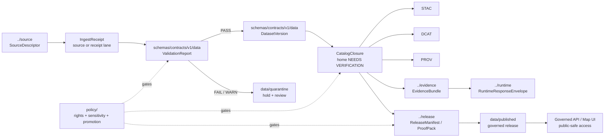

<!-- [KFM_META_BLOCK_V2]
doc_id: kfm://doc/NEEDS_VERIFICATION__schemas_contracts_v1_data_readme
title: schemas/contracts/v1/data
type: standard
version: v1
status: draft
owners: NEEDS_VERIFICATION__schema_contract_owner
created: NEEDS_VERIFICATION__YYYY-MM-DD
updated: NEEDS_VERIFICATION__YYYY-MM-DD
policy_label: NEEDS_VERIFICATION__public_or_internal
related: [../README.md, ../../README.md, ../../../README.md, ../../../../README.md, ../../../../contracts/README.md, ../../../../data/README.md, ../../../../policy/README.md, ../../../../tests/contracts/README.md, ../../../../tools/validators/README.md, ../source/README.md, ../evidence/README.md, ../policy/README.md, ../release/README.md, ../runtime/README.md, ../correction/README.md]
tags: [kfm, schemas, contracts, data, validation-report, dataset-version, catalog-closure]
notes: [README-like standard doc for the shared v1 data contract-family lane. doc_id, owner, dates, policy_label, current checked-in file inventory, schema-home authority, and leaf CODEOWNERS coverage require active-branch verification before merge.]
[/KFM_META_BLOCK_V2] -->

<a id="top"></a>

# `schemas/contracts/v1/data`

Shared v1 machine-contract lane for KFM data-lifecycle proof objects such as `ValidationReport`, `DatasetVersion`, and catalog-closure candidates.

> [!IMPORTANT]
> **Status:** `experimental`  
> **Doc state:** `draft`  
> **Owners:** `NEEDS_VERIFICATION__schema_contract_owner`  
> **Path:** `schemas/contracts/v1/data/README.md`  
> **Repo fit:** child schema lane under [`../README.md`](../README.md), adjacent to [`../source/README.md`](../source/README.md), [`../evidence/README.md`](../evidence/README.md), [`../policy/README.md`](../policy/README.md), [`../release/README.md`](../release/README.md), [`../runtime/README.md`](../runtime/README.md), and [`../correction/README.md`](../correction/README.md); downstream consumers include [`../../../../data/README.md`](../../../../data/README.md), [`../../../../tests/contracts/README.md`](../../../../tests/contracts/README.md), and [`../../../../tools/validators/README.md`](../../../../tools/validators/README.md).  
> **Quick jumps:** [Scope](#scope) · [Repo fit](#repo-fit) · [Accepted inputs](#accepted-inputs) · [Exclusions](#exclusions) · [Evidence boundary](#evidence-boundary) · [Directory tree](#directory-tree) · [Quickstart](#quickstart) · [Usage](#usage) · [Diagram](#diagram) · [Reference tables](#reference-tables) · [Definition of done](#definition-of-done) · [FAQ](#faq) · [Appendix](#appendix)


> [!WARNING]
> This directory is **not a data store**. It names machine-checkable contracts for data-lifecycle proof objects. Actual raw, work, quarantine, processed, catalog, proof, receipt, and published artifacts belong under governed `data/` surfaces and must not be copied into this schema lane.

---

## Scope

`schemas/contracts/v1/data/` defines shared schema-side contracts for objects that sit at the **data lifecycle seams**:

```text
RAW → WORK / QUARANTINE → PROCESSED → CATALOG / TRIPLET → PUBLISHED
```

This lane should help reviewers and validators answer:

- Did a candidate artifact pass or fail validation?
- Which stable processed dataset version is being referenced?
- Which catalog closure links bind dataset identity, lineage, and release scope?
- Which data-lifecycle object is being handed to release, evidence, runtime, or correction surfaces?

The lane is intentionally narrow. It should stabilize common **data proof vocabulary** without becoming a duplicate contract root, policy engine, source registry, catalog store, runtime response lane, or domain-specific schema dump.

[Back to top](#top)

---

## Repo fit

| Relationship | Relative path | Role |
| --- | --- | --- |
| Parent v1 contract index | [`../README.md`](../README.md) | Declares the broader `schemas/contracts/v1/` contract family and schema-home status. |
| Schema contract root | [`../../README.md`](../../README.md) | Broader schema-contract boundary. |
| Root schema surface | [`../../../README.md`](../../../README.md) | Repository schema orientation and authority warnings. |
| Human contract surface | [`../../../../contracts/README.md`](../../../../contracts/README.md) | Narrative contract docs and schema-home ADR pressure. |
| Data lifecycle surface | [`../../../../data/README.md`](../../../../data/README.md) | Actual lifecycle artifacts, registries, receipts, proofs, catalogs, and published outputs. |
| Policy surface | [`../../../../policy/README.md`](../../../../policy/README.md) | Deny-by-default rules, rights, sensitivity, and promotion policy. |
| Contract tests | [`../../../../tests/contracts/README.md`](../../../../tests/contracts/README.md) | Valid/invalid fixtures and schema-drift checks. |
| Validator tooling | [`../../../../tools/validators/README.md`](../../../../tools/validators/README.md) | Executable checks that operationalize this lane. |

### Neighbor boundaries

| Neighbor | What it owns | This lane should do |
| --- | --- | --- |
| [`../source/`](../source/) | `SourceDescriptor`, source admission, ingest receipts if assigned there | Reference source objects; do not redefine source authority. |
| [`../evidence/`](../evidence/) | `EvidenceBundle` and claim-support payloads | Emit refs suitable for evidence resolution; do not flatten evidence bundles into data schemas. |
| [`../policy/`](../policy/) | policy decisions, review records if assigned there, reason/obligation vocab | Record policy refs; do not encode policy law here. |
| [`../release/`](../release/) | release manifests, proof packs, promotion outputs | Hand off dataset and catalog closure refs; do not publish from this lane. |
| [`../runtime/`](../runtime/) | runtime response envelopes, Focus payloads, trust-visible outcomes | Support runtime via released refs; do not shape runtime answer payloads. |
| [`../correction/`](../correction/) | correction notices, rollback lineage | Preserve supersession refs; do not turn corrections into dataset versions. |

[Back to top](#top)

---

## Accepted inputs

Only small, reviewable schema-side materials belong here.

| Accepted input | Examples | Why it belongs here | Status |
| --- | --- | --- | --- |
| Shared data-lifecycle JSON Schemas | `validation_report.schema.json`, `dataset_version.schema.json` | These describe proof objects at WORK/QUARANTINE and PROCESSED seams. | **INFERRED / PROPOSED** |
| Catalog-closure candidate schemas | `catalog_closure.schema.json`, `catalog_matrix.schema.json` | These may describe the transition from processed data into linked catalog/release scope. | **PROPOSED / NEEDS VERIFICATION** |
| Narrow data-lane `$defs` | data-result status enums, lifecycle seam refs, artifact-ref fragments | Keeps repeated data contract pieces consistent when they are not general enough for `../common/`. | **PROPOSED** |
| README and lane notes | `README.md`, compatibility notes, migration notes | Maintainers need the boundary before adding more schemas. | **CONFIRMED doc need / PROPOSED content** |
| Schema version notes | additive v1 notes, deprecated-field notes, v2 migration pointers | Contract evolution should be reviewable and reversible. | **PROPOSED** |

> [!TIP]
> A schema belongs here only when its primary job is to describe a **shared data-lifecycle proof object**. Domain records such as hydrology observations, fauna occurrences, archaeology site assertions, or soil measurements should stay in their domain contract lanes unless an ADR explicitly promotes a shared field set.

[Back to top](#top)

---

## Exclusions

| Do **not** put this here | Put it here instead | Reason |
| --- | --- | --- |
| Raw source payloads, API dumps, rasters, shapefiles, GeoParquet, PMTiles, COGs, logs, or snapshots | [`../../../../data/`](../../../../data/) lifecycle surfaces | This directory is schema law, not artifact storage. |
| Source descriptors, source rights profiles, source cadence, source access notes | [`../source/`](../source/) and [`../../../../data/registry/`](../../../../data/registry/) | Source identity and data proof are separate burdens. |
| Valid/invalid fixture packs | [`../../../../tests/contracts/`](../../../../tests/contracts/) | Fixtures verify contracts; they should not become a second schema authority. |
| Validator scripts or CLI helpers | [`../../../../tools/validators/`](../../../../tools/validators/) | Executable behavior belongs in tooling. |
| Policy rules, rights adjudication, sensitivity rules, reason-code law | [`../../../../policy/`](../../../../policy/) and, where applicable, [`../policy/`](../policy/) | Policy must remain independently reviewable. |
| Release manifests, proof packs, signed bundles, rollback cards | [`../release/`](../release/), `data/proofs/`, or the repo’s release surface | Promotion is a governed state transition, not a data-schema side effect. |
| Evidence bundles or Evidence Drawer payloads | [`../evidence/`](../evidence/) and runtime/UI contract lanes | Evidence resolution is downstream of data proof. |
| Runtime response envelopes, Focus Mode responses, public API envelopes | [`../runtime/`](../runtime/) and API contracts | Runtime trust state is not the same object class as data validation. |
| Secrets, tokens, signed URLs, private keys, credentials, local caches | Nowhere in git | Auditability is not permission to leak operational secrets. |

[Back to top](#top)

---

## Evidence boundary

| Claim | Truth label | Basis / handling |
| --- | --- | --- |
| KFM preserves a governed lifecycle from source edge through publication. | **CONFIRMED doctrine** | This README keeps the lifecycle seam explicit and does not let schemas replace lifecycle state. |
| KFM uses proof-object families such as `ValidationReport`, `DatasetVersion`, `EvidenceBundle`, `ReleaseManifest`, `DecisionEnvelope`, and `CorrectionNotice`. | **CONFIRMED doctrine / mixed implementation depth** | This lane names only the data-family subset and links to neighbors for other object classes. |
| `ValidationReport` and `DatasetVersion` are plausible shared data contract homes under `schemas/contracts/v1/data/`. | **INFERRED / PROPOSED** | Repeated schema-wave materials point here, but active-branch file bodies still need verification. |
| `CatalogClosure` or `CatalogMatrix` may belong here. | **PROPOSED / NEEDS VERIFICATION** | Their exact shared home should be resolved by schema index or ADR before merge. |
| Current checked-in files under this target path are known. | **UNKNOWN** | This authoring pass did not have a mounted KFM checkout. Run the quickstart commands before merging. |
| Leaf owner and policy label are known. | **NEEDS VERIFICATION** | Meta block uses placeholders until CODEOWNERS and policy labeling are checked. |

> [!IMPORTANT]
> Do not upgrade this README from `draft` to `published` until the active branch proves the actual file inventory, owners, schema bodies, fixture coverage, and validator entrypoints.

[Back to top](#top)

---

## Directory tree

### Current branch snapshot

```text
schemas/contracts/v1/data/
└── README.md                  # this file, after merge
```

`NEEDS VERIFICATION`: the active branch may already contain additional schema files. This README intentionally does not claim them until they are inspected.

### Proposed starter shape

```text
schemas/contracts/v1/data/
├── README.md
├── validation_report.schema.json       # INFERRED / PROPOSED
├── dataset_version.schema.json         # INFERRED / PROPOSED
├── catalog_closure.schema.json         # PROPOSED / NEEDS VERIFICATION
└── catalog_matrix.schema.json          # PROPOSED / NEEDS VERIFICATION
```

### Companion surfaces outside this directory

```text
contracts/data/
├── validation_report.md                # PROPOSED human contract companion
├── dataset_version.md                  # PROPOSED human contract companion
└── catalog_closure.md                  # PROPOSED only if schema-home ADR assigns it here

tests/contracts/data/
├── validation_report/
│   ├── valid/
│   └── invalid/
└── dataset_version/
    ├── valid/
    └── invalid/

tools/validators/
└── <repo-native data contract validators>
```

[Back to top](#top)

---

## Quickstart

Use these checks before changing this lane.

### 1. Confirm the repository root and target inventory

```bash
git rev-parse --show-toplevel
find schemas/contracts/v1/data -maxdepth 2 \( -type f -o -type d \) | sort
```

### 2. Inspect sibling contract lanes

```bash
for p in \
  schemas/contracts/v1/README.md \
  schemas/contracts/v1/source/README.md \
  schemas/contracts/v1/evidence/README.md \
  schemas/contracts/v1/policy/README.md \
  schemas/contracts/v1/release/README.md \
  schemas/contracts/v1/runtime/README.md \
  schemas/contracts/v1/correction/README.md
do
  echo
  echo "== $p =="
  sed -n '1,220p' "$p" 2>/dev/null || true
done
```

### 3. Search for existing data-family object names

```bash
grep -RIn \
  "ValidationReport\|DatasetVersion\|CatalogClosure\|CatalogMatrix\|validation_report\|dataset_version\|catalog_closure\|catalog_matrix" \
  schemas contracts tests tools policy data docs .github 2>/dev/null || true
```

### 4. Check schema bodies for placeholder drift

```bash
python - <<'PY'
import json
from pathlib import Path

root = Path("schemas/contracts/v1/data")
for path in sorted(root.glob("*.schema.json")):
    try:
        body = json.loads(path.read_text())
    except Exception as exc:
        print(f"FAIL {path}: invalid JSON: {exc}")
        continue

    if body == {}:
        print(f"WARN {path}: placeholder schema body is still {{}}")
    else:
        print(f"OK   {path}: non-empty JSON object")
PY
```

### 5. Verify fixtures and validators before claiming enforcement

```bash
find tests/contracts -maxdepth 5 -type f | sort | grep -E 'data|validation_report|dataset_version|catalog'
find tools/validators -maxdepth 5 -type f | sort | grep -E 'data|validation|dataset|catalog' || true
```

[Back to top](#top)

---

## Usage

### Add or revise a data contract

1. **Name the lifecycle seam first.**  
   Decide whether the object belongs at WORK/QUARANTINE, PROCESSED, CATALOG, release handoff, runtime, or correction.

2. **Search before adding.**  
   Look for the object in `schemas/`, `contracts/`, `tests/`, `tools/`, `policy/`, `data/`, and `docs/`.

3. **Keep the object family singular.**  
   Do not create both `validation_report.schema.json` and `validator_report.schema.json` without an ADR and migration plan.

4. **Use stable identity and references.**  
   Prefer explicit IDs, lifecycle state, artifact refs, source refs, evidence refs, hashes, status, and warning fields over unstructured notes.

5. **Leave policy to policy.**  
   A data schema may carry `policy_decision_ref`, `review_state`, or `obligations` when needed, but it should not duplicate Rego logic or policy text.

6. **Pair every schema with positive and negative examples.**  
   Fixtures belong under `tests/contracts/**`, not inside this directory.

7. **Document version impact.**  
   Additive v1 fields may be acceptable; breaking changes need a v2 plan, migration notes, and rollback/correction handling.

### Minimum field posture

A shared data-lifecycle proof object should usually account for:

| Field family | Why it matters |
| --- | --- |
| `id` or family-specific ID | Prevents ambiguous refs and supports traceability. |
| `schema_version` | Makes validation and migration explicit. |
| `lifecycle_state` or lifecycle seam | Prevents a WORK object from being mistaken for PUBLISHED truth. |
| `source_descriptor_ref` / `input_ref` / `artifact_refs` | Keeps source and artifact lineage inspectable. |
| `spec_hash` / digest refs | Supports replay, diff, and attestation. |
| `status` / `reason_codes` / `warnings` | Makes failure states visible instead of buried in prose. |
| `evidence_refs` / `audit_ref` | Enables downstream EvidenceBundle and review assembly. |
| `review_state` / `policy_decision_ref` where applicable | Links to governance without making this lane the policy authority. |

[Back to top](#top)

---

## Diagram



This diagram is a **boundary map**, not proof that all files or automation already exist.

[Back to top](#top)

---

## Reference tables

### Candidate data contract registry

| Schema | Primary seam | What it should prove | Companion proof | Truth label |
| --- | --- | --- | --- | --- |
| `validation_report.schema.json` | WORK / QUARANTINE | A validator checked an input or artifact and produced PASS, FAIL, WARN, or ERROR with reason codes and refs. | valid/invalid fixtures; validator test; quarantine case | **INFERRED / PROPOSED** |
| `dataset_version.schema.json` | PROCESSED / release prep | A processed dataset version has stable identity, source lineage, hashes, and lifecycle posture. | changed/unchanged fixtures; digest checks; supersession case | **INFERRED / PROPOSED** |
| `catalog_closure.schema.json` | CATALOG / release handoff | STAC, DCAT, PROV, evidence, policy, and release refs close over the same scoped dataset/product. | missing-link fixture; mismatch fixture; release dry-run | **PROPOSED / NEEDS VERIFICATION** |
| `catalog_matrix.schema.json` | CATALOG / review | A matrix of dataset, catalog, proof, release, evidence, and correction links is complete enough for review. | closure fixtures; link integrity checks | **PROPOSED / NEEDS VERIFICATION** |

### Boundary matrix

| Object family | Normal owning lane | This lane’s relation |
| --- | --- | --- |
| `SourceDescriptor` | `../source/` | Reference only. |
| `IngestReceipt` | `../source/`, `data/receipts/`, or repo-defined receipt lane | Consume or link; do not redefine unless ADR assigns. |
| `ValidationReport` | `schemas/contracts/v1/data/` | Candidate owner. |
| `DatasetVersion` | `schemas/contracts/v1/data/` | Candidate owner. |
| `CatalogClosure` | `schemas/contracts/v1/data/` or catalog/evidence lane after ADR | Candidate owner; needs verification. |
| `DecisionEnvelope` / policy decision | `../policy/` or policy contract lane | Reference only. |
| `ReviewRecord` | policy/governance lane | Reference only unless ADR assigns. |
| `ReleaseManifest` / `ReleaseProofPack` | `../release/` | Downstream handoff. |
| `EvidenceBundle` | `../evidence/` | Downstream resolution. |
| `RuntimeResponseEnvelope` | `../runtime/` | Downstream public/API response. |
| `CorrectionNotice` | `../correction/` | Post-release lineage. |

### Change discipline

| Change type | Allowed in v1? | Required review burden |
| --- | ---: | --- |
| Add optional field with no semantic change | Usually | schema review + valid fixture update |
| Add required field | Risky | v1 compatibility review or v2 plan |
| Rename field | No, unless compatibility alias exists | v2 plan + migration note + failing old-name fixture |
| Change enum meaning | No | policy + schema + fixture + downstream review |
| Change lifecycle seam | No silent change | ADR + all downstream surfaces reviewed |
| Move schema home | Only by ADR | old path preserved or explicitly superseded |

[Back to top](#top)

---

## Definition of done

This README is “done enough” only when the active branch proves the following:

- [ ] `schemas/contracts/v1/data/README.md` is linked from `schemas/contracts/v1/README.md`.
- [ ] Leaf owner is verified in CODEOWNERS or replaced with the correct owner.
- [ ] Schema-home authority is documented or an ADR is linked.
- [ ] Candidate files are either present and non-empty, or this README clearly marks them as proposed.
- [ ] Every present schema has valid and invalid fixtures under `tests/contracts/**`.
- [ ] Validators are discoverable from `tools/validators/` or the repo-native equivalent.
- [ ] At least one negative fixture proves fail-closed handling.
- [ ] No raw/work/quarantine/published artifact is stored in this schema lane.
- [ ] Release, evidence, runtime, policy, and correction object families remain linked but not duplicated.
- [ ] Documentation, schema, tests, and validator changes are reviewed together.
- [ ] Breaking changes are handled through v2, migration notes, or explicit supersession.

[Back to top](#top)

---

## FAQ

### Is this where datasets live?

No. Datasets and lifecycle artifacts belong under governed `data/` surfaces. This directory holds machine-readable contract definitions.

### Is `ValidationReport` confirmed to exist here?

`ValidationReport` is strongly supported as a data-lifecycle object family, and this path is a plausible schema home. The active branch still needs verification before claiming the file exists or is enforced.

### Is `CatalogClosure` definitely part of this lane?

Not yet. `CatalogClosure` is a high-value candidate because it binds processed data to catalog and release closure, but its exact home should be verified through the schema index or an ADR.

### Can a domain lane add its own dataset version schema?

Only with care. A domain-specific schema may extend or reference the shared `DatasetVersion`, but it should not fork shared lifecycle semantics silently.

### Can this lane define policy outcomes?

It may carry refs to policy decisions, review records, reason codes, or obligations when the data proof object needs them. It should not define policy law or duplicate policy engine behavior.

### What is the safest first PR?

A small PR that adds this README, verifies owner/schema-home status, creates or updates `validation_report.schema.json` and `dataset_version.schema.json`, adds valid/invalid fixtures, and wires no-network schema validation. No live connector, public publication, or runtime route is required.

[Back to top](#top)

---

## Appendix

<details>
<summary><strong>Open verification items</strong></summary>

- Verify whether `schemas/contracts/v1/data/` already exists on the target branch.
- Verify whether `validation_report.schema.json` or `dataset_version.schema.json` already exist elsewhere.
- Verify whether schema files under `schemas/contracts/v1/` are still `{}` placeholders or have meaningful bodies.
- Verify whether `CatalogClosure` belongs under `data`, `evidence`, `release`, or a dedicated catalog lane.
- Verify whether `CatalogMatrix` is shared, domain-specific, or release-only.
- Verify whether `contracts/data/` exists and should carry human-readable companion docs.
- Verify fixture location and naming conventions for data contract tests.
- Verify validator language, package manager, and CI entrypoints.
- Verify CODEOWNERS coverage for this leaf.
- Verify whether policy labels for schema docs should be `public`, `internal`, or another KFM label.

</details>

<details>
<summary><strong>Glossary</strong></summary>

| Term | Meaning in this lane |
| --- | --- |
| `ValidationReport` | Machine-checkable record of validation status, reason codes, refs, and warnings for a candidate input or artifact. |
| `DatasetVersion` | Stable processed dataset identity with lineage, hash, lifecycle, and release-prep semantics. |
| `CatalogClosure` | Candidate object that proves STAC, DCAT, PROV, evidence, policy, and release refs close over the same scoped product. |
| lifecycle seam | Boundary where object meaning changes: RAW, WORK, QUARANTINE, PROCESSED, CATALOG, TRIPLET, PUBLISHED. |
| fail closed | Default to deny, quarantine, abstain, or block promotion when evidence, policy, rights, sensitivity, or validation is incomplete. |
| schema-home ADR | Architecture decision record resolving whether a machine contract lives under `schemas/`, `contracts/`, or another canonical surface. |

</details>

[Back to top](#top)
