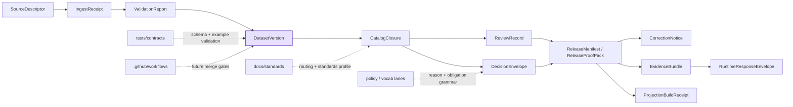

<!-- [KFM_META_BLOCK_V2]
doc_id: kfm://doc/<TODO-VERIFY-UUID>
title: data
type: standard
version: v1
status: draft
owners: @bartytime4life
created: <TODO-VERIFY-YYYY-MM-DD>
updated: <TODO-VERIFY-YYYY-MM-DD>
policy_label: <TODO-VERIFY>
related: [schemas/contracts/v1/README.md, schemas/contracts/README.md, contracts/README.md, docs/standards/README.md, tests/contracts/README.md, .github/workflows/README.md, schemas/contracts/v1/data/dataset_version.schema.json]
tags: [kfm, schemas, contracts, data, dataset-version]
notes: [Owner currently follows public CODEOWNERS global fallback; authoritative schema home remains unresolved in adjacent docs; doc_id/created/updated/policy_label need verification]
[/KFM_META_BLOCK_V2] -->

# data

_Dataset-version boundary guide and current-state index for the public `schemas/contracts/v1/data/` lane._

> [!IMPORTANT]
> **Status:** experimental · **Doc status:** draft  
> **Owners:** `@bartytime4life` _via public `.github/CODEOWNERS` global fallback; a narrower `/schemas/` or `/schemas/contracts/v1/data/` rule was not directly verified_  
> **Path:** `schemas/contracts/v1/data/README.md`  
> **Repo fit:** child of [`../README.md`](../README.md) · subtree boundary [`../../README.md`](../../README.md) · parent lane [`../../../README.md`](../../../README.md) · stronger current contract signal [`../../../../contracts/README.md`](../../../../contracts/README.md) · standards routing [`../../../../docs/standards/README.md`](../../../../docs/standards/README.md) · verification family [`../../../../tests/contracts/README.md`](../../../../tests/contracts/README.md) · workflow lane [`../../../../.github/workflows/README.md`](../../../../.github/workflows/README.md) · local schema [`./dataset_version.schema.json`](./dataset_version.schema.json)


**Quick jumps:** [Scope](#scope) · [Repo fit](#repo-fit) · [Accepted inputs](#accepted-inputs) · [Exclusions](#exclusions) · [Current verified snapshot](#current-verified-snapshot) · [Directory tree](#directory-tree) · [Quickstart](#quickstart) · [Usage](#usage) · [Diagram](#diagram) · [Tables](#tables) · [Task list / definition of done](#task-list--definition-of-done) · [FAQ](#faq) · [Appendix](#appendix)

> [!WARNING]
> Public `main` already exposes this lane and `./dataset_version.schema.json`, but adjacent docs still keep the authoritative schema home unresolved, and the checked-in schema body is still scaffold-state. Treat this directory as **real inventory plus unresolved authority**, not as already-settled enforcement truth.

## Scope

`schemas/contracts/v1/data/` is the versioned family lane for the **DatasetVersion** contract inside the visible `schemas/contracts/v1/` subtree.

This README should do five things well:

1. make the local lane legible without overstating implementation maturity,
2. keep `DatasetVersion` anchored to canonical-truth semantics rather than delivery convenience,
3. show where this lane sits relative to `contracts/`, `schemas/`, `policy/`, `tests/`, and workflow surfaces,
4. keep unresolved authority visible instead of silently declaring this path canonical,
5. give future editors a narrow, reviewable place to evolve the data-family boundary.

### Truth posture used here

| Label | Meaning here | How to read it in this file |
|---|---|---|
| **CONFIRMED** | Directly visible in adjacent repo docs or current public tree structure | Safe to treat as present now |
| **INFERRED** | Strong consequence of repeated contract doctrine, but not directly encoded in the local placeholder schema yet | Useful for boundary explanation, not for implementation claims |
| **PROPOSED** | Recommended next shape or sync rule for this lane | Treat as change guidance |
| **UNKNOWN** | Not directly reverified from the visible repo surfaces used for this revision | Do not convert into fact |
| **NEEDS VERIFICATION** | Worth checking before relying on it operationally | Leave visible until rechecked |

### Working reading of `DatasetVersion`

Within current KFM doctrine, **DatasetVersion** is the contract family that carries an authoritative candidate or promoted subject set after validation and before outward catalog closure. In practical repo terms, this lane should stay centered on:

- stable identity,
- version identity,
- support and time semantics,
- provenance and lineage links,
- validation and release linkage,
- visible correction compatibility.

Until [`./dataset_version.schema.json`](./dataset_version.schema.json) becomes more than a placeholder body, this README should keep that burden explicit rather than implying that field-level law is already encoded locally.

[Back to top](#data)

## Repo fit

| Aspect | Current role |
|---|---|
| **Directory** | `schemas/contracts/v1/data/` |
| **Primary job** | Hold the data-family README and the visible `DatasetVersion` schema stub for the versioned contracts subtree |
| **Immediate parent** | [`../README.md`](../README.md) — the `schemas/contracts/v1/` lane guide |
| **Boundary context** | [`../../README.md`](../../README.md) — `schemas/contracts/` guide with schema-home ambiguity kept visible |
| **Stronger adjacent contract signal** | [`../../../../contracts/README.md`](../../../../contracts/README.md) |
| **Standards context** | [`../../../../docs/standards/README.md`](../../../../docs/standards/README.md) |
| **Verification context** | [`../../../../tests/contracts/README.md`](../../../../tests/contracts/README.md) |
| **Workflow context** | [`../../../../.github/workflows/README.md`](../../../../.github/workflows/README.md) |
| **Local inventory** | [`README.md`](./README.md), [`dataset_version.schema.json`](./dataset_version.schema.json) |
| **Audience** | contract editors, policy reviewers, verification authors, documentation stewards, thin-slice implementers |
| **Authority state** | visible subtree is real; authoritative schema home is still unresolved in adjacent docs |

### Upstream and downstream links

Upstream context flows from:

- root repo posture in [`../../../../README.md`](../../../../README.md),
- standards and documentation routing in [`../../../../docs/standards/README.md`](../../../../docs/standards/README.md),
- contract doctrine and family planning in [`../../../../contracts/README.md`](../../../../contracts/README.md),
- subtree boundary rules in [`../../README.md`](../../README.md) and [`../README.md`](../README.md).

Downstream pressure lands in:

- contract-validation and invalid-example testing via [`../../../../tests/contracts/README.md`](../../../../tests/contracts/README.md),
- policy vocabulary and deny-by-default handling via [`../../../../policy/README.md`](../../../../policy/README.md),
- future merge gates and validator runs via [`../../../../.github/workflows/README.md`](../../../../.github/workflows/README.md).

## Accepted inputs

The following content belongs here:

| Accepted here | Why it belongs |
|---|---|
| README guidance specific to the `data/` family | This file is the lane explainer |
| Narrow notes that clarify `DatasetVersion` contract purpose | This lane exists to hold that family boundary |
| Additive edits to [`./dataset_version.schema.json`](./dataset_version.schema.json) | This is the only visible machine file in the lane today |
| Cross-links to parent/sibling contract docs | The lane should be navigable in-repo |
| Honest notes about authority ambiguity or migration state | The repo currently needs that ambiguity surfaced, not hidden |
| Family-local review checklists | Helps keep later edits small and verifiable |

## Exclusions

The following content does **not** belong here:

| Do not put this here | Better home | Why |
|---|---|---|
| Actual datasets, exports, or canonical data payloads | truth-path data zones, not contract docs | This lane documents contracts, not subject matter |
| Rego bundles, decision logic, or obligation registries | [`../../../../policy/README.md`](../../../../policy/README.md) and vocab lanes | Policy is adjacent, not owned here |
| Valid/invalid fixture packs | [`../../../../tests/contracts/README.md`](../../../../tests/contracts/README.md) and fixture lanes | Verification should stay executable and separate |
| Workflow YAML or CI implementation details | [`../../../../.github/workflows/README.md`](../../../../.github/workflows/README.md) | Public `main` does not evidence active gates here |
| Runtime DTOs, API response payload docs, or Focus envelopes | runtime / API families | This is the **data** contract lane |
| Release proof packs or correction notices | release / correction families | Keep family boundaries sharp |
| A second silent authoritative copy under both `contracts/` and `schemas/` | one authoritative home only | Avoid parallel schema universes |

[Back to top](#data)

## Current verified snapshot

| Surface | Status | What this file should assume |
|---|---|---|
| `schemas/contracts/v1/data/` directory exists | **CONFIRMED** | This lane is visible in the public tree |
| `dataset_version.schema.json` exists | **CONFIRMED** | The file is present and should be documented |
| `dataset_version.schema.json` body is still placeholder-state | **CONFIRMED** | Do not describe field enforcement as implemented here yet |
| Parent `schemas/contracts/v1/` guide lists the `data` family | **CONFIRMED** | This lane is part of the published family registry |
| `schemas/contracts/` exposes real machine-file placement but keeps authority unresolved | **CONFIRMED** | Do not quietly declare this path canonical |
| Top-level `contracts/README.md` still provides the stronger current `DatasetVersion` doctrinal signal | **CONFIRMED** | Keep links to `contracts/README.md` visible |
| `tests/contracts/` exists as the downstream contract-validation family | **CONFIRMED** | Route fixtures and negative validation there, not here |
| Public `.github/workflows/` lane is README-only in the inspected tree | **CONFIRMED** | Do not claim checked-in merge-blocking YAML here |
| Canonical schema-home decision | **NEEDS VERIFICATION** | Must be resolved explicitly, not implied |
| Validator command, fixture inventory, merge gates | **UNKNOWN / NEEDS VERIFICATION** | Mention only as adjacent or future work |

## Directory tree

### Current subtree context

```text
schemas/contracts/
├── README.md
├── vocab/
└── v1/
    ├── README.md
    ├── common/
    ├── correction/
    ├── data/
    │   ├── README.md
    │   └── dataset_version.schema.json
    ├── evidence/
    ├── policy/
    ├── release/
    ├── runtime/
    └── source/
```

### Current lane snapshot

```text
schemas/contracts/v1/data/
├── README.md
└── dataset_version.schema.json
```

### Companion surfaces this lane depends on

```text
contracts/
└── README.md

docs/standards/
└── README.md

policy/
└── README.md

tests/contracts/
└── README.md

.github/workflows/
└── README.md
```

### Proposed companion verification shape  
_Illustrative only — not confirmed as present on public `main`._

```text
tests/fixtures/contracts/v1/
├── valid/
└── invalid/
```

## Quickstart

### 1) Inspect only the local lane

```bash
find schemas/contracts/v1/data -maxdepth 1 -type f | sort
cat schemas/contracts/v1/data/dataset_version.schema.json
```

### 2) Read the boundary docs in the order that reduces drift

```bash
cat schemas/contracts/v1/README.md
cat schemas/contracts/README.md
cat contracts/README.md
cat docs/standards/README.md
cat tests/contracts/README.md
cat .github/workflows/README.md
```

### 3) Trace `DatasetVersion` references before editing

```bash
grep -RIn "DatasetVersion\|dataset_version.schema.json" \
  contracts schemas tests docs policy .github
```

### 4) Keep the change narrow

Use this lane for one of two things only:

- clarify the **data-family boundary**, or
- advance [`./dataset_version.schema.json`](./dataset_version.schema.json) from placeholder toward a real schema.

If a change reaches fixtures, policy vocabularies, workflow gates, or release assembly, it has already crossed family boundaries and should update the owning lanes in the same review stream.

[Back to top](#data)

## Usage

### What this family should answer

A healthy `data/` family should let a reviewer answer these questions quickly:

- What object represents **canonical processed truth** before outward catalog closure?
- How is **stable identity** kept distinct from **version identity**?
- What does the contract say about **support**, **time semantics**, and **subject-set scope**?
- Where do **validation refs**, **provenance refs**, and **release linkage** attach?
- How does a future schema keep **supersession** and **correction lineage** visible?
- Which parts of the burden belong here, and which are owned by policy, tests, workflows, or release families?

### When to edit this README vs the schema

| Change type | Edit this README | Edit `dataset_version.schema.json` | Also touch |
|---|---:|---:|---|
| Clarify family purpose, links, or lane boundary | ✅ |  | parent READMEs if boundary language changes |
| Turn doctrine into concrete field structure | ✅ | ✅ | `tests/contracts/`, fixture lanes, parent family registry |
| Add valid / invalid examples |  |  | verification lanes |
| Add reason / obligation codes |  |  | policy / vocab lanes |
| Add workflow commands or merge-gate claims |  |  | workflow lane |
| Resolve authoritative schema home | ✅ | maybe | `schemas/`, `schemas/contracts/`, `schemas/contracts/v1/`, `contracts/`, standards, tests, workflows |

### Keep the authority story singular

> [!NOTE]
> This lane should not quietly decide the schema-home question by drift. If `contracts/` remains the authoritative home, this lane should stay documentary or explicitly mirrored. If `schemas/contracts/` becomes authoritative, the change should be made openly and synchronized across sibling docs in the same PR.

## Diagram



**Reading rule:** `DatasetVersion` sits after validation and before outward closure. That makes this lane a **canonical-truth boundary**, not a policy pack, fixture bucket, or release surface.

[Back to top](#data)

## Tables

### DatasetVersion doctrine minimums

| Dimension | Doctrine-grounded minimum | Why it matters in this lane | Current local state |
|---|---|---|---|
| **Purpose** | Carry an authoritative candidate or promoted subject set for canonical processed truth | Keeps the family tied to canonical truth rather than convenience payloads | README can say this now; schema body does not yet encode it |
| **Identity** | Stable ID plus version ID | Prevents truth from collapsing into unnamed snapshots | Not yet visible in the local schema body |
| **Support / time semantics** | Explicit support and time meaning | Stops geometry/time drift and “looks aligned” failures | Not yet visible in the local schema body |
| **Provenance / lineage** | Provenance links and lineage refs | Keeps later EvidenceBundle and correction paths reconstructable | Not yet visible in the local schema body |
| **Validation / build context** | Validation refs and build context | Prevents undocumented repairs from becoming truth | Not yet visible in the local schema body |
| **Release linkage** | Linkage forward into closure / release family | Keeps publication governance visible | Not yet visible in the local schema body |
| **Failure mode prevented** | Derived layers or undocumented repairs quietly becoming truth | This is the family’s main boundary value | Still documentary here until schema/test surfaces mature |

### Placement decision matrix

| Need | Put it in `schemas/contracts/v1/data/`? | Better home if not | Why |
|---|---:|---|---|
| Explain DatasetVersion purpose | ✅ |  | This is the family README |
| Add field grammar for DatasetVersion | ✅ |  | This lane owns the local schema file |
| Add invalid fixture proving failure |  | tests / fixture lanes | Verification should be executable |
| Add reason codes |  | policy / vocab | Decision grammar is adjacent, not local |
| Add workflow command and required check names |  | workflow lane | Public `main` does not evidence that here |
| Add release proof-pack examples |  | release family | Different contract family |
| Settle authority between `contracts/` and `schemas/contracts/` | partly | cross-repo doc update | Needs synchronized change, not a silent local rewrite |

## Task list / definition of done

### Lane checklist

- [ ] Title, purpose line, path, owners, and quick jumps stay accurate.
- [ ] Relative links still resolve from `schemas/contracts/v1/data/README.md`.
- [ ] `dataset_version.schema.json` existence and current maturity are described honestly.
- [ ] No section claims live validator commands, merge gates, or fixture coverage without direct verification.
- [ ] Authority ambiguity remains visible until explicitly resolved.
- [ ] Family boundaries stay sharp: data here, policy there, tests there, workflows there.

### Definition of done for a **documentation-only** change

- [ ] README clarifies boundary without changing contract semantics.
- [ ] Parent and sibling links remain in sync.
- [ ] No accidental authority claim is introduced.

### Definition of done for a **schema-bearing** change

- [ ] [`./dataset_version.schema.json`](./dataset_version.schema.json) moves beyond scaffold-state.
- [ ] `schemas/contracts/v1/README.md` family registry stays accurate.
- [ ] Contract-validation companions are updated in the same review stream.
- [ ] Any new field names are echoed here in plain-language boundary notes.
- [ ] Any authority-home implication is addressed explicitly across adjacent docs.

[Back to top](#data)

## FAQ

### Is `schemas/contracts/v1/data/` the confirmed authoritative schema home today?

No. This path is visibly real, but adjacent docs still keep the authoritative schema home unresolved.

### Is `dataset_version.schema.json` already enforcement-grade?

Not yet. The checked-in public body is still scaffold-state, so this README should explain the burden without pretending field-level enforcement already exists.

### Does this lane hold actual dataset payloads?

No. It documents the **contract family** that should describe authoritative dataset versions, not the datasets themselves.

### Where should valid / invalid examples go?

Into verification surfaces, not this lane. Keep this directory narrow and keep fail-closed proof executable elsewhere.

### Why keep a substantive README here if the authority decision is unresolved?

Because the path is already public and visible. A precise lane guide is safer than a one-line stub when the repo is trying to avoid drift and accidental parallel authority.

## Appendix

<details>
<summary><strong>Doctrine-grounded starter field groups for a future substantive <code>DatasetVersion</code> body</strong></summary>

This is a **starter checklist**, not a claim about the current local schema body.

| Field group | Why it belongs |
|---|---|
| `kind` / `object_type` | Declares what the object is before free-form content appears |
| `stable_id` | Keeps long-lived identity explicit |
| `version_id` | Separates version lineage from subject identity |
| `subject_set` or equivalent declared scope | Makes clear what this version actually covers |
| `stable_identity_basis` | Explains why this subject set is the “same thing” across versions |
| `support` | Declares the grain at which claims are meaningful |
| `observed_at` / `valid_at` / `issued_at` / `published_at` as relevant | Preserves distinct time semantics |
| `provenance_refs` / `lineage_refs` | Connects the version to reconstructable upstream evidence |
| `validation_refs` / `build_context` | Keeps pre-release checks inspectable |
| `release_ref` or closure linkage | Stops canonical truth from floating free of outward release state |
| `rights_class` / `sensitivity_class` where relevant | Makes public-safe posture executable |
| `checksums` / `digests` / `profile_versions` | Keeps identity and contract versioning explicit |
| `audit_ref` plus supersession / withdrawal pointers | Preserves correction lineage |

</details>

<details>
<summary><strong>Neighbor files that should usually be reviewed in the same PR</strong></summary>

- [`../README.md`](../README.md)
- [`../../README.md`](../../README.md)
- [`../../../README.md`](../../../README.md)
- [`../../../../contracts/README.md`](../../../../contracts/README.md)
- [`../../../../docs/standards/README.md`](../../../../docs/standards/README.md)
- [`../../../../tests/contracts/README.md`](../../../../tests/contracts/README.md)
- [`../../../../policy/README.md`](../../../../policy/README.md)
- [`../../../../.github/workflows/README.md`](../../../../.github/workflows/README.md)

Review them together whenever:

- authority shifts,
- the `DatasetVersion` family meaning changes,
- verification expectations change,
- or the lane starts claiming real enforcement.

</details>

[Back to top](#data)
