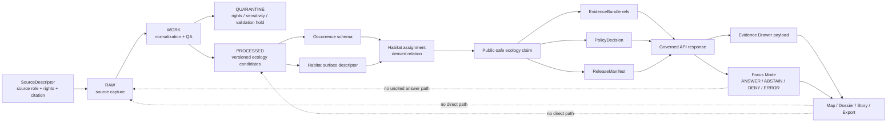

<!-- [KFM_META_BLOCK_V2]
doc_id: kfm://doc/TODO-uuid-schemas-contracts-v1-ecology-readme
title: Ecology Contract Schemas
type: standard
version: v1
status: draft
owners: TODO: verify schema/ecology owners
created: TODO-YYYY-MM-DD
updated: TODO-YYYY-MM-DD
policy_label: TODO: verify public|restricted label
related: [TODO: verify schemas/contracts/v1/README.md, TODO: verify contracts/README.md, TODO: verify docs/domains/ecology or habitat-fauna-flora docs, TODO: verify policy/ecology, TODO: verify tests/fixtures/ecology]
tags: [kfm, ecology, biodiversity, schemas, contracts, evidence]
notes: [Target path requested as schemas/contracts/v1/ecology/README.md. Repository checkout was not mounted during authoring; ownership, dates, policy label, adjacent links, validator commands, and active schema inventory need direct repo verification before publication.]
[/KFM_META_BLOCK_V2] -->

<a id="top"></a>

# Ecology Contract Schemas

Machine-checkable ecology contract schemas for KFM biodiversity, habitat, and public-safe ecological claim objects.


> [!IMPORTANT]
> **Status:** `experimental`  
> **Owners:** `TODO: verify schema/ecology owners`  
> **Path:** `schemas/contracts/v1/ecology/README.md`  
> **Authority level:** schema-contract guide; machine shape for ecology objects, not doctrine, policy, proof, or runtime authority  
> **Truth posture:** **CONFIRMED** for KFM doctrine summarized from the source corpus; **PROPOSED** for the file map below; **UNKNOWN** for current active-branch schema inventory  
> **Quick jumps:** [Scope](#scope) · [Repo fit](#repo-fit) · [Accepted inputs](#accepted-inputs) · [Exclusions](#exclusions) · [Directory tree](#directory-tree) · [Contract map](#contract-map) · [Trust flow](#trust-flow) · [Quickstart](#quickstart) · [Validation gates](#validation-gates) · [Definition of done](#definition-of-done) · [FAQ](#faq) · [Appendix](#appendix)

> [!NOTE]
> This README is written for a schema directory whose job is to keep ecology-related contract shapes reviewable, versioned, and subordinate to KFM evidence, policy, review, and release state. It should not be used to claim that the active repository already contains the proposed schema files until the branch is inspected.

---

## Scope

`schemas/contracts/v1/ecology/` is the proposed machine-schema home for ecology contract objects that describe **what can be validated about biodiversity, habitat, and ecology-facing public claims**.

It is meant to support KFM’s governed ecology lanes without collapsing distinct knowledge classes:

| Ecology object class | Role in KFM | Boundary rule |
|---|---|---|
| Taxon concept / taxon reference | Identifies the biological entity being discussed. | A schema can validate identifiers and names; it is not a taxonomic authority. |
| Occurrence evidence | Represents an observed or fixture-backed organism occurrence. | Occurrence is not the same thing as habitat preference, range, legal status, or public release approval. |
| Habitat surface descriptor | Describes a classified surface, grid, or raster-like habitat context. | A habitat surface is source context, not a species claim by itself. |
| Habitat assignment | Represents a derived relation between an occurrence and a habitat surface/class. | A join is a derivation with parameters, not canonical ecological truth. |
| Sensitivity / geoprivacy classification | Captures whether geometry, precision, rights, or species risk constrain publication. | Ambiguity fails closed; exact sensitive locations do not become public by default. |
| Public-safe ecology claim | Packages an outward claim only after evidence, policy, review, and release state can be resolved. | Public-safe does not mean unrestricted; it means release conditions are explicit. |
| Evidence Drawer payload overlay | Supplies renderer-neutral trust fields for UI display when this lane needs ecology-specific payloads. | UI payloads explain trust state; they do not manufacture evidence. |

[Back to top](#top)

---

## Repo fit

This directory sits inside the **schema-contract** surface. It should validate the shape of ecology objects while depending on adjacent KFM surfaces for meaning, policy, data movement, and proof.

| Relationship | Surface | Status | Why it matters |
|---|---|---:|---|
| Current directory | `schemas/contracts/v1/ecology/` | **PROPOSED / task-confirmed path** | Target path requested for this README. |
| Upstream version index | `schemas/contracts/v1/README.md` | **NEEDS VERIFICATION** | Should explain version-wide schema conventions and shared governance schema reuse. |
| Upstream schema-contract root | `schemas/contracts/README.md` | **NEEDS VERIFICATION** | Should explain why contract schemas live under `schemas/contracts/`. |
| Upstream schema lane | `schemas/README.md` | **NEEDS VERIFICATION** | Should define machine-checkable schema authority and validation expectations. |
| Lateral semantics lane | `contracts/README.md` | **NEEDS VERIFICATION** | Human-readable field intent and invariants should live in contracts, not only in JSON Schema. |
| Lateral policy lane | `policy/README.md` | **NEEDS VERIFICATION** | Rights, sensitivity, admissibility, generalization, denial, and review obligations belong to policy. |
| Downstream fixtures | `tests/fixtures/ecology/README.md` | **PROPOSED / NEEDS VERIFICATION** | Valid and invalid objects should prove the schemas without becoming production data. |
| Downstream validators | `tools/validators/ecology/README.md` | **PROPOSED / NEEDS VERIFICATION** | Validators should turn schema and policy expectations into auditable reports. |
| Downstream data lifecycle | `data/README.md` | **NEEDS VERIFICATION** | RAW, WORK, QUARANTINE, PROCESSED, CATALOG, PROOFS, and PUBLISHED artifacts do not belong here. |
| Downstream UI/runtime | `apps/` or repo-equivalent governed API and shell paths | **UNKNOWN** | Public clients should consume governed responses, not schema files or raw stores directly. |

> [!WARNING]
> Do not resolve a `contracts/` versus `schemas/` ambiguity by duplicating definitions. If the active repo uses a different schema home, move this README through an ADR-backed migration rather than creating parallel schema authorities.

[Back to top](#top)

---

## Accepted inputs

Only commit artifacts here that help validate ecology contract shape.

| Input class | Belongs here | Review expectation |
|---|---|---|
| JSON Schema files | Ecology-specific `*.schema.json` definitions and reusable fragments. | Must be versioned and covered by valid/invalid fixtures. |
| Enum fragments | Ecology-specific values such as `knowledge_character`, `source_role`, `precision_served`, or `sensitivity_status` when no shared enum exists. | Prefer shared governance/runtime enums if already present. |
| Schema index docs | README, object map, compatibility notes, migration notes. | Must preserve uncertainty and not claim runtime enforcement. |
| Schema composition notes | `$ref` strategy, shared-object dependencies, schema versioning notes. | Must avoid silently redefining shared KFM objects. |
| Minimal illustrative examples | Tiny examples used inside docs to explain fields. | Canonical regression fixtures should live under `tests/fixtures/` or repo-equivalent fixture homes. |

[Back to top](#top)

---

## Exclusions

| Does **not** belong here | Put it instead | Reason |
|---|---|---|
| RAW source records, downloaded rasters, occurrence exports, or source-owned datasets | `data/raw/` or source-specific intake lane | Schemas describe shape; they do not store source material. |
| WORK, QUARANTINE, PROCESSED, CATALOG, PROOFS, RECEIPTS, or PUBLISHED artifacts | `data/` lifecycle surfaces | Emitted instances are not normative definitions. |
| Policy rules for release, denial, generalization, rights, or sensitivity | `policy/` | Policy owns admissibility; schemas only validate fields needed by policy. |
| Human-only field doctrine with no executable shape | `contracts/` or `docs/domains/` | Contracts explain meaning; schemas validate structure. |
| API handlers, UI components, shell code, or map-layer style files | `apps/`, `packages/`, `ui/`, `web/`, or repo-equivalent runtime lanes | Runtime implementation must remain downstream of contracts, policy, and release state. |
| Live source connector code | `pipelines/`, `packages/`, or source-connector lanes | Source activation requires registry, rights, and policy review before runtime use. |
| AI prompts, model outputs, or generated explanations | governed AI/runtime lanes | AI is interpretive and evidence-subordinate. |
| Exact sensitive-species coordinates intended for public display | nowhere public by default; use governed quarantine/redaction/generalization path | High-risk precision fails closed unless review and transform receipts support release. |
| A second shared `EvidenceBundle`, `DecisionEnvelope`, or `RuntimeResponseEnvelope` definition | shared governance/runtime schema home | Shared trust objects should remain singular. Ecology schemas should reference them. |

[Back to top](#top)

---

## Directory tree

> [!NOTE]
> The tree below is a **PROPOSED target shape**, not a claim of active-branch files. Keep only the files that the mounted repo conventions and ADRs support.

```text
schemas/contracts/v1/ecology/
├── README.md
├── _index.schema.json                         # PROPOSED: optional schema registry for this directory
├── fragments/
│   ├── ecology_knowledge_character.schema.json # PROPOSED: observed / derived / modeled / statutory / protected_context
│   ├── ecology_source_role.schema.json         # PROPOSED: occurrence / habitat_surface / status / context roles
│   ├── public_precision.schema.json            # PROPOSED: exact / generalized / withheld / degraded
│   └── sensitivity_status.schema.json          # PROPOSED: public_safe / restricted / review_required / withheld
├── taxon_concept.schema.json                   # PROPOSED
├── ecology_occurrence.schema.json              # PROPOSED
├── habitat_surface_descriptor.schema.json      # PROPOSED
├── habitat_assignment.schema.json              # PROPOSED
├── ecology_public_claim.schema.json            # PROPOSED
├── ecology_layer_manifest.schema.json          # PROPOSED, only if not covered by shared layer manifests
└── ecology_evidence_drawer_payload.schema.json # PROPOSED, only if UI payloads require ecology-specific fields
```

Recommended shared dependencies, to be reused rather than forked:

```text
schemas/contracts/v1/governance/source_descriptor.schema.json       # NEEDS VERIFICATION
schemas/contracts/v1/governance/evidence_bundle.schema.json         # NEEDS VERIFICATION
schemas/contracts/v1/governance/decision_envelope.schema.json       # NEEDS VERIFICATION
schemas/contracts/v1/governance/policy_decision.schema.json         # NEEDS VERIFICATION
schemas/contracts/v1/governance/release_manifest.schema.json        # NEEDS VERIFICATION
schemas/contracts/v1/runtime/runtime_response_envelope.schema.json  # NEEDS VERIFICATION
```

[Back to top](#top)

---

## Contract map

### Ecology schema responsibilities

| Contract | Status | Required concerns | Fail-closed posture |
|---|---:|---|---|
| `taxon_concept.schema.json` | **PROPOSED** | `taxon_id`, scientific/common names, authority/reference fields, taxon resolution status, ambiguity flags. | Do not allow ambiguous taxon resolution to become an unrestricted public claim. |
| `ecology_occurrence.schema.json` | **PROPOSED** | occurrence ID, taxon reference, source record ID, observation time, geometry/precision, rights, sensitivity, source refs, evidence refs. | Quarantine or deny public use when provenance, precision, rights, or sensitivity status is unresolved. |
| `habitat_surface_descriptor.schema.json` | **PROPOSED** | source ID, classification system/version, spatial/temporal extent, resolution, processing level, checksum/content identity, citation text. | Deny descriptor use when authority, rights, classification version, temporal extent, or content identity is missing. |
| `habitat_assignment.schema.json` | **PROPOSED** | occurrence ID, habitat source ID, habitat class, sampling method, derivation parameters, quality flag, generated time, evidence refs. | Abstain when class lookup fails; deny when occurrence is not publication-eligible. |
| `ecology_public_claim.schema.json` | **PROPOSED** | claim text, public-safe geometry, support summary, evidence bundle refs, policy flags, freshness, release state, correction state. | No publication when evidence, rights, public geometry, or release state cannot resolve. |
| `ecology_layer_manifest.schema.json` | **PROPOSED / conditional** | layer ID, source refs, knowledge character, time semantics, evidence route, visibility and generalization rules. | Map layers must not imply evidence authority from rendered pixels or feature properties alone. |
| `ecology_evidence_drawer_payload.schema.json` | **PROPOSED / conditional** | claim, occurrence/habitat summary, evidence refs, citation refs, freshness, provenance, policy status, rights status, publication state, visible outcome. | Drawer payloads must show denial, abstention, generalization, and missing-evidence states. |

### Shared object reuse rule

Before adding an ecology-specific schema, check whether a shared governance or runtime schema already exists.

| Shared object | Ecology should do | Ecology should not do |
|---|---|---|
| `SourceDescriptor` | Reference source identity, authority, rights, cadence, and citation data. | Fork per-lane source descriptor semantics without an ADR. |
| `EvidenceBundle` / `EvidenceRef` | Require resolvable evidence support before public claims. | Treat local fixture IDs or rendered layer IDs as evidence. |
| `DecisionEnvelope` / `RuntimeResponseEnvelope` | Preserve finite `ANSWER`, `ABSTAIN`, `DENY`, `ERROR` outcomes. | Smooth negative states into empty UI or generic errors. |
| `PolicyDecision` | Carry policy state for rights, sensitivity, review, generalization, and release conditions. | Encode policy conclusions as schema-only validation. |
| `ReleaseManifest` | Tie public ecology artifacts to release scope, digests, proof, rollback, and correction state. | Treat a file under `published/` as released without promotion state. |

[Back to top](#top)

---

## Trust flow

Ecology contracts should support the KFM truth path and the governed UI/runtime boundary.



> [!IMPORTANT]
> The habitat assignment is a derived object. If the habitat source, occurrence precision, rights posture, or derivation parameters change, the assignment must be reproducible, invalidatable, and comparable by `spec_hash` or repo-equivalent content identity.

[Back to top](#top)

---

## Quickstart

Use this sequence when adding or reviewing ecology schemas.

1. Verify the active schema home.
2. Check for shared governance/runtime schemas before adding ecology-specific definitions.
3. Add one schema, one valid fixture, and at least two invalid fixtures.
4. Add or update a validator report expectation.
5. Confirm policy can deny or abstain when required fields are missing.
6. Confirm public-facing examples resolve evidence, policy, and release state.

```bash
# CONFIRMED safe inspection commands; run from repo root after checkout is mounted.
git status --short
find schemas/contracts/v1/ecology -maxdepth 2 -type f | sort
find tests/fixtures -maxdepth 3 -type f | grep -E 'ecology|habitat|fauna|flora' || true
```

```bash
# NEEDS VERIFICATION: replace with the repo-native schema validator command.
python tools/validators/schemas/validate_schema_fixture.py \
  --schema schemas/contracts/v1/ecology/habitat_assignment.schema.json \
  --valid tests/fixtures/ecology/habitat_assignment.valid.json \
  --invalid tests/fixtures/ecology/habitat_assignment.missing_class.invalid.json
```

> [!CAUTION]
> Do not use a passing JSON Schema check as a public-release decision. Schema validation is necessary but not sufficient; rights, sensitivity, evidence resolution, catalog closure, review, proof, and promotion still have to pass.

[Back to top](#top)

---

## Validation gates

| Gate | Required evidence | Failure disposition | Owning surface |
|---|---|---|---|
| Schema syntax | JSON Schema parses and composes with shared refs. | `ERROR` for schema/tool failure. | `schemas/` + validator tooling |
| Fixture coverage | At least one valid and invalid fixture per schema. | `NEEDS VERIFICATION` until fixture gap is closed. | `tests/fixtures/` |
| Source role | `source_role` and `knowledge_character` are present where claims depend on them. | `ABSTAIN` or `DENY` for public outputs. | `contracts/`, `schemas/`, `policy/` |
| Evidence resolution | `EvidenceRef` resolves to `EvidenceBundle` or repo-equivalent support. | `ABSTAIN` for missing support; `ERROR` for resolver failure. | governed API + proof surfaces |
| Rights and sensitivity | rights class, sensitivity status, public precision, and transform state are explicit. | `DENY` or `QUARANTINE` until review supports release. | `policy/` + review lane |
| Geometry precision | exact/generalized/withheld/degraded status is explicit. | `DENY` exact sensitive public geometry unless transform receipt and review exist. | `policy/`, `data/receipts/` |
| Derived assignment | derivation parameters, input refs, and content identity are present. | `ABSTAIN` if class lookup fails; `ERROR` if malformed. | pipeline + `schemas/` |
| Catalog/proof closure | STAC/DCAT/PROV, release manifest, proof pack, and rollback target can cross-reference. | Not outward-ready. | `data/catalog/`, `data/proofs/`, release lane |
| Runtime envelope | output has finite outcome and cites evidence/policy/release state. | Negative state remains visible. | governed API/runtime |
| Evidence Drawer payload | UI can display evidence, rights, sensitivity, freshness, review, correction, and outcome. | Drawer must show denial/abstention; no silent empty state. | UI trust lane |

[Back to top](#top)

---

## Definition of done

A change to this directory is ready for review only when the following checklist is satisfied.

- [ ] Active repo schema-home decision is verified or an ADR records the unresolved conflict.
- [ ] New schemas do not duplicate shared `SourceDescriptor`, `EvidenceBundle`, `DecisionEnvelope`, `PolicyDecision`, `ReleaseManifest`, or `RuntimeResponseEnvelope` definitions.
- [ ] Every new schema has valid and invalid fixtures.
- [ ] Every public-facing ecology object carries source role, knowledge character, evidence refs, rights status, sensitivity status, precision/public-geometry posture, and release state where applicable.
- [ ] Derived objects identify their inputs, derivation parameters, and content/spec hash strategy.
- [ ] Sensitive or rights-unclear records fail closed.
- [ ] UI/runtime payload schemas preserve visible `ANSWER`, `ABSTAIN`, `DENY`, and `ERROR` outcomes.
- [ ] Documentation updates explain accepted inputs, exclusions, linked fixtures, validators, and downstream consumers.
- [ ] Rollback path is clear for any schema version bump or breaking change.
- [ ] No README language claims active implementation, workflow enforcement, or public release maturity without inspected repo evidence.

[Back to top](#top)

---

## FAQ

### Why does ecology need its own schema directory?

Ecology sits across habitat, fauna, flora, and public-safe map/runtime claims. A dedicated schema directory can coordinate those object shapes without turning a derived habitat join, map layer, or AI summary into canonical truth.

### Is `habitat_assignment` a species habitat claim?

No. It is a derived relation between an occurrence and a habitat surface/class under specific parameters. It can support an inspectable claim, but it is not itself proof of habitat preference, range, abundance, conservation status, or legal protection.

### Can exact occurrence geometry be public?

Only when rights, sensitivity, precision, source terms, review state, and release state support it. The default posture for sensitive biodiversity is to generalize, withhold, restrict, or quarantine until policy and review allow release.

### Should this directory define `EvidenceBundle`?

Only if the repo has no shared governance schema and an ADR explicitly permits the temporary definition. Prefer shared KFM trust-object schemas and reference them from ecology schemas.

### Are UI payloads allowed here?

Only as schema contracts, and only if the repo does not keep all UI payload schemas under a shared runtime/UI schema directory. UI components and renderer logic do not belong here.

[Back to top](#top)

---

## Appendix

<details>
<summary><strong>Known unknowns before publication</strong></summary>

| Item | Status | Review action |
|---|---:|---|
| Exact owners | **UNKNOWN** | Verify CODEOWNERS or domain stewardship. |
| Created/updated dates | **UNKNOWN** | Replace TODO placeholders during commit. |
| Policy label | **UNKNOWN** | Verify repository labeling standard. |
| Parent README paths | **NEEDS VERIFICATION** | Add relative links only after targets are confirmed. |
| Schema draft/version | **NEEDS VERIFICATION** | Confirm JSON Schema dialect used by `schemas/contracts/v1`. |
| Existing shared governance schemas | **UNKNOWN** | Inspect `schemas/contracts/v1/governance/` or repo-equivalent home. |
| Existing ecology/habitat/fauna/flora schemas | **UNKNOWN** | Inventory before adding files. |
| Validator command | **UNKNOWN** | Replace illustrative command with repo-native validator. |
| Runtime response shape | **UNKNOWN** | Reconcile with active `RuntimeResponseEnvelope`. |
| Evidence Drawer payload shape | **UNKNOWN** | Reconcile with active UI shell contract. |

</details>

<details>
<summary><strong>Suggested schema naming rules</strong></summary>

- Prefer singular object names: `habitat_assignment.schema.json`, not `habitat_assignments.schema.json`.
- Use shared fragments for enums that cross lanes.
- Avoid embedding source names in schema names unless the object is source-specific by design.
- Use explicit version bumps for breaking shape changes.
- Keep schema IDs stable once published.
- Prefer `$ref` to shared governance schemas over local copies.
- Keep examples tiny and fixture-safe.

</details>

<details>
<summary><strong>Review notes for future maintainers</strong></summary>

This README intentionally keeps file names and sibling paths labeled **PROPOSED** or **NEEDS VERIFICATION** because the active repository was not mounted during authoring. After repo inspection, update:

1. the KFM meta block,
2. owner and policy labels,
3. parent and sibling links,
4. actual directory tree,
5. validator commands,
6. fixture paths,
7. any schema-home ADR references.

</details>

[Back to top](#top)
