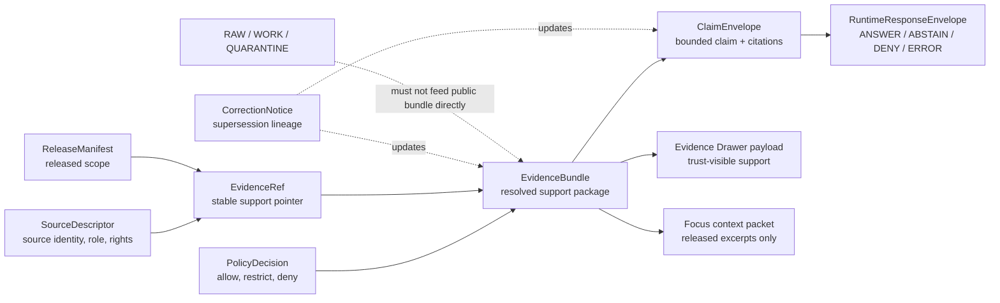

<!-- [KFM_META_BLOCK_V2]
doc_id: kfm://doc/<NEEDS_VERIFICATION_UUID>
title: evidence
type: standard
version: v1
status: draft
owners: @bartytime4life
created: <NEEDS_VERIFICATION_CREATED_DATE>
updated: 2026-04-23
policy_label: public
related: [../README.md, ../../README.md, ../../../README.md, ../../vocab/README.md, ../runtime/README.md, ../policy/README.md, ../release/README.md, ../correction/README.md, ../../../../contracts/README.md, ../../../../docs/standards/README.md, ../../../../policy/README.md, ../../../../tests/README.md, ../../../../.github/workflows/README.md, ./evidence_ref.schema.json, ./evidence_bundle.schema.json, ./claim_envelope.schema.json]
tags: [kfm, schemas, contracts, evidence]
notes: [doc_id and created date need verification, exact evidence-lane ownership and current schema-file inventory need mounted repo verification, schema-home authority between contracts and schemas remains unresolved, schema links in this block are expected lane companions and must be verified in the active checkout]
[/KFM_META_BLOCK_V2] -->

<a id="top"></a>

# `evidence`

Evidence contract-family lane for support packaging, `EvidenceRef` resolution, `EvidenceBundle` shape, and cited claim accountability under `schemas/contracts/v1/`.

> [!IMPORTANT]
> **Status:** experimental  
> **Document status:** draft  
> **Owners:** `@bartytime4life` *(exact evidence-lane ownership still needs active-checkout verification)*  
> **Path:** `schemas/contracts/v1/evidence/README.md`  
> **Repo fit:** child lane of [`../README.md`](../README.md); schema-family parents [`../../README.md`](../../README.md) and [`../../../README.md`](../../../README.md); shared vocab candidate [`../../vocab/README.md`](../../vocab/README.md); adjacent contract-family lanes [`../runtime/README.md`](../runtime/README.md), [`../policy/README.md`](../policy/README.md), [`../release/README.md`](../release/README.md), and [`../correction/README.md`](../correction/README.md); broader authority surfaces [`../../../../contracts/README.md`](../../../../contracts/README.md), [`../../../../policy/README.md`](../../../../policy/README.md), [`../../../../tests/README.md`](../../../../tests/README.md), and [`../../../../docs/standards/README.md`](../../../../docs/standards/README.md).  
> **Quick jumps:** [Scope](#scope) · [Current evidence snapshot](#current-evidence-snapshot) · [Repo fit](#repo-fit) · [Accepted inputs](#accepted-inputs) · [Exclusions](#exclusions) · [Directory tree](#directory-tree) · [Quickstart](#quickstart) · [Usage](#usage) · [Diagram](#diagram) · [Operating tables](#operating-tables) · [Definition of done](#definition-of-done) · [FAQ](#faq) · [Appendix](#appendix)
>
> 
> 
> 
> 
> 

---

## Scope

`schemas/contracts/v1/evidence/` is the contract lane for **claim support**, not a storage lane for raw source material and not a runtime answer surface.

This lane should describe and, when machine files are present, constrain the objects that let KFM move from:

```text
"I have a claim"
→ "I have cited support"
→ "the support resolves to released, policy-safe evidence"
→ "the claim can be shown, narrowed, denied, or abstained with an audit trail"
```

In KFM terms, the evidence lane is where `EvidenceRef`, `EvidenceBundle`, and `ClaimEnvelope` belong as contract families:

| Contract family | Plain meaning | Boundary |
|---|---|---|
| `EvidenceRef` | A stable pointer to a support item, source, artifact, claim scope, and release/policy state. | A reference is **not** proof by itself. |
| `EvidenceBundle` | A resolved, policy-safe support package for a claim, feature, story, export preview, Focus answer, or drawer payload. | A bundle packages support; it does **not** publish by itself. |
| `ClaimEnvelope` | A bounded claim with scope, citations, uncertainty, review state, and evidence linkage. | A claim may still be denied, abstained, corrected, or superseded downstream. |

> [!NOTE]
> This README is intentionally strict about negative states. Unsupported, stale, unresolved, rights-unclear, or policy-restricted support should produce an inspectable `ABSTAIN`, `DENY`, or review-required path downstream. It should not be hidden by fluent prose.

[Back to top](#top)

---

## Current evidence snapshot

| Observation | Status | Why it matters |
|---|---:|---|
| Target file requested: `schemas/contracts/v1/evidence/README.md` | **CONFIRMED** | This README is written for that exact lane. |
| Active checkout inventory for this lane | **NEEDS VERIFICATION** | The drafting workspace did not expose a mounted KFM repository tree. |
| KFM doctrine requires `EvidenceRef` → `EvidenceBundle` resolution before consequential public claims | **CONFIRMED doctrine** | This lane exists to keep citation support inspectable instead of rhetorical. |
| `EvidenceBundle` is a core trust-bearing contract family | **CONFIRMED doctrine / PROPOSED exact machine shape** | The exact schema body must be verified or created in the active repo. |
| `evidence_ref.schema.json`, `evidence_bundle.schema.json`, and `claim_envelope.schema.json` are expected lane companions | **PROPOSED / NEEDS VERIFICATION** | These filenames are used because KFM planning materials repeatedly name this first evidence wave; verify before merge. |
| Schema authority between root `contracts/` and `schemas/contracts/` | **NEEDS VERIFICATION** | Do not duplicate canonical meaning across both homes without an ADR. |
| Enforcement through CI, validators, or runtime gates | **UNKNOWN** | File presence is not proof of merge-blocking behavior. |

> [!WARNING]
> Do **not** treat this README, schema filenames, or branch-visible placeholder files as proof that the evidence resolver, citation validator, policy gates, Focus behavior, Evidence Drawer behavior, or release promotion are already enforced in code. Those require direct tests, fixtures, workflow evidence, and emitted artifacts.

[Back to top](#top)

---

## Repo fit

### Upstream and adjacent anchors

| Relation | Path | Role |
|---|---|---|
| Parent `v1` contract inventory | [`../README.md`](../README.md) | Lists v1 contract families and should define how evidence fits beside runtime, policy, release, and correction. |
| Contracts schema parent | [`../../README.md`](../../README.md) | Keeps schema-family rules close to the machine-contract subtree. |
| Root schema authority | [`../../../README.md`](../../../README.md) | Should explain whether `schemas/` is canonical, generated, mirrored, or transitional. |
| Shared vocabulary | [`../../vocab/README.md`](../../vocab/README.md) | Candidate home for reason codes, obligation codes, reviewer roles, source roles, and shared enumerations. |
| Runtime neighbor | [`../runtime/README.md`](../runtime/README.md) | Runtime envelopes consume evidence results; they should not redefine evidence. |
| Policy neighbor | [`../policy/README.md`](../policy/README.md) | Policy decisions determine whether evidence may be used or shown. |
| Release neighbor | [`../release/README.md`](../release/README.md) | Release scope constrains which evidence can support public claims. |
| Correction neighbor | [`../correction/README.md`](../correction/README.md) | Corrections preserve visible lineage when evidence or claims change. |
| Root contract context | [`../../../../contracts/README.md`](../../../../contracts/README.md) | Human semantic contracts may live here or cross-link here; schema-home authority is still review-sensitive. |
| Verification surface | [`../../../../tests/README.md`](../../../../tests/README.md) | Valid/invalid fixtures and contract tests should prove the evidence contracts. |
| Policy surface | [`../../../../policy/README.md`](../../../../policy/README.md) | Executable allow, deny, restrict, and obligation logic belongs outside this lane. |
| Workflow guardrail | [`../../../../.github/workflows/README.md`](../../../../.github/workflows/README.md) | Workflow names are proof burdens, not proof of enforcement by themselves. |

### Downstream consumers

This lane is upstream of several trust-visible surfaces:

- governed API responses that must cite or abstain;
- Evidence Drawer payloads that explain support at the point of use;
- Focus Mode responses that summarize only admissible released evidence;
- Story/export publication checks that require resolvable citations;
- catalog, release, proof, and correction reviews that need stable support references.

[Back to top](#top)

---

## Accepted inputs

Use this lane for small, explicit, reviewable evidence-contract materials.

| Accepted input | Why it belongs here | Status |
|---|---|---:|
| `EvidenceRef` schema and examples | Keeps support pointers stable, scoped, and release-aware. | **PROPOSED / NEEDS VERIFICATION** |
| `EvidenceBundle` schema and examples | Packages resolved support with source, review, rights, sensitivity, integrity, and audit context. | **PROPOSED / NEEDS VERIFICATION** |
| `ClaimEnvelope` schema and examples | Makes claims bounded by geography, time, evidence, uncertainty, and review state. | **PROPOSED / NEEDS VERIFICATION** |
| Valid and invalid contract fixtures | Proves required fields, negative states, and fail-closed behavior. | **PROPOSED** |
| Evidence-lane README updates | Explains scope, boundaries, update triggers, and review gates. | **CONFIRMED role** |
| Cross-links to source, policy, runtime, release, correction, and tests | Prevents evidence contracts from becoming a silent second authority. | **CONFIRMED role** |
| Version and supersession notes for evidence contracts | Preserves compatibility and review history when fields or semantics change. | **CONFIRMED role** |

[Back to top](#top)

---

## Exclusions

| Does **not** belong here | Put it here instead |
|---|---|
| Source-native files, crawled pages, downloaded archives, raw observations, OCR output, original PDFs, or captured API payloads | `data/raw/`, `data/work/`, `data/quarantine/`, or source-specific lifecycle lanes |
| Evidence resolver implementation | `packages/`, `apps/`, `tools/`, or the repo-native service lane after verification |
| Runtime answer envelopes | [`../runtime/README.md`](../runtime/README.md) and `schemas/contracts/v1/runtime/` |
| Policy bundles, Rego rules, allow/deny logic, or obligation enforcement | [`../../../../policy/README.md`](../../../../policy/README.md) and policy test lanes |
| Release manifests, proof packs, signed bundles, or rollback receipts | [`../release/README.md`](../release/README.md), `data/proofs/`, `data/receipts/`, or repo-native release lanes |
| UI components, map popups, drawer rendering, or Focus pane behavior | UI/app lanes; this directory can define payload support, not component behavior |
| Source authority decisions or source intake registry instances | Source descriptor / registry lanes; naming between `source/` and `sources/` must be verified |
| Broad documentation doctrine or Markdown authoring rules | [`../../../../docs/standards/README.md`](../../../../docs/standards/README.md) |
| Claims that current CI enforces evidence correctness | Nowhere until workflow, test, and artifact evidence are inspected |

[Back to top](#top)

---

## Directory tree

### Target lane

```text
schemas/contracts/v1/evidence/
├── README.md                         # this file
├── evidence_ref.schema.json           # NEEDS VERIFICATION / expected core schema
├── evidence_bundle.schema.json        # NEEDS VERIFICATION / expected core schema
└── claim_envelope.schema.json         # NEEDS VERIFICATION / expected core schema
```

### Expected verification neighbors

```text
schemas/tests/fixtures/contracts/v1/
├── invalid/
│   └── README.md
└── valid/
    └── README.md

tests/
├── contracts/
├── policy/
├── integration/
└── e2e/
```

> [!NOTE]
> The tree above is a **target and verification map**, not a claim that every file is present in the active branch. Update this section after inspecting the mounted checkout.

[Back to top](#top)

---

## Quickstart

From the repository root, inspect the lane before changing it:

```bash
find schemas/contracts/v1/evidence -maxdepth 1 -type f | sort
sed -n '1,260p' schemas/contracts/v1/evidence/README.md
```

Inspect the authority surfaces that shape this lane:

```bash
sed -n '1,260p' schemas/contracts/v1/README.md
sed -n '1,260p' schemas/contracts/README.md
sed -n '1,260p' schemas/README.md
sed -n '1,260p' contracts/README.md
sed -n '1,260p' policy/README.md
sed -n '1,260p' tests/README.md
```

Check for evidence schemas and fixture landing zones:

```bash
find schemas/contracts/v1/evidence -maxdepth 1 -name '*.schema.json' -type f | sort
find schemas/tests/fixtures/contracts/v1 -maxdepth 3 -type f | sort
find tests -maxdepth 3 -type f | grep -E 'evidence|bundle|contract|policy|runtime' || true
```

Run repo-native schema validation when available:

```bash
if [ -f scripts/validate_schemas.py ]; then
  python3 scripts/validate_schemas.py schemas/contracts/v1/evidence
else
  echo "NEEDS VERIFICATION: repo-native schema validator was not found at scripts/validate_schemas.py"
fi
```

> [!TIP]
> Prefer the active checkout over older inventory prose. If a local branch proves a different schema home or filename convention, update this README and add or amend the relevant ADR instead of silently forking contract meaning.

[Back to top](#top)

---

## Usage

Use this README as the human map for evidence-support contracts.

### When adding or changing an evidence contract

1. Confirm the active schema home and existing neighboring conventions.
2. Update the smallest relevant machine contract.
3. Add one valid fixture and at least one named invalid fixture.
4. Explain the new field or rule in this README.
5. Check policy, release, correction, and runtime downstream effects.
6. Add or update tests that prove both the accepted path and a fail-closed negative path.
7. Preserve `v1` compatibility unless an ADR explicitly opens a `v2` path.

### Evidence support rule

A public or semi-public claim should not point at raw material directly. It should point at an `EvidenceRef` that resolves to an `EvidenceBundle`, and the bundle should carry enough context for a reviewer or runtime surface to inspect:

- source identity and role;
- release scope;
- spatial and temporal scope;
- rights and sensitivity posture;
- review state;
- integrity or digest references;
- correction and supersession context when applicable;
- audit reference for reconstruction.

### Citation rule

A citation is not just a URL, filename, or model-provided string. In KFM, citation support should be resolvable, policy-allowed, and scoped. If support cannot be resolved, the downstream response should narrow, abstain, deny, or require review.

[Back to top](#top)

---

## Diagram



[Back to top](#top)

---

## Operating tables

### Contract-family matrix

| Family | Truth role | Minimum fields or links | Upstream | Downstream | Failure mode to test |
|---|---|---|---|---|---|
| `EvidenceRef` | Reference token | `evidence_ref_id`, `source_id`, `artifact_ref`, `claim_scope`, `release_state`, `policy_labels` | `SourceDescriptor`, release scope, catalog refs | `EvidenceBundle`, resolver | Missing release state; points to unpublished or restricted support. |
| `EvidenceBundle` | Proof-supporting package | `bundle_id`, `evidence_refs`, `claims_supported`, `scope`, `policy_state`, `source_ids`, `review_state`, rights/sensitivity summary, integrity refs | `EvidenceRef`, policy, source registry, catalog/release | `ClaimEnvelope`, Evidence Drawer, Focus context, runtime envelope | Missing evidence refs; unresolved source; rights/sensitivity omitted. |
| `ClaimEnvelope` | Derived claim object | claim ID/text, scope, time basis, citations, uncertainty, `evidence_bundle_ref`, review state, correction state | `EvidenceBundle` | Runtime, story/export, drawer payload | Claim without resolvable support; stale support not visible. |
| Citation validation report | Review-supporting validator output | citation refs, resolution status, policy status, failures, audit ref | `ClaimEnvelope`, `EvidenceBundle` | Runtime, receipts, tests | Model-proposed citation accepted without resolver proof. |
| Evidence resolution report | Review-supporting resolver output | request scope, bundle IDs, unresolved refs, denied refs, narrowed scope | Resolver implementation | Runtime, receipts, evidence tests | Silent fallback to broader or unrelated evidence. |

### File inventory matrix

| Path | Status | Purpose | Truth role | Update trigger | Owner / authority | Lineage / supersession rule |
|---|---:|---|---|---|---|---|
| `schemas/contracts/v1/evidence/README.md` | **THIS DOCUMENT / draft** | Human contract map for evidence support objects. | Standard doc + README-like directory guide. | Evidence contract semantics, lane inventory, or downstream boundary changes. | `@bartytime4life` pending exact verification. | Preserve stable anchors where possible; note breaking anchor changes in PR. |
| `schemas/contracts/v1/evidence/evidence_ref.schema.json` | **PROPOSED / NEEDS VERIFICATION** | Machine shape for support references. | Machine contract. | Required fields, release state, policy labels, source-ref semantics. | Schema/contracts authority pending ADR. | Additive v1 changes only; breaking changes create v2 with migration notes. |
| `schemas/contracts/v1/evidence/evidence_bundle.schema.json` | **PROPOSED / NEEDS VERIFICATION** | Machine shape for resolved support bundles. | Machine contract / proof-supporting surface. | Bundle composition, rights/sensitivity, review, integrity, or release linkage changes. | Schema/contracts authority pending ADR. | Preserve v1; supersede rather than silently mutate published meaning. |
| `schemas/contracts/v1/evidence/claim_envelope.schema.json` | **PROPOSED / NEEDS VERIFICATION** | Machine shape for bounded claims. | Derived claim contract. | Claim scope, citation, review, uncertainty, correction, or runtime handoff changes. | Schema/contracts authority pending ADR. | Add compatibility fixtures and migration notes for any non-additive change. |
| `schemas/tests/fixtures/contracts/v1/valid/evidence_*.json` | **PROPOSED** | Positive examples for contract validation. | Fixture / review support. | Any schema field or required rule change. | Tests/contracts. | Keep old fixtures if they prove compatibility; label superseded fixtures clearly. |
| `schemas/tests/fixtures/contracts/v1/invalid/evidence_*.json` | **PROPOSED** | Negative examples for fail-closed validation. | Fixture / guardrail. | New denial, abstention, or invalid-support rule. | Tests/contracts. | Invalid cases should be named for the rule they prove. |
| `tests/contracts/*evidence*` | **PROPOSED / NEEDS VERIFICATION** | Contract validation tests. | Verification. | Schema changes or fixture changes. | Tests/contracts. | Tests consume contract truth; they do not define it. |
| `policy/*evidence*` | **PROPOSED / NEEDS VERIFICATION** | Policy decisions for restricted, stale, unresolved, or rights-unclear support. | Policy enforcement. | Policy rule, source-rights, sensitivity, or release-class changes. | Policy surface. | Policy semantics belong in policy; this README links but does not redefine. |
| `data/receipts/*` | **PROPOSED / NEEDS VERIFICATION** | Process memory for resolver, validator, or bundle-building runs. | Receipt / audit memory. | Resolver/build/validation behavior changes. | Receipts lane. | Receipts remain queryable; do not overwrite old run history. |
| `data/proofs/*` | **PROPOSED / NEEDS VERIFICATION** | Release-significant proof objects. | Proof / publication support. | Promotion, release, or attestation changes. | Proof/release lanes. | Proofs are append/supersede; do not collapse into receipts. |

### Evidence-support negative cases

| Case | Expected downstream posture | Why |
|---|---|---|
| `EvidenceRef` points to `RAW`, `WORK`, or `QUARANTINE` material for a public surface | `DENY` or `ABSTAIN` | Public outputs cannot bypass governed release state. |
| Bundle has evidence refs but no rights/sensitivity posture | `ABSTAIN` or review-required | Support may exist but still be unsafe to show. |
| Bundle contains stale or superseded support without visible state | `ABSTAIN` or stale-visible result | Silent stale success is a trust failure. |
| Claim cites a source ID that does not resolve | `ABSTAIN` | The system should not let prose stand in for evidence. |
| Claim depends on restricted support for an unauthorized actor | `DENY` with policy-safe explanation | Denial must not leak restricted asset details. |
| Model proposes citations that do not match the bundle | `ABSTAIN` or validation failure | Citation validation belongs to KFM, not the model. |

[Back to top](#top)

---

## Definition of done

Use this checklist before merging changes to this lane.

- [ ] KFM Meta Block V2 is present and synchronized with the visible title.
- [ ] Status, owner, path, badges, and quick jumps remain visible near the top.
- [ ] Parent, adjacent, policy, test, and workflow links are still valid from this file location.
- [ ] Every schema change has at least one valid and one invalid fixture.
- [ ] Invalid fixtures prove named failure modes, not vague malformed JSON.
- [ ] `EvidenceRef` cannot silently point public surfaces at `RAW`, `WORK`, `QUARANTINE`, or unpublished candidate material.
- [ ] `EvidenceBundle` carries source identity, release scope, rights/sensitivity, review state, and integrity/audit linkage.
- [ ] `ClaimEnvelope` cannot publish a consequential claim without resolvable support or an explicit negative outcome downstream.
- [ ] Policy-sensitive behavior is implemented in policy or tests, not hidden in this README.
- [ ] Runtime, Evidence Drawer, Focus, release, and correction consumers are updated when contract semantics change.
- [ ] Schema-home ambiguity is resolved or kept visible through an ADR before duplicate contract definitions are added.
- [ ] Rollback or supersession path is documented for non-additive changes.

[Back to top](#top)

---

## FAQ

### Is an `EvidenceRef` the same thing as a citation?

No. An `EvidenceRef` is a stable support reference that should resolve to an `EvidenceBundle`. A citation may be shown to a user, but KFM should still be able to reconstruct the support package, release scope, rights posture, review state, and audit path behind it.

### Can an `EvidenceBundle` contain raw source bytes?

Not for normal public or semi-public use. A bundle may reference source artifacts and include policy-safe excerpts or summaries, but raw/source-native captures belong in lifecycle storage. Public clients should consume governed APIs and released artifacts, not raw stores.

### Where do source descriptors belong?

Source identity and source-role contracts likely belong in a source or sources contract lane plus a registry surface. The exact singular/plural path must be verified in the active checkout before this README hard-links it as canonical.

### Where do runtime answers belong?

Runtime answer accountability belongs in the runtime contract family. This evidence lane supplies support objects; it does not own `ANSWER`, `ABSTAIN`, `DENY`, or `ERROR` envelope semantics.

### When does this lane need a `v2`?

Create a new version when a change is non-additive, changes required meaning, breaks existing valid fixtures, alters citation/resolution semantics, or changes public safety posture. Do not mutate published `v1` meaning silently.

[Back to top](#top)

---

## Appendix

<details>
<summary>Truth labels used in this README</summary>

| Label | Meaning |
|---|---|
| **CONFIRMED** | Verified from the current request, visible project doctrine, or directly inspectable evidence in the active review context. |
| **CONFIRMED doctrine** | Strongly grounded in KFM corpus doctrine, but not necessarily implemented in the active repo. |
| **INFERRED** | Strongly suggested by adjacent docs or architecture, but not directly proven. |
| **PROPOSED** | Recommended file, contract, rule, or workflow not verified as current implementation. |
| **UNKNOWN** | Not verified strongly enough to state as fact. |
| **NEEDS VERIFICATION** | A concrete repo, owner, schema, workflow, validator, or policy check must be performed before treating the claim as settled. |

</details>

<details>
<summary>Illustrative `EvidenceBundle` fragment — not a schema</summary>

```json
{
  "schema_version": "1.0.0",
  "object_type": "evidence_bundle",
  "bundle_id": "kfm://bundle/example/0001",
  "scope": {
    "place": "kfm://feature/example",
    "time_basis": "as_of",
    "as_of": "2026-04-23"
  },
  "evidence_refs": [
    "kfm://evidence-ref/example/source-a"
  ],
  "source_ids": [
    "kfm://source/example/source-a"
  ],
  "claims_supported": [
    "kfm://claim/example/0001"
  ],
  "policy_state": {
    "policy_label": "public",
    "decision_ref": "kfm://decision/example/0001"
  },
  "rights_state": {
    "status": "rights_ok",
    "basis_ref": "kfm://source/example/source-a"
  },
  "sensitivity_state": {
    "label": "public",
    "generalized": false
  },
  "review_state": {
    "status": "reviewed",
    "review_record_ref": "kfm://review/example/0001"
  },
  "integrity": {
    "spec_hash": "sha256:NEEDS_VERIFICATION_EXAMPLE_ONLY"
  },
  "audit_ref": "kfm://audit/example/0001"
}
```

This fragment is illustrative. The actual schema must be encoded in `evidence_bundle.schema.json` or the repo-approved canonical machine home.

</details>

<details>
<summary>Change, growth, and retention rules</summary>

- New evidence-support fields should be additive in `v1` unless an ADR opens a versioned migration.
- New sources should enter through source descriptors and registry review before evidence refs rely on them.
- Backfills should emit receipts and preserve old bundle IDs or explicit supersession maps.
- Corrections should point forward through correction notices rather than silently replacing published support.
- Generated artifacts should be regenerated from canonical inputs and record their input hashes.
- Deprecated fields should remain documented until compatibility windows close.
- Old receipts, proof objects, releases, and correction notices should remain queryable after newer releases land.
- `spec_hash` or equivalent identity anchors should be deterministic and recomputable across platforms.
- Reviewers should be able to answer: what changed, why it changed, which claims are affected, and how to roll back or supersede safely.

</details>

[Back to top](#top)
