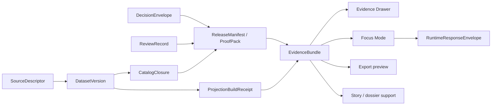

<!-- [KFM_META_BLOCK_V2]
doc_id: kfm://doc/TODO-VERIFY-UUID
title: schemas/contracts/v1/evidence
type: standard
version: v1
status: draft
owners: @bartytime4life
created: TODO-VERIFY-CREATED-DATE
updated: 2026-03-28
policy_label: TODO-VERIFY-POLICY-LABEL
related: [./evidence_bundle.schema.json, ../README.md, ../../README.md, ../../../README.md, ../../../../contracts/README.md, ../../../../policy/README.md, ../../../../tests/README.md, ../../../../.github/workflows/README.md, ../../../../docs/standards/README.md]
tags: [kfm, schemas, contracts, evidence, evidence-bundle]
notes: [Global CODEOWNERS fallback owner is visible on public main, current public schema body is placeholder {}, authoritative schema-home remains unresolved across adjacent docs]
[/KFM_META_BLOCK_V2] -->

# `schemas/contracts/v1/evidence`

Boundary README for the public `EvidenceBundle` contract family in the visible `schemas/contracts/v1/` lane.

> **Status:** experimental  
> **Owners:** `@bartytime4life` *(repo-wide fallback; narrower path ownership needs verification)*  
> **Repo fit:** `schemas/contracts/v1/evidence/`  
>      
> **Quick jump:** [Scope](#scope) · [Repo fit](#repo-fit) · [Accepted inputs](#accepted-inputs) · [Exclusions](#exclusions) · [Directory tree](#directory-tree) · [Quickstart](#quickstart) · [Diagram](#diagram) · [Field map](#evidencebundle-starter-field-map) · [Task list](#task-list--definition-of-done) · [FAQ](#faq) · [Appendix](#appendix)

> [!IMPORTANT]
> Current public main shows this family directory as real, but `./evidence_bundle.schema.json` is still a placeholder body. Treat this README as boundary truth and review guidance, not as proof that the bundle contract is already enforcement-ready.

> [!WARNING]
> Schema-home authority is still unresolved across adjacent docs. `schemas/contracts/v1/` is materially present, while other nearby docs still route some machine-contract readers toward root `contracts/`. Keep that tension visible until the repo resolves it explicitly.

## Scope

`evidence/` is the family boundary for `EvidenceBundle`: the request-time package that backs a claim, feature, story excerpt, export preview, or governed answer with inspectable support, lineage hints, preview policy, and audit linkage.

This README should answer four practical questions:

1. What belongs in an `EvidenceBundle`.
2. What belongs in adjacent contract families instead.
3. What the current repo visibly proves today.
4. What still needs verification before this lane can be called enforcement-ready.

## Repo fit

| Dimension | Value |
| --- | --- |
| Path | `schemas/contracts/v1/evidence/` |
| Local artifact | [`./evidence_bundle.schema.json`](./evidence_bundle.schema.json) |
| Upstream family doc | [`../README.md`](../README.md) |
| Boundary docs | [`../../README.md`](../../README.md) · [`../../../README.md`](../../../README.md) |
| Cross-repo-adjacent guidance | [`../../../../contracts/README.md`](../../../../contracts/README.md) · [`../../../../docs/standards/README.md`](../../../../docs/standards/README.md) |
| Downstream review surfaces | [`../../../../policy/README.md`](../../../../policy/README.md) · [`../../../../tests/README.md`](../../../../tests/README.md) · [`../../../../.github/workflows/README.md`](../../../../.github/workflows/README.md) |
| Closest sibling families | [`../source/README.md`](../source/README.md) · [`../data/README.md`](../data/README.md) · [`../policy/README.md`](../policy/README.md) · [`../release/README.md`](../release/README.md) · [`../runtime/README.md`](../runtime/README.md) · [`../correction/README.md`](../correction/README.md) · [`../common/README.md`](../common/README.md) |

### Current verified snapshot

Use KFM truth labels literally here: **CONFIRMED**, **INFERRED**, **PROPOSED**, **UNKNOWN**, **NEEDS VERIFICATION**.

| Item | Status | What the repo visibly shows |
| --- | --- | --- |
| Family directory exists on public `main` | **CONFIRMED** | `schemas/contracts/v1/evidence/` is present |
| Family README exists | **CONFIRMED** | `README.md` exists in this directory |
| Local schema file exists | **CONFIRMED** | `evidence_bundle.schema.json` is checked in here |
| Local schema body is implementation-ready | **CONFIRMED placeholder only** | Current checked-in body is still `{}` |
| Wider `schemas/contracts/v1/` lane exists | **CONFIRMED** | The parent lane is materially present with family subdirectories |
| Authoritative schema home is reconciled across docs | **NEEDS VERIFICATION** | Adjacent docs still show unresolved authority between `schemas/` and root `contracts/` |
| Merge-blocking workflow coverage for this family is proven from current public tree | **UNKNOWN** | Public `workflows/` remains documentary unless reverified elsewhere |
| Narrow path-specific ownership under `/schemas/` | **NEEDS VERIFICATION** | Repo-wide fallback owner is visible, narrower rules are not confirmed here |

## Accepted inputs

This directory is the right home for material that clarifies or constrains the **support package** itself.

| Accepted here | Why it belongs here |
| --- | --- |
| Evidence bundle field intent | Defines what an `EvidenceBundle` must carry |
| Family-local schema notes | Explains local contract scope without broad repo drift |
| Illustrative bundle examples | Helps reviewers reason about bundle shape before runtime integration |
| Preview-policy and audit-link expectations | These are part of the support package, not an afterthought |
| Links to transform receipts or dataset refs | `EvidenceBundle` is about resolved support, so these references matter |

## Exclusions

Keep this directory narrow. Putting too much here makes `EvidenceBundle` a bypass around other families.

| Do **not** put here | Put it here instead |
| --- | --- |
| Source intake contracts | [`../source/`](../source/README.md) |
| Authoritative dataset/version semantics | [`../data/`](../data/README.md) |
| Decision results, reason codes, obligation registries | [`../policy/`](../policy/README.md) |
| Release manifests or proof packs | [`../release/`](../release/README.md) |
| Runtime answer envelopes | [`../runtime/`](../runtime/README.md) |
| Correction lineage objects | [`../correction/`](../correction/README.md) |
| Shared headers or family-wide profile fragments | [`../common/`](../common/README.md) |
| Non-contract tutorials or wide standards commentary | [`../../../../docs/standards/`](../../../../docs/standards/README.md) or root docs |

## Directory tree

```text
schemas/contracts/v1/evidence/
├── README.md
└── evidence_bundle.schema.json
```

## Quickstart

Use this when you are reviewing or widening the family without pretending the lane is already complete.

```bash
# inspect the family itself
ls -la schemas/contracts/v1/evidence

# read the parent lane before changing local semantics
sed -n '1,220p' schemas/contracts/v1/README.md

# compare the adjacent authority surfaces that still need reconciliation
sed -n '1,220p' schemas/contracts/README.md
sed -n '1,220p' schemas/README.md
sed -n '1,220p' contracts/README.md

# inspect the current local schema body
cat schemas/contracts/v1/evidence/evidence_bundle.schema.json

# check whether tests/workflows now reference this family
grep -R "evidence_bundle" tests .github/workflows scripts tools 2>/dev/null || true
```

## Usage

### When to edit this README

Edit this README when one of these changes:

1. The bundle boundary changes.
2. Adjacent family ownership changes.
3. A review burden becomes explicit enough to document.
4. The repo resolves schema-home authority and this file needs to say so plainly.

### When to edit `evidence_bundle.schema.json`

Edit the local schema file only when the change is concrete enough to move with examples and validation.

That normally means:

1. The field has a clear contract purpose.
2. It does not belong more cleanly in `source/`, `data/`, `policy/`, `release/`, `runtime/`, or `correction/`.
3. At least one valid and one invalid example can be named.
4. The README, schema, and validation story move together.

### Safe review sequence

1. Re-open the parent lane README.
2. Re-open `schemas/README.md` and root `contracts/README.md`.
3. Decide whether the change is **local field shape**, **family boundary**, or **authority resolution**.
4. Change the smallest thing that makes the lane more explicit.
5. Leave unresolved repo-wide authority questions visible if they are still unresolved.

## Diagram

The diagram below is **doctrinal relationship guidance**, not proof that all links are already implemented on public `main`.



A useful reading rule: the bundle is **support** assembled from governed inputs; it is not the runtime answer itself and not the public release manifest.

## EvidenceBundle starter field map

The table below is a **PROPOSED starter map grounded in KFM doctrine**, not a claim that the current checked-in schema already enforces these keys.

| Starter key | Why it belongs in the bundle | Current repo-visible state |
| --- | --- | --- |
| `bundle_id` | Stable handle for the support package itself | Not yet encoded in current local `{}` schema |
| `source_basis` | Names what support set or release scope the bundle resolves from | Not yet encoded in current local `{}` schema |
| `dataset_refs` | Connects the bundle back to authoritative dataset or release objects | Not yet encoded in current local `{}` schema |
| `lineage_summary` | Keeps support trace readable without forcing consumers to reconstruct it ad hoc | Not yet encoded in current local `{}` schema |
| `preview_policy` | Tells trust surfaces what can be shown and how | Not yet encoded in current local `{}` schema |
| `transform_receipts` | Records the support-shaping transforms that matter for trust | Not yet encoded in current local `{}` schema |
| `rights_sensitivity_state` | Keeps policy mediation visible at point of use | Not yet encoded in current local `{}` schema |
| `audit_ref` | Links bundle resolution to a traceable audit path | Not yet encoded in current local `{}` schema |

## Adjacent family boundary map

Use this table to keep `evidence/` narrow.

| Family | Owns | `evidence/` should do instead |
| --- | --- | --- |
| `source/` | Source intake identity, cadence, rights posture, validation plan | Reference source contracts; do not duplicate intake law here |
| `data/` | Authoritative candidate or promoted subject sets | Point to dataset/version objects; do not redefine them |
| `policy/` | Machine-readable decisions, reasons, obligations, policy basis | Carry resulting policy state only as needed for support display |
| `release/` | Public-safe release assembly and proof | Reference release scope; do not become the release record |
| `runtime/` | Request-time answer/abstain/deny/error envelopes | Feed runtime trust surfaces; do not replace them |
| `correction/` | Supersession, replacement, narrowing, withdrawal | Carry affected support safely; do not own correction lineage |
| `common/` | Shared structural fragments or cross-family profiles | Reuse shared shapes once they exist; do not fork them locally |

## Task list & definition of done

### Task list

- [ ] Keep the current repo state honest: local schema body, authority drift, and workflow uncertainty should remain visible until resolved.
- [ ] Add at least one valid bundle example and one invalid bundle example when the local schema stops being `{}`.
- [ ] Add a deterministic validation path before claiming enforcement readiness.
- [ ] Reconcile cross-links if root `contracts/` and `schemas/contracts/v1/` authority changes.
- [ ] Keep downstream consumer language aligned with Evidence Drawer, Focus, export, and story/dossier support use.
- [ ] Update this README and the local schema together when bundle shape changes.

### Definition of done

| Gate | Done when |
| --- | --- |
| Structure | `evidence_bundle.schema.json` is either real or explicitly still placeholder without ambiguity |
| Examples | Valid/invalid fixtures exist and are reviewable |
| Validation | A deterministic command checks this family without manual interpretation |
| Cross-doc consistency | Parent and adjacent docs no longer contradict this README silently |
| Consumer clarity | Reviewers can tell what feeds Evidence Drawer, Focus, export, and story support without reading unrelated families |
| Truth posture | No sentence here implies mounted runtime or CI enforcement that the repo cannot currently prove |

## FAQ

### Why is this file under `schemas/contracts/v1/` instead of root `contracts/`?

Because this path is materially present on public `main`. The repo has not fully reconciled whether this lane or root `contracts/` is the final authority surface, so this README states the current visible path and keeps the broader authority question open.

### Does the existence of `evidence_bundle.schema.json` mean the bundle contract is ready?

No. A checked-in filename is not the same as an implemented contract. Right now the local schema body is still placeholder-only, so enforcement readiness would be an overclaim.

### How is `EvidenceBundle` different from `RuntimeResponseEnvelope`?

`EvidenceBundle` is the support package. `RuntimeResponseEnvelope` is the accountable runtime outcome. The bundle can feed Focus and other trust surfaces, but it does not replace the answer/abstain/deny/error envelope.

### Should raw or restricted material live directly inside the bundle?

By default, no. This family should describe or reference governed support in a policy-safe way. It should not become a shortcut around rights, sensitivity, or release-state controls.

[Back to top](#schemascontractsv1evidence)

## Appendix

<details>
<summary>Illustrative starter object (PROPOSED, not current schema)</summary>

```jsonc
{
  "bundle_id": "evidence:TODO",
  "source_basis": {
    "release_scope": ["rel:TODO"],
    "bundle_purpose": "claim|feature|story|export_preview|answer"
  },
  "dataset_refs": [
    {
      "dataset_id": "TODO",
      "version_id": "TODO"
    }
  ],
  "lineage_summary": {
    "raw_manifest": "TODO",
    "run_receipt": "TODO"
  },
  "preview_policy": {
    "surface_class": "TODO",
    "display_limits": []
  },
  "transform_receipts": [],
  "rights_sensitivity_state": {
    "policy_label": "TODO",
    "generalization": null
  },
  "audit_ref": "audit:TODO"
}
```

This appendix is intentionally conservative. It is a review aid for the family boundary, not a claim that the checked-in schema already uses these fields.

</details>

[Back to top](#schemascontractsv1evidence)
