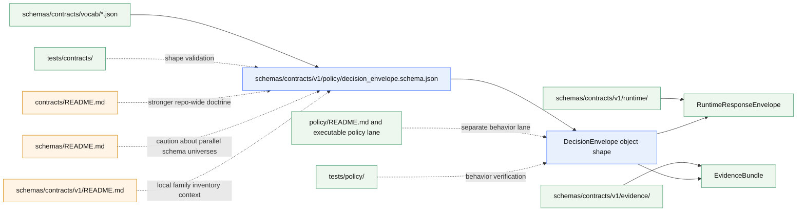

<!-- [KFM_META_BLOCK_V2]
doc_id: kfm://doc/NEEDS-VERIFICATION
title: schemas/contracts/v1/policy
type: standard
version: v1
status: draft
owners: @bartytime4life
created: YYYY-MM-DD
updated: 2026-03-28
policy_label: NEEDS-VERIFICATION
related: [../README.md, ../../README.md, ../../../README.md, ../../../../README.md, ../../../../contracts/README.md, ../../../../policy/README.md, ../../../../tests/contracts/README.md, ../../../../tests/policy/README.md, ../../../../tests/e2e/runtime_proof/README.md, ../../../../tests/e2e/correction/README.md, ../../../../.github/workflows/README.md, ../../vocab/README.md, ../../vocab/reason_codes.json, ../../vocab/obligation_codes.json, ../../vocab/reviewer_roles.json]
tags: [kfm, schemas, contracts, v1, policy]
notes: [Owner uses CODEOWNERS global fallback; doc_id and created date need verification; public main currently exposes this README plus decision_envelope.schema.json; schema-home authority remains unresolved and the checked-in schema body is still placeholder-only.]
[/KFM_META_BLOCK_V2] -->

# `schemas/contracts/v1/policy`

Family-level boundary and current-state guide for the schema-side policy contract lane, currently centered on `decision_envelope.schema.json`.

> [!IMPORTANT]
> This README is intentionally narrow. It should describe the **policy contract family lane** honestly, keep boundary lines clear, and avoid implying that checked-in schema placeholders, vocabulary placeholders, or workflow enforcement are already mature simply because the directories exist.

| Status | Owners | Path | Current role |
|---|---|---|---|
| experimental | `@bartytime4life` | `schemas/contracts/v1/policy/README.md` | Document the visible policy-family subtree without pretending canonical schema-home authority or enforcement maturity is already settled |


**Quick jumps:** [Scope](#scope) · [Repo fit](#repo-fit) · [Inputs](#inputs) · [Exclusions](#exclusions) · [Directory tree](#directory-tree) · [Quickstart](#quickstart) · [Usage](#usage) · [Diagram](#diagram) · [Contract minimum](#contract-minimum) · [Task list](#task-list) · [FAQ](#faq) · [Appendix](#appendix)

---

## Scope

This directory is the **schema-side family lane** for policy-shaped trust objects under `schemas/contracts/v1/`.

Today, that means this README should do four things well:

1. describe the currently visible family inventory,
2. keep the unresolved **schema-home authority** question visible,
3. explain what belongs here versus in adjacent policy, vocabulary, test, and workflow lanes,
4. preserve doctrinal minimums for the family **without** overstating current implementation maturity.

### What this lane is for

This lane is for the **shape** of policy-result objects.

In current public repo state, the direct family object is:

- `decision_envelope.schema.json`

That makes this folder the natural place to explain the policy-contract boundary around a machine-readable **DecisionEnvelope** while still acknowledging that the schema body currently remains placeholder-only.

### What this README should preserve

- the difference between **contract shape** and **policy execution**
- the difference between **DecisionEnvelope** and **ReviewRecord**
- the split between **local family files** and **shared vocabulary registries**
- the split between **schema files** and **verification artifacts**
- the split between **public inventory reality** and **target-state doctrine**

### Status vocabulary used here

| Label | Meaning in this README |
|---|---|
| **CONFIRMED** | Directly visible from the current public repo snapshot or strongly stated by nearby normative docs |
| **INFERRED** | Strongly implied by adjacent doctrine or neighboring directory contracts, but not proven as mounted implementation maturity |
| **PROPOSED** | Recommended next shape or documentation move |
| **UNKNOWN / NEEDS VERIFICATION** | Not strong enough to claim from current evidence |

[Back to top](#schemascontractsv1policy)

---

## Repo fit

### Path and neighborhood

| Item | Value |
|---|---|
| **This file** | `schemas/contracts/v1/policy/README.md` |
| **Directory audience** | Maintainers shaping policy-related contract families, reviewers reconciling schema-home authority, and contributors trying not to blur schema, policy, vocab, and test responsibilities |
| **Immediate parent** | [`../README.md`](../README.md) |
| **Upstream context** | [`../../README.md`](../../README.md) · [`../../../README.md`](../../../README.md) · [`../../../../README.md`](../../../../README.md) · [`../../../../contracts/README.md`](../../../../contracts/README.md) · [`../../../../docs/standards/README.md`](../../../../docs/standards/README.md) |
| **Adjacent governed areas** | [`../../vocab/README.md`](../../vocab/README.md) · [`../../vocab/reason_codes.json`](../../vocab/reason_codes.json) · [`../../vocab/obligation_codes.json`](../../vocab/obligation_codes.json) · [`../../vocab/reviewer_roles.json`](../../vocab/reviewer_roles.json) · [`../../../../policy/README.md`](../../../../policy/README.md) |
| **Adjacent verification lanes** | [`../../../../tests/contracts/README.md`](../../../../tests/contracts/README.md) · [`../../../../tests/policy/README.md`](../../../../tests/policy/README.md) · [`../../../../tests/e2e/runtime_proof/README.md`](../../../../tests/e2e/runtime_proof/README.md) · [`../../../../tests/e2e/correction/README.md`](../../../../tests/e2e/correction/README.md) · [`../../../../.github/workflows/README.md`](../../../../.github/workflows/README.md) |

### Upstream / downstream reading order

Read upward first, then back down:

1. root repo posture in [`../../../../README.md`](../../../../README.md)
2. repo-level contract doctrine in [`../../../../contracts/README.md`](../../../../contracts/README.md)
3. repo-level schema caution in [`../../../README.md`](../../../README.md)
4. subtree contract index in [`../../README.md`](../../README.md)
5. versioned family overview in [`../README.md`](../README.md)
6. this family README
7. shared registries in [`../../vocab/README.md`](../../vocab/README.md)
8. verification lanes in `tests/contracts/`, `tests/policy/`, and `tests/e2e/`

### Why this lane exists

The policy family is narrow because the repo already distinguishes between:

- **shape** of trust-bearing objects,
- **shared codes** those objects reference,
- **behavior** of policy decisions,
- **runtime outcomes** that consume policy decisions,
- **review artifacts** that capture human approval or denial.

That separation is the point. It keeps policy doctrine operational instead of collapsing everything into one ambiguous “policy” folder.

[Back to top](#schemascontractsv1policy)

---

## Inputs

### Accepted inputs

| Accepted here | Why it belongs here |
|---|---|
| Family README updates | Documents the current subtree truthfully |
| `decision_envelope.schema.json` updates | This is the current local machine-readable family file |
| Notes that clarify links to shared vocabularies | The schema should reference shared reason / obligation / reviewer code families without duplicating them |
| Family-level authority notes | This lane needs explicit handling of `schemas/` vs `contracts/` tension |
| Clearly labeled illustrative examples | Useful when kept subordinate to actual checked-in schema state |

### Minimum bar for additions

Anything added here should satisfy all of the following:

- it governs the **shape** of a policy-result object,
- it does **not** smuggle executable rule logic into the schema lane,
- it keeps `audit_ref`, time basis, and review implications explicit,
- it points readers to verification lanes instead of pretending validation already exists,
- it does not silently collapse separate doctrinal families into one file.

### Likely future family inputs

These are plausible here **only after** higher-level docs are reconciled:

- substantive `DecisionEnvelope` schema content,
- example payloads tied to fixtures,
- local notes about schema evolution for policy-result objects,
- cross-links to release, correction, runtime, and review families once those lanes are equally mature.

[Back to top](#schemascontractsv1policy)

---

## Exclusions

### What does **not** belong here

| Excluded from this folder | Put it here instead |
|---|---|
| Executable policy bundles, Rego, deny/allow logic, admission rules | [`../../../../policy/`](../../../../policy/) |
| Shared reason / obligation / reviewer registries | [`../../vocab/`](../../vocab/) |
| Fixtures, valid/invalid samples, harnesses, shape tests | [`../../../../tests/contracts/`](../../../../tests/contracts/) |
| Policy behavior tests | [`../../../../tests/policy/`](../../../../tests/policy/) |
| Runtime answer / abstain / deny / error proof flows | [`../../../../tests/e2e/runtime_proof/`](../../../../tests/e2e/runtime_proof/) |
| Correction drills and visible lineage tests | [`../../../../tests/e2e/correction/`](../../../../tests/e2e/correction/) |
| Workflow YAML merge gates | [`../../../../.github/workflows/`](../../../../.github/workflows/) |
| Runtime response contracts | sibling runtime family under [`../runtime/`](../runtime/) |
| Release manifests, proof packs, correction notices | sibling release / correction families |

> [!CAUTION]
> A `DecisionEnvelope` is **not** the same thing as the whole policy lane. This folder should describe the contract family for a machine-readable policy result, not become a dumping ground for rules, fixtures, reviews, release proofs, or runtime behavior.

[Back to top](#schemascontractsv1policy)

---

## Current verified snapshot

### What is directly visible right now

| Observation | Status | Notes |
|---|---|---|
| `schemas/contracts/v1/policy/` directory exists | **CONFIRMED** | Public branch-visible family lane |
| `README.md` exists in this folder | **CONFIRMED** | Current checked-in body is still scaffold-thin |
| `decision_envelope.schema.json` exists | **CONFIRMED** | Present in public tree |
| Current raw schema body is `{}` | **CONFIRMED** | Placeholder-only at time of inspection |
| Shared vocab JSON files exist under `schemas/contracts/vocab/` | **CONFIRMED** | `reason_codes.json`, `obligation_codes.json`, `reviewer_roles.json` all visible |
| Current raw vocab bodies are `{}` | **CONFIRMED** | Registry lane exists, content still placeholder-only |
| `tests/contracts/README.md` exists | **CONFIRMED** | Verification lane documented |
| `tests/policy/README.md` exists | **CONFIRMED** | Policy-behavior lane documented |
| `.github/workflows/README.md` exists | **CONFIRMED** | Public workflow tree currently exposes README-only |
| Canonical schema-home decision is settled | **UNKNOWN** | Public docs still show tension between `contracts/` and `schemas/` |
| Family-specific fixtures / validators are present here | **UNKNOWN** | Not directly evidenced in current public tree |

### Cross-doc tension this README must handle

| Nearby document | What it implies for this family |
|---|---|
| `../README.md` | This family is part of the visible first-wave `schemas/contracts/v1/` tree |
| `../../README.md` | `schemas/contracts/` is now materially real on public `main`, but authority is still unresolved |
| `../../../README.md` | `schemas/` remains cautionary and warns against parallel schema universes |
| `../../../../contracts/README.md` | Repo-wide contract doctrine still leans toward `contracts/` as the stronger authority lane |
| `../../../../policy/README.md` | Executable policy, deny-by-default posture, reason/obligation logic, and finite outcomes belong there |
| `../../vocab/README.md` | Shared policy registries live adjacent to this family, not inside it |
| `../../../../tests/contracts/README.md` | Shape validation belongs in tests, not in the schema folder |
| `../../../../tests/policy/README.md` | Behavior verification belongs in policy tests, not in this folder |

### Working interpretation

For now, this README should behave as a **family index plus boundary guardrail**:

- strong on current inventory,
- strong on exclusions,
- strong on doctrine-backed minimums,
- modest about maturity,
- explicit about unresolved authority.

[Back to top](#schemascontractsv1policy)

---

## Directory tree

### Current public family snapshot

```text
schemas/contracts/v1/policy/
├── README.md
└── decision_envelope.schema.json   # current raw body: {}
```

### Immediate surrounding context

```text
schemas/contracts/
├── README.md
├── v1/
│   ├── README.md
│   ├── common/
│   ├── correction/
│   ├── data/
│   ├── evidence/
│   ├── policy/
│   ├── release/
│   ├── runtime/
│   └── source/
└── vocab/
    ├── README.md
    ├── obligation_codes.json       # current raw body: {}
    ├── reason_codes.json           # current raw body: {}
    └── reviewer_roles.json         # current raw body: {}
```

### Reading rule for the tree

- Tree presence is **inventory evidence**, not enforcement proof.
- Placeholder bodies matter.
- Family docs should keep readers from mistaking visible directories for completed contract implementation.

[Back to top](#schemascontractsv1policy)

---

## Quickstart

### Inspect the family as it exists

```bash
# Family inventory
ls -la schemas/contracts/v1/policy

# Current schema body
cat schemas/contracts/v1/policy/decision_envelope.schema.json

# Read the local family context first
sed -n '1,220p' schemas/contracts/v1/README.md
sed -n '1,220p' schemas/contracts/README.md
sed -n '1,220p' schemas/README.md

# Read adjacent shared registries
sed -n '1,220p' schemas/contracts/vocab/README.md
cat schemas/contracts/vocab/reason_codes.json
cat schemas/contracts/vocab/obligation_codes.json
cat schemas/contracts/vocab/reviewer_roles.json

# Read verification and workflow lanes
sed -n '1,220p' tests/contracts/README.md
sed -n '1,220p' tests/policy/README.md
sed -n '1,220p' .github/workflows/README.md
```

### Safe review sequence

1. confirm what files are actually present,
2. inspect raw JSON bodies before making maturity claims,
3. check parent docs for authority signals,
4. check test/workflow docs before mentioning enforcement,
5. only then update this README.

> [!TIP]
> When in doubt, keep this README stronger on **boundaries** than on **promises**.

[Back to top](#schemascontractsv1policy)

---

## Usage

### Recommended use right now

Use this README as:

- the **entry point** for the policy schema family,
- the **warning surface** against schema-home drift,
- the **contributor checkpoint** before editing `decision_envelope.schema.json`,
- the **cross-link hub** to vocab, policy, tests, and workflows.

### Update rules

When editing this file:

- preserve relative links,
- keep uncertainty labels explicit,
- describe the visible tree first,
- separate **doctrinal minimum** from **current checked-in body**,
- update exclusions whenever adjacent lanes become clearer.

### When this README should get stronger

Strengthen this README when one or more of the following become true:

- `decision_envelope.schema.json` gains substantive structure,
- shared vocab registries stop being `{}`,
- fixture-backed contract validation appears in `tests/contracts/`,
- behavior-backed policy verification appears in `tests/policy/`,
- workflow YAML turns validation into a merge gate,
- repo docs explicitly settle canonical schema-home authority.

### DecisionEnvelope vs ReviewRecord

| Object family | Job | Why the split matters |
|---|---|---|
| **DecisionEnvelope** | Machine-readable policy result | Captures subject, action, lane, result, reason/obligation codes, policy basis, audit reference, and effective window |
| **ReviewRecord** | Human approval / denial / escalation / note | Captures reviewer role, timestamp, refs, and comments; doctrinally separate even when often adjacent |

That split should remain visible here. Do not quietly absorb `ReviewRecord` semantics into `DecisionEnvelope` just because both belong to policy-bearing trust flows.

[Back to top](#schemascontractsv1policy)

---

## Diagram



### Reading the diagram

The policy family does not stand alone. It sits between:

- **upstream authority docs**,
- **shared vocab registries**,
- **shape validation**,
- **behavior validation**,
- **runtime and evidence families** that consume policy results.

That dependency shape is exactly why this README must stay boundary-conscious.

[Back to top](#schemascontractsv1policy)

---

## Contract minimum

### Doctrine-backed minimum for this family

| Family object | Current file state | Doctrine-backed minimum purpose | Must eventually include at least |
|---|---|---|---|
| `DecisionEnvelope` | Present, placeholder-only | Express a policy result machine-readably | `subject`, `action`, `lane`, `result`, `reason_codes`, `obligation_codes`, `policy_basis`, `audit_ref`, `effective_window` |
| `ReviewRecord` | Not present in this folder | Capture human approval, denial, escalation, or note | `reviewer_role`, `decision`, `timestamp`, `refs`, `comments` |

### Why this minimum matters

A policy-bearing contract object is not useful if it cannot answer:

- what subject was evaluated,
- what action was at stake,
- what lane or burden applied,
- what the result was,
- why that result happened,
- what obligations were attached,
- what audit reference reconstructs the decision,
- when the decision was effective.

### Current caution

The checked-in `decision_envelope.schema.json` body is still `{}` in the public snapshot this README is based on.

That means this README should present the table above as **doctrinal minimum** and **future contract expectation**, not as checked-in implementation maturity.

[Back to top](#schemascontractsv1policy)

---

## Task list

### Definition of done for this README

- [ ] Title and one-line purpose match the folder’s actual role
- [ ] Top-of-file impact block is present
- [ ] Meta block is present and unresolved values stay visibly reviewable
- [ ] Current family contents are described honestly
- [ ] `decision_envelope.schema.json` presence is noted
- [ ] Placeholder-only current body is called out when still true
- [ ] Shared vocab, executable policy, tests, and workflows are clearly separated
- [ ] Relative links resolve from this directory
- [ ] Tree reflects the current public snapshot
- [ ] Doctrinal minimum is separated from implementation status
- [ ] `ReviewRecord` is not silently conflated with `DecisionEnvelope`
- [ ] No unsupported claim implies live merge-blocking, populated registries, or executable policy maturity

### Maintainer review gates

| Gate | Question |
|---|---|
| **Truth gate** | Does every claim about current repo state match visible files? |
| **Boundary gate** | Does the file keep schema, vocab, policy, tests, and workflow responsibilities distinct? |
| **Inventory gate** | Does the tree match the public branch snapshot? |
| **Doctrine gate** | Are policy-result minimums preserved without overstating current implementation? |
| **Drift gate** | Would a new contributor know where **not** to put executable policy or fixtures? |

[Back to top](#schemascontractsv1policy)

---

## FAQ

### Is `schemas/contracts/v1/policy/` the canonical repo-wide policy schema home?

**UNKNOWN / NEEDS VERIFICATION.**  
This subtree is materially present on public `main`, but higher-level docs still preserve an unresolved authority split between `contracts/` and `schemas/`.

### Does executable policy live here?

No. Executable policy belongs in [`../../../../policy/`](../../../../policy/).

### Why does this README call out `{}` bodies so directly?

Because visible directories are not the same thing as mature trust artifacts. Placeholder bodies need to stay explicit to avoid trust theater.

### Where do shared reason / obligation / reviewer code registries live?

Currently in [`../../vocab/`](../../vocab/), not in this family directory.

### Is `ReviewRecord` part of this folder?

Not in the currently visible public snapshot. This folder presently shows only `README.md` and `decision_envelope.schema.json`.

### When should I edit this file instead of a higher-level README?

Edit this file when the change is about:

- the **local policy family lane**,
- the local tree,
- family-specific boundaries,
- how this folder relates to shared registries and tests.

Start higher when the change is really about repo-wide doctrine, schema-home authority, or cross-family contract law.

[Back to top](#schemascontractsv1policy)

---

## Appendix

<details>
<summary><strong>Observed public files in and around this family</strong></summary>

### Directly in this lane

- `schemas/contracts/v1/policy/README.md`
- `schemas/contracts/v1/policy/decision_envelope.schema.json`

### Immediate machine-readable neighbors

- `schemas/contracts/vocab/reason_codes.json`
- `schemas/contracts/vocab/obligation_codes.json`
- `schemas/contracts/vocab/reviewer_roles.json`

### Adjacent docs controlling interpretation

- `schemas/contracts/v1/README.md`
- `schemas/contracts/README.md`
- `schemas/README.md`
- `contracts/README.md`
- `policy/README.md`
- `tests/contracts/README.md`
- `tests/policy/README.md`
- `.github/workflows/README.md`

</details>

<details>
<summary><strong>Illustrative starter shape for <code>DecisionEnvelope</code> (PROPOSED only)</strong></summary>

```json
{
  "subject": "dataset://example",
  "action": "publish",
  "lane": "hydrology",
  "result": "deny",
  "reason_codes": ["rights.unknown"],
  "obligation_codes": ["steward.review_required"],
  "policy_basis": ["policy://example/bundle/v1"],
  "audit_ref": "audit://example/123",
  "effective_window": {
    "start": "2026-03-28T00:00:00Z",
    "end": null
  }
}
```

This example is **illustrative only**. It is here to show the family boundary and doctrinal minimum, not to claim the checked-in schema already validates this shape.

</details>

<details>
<summary><strong>Contributor checklist before editing a trust-bearing policy family</strong></summary>

1. Read `contracts/README.md`, `schemas/README.md`, and `schemas/contracts/v1/README.md`.
2. Inspect the raw JSON file body before making maturity claims.
3. Check whether related vocab files remain placeholders.
4. Check `tests/contracts/README.md` and `tests/policy/README.md` before discussing validation.
5. Check `.github/workflows/README.md` before mentioning merge gates.
6. Keep `DecisionEnvelope` and `ReviewRecord` distinct unless a higher-level contract decision explicitly merges them.

</details>

---

This README should remain intentionally honest: useful now, stronger later, and never more certain than the repo evidence allows.
