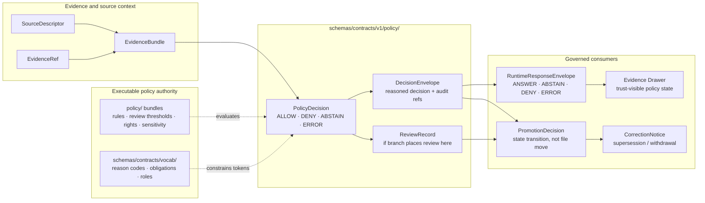

<!-- [KFM_META_BLOCK_V2]
doc_id: kfm://doc/TODO-VERIFY-UUID
title: policy
type: standard
version: v1
status: draft
owners: <TODO-VERIFY-SCHEMAS-OWNER>
created: <TODO-VERIFY-CREATED-DATE>
updated: 2026-04-23
policy_label: <TODO-VERIFY-POLICY-LABEL>
related: [../README.md, ../../README.md, ../../../README.md, ../../vocab/README.md, ../../../../contracts/README.md, ../../../../policy/README.md, ../../../../tests/contracts/README.md, ../../../../tests/policy/README.md, ../../../../docs/standards/README.md, ../../../../.github/workflows/README.md]
tags: [kfm, schemas, contracts, policy, governance, policy-decision, decision-envelope, obligations, review]
notes: [Target path supplied for schemas/contracts/v1/policy/README.md; doc_id, owner, created date, policy label, exact companion schema inventory, schema-home authority, and workflow enforcement remain NEEDS VERIFICATION before merge.]
[/KFM_META_BLOCK_V2] -->

<a id="top"></a>

# `policy`

Schema-side contract lane for policy decision objects, finite governance outcomes, reason codes, obligations, and review-bearing policy state under `schemas/contracts/v1/`.

> [!IMPORTANT]
> **Status:** experimental  
> **Document status:** draft  
> **Owners:** `<TODO-VERIFY-SCHEMAS-OWNER>`  
> **Path:** `schemas/contracts/v1/policy/README.md`  
> **Repo fit:** child lane of [`../README.md`](../README.md) inside the `schemas/contracts/v1/` contract-family split; adjacent to [`../runtime/`](../runtime/), [`../evidence/`](../evidence/), [`../release/`](../release/), [`../correction/`](../correction/), [`../source/`](../source/), and [`../data/`](../data/); upstream from policy contract fixtures and validators; downstream from root policy law in [`../../../../policy/README.md`](../../../../policy/README.md).  
> **Quick jumps:** [Scope](#scope) · [Repo fit](#repo-fit) · [Inputs](#accepted-inputs) · [Exclusions](#exclusions) · [Directory tree](#directory-tree) · [Usage](#usage) · [Diagram](#diagram) · [Tables](#tables) · [Definition of done](#definition-of-done) · [FAQ](#faq) · [Appendix](#appendix)

<div align="left">


</div>

> [!NOTE]
> This README explains the **shape boundary** for policy-facing contract objects. It does not define executable policy law by itself. Allow/deny/restrict behavior belongs in the root [`policy/`](../../../../policy/README.md) lane and its checked policy bundles.

---

## Scope

`schemas/contracts/v1/policy/` is the machine-contract family for policy-bearing objects that must remain inspectable, finite, and linkable across KFM’s governed flow.

This lane should help answer:

- What did policy decide?
- Why did it decide that?
- Which reason codes and obligations were emitted?
- Which policy package and version were used?
- Which evidence, source, runtime, review, receipt, or release object does the decision affect?
- Can downstream runtime, review, promotion, correction, and Evidence Drawer surfaces consume the result without free-text drift?

### Operating posture

| Claim | Status | Working rule |
|---|---:|---|
| KFM policy decisions must be finite and reason-bearing. | **CONFIRMED doctrine** | Policy result objects should not allow open-ended outcome strings. |
| Policy schemas are shape contracts, not policy engines. | **CONFIRMED doctrine** | Keep rule execution in `policy/`, validators, or runtime policy packages. |
| The exact checked-in inventory for this directory needs branch verification. | **NEEDS VERIFICATION** | Do not claim companion schemas exist until the active checkout proves them. |
| `schemas/contracts/v1/` is the current proposed machine-contract home. | **PROPOSED / NEEDS VERIFICATION** | Respect the branch’s schema-home ADR or create one before broadening this lane. |

[Back to top](#top)

---

## Repo fit

### Upstream and sibling surfaces

| Surface | Relationship to this lane |
|---|---|
| [`../README.md`](../README.md) | Parent `v1` contract-family index. |
| [`../../README.md`](../../README.md) | Broader `schemas/contracts/` boundary and schema-home context. |
| [`../../../README.md`](../../../README.md) | Root schema authority surface. |
| [`../../vocab/README.md`](../../vocab/README.md) | Shared reason-code, obligation-code, and reviewer-role vocabulary if present on branch. |
| [`../../../../contracts/README.md`](../../../../contracts/README.md) | Human-readable contract law and field semantics. |
| [`../../../../policy/README.md`](../../../../policy/README.md) | Executable or data-backed policy authority: deny-by-default behavior, rules, bundles, and obligations. |
| [`../../../../tests/contracts/README.md`](../../../../tests/contracts/README.md) | Contract shape tests and valid/invalid fixture proof. |
| [`../../../../tests/policy/README.md`](../../../../tests/policy/README.md) | Policy behavior tests and finite decision grammar checks. |
| [`../../../../docs/standards/README.md`](../../../../docs/standards/README.md) | Cross-cutting documentation and schema standards. |
| [`../../../../.github/workflows/README.md`](../../../../.github/workflows/README.md) | CI and workflow documentation; not proof of active merge gates by itself. |

### Downstream consumers

Policy schema objects may be consumed by:

- governed API envelopes
- runtime `ANSWER` / `ABSTAIN` / `DENY` / `ERROR` responses
- Evidence Drawer payloads
- Focus Mode negative states
- promotion decisions
- review records
- correction notices
- run receipts and proof summaries
- CI reviewer summaries

> [!CAUTION]
> Do not let this directory become a second policy tree. Schema validity can prove that a policy result is well-shaped; it cannot prove that the result is safe, lawful, reviewed, or publishable.

[Back to top](#top)

---

## Accepted inputs

Use this directory for small, versioned, machine-readable contract files that define policy-facing object shape.

| Belongs here | Examples | Why |
|---|---|---|
| Policy decision schemas | `policy_decision.schema.json` | Captures finite policy result shape, reason codes, obligations, policy package/version, and references. |
| Decision envelope schemas, if the branch places them here | `decision_envelope.schema.json` | Bridges policy posture into machine-readable governed decisions. |
| Review-bearing policy state schemas, if not housed in a governance lane | `review_record.schema.json` | Preserves approval, rejection, hold, reviewer role, and review evidence shape. |
| Policy-adjacent examples kept only as schema examples | `examples/*.json` or fixture pointers | Helps reviewers understand shape without becoming policy law. |
| README notes about schema-home ambiguity | this file | Prevents accidental duplicate authority between `contracts/` and `schemas/`. |

### Candidate companion schemas

The following names are **candidate local companions**, not confirmed inventory:

| Candidate | Status | Placement note |
|---|---:|---|
| `policy_decision.schema.json` | **PROPOSED / NEEDS VERIFICATION** | Strongest local fit for this lane. |
| `decision_envelope.schema.json` | **PROPOSED / NEEDS VERIFICATION** | Place here only if branch convention does not house it under `runtime/` or governance. |
| `review_record.schema.json` | **INFERRED / NEEDS VERIFICATION** | Review-bearing object may belong here or in a governance/release lane. |
| `trust_state.schema.json` | **PROPOSED elsewhere / NEEDS VERIFICATION** | Often better housed under `../runtime/` because UI badges and Evidence Drawer consume it. |

[Back to top](#top)

---

## Exclusions

| Does **not** belong here | Put it here instead |
|---|---|
| Rego rules, policy bundles, decision tables, or executable policy logic | [`../../../../policy/`](../../../../policy/README.md) |
| Policy behavior tests | [`../../../../tests/policy/`](../../../../tests/policy/README.md) |
| Contract conformance tests and valid/invalid fixture runners | [`../../../../tests/contracts/`](../../../../tests/contracts/README.md) |
| Root human-readable policy doctrine | [`../../../../policy/README.md`](../../../../policy/README.md), `docs/governance/**`, or `contracts/**` |
| Runtime response envelopes | [`../runtime/`](../runtime/) |
| Evidence payloads and evidence-bundle schemas | [`../evidence/`](../evidence/) |
| Release manifests, proof packs, or rollback release state | [`../release/`](../release/) and release/proof lanes |
| Correction and supersession notices | [`../correction/`](../correction/) |
| Source descriptors and source-role authority | [`../source/`](../source/) and source registry lanes |
| Secrets, credentials, steward-only decisions, or hidden overrides | Nowhere in normal schema flow; use governed secret custody and review process if required. |

[Back to top](#top)

---

## Directory tree

Current inventory must be verified from the active branch. The tree below is the expected minimum shape if this lane owns local policy contracts.

```text
schemas/contracts/v1/policy/
├── README.md                         # this guide
├── policy_decision.schema.json        # PROPOSED / NEEDS VERIFICATION
├── decision_envelope.schema.json      # PROPOSED only if branch places it here
├── review_record.schema.json          # INFERRED / NEEDS VERIFICATION
└── examples/                          # OPTIONAL; do not duplicate fixture authority
    ├── policy_decision.allow.json      # illustrative only unless tested
    ├── policy_decision.deny.json
    └── policy_decision.abstain.json
```

Preferred fixture homes should remain explicit and branch-driven:

```text
schemas/tests/fixtures/contracts/v1/policy/   # schema-side examples if this exists
tests/contracts/fixtures/policy/              # root contract-verification examples if this exists
tests/policy/fixtures/                        # behavior fixtures for policy rules
```

> [!WARNING]
> Fixture files should not silently become policy authority. They prove examples and regressions; they do not decide publication safety.

[Back to top](#top)

---

## Usage

### Safe inspection

Run these from the repository root before editing the lane.

```bash
# Confirm the target lane and adjacent family split.
find schemas/contracts/v1 -maxdepth 2 -type f | sort

# Inspect local policy schema files without assuming they exist.
find schemas/contracts/v1/policy -maxdepth 2 -type f 2>/dev/null | sort || true

# Locate policy-bearing schema names across the active checkout.
find schemas contracts tests policy tools docs -type f 2>/dev/null \
  | grep -E '(policy_decision|decision_envelope|review_record|trust_state|reason_codes|obligation_codes|reviewer_roles)' \
  | sort || true
```

### Drift check before introducing a new object

```bash
grep -RIn \
  -e 'PolicyDecision' \
  -e 'DecisionEnvelope' \
  -e 'ReviewRecord' \
  -e 'TrustState' \
  -e 'reason_codes' \
  -e 'obligation_codes' \
  -e 'ALLOW' \
  -e 'DENY' \
  -e 'ABSTAIN' \
  -e 'ERROR' \
  contracts schemas policy tests tools docs .github 2>/dev/null || true
```

### Authoring rule

When adding or revising a schema here:

1. Confirm the canonical schema home.
2. Confirm whether shared vocab exists in `schemas/contracts/vocab/`.
3. Link to policy law in `policy/`; do not restate it as schema truth.
4. Add or update valid and invalid fixtures.
5. Add a negative case for unsupported outcome values.
6. Add a negative case for missing reason or obligation structure.
7. Record any breaking change as a `v2` candidate or ADR-backed exception.

[Back to top](#top)

---

## Diagram



Above: this lane names the policy contract shape between admissible evidence and governed consumers. It does not replace source authority, evidence bundles, executable policy, runtime envelopes, review gates, or release proof.

[Back to top](#top)

---

## Tables

### Contract-family map

| Object family | Role | Typical required field families | Upstream | Downstream | Status |
|---|---|---|---|---|---|
| `PolicyDecision` | Standalone policy result object. | version, identity/ref, finite decision, reason code(s), obligations, policy package/version, audit/evidence refs. | source context, evidence context, runtime request, policy bundle. | `DecisionEnvelope`, `RuntimeResponseEnvelope`, run receipt, review surface. | **PROPOSED local schema / CONFIRMED doctrine** |
| `DecisionEnvelope` | Machine-readable governance decision wrapper. | outcome, reasons, obligations, basis refs, actor/reviewer/audit refs, scope. | `PolicyDecision`, validator reports, review thresholds. | promotion, runtime, correction, reviewer handoff. | **CONFIRMED concept / path NEEDS VERIFICATION** |
| `ReviewRecord` | Review-bearing approval/rejection/hold trace. | reviewer role, review state, decision ref, timestamp, reason, evidence/audit refs. | policy decision, release candidate, steward review. | `PromotionDecision`, proof pack, release notes. | **INFERRED / NEEDS VERIFICATION** |
| `TrustState` | Human/machine trust status consumed by UI. | freshness, review state, source authority, rights, sensitivity, policy label, correction state. | `PolicyDecision`, catalog matrix, source authority. | Evidence Drawer, map badges, Focus Mode. | **PROPOSED adjacent runtime object** |

### Finite outcome grammar

| Layer | Allowed outcome style | Notes |
|---|---|---|
| Policy decision | `ALLOW`, `DENY`, `ABSTAIN`, `ERROR` | Policy result grammar. |
| Runtime response | `ANSWER`, `ABSTAIN`, `DENY`, `ERROR` | User-facing response grammar; downstream of policy. |
| Promotion decision | branch-defined finite promotion states | Must remain a governed state transition, not a file move. |
| Review state | branch-defined finite review states | Should use shared reviewer-role and review-state vocab where present. |

### Failure cases this lane should make easy to test

| Failure | Expected posture |
|---|---|
| Missing reason code | schema invalid or validator failure |
| Unsupported decision token | schema invalid or fail-closed policy result |
| Missing obligation list when obligations are required | schema invalid or review-required |
| Unknown policy package or version | deny, abstain, or error depending on policy law |
| Unknown rights or sensitivity posture | deny or review-required; never silent allow |
| Missing audit or evidence reference for consequential decision | abstain, deny, or review-required |
| Duplicate inline reason-code enums outside vocab | drift finding or review block |

[Back to top](#top)

---

## Definition of done

A change to this lane is reviewable when all applicable checks are true:

- [ ] KFM Meta Block V2 placeholders are resolved or explicitly left with review notes.
- [ ] Exact owner and policy label are verified from repo governance records.
- [ ] Schema-home authority between `contracts/` and `schemas/contracts/` is resolved or documented as an ADR-bound open issue.
- [ ] New policy-bearing schema files use the repo’s established JSON Schema draft and `$id` convention.
- [ ] `reason_codes`, `obligation_codes`, and reviewer roles reuse shared vocab where the branch provides it.
- [ ] Each schema has at least one valid and one invalid fixture in the repo-approved fixture home.
- [ ] Unsupported outcome values fail.
- [ ] Missing reason and obligation structure fails.
- [ ] Policy behavior tests remain in `tests/policy/`, not hidden in schema tests.
- [ ] Contract shape tests remain in `tests/contracts/` or the repo-approved schema fixture lane.
- [ ] Runtime, release, review, correction, and Evidence Drawer docs are updated when downstream payload shape changes.
- [ ] No README text claims CI enforcement, branch protection, runtime behavior, or publication readiness without direct proof.

[Back to top](#top)

---

## FAQ

### Is this directory the policy engine?

No. This directory defines policy-facing **object shapes**. The policy engine, bundles, executable rules, and denial/review behavior belong in [`../../../../policy/`](../../../../policy/README.md) and the runtime/validator lanes that consume it.

### Can a valid `PolicyDecision` schema allow publication?

No. Schema validity only means the object is well-shaped. Publication requires evidence resolution, source-role checks, rights and sensitivity checks, review thresholds, catalog/proof closure, and a governed promotion decision.

### Should `DecisionEnvelope` live here?

Only if the branch’s schema-home law places it here. KFM materials also associate `DecisionEnvelope` with runtime/governance/promotion surfaces. Avoid duplicate schemas; use one canonical location and link to it.

### What should happen when rights or sensitivity are unknown?

Fail closed. Unknown rights, unresolved sensitivity, missing source role, or missing review state should produce denial, abstention, quarantine, or review-required posture according to root policy law.

### Why keep reason and obligation vocab separate?

Because reason and obligation tokens are shared across validators, policy bundles, runtime envelopes, reviewer summaries, and UI trust states. Free-text drift makes audits weaker and makes downstream comparison unreliable.

[Back to top](#top)

---

## Appendix

<details>
<summary>Illustrative `PolicyDecision` example — not implementation proof</summary>

```json
{
  "version": "v1",
  "run_id": "run-example-001",
  "spec_hash": "aaaaaaaaaaaaaaaaaaaaaaaaaaaaaaaaaaaaaaaaaaaaaaaaaaaaaaaaaaaaaaaa",
  "decision": "DENY",
  "reason_code": "RIGHTS_POSTURE_UNKNOWN",
  "reason": "The candidate output cannot be released because its rights posture is unresolved.",
  "obligations": [
    "SUPPLY_RIGHTS_REVIEW"
  ],
  "policy_package": "kfm://policy/package/public-release",
  "policy_version": "2026-04-23",
  "input_ref": "kfm://input/example",
  "audit_ref": "kfm://receipt/run-example-001"
}
```

Use this as a review aid only. The active schema may use `outcome`, `reason_codes`, `obligation_codes`, or another branch-approved field spelling. Do not copy this example into fixtures until the schema is verified.

</details>

<details>
<summary>Reviewer checklist for path and authority verification</summary>

| Check | Expected result |
|---|---|
| `schemas/contracts/v1/policy/` exists | CONFIRMED before merge |
| `policy_decision.schema.json` exists or is added intentionally | CONFIRMED or PROPOSED in PR |
| `DecisionEnvelope` canonical home is not duplicated | CONFIRMED |
| shared vocab path is verified | CONFIRMED or NEEDS VERIFICATION |
| root `policy/README.md` is linked | CONFIRMED |
| `tests/policy/` behavior tests are separate | CONFIRMED |
| `tests/contracts/` or schema-side fixtures cover shape | CONFIRMED |
| CI workflow references are verified as checked-in files, not assumed from docs | CONFIRMED before enforcement claims |
| branch protection / merge-blocking claims are avoided unless proven | CONFIRMED |

</details>

[Back to top](#top)
