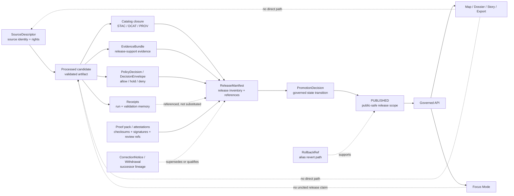

<!-- [KFM_META_BLOCK_V2]
doc_id: kfm://doc/TODO-NEEDS-VERIFICATION
title: release
type: standard
version: v1
status: draft
owners: @bartytime4life
created: TODO-NEEDS-VERIFICATION
updated: 2026-04-23
policy_label: public
related: [../../../README.md, ../../README.md, ../README.md, ../../vocab/README.md, ../common/README.md, ../data/README.md, ../evidence/README.md, ../policy/README.md, ../runtime/README.md, ../correction/README.md, ./release_manifest.schema.json, ../../../../contracts/README.md, ../../../../policy/README.md, ../../../../tests/README.md, ../../../../tests/contracts/README.md, ../../../../docs/standards/README.md, ../../../../.github/workflows/README.md]
tags: [kfm, schemas, contracts, release, promotion, publication]
notes: [doc_id and created date need verification, owner is inherited from surfaced repo-facing CODEOWNERS evidence and should be rechecked in the active checkout, release_manifest.schema.json is a confirmed first-wave path but schema body maturity remains NEEDS VERIFICATION, do not treat this README as proof that release automation or emitted ReleaseManifest artifacts already exist]
[/KFM_META_BLOCK_V2] -->

<a id="top"></a>

# `release`

Release contract-family lane for KFM publication manifests, promotion evidence boundaries, rollback references, and release-state accountability under `schemas/contracts/v1/`.


> [!IMPORTANT]
> **Status:** experimental  
> **Owners:** `@bartytime4life` *(inherited from surfaced repo-facing ownership evidence; verify in the active checkout before merge)*  
> **Path:** `schemas/contracts/v1/release/README.md`  
> **Repo fit:** child lane of [`../README.md`](../README.md) inside the `schemas/contracts/v1/` machine-contract inventory. Upstream schema context lives at [`../../README.md`](../../README.md) and [`../../../README.md`](../../../README.md); adjacent contract families include [`../evidence/README.md`](../evidence/README.md), [`../policy/README.md`](../policy/README.md), [`../runtime/README.md`](../runtime/README.md), and [`../correction/README.md`](../correction/README.md). The downstream machine file for this lane is [`./release_manifest.schema.json`](./release_manifest.schema.json).  
> **Quick jump:** [Scope](#scope) · [Current verified snapshot](#current-verified-snapshot) · [Repo fit](#repo-fit) · [Accepted inputs](#accepted-inputs) · [Exclusions](#exclusions) · [Directory tree](#directory-tree) · [Quickstart](#quickstart) · [Usage](#usage) · [Release manifest minimums](#release-manifest-minimums) · [Diagram](#diagram) · [Operating tables](#operating-tables) · [Definition of done](#definition-of-done) · [FAQ](#faq) · [Appendix](#appendix)

> [!WARNING]
> `release/` is a **contract lane**, not proof that a publication already happened. A checked-in schema path can define shape; it does not prove emitted release manifests, promotion decisions, proof packs, catalog closure, branch protection, or deployment approval.

---

## Scope

This directory exists to hold the `release` contract family for governed publication objects.

In KFM terms, a release contract must help answer:

> “What exactly was allowed to become public or outward-facing, under which evidence, policy, catalog, proof, review, and rollback conditions?”

The first visible machine-contract burden is [`release_manifest.schema.json`](./release_manifest.schema.json). It should describe the shape of a `ReleaseManifest` without collapsing adjacent KFM objects into it.

### This lane owns

- `ReleaseManifest` shape and release-inventory expectations.
- Release-scoped references to artifacts, catalog closure, proof objects, policy decisions, review state, and rollback or correction lineage.
- Documentation of what release contracts must refuse to represent.
- Compatibility notes for future release-adjacent contracts such as `PromotionDecision`, `CatalogMatrix`, `ReleaseProofPack`, or `RollbackRef` if the repo later confirms this lane as their schema home.

### This lane does not own

- Source authority.
- Evidence truth.
- Policy truth.
- Runtime answer behavior.
- Correction semantics.
- Actual release artifact storage.
- Proof-pack generation or signing.
- CI, branch protection, or deployment approval settings.

Those must remain in their owning lanes and be referenced by stable IDs.

[Back to top](#top)

---

## Current verified snapshot

| Surface | Current reading | Status |
|---|---|---|
| `schemas/contracts/v1/release/release_manifest.schema.json` | First-wave release schema path is part of the surfaced `schemas/contracts/v1/` contract-family scaffold. | **CONFIRMED from surfaced repo-facing evidence; active checkout NEEDS VERIFICATION** |
| Schema body maturity | The surfaced first-wave `v1` schema bodies are reported as placeholder-only `{}`. | **NEEDS VERIFICATION before claiming executable validation depth** |
| Release automation | No emitted `ReleaseManifest`, `PromotionDecision`, proof pack, branch rule, or workflow run is confirmed by this README. | **UNKNOWN** |
| Adjacent contract families | `evidence`, `policy`, `runtime`, `source`, `data`, and `correction` are adjacent contract families and should be referenced, not duplicated. | **CONFIRMED from surfaced repo-facing evidence** |
| Schema-home authority | `schemas/contracts/v1/` is the visible machine-contract home for this lane, while broader `contracts/` surfaces remain semantically relevant. | **CONFLICTED / NEEDS VERIFICATION** |
| Ownership | `@bartytime4life` appears as the inherited owner in adjacent surfaced README patterns. | **INFERRED for this lane; verify via `.github/CODEOWNERS`** |

> [!NOTE]
> The safest reading is: **the release lane exists as a real contract-family path, but release implementation maturity is not proven here.**

[Back to top](#top)

---

## Repo fit

`release/` sits between lower-level truth objects and outward publication.

| Relationship | Path | Why it matters |
|---|---|---|
| Parent contract version | [`../README.md`](../README.md) | Defines the `v1` contract-family boundary. |
| Schema contract root | [`../../README.md`](../../README.md) | Keeps schema-family scope visible. |
| Schema root | [`../../../README.md`](../../../README.md) | Prevents this lane from becoming a parallel schema authority. |
| Vocabulary registry | [`../../vocab/README.md`](../../vocab/README.md) | Reason codes, obligations, and reviewer-role vocabularies should be reused rather than redefined here. |
| Evidence contract family | [`../evidence/README.md`](../evidence/README.md) | `EvidenceBundle` references should support release claims without making the manifest itself evidence truth. |
| Policy contract family | [`../policy/README.md`](../policy/README.md) | Policy and decision outcomes remain policy-owned. |
| Runtime contract family | [`../runtime/README.md`](../runtime/README.md) | Runtime envelopes may reference release state, but runtime answers are not release manifests. |
| Correction contract family | [`../correction/README.md`](../correction/README.md) | Corrections and withdrawals supersede or qualify releases without rewriting release history. |
| Root contract context | [`../../../../contracts/README.md`](../../../../contracts/README.md) | Broader contract semantics and object-map guidance belong outside this leaf. |
| Policy root | [`../../../../policy/README.md`](../../../../policy/README.md) | Deny-by-default and review obligations should be executable policy, not README prose only. |
| Verification root | [`../../../../tests/README.md`](../../../../tests/README.md) | Release contracts need valid/invalid fixtures and release assembly drills. |
| Contract tests | [`../../../../tests/contracts/README.md`](../../../../tests/contracts/README.md) | Shape validation should be tested outside this documentation leaf. |
| Workflow boundary | [`../../../../.github/workflows/README.md`](../../../../.github/workflows/README.md) | Workflow references are proof burden until real workflow YAML and run artifacts are verified. |

[Back to top](#top)

---

## Accepted inputs

This lane should accept small, durable, schema-facing materials that clarify release contract shape.

| Accepted input | Example | Why it belongs here | Status |
|---|---|---|---|
| Release manifest schema | [`release_manifest.schema.json`](./release_manifest.schema.json) | Primary machine contract for release inventory shape. | **CONFIRMED path / schema maturity NEEDS VERIFICATION** |
| Release README guidance | `README.md` | Explains boundaries, exclusions, and validation expectations. | **THIS DOCUMENT** |
| Schema-local examples only when repo convention confirms them | `examples/minimal.release_manifest.json` | Useful if the repo keeps schema-local examples. | **PROPOSED / NEEDS VERIFICATION** |
| Links to owning object contracts | `EvidenceBundle`, `DecisionEnvelope`, `CorrectionNotice`, `RuntimeResponseEnvelope` refs | Keeps the release manifest thin and composable. | **PROPOSED until schema body is substantive** |
| Release-shape design notes | concise notes about required references, IDs, and integrity anchors | Helps reviewers evolve the schema without inventing publication behavior. | **ACCEPTED** |

[Back to top](#top)

---

## Exclusions

What does **not** belong in `schemas/contracts/v1/release/`, and where it should go instead:

| Exclusion | Keep it out of this lane because… | Put it here instead |
|---|---|---|
| Actual published datasets, tiles, exports, or bundles | Release artifacts are instances, not schema definitions. | `data/published/`, `release/`, or the repo-confirmed publication store |
| Raw, work, quarantine, or processed source data | This lane is after validation and promotion decisions, not a lifecycle storage zone. | `data/raw/`, `data/work/`, `data/quarantine/`, `data/processed/` |
| Process-memory receipts | Receipts explain runs; they are not release manifests by themselves. | `data/receipts/` or receipt contract lanes |
| Proof packs, attestations, signatures, SBOMs | Proofs support a release; the manifest should reference them. | `data/proofs/`, `tools/attest/`, or confirmed proof-pack lanes |
| Source descriptors | Source identity and rights posture must not be redefined here. | [`../source/README.md`](../source/README.md) |
| Evidence bundle schemas | Evidence support belongs to the evidence contract family. | [`../evidence/README.md`](../evidence/README.md) |
| Policy decision grammar | Policy outcomes and obligations should stay policy-owned. | [`../policy/README.md`](../policy/README.md) and [`../../../../policy/README.md`](../../../../policy/README.md) |
| Runtime answer envelopes | Runtime outcomes are request-time objects, not release assembly records. | [`../runtime/README.md`](../runtime/README.md) |
| Correction notice schemas | Correction objects need their own lineage rules. | [`../correction/README.md`](../correction/README.md) |
| Human release playbooks | Playbooks are guidance, not machine contracts. | `docs/runbooks/` or repo-confirmed runbook location |
| Workflow YAML and required-check policy | CI and branch rules are platform surfaces. | [`.github/workflows/`](../../../../.github/workflows/README.md), `.github/actions/`, or branch settings export |

[Back to top](#top)

---

## Directory tree

### Current lane shape

```text
schemas/contracts/v1/release/
├── README.md
└── release_manifest.schema.json
```

### Adjacent contract-family context

```text
schemas/contracts/v1/
├── common/
├── correction/
├── data/
├── evidence/
├── policy/
├── release/
├── runtime/
└── source/
```

### Candidate future release-family expansion

Only add these after the repo confirms canonical homes and tests:

```text
schemas/contracts/v1/release/
├── release_manifest.schema.json
├── promotion_decision.schema.json        # PROPOSED / NEEDS VERIFICATION
├── catalog_matrix.schema.json            # PROPOSED / NEEDS VERIFICATION
├── release_proof_pack.schema.json        # PROPOSED / NEEDS VERIFICATION
└── rollback_ref.schema.json              # PROPOSED / NEEDS VERIFICATION
```

> [!CAUTION]
> Do not create parallel definitions for the same object in both `contracts/` and `schemas/contracts/v1/` without an ADR. Schema-home ambiguity should be resolved explicitly, not by drift.

[Back to top](#top)

---

## Quickstart

Start by inspecting the active checkout. These commands are read-only.

### 1) Re-open the release lane and its parent contracts

```bash
sed -n '1,260p' schemas/contracts/v1/release/README.md
sed -n '1,220p' schemas/contracts/v1/README.md
sed -n '1,220p' schemas/contracts/README.md
sed -n '1,220p' schemas/README.md
```

### 2) Verify the current subtree

```bash
find schemas/contracts/v1/release -maxdepth 2 \( -type f -o -type d \) | sort
find schemas/contracts/v1 -maxdepth 3 -type f | sort
```

### 3) Re-open the schema body before claiming validation depth

```bash
python -m json.tool schemas/contracts/v1/release/release_manifest.schema.json
```

### 4) Search before adding new release-shaped objects

```bash
rg -n "ReleaseManifest|release_manifest|PromotionDecision|promotion_decision|CatalogMatrix|ReleaseProofPack|ProofPack|rollback_ref|CorrectionNotice|spec_hash|run_receipt|proof pack|catalog closure" \
  schemas contracts data tests tools policy docs .github -S 2>/dev/null
```

### 5) Look for fixtures and release assembly drills

```bash
find tests -maxdepth 6 -type f | sort | rg "release|promotion|proof|manifest|catalog|rollback|correction" || true
find schemas/tests -maxdepth 8 -type f | sort | rg "release|promotion|manifest" || true
```

### 6) Confirm workflow and action callers before claiming enforcement

```bash
find .github/workflows -maxdepth 2 -type f | sort
grep -R "release_manifest\|promotion\|proof\|attest\|provenance" -n .github 2>/dev/null || true
```

[Back to top](#top)

---

## Usage

Use this lane when the question is about **the shape of release records**.

### Good use

```text
“Does a release manifest have enough fields to bind artifacts, catalog closure, proof refs,
policy state, review state, and rollback refs into one inspectable release record?”
```

### Bad use

```text
“Can I publish this dataset by putting it in release_manifest.schema.json?”
```

A schema can define release record shape. It cannot perform promotion, prove catalog closure, sign a bundle, or approve publication.

### Recommended review posture

When changing this lane, reviewers should ask:

1. Does the schema reference adjacent truth objects instead of copying them?
2. Does it keep receipts, proofs, catalog records, reviews, corrections, and release manifests distinct?
3. Does it fail closed when evidence, policy, catalog closure, or review state is missing?
4. Does it preserve rollback and correction lineage?
5. Does it avoid exposing raw, work, quarantine, restricted, or over-precise geometry through release metadata?
6. Does it include valid and invalid fixtures in the owning test surface?

[Back to top](#top)

---

## Release manifest minimums

The current schema body must be inspected before these are treated as implemented fields. The table below records the minimum release semantics this lane should protect.

| Field or cue | Why it matters | Status |
|---|---|---|
| `$schema` / `$id` | Makes the contract resolvable and tool-readable. | **PROPOSED if absent** |
| `schema_version` | Allows compatible evolution without guessing. | **PROPOSED** |
| `release_id` | Stable release identity for audit, rollback, and correction. | **PROPOSED** |
| `release_kind` | Distinguishes dataset, layer, story, export, proof bundle, or other release scopes. | **PROPOSED** |
| `spec_hash` | Binds the release to deterministic contract or build inputs. | **PROPOSED** |
| `released_at` / `effective_at` | Separates release time from data validity time. | **PROPOSED** |
| `supersedes` | Supports successor lineage without deleting prior meaning. | **PROPOSED** |
| `artifact_refs` | Identifies exactly what is being released. | **PROPOSED** |
| `catalog_refs` | Links STAC, DCAT, PROV, or repo-confirmed catalog closure records. | **PROPOSED** |
| `evidence_bundle_refs` | Makes consequential release claims drill through to evidence. | **PROPOSED** |
| `proof_refs` | Links proof packs, checksums, attestations, and verification reports without embedding them. | **PROPOSED** |
| `receipt_refs` | Preserves process memory while keeping receipts distinct from proof. | **PROPOSED** |
| `policy_decision_ref` | Shows the governing policy result used for release. | **PROPOSED** |
| `promotion_decision_ref` | Points to the promotion gate outcome where that object exists. | **PROPOSED / NEEDS VERIFICATION** |
| `review_refs` | Links reviewer records and separation-of-duty evidence where required. | **PROPOSED** |
| `public_surface_refs` | Records which APIs, map layers, exports, or stories may consume the release. | **PROPOSED** |
| `rollback_ref` | Allows alias reversal or withdrawal without inventing emergency procedure. | **PROPOSED** |
| `correction_lineage` | Keeps correction and supersession visible after publication. | **PROPOSED** |

> [!TIP]
> A `ReleaseManifest` should be an **index and binding object**, not an everything bag. It should point to proofs, receipts, catalogs, policies, reviews, and corrections rather than absorbing them.

[Back to top](#top)

---

## Diagram



[Back to top](#top)

---

## Operating tables

### Object-boundary matrix

| Object | This lane’s role | Owning or adjacent surface | Status |
|---|---|---|---|
| `ReleaseManifest` | Primary schema-family object for release inventory. | `schemas/contracts/v1/release/` | **CONFIRMED path / schema body NEEDS VERIFICATION** |
| `EvidenceBundle` | Referenced evidence support, not copied into the manifest. | `schemas/contracts/v1/evidence/` | **ADJACENT** |
| `DecisionEnvelope` / `PolicyDecision` | Referenced policy or gate outcome. | `schemas/contracts/v1/policy/` and `policy/` | **ADJACENT / NEEDS VERIFICATION** |
| `RuntimeResponseEnvelope` | Runtime answers may cite release state; this lane does not own runtime behavior. | `schemas/contracts/v1/runtime/` | **ADJACENT** |
| `CorrectionNotice` | Supersession, correction, withdrawal, or stale-visible lineage. | `schemas/contracts/v1/correction/` | **ADJACENT** |
| `SourceDescriptor` | Source identity, rights, and role. | `schemas/contracts/v1/source/` | **ADJACENT** |
| `CatalogMatrix` | Catalog closure reference or candidate release-support object. | `data/catalog/`, contract lane TBD | **PROPOSED / NEEDS VERIFICATION** |
| `ReleaseProofPack` | Release proof assembly or archive. | `data/proofs/`, `tools/attest/`, schema lane TBD | **PROPOSED / NEEDS VERIFICATION** |
| `PromotionDecision` | Governed release-state decision. | release or policy lane TBD by ADR | **PROPOSED / NEEDS VERIFICATION** |
| `RollbackRef` | Release rollback target and alias movement reference. | release/correction/runbook TBD | **PROPOSED / NEEDS VERIFICATION** |

### Release-readiness checklist matrix

| Gate | Release manifest should reference… | Failure posture |
|---|---|---|
| Source admissibility | source descriptors and source roles | **HOLD / DENY** when source role, rights, or activation state is unresolved |
| Evidence closure | `EvidenceBundle` refs | **ABSTAIN / HOLD** when consequential claims cannot cite evidence |
| Catalog closure | STAC / DCAT / PROV or repo-confirmed catalog refs | **HOLD** when catalog identifiers do not cross-link |
| Policy decision | policy decision or decision envelope refs | **DENY** when policy blocks publication |
| Proof integrity | proof pack, checksums, attestation, validation reports | **HOLD** when proof refs are missing or detached |
| Review state | review record refs and reviewer role refs | **HOLD** when required review is missing |
| Public surface | allowed API/layer/export/story refs | **DENY** when release scope leaks restricted material |
| Rollback path | rollback or prior-release refs | **HOLD** when no safe reversal path exists |
| Correction visibility | correction lineage refs | **HOLD** when supersession/correction state is hidden |

[Back to top](#top)

---

## Definition of done

A change to this lane is not done until the reviewer can check all applicable items.

- [ ] Active checkout confirms `schemas/contracts/v1/release/` exists at the expected path.
- [ ] `.github/CODEOWNERS` or equivalent ownership evidence confirms the owner used in the meta block.
- [ ] `release_manifest.schema.json` has been re-opened and its real body is not assumed from docs.
- [ ] Schema-home ambiguity with `contracts/` has been resolved or explicitly recorded in an ADR.
- [ ] The release schema references adjacent objects instead of duplicating them.
- [ ] The contract distinguishes receipts, proofs, catalogs, reviews, corrections, and manifests.
- [ ] Valid and invalid fixtures exist in the repo-confirmed fixture home.
- [ ] Negative fixtures cover missing evidence, open catalog closure, missing rollback, denied policy, and missing review where applicable.
- [ ] Tests validate the schema and fail closed on malformed release records.
- [ ] No release contract permits direct public references to `RAW`, `WORK`, or `QUARANTINE` material.
- [ ] Public surface references are limited to governed API, map, story, export, or other approved release consumers.
- [ ] Rollback and correction fields preserve prior release identity instead of overwriting it.
- [ ] Any workflow or branch-protection claim is backed by actual workflow YAML, platform settings export, or run artifact.
- [ ] Documentation links are relative and resolve from `schemas/contracts/v1/release/`.

[Back to top](#top)

---

## FAQ

### Is a `ReleaseManifest` the same as a proof pack?

No. A `ReleaseManifest` should bind and identify the release scope. A proof pack should support that release with checks, signatures, validation reports, attestations, review refs, and rollback posture.

### Can this lane publish data?

No. This lane defines machine-contract shape. Publication is a governed state transition involving evidence, policy, catalog closure, proof, review, and release state.

### Can the UI read release manifests directly?

Ordinary public clients should use governed APIs and released artifacts. The UI may display release state, freshness, correction lineage, and proof cues, but it should not bypass governed interfaces.

### Where should release fixtures go?

Use the repo-confirmed fixture convention. Likely homes include `tests/contracts/`, `schemas/tests/fixtures/`, or a release-assembly test lane. Do not add local fixtures here unless the repo convention says schema-local examples belong here.

### What happens when a release is wrong?

Create a correction, withdrawal, or supersession path that preserves the original release record and points outward clients to the corrected state. Do not rewrite history silently.

[Back to top](#top)

---

## Appendix

<details>
<summary>Release object relationship glossary</summary>

| Term | Working meaning |
|---|---|
| `ReleaseManifest` | Release inventory and binding object for what is outward-ready and under which references. |
| `PromotionDecision` | Governed state-transition decision that allows, holds, denies, or errors a release candidate. |
| `ReleaseProofPack` | Proof bundle for a release, usually including validation, checksums, attestations, review, and rollback evidence. |
| `CatalogMatrix` | Catalog closure surface ensuring dataset, distribution, provenance, and evidence identifiers cross-link. |
| `EvidenceBundle` | Reviewable evidence support bundle that outranks generated language and derived displays. |
| `DecisionEnvelope` | Structured governance or runtime decision envelope with finite outcomes, reasons, obligations, and audit refs. |
| `CorrectionNotice` | Post-release correction, supersession, withdrawal, or stale-visible record. |
| `RollbackRef` | Reference to the prior safe release, alias state, or rollback procedure. |
| `spec_hash` | Deterministic integrity anchor for the contract, configuration, or build specification used by a release candidate. |
| `run_receipt` | Process-memory record for a run; useful for replay, but not proof by itself. |

</details>

<details>
<summary>Review questions for future schema expansion</summary>

1. Is the new field required for release accountability, or does it belong to evidence, policy, catalog, runtime, source, or correction?
2. Can the field be a reference instead of an embedded copy?
3. Does the field preserve temporal distinction between data validity, source retrieval, release time, and correction time?
4. Does the field support rollback and audit without exposing restricted material?
5. Does the schema fail closed when the field is missing?
6. Are valid and invalid fixtures present?
7. Does the README need an update because the schema changed materially?

</details>

[Back to top](#top)
