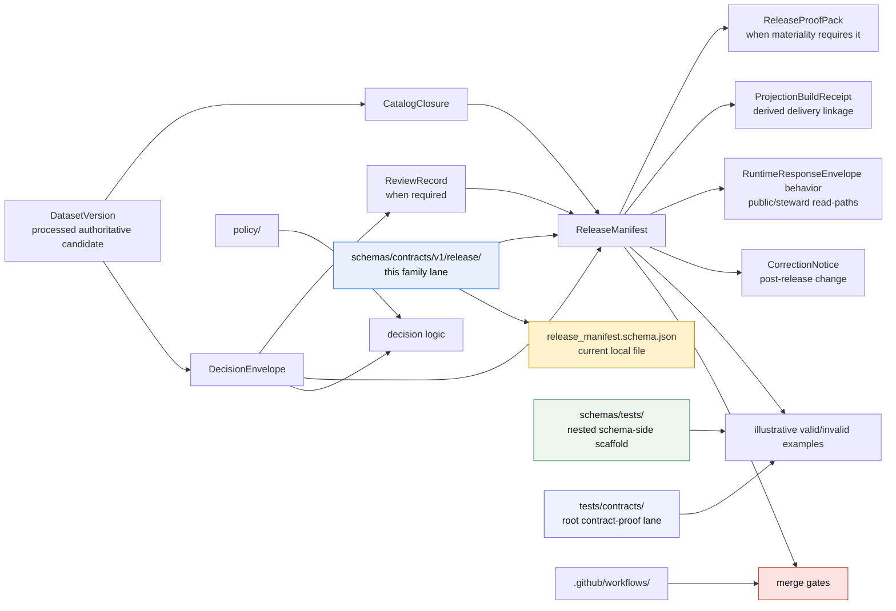

<!-- [KFM_META_BLOCK_V2]
doc_id: kfm://doc/<uuid-NEEDS-VERIFICATION>
title: Release contracts
type: standard
version: v1
status: draft
owners: @bartytime4life
created: <YYYY-MM-DD-NEEDS-VERIFICATION>
updated: <YYYY-MM-DD-NEEDS-VERIFICATION>
policy_label: <NEEDS-VERIFICATION>
related: [schemas/README.md, schemas/contracts/README.md, schemas/contracts/v1/README.md, schemas/contracts/v1/release/release_manifest.schema.json, schemas/tests/README.md, tests/contracts/README.md, contracts/README.md, .github/workflows/README.md]
tags: [kfm, schemas, contracts, release]
notes: [current public release lane is real and already carries substantive boundary guidance, release_manifest.schema.json remains placeholder-only, schema-home authority remains unresolved, meta-block placeholders retained for unverified document-record fields]
[/KFM_META_BLOCK_V2] -->

# Release contracts

Boundary README for the public `schemas/contracts/v1/release/` family lane and the current checked-in state of `release_manifest.schema.json`.

> [!NOTE]
> The KFM Meta Block v2 above keeps `doc_id`, `created`, `updated`, and `policy_label` as reviewable placeholders because those values were not directly confirmed from the current public repo surfaces inspected for this revision.
> The impact block below describes the maturity of the `release/` surface itself.

> **Status:** experimental  
> **Doc status:** draft  
> **Owners:** `@bartytime4life` *(via current public `.github/CODEOWNERS` global fallback; no narrower `/schemas/` rule was directly verified on public `main`)*  
> **Path:** `schemas/contracts/v1/release/README.md`  
> **Schema family:** `ReleaseManifest` *(with `ReleaseProofPack` kept visible as a doctrinally adjacent object, not yet directly verified here as a local schema file)*  
> **Current schema body:** placeholder (`{}`)  
> **Schema-home authority:** `UNKNOWN / NEEDS VERIFICATION`  
>         
> **Quick jumps:** [Scope](#scope) · [Current public deltas](#current-public-deltas) · [Repo fit](#repo-fit) · [Inputs](#inputs) · [Exclusions](#exclusions) · [Directory tree](#directory-tree) · [Quickstart](#quickstart) · [Usage](#usage) · [Diagram](#diagram) · [Reference tables](#reference-tables) · [Task list](#task-list) · [FAQ](#faq) · [Appendix](#appendix)

> [!IMPORTANT]
> Current public `main` shows this lane as **real and already documented**, but the checked-in machine contract is still only `./release_manifest.schema.json` with body `{}`. Treat this README as boundary truth and review guidance, not as proof that release-family contract enforcement is already mounted.

> [!WARNING]
> Schema-home authority is still unresolved across adjacent docs. The visible `schemas/contracts/v1/` subtree is real; nearby contract and standards docs still stop short of declaring it the singular canonical machine-contract home.

> [!TIP]
> Two verification-adjacent paths matter here right now: a nested schema-side scaffold under `schemas/tests/fixtures/contracts/v1/{valid,invalid}/`, and a sharper root `tests/contracts/` family. Keep that split explicit so valid/invalid examples do not drift silently between two quiet homes.

---

## Scope

`schemas/contracts/v1/release/` is the release-family lane inside the live public `schemas/contracts/v1/` subtree.

In KFM doctrine, this is the contract-family edge where outward release stops being implied and becomes inspectable. The release family sits on the closure seam between `CATALOG` and `PUBLISHED`: if release scope, proof, or correction posture cannot be reconstructed, outward trust should fail closed instead of being polished into a best-effort bluff.

This README therefore has to do four jobs well:

1. record what the public tree actually contains,
2. keep schema-home ambiguity visible rather than smoothing it away,
3. prevent silent duplication between `schemas/` and `contracts/`, and
4. state what still must be surfaced before stronger implementation claims become safe.

### Truth labels used here

| Label | How to read it in this file |
|---|---|
| **CONFIRMED** | Directly visible in the current public repo tree or directly stated in adjacent public repo docs reopened for this revision |
| **INFERRED** | Conservative interpretation that fits the visible tree and repeated KFM doctrine, but is not itself a checked-in authority decision |
| **PROPOSED** | Repo-native next-step guidance that fits KFM doctrine and the current public tree, but is not asserted as current implementation fact |
| **UNKNOWN** | Not verified strongly enough from current public evidence |
| **NEEDS VERIFICATION** | A review placeholder important enough to block stronger claims until directly checked |

[Back to top](#release-contracts)

## Current public deltas

| Delta | Why it matters here | Status |
|---|---|---|
| `schemas/contracts/v1/release/` is publicly visible with `README.md` and `release_manifest.schema.json` | This lane is real and reviewable on public `main`, not hypothetical | **CONFIRMED** |
| `release_manifest.schema.json` still has body `{}` | Human boundary guidance is ahead of machine-encoded contract detail | **CONFIRMED** |
| The family README is already substantive boundary guidance on current public `main` | This revision should strengthen and align the lane, not describe it as scaffold-only | **CONFIRMED** |
| `schemas/tests/fixtures/contracts/v1/{valid,invalid}` is visible and scaffold-only | A schema-side landing zone for examples exists, but it is not proof-bearing by itself | **CONFIRMED** |
| `tests/contracts/README.md` exists as a sharper current contract-facing verification family | Canonical contract-proof examples should not drift away from the stronger root verification lane without an explicit repo decision | **CONFIRMED** |
| `.github/workflows/` is still README-only on current public `main` | Merge-blocking validation depth remains unproven from checked-in YAML | **CONFIRMED** |
| Root `contracts/README.md` still frames `contracts/` as the machine-readable contract backbone while `schemas/contracts/v1/` materially exists | Authority language and machine-file placement remain split across roots | **CONFIRMED / NEEDS VERIFICATION** |

[Back to top](#release-contracts)

## Repo fit

### Path map

| Dimension | Value |
|---|---|
| Path | `schemas/contracts/v1/release/README.md` |
| Local artifact | [`./release_manifest.schema.json`](./release_manifest.schema.json) |
| Upstream family doc | [`../README.md`](../README.md) |
| Boundary docs | [`../../README.md`](../../README.md) · [`../../../README.md`](../../../README.md) |
| Adjacent doctrinal contract lane | [`../../../../contracts/README.md`](../../../../contracts/README.md) |
| Nested schema-side fixture scaffold | [`../../../tests/README.md`](../../../tests/README.md) · [`../../../tests/fixtures/contracts/v1/README.md`](../../../tests/fixtures/contracts/v1/README.md) |
| Root contract-proof lane | [`../../../../tests/contracts/README.md`](../../../../tests/contracts/README.md) |
| Broader verification / policy / workflow surfaces | [`../../../../tests/README.md`](../../../../tests/README.md) · [`../../../../policy/README.md`](../../../../policy/README.md) · [`../../../../.github/workflows/README.md`](../../../../.github/workflows/README.md) |
| Standards routing context | [`../../../../docs/standards/README.md`](../../../../docs/standards/README.md) |
| Closest sibling families | [`../common/README.md`](../common/README.md) · [`../correction/README.md`](../correction/README.md) · [`../data/README.md`](../data/README.md) · [`../evidence/README.md`](../evidence/README.md) · [`../policy/README.md`](../policy/README.md) · [`../runtime/README.md`](../runtime/README.md) · [`../source/README.md`](../source/README.md) |
| Audience | Maintainers working on release-family contract definition, schema-home reconciliation, fixture routing, policy adjacency, and fail-closed release semantics |

### Repo fit, in plain language

This path is **not** where emitted release evidence should accumulate.

It is where the **contract shape** for release closure belongs if this `schemas/`-side lane remains active. The safest current reading is still:

1. the lane is real,
2. the family name is real,
3. the local schema body is still placeholder-only, and
4. the authority split with `contracts/` is still unresolved.

[Back to top](#release-contracts)

## Inputs

### Accepted inputs

| Accepted here | Why it belongs here |
|---|---|
| Version-local README improvements | Keeps the family lane navigable, reviewable, and synchronized with sibling family docs |
| Family-level notes about `ReleaseManifest` and `ReleaseProofPack` semantics | Helps readers understand the closure seam without inventing implementation |
| Links to local family files already present in this directory | Keeps navigation local and predictable |
| Authority-resolution notes specific to the release family | This lane sits inside an unresolved schema-home boundary |
| Explicit status notes about placeholder bodies, missing fixtures, missing gates, or split proof surfaces | Useful because they reduce trust theater |
| Clearly labeled non-authoritative examples or pointers | Safe only when they do **not** masquerade as canonical release evidence |
| Updates that reconcile tree snapshots across sibling `schemas/contracts/v1/*` lanes | Stale inventory language is itself a form of drift |

### Expected inputs before this lane becomes strong

If this family is going to become more than scaffold, four things need to become visible together:

1. one authoritative schema-home decision,
2. a substantive `release_manifest.schema.json` body,
3. valid and invalid fixtures that prove the contract matters operationally, and
4. workflow automation that actually gates trust-bearing release changes.

[Back to top](#release-contracts)

## Exclusions

This directory should stay narrow. It is a family boundary, not a catch-all “release stuff” folder.

| Excluded from this path | Put it here instead | Why |
|---|---|---|
| Emitted release manifests, proof packs, signed bundles, rollback drill outputs | Release assembly / proof-pack lanes defined by release and operations docs *(path NEEDS VERIFICATION)* | This path is for contract shape, not emitted evidence |
| Policy bundles, decision logic, or reviewer workflows | [`../../../../policy/`](../../../../policy/) | Policy must stay executable and reviewable |
| Contract-facing valid/invalid fixture packs meant to back real runners | [`../../../../tests/contracts/`](../../../../tests/contracts/) | The repo already exposes a sharper contract-proof lane |
| Nested schema-side scaffolds treated as canonical proof by default | Keep them explicitly scaffold-only under [`../../../tests/README.md`](../../../tests/README.md), or retire them once fixture authority is settled | Prevents a second quiet fixture home |
| Merge-gate workflow YAML and validator orchestration | [`../../../../.github/workflows/`](../../../../.github/workflows/) | Enforcement belongs with workflow inventory |
| Runtime DTOs, API handlers, shell payload renderers | App / runtime implementation surfaces | Consumers should depend on contracts, not live inside them |
| Competing canonical copies of the same trust-bearing family in both `schemas/` and `contracts/` | Resolve schema authority first | Parallel schema law creates drift |

> [!CAUTION]
> A tidy directory is not the same thing as a governed release surface. This lane should stay small, explicit, and hard to misread.

[Back to top](#release-contracts)

## Directory tree

### Current local tree

```text
schemas/contracts/v1/release/
├── README.md
└── release_manifest.schema.json
```

### Adjacent verification surfaces worth reviewing with this lane

```text
schemas/tests/
└── fixtures/
    └── contracts/
        └── v1/
            ├── valid/
            │   └── README.md
            └── invalid/
                └── README.md

tests/contracts/
└── README.md

.github/workflows/
└── README.md
```

### Reading rule for the tree

- Tree presence is **CONFIRMED**.
- Tree presence is **not** the same thing as substantive release-contract maturity.
- The local schema file exists, but current public evidence still shows a placeholder body.
- Nested schema-side fixture scaffolds are visible, but they are still scaffold-only.
- No separate `ReleaseProofPack` schema file was directly verified in this local lane during review.

[Back to top](#release-contracts)

## Quickstart

Use this path as an **inspection lane first**.

```bash
# 1) Re-open the local release family
sed -n '1,240p' schemas/contracts/v1/release/README.md
cat schemas/contracts/v1/release/release_manifest.schema.json

# 2) Re-open the authority chain that governs how this lane should be read
sed -n '1,260p' schemas/README.md
sed -n '1,260p' schemas/contracts/README.md
sed -n '1,260p' schemas/contracts/v1/README.md
sed -n '1,260p' contracts/README.md
sed -n '1,240p' docs/standards/README.md

# 3) Inspect both visible proof-adjacent paths before editing the schema body
sed -n '1,240p' schemas/tests/README.md
sed -n '1,260p' tests/contracts/README.md
find schemas/tests -maxdepth 6 -type f | sort
find tests/contracts -maxdepth 6 -type f | sort
find .github/workflows -maxdepth 3 -type f | sort
```

### Safe review sequence

1. Re-read the parent `schemas/` and `contracts/` boundary docs.
2. Confirm whether an ADR or equivalent repo decision has resolved schema-home authority.
3. Inspect the raw body of `release_manifest.schema.json` instead of assuming it is substantive.
4. Check both `schemas/tests/` and `tests/contracts/` before deciding where valid/invalid release examples belong.
5. Verify whether workflow evidence exists or keep any enforcement claims marked `UNKNOWN / NEEDS VERIFICATION`.
6. Only then decide whether the change belongs here, in `contracts/`, or in a non-schema lane.

> [!TIP]
> If you cannot answer “which directory is authoritative?” before editing a trust-bearing family, pause there first. Silent duplication is harder to unwind than a deliberate delay.

[Back to top](#release-contracts)

## Usage

### Current default mode: boundary-first

Use this README as:

- a release-family index for the current public `schemas/contracts/v1/release/` lane,
- a warning surface against schema-home drift,
- a contributor checkpoint before expanding `release_manifest.schema.json`, and
- a reminder that emitted release evidence is downstream of closure, policy, review, and visible correction.

### What this family is supposed to carry doctrinally

Within current KFM doctrine, the release family is where outward release becomes inspectable. The relevant object family is **`ReleaseManifest / ReleaseProofPack`**, whose minimum job is to carry public-safe release scope and the proof needed to justify it.

The release-family contract should eventually make space for at least these concerns:

- version and release references,
- catalog linkage,
- decision and review linkage,
- docs / accessibility gate linkage where required,
- rollback or correction posture,
- outward profile or version linkage, and
- proof bundle planning.

### If you are strengthening `release_manifest.schema.json`

Do all of the following together:

1. Replace the placeholder body with substantive JSON Schema content.
2. Update this README’s current-state tables in the same change.
3. Add or link valid and invalid fixtures.
4. Link or surface the validation path.
5. Re-check whether the lane is still boundary-only or has crossed into enforcement-bearing territory.

### Example and validation routing

There are currently **two** example-adjacent paths in play, and they should not be blurred:

- `schemas/tests/fixtures/contracts/v1/{valid,invalid}/` is a **visible nested schema-side scaffold**.
- `tests/contracts/` is the **sharper current contract-facing verification family**.

Until the repo explicitly settles fixture-home and schema-home authority, any example or validation snippet in this README should stay clearly labeled as **illustrative**, **non-authoritative**, **generated**, or **mirror** where appropriate.

### Illustrative validation shape

```bash
# Illustrative only — do not treat this as a verified repo entrypoint.
python -m jsonschema \
  -i tests/fixtures/contracts/v1/valid/release_manifest.min.json \
  schemas/contracts/v1/release/release_manifest.schema.json
```

Until the fixture path, validator command, and authoritative schema home are all verified, keep examples like this explicitly non-normative.

[Back to top](#release-contracts)

## Diagram



### Interpretation

The diagram is intentionally conservative:

- `schemas/contracts/v1/release/` is shown as a **real** public family lane,
- `ReleaseManifest` is shown as a **closure-plane** dependency,
- `ReleaseProofPack`, projection builds, runtime behavior, and correction are shown as **adjacent obligations**, not as already-proven local implementation,
- the nested schema-side scaffold and the root contract-proof lane are shown as **separate** proof-adjacent paths, and
- policy and workflows remain separate surfaces that must exist before this lane can honestly be called enforced.

[Back to top](#release-contracts)

## Reference tables

### Current verified snapshot

| Item | Status | What the repo visibly shows |
|---|---|---|
| Family directory exists on public `main` | **CONFIRMED** | `schemas/contracts/v1/release/` is present |
| Family README exists | **CONFIRMED** | `README.md` exists here and already carries substantive boundary guidance |
| Local schema file exists | **CONFIRMED** | `release_manifest.schema.json` is checked in here |
| Local schema body is implementation-ready | **CONFIRMED placeholder only** | Current checked-in body is still `{}` |
| Wider `schemas/contracts/v1/` lane exists | **CONFIRMED** | The parent lane is materially present with eight family subdirectories |
| Nested schema-side fixture scaffold exists | **CONFIRMED scaffold only** | `schemas/tests/fixtures/contracts/v1/{valid,invalid}` is visible, but current public leaves remain README-only |
| Root contract-facing verification family exists | **CONFIRMED** | `tests/contracts/README.md` is present as a sharper contract-proof lane |
| Current public workflow lane proves checked-in merge-blocking validation YAML for this family | **UNKNOWN** | Public `.github/workflows/` remains documentary unless reverified elsewhere |
| Separate local `ReleaseProofPack` schema file exists | **UNKNOWN / NEEDS VERIFICATION** | The doctrinal family is paired, but the local file inventory is not |
| Authoritative schema home is reconciled across docs | **NEEDS VERIFICATION** | Adjacent docs still show unresolved authority between `schemas/` and root `contracts/` |

### `ReleaseManifest` starter concern map

> [!NOTE]
> This is a **starter concern map**, not a statement of current checked-in schema fields.
> It reflects doctrinal minimums carried by the release family in the attached KFM corpus and should not be mistaken for a verified local JSON Schema body.

| Concern area | Why it belongs in the release family | Current local status |
|---|---|---|
| Version refs | Outward release scope should be pinned to explicit version identity | Not encoded locally yet; schema body is `{}` |
| Catalog refs | Release scope should resolve back to outward catalog closure | Not encoded locally yet; README only |
| Decision / review refs | Publish state should remain connected to decision and review objects | Not encoded locally yet; README only |
| Docs / accessibility gate | Material public release may require visible release-quality checks beyond raw data presence | Not encoded locally yet; README only |
| Rollback / correction posture | Release should remain retractable, narrowable, or supersedable without silent overwrite | Not encoded locally yet; README only |
| Profile versions | Public-safe release should stay reconstructable against declared outward profiles | Not encoded locally yet; README only |
| Bundle plan / proof-pack planning | Higher-materiality releases need a path from manifest to proof | Not encoded locally yet; README only |

### Release family versus emitted evidence

| Thing | Belongs in this path now? | Why |
|---|---|---|
| `release_manifest.schema.json` | **Yes** | It is the local machine-contract file |
| This README | **Yes** | It explains the family boundary and current state |
| A published release manifest instance | **No** | That is emitted evidence, not schema source |
| A release proof-pack bundle | **No** | That is downstream release evidence |
| Signed attestation bundles | **No** | They belong with release proof, audit, or provenance surfaces |
| Rollback drill output | **No** | It is operational evidence, not family schema law |

[Back to top](#release-contracts)

## Task list

### Definition of done for this README

- [ ] Title, path, and quick jumps all match the file’s actual role
- [ ] The local `release/` lane is described honestly
- [ ] Schema-home ambiguity remains visible instead of being smoothed away
- [ ] `release_manifest.schema.json` placeholder state is called out directly
- [ ] Relative links point to the actual adjacent repo docs
- [ ] The doc distinguishes schema source from emitted release evidence
- [ ] The split between nested schema-side fixture scaffolds and the root contract-proof lane remains explicit
- [ ] The Mermaid diagram still reflects current boundary conditions
- [ ] No section implies fixtures, policy bundles, or workflow gates that were not verified
- [ ] Future authority resolution can be merged in without rewriting the whole file

### Operational next-step checklist for maintainers

- [ ] Resolve schema-home authority explicitly
- [ ] Replace placeholder `{}` with a substantive `ReleaseManifest` schema body
- [ ] Decide whether `ReleaseProofPack` receives a separate schema, shared profile, or remains implied by release docs
- [ ] Add at least one valid and one invalid release-family fixture
- [ ] Link the first real validator command and workflow file
- [ ] Update parent and sibling `schemas/contracts/v1/*` docs if their tree snapshot or authority language no longer matches public reality

[Back to top](#release-contracts)

## FAQ

### Is `schemas/contracts/v1/release/` already the canonical release-contract home?

**UNKNOWN / NEEDS VERIFICATION.** The public tree clearly exposes the lane, but adjacent repo docs still preserve an unresolved split between `schemas/` and `contracts/`.

### Does `release_manifest.schema.json` already implement KFM release law?

No. The local raw file is currently placeholder-only. The filename is meaningful; the body is not yet substantive.

### Why keep `ReleaseProofPack` visible if this directory only shows `release_manifest.schema.json`?

Because the doctrinal object family is paired: release closure includes the manifest and, where significance requires it, a proof package. This README should keep that adjacency visible even before the local file layout is complete.

### Where should valid and invalid examples go right now?

Treat that as **open routing**, not settled law. A nested schema-side scaffold is visible under `schemas/tests/fixtures/contracts/v1/{valid,invalid}/`, and a sharper contract-proof family is visible under `tests/contracts/`. Do not silently make either path canonical without an explicit repo decision.

### Should emitted release manifests or proof bundles be stored here?

No. This path is for the **contract definition**, not the emitted release evidence.

### What should happen when schema-home authority is resolved?

- If `schemas/` becomes authoritative, expand this README into the normative family index.
- If `contracts/` becomes authoritative, convert this README into an explicit pointer or mirror guide.
- In either case, remove ambiguity only after the decision is public, linkable, and reflected across adjacent docs.

[Back to top](#release-contracts)

## Appendix

<details>
<summary><strong>Observed public files and open verification items</strong></summary>

### Observed directly in this lane

- `./README.md`
- `./release_manifest.schema.json`

### Observed directly in adjacent proof surfaces

- `schemas/tests/README.md`
- `schemas/tests/fixtures/contracts/v1/README.md`
- `tests/contracts/README.md`
- `.github/workflows/README.md`

### Current local schema body

```json
{}
```

### Open verification items

- whether `schemas/` or `contracts/` becomes the authoritative machine-contract home,
- whether the release family gets linked valid and invalid fixtures,
- whether a merge-blocking validator consumes this exact path,
- whether `ReleaseProofPack` will receive its own local schema file,
- whether emitted release evidence paths are formalized in repo runbooks or operations docs.

### Contributor checklist before editing this family

1. Re-open `schemas/README.md`, `schemas/contracts/README.md`, `schemas/contracts/v1/README.md`, and `contracts/README.md`.
2. Re-open `schemas/tests/README.md`, `tests/contracts/README.md`, and `.github/workflows/README.md`.
3. Confirm whether schema-home and fixture-home authority are still unresolved.
4. Inspect the raw body of `release_manifest.schema.json`.
5. Update this README in the same change if public-tree reality or authority posture changes.

</details>

---

This README should stay intentionally honest: useful now, stronger later, and never more certain than the repo evidence allows.
