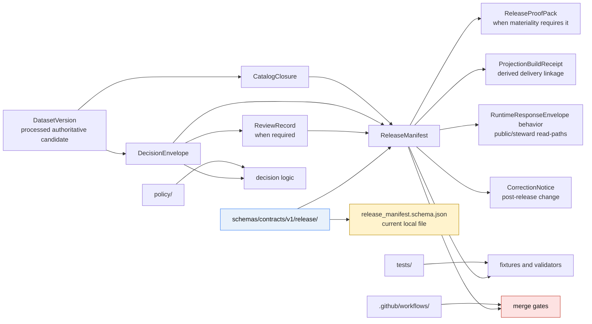

<!-- [KFM_META_BLOCK_V2]
doc_id: kfm://doc/<uuid-NEEDS-VERIFICATION>
title: Release contracts
type: standard
version: v1
status: draft
owners: @bartytime4life
created: <YYYY-MM-DD-NEEDS-VERIFICATION>
updated: <YYYY-MM-DD-NEEDS-VERIFICATION>
policy_label: <NEEDS-VERIFICATION>
related: [schemas/README.md, schemas/contracts/README.md, schemas/contracts/v1/README.md, contracts/README.md, schemas/contracts/v1/release/release_manifest.schema.json]
tags: [kfm, schemas, contracts, release]
notes: [owner inherited from current visible lane docs, schema-home authority unresolved, current public release README was scaffold-only at review time, local release_manifest.schema.json body is currently placeholder-only]
[/KFM_META_BLOCK_V2] -->

# Release contracts

Versioned boundary README for the `schemas/contracts/v1/release/` lane and the current public state of `release_manifest.schema.json`.

> Status: experimental  
> Doc status: draft  
> Owners: `@bartytime4life` *(current strongest visible signal; narrower path ownership remains NEEDS VERIFICATION)*  
> Path: `schemas/contracts/v1/release/README.md`  
> Family file: `./release_manifest.schema.json`  
>        
> Quick jumps: [Scope](#scope) · [Repo fit](#repo-fit) · [Inputs](#inputs) · [Exclusions](#exclusions) · [Directory tree](#directory-tree) · [Quickstart](#quickstart) · [Usage](#usage) · [Diagram](#diagram) · [Tables](#tables) · [Task list](#task-list) · [FAQ](#faq) · [Appendix](#appendix)

> [!IMPORTANT]
> The `release/` family is publicly visible on `main`, but current repo docs still do **not** settle whether `schemas/` or `contracts/` is the authoritative machine-contract home. This README should behave as a boundary and inventory guide, not as a premature declaration that the authority question is closed.

> [!WARNING]
> The local `release_manifest.schema.json` file is currently placeholder-only. A present filename is **not** proof of operational contract maturity.

---

## Scope

`schemas/contracts/v1/release/` is the release-family lane inside the public `schemas/contracts/v1/` subtree. Its job is narrow but important: make the release-family surface legible, preserve unresolved schema-home authority, and keep contributors from confusing a visible scaffold with a completed trust-bearing contract.

At KFM doctrine level, the release family sits on the closure seam between `CATALOG` and `PUBLISHED`. A `ReleaseManifest` is part of the object family that makes outward release inspectable rather than rhetorical. If release closure artifacts are missing, outward trust should fail closed rather than being implied.

### Truth posture used here

| Marker | Meaning in this README |
|---|---|
| **CONFIRMED** | Directly visible in the current public repo surface, or directly anchored in stable KFM doctrine already used by adjacent docs |
| **INFERRED** | Strongly suggested by adjacent repo docs or doctrine, but not directly proven from this specific path |
| **PROPOSED** | Safe next-step structure or maintenance guidance, not current-state fact |
| **UNKNOWN** | Not directly verified from the reviewed public evidence |
| **NEEDS VERIFICATION** | A specific value, ownership detail, authority decision, or enforcement claim must be checked before treating it as settled |

[Back to top](#release-contracts)

## Repo fit

| Field | Value |
|---|---|
| Path | `schemas/contracts/v1/release/README.md` |
| Purpose | Boundary README for the release-family contract lane under the public `schemas/contracts/v1/` tree |
| Immediate parent | [`../README.md`](../README.md) |
| Parent boundary lane | [`../../README.md`](../../README.md) |
| Parent schema root | [`../../../README.md`](../../../README.md) |
| Stronger current working contract signal | [`../../../../contracts/README.md`](../../../../contracts/README.md) |
| Standards routing context | [`../../../../docs/standards/README.md`](../../../../docs/standards/README.md) |
| Adjacent enforcement surfaces | [`../../../../tests/README.md`](../../../../tests/README.md), [`../../../../policy/README.md`](../../../../policy/README.md), [`../../../../.github/workflows/README.md`](../../../../.github/workflows/README.md) |
| Local schema file | [`./release_manifest.schema.json`](./release_manifest.schema.json) |
| Audience | Maintainers working on release-family contract definition, schema-home reconciliation, fixture/test follow-through, and fail-closed release semantics |

### Repo fit, in plain language

This path is **not** where emitted release evidence should accumulate. It is where the **contract shape** for release closure belongs if this `schemas/`-side lane remains active. Right now, the safer reading is:

1. the lane is real,
2. the family name is real,
3. the local schema body is still placeholder-only, and
4. the authority split with `contracts/` is still unresolved.

[Back to top](#release-contracts)

## Inputs

### Accepted inputs

| Accepted here | Why it belongs here |
|---|---|
| Version-local README improvements | Keeps the family lane navigable and reviewable |
| Family-level notes about `ReleaseManifest` and `ReleaseProofPack` semantics | Helps readers understand the release seam without inventing implementation |
| Links to local family files already present in this directory | Keeps navigation local and predictable |
| Authority-resolution notes specific to the release family | This lane sits inside an unresolved schema-home boundary |
| Explicit status notes about placeholder bodies, missing fixtures, or missing gates | Useful because they reduce trust theater |
| Clearly labeled non-authoritative examples or pointers | Safe only when they do **not** masquerade as canonical release evidence |

### Minimum bar before this lane becomes strong

If this lane is going to become more than scaffold, four things need to become visible together:

1. one authoritative schema-home decision,
2. a substantive `release_manifest.schema.json` body,
3. valid and invalid fixtures that prove the contract matters operationally, and
4. workflow automation that actually gates trust-bearing release changes.

[Back to top](#release-contracts)

## Exclusions

This directory should not become a catch-all “release stuff” folder.

| Excluded from this path | Put it here instead | Why |
|---|---|---|
| Emitted release manifests, proof packs, signed bundles, rollback drill outputs | Release assembly / proof-pack lanes defined by release and operations docs *(path NEEDS VERIFICATION)* | This path is for contract shape, not emitted evidence |
| Policy bundles, decision logic, or reviewer workflows | [`../../../../policy/`](../../../../policy/) | Policy must stay executable and reviewable |
| Fixture inventories, regression packs, or runnable schema harnesses | [`../../../../tests/`](../../../../tests/) | Verification belongs with tests |
| Merge-gate workflow YAML and validator orchestration | [`../../../../.github/workflows/`](../../../../.github/workflows/) | Enforcement belongs with workflow inventory |
| Runtime DTOs, API handlers, shell payload renderers | App / runtime implementation surfaces | Consumers should depend on contracts, not live inside them |
| Competing canonical copies of the same trust-bearing family in both `schemas/` and `contracts/` | Resolve schema authority first | Parallel schema law creates drift |

> [!CAUTION]
> A tidy directory is not the same thing as a governed release surface. This lane should stay small, explicit, and hard to misread.

[Back to top](#release-contracts)

## Directory tree

### Parent family map

```text
schemas/contracts/v1/
├── README.md
├── common/
├── correction/
├── data/
├── evidence/
├── policy/
├── release/
├── runtime/
└── source/
```

### Local zoom-in

```text
schemas/contracts/v1/release/
├── README.md
└── release_manifest.schema.json
```

### Reading rule for the tree

- Tree presence is **CONFIRMED**.
- Tree presence is **not** the same thing as substantive release-contract maturity.
- The local schema file exists, but current public evidence still shows a placeholder body.
- No separate `ReleaseProofPack` schema file was directly verified in this directory during review.

[Back to top](#release-contracts)

## Quickstart

Use this path as an **inspection lane first**.

```bash
# 1) Re-open the local release family
sed -n '1,220p' schemas/contracts/v1/release/README.md
cat schemas/contracts/v1/release/release_manifest.schema.json

# 2) Re-open the boundary docs that govern how this lane should be read
sed -n '1,260p' schemas/contracts/v1/README.md
sed -n '1,260p' schemas/contracts/README.md
sed -n '1,260p' schemas/README.md
sed -n '1,260p' contracts/README.md

# 3) Inspect adjacent trust surfaces before editing the schema body
find tests -maxdepth 4 -type f | sort
find policy -maxdepth 4 -type f | sort
find .github/workflows -maxdepth 3 -type f | sort
```

### Safe review sequence

1. Re-read the parent `schemas/` and `contracts/` boundary docs.
2. Confirm whether an ADR or equivalent repo decision has resolved schema-home authority.
3. Inspect the raw body of `release_manifest.schema.json` instead of assuming it is substantive.
4. Check for fixtures, policy references, and workflow gates that prove the file matters operationally.
5. Only then decide whether the change belongs here, in `contracts/`, or in a non-schema lane.

> [!TIP]
> If you cannot answer “which directory is authoritative?” before editing a trust-bearing family, pause there first. Silent duplication is harder to unwind than a deliberate delay.

[Back to top](#release-contracts)

## Usage

### Recommended use right now

Use this README as:

- a release-family index for the current public `schemas/contracts/v1/release/` lane,
- a warning surface against schema-home drift,
- a contributor checkpoint before expanding `release_manifest.schema.json`, and
- a reminder that emitted release evidence is downstream of closure, policy, and review.

### What this family is supposed to carry doctrinally

Within current KFM doctrine, the release family is where outward release becomes inspectable. The relevant object family is **`ReleaseManifest / ReleaseProofPack`**, whose minimum job is to carry public-safe release scope and the proof needed to justify it.

The release-family contract should eventually make space for at least these concerns:

- version and release references,
- catalog linkage,
- policy and review linkage,
- docs/accessibility gate linkage where required,
- rollback or correction posture,
- profile/version metadata, and
- proof bundle planning.

### What this local lane currently proves

Very little — and that honesty matters.

Right now this local family lane proves only that:

- the directory exists,
- the README exists,
- the schema filename exists, and
- the repo has started exposing first-wave family names on the `schemas/` side.

It does **not** yet prove:

- substantive schema fields,
- fixture-backed validation,
- release-proof assembly automation, or
- merge-blocking enforcement for this family.

### Illustrative validation shape

```bash
# Illustrative only — do not treat this as a verified repo entrypoint.
python -m jsonschema \
  -i tests/fixtures/contracts/v1/valid/release_manifest.min.json \
  schemas/contracts/v1/release/release_manifest.schema.json
```

Until the fixture path, validator command, and authoritative schema home are all verified, keep examples like this explicitly non-normative.

[Back to top](#release-contracts)

## Diagram



### Interpretation

The diagram is intentionally conservative:

- `schemas/contracts/v1/release/` is shown as a **real** public lane,
- `ReleaseManifest` is shown as a **closure-plane** dependency,
- `ReleaseProofPack`, projection builds, runtime behavior, and correction are shown as **adjacent obligations**, not as already-proven local implementation, and
- tests, policy, and workflows remain separate surfaces that must exist before this lane can honestly be called enforced.

[Back to top](#release-contracts)

## Tables

### Current verified snapshot

| Surface | Current visible state | Status | Why it matters |
|---|---|---|---|
| `schemas/contracts/v1/release/` | Directory present | **CONFIRMED** | The family lane is real on the public branch |
| `README.md` | Present, but current public content is scaffold-only | **CONFIRMED** | This file needs real boundary guidance, not placeholder text |
| `release_manifest.schema.json` | Present; raw body currently `{}` | **CONFIRMED** | The filename exists, but the contract body is still placeholder-only |
| Separate `ReleaseProofPack` schema file in this local lane | Not directly verified here | **UNKNOWN / NEEDS VERIFICATION** | The doctrinal family is paired, but the local file inventory is not |
| Fixtures linked to the release family | Not directly verified from this path | **UNKNOWN** | Without fixtures, contract claims are still documentary |
| Merge-blocking workflow YAML proving release-family enforcement | Not directly verified from this path | **UNKNOWN** | Enforcement cannot be assumed from directory presence |

### Release-family contract load

| Artifact or dependency | Plane / seam | What this path should help define | Fail-closed consequence if absent |
|---|---|---|---|
| `ReleaseManifest` | Closure, `CATALOG -> PUBLISHED` | Public-safe release scope, release linkage, policy/review linkage, rollback/correction posture | No trusted outward release |
| `ReleaseProofPack` | Closure | Proof package for releases where materiality or audit burden requires more than the manifest alone | Publication remains rhetorical |
| `ProjectionBuildReceipt` | Delivery | Release linkage for PMTiles, vectors, exports, search, graph, and other derived surfaces | Derived outputs must go stale-visible, rebuild, or be withheld |
| `RuntimeResponseEnvelope` behavior | Runtime | Public/steward read-paths should reconstruct release scope instead of bluffing | No fallback fluency |
| `CorrectionNotice` | Closure -> Delivery -> Runtime | Visible lineage when a release is narrowed, superseded, withdrawn, or corrected | No silent overwrite |

### Release family versus emitted evidence

| Thing | Belongs in this path now? | Why |
|---|---|---|
| `release_manifest.schema.json` | **Yes** | It is the local machine-contract file |
| This README | **Yes** | It explains the family boundary and current state |
| A published release manifest instance | **No** | That is emitted evidence, not schema source |
| A release proof pack bundle | **No** | That is downstream release evidence |
| Signed attestation bundles | **No** | They belong with release proof, audit, or provenance surfaces |
| Rollback drill output | **No** | It is operational evidence, not family schema law |

[Back to top](#release-contracts)

## Task list

### Definition of done for this README

- [ ] Title, path, and quick jumps all match the file’s actual role
- [ ] The local `release/` lane is described honestly
- [ ] Schema-home ambiguity remains visible instead of being smoothed away
- [ ] `release_manifest.schema.json` placeholder state is called out directly
- [ ] Relative links point to the actual adjacent repo docs
- [ ] The doc distinguishes schema source from emitted release evidence
- [ ] The Mermaid diagram still reflects current boundary conditions
- [ ] No section implies fixtures, policy bundles, or workflow gates that were not verified
- [ ] Future authority resolution can be merged in without rewriting the whole file

### Operational next-step checklist for maintainers

- [ ] Resolve schema-home authority explicitly
- [ ] Replace placeholder `{}` with a substantive `ReleaseManifest` schema body
- [ ] Add at least one valid and one invalid release-family fixture
- [ ] Link the first real validator command and workflow file
- [ ] Decide whether `ReleaseProofPack` gets a separate schema, shared profile, or remains implied by release docs
- [ ] Update parent `schemas/` docs if their tree snapshot no longer matches public reality

[Back to top](#release-contracts)

## FAQ

### Is `schemas/contracts/v1/release/` already the canonical release-contract home?

**UNKNOWN / NEEDS VERIFICATION.** The public tree clearly exposes the lane, but adjacent repo docs still preserve an unresolved split between `schemas/` and `contracts/`.

### Does `release_manifest.schema.json` already implement KFM release law?

No. The local raw file is currently placeholder-only. The filename is meaningful; the body is not yet substantive.

### Why talk about `ReleaseProofPack` if this directory only shows `release_manifest.schema.json`?

Because the doctrinal object family is paired: release closure includes the manifest and, where significance requires it, a proof package. This README should keep that adjacency visible even before the local file layout is complete.

### Should emitted release manifests or proof bundles be stored here?

No. This path is for the **contract definition**, not the emitted release evidence.

### What should happen when schema-home authority is resolved?

- If `schemas/` becomes authoritative, expand this README into the normative family index.
- If `contracts/` becomes authoritative, convert this README into an explicit pointer or mirror guide.
- In either case, remove ambiguity only after the decision is public, linkable, and reflected across adjacent docs.

[Back to top](#release-contracts)

## Appendix

<details>
<summary><strong>Observed public files and open verification items</strong></summary>

### Observed directly

- `./README.md`
- `./release_manifest.schema.json`

### Current local schema body

```json
{}
```

### Open verification items

- whether `schemas/` or `contracts/` becomes the authoritative machine-contract home,
- whether the release family gets linked valid and invalid fixtures,
- whether a merge-blocking validator consumes this exact path,
- whether `ReleaseProofPack` will receive its own local schema file,
- whether emitted release evidence paths are formalized in repo runbooks or operations docs.

### Contributor checklist before editing this family

1. Re-open `schemas/README.md`, `schemas/contracts/README.md`, `schemas/contracts/v1/README.md`, and `contracts/README.md`.
2. Confirm whether schema-home authority is still unresolved.
3. Inspect the raw body of `release_manifest.schema.json`.
4. Check `tests/`, `policy/`, and `.github/workflows/` for enforcement surfaces.
5. Update this README in the same change if public-tree reality or authority posture changes.

</details>

---

This README should stay intentionally honest: useful now, stronger later, and never more certain than the repo evidence allows.
