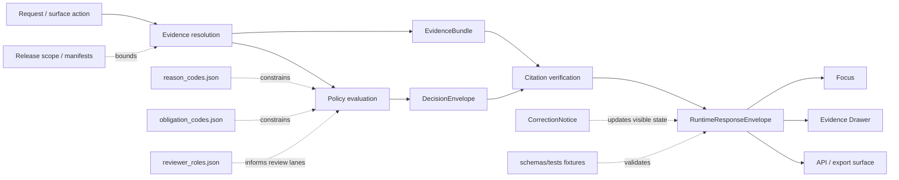

<!-- [KFM_META_BLOCK_V2]
doc_id: kfm://doc/<TODO-VERIFY-UUID>
title: runtime
type: standard
version: v1
status: draft
owners: @bartytime4life
created: <TODO-VERIFY-CREATED-DATE>
updated: 2026-04-03
policy_label: public
related: [../../../README.md, ../README.md, ../../README.md, ../../vocab/README.md, ../../../tests/README.md, ../../../../contracts/README.md, ../../../../docs/standards/README.md, ../../../../policy/README.md, ../../../../tests/README.md, ../../../../.github/workflows/README.md, ./runtime_response_envelope.schema.json]
tags: [kfm, schemas, contracts, runtime]
notes: [doc_id and created date need verification, schema body remains {}, schema-home authority between contracts and schemas remains unresolved]
[/KFM_META_BLOCK_V2] -->

# `runtime`

Runtime contract-family lane for accountable outward outcomes, finite trust-visible result states, and cite-or-abstain behavior under `schemas/contracts/v1/`.

> **Status:** experimental  
> **Owners:** @bartytime4life *(via `.github/CODEOWNERS` global fallback; no narrower `/schemas/` rule is directly visible on current public `main`)*  
> **Path:** `schemas/contracts/v1/runtime/README.md`  
> **Repo fit:** child lane of [`../README.md`](../README.md) inside the live `schemas/contracts/v1/` inventory; broader schema boundary at [`../../../README.md`](../../../README.md); broader contract context at [`../../README.md`](../../README.md) and [`../../../../contracts/README.md`](../../../../contracts/README.md); cross-cutting standards lane at [`../../../../docs/standards/README.md`](../../../../docs/standards/README.md); adjacent runtime neighbors in [`../evidence/README.md`](../evidence/README.md), [`../policy/README.md`](../policy/README.md), [`../release/README.md`](../release/README.md), and [`../correction/README.md`](../correction/README.md); downstream machine file in [`./runtime_response_envelope.schema.json`](./runtime_response_envelope.schema.json).  
>       
> **Quick jump:** [Scope](#scope) · [Current public deltas](#current-public-deltas) · [Repo fit](#repo-fit) · [Accepted inputs](#accepted-inputs) · [Exclusions](#exclusions) · [Current verified snapshot](#current-verified-snapshot) · [Directory tree](#directory-tree) · [Quickstart](#quickstart) · [Usage](#usage) · [Runtime envelope minimums](#runtime-envelope-minimums) · [Diagram](#diagram) · [Operating tables](#operating-tables) · [Definition of done](#definition-of-done) · [FAQ](#faq) · [Appendix](#appendix)

> [!IMPORTANT]
> Current public `main` already contains a **substantive README** in this lane. The remaining scaffold is the machine schema body in [`./runtime_response_envelope.schema.json`](./runtime_response_envelope.schema.json), which is still `{}`.

> [!WARNING]
> Do **not** treat branch-visible file presence as proof that runtime emitters, runtime fixtures, citation checks, Focus behavior, or merge-blocking runtime gates are already enforced in code. The attached KFM corpus makes those behaviors doctrinally explicit, while current public implementation proof is still partial.

## Scope

This directory exists to hold the `runtime` contract family for outward response accountability.

In KFM terms, this is the lane where a runtime-facing contract such as `RuntimeResponseEnvelope` should make an answer, abstention, denial, or error reconstructable to evidence, policy, release scope, freshness basis, and audit linkage. It is the contract boundary between “the system said something” and “the repo can explain exactly why that statement was allowed to appear.”

On current public `main`, the human boundary doc is already real. The unfinished mass is elsewhere: the placeholder schema body, scaffold-only fixture lanes, unresolved schema-home authority, and lack of current public workflow YAML proving runtime gates end to end.

This README should therefore do four jobs:

1. explain what this lane is for,
2. record what the current public repo actually proves,
3. keep neighboring-family boundaries clear,
4. state what still must be surfaced before stronger implementation claims become safe.

## Current public deltas

| Delta | Why it matters now | Status |
|---|---|---|
| `README.md` in this lane is already a real boundary guide | This revision must correct stale self-descriptions instead of rewriting the lane from zero | **CONFIRMED** |
| `runtime_response_envelope.schema.json` still has body `{}` | Human explanation and machine contract are at different maturity levels | **CONFIRMED** |
| `schemas/tests/fixtures/contracts/v1/valid/` and `invalid/` each remain README-only scaffold leaves | Runtime-specific valid/invalid examples are not yet visible on current public `main` | **CONFIRMED** |
| `.github/workflows/README.md` records deleted workflow names such as `verify-runtime.yml` while the current public directory is still README-only | Historical automation clues exist, but they are not proof of current checked-in workflow YAML | **CONFIRMED** |
| `schemas/README.md` now indexes a live child subtree while root `contracts/README.md` still frames `contracts/` as the machine-readable contract backbone | Schema-home authority remains unresolved and must stay visible here | **NEEDS VERIFICATION** |

## Repo fit

| Aspect | Value |
|---|---|
| Lane path | `schemas/contracts/v1/runtime/` |
| Parent inventory | [`../README.md`](../README.md) |
| Broader schema boundary | [`../../../README.md`](../../../README.md) |
| Broader contract surface | [`../../README.md`](../../README.md), [`../../../../contracts/README.md`](../../../../contracts/README.md) |
| Cross-cutting standards | [`../../../../docs/standards/README.md`](../../../../docs/standards/README.md) |
| Sibling lanes | [`../common/README.md`](../common/README.md), [`../data/README.md`](../data/README.md), [`../evidence/README.md`](../evidence/README.md), [`../policy/README.md`](../policy/README.md), [`../release/README.md`](../release/README.md), [`../source/README.md`](../source/README.md), [`../correction/README.md`](../correction/README.md) |
| Vocabulary registries | [`../../vocab/README.md`](../../vocab/README.md) |
| Schema-lane fixture surface | [`../../../tests/README.md`](../../../tests/README.md), [`../../../tests/fixtures/contracts/v1/README.md`](../../../tests/fixtures/contracts/v1/README.md) |
| Repo-wide verification surfaces | [`../../../../tests/README.md`](../../../../tests/README.md), [`../../../../tests/contracts/README.md`](../../../../tests/contracts/README.md) |
| Workflow guardrail surface | [`../../../../.github/workflows/README.md`](../../../../.github/workflows/README.md) |
| Machine file in this lane | [`./runtime_response_envelope.schema.json`](./runtime_response_envelope.schema.json) |

The contract-family split matters here:

- `runtime/` is where outward runtime accountability belongs.
- `evidence/` is where support packaging belongs.
- `policy/` is where decision grammar belongs.
- `release/` is where publishable proof and release scope belong.
- `correction/` is where visible lineage under change belongs.

`runtime/` should consume those neighboring lanes, not collapse them into one file.

## Accepted inputs

Accepted inputs for this lane are narrow by design.

| What belongs here | Why it belongs here |
|---|---|
| Human-readable explanation of the `RuntimeResponseEnvelope` contract family | This lane is the reader-facing boundary for runtime outcome accountability. |
| Machine schema for `runtime_response_envelope` | The lane needs a concrete schema body once the placeholder state is retired. |
| Runtime-specific examples and fixtures | This is where answer / abstain / deny / error examples become inspectable and testable. |
| Cross-links to evidence, policy, release, correction, and standards neighbors | A runtime envelope is only meaningful when it can point to the objects that scoped it. |
| Truth-status notes (`CONFIRMED`, `INFERRED`, `PROPOSED`, `UNKNOWN`, `NEEDS VERIFICATION`) | This repo explicitly distinguishes doctrine, scaffold state, and mounted proof. |
| Boundary notes about freshness, release scope, and audit linkage | Those are load-bearing runtime concerns, not decorative add-ons. |

## Exclusions

| What does **not** belong here | Put it here instead |
|---|---|
| API handler code, resolver services, model adapters, UI components | `apps/`, `packages/`, or another mounted implementation lane once verified |
| Policy bundles and decision logic as executable rules | [`../../../../policy/README.md`](../../../../policy/README.md) and its implementation surfaces |
| Canonical evidence payload definitions | [`../evidence/README.md`](../evidence/README.md) |
| Release proof packs, publication manifests, rollback receipts | [`../release/README.md`](../release/README.md) |
| Correction workflow artifacts and supersession notices | [`../correction/README.md`](../correction/README.md) |
| Broad repo-wide test strategy | [`../../../../tests/README.md`](../../../../tests/README.md) |
| Contract-home ADR decisions presented as settled fact | Root `contracts/`, `schemas/`, and standards/governance surfaces once formally resolved |
| Claims that the current public branch already enforces runtime behavior end to end | Nowhere until code, tests, and workflow evidence are surfaced |

## Current verified snapshot

| Observation | Status | Why it matters |
|---|---|---|
| `schemas/contracts/v1/runtime/` exists on the current public branch | **CONFIRMED** | This lane is branch-visible, not hypothetical. |
| `README.md` in this lane is already a substantive boundary guide | **CONFIRMED** | Revision work should improve and correct the lane, not replace it with a generic rewrite. |
| `runtime_response_envelope.schema.json` exists | **CONFIRMED** | A machine-file placeholder is already present in the expected lane. |
| `runtime_response_envelope.schema.json` currently has body `{}` | **CONFIRMED** | The runtime contract is not yet encoded at field level on the public branch. |
| Parent `schemas/contracts/v1/` inventory exists and lists all family lanes | **CONFIRMED** | Runtime should align with the visible `v1/` family structure rather than invent a new one. |
| `schemas/README.md` now treats `schemas/contracts/` as a live child lane while keeping schema-home authority unresolved | **CONFIRMED** | Runtime docs should reflect live subtree reality without pretending authority is settled. |
| Root `contracts/README.md` still frames `contracts/` as the machine-readable contract backbone while current public `contracts/` is README-only | **CONFIRMED** | Nearby repo docs still pull authority toward root `contracts/`, so the split must stay visible. |
| `schemas/contracts/vocab/` is visible with `reason_codes.json`, `obligation_codes.json`, and `reviewer_roles.json` | **CONFIRMED** | Runtime can reuse shared registries instead of free-text drift. |
| `schemas/tests/fixtures/contracts/v1/{valid,invalid}` exists | **CONFIRMED** | There is a visible schema-lane landing zone for contract examples. |
| `schemas/tests/fixtures/contracts/v1/valid/` and `invalid/` each currently contain `README.md` only | **CONFIRMED** | Runtime-specific fixture payloads are not yet visible on current public `main`. |
| Current public `.github/workflows/` exposes checked-in runtime workflow YAML in-tree | **CONFIRMED** | **No** — current public inspection still shows `README.md` only in that directory. |
| `.github/workflows/README.md` names deleted files such as `verify-runtime.yml` and related lanes | **CONFIRMED** | Treat those names as historical reconstruction clues, not current checked-in YAML proof. |
| Narrow path-specific ownership under `/schemas/` is visible in `CODEOWNERS` | **NEEDS VERIFICATION** | The current public file shows global fallback and top-level path rules, but no narrower `/schemas/` rule was directly confirmed. |
| Canonical schema authority between `contracts/` and `schemas/` is fully settled | **NEEDS VERIFICATION** | Adjacent docs still keep that authority decision open. |

> [!NOTE]
> When broader inventory prose and the mounted branch tree diverge, prefer the most specific current lane docs plus the visible tree, then keep any remaining disagreement visible as `NEEDS VERIFICATION`.

## Directory tree

### Local lane

```text
schemas/contracts/v1/runtime/
├── README.md
└── runtime_response_envelope.schema.json
```

### Relevant nearby scaffold surfaces

```text
schemas/tests/fixtures/contracts/v1/
├── README.md
├── invalid/
│   └── README.md
└── valid/
    └── README.md

.github/workflows/
└── README.md
```

## Quickstart

Inspect the lane as it exists now:

```bash
sed -n '1,240p' schemas/contracts/v1/runtime/README.md
cat schemas/contracts/v1/runtime/runtime_response_envelope.schema.json
```

Inspect the parent inventory and the authority split that still affects this lane:

```bash
sed -n '1,260p' schemas/contracts/v1/README.md
sed -n '1,260p' schemas/contracts/README.md
sed -n '1,260p' schemas/README.md
sed -n '1,260p' contracts/README.md
sed -n '1,260p' docs/standards/README.md
```

Inspect policy, verification, and workflow-adjacent surfaces before claiming enforcement:

```bash
sed -n '1,260p' policy/README.md
sed -n '1,260p' tests/README.md
sed -n '1,260p' tests/contracts/README.md
sed -n '1,260p' .github/workflows/README.md
sed -n '1,120p' .github/CODEOWNERS
```

Inspect vocab and fixture landing zones that this lane should eventually connect to:

```bash
sed -n '1,220p' schemas/contracts/vocab/README.md
sed -n '1,220p' schemas/tests/README.md
find schemas/tests/fixtures/contracts/v1 -maxdepth 2 -type f | sort
```

> [!NOTE]
> If you are checking a non-`main` branch or a local worktree, always prefer the branch tree in front of you over older inventory prose. This lane should track mounted repo reality, not historical placeholder wording.

## Usage

Use this README as the human contract map for `runtime_response_envelope.schema.json`.

A safe reading order is:

1. read this lane README for current-state truth and exclusions,
2. read [`../README.md`](../README.md) for family-level context,
3. read [`../../../README.md`](../../../README.md) and [`../../README.md`](../../README.md) for current schema-boundary context,
4. inspect [`./runtime_response_envelope.schema.json`](./runtime_response_envelope.schema.json),
5. inspect [`../../vocab/README.md`](../../vocab/README.md) plus the visible JSON registries,
6. inspect [`../../../tests/README.md`](../../../tests/README.md), [`../../../../tests/contracts/README.md`](../../../../tests/contracts/README.md), and [`../../../../tests/README.md`](../../../../tests/README.md) before claiming fixture or gate coverage,
7. inspect [`../../../../.github/workflows/README.md`](../../../../.github/workflows/README.md) before claiming merge-blocking automation.

A safe writing order is:

1. retire the `{}` placeholder in the schema,
2. anchor the field set to doctrine-backed minimums,
3. add valid and invalid runtime fixtures,
4. add runtime citation-negative and outcome-shape tests,
5. only then promote stronger language about emitters or enforcement.

### Family boundary map

| Neighbor lane | Runtime dependency |
|---|---|
| [`../evidence/README.md`](../evidence/README.md) | Runtime answers should resolve an `EvidenceBundle`, not improvise support. |
| [`../policy/README.md`](../policy/README.md) | Runtime outcomes need reason / obligation / decision linkage. |
| [`../release/README.md`](../release/README.md) | Runtime scope should stay inside released material and visible freshness rules. |
| [`../correction/README.md`](../correction/README.md) | Withdrawn, superseded, narrowed, or stale material must remain visible at runtime surfaces. |
| [`../../vocab/README.md`](../../vocab/README.md) | Runtime should reuse shared registries rather than invent lane-local free text. |
| [`../../../../docs/standards/README.md`](../../../../docs/standards/README.md) | Shared profile rules belong there, not as lane-local prose drift here. |

## Runtime envelope minimums

The attached KFM corpus defines the **minimum purpose** of `RuntimeResponseEnvelope` as: **make runtime outcome accountable**.

The corpus also gives a **minimum contents** list. The middle column below uses illustrative JSON member names only. Those names are **PROPOSED naming aids**, not confirmed current repo keys.

### Doctrinal minimum element set

| Doctrinal minimum element | Illustrative JSON member (PROPOSED) | Why it must be visible here |
|---|---|---|
| schema version | `schema_version` | Distinguishes envelope evolution over time. |
| object type | `object_type` | Makes the envelope identifiable as a contract object. |
| audit reference | `audit_ref` | Ties runtime behavior to audit reconstruction. |
| request identifier | `request_id` | Keeps one evaluation traceable as one event. |
| evaluated-at time | `evaluated_at` | Binds the outcome to time and freshness context. |
| surface class | `surface_class` | Distinguishes Focus, API, export, or other trust-visible surfaces. |
| surface state | `surface_state` | Keeps promoted / generalized / partial / stale-visible / withdrawn states visible. |
| result | `result` | Must resolve to a finite runtime outcome. |
| citations check | `citations_check` | Makes citation verification inspectable rather than implied. |
| decision reference | `decision_ref` | Links the response to policy or review decision state. |

### Phase-one starter cluster reinforced by runtime guidance

The local-runtime / Ollama guide supplies a stronger **starter shape** around the doctrinal minimums. Treat the member names below as **PROPOSED phase-one shape**, not current checked-in repo keys.

| Additional runtime cluster | Illustrative JSON member (PROPOSED) | Why it matters |
|---|---|---|
| release scope | `release_scope` | Keeps runtime answers bounded to released material instead of ambient repo state. |
| citation members | `result.citations` or `citations` | Makes resolved support objects machine-visible at the answer edge. |
| policy block | `policy` | Carries decision id, label, reason codes, and obligations with the answer envelope. |
| freshness block | `freshness` | Makes published-at / stale-basis state inspectable at runtime. |

### Runtime outcomes

| Outcome | What it means here | Must fail closed? |
|---|---|---|
| `ANSWER` | A scoped response may appear because evidence and policy checks passed. | Yes |
| `ABSTAIN` | The system should not answer because support, scope, or confidence is insufficient. | Yes |
| `DENY` | The requested action or surface is blocked by policy. | Yes |
| `ERROR` | The system cannot safely complete the request path. | Yes |

> [!TIP]
> Negative outcomes are part of the runtime contract, not an embarrassing edge path. A good runtime lane makes refusal legible.

### Trust-visible surface states *(starter vocabulary; enum names still need schema proof)*

| State | Why it matters |
|---|---|
| `promoted` | User is seeing released scope, not an unpublished candidate. |
| `generalized` | Precision or detail has been reduced intentionally. |
| `partial` | Coverage is incomplete and must not be implied as complete. |
| `stale-visible` | Material may be shown, but freshness limits are already exceeded. |
| `source-dependent` | The object depends on a source-bound or unresolved external state. |
| `conflicted` | Supporting material does not yet resolve cleanly. |
| `withdrawn` | The surface must show visible withdrawal rather than silent disappearance. |
| `denied` | The system intentionally blocked the outward action. |
| `abstained` | The system intentionally declined to answer. |

## Diagram



## Operating tables

### What current public `main` proves vs. what it does not

| Claim | Read it as |
|---|---|
| “This runtime lane exists.” | **CONFIRMED** |
| “This runtime README is already real content.” | **CONFIRMED** |
| “This runtime schema is fully specified.” | **False on current public evidence** |
| “Runtime outcomes are doctrinally defined.” | **CONFIRMED doctrine** |
| “Runtime-specific fixture payloads are visible on current public `main`.” | **False on current public evidence** |
| “Current checked-in runtime workflow YAML is visible on current public `main`.” | **False on current public evidence** |
| “Canonical schema authority is settled.” | **NEEDS VERIFICATION** |
| “Mounted runtime emitters or end-to-end gates are proven in code.” | **UNKNOWN** |

### Historical workflow clues — read carefully

| Public clue | Safe reading |
|---|---|
| `.github/workflows/README.md` names deleted files such as `verify-docs.yml`, `verify-contracts-and-policy.yml`, `verify-runtime.yml`, `verify-tests-and-reproducibility.yml`, `release-evidence.yml`, and `promote-and-reconcile.yml` | Historical automation signal exists, but these names do **not** prove current checked-in YAML on `main` |
| GitHub Actions history exists for the repository | Platform history is useful reconstruction evidence, not branch-file proof |
| Current public `.github/workflows/` tree is README-only | Treat current workflow enforcement depth as unproven until the branch shows actual YAML or equivalent checked-in evidence |

### Minimum neighboring proof objects once this lane matures

| Object family | Expected relationship to runtime |
|---|---|
| `EvidenceBundle` | Supplies inspectable support for outward claims. |
| `DecisionEnvelope` | Explains why the surface was allowed, denied, or constrained. |
| `ReleaseManifest` / proof pack | Proves the response operated inside a released scope. |
| `CorrectionNotice` | Preserves visible lineage when prior runtime-visible material changes. |
| `audit_ref` joins | Connect logs, traces, policy decisions, and surfaced outcomes. |

## Definition of done

A stronger `runtime/` lane is ready when all of the following are true:

- [ ] `runtime_response_envelope.schema.json` is no longer `{}`.
- [ ] The schema encodes the doctrine-backed minimum envelope elements.
- [ ] Finite runtime outcomes are constrained explicitly.
- [ ] Release scope, citations, policy, and freshness are either encoded or intentionally deferred with rationale.
- [ ] Surface-state handling is documented and testable.
- [ ] At least one valid runtime fixture payload exists.
- [ ] At least one invalid runtime fixture payload exists.
- [ ] Runtime citation-negative behavior is tested somewhere visible.
- [ ] README language matches mounted tree reality and no longer drifts against its own current state.
- [ ] Links to vocab, evidence, policy, release, correction, and standards lanes remain current.
- [ ] Any stronger claim about Focus, API behavior, emitters, or merge-blocking enforcement is backed by visible code, tests, or workflow files.

## FAQ

### Is this lane authoritative today?

The lane is **branch-visible and real**, and the README is already substantive. The current machine schema is still scaffold-state, and the broader question of whether root `contracts/` or `schemas/contracts/` is the final authority surface remains **NEEDS VERIFICATION**.

### Does the current public branch prove runtime answer / abstain / deny / error behavior end to end?

No. The doctrine is explicit, but the current public branch does not by itself prove mounted runtime emitters, runtime fixtures, or merge-blocking workflow enforcement for this lane.

### Why keep `runtime/` separate from `evidence/`, `policy/`, and `release/`?

Because a runtime envelope should report how an outward result was allowed to happen; it should not silently absorb evidence packaging, decision grammar, or publication proof into one uninspectable blob.

### Where should runtime fixtures live?

The visible schema-lane scaffold is under [`../../../tests/fixtures/contracts/v1/`](../../../tests/fixtures/contracts/v1/). The sharper contract-facing verification surface is [`../../../../tests/contracts/README.md`](../../../../tests/contracts/README.md). Broader harness and end-to-end verification belong in the stronger repo-wide test surfaces under [`../../../../tests/README.md`](../../../../tests/README.md) and any real workflow gates that are later surfaced.

### Should this README define literal final JSON keys right now?

Not unless the mounted schema body, fixtures, or tests prove them. This file may describe doctrinal minimums and carefully labeled starter shapes, but it should not smuggle placeholder names into “implemented fact.”

### Why are `doc_id` and `created` still placeholders in the meta block?

Because those values were not directly verified from the public repo surfaces used for this revision. The placeholders are deliberate review markers, not omissions by accident.

## Appendix

<details>
<summary><strong>Observed lane inventory and nearby surfaces</strong></summary>

### Observed family inventory

```text
schemas/contracts/v1/
├── common/
├── correction/
├── data/
├── evidence/
├── policy/
├── release/
├── runtime/
└── source/
```

### Observed nearby scaffold relevant to this lane

```text
schemas/tests/
├── README.md
└── fixtures/
    ├── README.md
    └── contracts/
        ├── README.md
        └── v1/
            ├── README.md
            ├── invalid/
            │   └── README.md
            └── valid/
                └── README.md
```

### Files worth opening before changing this lane

- [`../../../README.md`](../../../README.md)
- [`../README.md`](../README.md)
- [`../../README.md`](../../README.md)
- [`../../vocab/README.md`](../../vocab/README.md)
- [`../../../tests/README.md`](../../../tests/README.md)
- [`../../../../contracts/README.md`](../../../../contracts/README.md)
- [`../../../../docs/standards/README.md`](../../../../docs/standards/README.md)
- [`../../../../policy/README.md`](../../../../policy/README.md)
- [`../../../../tests/README.md`](../../../../tests/README.md)
- [`../../../../tests/contracts/README.md`](../../../../tests/contracts/README.md)
- [`../../../../.github/workflows/README.md`](../../../../.github/workflows/README.md)

### Change discipline reminder

Small, truth-preserving updates are better than decorative rewrites here. If branch reality changes, update:

1. the current public deltas table,
2. the verified snapshot table,
3. the directory tree,
4. the definition-of-done checklist,
5. any links that would otherwise drift.

[Back to top](#runtime)

</details>
