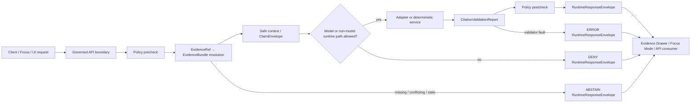

<!-- [KFM_META_BLOCK_V2]
doc_id: kfm://doc/<TODO-VERIFY-UUID>
title: runtime
type: standard
version: v1
status: draft
owners: @bartytime4life
created: <TODO-VERIFY-CREATED-DATE>
updated: 2026-04-23
policy_label: public
related: [../README.md, ../../README.md, ../../../README.md, ../../vocab/README.md, ../../../tests/README.md, ../../../../contracts/README.md, ../../../../policy/README.md, ../../../../tests/README.md, ../../../../docs/standards/README.md, ../../../../.github/workflows/README.md, ../../../../tests/e2e/runtime_proof/README.md, ./runtime_response_envelope.schema.json]
tags: [kfm, schemas, contracts, runtime, RuntimeResponseEnvelope]
notes: [doc_id and created date need verification, owner inherited from supplied repo-derived README and must be rechecked in the active checkout, schema-home authority between contracts and schemas remains unresolved, runtime_response_envelope.schema.json field-level body needs active-branch verification]
[/KFM_META_BLOCK_V2] -->

<a id="top"></a>

# `runtime`

Runtime contract-family lane for accountable outward outcomes, finite trust-visible result states, and cite-or-abstain behavior under `schemas/contracts/v1/`.

> **Status:** experimental  
> **Owners:** @bartytime4life — **NEEDS VERIFICATION** in the active checkout  
> **Path:** `schemas/contracts/v1/runtime/README.md`  
> **Repo fit:** child lane of [`../README.md`](../README.md) inside the `schemas/contracts/v1/` family; broader schema context at [`../../README.md`](../../README.md) and [`../../../README.md`](../../../README.md); root contract context at [`../../../../contracts/README.md`](../../../../contracts/README.md); policy context at [`../../../../policy/README.md`](../../../../policy/README.md); verification context at [`../../../../tests/README.md`](../../../../tests/README.md); downstream schema file at [`./runtime_response_envelope.schema.json`](./runtime_response_envelope.schema.json).  
> 
> 
> 
> 
>   
> **Quick jump:** [Scope](#scope) · [Repo fit](#repo-fit) · [Accepted inputs](#accepted-inputs) · [Exclusions](#exclusions) · [Directory tree](#directory-tree) · [Quickstart](#quickstart) · [Runtime envelope minimums](#runtime-envelope-minimums) · [Diagram](#diagram) · [Operating tables](#operating-tables) · [Definition of done](#definition-of-done) · [FAQ](#faq) · [Appendix](#appendix)

> [!IMPORTANT]
> This lane names the outward runtime contract. It does **not** prove that runtime emitters, Focus Mode, citation checks, model adapters, policy bundles, or merge-blocking workflow gates are already enforced. Treat implementation claims as **NEEDS VERIFICATION** until the active repo branch, tests, workflow YAML, emitted envelopes, and runtime traces are inspected.

---

## Scope

This directory exists to hold runtime-facing contract shape for KFM responses after evidence, policy, release, and citation checks have had a chance to act.

The central contract family is `RuntimeResponseEnvelope`: the boundary between “the system said something” and “KFM can explain why that statement, abstention, denial, or error was allowed to appear.”

In KFM terms, a runtime response must stay reconstructable to:

- resolved evidence, not raw unsupported text;
- source role and release scope;
- policy decision, reason, and obligation grammar;
- citation validation status;
- freshness and time basis;
- review, correction, and rollback visibility;
- audit or receipt references where the implementation emits them.

This README is intentionally narrow. It is a contract-family guide, not a runtime implementation manual.

[Back to top](#top)

---

## Repo fit

`runtime/` sits at the edge of machine contracts and user-visible behavior. It should remain downstream of evidence and policy, and upstream of Focus Mode, Evidence Drawer, API responses, and runtime-proof tests.

| Neighbor | Link | Relationship |
| --- | --- | --- |
| Parent v1 contract family | [`../README.md`](../README.md) | Runtime belongs to the first-wave versioned schema family. |
| Schema-contract parent | [`../../README.md`](../../README.md) | Keeps machine-file placement visible while schema-home authority remains under review. |
| Root schema surface | [`../../../README.md`](../../../README.md) | Owns the broader schema boundary and should remain singular if file homes change. |
| Runtime schema | [`./runtime_response_envelope.schema.json`](./runtime_response_envelope.schema.json) | Machine-readable contract target for outward runtime envelopes. |
| Shared vocab | [`../../vocab/README.md`](../../vocab/README.md) | Reason codes, obligation codes, and reviewer-role vocabulary should prevent free-text drift. |
| Evidence contracts | [`../evidence/README.md`](../evidence/README.md) | Runtime envelopes should point to resolved evidence rather than redefining evidence payloads. |
| Policy contracts | [`../policy/README.md`](../policy/README.md) | Runtime outcomes must reflect allow/deny/review obligations from policy decisions. |
| Release contracts | [`../release/README.md`](../release/README.md) | Public runtime answers must stay release-state-aware. |
| Correction contracts | [`../correction/README.md`](../correction/README.md) | Runtime output should keep supersession, withdrawal, and correction visible. |
| Root contracts | [`../../../../contracts/README.md`](../../../../contracts/README.md) | Human-readable trust-object meaning may still lean on root contract docs. |
| Root tests | [`../../../../tests/README.md`](../../../../tests/README.md) | Runtime schema proof belongs in tests, not in this README. |
| Runtime proof | [`../../../../tests/e2e/runtime_proof/README.md`](../../../../tests/e2e/runtime_proof/README.md) | Whole-path request/response evidence should live there when present. |
| Workflow inventory | [`../../../../.github/workflows/README.md`](../../../../.github/workflows/README.md) | Merge-gate claims must be verified against actual workflow YAML, not inferred from docs. |

> [!NOTE]
> The supplied project evidence reports a visible `schemas/contracts/v1/runtime/` lane and a `runtime_response_envelope.schema.json` file, while also warning that schema-home authority between `contracts/` and `schemas/` remains unresolved. Keep that tension visible until an ADR or active-branch convention resolves it.

[Back to top](#top)

---

## Accepted inputs

This lane should accept only small, explicit materials that clarify runtime contract shape without turning the directory into an implementation, fixture, policy, or release bucket.

| Input class | Examples | Why it belongs here | Status |
| --- | --- | --- | --- |
| Runtime schema files | `runtime_response_envelope.schema.json` | Defines outward envelope shape for API/UI/runtime consumers. | **CONFIRMED surface / NEEDS VERIFICATION field depth** |
| Runtime README guidance | outcome grammar, placement rules, contract boundaries | Keeps contributors from placing handlers, model code, or proof packs here. | **CONFIRMED doc role** |
| Schema-adjacent notes | field minimums, versioning notes, links to vocab | Helps reviewers inspect schema intent before implementation hardens. | **PROPOSED / REVIEW** |
| Contract examples, when repo convention allows | tiny `valid` / `invalid` examples linked from schema-side fixtures | Useful for schema pressure, but fixture home must be verified first. | **NEEDS VERIFICATION** |
| Cross-link updates | links to EvidenceBundle, DecisionEnvelope, policy, release, correction | Runtime envelopes only make sense when their dependencies remain navigable. | **CONFIRMED design need** |

[Back to top](#top)

---

## Exclusions

| What does **not** belong here | Put it here instead | Reason |
| --- | --- | --- |
| API route handlers, services, middleware, resolver code | `apps/`, `packages/`, or repo-native implementation lane once verified | This directory is contract shape, not runtime execution. |
| Model adapters, prompt templates, embedding code, inference clients | governed AI package or adapter lane once verified | Runtime contracts must not become a direct model-client path. |
| Canonical evidence payload definitions | [`../evidence/README.md`](../evidence/README.md) | Runtime envelopes reference evidence; they do not own evidence truth. |
| Policy bundles, Rego rules, deny logic | [`../../../../policy/README.md`](../../../../policy/README.md) | Policy owns allow/deny/review obligations and reason grammar. |
| Release proof packs and publication manifests | [`../release/README.md`](../release/README.md), release/proof surfaces once verified | Runtime answers must consume release state, not publish it. |
| Correction notices and rollback receipts | [`../correction/README.md`](../correction/README.md) | Corrections are related state, not runtime schema authority. |
| End-to-end request/response artifacts | [`../../../../tests/e2e/runtime_proof/README.md`](../../../../tests/e2e/runtime_proof/README.md) | Whole-path proof should not be hidden inside schema docs. |
| Broad test strategy and CI gates | [`../../../../tests/README.md`](../../../../tests/README.md), [`../../../../.github/workflows/README.md`](../../../../.github/workflows/README.md) | Merge-blocking behavior requires active workflow evidence. |
| Claims that runtime behavior is already enforced | Nowhere until code, tests, workflow, and runtime artifacts verify it | KFM should not upgrade doctrine into implementation through tone. |

[Back to top](#top)

---

## Directory tree

```text
schemas/contracts/v1/runtime/
├── ecology_evidence_bundle_response.schema.json
├── ecology_evidence_drawer.schema.json
├── README.md
└── runtime_response_envelope.schema.json
```

| Path | Role | Current posture |
| --- | --- | --- |
| `ecology_evidence_bundle_response.schema.json` | Contract for governed ecology API EvidenceBundle payloads (`cite`/`abstain`). | **Draft, CI-validated in boundary tests** |
| `ecology_evidence_drawer.schema.json` | Contract for UI-facing ecology Evidence Drawer payloads. | **Draft, CI-validated in boundary tests** |
| `README.md` | Human-readable boundary guide for the runtime contract family. | **Draft revision** |
| `runtime_response_envelope.schema.json` | Machine-readable target for finite runtime outcome envelopes. | **NEEDS VERIFICATION** for field-level schema body in active checkout |

> [!WARNING]
> Do not add parallel `RuntimeResponseEnvelope` definitions in multiple homes. If the active repo proves that `contracts/` is canonical instead of `schemas/contracts/v1/`, resolve through ADR and migration notes rather than maintaining duplicate schema authority.

[Back to top](#top)

---

## Quickstart

Run these from the repository root unless noted.

### 1. Inspect the runtime lane

```bash
sed -n '1,260p' schemas/contracts/v1/runtime/README.md
cat schemas/contracts/v1/runtime/runtime_response_envelope.schema.json
```

### 2. Inspect parent and neighbor contract surfaces

```bash
sed -n '1,260p' schemas/contracts/v1/README.md
sed -n '1,220p' schemas/contracts/README.md
sed -n '1,220p' schemas/README.md
sed -n '1,220p' contracts/README.md
sed -n '1,220p' policy/README.md
```

### 3. Find runtime fixtures before assuming their home

```bash
find schemas/tests/fixtures/contracts/v1 -maxdepth 4 -type f 2>/dev/null | sort
find tests/fixtures/contracts -maxdepth 4 -type f 2>/dev/null | sort
find tests/contracts -maxdepth 4 -type f 2>/dev/null | sort
```

### 4. Search for outcome grammar and downstream consumers

```bash
grep -RInE \
  'RuntimeResponseEnvelope|runtime_response|ANSWER|ABSTAIN|DENY|ERROR|EvidenceBundle|DecisionEnvelope|CitationValidationReport|PolicyDecision|FocusQueryResponse|EvidenceDrawerPayload' \
  schemas contracts policy tests docs apps packages 2>/dev/null || true
```

### 5. Verify workflow claims separately

```bash
find .github/workflows -maxdepth 2 -type f 2>/dev/null | sort
sed -n '1,220p' .github/workflows/README.md 2>/dev/null || true
```

> [!CAUTION]
> These commands prove presence, absence, and text references. They do not prove that the active branch enforces the full runtime trust path unless tests, workflow gates, and emitted artifacts also confirm it.

[Back to top](#top)

---

## Usage

### When changing the runtime schema

1. Start from the outward trust question: what must a public or semi-public surface know before it displays a result?
2. Link every new field to an upstream object or controlled vocabulary where possible.
3. Add or update at least one valid and one invalid example in the repo’s verified fixture home.
4. Add a negative-path expectation for at least one of `ABSTAIN`, `DENY`, or `ERROR`.
5. Keep release, correction, evidence, policy, and audit references as references unless the schema contract explicitly requires embedded summaries.
6. Update this README when the field changes contributor obligations.

### When consuming the runtime schema

1. Treat `RuntimeResponseEnvelope` as a boundary object, not a claim source.
2. Resolve `EvidenceRef` to `EvidenceBundle` server-side before allowing an answer.
3. Preserve finite outcomes exactly: `ANSWER`, `ABSTAIN`, `DENY`, `ERROR`.
4. Render negative states visibly; do not collapse them into generic failure text.
5. Do not allow browser clients, map renderers, or model adapters to bypass governed API policy checks.
6. Keep generated language subordinate to evidence, policy, and citation validation.

### When adding examples

Use examples to clarify behavior, not to smuggle in implementation claims.

```json
{
  "example_status": "PROPOSED_SHAPE_ONLY",
  "outcome": "ANSWER",
  "evidence_bundle_refs": ["kfm://evidence-bundle/<id>"],
  "decision_envelope_ref": "kfm://decision/<id>",
  "citation_validation_ref": "kfm://validation/<id>",
  "policy_decision_ref": "kfm://policy-decision/<id>",
  "release_ref": "kfm://release/<id>",
  "audit_ref": "kfm://receipt/<id>"
}
```

> [!NOTE]
> The example above is illustrative. It is not a substitute for the checked-in JSON Schema and must not be cited as proof that runtime emitters produce this exact payload.

[Back to top](#top)

---

## Runtime envelope minimums

Until the machine schema is field-complete and validated, treat this as the review checklist for `RuntimeResponseEnvelope`.

| Field / concern | Minimum expectation | Why it matters |
| --- | --- | --- |
| Stable envelope identity | `envelope_id` or equivalent deterministic/auditable id | Lets receipts, logs, tests, and UI states point to the same response. |
| Schema/version marker | versioned contract reference | Prevents silent drift across consumers. |
| Request linkage | request id, route/surface, actor class where safe | Supports audit and debugging without leaking sensitive actor data. |
| Finite outcome | exactly one of `ANSWER`, `ABSTAIN`, `DENY`, `ERROR` | Keeps negative states first-class and reviewable. |
| Safe payload | bounded answer or safe object summary only when allowed | Prevents answer text from becoming sovereign truth. |
| Reasons | stable reason codes for abstain/deny/error | Makes refusals inspectable, not mysterious. |
| Obligations | required actions such as citation, review, redaction, audit | Carries policy consequences downstream. |
| Evidence linkage | `EvidenceRef` / `EvidenceBundle` refs or safe summaries | Keeps runtime output reconstructable. |
| Decision linkage | `DecisionEnvelope` / `PolicyDecision` refs or summaries | Shows why the result was allowed, abstained, denied, or failed. |
| Citation validation | validation status or report ref | Prevents unsupported generated claims from passing as answers. |
| Release state | release id, publication scope, rollback/correction visibility | Keeps public answers tied to governed release state. |
| Freshness and time basis | observed, valid, publication, or retrieval time as applicable | Avoids stale or temporally ambiguous claims. |
| Rights and sensitivity summary | public-safe status, redaction/generalization notes | Prevents silent publication of restricted material. |
| Audit linkage | run receipt, AI receipt, request log, or equivalent ref where emitted | Supports review, rollback, and incident analysis. |

[Back to top](#top)

---

## Diagram



The diagram is contract-oriented. It describes the expected responsibility boundaries, not proof that each implementation component exists on the active branch.

[Back to top](#top)

---

## Operating tables

### Outcome grammar

| Outcome | Use when | Must include | Must not do |
| --- | --- | --- | --- |
| `ANSWER` | Released, policy-safe, citation-valid evidence supports the response. | evidence refs, decision/policy state, citations, release/freshness basis | invent support, hide caveats, bypass review state |
| `ABSTAIN` | Evidence is missing, insufficient, conflicting, stale, or not role-appropriate. | reason code, missing/insufficient support summary, safe next review cue | substitute generic prose for absent evidence |
| `DENY` | Policy, rights, sensitivity, access, steward, or surface rule blocks the response. | stable deny reason, obligations if any, safe explanation | leak restricted data through the denial |
| `ERROR` | Validator, runtime, dependency, schema, or system fault prevents a governed result. | error class safe for audience, trace/audit ref where available | turn a system failure into an uncited answer |

### Contract boundaries

| Concern | Runtime lane responsibility | Owned elsewhere |
| --- | --- | --- |
| Evidence truth | reference resolved evidence and cite support | `../evidence/`, source descriptors, catalog/proof surfaces |
| Policy truth | carry decisions, reasons, and obligations | `../policy/`, root `policy/` |
| Release truth | identify release scope and correction state | `../release/`, `../correction/` |
| Model behavior | require bounded output and citation validation | governed AI adapter packages, tests, receipts |
| UI behavior | expose finite outcome and trust state | web/app shell, Focus Mode, Evidence Drawer |
| Verification | provide schema target and expectations | `tests/contracts/`, `tests/e2e/runtime_proof/`, workflow gates |

### Review labels

| Label | Meaning here |
| --- | --- |
| **CONFIRMED** | Verified from active checkout, checked-in file, test, workflow, emitted artifact, or supplied repo-derived snapshot explicitly treated as such. |
| **INFERRED** | Strongly supported by adjacent docs or doctrine, but not directly proven in active implementation. |
| **PROPOSED** | Recommended shape or behavior not yet verified as implemented. |
| **UNKNOWN** | Not verifiable from the available evidence. |
| **NEEDS VERIFICATION** | Specific active-branch, workflow, schema, owner, or runtime check required before merging or publishing claims. |

[Back to top](#top)

---

## Definition of done

A runtime-contract change is not ready just because the README reads well.

- [ ] Active checkout confirms the target path and owner expectations.
- [ ] `runtime_response_envelope.schema.json` is field-level meaningful, or this README clearly marks it as a placeholder.
- [ ] Valid and invalid examples exist in the verified fixture home.
- [ ] At least one positive path and one negative path are testable.
- [ ] `ANSWER`, `ABSTAIN`, `DENY`, and `ERROR` remain the only runtime outcomes unless an ADR changes the vocabulary.
- [ ] Policy reasons and obligations use controlled vocabulary where available.
- [ ] Evidence refs resolve to EvidenceBundle-compatible objects in test or fixture scope.
- [ ] Citation validation failure cannot produce an `ANSWER`.
- [ ] Rights, sensitivity, freshness, and review state are visible enough for downstream UI/API consumers.
- [ ] Runtime consumers do not call model providers, vector stores, raw stores, canonical stores, or object stores directly from public clients.
- [ ] Release and correction state are represented or explicitly marked not applicable for the fixture.
- [ ] CI/workflow enforcement claims are backed by actual workflow YAML or marked **NEEDS VERIFICATION**.
- [ ] Rollback is simple: revert schema/doc/fixture/test changes without data migration or publication side effects.

[Back to top](#top)

---

## FAQ

### Is `RuntimeResponseEnvelope` the truth source?

No. It is a runtime boundary object. EvidenceBundle, policy decisions, release state, and citation validation outrank generated or displayed language.

### Can a map popup use this contract?

Yes, when the popup is presenting a consequential claim or finite runtime outcome. The popup should consume governed envelope data or an Evidence Drawer payload, not raw feature properties as truth.

### Can Focus Mode answer without evidence?

No. It should return `ABSTAIN` for insufficient evidence, `DENY` for policy/access blocks, or `ERROR` for system faults. It should not produce fluent unsupported text.

### Does this README prove runtime behavior exists?

No. It defines the lane’s contract role and review expectations. Runtime behavior requires implementation evidence: source files, tests, workflow gates, fixtures, emitted envelopes, logs, or proof artifacts.

### Where should a new runtime proof case go?

Start by checking the repo’s active fixture and test convention. In principle, contract-shape examples belong near schema fixtures, contract validation belongs under contract tests, and whole-path request/response proof belongs under runtime-proof or e2e tests.

[Back to top](#top)

---

## Appendix

<details>
<summary>Runtime extension checklist</summary>

Use this before adding a new runtime field or outcome-adjacent behavior.

1. Name the trust problem the field solves.
2. Identify the upstream object that owns the truth.
3. Confirm whether the value should be embedded, summarized, or referenced.
4. Check whether a shared vocabulary already exists.
5. Add valid and invalid examples.
6. Add a negative test if the field is missing, malformed, stale, restricted, or contradictory.
7. Confirm downstream UI/API behavior stays finite and visible.
8. Update docs only after schema and test expectations are clear.
9. Mark any unverified branch, owner, workflow, or runtime claim as **NEEDS VERIFICATION**.

</details>

<details>
<summary>Anti-patterns to reject</summary>

- A browser client calling a model provider directly.
- A map renderer deciding source authority, policy, or release state.
- An `ANSWER` without evidence refs or citation validation.
- A denial that leaks restricted evidence.
- A runtime schema duplicated under multiple contract homes without an ADR.
- A placeholder schema described as enforced.
- A fixture that passes only because policy, citation, or freshness checks are absent.
- A generated summary treated as a release, proof pack, or canonical record.

</details>

<details>
<summary>Useful search strings</summary>

```bash
grep -RInE 'RuntimeResponseEnvelope|runtime_response_envelope|ANSWER|ABSTAIN|DENY|ERROR' schemas contracts tests policy docs apps packages 2>/dev/null || true
grep -RInE 'EvidenceBundle|EvidenceRef|DecisionEnvelope|PolicyDecision|CitationValidationReport' schemas contracts tests policy docs apps packages 2>/dev/null || true
grep -RInE 'no-direct-model-client|raw|work|quarantine|release_state|correction_state|freshness' tests policy docs apps packages 2>/dev/null || true
```

</details>

[Back to top](#top)
