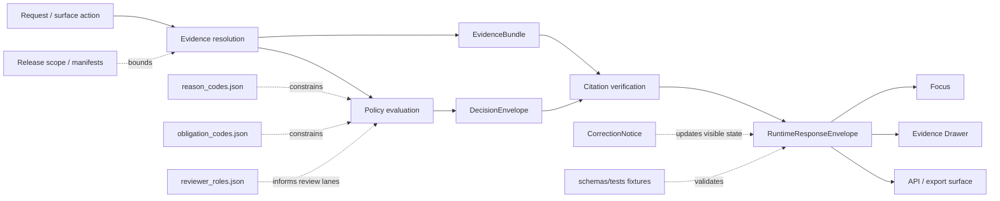

<!-- [KFM_META_BLOCK_V2]
doc_id: kfm://doc/<TODO-VERIFY-UUID>
title: runtime
type: standard
version: v1
status: draft
owners: @bartytime4life
created: <TODO-VERIFY-CREATED-DATE>
updated: 2026-03-28
policy_label: public
related: [../README.md, ../../README.md, ../../vocab/README.md, ../../../tests/README.md, ../../../../contracts/README.md, ../../../../policy/README.md, ../../../../tests/README.md, ../../../../.github/workflows/README.md, ./runtime_response_envelope.schema.json]
tags: [kfm, schemas, contracts, runtime]
notes: [doc_id and created date need verification, current public schema body is {}, schema-home authority between contracts and schemas remains unresolved]
[/KFM_META_BLOCK_V2] -->

# `runtime`

Runtime contract-family lane for accountable outward outcomes, trust-visible surface state, and cite-or-abstain behavior under `schemas/contracts/v1/`.

> **Status:** experimental  
> **Owners:** @bartytime4life *(via `.github/CODEOWNERS` global fallback; narrower `/schemas/` ownership is not separately verified here)*  
> **Path:** `schemas/contracts/v1/runtime/README.md`  
> **Repo fit:** child lane of [`../README.md`](../README.md) inside the live `schemas/contracts/v1/` inventory; broader contract context in [`../../README.md`](../../README.md) and [`../../../../contracts/README.md`](../../../../contracts/README.md); adjacent runtime neighbors in [`../evidence/README.md`](../evidence/README.md), [`../policy/README.md`](../policy/README.md), [`../release/README.md`](../release/README.md), and [`../../vocab/README.md`](../../vocab/README.md); downstream machine file in [`./runtime_response_envelope.schema.json`](./runtime_response_envelope.schema.json).  
>      
> **Quick jump:** [Scope](#scope) · [Repo fit](#repo-fit) · [Inputs](#inputs) · [Exclusions](#exclusions) · [Current verified snapshot](#current-verified-snapshot) · [Quickstart](#quickstart) · [Diagram](#diagram) · [Definition of done](#definition-of-done) · [FAQ](#faq)

> [!IMPORTANT]
> Current public `main` already contains this lane and [`./runtime_response_envelope.schema.json`](./runtime_response_envelope.schema.json), but the schema body is still placeholder-only (`{}`). This README should therefore make the lane legible **without** pretending the contract is already fully encoded.

> [!WARNING]
> Do **not** treat branch-visible file presence as proof that runtime outcomes, citation checks, Focus behavior, or merge gates are already enforced in code. The attached KFM corpus makes those behaviors doctrinally explicit, while the current public repository still leaves important implementation evidence unproven.

## Scope

This directory exists to hold the `runtime` contract family for outward response accountability.

In KFM terms, this is the lane where a runtime-facing contract such as `RuntimeResponseEnvelope` should make an answer, abstention, denial, or error reconstructable to evidence, policy, release scope, and audit linkage. It is the contract boundary between “the system said something” and “the repo can explain exactly why that statement was allowed to appear.”

This README covers three things only:

1. what this lane is for,
2. what the current public repository actually proves today,
3. what still has to be surfaced before stronger implementation claims become safe.

## Repo fit

| Aspect | Value |
|---|---|
| Lane path | `schemas/contracts/v1/runtime/` |
| Parent inventory | [`../README.md`](../README.md) |
| Broader contract surface | [`../../README.md`](../../README.md), [`../../../../contracts/README.md`](../../../../contracts/README.md) |
| Sibling lanes | [`../common/README.md`](../common/README.md), [`../data/README.md`](../data/README.md), [`../evidence/README.md`](../evidence/README.md), [`../policy/README.md`](../policy/README.md), [`../release/README.md`](../release/README.md), [`../source/README.md`](../source/README.md), [`../correction/README.md`](../correction/README.md) |
| Vocabulary registries | [`../../vocab/README.md`](../../vocab/README.md) |
| Validation surfaces | [`../../../tests/README.md`](../../../tests/README.md), [`../../../../tests/README.md`](../../../../tests/README.md), [`../../../../.github/workflows/README.md`](../../../../.github/workflows/README.md) |
| Machine file in this lane | [`./runtime_response_envelope.schema.json`](./runtime_response_envelope.schema.json) |

The contract-family split matters here:

- `runtime/` is where outward runtime accountability belongs.
- `evidence/` is where support packaging belongs.
- `policy/` is where decision grammar belongs.
- `release/` is where publishable proof and release scope belong.
- `correction/` is where visible lineage under change belongs.

`runtime/` should consume those neighboring lanes, not collapse them into one file.

## Inputs

Accepted inputs for this lane are narrow by design.

| What belongs here | Why it belongs here |
|---|---|
| Human-readable explanation of the `RuntimeResponseEnvelope` contract family | This lane is the reader-facing boundary for runtime outcome accountability. |
| Machine schema for `runtime_response_envelope` | The lane needs a concrete schema body once the placeholder state is retired. |
| Runtime-specific examples and fixtures | This is where answer / abstain / deny / error examples become inspectable and testable. |
| Cross-links to evidence, policy, release, and correction neighbors | A runtime envelope is only meaningful when it can point to the objects that scoped it. |
| Truth-status notes (`CONFIRMED`, `INFERRED`, `PROPOSED`, `UNKNOWN`, `NEEDS VERIFICATION`) | This repo explicitly distinguishes doctrine, scaffold state, and mounted proof. |

## Exclusions

| What does **not** belong here | Put it here instead |
|---|---|
| API handler code, resolver services, model adapters, UI components | `apps/`, `packages/`, or another mounted implementation lane once verified |
| Policy bundles and decision logic as executable rules | [`../../../../policy/README.md`](../../../../policy/README.md) and its implementation surfaces |
| Canonical evidence payload definitions | [`../evidence/README.md`](../evidence/README.md) |
| Release proof packs, publication manifests, rollback receipts | [`../release/README.md`](../release/README.md) |
| Correction workflow artifacts and supersession notices | [`../correction/README.md`](../correction/README.md) |
| Broad repo-wide test strategy | [`../../../../tests/README.md`](../../../../tests/README.md) |
| Claims that the current public branch already enforces runtime behavior end to end | Nowhere until code, tests, and workflow evidence are surfaced |

## Current verified snapshot

| Observation | Status | Why it matters |
|---|---|---|
| `schemas/contracts/v1/runtime/` exists on the current public branch | **CONFIRMED** | This lane is branch-visible, not hypothetical. |
| `README.md` currently contains scaffold-only placeholder text | **CONFIRMED** | This file needs a real contract-family explanation. |
| `runtime_response_envelope.schema.json` exists | **CONFIRMED** | A machine-file placeholder is already present in the expected lane. |
| `runtime_response_envelope.schema.json` currently has body `{}` | **CONFIRMED** | The runtime contract is not yet encoded at field level on the public branch. |
| Parent `schemas/contracts/v1/` inventory exists and lists all family lanes | **CONFIRMED** | Runtime should align with the visible `v1/` family structure rather than invent a new one. |
| `schemas/contracts/vocab/` is visible with reason/obligation/reviewer registries | **CONFIRMED** | Runtime can link to machine vocab instead of free-text drift. |
| `schemas/tests/fixtures/contracts/v1/{valid,invalid}` exists | **CONFIRMED** | There is a visible fixture landing zone for contract examples. |
| Runtime-specific valid/invalid fixture files are already present | **UNKNOWN** | Directory presence does not prove this lane has its own examples yet. |
| Current public `main` proves an active merge-blocking runtime workflow | **UNKNOWN** | `.github/workflows/` is still README-only on the public branch. |
| Canonical schema authority between `contracts/` and `schemas/` is fully settled | **NEEDS VERIFICATION** | Adjacent docs still treat schema-home authority as unresolved. |

> [!NOTE]
> When broader inventory prose and the mounted branch tree diverge, prefer the most specific current lane docs plus the visible tree, then keep any remaining disagreement visible as `NEEDS VERIFICATION`.

## Directory tree

```text
schemas/contracts/v1/runtime/
├── README.md
└── runtime_response_envelope.schema.json
```

## Quickstart

Inspect the lane as it exists now:

```bash
sed -n '1,200p' schemas/contracts/v1/runtime/README.md
cat schemas/contracts/v1/runtime/runtime_response_envelope.schema.json
```

Inspect the parent inventory and adjacent contract context:

```bash
sed -n '1,240p' schemas/contracts/v1/README.md
sed -n '1,240p' schemas/contracts/README.md
sed -n '1,240p' policy/README.md
sed -n '1,240p' .github/workflows/README.md
```

Inspect vocab and fixture landing zones that this lane should eventually connect to:

```bash
sed -n '1,200p' schemas/contracts/vocab/README.md
find schemas/tests/fixtures/contracts/v1 -maxdepth 2 -type d | sort
```

> [!NOTE]
> If you are checking a non-`main` branch or a local worktree, always prefer the branch tree in front of you over older inventory prose. This lane should track mounted repo reality, not historical placeholder wording.

## Usage

Use this README as the human contract map for `runtime_response_envelope.schema.json`.

A safe reading order is:

1. read this lane README for current-state truth and exclusions,
2. read [`../README.md`](../README.md) for family-level context,
3. inspect [`./runtime_response_envelope.schema.json`](./runtime_response_envelope.schema.json),
4. inspect [`../../vocab/README.md`](../../vocab/README.md) plus the visible JSON registries,
5. inspect [`../../../tests/README.md`](../../../tests/README.md) and [`../../../../tests/README.md`](../../../../tests/README.md) before claiming fixture or gate coverage.

A safe writing order is:

1. retire the `{}` placeholder in the schema,
2. anchor the field set to doctrine-backed minimums,
3. add valid and invalid fixtures,
4. add runtime citation-negative and outcome-shape tests,
5. only then promote stronger language about enforcement.

### Family boundary map

| Neighbor lane | Runtime dependency |
|---|---|
| [`../evidence/README.md`](../evidence/README.md) | Runtime answers should resolve an `EvidenceBundle`, not improvise support. |
| [`../policy/README.md`](../policy/README.md) | Runtime outcomes need reason / obligation / decision linkage. |
| [`../release/README.md`](../release/README.md) | Runtime scope should stay inside released material and visible freshness rules. |
| [`../correction/README.md`](../correction/README.md) | Withdrawn, superseded, narrowed, or stale material must remain visible at runtime surfaces. |
| [`../../vocab/README.md`](../../vocab/README.md) | Runtime should reuse shared registries rather than invent lane-local free text. |

## Runtime envelope minimums

The attached KFM corpus defines the **minimum purpose** of `RuntimeResponseEnvelope` as: **make runtime outcome accountable**.

The corpus also gives a **minimum contents** list. The middle column below uses illustrative JSON member names only. Those names are **PROPOSED naming aids**, not confirmed current repo keys.

| Doctrinal minimum element | Illustrative JSON member (PROPOSED) | Why it must be visible here |
|---|---|---|
| schema version | `schema_version` | Distinguishes envelope evolution over time. |
| object type | `object_type` | Makes the envelope identifiable as a contract object. |
| audit_ref | `audit_ref` | Ties runtime behavior to audit reconstruction. |
| request_id | `request_id` | Keeps one evaluation traceable as one event. |
| evaluated-at time | `evaluated_at` | Binds the outcome to time and freshness context. |
| surface class | `surface_class` | Distinguishes Focus, API, export, or other trust-visible surfaces. |
| surface state | `surface_state` | Keeps promoted / generalized / partial / stale-visible / withdrawn states visible. |
| result | `result` | Must resolve to a finite runtime outcome. |
| citations check | `citations_check` | Makes citation verification inspectable rather than implied. |
| decision ref | `decision_ref` | Links the response to policy or review decision state. |

### Runtime outcomes

| Outcome | What it means here | Must fail closed? |
|---|---|---|
| `ANSWER` | A scoped response may appear because evidence and policy checks passed. | Yes |
| `ABSTAIN` | The system should not answer because support, scope, or confidence is insufficient. | Yes |
| `DENY` | The requested action or surface is blocked by policy. | Yes |
| `ERROR` | The system cannot safely complete the request path. | Yes |

### Surface states that should remain visible

| State | Why it matters |
|---|---|
| promoted | User is seeing released scope, not an unpublished candidate. |
| generalized | Precision or detail has been reduced intentionally. |
| partial | Coverage is incomplete and must not be implied as complete. |
| stale-visible | Material may be shown, but freshness limits are already exceeded. |
| source-dependent | The object depends on a source-bound or unresolved external state. |
| conflicted | Supporting material does not yet resolve cleanly. |
| withdrawn | The surface must show visible withdrawal rather than silent disappearance. |
| denied | The system intentionally blocked the outward action. |
| abstained | The system intentionally declined to answer. |

> [!TIP]
> Negative outcomes are part of the runtime contract, not an embarrassing edge path. A good runtime lane makes refusal legible.

## Diagram



## Tables that matter operationally

### What the public branch proves today vs. what it does not

| Claim | Read it as |
|---|---|
| “This runtime lane exists.” | **CONFIRMED** |
| “This runtime schema is fully specified.” | **False on current public evidence** |
| “Runtime outcomes are doctrinally defined.” | **CONFIRMED doctrine** |
| “Runtime outcomes are proven in mounted implementation.” | **UNKNOWN** |
| “A fixture landing zone exists.” | **CONFIRMED** |
| “Runtime-specific fixtures and merge gates already exist.” | **UNKNOWN / NEEDS VERIFICATION** |

### Minimum neighboring proof objects once this lane matures

| Object family | Expected relationship to runtime |
|---|---|
| `EvidenceBundle` | Supplies inspectable support for outward claims. |
| `DecisionEnvelope` | Explains why the surface was allowed, denied, or constrained. |
| `ReleaseManifest` / proof pack | Proves the response operated inside a released scope. |
| `CorrectionNotice` | Preserves visible lineage when prior runtime-visible material changes. |
| `audit_ref` joins | Connect logs, traces, policy decisions, and surfaced outcomes. |

## Definition of done

A stronger `runtime/` lane is ready when all of the following are true:

- [ ] `runtime_response_envelope.schema.json` is no longer `{}`.
- [ ] The schema encodes the doctrine-backed minimum envelope elements.
- [ ] Result values are constrained to finite runtime outcomes.
- [ ] Surface-state handling is documented and testable.
- [ ] At least one valid runtime fixture exists.
- [ ] At least one invalid runtime fixture exists.
- [ ] Runtime citation-negative behavior is tested somewhere visible.
- [ ] README language matches mounted tree reality and does not outrun proof.
- [ ] Links to vocab, evidence, policy, release, and correction lanes remain current.
- [ ] Any stronger claim about Focus, API behavior, or merge-blocking enforcement is backed by visible code, tests, or workflows.

## FAQ

### Is this lane authoritative today?

The lane is **branch-visible and real**, but its current machine schema is still scaffold-state. Treat the existence of the lane as **CONFIRMED** and full field-level authority as **NEEDS VERIFICATION**.

### Does the current public branch prove runtime answer / abstain / deny / error behavior end to end?

No. The doctrine is explicit, but the current public branch does not by itself prove mounted implementation, runtime fixtures, or merge-blocking workflow enforcement for this lane.

### Why keep `runtime/` separate from `evidence/`, `policy/`, and `release/`?

Because a runtime envelope should report how an outward result was allowed to happen; it should not silently absorb evidence packaging, decision grammar, or publication proof into one uninspectable blob.

### Where should runtime fixtures live?

The visible local scaffold is under [`../../../tests/fixtures/contracts/v1/`](../../../tests/fixtures/contracts/v1/). Broader harness and end-to-end verification belong in the stronger repo-wide test surfaces under [`../../../../tests/README.md`](../../../../tests/README.md) and any real workflow gates that are later surfaced.

### Should this README define literal final JSON keys right now?

Not unless the mounted schema body, fixtures, or tests prove them. This file may describe doctrinal minimums and carefully labeled illustrative naming, but it should not smuggle placeholder names into “implemented fact.”

## Appendix

<details>
<summary><strong>Observed lane inventory and nearby surfaces</strong></summary>

### Observed lane inventory

```text
schemas/contracts/v1/
├── common/
├── correction/
├── data/
├── evidence/
├── policy/
├── release/
├── runtime/
└── source/
```

### Files worth opening before changing this lane

- [`../README.md`](../README.md)
- [`../../README.md`](../../README.md)
- [`../../vocab/README.md`](../../vocab/README.md)
- [`../../../tests/README.md`](../../../tests/README.md)
- [`../../../../tests/README.md`](../../../../tests/README.md)
- [`../../../../policy/README.md`](../../../../policy/README.md)
- [`../../../../.github/workflows/README.md`](../../../../.github/workflows/README.md)

### Change discipline reminder

Small, truth-preserving updates are better than decorative rewrites here. If branch reality changes, update:

1. the verified snapshot table,
2. the directory tree,
3. the definition-of-done checklist,
4. any links that would otherwise drift.

[Back to top](#runtime)

</details>
