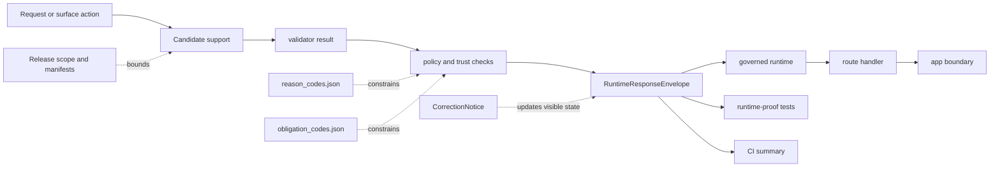

<!-- [KFM_META_BLOCK_V2]
doc_id: kfm://doc/NEEDS-VERIFICATION
title: schemas/contracts/v1/runtime
type: standard
version: v1
status: draft
owners: @bartytime4life
created: NEEDS-VERIFICATION
updated: 2026-04-16
policy_label: public
related: [../../../README.md, ../README.md, ../../README.md, ../../vocab/README.md, ../../../tests/README.md, ../../../tests/fixtures/contracts/v1/README.md, ../../../../contracts/README.md, ../../../../contracts/source/kansas_mesonet_source_descriptor.md, ../../../../schemas/README.md, ../../../../schemas/soil_moisture/README.md, ../../../../schemas/contracts/README.md, ../../../../policy/README.md, ../../../../tests/README.md, ../../../../tests/contracts/README.md, ../../../../tests/e2e/runtime_proof/soil_moisture/README.md, ../../../../tests/e2e/runtime_proof/soil_moisture/test_runtime_soil_moisture_proof.py, ../../../../tests/e2e/runtime_proof/soil_moisture/test_runtime_route_soil_moisture.py, ../../../../tests/e2e/runtime_proof/test_governed_api_app.py, ../../../../apps/governed_api/README.md, ../../../../apps/governed_api/runtime/soil_moisture_runtime.py, ../../../../tools/ci/render_runtime_proof_summary.py, ../../../../.github/workflows/README.md, ./runtime_response_envelope.schema.json]
tags: [kfm, schemas, contracts, runtime, runtime-response-envelope, soil-moisture]
notes: [
  Revised from the existing runtime-lane README baseline.
  Preserves the thin-slice reality that this lane now includes a non-placeholder runtime_response_envelope schema plus governed runtime and runtime-proof consumers in the soil-moisture slice.
  Canonical schema-home authority between root contracts/ and schemas/contracts/ remains unresolved and is kept explicit rather than silently settled here.
]
[/KFM_META_BLOCK_V2] -->

<a id="top"></a>

# `schemas/contracts/v1/runtime/`

Runtime contract-family lane for accountable outward outcomes, finite trust-visible result states, and cite-or-abstain behavior under `schemas/contracts/v1/`.

> [!NOTE]
> **Status:** `experimental`  
> **Owners:** `@bartytime4life` *(via `.github/CODEOWNERS` global fallback; narrower `/schemas/` ownership remains NEEDS VERIFICATION)*  
> **Path:** `schemas/contracts/v1/runtime/README.md`  
> 
> 
> 
> 
>   
> **Quick jumps:** [Scope](#scope) · [Current deltas](#current-deltas) · [Repo fit](#repo-fit) · [Accepted inputs](#accepted-inputs) · [Exclusions](#exclusions) · [Current verified snapshot](#current-verified-snapshot) · [Directory tree](#directory-tree) · [Quickstart](#quickstart) · [Usage](#usage) · [Runtime envelope minimums](#runtime-envelope-minimums) · [Diagram](#diagram) · [Operating tables](#operating-tables) · [Task list](#task-list--definition-of-done) · [FAQ](#faq) · [Appendix](#appendix)

> [!IMPORTANT]
> This lane is no longer just “README + placeholder schema.” In the current thin slice, `runtime_response_envelope.schema.json` now has a real first-wave body, and runtime-proof tests plus governed runtime code point at it.

> [!WARNING]
> Do **not** treat thin-slice progress as proof that all runtime emitters, all Focus behavior, all citation checks, or all merge-blocking runtime gates are already complete across the repo. The thin slice is real; the broader lane still needs branch-backed proof.

| Field | Value |
|---|---|
| Path | `schemas/contracts/v1/runtime/` |
| Role | Runtime-facing contract lane for outward `ANSWER` / `ABSTAIN` / `DENY` / `ERROR` accountability |
| Primary machine file | [`./runtime_response_envelope.schema.json`](./runtime_response_envelope.schema.json) |
| Current thin-slice consumer | [`../../../../apps/governed_api/runtime/soil_moisture_runtime.py`](../../../../apps/governed_api/runtime/soil_moisture_runtime.py) |
| Current thin-slice proof surface | [`../../../../tests/e2e/runtime_proof/soil_moisture/README.md`](../../../../tests/e2e/runtime_proof/soil_moisture/README.md) |
| Trust reminder | `runtime ≠ receipt ≠ proof ≠ catalog` |
| Authority posture | Schema-home authority between root `contracts/` and `schemas/contracts/` remains **NEEDS VERIFICATION** |

---

## Scope

This directory exists to hold the `runtime` contract family for outward response accountability.

In KFM terms, this is the lane where a runtime-facing contract such as `RuntimeResponseEnvelope` should make an answer, abstention, denial, or error reconstructable to evidence, policy, release scope, freshness basis, and audit linkage. It is the contract boundary between **“the system said something”** and **“the repo can explain exactly why that statement was allowed to appear.”**

This README should therefore do four jobs:

1. explain what this lane is for
2. record what the current thin slice actually proves
3. keep neighboring-family boundaries clear
4. state what still must be surfaced before stronger implementation claims become safe

### What changed since the older lane draft

The older README correctly described this lane as real while the machine schema body was effectively empty. The current thin slice materially changes that picture:

- `runtime_response_envelope.schema.json` now has a first-wave JSON Schema body
- governed runtime code now emits this family shape
- runtime-proof tests validate real envelopes against the schema
- app and route tests now prove runtime behavior through the governed API slice
- CI summary tooling now renders reviewer-facing runtime proof summaries

That means this README should now describe a **live thin-slice runtime contract lane**, while still keeping broader runtime claims bounded.

[Back to top](#top)

---

## Current deltas

| Delta | Why it matters now | Status |
|---|---|---|
| `README.md` in this lane was already a real boundary guide | This revision improves and reconciles the lane rather than rewriting it from zero | **CONFIRMED** |
| `runtime_response_envelope.schema.json` no longer needs to be described as `{}` in the current thin slice | Human explanation and machine contract are now closer in maturity for the first wave | **CONFIRMED in-session thin slice** |
| Runtime-proof tests now validate runtime envelopes against this schema | The contract is no longer only descriptive; it is now exercised in tests | **CONFIRMED in-session thin slice** |
| Governed runtime code now emits first-wave runtime envelopes | The lane now has a real thin-slice consumer / emitter relationship | **CONFIRMED in-session thin slice** |
| `schemas/tests/fixtures/contracts/v1/valid/` and `invalid/` remain scaffold-oriented in older repo-facing signal | Broader schema-lane runtime fixture inventory still needs verification | **CONFIRMED in older surfaced doc posture** |
| `.github/workflows/README.md` now names a runtime-proof soil-moisture workflow candidate in addition to historical runtime lane names | Runtime workflow posture has a current thin-slice lane plus historical signal | **CONFIRMED in-session thin slice + older workflow README basis** |
| `schemas/README.md` still indexes a live child subtree while root `contracts/README.md` still frames `contracts/` as the machine-readable contract backbone | Schema-home authority remains unresolved and must stay visible here | **NEEDS VERIFICATION** |

[Back to top](#top)

---

## Repo fit

This lane sits inside the visible `schemas/contracts/v1/` family and should stay aligned with that family rather than inventing a parallel runtime-contract taxonomy.

| Aspect | Value |
|---|---|
| Lane path | `schemas/contracts/v1/runtime/` |
| Parent inventory | [`../README.md`](../README.md) |
| Broader schema boundary | [`../../../README.md`](../../../README.md) |
| Broader contract surface | [`../../README.md`](../../README.md), [`../../../../contracts/README.md`](../../../../contracts/README.md) |
| Cross-cutting standards | [`../../../../docs/standards/README.md`](../../../../docs/standards/README.md) |
| Sibling lanes | [`../common/README.md`](../common/README.md), [`../data/README.md`](../data/README.md), [`../evidence/README.md`](../evidence/README.md), [`../policy/README.md`](../policy/README.md), [`../release/README.md`](../release/README.md), [`../source/README.md`](../source/README.md), [`../correction/README.md`](../correction/README.md) |
| Vocabulary registries | [`../../vocab/README.md`](../../vocab/README.md) |
| Schema-lane fixture surface | [`../../../tests/README.md`](../../../tests/README.md), [`../../../tests/fixtures/contracts/v1/README.md`](../../../tests/fixtures/contracts/v1/README.md) |
| Repo-wide verification surfaces | [`../../../../tests/README.md`](../../../../tests/README.md), [`../../../../tests/contracts/README.md`](../../../../tests/contracts/README.md) |
| Thin-slice runtime consumers | [`../../../../apps/governed_api/runtime/soil_moisture_runtime.py`](../../../../apps/governed_api/runtime/soil_moisture_runtime.py), [`../../../../tests/e2e/runtime_proof/soil_moisture/test_runtime_soil_moisture_proof.py`](../../../../tests/e2e/runtime_proof/soil_moisture/test_runtime_soil_moisture_proof.py) |
| Workflow guardrail surface | [`../../../../.github/workflows/README.md`](../../../../.github/workflows/README.md) |
| Machine file in this lane | [`./runtime_response_envelope.schema.json`](./runtime_response_envelope.schema.json) |

### Family boundary map

The contract-family split still matters:

- `runtime/` is where outward runtime accountability belongs
- `evidence/` is where support packaging belongs
- `policy/` is where decision grammar belongs
- `release/` is where publishable proof and release scope belong
- `correction/` is where visible lineage under change belongs

`runtime/` should consume those neighboring lanes, not collapse them into one file.

[Back to top](#top)

---

## Accepted inputs

Accepted inputs for this lane are narrow by design.

| What belongs here | Why it belongs here |
|---|---|
| Human-readable explanation of the `RuntimeResponseEnvelope` contract family | This lane is the reader-facing boundary for runtime outcome accountability |
| Machine schema for `runtime_response_envelope` | The lane now has a first-wave schema body and remains the natural machine-contract home for it |
| Runtime-specific examples and fixtures | This is where answer / abstain / deny / error examples become inspectable and testable |
| Cross-links to evidence, policy, release, correction, and standards neighbors | A runtime envelope is only meaningful when it can point to the objects that scoped it |
| Truth-status notes (`CONFIRMED`, `INFERRED`, `PROPOSED`, `UNKNOWN`, `NEEDS VERIFICATION`) | This repo explicitly distinguishes doctrine, scaffold state, and mounted proof |
| Boundary notes about freshness, release scope, validator seams, and audit linkage | Those are load-bearing runtime concerns, not decorative add-ons |

### First-wave accepted contract surface

For the current governed runtime slice, the strongest accepted content is:

- finite outcomes: `ANSWER`, `ABSTAIN`, `DENY`, `ERROR`
- `reason.code` and `reason.message`
- source-role visibility
- `spec_hash`
- optional `validator_result_ref`
- optional `run_receipt_ref`
- `audit_ref`
- optional observed-window / interval / depth / quantity / unit / freshness blocks

That is enough to make the current soil-moisture runtime proof inspectable without pretending the broader runtime family is complete.

[Back to top](#top)

---

## Exclusions

| What does **not** belong here | Put it here instead |
|---|---|
| API handler code, resolver services, model adapters, UI components | `apps/`, `packages/`, or another mounted implementation lane once verified |
| Policy bundles and decision logic as executable rules | [`../../../../policy/README.md`](../../../../policy/README.md) and its implementation surfaces |
| Canonical evidence payload definitions | [`../evidence/README.md`](../evidence/README.md) |
| Release proof packs, publication manifests, rollback receipts | [`../release/README.md`](../release/README.md) |
| Correction workflow artifacts and supersession notices | [`../correction/README.md`](../correction/README.md) |
| Broad repo-wide test strategy | [`../../../../tests/README.md`](../../../../tests/README.md) |
| Contract-home ADR decisions presented as settled fact | Root `contracts/`, `schemas/`, and standards/governance surfaces once formally resolved |
| Claims that the entire repo already enforces runtime behavior end to end | Nowhere until broader code, tests, and workflow evidence are surfaced |
| Re-describing the governed API route or runtime builder line-by-line | Runtime code, route docs, and route tests |

[Back to top](#top)

---

## Current verified snapshot

| Observation | Status | Why it matters |
|---|---|---|
| `schemas/contracts/v1/runtime/` exists as a real lane | **CONFIRMED** | This lane is branch-visible, not hypothetical |
| `README.md` in this lane is already a substantive boundary guide | **CONFIRMED** | Revision work improves and reconciles the lane instead of replacing it with generic prose |
| `runtime_response_envelope.schema.json` exists | **CONFIRMED** | A machine file is already present where expected |
| `runtime_response_envelope.schema.json` now has a real first-wave body in the current thin slice | **CONFIRMED in-session thin slice** | The runtime contract is no longer purely placeholder-state |
| Parent `schemas/contracts/v1/` inventory exists and lists family lanes | **CONFIRMED** | Runtime should align with the visible `v1/` family structure rather than invent a new one |
| `schemas/README.md` treats `schemas/contracts/` as a live child lane while keeping schema-home authority unresolved | **CONFIRMED doctrine / repo-facing posture** | Runtime docs should reflect live subtree reality without pretending authority is settled |
| Root `contracts/README.md` still frames `contracts/` as the machine-readable contract backbone while current public doctrine still pulls authority upward | **CONFIRMED repo-facing posture** | Nearby docs still pull authority toward root `contracts/`, so the split must stay visible |
| Runtime-proof tests now validate runtime envelopes against this schema | **CONFIRMED in-session thin slice** | The schema is no longer only documentary |
| Governed runtime emitters now exist for the soil-moisture slice | **CONFIRMED in-session thin slice** | There is now a real consumer of this contract family |
| Current thin-slice `.github/workflows` docs name a runtime-proof workflow candidate | **CONFIRMED in-session thin slice** | Runtime workflow posture is no longer only historical clue |
| Narrow path-specific ownership under `/schemas/` is visible in `CODEOWNERS` | **NEEDS VERIFICATION** | No narrower `/schemas/` rule was directly proven in supplied materials |
| Canonical schema authority between `contracts/` and `schemas/` is fully settled | **NEEDS VERIFICATION** | Adjacent docs still keep that authority decision open |

> [!NOTE]
> When broader inventory prose and the mounted thin slice diverge, prefer the most specific current lane docs plus the visible thin-slice implementation, then keep any remaining disagreement visible as `NEEDS VERIFICATION`.

[Back to top](#top)

---

## Directory tree

### Local lane

```text
schemas/contracts/v1/runtime/
├── README.md
└── runtime_response_envelope.schema.json
```

### Relevant nearby proof surfaces

```text
apps/governed_api/
├── app.py
├── routes/
│   └── soil_moisture.py
└── runtime/
    └── soil_moisture_runtime.py

tests/e2e/runtime_proof/soil_moisture/
├── README.md
├── fixtures/
├── test_runtime_soil_moisture_proof.py
└── test_runtime_route_soil_moisture.py
```

### Relevant nearby scaffold surfaces

```text
schemas/tests/fixtures/contracts/v1/
├── README.md
├── invalid/
│   └── README.md
└── valid/
    └── README.md
```

> [!TIP]
> Keep the tree section literal: current lane inventory first, then nearby proof and scaffold surfaces. Do not turn it into a wishlist unless the tree is explicitly labeled as proposed.

[Back to top](#top)

---

## Quickstart

Inspect the lane as it exists now.

### 1) Inspect the lane itself

```bash
sed -n '1,260p' schemas/contracts/v1/runtime/README.md
cat schemas/contracts/v1/runtime/runtime_response_envelope.schema.json
```

### 2) Inspect the parent inventory and the still-open authority split

```bash
sed -n '1,260p' schemas/contracts/v1/README.md
sed -n '1,260p' schemas/contracts/README.md
sed -n '1,260p' schemas/README.md
sed -n '1,260p' contracts/README.md
sed -n '1,260p' docs/standards/README.md
```

### 3) Inspect thin-slice runtime consumers before claiming implementation depth

```bash
sed -n '1,260p' apps/governed_api/runtime/soil_moisture_runtime.py 2>/dev/null || true
sed -n '1,260p' tests/e2e/runtime_proof/soil_moisture/test_runtime_soil_moisture_proof.py 2>/dev/null || true
sed -n '1,260p' tests/e2e/runtime_proof/soil_moisture/test_runtime_route_soil_moisture.py 2>/dev/null || true
sed -n '1,220p' tests/e2e/runtime_proof/test_governed_api_app.py 2>/dev/null || true
```

### 4) Inspect policy, verification, and workflow-adjacent surfaces before claiming broader enforcement

```bash
sed -n '1,260p' policy/README.md
sed -n '1,260p' tests/README.md
sed -n '1,260p' tests/contracts/README.md
sed -n '1,260p' .github/workflows/README.md
sed -n '1,120p' .github/CODEOWNERS
```

### 5) Inspect vocab and fixture landing zones this lane should eventually connect to

```bash
sed -n '1,220p' schemas/contracts/vocab/README.md
sed -n '1,220p' schemas/tests/README.md
find schemas/tests/fixtures/contracts/v1 -maxdepth 2 -type f | sort
```

> [!NOTE]
> If you are checking a non-`main` branch or a local worktree, always prefer the tree in front of you over older inventory prose. This lane should track mounted repo reality, not historical placeholder wording.

[Back to top](#top)

---

## Usage

Use this README as the human contract map for `runtime_response_envelope.schema.json`.

### Safe reading order

1. read this lane README for current-state truth and exclusions
2. read [`../README.md`](../README.md) for family-level context
3. read [`../../../README.md`](../../../README.md) and [`../../README.md`](../../README.md) for current schema-boundary context
4. inspect [`./runtime_response_envelope.schema.json`](./runtime_response_envelope.schema.json)
5. inspect [`../../vocab/README.md`](../../vocab/README.md) plus visible registries
6. inspect runtime-proof tests and the governed runtime builder
7. inspect [`../../../../tests/contracts/README.md`](../../../../tests/contracts/README.md) and [`../../../../.github/workflows/README.md`](../../../../.github/workflows/README.md) before claiming fixture or gate coverage

### Safe writing order

1. keep the current schema body aligned with actually emitted fields
2. anchor field growth to doctrine-backed minimums
3. add valid and invalid runtime fixtures when branch inventory supports them
4. keep runtime citation-negative and outcome-shape tests visible
5. only then promote stronger language about broader emitters or enforcement

### Runtime contract should answer

A good `RuntimeResponseEnvelope` contract should make these questions inspectable:

- What outward outcome occurred?
- Why was that outcome allowed, withheld, denied, or errored?
- What source seam, validator seam, and receipt seam remain visible?
- What freshness, interval, quantity, or depth semantics scoped the outward statement?
- What audit reference allows later reconstruction?

[Back to top](#top)

---

## Runtime envelope minimums

The supplied KFM corpus defines the **minimum purpose** of `RuntimeResponseEnvelope` as: **make runtime outcome accountable**.

The current thin slice now gives a concrete first-wave answer for that minimum.

### Doctrinal minimum element set

| Doctrinal minimum element | First-wave field family | Why it must be visible here |
|---|---|---|
| finite runtime outcome | `outcome` | Keeps runtime behavior bounded and machine-checkable |
| reason object | `reason.code`, `reason.message` | Makes explanation inspectable rather than implied |
| source identity cue | `source_ref` | Keeps outward support tied to a visible source seam |
| source role cue | `source_role` | Prevents source flattening at runtime |
| deterministic identity cue | `spec_hash` | Keeps runtime support tied to a bounded candidate identity |
| runtime / audit linkage | `audit_ref` | Ties runtime behavior to reviewable traceability |
| validator seam | `validator_result_ref` | Lets runtime point at subject-level validation where available |
| receipt seam | `run_receipt_ref` | Keeps process-memory linkage visible without collapsing runtime into receipts |
| support window and cadence | `observed_window`, `interval` | Preserves time basis when runtime burden depends on it |
| quantity / depth / unit semantics | `quantity_kind`, `depth_cm`, `depth_basis`, `unit` | Prevents answers from becoming semantically vague |
| freshness posture | `freshness` | Makes stale or degraded state visible at runtime |
| obligations | `obligations` | Preserves constrained-but-visible runtime behavior |

### Runtime outcomes

| Outcome | What it means here | Must fail closed? |
|---|---|---|
| `ANSWER` | A scoped response may appear because evidence and policy / validation checks passed enough for outward use | Yes |
| `ABSTAIN` | The system should not answer because support, scope, freshness, or confidence is insufficient | Yes |
| `DENY` | The requested action or surface is blocked by policy or trust-breaking conditions | Yes |
| `ERROR` | The system cannot safely complete the request path | Yes |

> [!TIP]
> Negative outcomes are part of the runtime contract, not an embarrassing edge path. A good runtime lane makes refusal legible.

### Trust-visible surface states

The broader state vocabulary below still matters, even though the current thin slice does not yet encode every one as a formal enum.

| State | Why it matters |
|---|---|
| `promoted` | User is seeing released scope, not an unpublished candidate |
| `generalized` | Precision or detail has been reduced intentionally |
| `partial` | Coverage is incomplete and must not be implied as complete |
| `stale-visible` | Material may be shown, but freshness limits are already exceeded |
| `source-dependent` | The object depends on a source-bound or unresolved external state |
| `conflicted` | Supporting material does not yet resolve cleanly |
| `withdrawn` | The surface must show visible withdrawal rather than silent disappearance |
| `denied` | The system intentionally blocked the outward action |
| `abstained` | The system intentionally declined to answer |

[Back to top](#top)

---

## Diagram



[Back to top](#top)

---

## Operating tables

### What current thin slice proves vs what it does not

| Claim | Read it as |
|---|---|
| “This runtime lane exists.” | **CONFIRMED** |
| “This runtime README is already real content.” | **CONFIRMED** |
| “This runtime schema is no longer placeholder-only in the current thin slice.” | **CONFIRMED** |
| “Runtime outcomes are doctrinally defined and now first-wave encoded.” | **CONFIRMED** |
| “Runtime-proof tests validate emitted envelopes against this schema.” | **CONFIRMED** |
| “Broader runtime-specific fixture payloads are visible across the whole schema fixture tree.” | **NEEDS VERIFICATION** |
| “Current checked-in runtime workflow YAML is broadly visible on current `main`.” | **False beyond the thin-slice workflow draft / docs** |
| “Canonical schema authority is settled.” | **NEEDS VERIFICATION** |
| “All mounted runtime emitters or end-to-end gates are proven across the repo.” | **UNKNOWN beyond the soil-moisture thin slice** |

### Historical workflow clues — read carefully

| Public clue | Safe reading |
|---|---|
| `.github/workflows/README.md` names deleted files such as `verify-runtime.yml` and related lanes | Historical automation signal exists, but these names do **not** prove current checked-in YAML on `main` |
| Current thin-slice workflow docs name `runtime-proof-soil-moisture.yml` | There is now a concrete current lane candidate for the soil-moisture runtime slice |
| GitHub Actions history exists for the repository | Platform history is useful reconstruction evidence, not branch-file proof |
| Current public `.github/workflows/` tree may still be README-first outside the thin slice | Treat broader workflow enforcement depth as unproven until the branch shows actual YAML or equivalent checked-in evidence |

### Minimum neighboring proof objects once this lane matures

| Object family | Expected relationship to runtime |
|---|---|
| `EvidenceBundle` | Supplies inspectable support for outward claims |
| `DecisionEnvelope` | Explains why the surface was allowed, denied, or constrained |
| `ReleaseManifest` / proof pack | Proves the response operated inside a released scope |
| `CorrectionNotice` | Preserves visible lineage when prior runtime-visible material changes |
| `audit_ref` joins | Connect logs, traces, policy decisions, and surfaced outcomes |

[Back to top](#top)

---

## Task list -- definition of done

A stronger `runtime/` lane is ready when all of the following are true:

- [ ] `runtime_response_envelope.schema.json` remains aligned to actually emitted fields
- [ ] finite runtime outcomes are constrained explicitly
- [ ] source, reason, and audit linkage are encoded clearly
- [ ] release scope, citations, policy, and freshness are either encoded or intentionally deferred with rationale
- [ ] surface-state handling is documented and testable
- [ ] at least one valid runtime fixture payload exists in a visible contract-fixture lane
- [ ] at least one invalid runtime fixture payload exists
- [ ] runtime citation-negative behavior is tested somewhere visible
- [ ] README language matches mounted tree reality and no longer drifts against its own current state
- [ ] links to vocab, evidence, policy, release, correction, and standards lanes remain current
- [ ] any stronger claim about Focus, broader API behavior, emitters, or merge-blocking enforcement is backed by visible code, tests, or workflow files

[Back to top](#top)

---

## FAQ

### Is this lane authoritative today?

The lane is **real and branch-visible**, and the README is substantive. In the current thin slice, the runtime schema is also real rather than placeholder-only. The broader question of whether root `contracts/` or `schemas/contracts/` is the final authority surface remains **NEEDS VERIFICATION**.

### Does the current thin slice prove runtime `ANSWER` / `ABSTAIN` / `DENY` / `ERROR` behavior end to end?

For the **soil-moisture governed runtime slice**, yes in a narrow sense: there is a schema, runtime builder, route, app assembly, runtime-proof tests, and route / app tests. For broader repo-wide runtime behavior, no.

### Why keep `runtime/` separate from `evidence/`, `policy/`, and `release/`?

Because a runtime envelope should report how an outward result was allowed to happen; it should not silently absorb evidence packaging, decision grammar, or publication proof into one blob.

### Where should runtime fixtures live?

The visible schema-lane scaffold is still under [`../../../tests/fixtures/contracts/v1/`](../../../tests/fixtures/contracts/v1/). The sharper contract-facing verification surface is [`../../../../tests/contracts/README.md`](../../../../tests/contracts/README.md). The strongest current runtime proof surface is the governed runtime test family under [`../../../../tests/e2e/runtime_proof/soil_moisture/`](../../../../tests/e2e/runtime_proof/soil_moisture/).

### Should this README define literal final JSON keys right now?

For the current thin slice, yes where the schema and runtime builder now actually agree. For broader runtime families beyond that thin slice, no stronger claims should be made than the visible code and tests support.

### Why are `doc_id` and `created` still placeholders in the meta block?

Because those values were not directly verified from repo-authoritative surfaces in the supplied materials. The placeholders are deliberate review markers.

[Back to top](#top)

---

## Appendix

<details>
<summary><strong>Observed lane inventory and nearby surfaces</strong></summary>

### Observed family inventory

```text
schemas/contracts/v1/
├── common/
├── correction/
├── data/
├── evidence/
├── policy/
├── release/
├── runtime/
└── source/
```

### Observed nearby scaffold relevant to this lane

```text
schemas/tests/
├── README.md
└── fixtures/
    ├── README.md
    └── contracts/
        ├── README.md
        └── v1/
            ├── README.md
            ├── invalid/
            │   └── README.md
            └── valid/
                └── README.md
```

### Files worth opening before changing this lane

- [`../../../README.md`](../../../README.md)
- [`../README.md`](../README.md)
- [`../../README.md`](../../README.md)
- [`../../vocab/README.md`](../../vocab/README.md)
- [`../../../../apps/governed_api/runtime/soil_moisture_runtime.py`](../../../../apps/governed_api/runtime/soil_moisture_runtime.py)
- [`../../../../tests/e2e/runtime_proof/soil_moisture/test_runtime_soil_moisture_proof.py`](../../../../tests/e2e/runtime_proof/soil_moisture/test_runtime_soil_moisture_proof.py)
- [`../../../../tests/e2e/runtime_proof/soil_moisture/test_runtime_route_soil_moisture.py`](../../../../tests/e2e/runtime_proof/soil_moisture/test_runtime_route_soil_moisture.py)
- [`../../../../tests/e2e/runtime_proof/test_governed_api_app.py`](../../../../tests/e2e/runtime_proof/test_governed_api_app.py)
- [`../../../../contracts/README.md`](../../../../contracts/README.md)
- [`../../../../policy/README.md`](../../../../policy/README.md)
- [`../../../../tests/README.md`](../../../../tests/README.md)
- [`../../../../tests/contracts/README.md`](../../../../tests/contracts/README.md)
- [`../../../../.github/workflows/README.md`](../../../../.github/workflows/README.md)

### Change discipline reminder

Small, truth-preserving updates are better than decorative rewrites here. If branch reality changes, update:

1. the current deltas table
2. the verified snapshot table
3. the directory tree
4. the definition-of-done checklist
5. any links that would otherwise drift

[Back to top](#top)

</details>