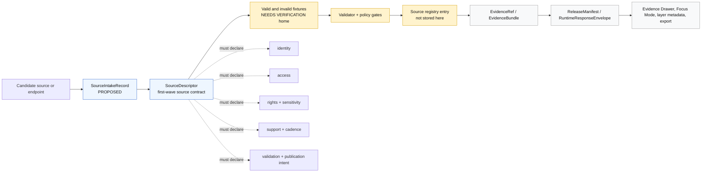

<!-- [KFM_META_BLOCK_V2]
doc_id: kfm://doc/NEEDS_VERIFICATION__schemas_contracts_v1_source_readme
title: Source Contract Schemas
type: standard
version: v1
status: draft
owners: NEEDS_VERIFICATION__CODEOWNERS
created: NEEDS_VERIFICATION__YYYY-MM-DD
updated: 2026-04-23
policy_label: NEEDS_VERIFICATION__public_or_restricted
related: [
  ../README.md,
  ../../README.md,
  ../../../README.md,
  ../../../../contracts/source/README.md,
  ../../../../data/registry/source/README.md,
  ../../../../tests/contracts/fixtures/source/README.md,
  ../../../../schemas/tests/fixtures/contracts/v1/README.md,
  ../../../../policy/README.md,
  ../../../../tools/validators/README.md
]
tags: [kfm, schemas, contracts, source, source-descriptor, source-intake, evidence, governance]
notes: [
  Target path supplied by task: schemas/contracts/v1/source/README.md.
  Owner, original created date, policy label, exact link targets, and active-branch file inventory require repo verification.
  SourceDescriptor is confirmed as a recurring first-wave contract family in the supplied KFM corpus; source_intake_record remains proposed until active schema-home ADR and repo inventory confirm it.
]
[/KFM_META_BLOCK_V2] -->

<a id="top"></a>

# Source Contract Schemas

Machine-readable source-admission contracts for KFM v1 schemas, keeping source identity, authority, rights, sensitivity, support, cadence, validation, and publication intent explicit before downstream evidence objects are built.


> [!IMPORTANT]
> **Impact block**
>
> **Status:** `experimental`  
> **Owners:** `NEEDS_VERIFICATION__CODEOWNERS`  
> **Path:** `schemas/contracts/v1/source/README.md`  
> **Repo fit:** v1 source-contract schema lane under `schemas/contracts/`  
> **Quick jumps:** [Scope](#scope) · [Repo fit](#repo-fit) · [Accepted inputs](#accepted-inputs) · [Exclusions](#exclusions) · [Directory tree](#directory-tree) · [Contract boundary](#contract-boundary) · [Diagram](#diagram) · [Validation gates](#validation-gates) · [Task list](#task-list--definition-of-done) · [FAQ](#faq) · [Appendix](#appendix)

---

## Scope

This directory is the **machine-schema home for source contract objects** in the KFM v1 contract set.

Its first responsibility is to make source admission reviewable before a source can influence evidence, layers, Focus Mode, exports, catalogs, or public claims.

A source schema in this directory should answer questions like:

- What source, endpoint, dataset family, or provider is being admitted?
- What role may the source play?
- Who owns, stewards, or maintains it?
- How may it be accessed?
- What rights, sensitivity, attribution, cadence, support, and freshness limits apply?
- What checks must pass before the source feeds downstream KFM objects?
- What publication intent is allowed, restricted, denied, or still unknown?

It should **not** turn a source into truth by itself. In KFM, source identity is the beginning of a governed evidence path, not the end.

[Back to top](#top)

---

## Repo fit

| Direction | Path | Relationship | Status |
| --- | --- | --- | --- |
| This directory | `schemas/contracts/v1/source/` | Machine-checkable source contract schemas | **CONFIRMED target path from task** |
| Parent schema version | [`../README.md`][v1-readme] | v1 contract-family overview | **NEEDS VERIFICATION** |
| Contracts schema family | [`../../README.md`][schemas-contracts-readme] | Cross-family machine-contract entry point | **NEEDS VERIFICATION** |
| Schemas root | [`../../../README.md`][schemas-readme] | Schema authority, inventory, and drift-control surface | **NEEDS VERIFICATION** |
| Human source contracts | [`../../../../contracts/source/README.md`][contracts-source-readme] | Narrative field semantics and source-admission guidance | **NEEDS VERIFICATION** |
| Source registry | [`../../../../data/registry/source/README.md`][source-registry-readme] | Actual source entries and source authority register | **PROPOSED / NEEDS VERIFICATION** |
| Schema fixtures | [`../../../../schemas/tests/fixtures/contracts/v1/README.md`][schema-fixtures-readme] | Valid/invalid schema examples close to schema versioning | **NEEDS VERIFICATION** |
| Contract tests | [`../../../../tests/contracts/fixtures/source/README.md`][tests-source-fixtures-readme] | Runnable proof that source schemas behave as intended | **NEEDS VERIFICATION** |
| Policy gates | [`../../../../policy/README.md`][policy-readme] | Allow, deny, restrict, abstain, rights, sensitivity, and obligation logic | **NEEDS VERIFICATION** |
| Validators | [`../../../../tools/validators/README.md`][validators-readme] | Fail-closed validation helpers and machine-readable reports | **NEEDS VERIFICATION** |

> [!NOTE]
> Links in this README are intentionally relative. Verify every target in the active checkout before merge, especially if the repo resolves schema authority through an ADR or a branch-local convention.

[Back to top](#top)

---

## Accepted inputs

Place files here when they are **source-contract schemas** for the v1 machine contract family.

| Belongs here | Why |
| --- | --- |
| `source_descriptor.schema.json` | Declares the minimum contract for a source or endpoint before it can enter governed KFM flows. |
| Source-intake schema files, if the schema-home ADR assigns them here | Captures pre-admission source proposal records without letting exploratory packets become source truth. |
| Shared source-contract definitions that are too source-specific for `../common/` | Keeps source identity and source-role semantics close to their owning family. |
| README or migration notes for this schema family | Makes the schema lane navigable and reviewable in GitHub. |
| Schema-only placeholders marked `draft` with explicit review blockers | Allows staged work without pretending a placeholder is enforcement. |

A source contract schema should normally preserve these concepts:

| Concept | Required posture |
| --- | --- |
| Identity | Stable `source_id` or equivalent identity field, plus title/provider where applicable. |
| Stewardship | Owner, steward, maintainer, authority, or explicit unknown state. |
| Access | Access mode, auth posture, endpoint/API/file class, and automation constraints. |
| Rights | Citation, redistribution, license/terms, public-use posture, and unknown-rights behavior. |
| Sensitivity | Public-safe, restricted, generalized, redacted, review-required, or deny-by-default classification. |
| Support | Spatial, temporal, thematic, measurement, documentary, model, or legal/regulatory support limits. |
| Cadence | Update cadence, freshness basis, stale-after policy, or explicit unknown cadence. |
| Validation | Required checks, quarantine triggers, failure reasons, and fixture expectations. |
| Publication intent | What the source may feed: registry only, internal review, derived layer, EvidenceBundle, release, Focus, export, or none. |

[Back to top](#top)

---

## Exclusions

This directory is narrow on purpose. Do not place source-adjacent material here just because it mentions sources.

| Does not belong here | Put it here instead | Reason |
| --- | --- | --- |
| Actual source registry entries | `data/registry/source/` or the repo-confirmed registry home | Registry data is not the same thing as the schema that validates it. |
| Provider-specific narrative contracts | `contracts/source/` or `docs/sources/` | Human source meaning belongs in narrative contract docs, not machine schema files. |
| Raw downloaded data | `data/raw/` | RAW data is lifecycle state, not schema authority. |
| WORK or QUARANTINE outputs | `data/work/` or `data/quarantine/` | Candidate data must not masquerade as contract truth. |
| Processed datasets or published artifacts | `data/processed/`, `data/catalog/`, `data/published/` | Published or processed data stays downstream of validation and promotion. |
| Ingest receipts | `schemas/contracts/v1/receipts/` or repo-confirmed receipt schema home | Receipts prove process events; source schemas define source admission. |
| Evidence refs or evidence bundles | `../evidence/` | Evidence objects consume source identity; they do not own source schema semantics. |
| Decision or policy envelopes | `../policy/` or repo-confirmed governance schema home | Policy decisions are downstream of source facts and rights/sensitivity checks. |
| Runtime response envelopes | `../runtime/` | Runtime output accountability is not source admission. |
| Release manifests | `../release/` | Release objects bind promoted artifacts, proof, and rollback posture. |
| Fixtures | `schemas/tests/fixtures/contracts/v1/` or `tests/contracts/fixtures/source/` | Fixtures prove schema behavior; they should not become a second schema home. |
| Validators | `tools/validators/` | Executable checks belong in validator tooling, not schema directories. |
| Live connector code | `pipelines/`, `tools/connectors/`, or repo-confirmed connector home | Connector code must remain governed, testable, and separable from schemas. |

[Back to top](#top)

---

## Directory tree

```text
schemas/contracts/v1/source/
├── README.md
├── source_descriptor.schema.json
└── source_intake_record.schema.json
```

| Path | Intended role | Status |
| --- | --- | --- |
| `README.md` | This directory guide and review checklist. | **PROPOSED draft** |
| `source_descriptor.schema.json` | First-wave source contract schema. | **CONFIRMED in surfaced doctrine / NEEDS VERIFICATION in active checkout** |
| `source_intake_record.schema.json` | Candidate source proposal or intake schema before descriptor promotion. | **PROPOSED / NEEDS VERIFICATION** |

> [!WARNING]
> Do not add `ingest_receipt.schema.json` here by default. Ingest receipts prove fetch/landing events and may belong under a receipt or data/governance schema family depending on the repo’s active ADR.

[Back to top](#top)

---

## Contract boundary

### Source schema family map

| Object family | Belongs in this directory? | Why |
| --- | ---: | --- |
| `SourceDescriptor` | Yes | Source-edge identity, authority, rights, sensitivity, support, cadence, validation, and publication intent must be explicit before downstream use. |
| `SourceIntakeRecord` | Possibly | It is useful if KFM separates exploratory source proposals from admitted source descriptors. Keep it here only if the schema-home ADR agrees. |
| `IngestReceipt` | No by default | It proves a process event after a source is used. It is not the source contract itself. |
| `ValidationReport` | No by default | It records check outcomes and should live with reports, governance, or validators. |
| `EvidenceRef` | No | It points to released evidence and depends on source identity rather than defining it. |
| `EvidenceBundle` | No | It packages support for claims, features, stories, exports, or answers. |
| `DecisionEnvelope` | No | It expresses policy outcome and obligations. |
| `RuntimeResponseEnvelope` | No | It makes runtime output accountable. |
| `ReleaseManifest` | No | It assembles public-safe release state, proof, rollback, and catalog links. |

### Source contract review rule

A source schema change is review-worthy when it changes any of the following:

- source identity or identifier requirements
- source-role vocabulary or authority posture
- rights, sensitivity, restriction, or generalization fields
- access or automation constraints
- time, support, cadence, or freshness fields
- validation, quarantine, deny, or abstain behavior
- downstream references into `EvidenceRef`, `EvidenceBundle`, `DecisionEnvelope`, `ReleaseManifest`, `LayerManifest`, Focus Mode, or the Evidence Drawer

[Back to top](#top)

---

## Diagram



[Back to top](#top)

---

## Quickstart

Use this sequence when reviewing or changing this directory.

1. Confirm the active schema-home ADR or open one before moving files between `contracts/` and `schemas/`.
2. Inspect `source_descriptor.schema.json` before editing this README.
3. Confirm whether `source_intake_record.schema.json` exists, is proposed, or belongs elsewhere.
4. Add or update one valid fixture and one invalid fixture for every behavior-changing schema edit.
5. Run the repo-native schema, fixture, validator, and policy checks.
6. Confirm no live source fetch, provider mirror, RAW data, credential, token, secret, or production endpoint sample was committed here.
7. Update adjacent narrative docs when field semantics change.

```text
# PSEUDOCODE — replace with the active repo-native command.
<repo-schema-test-command> schemas/contracts/v1/source

# PSEUDOCODE — run the matching validator suite if present.
<repo-validator-command> source-descriptor
```

> [!CAUTION]
> No command above is asserted as runnable until the active checkout confirms package manager, validator language, and CI conventions.

[Back to top](#top)

---

## Usage

### Schema authors

Use this README to decide whether a source-related schema belongs here. A schema belongs here only when it defines **source admission or source identity** for the v1 machine contract set.

### Source stewards

Use this README to understand what must be explicit before a source is admitted. A source with unknown rights, unclear authority, missing cadence, or unresolved sensitivity should fail closed or remain draft/quarantined until review resolves the gap.

### Pipeline and connector authors

Use these schemas as admission contracts. Do not write connector code that bypasses the source registry, rights/sensitivity checks, or validation gates.

### UI, Focus Mode, and export authors

Use downstream objects such as `EvidenceBundle`, `DecisionEnvelope`, `RuntimeResponseEnvelope`, `LayerManifest`, and Evidence Drawer payloads. Do not read this directory as a public truth surface.

[Back to top](#top)

---

## Validation gates

A source schema change is not ready until it can be reviewed as both **meaning** and **machine behavior**.

| Gate | Required check | Failure posture |
| --- | --- | --- |
| Schema compiles | The JSON Schema parses and validates against the repo’s chosen JSON Schema dialect. | Block merge. |
| Valid fixture passes | At least one minimal valid example passes. | Block merge. |
| Invalid fixture fails | At least one invalid example fails for a named reason. | Block merge. |
| Rights are explicit | Rights, citation, redistribution, and public-use posture are present or explicitly unknown. | Deny public promotion. |
| Sensitivity is explicit | Public-safe, restricted, generalized, redacted, steward-only, or review-required posture is present. | Deny public promotion. |
| Source role is explicit | A source cannot be accepted as generic truth without role and support limits. | Quarantine or deny. |
| Cadence/freshness is explicit | Update cadence, freshness basis, or unknown cadence is represented. | Mark stale/unknown; deny freshness claims. |
| No network needed | Contract tests and schema fixtures do not require live endpoints. | Block deterministic test lane. |
| No provider mirror | Fixtures are minimal and behavior-focused, not copied provider datasets. | Replace with minimal synthetic or redacted fixture. |
| Downstream closure is preserved | Source changes do not break EvidenceRef, EvidenceBundle, release, runtime, layer, or drawer assumptions. | Block until downstream contracts are updated. |

[Back to top](#top)

---

## Naming and versioning

Prefer names that make the object family obvious:

```text
source_descriptor.schema.json
source_intake_record.schema.json
```

Recommended conventions:

- Use `snake_case` filenames.
- Keep schema version visible in either the path, schema field, or both.
- Use additive v1 changes when possible.
- Create v2 for breaking changes that would invalidate existing fixtures, validators, registry entries, or release references.
- Record migration and rollback posture when a schema field changes meaning.
- Keep aliases visible when older docs or fixtures refer to prior names.

[Back to top](#top)

---

## Review checklist

Before merge, verify:

- [ ] This directory is still the correct schema home.
- [ ] CODEOWNERS or equivalent owner routing covers this path.
- [ ] `source_descriptor.schema.json` exists or the PR explains why this README lands first.
- [ ] Any `source_intake_record` file is marked **PROPOSED** until an ADR confirms it.
- [ ] Every source schema has at least one valid and one invalid fixture.
- [ ] Invalid fixtures are named by failure reason.
- [ ] Fixtures are deterministic and require no live network.
- [ ] No source credentials, tokens, private coordinates, restricted provider data, or live-source mirrors are committed.
- [ ] Human-readable field semantics are reflected in `contracts/source/` or the repo-confirmed narrative contract home.
- [ ] Policy implications are reflected in `policy/` or the repo-confirmed policy home.
- [ ] Validators are updated in `tools/validators/` or the repo-confirmed validator home.
- [ ] Downstream docs for EvidenceBundle, DecisionEnvelope, ReleaseManifest, LayerManifest, Focus Mode, or Evidence Drawer are updated when source semantics change.
- [ ] Links in this README resolve from `schemas/contracts/v1/source/`.

[Back to top](#top)

---

## Task list / definition of done

### Minimum useful first PR

- [ ] Land this README with verified owner and policy metadata.
- [ ] Confirm or add `source_descriptor.schema.json`.
- [ ] Add one minimal valid `SourceDescriptor` fixture.
- [ ] Add one invalid fixture missing source identity.
- [ ] Add one invalid fixture missing rights or sensitivity posture.
- [ ] Add one invalid fixture with unclear source role or unsupported publication intent.
- [ ] Wire the fixture set into repo-native schema tests.
- [ ] Document the source schema relationship to `contracts/source/`.
- [ ] Document whether source-intake records live here, in a registry lane, or in governance.
- [ ] Keep all source descriptors inactive until registry, policy, and validator gates exist.

### Completion standard

This README is complete when a maintainer can answer the following without guessing:

1. What belongs in `schemas/contracts/v1/source/`?
2. What must never be placed here?
3. Which object family is the first source contract?
4. Which downstream KFM objects depend on source contract stability?
5. What fixtures and validators must accompany a behavior-changing schema edit?
6. What remains unknown because it depends on active checkout evidence?

[Back to top](#top)

---

## FAQ

### Is `SourceDescriptor` the source registry?

No. `SourceDescriptor` is the contract shape. The registry entry is source data governed by that shape and should live in the repo-confirmed registry home.

### Can this directory contain provider-specific examples?

Only minimal schema fixtures may be referenced from this README. Provider-specific source descriptions belong in source contracts, registry entries, or fixtures, depending on their role.

### Can a source with unknown rights be admitted?

It may be recorded as a draft or candidate, but it should not be promoted to public use. Unknown rights must fail closed for publication.

### Can MapLibre source metadata live here?

Usually no. MapLibre runtime source definitions, layer descriptors, and source metadata fixtures are delivery/UI concerns. They may depend on `SourceDescriptor`, but they should not replace it.

### Does a valid source descriptor mean the source is authoritative?

No. Valid shape is only one gate. Authority depends on source role, support, rights, sensitivity, review, evidence resolution, and release state.

### Why are receipts excluded?

Receipts prove that something happened. Source schemas define what must be true before a source is admitted. Keeping those separate prevents process proof from becoming source truth.

[Back to top](#top)

---

## Appendix

<details>
<summary><strong>Illustrative SourceDescriptor instance shape</strong></summary>

The sketch below is illustrative. It is not a replacement for `source_descriptor.schema.json`, not a live source entry, and not a registry record.

```json
{
  "schema_version": "v1",
  "kind": "SourceDescriptor",
  "identity": {
    "source_id": "NEEDS_VERIFICATION__example_source",
    "title": "Example Source",
    "provider": "Example Provider"
  },
  "role_and_scope": {
    "source_role": "NEEDS_VERIFICATION__source_role",
    "primary_lane": "NEEDS_VERIFICATION__domain_lane",
    "publication_intent": "review_only"
  },
  "access": {
    "mode": "NEEDS_VERIFICATION__access_mode",
    "auth_model": "NEEDS_VERIFICATION__auth_model",
    "automation_constraints": [
      "NEEDS_VERIFICATION"
    ]
  },
  "rights_and_sensitivity": {
    "rights_posture": "NEEDS_VERIFICATION",
    "citation_required": true,
    "public_release_allowed": false,
    "sensitivity_posture": "review_required"
  },
  "support": {
    "spatial_support": "NEEDS_VERIFICATION",
    "temporal_support": "NEEDS_VERIFICATION",
    "freshness_basis": "NEEDS_VERIFICATION"
  },
  "validation": {
    "required_checks": [
      "source_identity_present",
      "source_role_present",
      "rights_posture_present",
      "sensitivity_posture_present",
      "publication_intent_present"
    ]
  }
}
```

</details>

<details>
<summary><strong>Suggested invalid fixture names</strong></summary>

```text
missing_source_id.invalid.json
missing_rights_posture.invalid.json
missing_sensitivity_posture.invalid.json
unsupported_publication_intent.invalid.json
ambiguous_source_role.invalid.json
live_endpoint_without_access_policy.invalid.json
provider_mirror_fixture.invalid.json
```

</details>

<details>
<summary><strong>Change impact map</strong></summary>

| Change type | Also inspect |
| --- | --- |
| New required identity field | Source registry entries, fixtures, validators, EvidenceRef builders |
| New rights or sensitivity field | Policy bundles, publication gates, Evidence Drawer payloads, export surfaces |
| New cadence or freshness field | Layer metadata, Focus Mode, release manifests, stale-state UI |
| New source role vocabulary | Policy, source authority register, domain-lane docs, validator reason codes |
| Breaking schema version | ADR, migration notes, rollback plan, fixture aliases, release compatibility |

</details>

[Back to top](#top)

---

[v1-readme]: ../README.md
[schemas-contracts-readme]: ../../README.md
[schemas-readme]: ../../../README.md
[contracts-source-readme]: ../../../../contracts/source/README.md
[source-registry-readme]: ../../../../data/registry/source/README.md
[schema-fixtures-readme]: ../../../../schemas/tests/fixtures/contracts/v1/README.md
[tests-source-fixtures-readme]: ../../../../tests/contracts/fixtures/source/README.md
[policy-readme]: ../../../../policy/README.md
[validators-readme]: ../../../../tools/validators/README.md