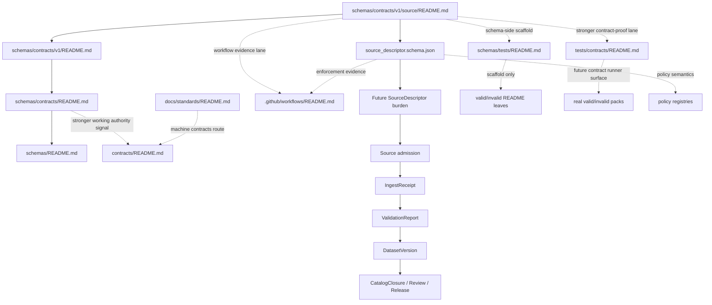

<!-- [KFM_META_BLOCK_V2]
doc_id: kfm://doc/NEEDS-VERIFICATION
title: source
type: standard
version: v1
status: draft
owners: @bartytime4life
created: YYYY-MM-DD
updated: 2026-04-03
policy_label: public
related: [schemas/contracts/v1/README.md, schemas/contracts/README.md, schemas/README.md, contracts/README.md, docs/standards/README.md, schemas/tests/README.md, tests/contracts/README.md, .github/workflows/README.md, .github/CODEOWNERS]
tags: [kfm]
notes: [doc_id and created date use placeholders pending repo verification, source_descriptor.schema.json remains {}, schema-home authority remains unresolved]
[/KFM_META_BLOCK_V2] -->

# source

SourceDescriptor family guide for the public `schemas/contracts/v1/source/` lane, kept boundary-first until schema-home authority, fixtures, and validation depth are directly proved.

> [!NOTE]
> The KFM Meta Block v2 above uses reviewable placeholders for `doc_id` and `created` because those values were not directly confirmed from the current public repo surfaces inspected for this revision.  
> The impact block below describes the current maturity of the `source/` surface itself.

> **Status:** experimental  
> **Owners:** `@bartytime4life` *(via current public `.github/CODEOWNERS` global fallback; no narrower `/schemas/` rule was directly verified on public `main`)*  
> **Path:** `schemas/contracts/v1/source/README.md`  
> **Schema family:** `SourceDescriptor`  
> **Current schema body:** placeholder (`{}`)  
> **Schema-home authority:** `UNKNOWN / NEEDS VERIFICATION`  
> 
> 
> 
> 
> 
> 
>   
> **Quick jumps:** [Scope](#scope) · [Repo fit](#repo-fit) · [Inputs](#inputs) · [Exclusions](#exclusions) · [Directory tree](#directory-tree) · [Quickstart](#quickstart) · [Usage](#usage) · [Diagram](#diagram) · [Reference tables](#reference-tables) · [Task list](#task-list) · [FAQ](#faq) · [Appendix](#appendix)  
> **Repo fit:** parent [`../README.md`](../README.md) · subtree boundary [`../../README.md`](../../README.md) · parent boundary [`../../../README.md`](../../../README.md) · stronger contract lane [`../../../../contracts/README.md`](../../../../contracts/README.md) · stronger contract-facing verification lane [`../../../../tests/contracts/README.md`](../../../../tests/contracts/README.md) · nested schema-side fixture scaffold [`../../../tests/README.md`](../../../tests/README.md) · workflow gate lane [`../../../../.github/workflows/README.md`](../../../../.github/workflows/README.md)  
> **Accepted here:** SourceDescriptor-family guidance, boundary/authority notes, illustrative examples, and schema-strengthening follow-through that stays synchronized with tests, policy, and workflow evidence.  
> **Not here:** raw source payloads, policy bundles, canonical fixture packs, workflow YAML, or duplicate final law under both `schemas/` and `contracts/`.

> [!IMPORTANT]
> Current public `main` confirms four things at once:
> 1. this lane is real and contains `README.md` plus `source_descriptor.schema.json`;
> 2. `source_descriptor.schema.json` is still `{}`;
> 3. a stronger contract-facing verification family is already visible under `tests/contracts/`;
> 4. a nested schema-side scaffold is also documented under `schemas/tests/fixtures/contracts/v1/{valid,invalid}/`.
>
> It does **not** yet prove that `schemas/contracts/v1/source/` is the singular canonical schema home or an enforcement-grade validation lane.

## Scope

The `source/` family exists to describe the **SourceDescriptor** side of KFM contract law: the intake-time object that declares what a source is, how it is accessed, what rights and support semantics apply, how it is validated, and how it is expected to flow into later governed artifacts.

At the moment, this lane does four things well:

1. It keeps the family visible in the public tree.
2. It prevents quiet drift between “folder exists” and “schema is actually ready.”
3. It gives reviewers one place to check what **does** and **does not** belong under `schemas/contracts/v1/source/`.
4. It keeps the current split between **visible machine-file presence**, **stronger contract narration**, and **stronger contract-proof routing** explicit instead of smoothing it away.

It does **not** yet prove that this directory is the final canonical schema home.

> [!NOTE]
> A checked-in filename is not the same thing as validated contract law. In this lane, **presence**, **semantic maturity**, and **enforced authority** are separate questions.

### Truth labels used here

| Label | How to read it here |
|---|---|
| **CONFIRMED** | Directly visible in the current public repo tree or clearly stated in stronger adjacent docs. |
| **INFERRED** | Conservative completion drawn from repeated KFM doctrine and neighboring README structure. |
| **PROPOSED** | A safer future-ready shape that fits doctrine but is not yet proved as implementation reality here. |
| **UNKNOWN** | Not verified strongly enough from current public evidence. |
| **NEEDS VERIFICATION** | Likely important enough to block stronger claims until directly checked. |

[Back to top](#source)

## Repo fit

**Path:** `schemas/contracts/v1/source/README.md`

### Upstream and downstream links

| Direction | Path | Why it matters |
|---|---|---|
| Upstream | [`../README.md`](../README.md) | Versioned `v1` boundary and subtree status. |
| Upstream | [`../../README.md`](../../README.md) | `schemas/contracts/` boundary and migration-control surface. |
| Upstream | [`../../../README.md`](../../../README.md) | Top-level `schemas/` warning about schema-home ambiguity. |
| Lateral | [`../../../../contracts/README.md`](../../../../contracts/README.md) | Stronger current working contract-lane signal. |
| Lateral | [`../../../../docs/standards/README.md`](../../../../docs/standards/README.md) | Standards index that still routes machine contracts toward `contracts/`. |
| Lateral | [`../../../tests/README.md`](../../../tests/README.md) | Nested schema-side fixture scaffold and routing surface inside `schemas/`. |
| Lateral | [`../../../../tests/README.md`](../../../../tests/README.md) | Repo-wide governed verification surface. |
| Lateral | [`../../../../tests/contracts/README.md`](../../../../tests/contracts/README.md) | Sharper current contract-facing verification family. |
| Lateral | [`../../../../policy/README.md`](../../../../policy/README.md) | Rights, obligations, withholding, and deny-by-default consequences. |
| Lateral | [`../../../../.github/workflows/README.md`](../../../../.github/workflows/README.md) | Workflow intent and current public workflow-lane limits. |
| Control surface | [`../../../../.github/CODEOWNERS`](../../../../.github/CODEOWNERS) | Current owner signal. |
| Downstream | [`./source_descriptor.schema.json`](./source_descriptor.schema.json) | The local family schema file currently checked into the tree. |

### Current public snapshot

| Item | Current state | Truth label | Why it matters |
|---|---|---:|---|
| `schemas/contracts/v1/source/README.md` | Present | **CONFIRMED** | The lane exists and should explain itself. |
| `schemas/contracts/v1/source/source_descriptor.schema.json` | Present | **CONFIRMED** | The family filename exists in-tree. |
| Schema body | `{}` | **CONFIRMED** | Presence is real; enforcement-grade semantics are not yet proved. |
| `schemas/contracts/v1/` subtree | Present with family directories | **CONFIRMED** | This lane is part of a visible versioned contract subtree. |
| Documentary authority leaning toward `contracts/` | Yes | **CONFIRMED** | Adjacent docs still point readers there for machine contracts. |
| `schemas/tests/README.md` | Present with `fixtures/` scaffold | **CONFIRMED** | Schema-side fixture orientation is visible, even though it is not yet canonical proof by itself. |
| `schemas/tests/fixtures/contracts/v1/{valid,invalid}/README.md` | Documented as present, scaffold-only | **CONFIRMED** | Nested example leaves are visible, but still README-only. |
| `tests/contracts/README.md` | Present as a dedicated contract-proof family | **CONFIRMED** | There is already a sharper current public lane for contract-facing verification. |
| `.github/CODEOWNERS` | Global fallback visible; no narrower `/schemas/` rule directly verified | **CONFIRMED** | Keeps owner statements bounded to what the current public file actually shows. |
| `.github/workflows/README.md` | Present; workflow lane documented as README-only on public `main` | **CONFIRMED** | Workflow intent is documented, but merge-blocking YAML is not proved by current public tree alone. |
| Final canonical schema home | Not settled here | **UNKNOWN / NEEDS VERIFICATION** | Avoid duplicate law and path drift. |
| Valid/invalid payloads tied directly to this family | Not directly proved here | **UNKNOWN** | Schema maturity is not just file presence. |
| Merge-blocking workflow evidence for this lane | Not directly proved here | **UNKNOWN** | Enforcement cannot be implied from docs alone. |

### Why this lane still matters

Even with authority still unresolved, this family should stay legible because **SourceDescriptor** is doctrinally the intake-side trust object. KFM’s contract lattice treats it as the object that should declare source identity, access mode, rights posture, support, cadence, validation plan, and publication intent. That makes the `source/` family foundational even before the final path decision is retired.

[Back to top](#source)

## Inputs

### Accepted inputs

| Accepted here | Why it belongs here |
|---|---|
| SourceDescriptor-family guidance | This lane is the narrow family guide for intake-side source contracts. |
| Field-group explanations for a future substantive `SourceDescriptor` | Helps keep semantics stable before the schema body becomes real law. |
| Boundary and authority notes | This directory needs explicit honesty about what is visible vs canonical. |
| Clearly labeled illustrative examples | Useful for review, as long as they are not passed off as implemented schema law. |
| Migration notes tied to tests, policy, and workflows | SourceDescriptor strength depends on adjacent proof, not just JSON syntax. |
| Updates that reconcile tree snapshots across sibling lanes | This subtree now has visible neighbors; stale inventory language is itself drift. |

### Expected before this lane becomes strong

| Missing strengthening input | Why it matters |
|---|---|
| An explicit schema-home decision | Prevents silent duplication between `schemas/` and `contracts/`. |
| A substantive schema body | Replaces placeholder presence with machine-checkable semantics. |
| Contract-facing valid and invalid fixtures | Lets the family prove positive and negative cases. |
| A clear routing rule for any schema-side mirrors or nested scaffolds | Prevents `schemas/tests/` from becoming a second silent fixture authority. |
| Visible validation path | Keeps README language tied to actual enforcement. |
| At least one family example in a real thin slice | Makes the lane operational, not merely documentary. |

## Exclusions

### What does **not** belong here

| Excluded from this directory | Put it here instead |
|---|---|
| Raw source payloads, fetch snapshots, landing receipts | Source-intake workflows and governed artifact zones, not this README lane. |
| Policy bundles, reason-code registries, obligation registries | [`../../../../policy/README.md`](../../../../policy/README.md) |
| Canonical contract-facing valid/invalid fixtures meant to back real runners | [`../../../../tests/contracts/README.md`](../../../../tests/contracts/README.md) |
| Nested schema-side scaffolds treated as if they were canonical proof packs | Keep them explicitly scaffold-only under [`../../../tests/README.md`](../../../tests/README.md), or retire them once a single fixture home is settled. |
| Merge gates, workflow YAML, CI-only validators | [`../../../../.github/workflows/README.md`](../../../../.github/workflows/README.md) |
| General standards doctrine | [`../../../../docs/standards/README.md`](../../../../docs/standards/README.md) |
| Quiet duplicate copies of the same trust-bearing schema family | The **explicitly chosen** authoritative schema home, not both trees. |
| Release receipts, correction packs, runtime envelopes | Their own contract families and adjacent governed surfaces. |

> [!CAUTION]
> The fastest way to damage this lane is to let it become a second silent authority surface. In KFM terms, that is drift, not redundancy.

[Back to top](#source)

## Directory tree

```text
schemas/
└── contracts/
    ├── README.md
    └── v1/
        ├── README.md
        ├── common/
        ├── correction/
        ├── data/
        ├── evidence/
        ├── policy/
        ├── release/
        ├── runtime/
        └── source/
            ├── README.md
            └── source_descriptor.schema.json
```

### Adjacent verification surfaces worth reviewing with this lane

```text
schemas/tests/
└── fixtures/
    └── contracts/
        └── v1/
            ├── valid/
            │   └── README.md
            └── invalid/
                └── README.md

tests/contracts/
└── README.md

.github/workflows/
└── README.md
```

> [!TIP]
> The local tree matters, but the **authority chain** matters more. Always review this lane together with `schemas/README.md`, `schemas/contracts/README.md`, `schemas/contracts/v1/README.md`, `schemas/tests/README.md`, `tests/contracts/README.md`, and `contracts/README.md`.

## Quickstart

### Minimal inspection loop

```bash
# 1) Read the surrounding authority chain
sed -n '1,220p' schemas/README.md
sed -n '1,260p' schemas/contracts/README.md
sed -n '1,260p' schemas/contracts/v1/README.md
sed -n '1,240p' schemas/tests/README.md
sed -n '1,260p' contracts/README.md
sed -n '1,220p' docs/standards/README.md
sed -n '1,240p' tests/contracts/README.md
sed -n '1,220p' .github/CODEOWNERS
sed -n '1,220p' .github/workflows/README.md

# 2) Inspect the current source-family lane
ls -la schemas/contracts/v1/source
cat schemas/contracts/v1/source/source_descriptor.schema.json

# 3) Look for adjacent proof that would make this lane stronger
find schemas/tests -maxdepth 6 -type f | sort
find tests/contracts -maxdepth 6 -type f | sort
find .github/workflows -maxdepth 2 -type f | sort
```

### Safe contributor sequence

1. Read the upstream docs before editing this file.
2. Decide whether the change is **boundary-only**, **schema-strengthening**, **fixture-routing**, or **authority-resolution** work.
3. If the change touches semantics, inspect `contracts/README.md` and `docs/standards/README.md` first.
4. If the change touches examples or fixtures, inspect both `schemas/tests/README.md` and `tests/contracts/README.md` before deciding where those files belong.
5. If the change implies enforcement, verify that tests and workflow evidence exist or mark them `UNKNOWN / NEEDS VERIFICATION`.
6. Keep the distinction between **present in tree**, **present as scaffold**, and **proven in operation** visible.

## Usage

### Current default mode: boundary-first

Use this README to answer five review questions:

- What is `source/` supposed to mean?
- What is actually present in the tree today?
- What belongs here versus in `contracts/`, `schemas/tests/`, `tests/contracts/`, `policy/`, or workflows?
- Which visible neighboring lanes are scaffolds versus stronger proof surfaces?
- What must happen before stronger claims are safe?

### If you are strengthening `source_descriptor.schema.json`

Do all of the following together:

1. Replace the placeholder body with substantive JSON Schema content.
2. Update this README’s current-state table.
3. Add or link valid/invalid fixtures.
4. Link or surface the validation path.
5. Reconcile any authority-language drift in:
   - [`../../../README.md`](../../../README.md)
   - [`../../README.md`](../../README.md)
   - [`../README.md`](../README.md)
   - [`../../../tests/README.md`](../../../tests/README.md)
   - [`../../../../tests/contracts/README.md`](../../../../tests/contracts/README.md)
   - [`../../../../contracts/README.md`](../../../../contracts/README.md)

### If you are adding examples or fixtures

Use this rule set:

| Example type | Prefer | Why |
|---|---|---|
| Illustrative, non-authoritative sketch tied to explaining the family | This README appendix or a clearly marked scaffold under `schemas/tests/` | Good for explanation only; must not become silent law. |
| Contract-facing valid/invalid pack intended to back a real runner | `../../../../tests/contracts/README.md` and its future companion paths | This is the sharper current public contract-proof family. |
| Canonical payload examples that define final law | The explicitly chosen authoritative schema home only | Prevents duplicate contract authority. |
| Generated or mirrored payloads | A clearly marked non-authoritative mirror path with explicit source linkage | Makes convenience visible without inventing a second truth system. |

### If schema-home authority resolves one way or the other

Use this rule set:

| Authority outcome | What this README should become |
|---|---|
| `contracts/` remains canonical | Keep `source/` visible as a boundary and migration-control guide; do **not** duplicate final law here. |
| `schemas/contracts/v1/` becomes canonical | Expand this lane into a true family guide, add fixtures + validation references, and retire contradictory routing language upstream. |
| Hybrid / staged migration | Keep one side canonical and make the other side explicitly pointer-first, never “sort of canonical.” |

### Change discipline for this lane

- Prefer **small, reversible, explicit** updates.
- Treat wording changes as behavior-significant if they alter where contributors think schema law belongs.
- Treat fixture-routing language as behavior-significant if it changes which lane reviewers assume is authoritative.
- Never “resolve” ambiguity by silence.

[Back to top](#source)

## Diagram



## Reference tables

### SourceDescriptor burden map

This table describes the **doctrinal minimum burden** for a future substantive `SourceDescriptor`. It is **not** a claim that the checked-in schema already encodes all of this.

| Burden area | What a future substantive SourceDescriptor should express | Current `source/` lane state |
|---|---|---|
| Identity | `source_id`, title, provider, steward/contact, canonical reference URI or endpoint family | README can describe this; checked-in schema body does not yet prove it. |
| Access | access mode, auth model, fetch pattern, cadence, rate/size assumptions, retry/checkpoint posture | README can point to the need; current schema body is placeholder-only. |
| Semantics | grain/support, CRS or spatial frame, time semantics, units, modeled-vs-observed tag, publication intent | Doctrinally important; not yet materialized here as real schema law. |
| Rights & sensitivity | license/terms, redistribution posture, attribution, location-precision constraints, privacy / CARE obligations, steward review requirement | Must stay explicit; current lane does not yet prove full encoding. |
| Validation | schema/shape checks, identity checks, temporal checks, unit checks, quarantine triggers, stale-source policy | Family burden is clear; enforcement path remains unproved here. |
| Lineage | raw landing path or artifact family, transform family, outbound catalog-closure expectations, emitted proof artifacts | Needed for trust-path coherence; not yet encoded by the placeholder body. |

### Verification routing when this lane changes

| If you change… | Also inspect… | Why |
|---|---|---|
| Authority language | [`../../../README.md`](../../../README.md), [`../../README.md`](../../README.md), [`../README.md`](../README.md), [`../../../../contracts/README.md`](../../../../contracts/README.md) | Avoid contradictory route signals. |
| Schema body | [`../../../../tests/contracts/README.md`](../../../../tests/contracts/README.md), [`../../../../.github/workflows/README.md`](../../../../.github/workflows/README.md) | Schema presence is weaker than validated behavior. |
| Schema-side fixture wording | [`../../../tests/README.md`](../../../tests/README.md) | Keep scaffold-only language honest and synchronized. |
| Source-specific obligations | [`../../../../policy/README.md`](../../../../policy/README.md) | Rights, withholding, and review burdens must not live only in prose. |
| Standards-profile claims | [`../../../../docs/standards/README.md`](../../../../docs/standards/README.md) | Keep standards routing aligned. |
| Thin-slice examples | parent `v1` docs and example / test surfaces | Small examples should reduce ambiguity, not create new law. |

## Task list

### Definition of done for a strong `source/` lane

- [ ] `source_descriptor.schema.json` is no longer `{}`.
- [ ] Authority language is reconciled across `schemas/`, `schemas/contracts/`, `schemas/contracts/v1/`, `schemas/tests/`, `tests/contracts/`, and `contracts/`.
- [ ] One or more **valid** example descriptors exist and are linked from the right verification surface.
- [ ] One or more **invalid** examples exist and fail for a known reason.
- [ ] A validation command, harness, or workflow reference is visible.
- [ ] At least one real thin-slice descriptor is linked or referenced.
- [ ] This README is updated whenever the lane’s authority, validation, or migration posture changes.

### Gate view

| Gate | Pass condition | Today |
|---|---|---|
| Schema maturity | substantive schema body + explicit semantics | open |
| Fixture maturity | positive and negative examples tied to a real proof surface | open |
| Fixture routing clarity | scaffold versus canonical proof lanes are explicitly reconciled | open |
| Workflow maturity | visible validation path or merge gate | open |
| Authority clarity | one canonical schema-home decision | open |
| Thin-slice usability | at least one reviewable example descriptor | open |

> [!IMPORTANT]
> “Open” is not failure theater here. It is the honest current state that prevents stronger claims from becoming accidental fiction.

[Back to top](#source)

## FAQ

### Is `schemas/contracts/v1/source/` the canonical schema home right now?

No settled answer is proved here. The lane is present and should be documented, but adjacent docs still keep schema-home authority unresolved and continue to route machine contracts toward `contracts/`.

### Does the existence of `source_descriptor.schema.json` mean SourceDescriptor is implemented?

No. In the current public tree, the file exists but its body is still `{}`.

### Where should valid and invalid examples go today?

The stronger current public default is `../../../../tests/contracts/README.md` for contract-facing proof packs. The nested `schemas/tests/` lane is useful for **scaffold-only**, **illustrative**, or **mirror** examples, but it should not silently become canonical by convenience.

### Should contributors add the same trust-bearing family under both `schemas/` and `contracts/` “just to be safe”?

No. Until authority is explicit, duplicate copies create drift and reviewer confusion.

### Why does this README talk so much about tests and workflows?

Because KFM doctrine treats negative-path verification, fixtures, and fail-closed behavior as part of the contract story, not as optional later polish.

### Why mention hydrology in a `source/` family README?

Because hydrology is the preferred first thin slice for proving KFM contract law on a public-safe, place/time-rich lane. A real `SourceDescriptor` example is most useful when tied to that first governed slice.

## Appendix

<details>
<summary><strong>Illustrative SourceDescriptor sketch (non-authoritative example)</strong></summary>

This example is deliberately **illustrative**. It is here to show the semantic burden of the family, not to claim current implemented schema shape.

```json
{
  "source_id": "usgs_nwis_streamgages",
  "title": "USGS NWIS stream gage observations",
  "provider": "USGS",
  "steward": {
    "name": "TBD",
    "contact": "TBD"
  },
  "access": {
    "mode": "public_api",
    "auth_model": "none",
    "fetch_pattern": "pull",
    "cadence": "daily"
  },
  "semantics": {
    "support": "station_observation",
    "crs": "EPSG:4326",
    "time_semantics": "observation_time",
    "modeled_vs_observed": "observed",
    "publication_intent": "public_safe"
  },
  "rights_and_sensitivity": {
    "license": "TBD",
    "redistribution_posture": "review",
    "precision_constraints": "none_known"
  },
  "validation": {
    "checks": [
      "identity",
      "time",
      "units",
      "shape"
    ],
    "stale_source_policy": "flag"
  },
  "lineage": {
    "raw_landing_family": "RAW",
    "outbound_expectation": "catalog_closure"
  }
}
```

</details>

<details>
<summary><strong>Reviewer prompts for pull requests touching this lane</strong></summary>

- Does the PR distinguish clearly between **tree presence**, **scaffold presence**, and **validated maturity**?
- Does it create or reduce authority ambiguity?
- If it strengthens the schema, where are the fixtures?
- If it introduces fixtures, does it route them to the right proof surface?
- If it references policy obligations, are they defined in governed registries?
- If it claims enforcement, where is the workflow or harness evidence?
- If it introduces an example, is it explicitly marked illustrative, scaffold-only, mirror, or tied to a real thin slice?

</details>

[Back to top](#source)
