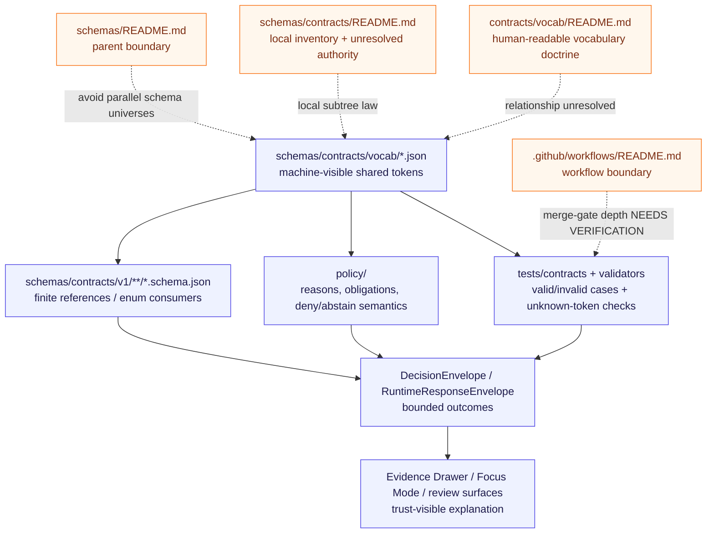

<!-- [KFM_META_BLOCK_V2]
doc_id: kfm://doc/TODO-NEEDS-UUID
title: schemas/contracts/vocab — Shared Contract Vocabulary Registries
type: standard
version: v1
status: draft
owners: @bartytime4life (fallback; narrower vocabulary owner NEEDS VERIFICATION)
created: TODO-VERIFY-YYYY-MM-DD
updated: 2026-04-23
policy_label: TODO-VERIFY-public-or-restricted
related: [../README.md, ../../README.md, ../../../contracts/README.md, ../../../contracts/vocab/README.md, ../../../policy/README.md, ../../../tests/contracts/README.md, ../../../.github/workflows/README.md, ../../../.github/CODEOWNERS, ./reason_codes.json, ./obligation_codes.json, ./reviewer_roles.json]
tags: [kfm, schemas, contracts, vocab, governance, policy, validation]
notes: [Existing public-main README lacked KFM Meta Block v2; doc_id created date policy_label and narrower owner require repository review; current JSON vocab registries are scaffold placeholders until populated and validated.]
[/KFM_META_BLOCK_V2] -->

<a id="top"></a>

# schemas/contracts/vocab

Machine-readable shared vocabulary lane for KFM contract registries whose tokens must stay finite, reviewable, and reconstructable.

> [!IMPORTANT]
> **Status:** `experimental` · **Doc status:** `draft` · **Owners:** `@bartytime4life` fallback; narrower vocabulary owner **NEEDS VERIFICATION**  
> **Path:** `schemas/contracts/vocab/README.md`
>
> 
> 
> 
> 
> 
>
> **Quick jumps:** [Scope](#scope) · [Repo fit](#repo-fit) · [Accepted inputs](#accepted-inputs) · [Exclusions](#exclusions) · [Current evidence posture](#current-evidence-posture) · [Directory tree](#directory-tree) · [Quickstart](#quickstart) · [Usage](#usage) · [Diagram](#diagram) · [Tables](#tables) · [Task list / definition of done](#task-list--definition-of-done) · [Review checks](#review-checks) · [FAQ](#faq) · [Appendix](#appendix)

> [!WARNING]
> This directory is a machine-visible vocabulary lane, not a final authority decision. KFM currently has both `schemas/contracts/vocab/` and [`../../../contracts/vocab/README.md`](../../../contracts/vocab/README.md). Do not merge, mirror, rename, or supersede either lane by guesswork.

> [!NOTE]
> Current public `main` materializes this directory with `README.md`, `reason_codes.json`, `obligation_codes.json`, and `reviewer_roles.json`. The JSON bodies are currently scaffold placeholders. Treat enforcement depth as **NEEDS VERIFICATION** until branch-local validators, fixtures, and workflow callers prove otherwise.

---

## Scope

`schemas/contracts/vocab/` exists for **machine-readable shared vocabulary registries** that cross more than one trust-bearing seam in KFM.

A value belongs here only when its stability matters to at least one governed contract surface and usually more than one of these:

- contract validation
- policy reconstruction
- reviewer workflow
- runtime explanation
- correction lineage
- proof and receipt interpretation
- trust-visible UI states

The starter set is intentionally small:

| Registry | Current role |
| --- | --- |
| [`reason_codes.json`](./reason_codes.json) | Finite reasons for abstention, denial, hold, narrowing, correction, or similar trust-preserving outcomes |
| [`obligation_codes.json`](./obligation_codes.json) | Finite follow-up obligations attached to decisions, outputs, or review states |
| [`reviewer_roles.json`](./reviewer_roles.json) | Shared reviewer, steward, or approval role tokens used by governance-aware flows |

The goal is not taxonomy sprawl. The goal is to stop free-text drift where KFM most needs finite, reconstructable semantics.

[Back to top](#top)

---

## Repo fit

| Item | Value |
| --- | --- |
| Path | `schemas/contracts/vocab/` |
| README path | `schemas/contracts/vocab/README.md` |
| Role | Machine-file vocabulary lane for shared contract registries |
| Current public contents | `README.md`, `reason_codes.json`, `obligation_codes.json`, `reviewer_roles.json` |
| Upstream schema boundary | [`../README.md`](../README.md), [`../../README.md`](../../README.md) |
| Adjacent doctrinal vocabulary lane | [`../../../contracts/vocab/README.md`](../../../contracts/vocab/README.md) |
| Adjacent policy lane | [`../../../policy/README.md`](../../../policy/README.md) |
| Adjacent verification lane | [`../../../tests/contracts/README.md`](../../../tests/contracts/README.md) |
| Workflow boundary | [`../../../.github/workflows/README.md`](../../../.github/workflows/README.md) |
| Ownership signal | [`../../../.github/CODEOWNERS`](../../../.github/CODEOWNERS) fallback currently covers `schemas/` and related contract surfaces |
| Current authority posture | **NEEDS VERIFICATION** — this README does not settle schema-home, fixture-home, validator-home, or machine-vocabulary-home law |

### Current split signals

| Surface | Current public state | How to read it |
| --- | --- | --- |
| `schemas/contracts/vocab/` | `README.md` plus three JSON scaffold files | Current branch-visible machine-file lane for starter vocabularies |
| `../../../contracts/vocab/README.md` | Human-readable doctrinal vocabulary lane | Vocabulary doctrine exists beside this machine-file lane; it is not automatically a mirror |
| `../../README.md` | Parent schema boundary and live-tree index | Parent and local tree descriptions should stay synchronized |
| `../README.md` | Local `schemas/contracts/` boundary | Sibling boundary guidance supports the same unresolved-authority posture |
| `../../../policy/README.md` | Policy and decision posture | Vocab edits here have policy consequences, but policy logic does not live here |
| `../../../tests/contracts/README.md` | Contract-facing verification lane | Fixture and harness maturity stay downstream until proven in the checked-out branch |
| `../../../.github/workflows/README.md` | Workflow boundary | README presence does not prove merge-blocking validation |

### Relationship to surrounding docs

- [`../../README.md`](../../README.md) is the parent sync point for the `schemas/` subtree.
- [`../README.md`](../README.md) should describe how `schemas/contracts/` relates to versioned schemas and vocabularies.
- [`../../../contracts/vocab/README.md`](../../../contracts/vocab/README.md) is the human-readable vocabulary governance surface.
- [`../../../policy/README.md`](../../../policy/README.md) owns decision logic, deny behavior, and obligations semantics.
- [`../../../tests/contracts/README.md`](../../../tests/contracts/README.md) owns contract-facing proof work, including valid and invalid examples.
- [`../../../.github/CODEOWNERS`](../../../.github/CODEOWNERS) owns review routing until narrower vocabulary ownership is verified.

[Back to top](#top)

---

## Accepted inputs

This folder accepts:

- machine-readable shared vocabulary registries
- finite code lists used by more than one contract-facing surface
- additive updates that preserve or visibly deprecate earlier meanings
- small explanatory notes that help contributors avoid drift without pretending validators already exist

Typical fit for this directory:

| Fit | Example consumer |
| --- | --- |
| Reasons for `ABSTAIN`, `DENY`, restriction, narrowing, hold, or correction | `DecisionEnvelope`, `RuntimeResponseEnvelope`, policy reports, review summaries |
| Obligations attached to decisions or outputs | policy gates, review records, release manifests, trust-visible UI |
| Reviewer or steward role tokens | review records, promotion handoffs, approval workflows |
| Shared finite state tokens that would otherwise be duplicated | schema enums, validators, fixtures, runtime emitters |

### Role / ref split

Reviewer, owner, steward, and approver **roles** are controlled vocabulary tokens. Actual actors are references.

| Use this for vocabulary | Use this for actor identity |
| --- | --- |
| `reviewer_role` | `reviewer_ref` |
| `owner_role` | `owner_ref` |
| `steward_role` | `steward_ref` |
| `approver_role` | `approver_ref` |

Do not put GitHub handles, team names, queues, service principals, or person identities into `reviewer_roles.json` unless a later schema explicitly defines that file as an actor-reference registry. Role tokens answer “what capacity?”; refs answer “which actor?”

[Back to top](#top)

---

## Exclusions

This folder does **not** hold:

| Does not belong here | Put it here instead |
| --- | --- |
| Full policy logic, rule bundles, or executable policy | [`../../../policy/`](../../../policy/) |
| Runtime object schemas or API payload schemas | [`../v1/`](../v1/) or the eventual canonical contract home |
| Valid / invalid fixture packs | [`../../../tests/contracts/`](../../../tests/contracts/) or another verified fixture home |
| UI-only wording, labels, tooltips, or presentation copy | The consuming UI surface |
| Domain-specific taxonomies that do not cross contract/policy/runtime boundaries | The relevant domain package, source descriptor, or dataset registry |
| CODEOWNERS routing | [`../../../.github/CODEOWNERS`](../../../.github/CODEOWNERS) |
| Workflow YAML or runner logic | [`../../../.github/workflows/`](../../../.github/workflows/) |
| Duplicate canonical copies of the same vocabulary | One decided authoritative home plus an explicit pointer or mirror strategy |
| Ad hoc attempts to make this lane symmetrical with `contracts/vocab/` | Resolve authority first, then reconcile deliberately |

If a value matters to only one local implementation detail, it probably does not belong here.

[Back to top](#top)

---

## Current evidence posture

| Label | Meaning in this README |
| --- | --- |
| **CONFIRMED** | Current public `main` exposes this directory and the three starter JSON registry files; those JSON bodies are currently `{}` placeholders. |
| **INFERRED** | These registries are intended to feed contract schemas, policy outcomes, tests, runtime envelopes, review workflows, and trust-visible UI cues. |
| **PROPOSED** | Richer registry shapes, additive-only evolution rules, validator wiring, fixture coverage, and canonical-home convergence. |
| **UNKNOWN** | Whether the active development branch has populated JSON values, validators, CI callers, or branch-protected checks. |
| **NEEDS VERIFICATION** | Whether `schemas/contracts/vocab/` remains authoritative, becomes a generated mirror, or hands off to `contracts/vocab/`. |
| **CONFLICTED** | Any PR that lets `contracts/vocab/` and `schemas/contracts/vocab/` define incompatible token meanings. |

[Back to top](#top)

---

## Directory tree

### Current public snapshot

```text
schemas/
└── contracts/
    ├── README.md
    ├── v1/
    │   ├── README.md
    │   ├── common/
    │   ├── correction/
    │   ├── data/
    │   ├── evidence/
    │   ├── policy/
    │   ├── release/
    │   ├── runtime/
    │   └── source/
    └── vocab/
        ├── README.md
        ├── obligation_codes.json
        ├── reason_codes.json
        └── reviewer_roles.json
```

### Expected working shape for this sub-area

```text
schemas/contracts/vocab/
├── README.md
├── reason_codes.json
├── obligation_codes.json
└── reviewer_roles.json
```

> [!TIP]
> Keep this tree intentionally shallow until schema-home and vocabulary-home authority are formally settled. A small, explicit lane is safer than a speculative mini-platform.

[Back to top](#top)

---

## Quickstart

Run these from the repository root. They are read-only inspection commands.

1. Inspect the vocabulary lane.

```bash
ls -la schemas/contracts/vocab
cat schemas/contracts/vocab/reason_codes.json
cat schemas/contracts/vocab/obligation_codes.json
cat schemas/contracts/vocab/reviewer_roles.json
```

2. Re-open the parent, sibling, doctrinal, policy, verification, and workflow docs before editing anything.

```bash
sed -n '1,260p' schemas/README.md
sed -n '1,260p' schemas/contracts/README.md
sed -n '1,260p' contracts/README.md
sed -n '1,260p' contracts/vocab/README.md
sed -n '1,220p' policy/README.md
sed -n '1,260p' tests/contracts/README.md
sed -n '1,220p' .github/workflows/README.md
```

3. Verify owner signals and file history before replacing TODO markers.

```bash
sed -n '1,220p' .github/CODEOWNERS
git log --follow -- schemas/contracts/vocab/README.md
git log --follow -- schemas/contracts/vocab/reason_codes.json
git log --follow -- schemas/contracts/vocab/obligation_codes.json
git log --follow -- schemas/contracts/vocab/reviewer_roles.json
```

4. Search downstream references before changing any token.

```bash
grep -R -nE 'reason_code|reason_codes|obligation_code|obligation_codes|reviewer_role|review_role|owner_role|steward_role' \
  schemas contracts policy tests docs apps packages tools .github || true
```

5. Treat every change here as **contract work**, not casual docs cleanup.

[Back to top](#top)

---

## Usage

### Add a value

1. Confirm it is truly shared across multiple trust-bearing seams.
2. Add it additively to the correct registry file.
3. Update any referencing schema, fixture, policy rule, validator, and example.
4. Add or update at least one positive and one negative test case where the validator flow expects them.
5. Document deprecation or replacement guidance when applicable.

### Change a value

Avoid silent rename-in-place changes.

Preferred pattern:

1. keep the existing value
2. add a replacement value
3. mark the old value as deprecated once the registry shape supports that
4. migrate consumers in a reviewable sequence
5. remove only after governance and compatibility review

### Delete a value

Deletion is the highest-risk edit in this folder. Do it only after downstream schemas, policies, fixtures, runtime emitters, review records, historical receipts, and public-facing trust states are migrated or intentionally superseded.

### When both vocab lanes seem relevant

1. Decide whether the change is about current machine-file inventory, doctrinal vocabulary direction, or both.
2. If it touches both, update [`../../README.md`](../../README.md), [`../README.md`](../README.md), this file, and [`../../../contracts/vocab/README.md`](../../../contracts/vocab/README.md) in the same change stream.
3. Do not rename or repurpose this directory’s starter files just to make them look symmetrical with the doctrinal lane.
4. Do not assume that a starter set named in `contracts/vocab/README.md` is already materialized here unless the checked-out branch proves it.

[Back to top](#top)

---

## Diagram



[Back to top](#top)

---

## Tables

### Registry files

| File | Role | Current public state | Intended use |
| --- | --- | --- | --- |
| [`reason_codes.json`](./reason_codes.json) | Finite reasons for abstention, denial, hold, narrowing, correction, or similar trust-preserving outcomes | Present; current body `{}` | Stabilize `reason_code` semantics across contracts, policy, tests, validators, and runtime responses |
| [`obligation_codes.json`](./obligation_codes.json) | Finite follow-up obligations attached to decisions or outputs | Present; current body `{}` | Support explicit obligations such as review, redaction, citation repair, restricted handling, or correction |
| [`reviewer_roles.json`](./reviewer_roles.json) | Shared reviewer / steward role vocabulary | Present; current body `{}` | Keep approval and review role tokens stable across governance-aware flows |

### Current starter-set tension

| Surface | Named starter set there | Current materialization | Review consequence |
| --- | --- | --- | --- |
| `schemas/contracts/vocab/` | `reason_codes`, `obligation_codes`, `reviewer_roles` | README + three JSON files, all currently `{}` | This is the live machine-file scaffold, but it is placeholder-heavy |
| `contracts/vocab/README.md` | Broader governed-token families such as outcomes, reason-code families, obligation-code families, reviewer roles, object-family identifiers, `run_id`, and `spec_hash` | README only | Doctrinal vocabulary planning exists beside this lane, but it is not a mirrored JSON source |
| `policy/` | Decision logic, reasons, obligations, deny-by-default posture | Policy lane, not vocabulary lane | Vocabulary edits can affect policy behavior, but policy consequences stay outside this directory |
| `tests/contracts/` | Valid/invalid proof surface | Contract test lane | Unknown-token and drift checks should land here or in verified validator paths |

### Change-risk guide

| Change type | Risk | Minimum review burden |
| --- | --- | --- |
| Additive token | Medium | Definition, owning family, consumer list, positive and negative fixture plan |
| Rename token | High | Add replacement, deprecate old value, migrate consumers, preserve historical meaning |
| Delete token | Very high | Compatibility review, receipt/history impact review, rollback/correction notes |
| Add new registry file | High | Vocabulary-home decision, parent README sync, validator/fixture plan |
| Mirror `contracts/vocab/` into this directory | Very high | Explicit canonical/mirror strategy; no silent duplicate authority |

[Back to top](#top)

---

## Task list / definition of done

- [ ] README reflects the actual checked-out tree and does not invent implementation that is not visible.
- [ ] Authority posture is explicit: current placement is documented, long-term singular authority is not falsely claimed.
- [ ] The split between doctrinal `contracts/vocab/README.md` guidance and machine-file scaffolding here is made clearer, not murkier.
- [ ] Parent and sibling schema-lane READMEs stay synchronized with this lane’s visible tree truth.
- [ ] Each JSON file has a documented role and stable naming rule.
- [ ] Any new value is additive, reviewable, and explained.
- [ ] Role tokens remain separate from actor references.
- [ ] Downstream contract, policy, validator, and test references are updated together.
- [ ] Valid/invalid fixture strategy is documented or linked once it exists.
- [ ] Merge-time validation claims stay conservative until checked-in workflow YAML or branch-local evidence proves more.
- [ ] No contradictory duplicate vocabulary copy is introduced elsewhere.
- [ ] Meta block placeholders are resolved when `doc_id`, created date, policy label, and narrower ownership are verified.

[Back to top](#top)

---

## Review checks

Before merge, reviewers should ask:

1. Does this value belong in a shared contract vocabulary, or is it only local implementation detail?
2. Does the change preserve existing meaning for already-emitted or already-documented states?
3. Are negative outcomes still finite, explicit, and reconstructable?
4. Will a user-facing denial, abstention, restriction, or correction remain explainable after this change?
5. Has the authority split with `contracts/vocab/` been made clearer, not murkier?
6. Has the starter-set mismatch been documented honestly instead of silently “fixed” in prose?
7. If this lane changed, did parent and sibling schema-lane READMEs stay truthful too?
8. Did the PR avoid claiming live workflow enforcement that the checked-out branch cannot prove?
9. Did reviewer-role vocabulary stay separate from actor identity references?

[Back to top](#top)

---

## FAQ

### Is this the authoritative home for KFM vocabularies?

Not conclusively yet. It is the current branch-visible machine-file lane for three starter JSON registries, but adjacent repo docs still treat schema-home and vocabulary-home authority as unresolved.

### Why keep this README if the folder only has three tiny JSON files?

Tiny files with shared semantics are easy to misuse. This README makes path role, exclusions, starter-set tension, migration risk, role/ref separation, and cross-lane obligations explicit.

### Why does `contracts/vocab/README.md` exist separately today?

Because current public `main` splits **human-readable vocabulary doctrine** and **machine-file scaffolding** across two lanes. Until authority is resolved, that split should be treated as governed ambiguity, not permission to let semantics diverge.

### Why are the starter sets not identical?

The doctrinal lane and this machine-file lane are not yet a mirrored pair. That difference is a repo fact to manage explicitly, not a signal to silently rewrite either lane.

### Should UI text live here?

No. Shared machine codes live here. Presentation copy belongs closer to the consuming surface unless the string itself is contract-significant.

### Can policy enums live here while policy rules live in `policy/`?

Yes, if the enum is shared and machine-readable. Finite shared tokens can live here; decision logic stays in [`../../../policy/`](../../../policy/).

### What happens if canonical authority moves to `contracts/vocab/` later?

This README should become either:

1. a thin pointer marking this directory non-authoritative, or
2. a generated-output README explaining how files here are produced.

Either outcome is better than leaving two silently competing homes.

[Back to top](#top)

---

## Appendix

<details>
<summary>Starter conventions and illustrative shapes</summary>

### Naming

- Use lowercase `snake_case` filenames.
- Use constrained machine codes inside registries only if adopted consistently.
- Keep plural filenames for collections, not single values.
- Do not mix role tokens and actor references.
- Do not reuse a token with a changed meaning.

### Illustrative starter shape

These examples show safe **shape directions**, not current-state claims.

```json
{
  "version": "v1",
  "status": "draft",
  "values": []
}
```

```json
{
  "version": "v1",
  "status": "draft",
  "values": [
    {
      "code": "insufficient_evidence",
      "label": "Insufficient evidence",
      "description": "Used when support does not meet release-backed or runtime evidence requirements.",
      "deprecated": false
    }
  ]
}
```

> [!WARNING]
> The examples above are illustrative only. They are not confirmation that the current repo already validates this shape.

### Good candidates for later expansion

Only after current authority is settled:

- deprecation metadata
- human-readable labels
- compatibility notes
- last-reviewed metadata
- generated docs derived from JSON source
- validator report examples
- role/ref schema notes

### Anti-patterns

- using prose paragraphs instead of finite codes
- storing the same code set in both `schemas/` and `contracts/` without an explicit declared mirror strategy
- changing meaning without version or migration notes
- letting UI-only naming decide contract vocabulary
- putting actual GitHub handles or people into a role-token registry
- using this README to imply merge-blocking workflow enforcement that the checked-out branch cannot prove

### Still-open verification items

- `doc_id`, `created`, and `policy_label` in the meta block
- branch-local file history and intended lifecycle status for each JSON scaffold
- exact merge-gate or validator workflow path, if any, on the branch under review
- singular authority decision between `schemas/contracts/vocab/` and `contracts/vocab/`
- whether `contracts/vocab/` will stay doctrinal-only or gain machine-file mirrors later
- whether `reviewer_roles.json` should remain role-token-only or be paired with a separate actor-reference registry

</details>

[Back to top](#top)
