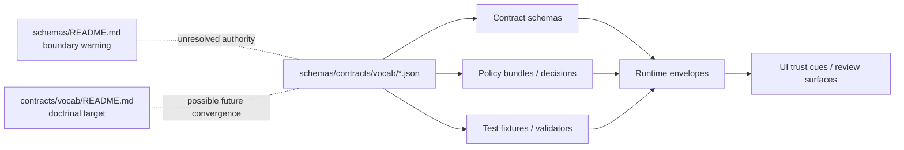

<!-- [KFM_META_BLOCK_V2]
doc_id: kfm://doc/<NEEDS_VERIFICATION_UUID>
title: schemas/contracts/vocab
type: standard
version: v1
status: draft
owners: @bartytime4life
created: <NEEDS_VERIFICATION>
updated: <NEEDS_VERIFICATION>
policy_label: <NEEDS_VERIFICATION>
related: ["../README.md", "../../README.md", "../../../contracts/vocab/README.md", "../../../docs/standards/README.md", "../../../policy/README.md", "../../../tests/README.md"]
tags: [kfm, contracts, vocab, schemas, policy]
notes: ["Current public main shows this directory with README.md plus reason_codes.json, obligation_codes.json, and reviewer_roles.json.", "Schema-home authority between schemas/ and contracts/ is still unresolved in current public docs; keep this visible until formally decided."]
[/KFM_META_BLOCK_V2] -->

# schemas/contracts/vocab

Current branch-visible JSON vocabulary lane for shared KFM contract registries.

> [!IMPORTANT]
> **CONFIRMED:** public `main` currently materializes this directory and the three starter JSON files here.  
> **NEEDS VERIFICATION:** whether this folder remains the long-term singular authority, or collapses into `contracts/vocab/`, is still unresolved in adjacent repo docs.

<div align="left">

**Status:** `experimental`  
**Owners:** `@bartytime4life`  
**Path:** `schemas/contracts/vocab/README.md`  
**Upstream:** [`../README.md`](../README.md) · [`../../README.md`](../../README.md)  
**Adjacent:** [`../../../contracts/vocab/README.md`](../../../contracts/vocab/README.md) · [`../../../docs/standards/README.md`](../../../docs/standards/README.md) · [`../../../policy/README.md`](../../../policy/README.md) · [`../../../tests/README.md`](../../../tests/README.md)  
**Downstream:** [`../v1/`](../v1/) contract schemas, policy fixtures, runtime envelopes, and trust-visible UI states


**Quick jumps:** [Scope](#scope) · [Repo fit](#repo-fit) · [Accepted inputs](#accepted-inputs) · [Exclusions](#exclusions) · [Directory tree](#directory-tree) · [Quickstart](#quickstart) · [Usage](#usage) · [Diagram](#diagram) · [Registry files](#registry-files) · [Definition of done](#definition-of-done) · [FAQ](#faq)

</div>

---

## Scope

This directory exists for **machine-readable controlled vocabularies** that cross more than one trust-bearing seam in KFM.

That means this lane is for values whose stability matters to:

- contract validation,
- policy reconstruction,
- reviewer workflow,
- runtime explanation,
- correction lineage,
- and trust-visible UI states.

In current public `main`, the visible starter set is intentionally small:

- `reason_codes.json`
- `obligation_codes.json`
- `reviewer_roles.json`

This is the right size for now. The point is not to create a giant taxonomy. The point is to prevent free-text drift where KFM most needs finite, reviewable semantics.

## Repo fit

| Item | Value |
|---|---|
| Path | `schemas/contracts/vocab/` |
| Current public contents | `README.md`, `reason_codes.json`, `obligation_codes.json`, `reviewer_roles.json` |
| Upstream context | [`../README.md`](../README.md), [`../../README.md`](../../README.md) |
| Adjacent doctrinal reference | [`../../../contracts/vocab/README.md`](../../../contracts/vocab/README.md) |
| Operational neighbors | [`../../../policy/`](../../../policy/), [`../../../tests/`](../../../tests/), [`../v1/`](../v1/) |
| Current authority posture | **NEEDS VERIFICATION** |
| Reading rule | Treat current file placement as **CONFIRMED branch reality** and long-term singular authority as **PROPOSED until formally resolved** |

### Relationship to surrounding docs

- [`../../README.md`](../../README.md) describes `schemas/` as a boundary/authority guide and explicitly warns against parallel schema universes.
- [`../../../docs/standards/README.md`](../../../docs/standards/README.md) routes API endpoint schemas and machine contracts toward `../../../contracts/`.
- [`../../../contracts/vocab/README.md`](../../../contracts/vocab/README.md) already documents the intended role of shared contract vocabularies at a more doctrinal level.
- This README therefore documents the **current branch-visible lane** without pretending the repo has already settled the canonical-home question.

## Accepted inputs

This folder accepts:

- machine-readable shared vocab registries;
- finite code lists used by more than one contract-facing surface;
- additive updates that preserve or visibly deprecate earlier meanings;
- small explanatory notes that help contributors avoid drift.

Typical fit for this directory:

- reasons for `ABSTAIN`, `DENY`, restriction, narrowing, hold, or correction;
- obligations attached to decisions or outputs;
- reviewer/steward role tokens used in approval flows.

## Exclusions

This folder does **not** hold:

| Does not belong here | Put it here instead |
|---|---|
| Full policy logic, rule bundles, or executable policy | [`../../../policy/`](../../../policy/) |
| Runtime object schemas or API payload schemas | [`../v1/`](../v1/) or the eventual canonical contract home |
| UI-only wording, labels, or presentation copy | The consuming UI surface |
| Domain-specific taxonomies that do not cross contract/policy/runtime boundaries | The relevant domain package or dataset area |
| Duplicate “canonical” copies of the same vocabulary | One decided authoritative home only |

If a value matters to only one local implementation detail, it probably does not belong here.

## Current evidence posture

| Label | Meaning in this README |
|---|---|
| **CONFIRMED** | This directory exists on public `main` and currently contains the three starter JSON files listed above. |
| **INFERRED** | These registries are intended to feed contract schemas, policy outcomes, tests, runtime envelopes, and trust-visible UI cues. |
| **PROPOSED** | Richer registry shapes, validator wiring, additive-only evolution rules, and canonical-home convergence. |
| **NEEDS VERIFICATION** | Whether `schemas/contracts/vocab/` remains authoritative or becomes a pointer to `contracts/vocab/`. |

## Directory tree

### Current public snapshot

```text
schemas/
└── contracts/
    ├── README.md
    ├── v1/
    │   ├── common/
    │   ├── correction/
    │   ├── data/
    │   ├── evidence/
    │   ├── policy/
    │   ├── release/
    │   ├── runtime/
    │   └── source/
    └── vocab/
        ├── README.md
        ├── obligation_codes.json
        ├── reason_codes.json
        └── reviewer_roles.json
```

### Expected working shape for this sub-area

```text
schemas/contracts/vocab/
├── README.md
├── reason_codes.json
├── obligation_codes.json
└── reviewer_roles.json
```

> [!NOTE]
> Keep the tree intentionally shallow until schema-home authority is formally settled. A small, explicit lane is safer than a speculative mini-platform.

## Quickstart

1. Inspect the lane.

```bash
ls -la schemas/contracts/vocab
cat schemas/contracts/vocab/reason_codes.json
cat schemas/contracts/vocab/obligation_codes.json
cat schemas/contracts/vocab/reviewer_roles.json
```

2. Compare surrounding authority docs.

```bash
sed -n '1,220p' schemas/README.md
sed -n '1,220p' contracts/README.md
sed -n '1,220p' contracts/vocab/README.md
sed -n '1,220p' docs/standards/README.md
```

3. Search for downstream references before changing any token.

```bash
grep -R "reason_code\|obligation_code\|reviewer_role" -n schemas contracts policy tests docs
```

4. Treat every change here as a contract change, not a casual docs cleanup.

## Usage

### Add a value

1. Confirm it is truly shared across multiple trust-bearing seams.
2. Add it **additively** to the correct registry file.
3. Update any referencing schema, fixture, policy rule, and example.
4. Add or update at least one positive and one negative test case where the validator flow expects them.
5. Document deprecation or replacement guidance when applicable.

### Change a value

Avoid silent rename-in-place changes.

Preferred pattern:

1. keep the existing value;
2. add a replacement value;
3. mark the old value as deprecated once registry shape supports that;
4. migrate consumers in a reviewable sequence;
5. remove only after governance and compatibility review.

### Delete a value

Deletion is the highest-risk edit in this folder. Do it only after downstream schemas, policies, fixtures, runtime emitters, and public-facing trust states are migrated or intentionally superseded.

## Diagram



## Registry files

| File | Role | Current branch state | Intended use |
|---|---|---|---|
| `reason_codes.json` | Finite reasons for abstention, denial, hold, narrowing, correction, or similar trust-preserving outcomes | Present; currently `{}` | Stabilize `reason_code` semantics across contracts, policy, tests, and runtime responses |
| `obligation_codes.json` | Finite follow-up obligations attached to decisions or outputs | Present; currently `{}` | Support explicit obligations such as review, redaction, citation repair, or restricted handling |
| `reviewer_roles.json` | Shared reviewer / steward role vocabulary | Present; currently `{}` | Keep approval and review role tokens stable across governance-aware flows |

### Why these three first

These are the smallest useful registries for preventing free-text drift in the places where KFM most strongly cares about reconstruction:

- **why** something was denied, narrowed, or withheld;
- **what** must happen next;
- **who** is allowed to review or approve it.

## Suggested file shape

The current JSON files are empty objects. That is acceptable as scaffold state, but not as durable operating state.

Illustrative starter shape only:

```json
{
  "version": "v1",
  "status": "draft",
  "values": []
}
```

A richer additive shape is also reasonable once validators exist:

```json
{
  "version": "v1",
  "status": "draft",
  "values": [
    {
      "code": "INSUFFICIENT_EVIDENCE",
      "label": "Insufficient evidence",
      "description": "Used when support does not meet release-backed or runtime evidence requirements.",
      "deprecated": false
    }
  ]
}
```

> [!WARNING]
> The examples above are illustrative only. They are **not** confirmation that the current repo already validates this shape.

## Change discipline

| Rule | Why it matters |
|---|---|
| Prefer additive changes | Minimizes downstream breakage in policy, schemas, and tests |
| Avoid free-text drift | Preserves machine-checkable explanation and reviewability |
| Keep one meaning per code | Prevents one token from silently changing contract meaning |
| Review as contract work | These files influence runtime and policy behavior, not just docs |
| Do not fork parallel copies | Duplicate vocab homes create conflicting governance semantics |

## Definition of done

- [ ] README reflects the actual current tree and does not invent implementation that is not visible.
- [ ] Authority posture is explicit: current placement is documented, long-term singular authority is not falsely claimed.
- [ ] Each JSON file has a documented role and a stable naming rule.
- [ ] Any new value is additive, reviewable, and explained.
- [ ] Downstream contract, policy, and test references are updated together.
- [ ] Valid/invalid fixture strategy is documented or linked once it exists.
- [ ] Merge-time validation catches drift once the contracts gate is wired.
- [ ] No contradictory duplicate vocabulary copy is introduced elsewhere.

## Review checks

Before merge, reviewers should ask:

- Does this value belong in a shared contract vocabulary, or is it only local implementation detail?
- Does the change preserve existing meaning for already-emitted or already-documented states?
- Are negative outcomes still finite, explicit, and reconstructable?
- Will a user-facing denial, abstention, restriction, or correction remain explainable after this change?
- Has the authority split with `contracts/vocab/` been made clearer, not murkier?

## FAQ

### Is this the authoritative home for KFM vocabularies?

**Not conclusively yet.** It is the **current public branch-visible machine-file lane** for the three starter JSON registries, but adjacent repo docs still treat schema-home authority as unresolved and warn against silent parallel authority between `schemas/` and `contracts/`.

### Why keep this README if the folder only has three tiny JSON files?

Because tiny files with shared semantics are easy to misuse. This README makes path role, exclusions, and migration risk explicit.

### Should UI text live here?

No. Shared machine codes live here. Presentation copy belongs closer to the consuming surface unless the string itself is contract-significant.

### Can we put policy enums here and policy rules in `policy/`?

Yes. That is the intended split: **finite shared tokens** here, **decision logic** in `policy/`.

### What happens if canonical authority moves to `contracts/vocab/` later?

This README should be updated into one of two states:

1. a thin pointer marking this directory non-authoritative; or
2. a generated-output README explaining how files here are produced.

Either outcome is better than leaving two silently competing homes.

## Appendix

<details>
<summary>Starter conventions worth preserving</summary>

### Naming

- use lowercase snake_case filenames;
- use constrained machine codes inside registries only if adopted consistently;
- keep plural filenames for collections, not single values.

### Good candidates for later expansion

Only after current authority is settled:

- deprecation metadata;
- human-readable labels;
- compatibility notes;
- last-reviewed metadata;
- generated docs derived from the JSON source.

### Anti-patterns

- using prose paragraphs instead of finite codes;
- storing the same code set in both `schemas/` and `contracts/`;
- changing meaning without version or migration notes;
- letting UI-only naming decide contract vocabulary.

</details>

[Back to top](#schemascontractsvocab)
