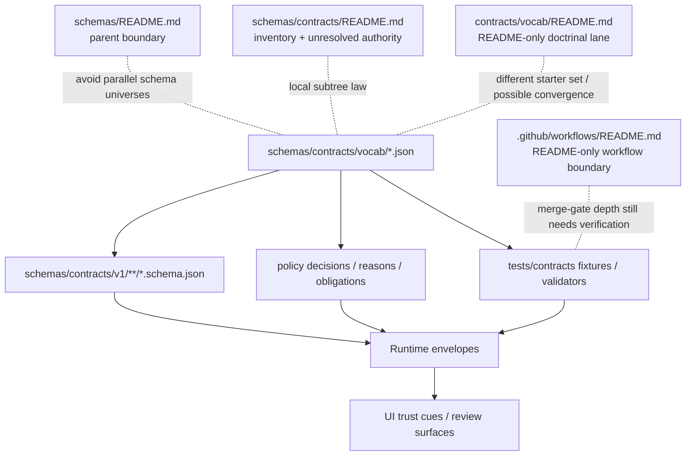

<!-- [KFM_META_BLOCK_V2]
doc_id: kfm://doc/<NEEDS_VERIFICATION_UUID>
title: schemas/contracts/vocab
type: standard
version: v1
status: draft
owners: @bartytime4life
created: <NEEDS_VERIFICATION_DATE>
updated: <NEEDS_VERIFICATION_DATE>
policy_label: <NEEDS_VERIFICATION_POLICY_LABEL>
related: ["../README.md", "../../README.md", "./reason_codes.json", "./obligation_codes.json", "./reviewer_roles.json", "../../../contracts/README.md", "../../../contracts/vocab/README.md", "../../../docs/standards/README.md", "../../../policy/README.md", "../../../tests/README.md", "../../../tests/contracts/README.md", "../../../.github/CODEOWNERS", "../../../.github/workflows/README.md"]
tags: [kfm, contracts, vocab, schemas, policy]
notes: ["Owners reflect the current public `.github/CODEOWNERS` global fallback only; no narrower `/schemas/` or `/schemas/contracts/` rule was directly verified on public `main`.", "doc_id, created, updated, and policy_label remain placeholders pending branch-local verification and file-history review.", "Current public `main` materializes this directory with `README.md` plus three JSON scaffold files; each scaffold file currently contains `{}`.", "Current public `contracts/vocab/README.md` remains README-only and names a different doctrinal starter set than the JSON files materialized here, so authority and convergence remain unresolved."]
[/KFM_META_BLOCK_V2] -->

# schemas/contracts/vocab

Current public-main JSON vocabulary lane for shared KFM contract registries.

> **Status:** `experimental`  
> **Doc status:** `draft`  
> **Owners:** `@bartytime4life` *(current public `.github/CODEOWNERS` global fallback; no narrower `/schemas/` or `/schemas/contracts/` rule was directly verified on public `main`)*  
> **Path:** `schemas/contracts/vocab/README.md`  
> **Repo fit:** parent [`../README.md`](../README.md) · upstream [`../../README.md`](../../README.md) · local files [`./reason_codes.json`](./reason_codes.json), [`./obligation_codes.json`](./obligation_codes.json), [`./reviewer_roles.json`](./reviewer_roles.json) · doctrinal neighbor [`../../../contracts/vocab/README.md`](../../../contracts/vocab/README.md) · standards route [`../../../docs/standards/README.md`](../../../docs/standards/README.md) · policy lane [`../../../policy/README.md`](../../../policy/README.md) · verification lanes [`../../../tests/README.md`](../../../tests/README.md), [`../../../tests/contracts/README.md`](../../../tests/contracts/README.md) · workflow boundary [`../../../.github/workflows/README.md`](../../../.github/workflows/README.md)  
>       
> **Quick jumps:** [Scope](#scope) · [Repo fit](#repo-fit) · [Accepted inputs](#accepted-inputs) · [Exclusions](#exclusions) · [Current evidence posture](#current-evidence-posture) · [Directory tree](#directory-tree) · [Quickstart](#quickstart) · [Usage](#usage) · [Diagram](#diagram) · [Tables](#tables) · [Task list / definition of done](#task-list--definition-of-done) · [FAQ](#faq) · [Appendix](#appendix)

> [!IMPORTANT]
> Current public `main` materializes this directory with `README.md` plus `reason_codes.json`, `obligation_codes.json`, and `reviewer_roles.json`.

> [!WARNING]
> Public `main` also keeps a separate doctrinal lane at [`../../../contracts/vocab/README.md`](../../../contracts/vocab/README.md). That file is README-only, and its named starter vocabularies are **not** a mirrored copy of the JSON registries materialized here. Do not normalize that split by guesswork.

> [!NOTE]
> `.github/workflows/README.md` is still README-only on public `main`, so merge-time vocabulary enforcement depth remains **NEEDS VERIFICATION** unless the checked-out branch proves otherwise.

---

## Scope

This directory exists for **machine-readable controlled vocabularies** that cross more than one trust-bearing seam in KFM.

That means this lane is for values whose stability matters to:

- contract validation
- policy reconstruction
- reviewer workflow
- runtime explanation
- correction lineage
- trust-visible UI states

In current public `main`, the visible starter set is intentionally small:

- `reason_codes.json`
- `obligation_codes.json`
- `reviewer_roles.json`

That is still the right size for now. The immediate goal is not taxonomy sprawl. The goal is to stop free-text drift where KFM most needs finite, reconstructable semantics.

## Repo fit

| Item | Value |
|---|---|
| Path | `schemas/contracts/vocab/` |
| Path status | **CONFIRMED** on public `main`; active-branch parity is still **NEEDS VERIFICATION** |
| Role | Machine-file vocabulary lane for shared contract registries |
| Current public contents | `README.md`, `reason_codes.json`, `obligation_codes.json`, `reviewer_roles.json` |
| Ownership signal | Public `.github/CODEOWNERS` currently applies the global fallback `* @bartytime4life` |
| Adjacent doctrinal lane | [`../../../contracts/vocab/README.md`](../../../contracts/vocab/README.md) |
| Adjacent enforcement lanes | [`../../../policy/README.md`](../../../policy/README.md), [`../../../tests/README.md`](../../../tests/README.md), [`../../../tests/contracts/README.md`](../../../tests/contracts/README.md), [`../../../.github/workflows/README.md`](../../../.github/workflows/README.md) |
| Downstream burden | Contract schemas, policy outcomes, test fixtures, runtime envelopes, and trust-visible UI cues |
| Current authority posture | **NEEDS VERIFICATION** |

### Current split signals

| Surface | Current public state | How to read it |
|---|---|---|
| `schemas/contracts/vocab/` | `README.md` plus three JSON scaffold files | This is the current branch-visible machine-file lane |
| `../../../contracts/vocab/README.md` | README-only doctrinal lane; its starter set names `policy_label`, `artifact.zone`, `citation.kind`, and `geometry.generalization_method` | Vocabulary doctrine exists, but it is not a mirrored machine-file twin of this directory |
| `../../README.md` | Parent live-tree index that warns against parallel schema universes | Parent and local tree descriptions should stay synchronized |
| `../README.md` | Local subtree README that says the subtree is real but still not silently canonical | Sibling boundary guidance supports the same unresolved-authority posture |
| `../../../docs/standards/README.md` | Routes API endpoint schemas and machine contracts toward `../../../contracts/` | The strongest cross-cutting standards signal still favors `contracts/` |
| `../../../policy/README.md` | Keeps reasons and obligations explicit in deny-by-default policy posture | Vocab edits here have policy and runtime consequences even if the registries remain scaffold-state |
| `../../../tests/contracts/README.md` | Contract-facing verification family is visible, but current public inventory is README-only | Fixture and harness maturity stay downstream until a checked-out branch proves more |

### Relationship to surrounding docs

- [`../../README.md`](../../README.md) treats `schemas/` as both a live subtree index and an authority-boundary warning.
- [`../README.md`](../README.md) already frames `schemas/contracts/` as **real inventory plus unresolved law**.
- [`../../../contracts/vocab/README.md`](../../../contracts/vocab/README.md) is a doctrinal vocabulary surface, but its current starter set is not a one-to-one mirror of the JSON files materialized here.
- [`../../../docs/standards/README.md`](../../../docs/standards/README.md) keeps standards prose downstream of machine-facing enforcement.
- [`../../../policy/README.md`](../../../policy/README.md) and [`../../../tests/contracts/README.md`](../../../tests/contracts/README.md) keep policy logic and contract-facing proof work outside this lane.

## Accepted inputs

This folder accepts:

- machine-readable shared vocab registries
- finite code lists used by more than one contract-facing surface
- additive updates that preserve or visibly deprecate earlier meanings
- small explanatory notes that help contributors avoid drift without pretending validators already exist

Typical fit for this directory:

- reasons for `ABSTAIN`, `DENY`, restriction, narrowing, hold, or correction
- obligations attached to decisions or outputs
- reviewer or steward role tokens used in approval flows

## Exclusions

This folder does **not** hold:

| Does not belong here | Put it here instead |
|---|---|
| Full policy logic, rule bundles, or executable policy | [`../../../policy/`](../../../policy/) |
| Runtime object schemas or API payload schemas | [`../v1/`](../v1/) or the eventual canonical contract home |
| Valid / invalid fixture packs | [`../../../tests/contracts/`](../../../tests/contracts/) or other shared fixture lanes under `tests/` |
| UI-only wording, labels, or presentation copy | The consuming UI surface |
| Domain-specific taxonomies that do not cross contract/policy/runtime boundaries | The relevant domain package or dataset area |
| Duplicate “canonical” copies of the same vocabulary | One decided authoritative home only |
| Ad hoc attempts to make this lane look symmetrical with `contracts/vocab/` | Resolve authority first, then reconcile deliberately |

If a value matters to only one local implementation detail, it probably does not belong here.

## Current evidence posture

| Label | Meaning in this README |
|---|---|
| **CONFIRMED** | This directory exists on public `main`, contains the three starter JSON files listed above, and each current JSON body is `{}`. |
| **INFERRED** | These registries are intended to feed contract schemas, policy outcomes, tests, runtime envelopes, and trust-visible UI cues. |
| **PROPOSED** | Richer registry shapes, additive-only evolution rules, validator wiring, and canonical-home convergence. |
| **NEEDS VERIFICATION** | Whether `schemas/contracts/vocab/` remains authoritative, becomes a pointer, or hands off to `contracts/vocab/`. |

## Directory tree

### Current public snapshot

```text
schemas/
└── contracts/
    ├── README.md
    ├── v1/
    │   ├── README.md
    │   ├── common/
    │   ├── correction/
    │   ├── data/
    │   ├── evidence/
    │   ├── policy/
    │   ├── release/
    │   ├── runtime/
    │   └── source/
    └── vocab/
        ├── README.md
        ├── obligation_codes.json
        ├── reason_codes.json
        └── reviewer_roles.json
```

### Expected working shape for this sub-area

```text
schemas/contracts/vocab/
├── README.md
├── reason_codes.json
├── obligation_codes.json
└── reviewer_roles.json
```

> [!NOTE]
> Keep the tree intentionally shallow until schema-home authority is formally settled. A small, explicit lane is safer than a speculative mini-platform.

## Quickstart

1. Inspect the lane.

```bash
ls -la schemas/contracts/vocab
cat schemas/contracts/vocab/reason_codes.json
cat schemas/contracts/vocab/obligation_codes.json
cat schemas/contracts/vocab/reviewer_roles.json
```

2. Re-open the parent, sibling, doctrinal, policy, verification, and workflow docs before editing anything.

```bash
sed -n '1,220p' schemas/README.md
sed -n '1,260p' schemas/contracts/README.md
sed -n '1,220p' contracts/README.md
sed -n '1,220p' contracts/vocab/README.md
sed -n '1,220p' docs/standards/README.md
sed -n '1,220p' policy/README.md
sed -n '1,220p' tests/contracts/README.md
sed -n '1,220p' .github/workflows/README.md
```

3. Verify owner signals and file-history placeholders before you replace any review markers.

```bash
sed -n '1,220p' .github/CODEOWNERS
git log --follow -- schemas/contracts/vocab/README.md
git log --follow -- schemas/contracts/vocab/reason_codes.json
git log --follow -- schemas/contracts/vocab/obligation_codes.json
git log --follow -- schemas/contracts/vocab/reviewer_roles.json
```

4. Search downstream references before changing any token.

```bash
grep -R "reason_code\|obligation_code\|reviewer_role" -n schemas contracts policy tests docs apps packages
grep -R "policy_label\|artifact\.zone\|citation\.kind\|geometry\.generalization_method" -n schemas contracts policy tests docs apps packages
```

5. Treat every change here as **contract work**, not a casual docs cleanup.

## Usage

### Add a value

1. Confirm it is truly shared across multiple trust-bearing seams.
2. Add it **additively** to the correct registry file.
3. Update any referencing schema, fixture, policy rule, and example.
4. Add or update at least one positive and one negative test case where the validator flow expects them.
5. Document deprecation or replacement guidance when applicable.

### Change a value

Avoid silent rename-in-place changes.

Preferred pattern:

1. keep the existing value
2. add a replacement value
3. mark the old value as deprecated once the registry shape supports that
4. migrate consumers in a reviewable sequence
5. remove only after governance and compatibility review

### Delete a value

Deletion is the highest-risk edit in this folder. Do it only after downstream schemas, policies, fixtures, runtime emitters, and public-facing trust states are migrated or intentionally superseded.

### When both vocab lanes seem relevant

1. Decide whether the change is about **current machine-file inventory**, **doctrinal vocabulary direction**, or **both**.
2. If it touches both, update [`../../README.md`](../../README.md), [`../README.md`](../README.md), this file, and [`../../../contracts/vocab/README.md`](../../../contracts/vocab/README.md) in the same change stream.
3. Do **not** rename or repurpose this directory’s starter files just to make them look symmetrical with the doctrinal lane.
4. Do **not** assume that a starter set named in `contracts/vocab/README.md` is already materialized here unless the checked-out branch proves it.

## Diagram



## Tables

### Registry files

| File | Role | Current public state | Intended use |
|---|---|---|---|
| `reason_codes.json` | Finite reasons for abstention, denial, hold, narrowing, correction, or similar trust-preserving outcomes | Present; current body `{}` | Stabilize `reason_code` semantics across contracts, policy, tests, and runtime responses |
| `obligation_codes.json` | Finite follow-up obligations attached to decisions or outputs | Present; current body `{}` | Support explicit obligations such as review, redaction, citation repair, or restricted handling |
| `reviewer_roles.json` | Shared reviewer / steward role vocabulary | Present; current body `{}` | Keep approval and review role tokens stable across governance-aware flows |

### Current public starter-set tension

| Surface | Named starter set there | Current materialization | Review consequence |
|---|---|---|---|
| `schemas/contracts/vocab/` | `reason_codes`, `obligation_codes`, `reviewer_roles` | README + 3 JSON files, all currently `{}` | This is the live machine-file scaffold, but it is still placeholder-heavy |
| `contracts/vocab/README.md` | `policy_label`, `artifact.zone`, `citation.kind`, `geometry.generalization_method` | README only | Doctrinal vocabulary planning exists, but it is not yet a mirrored JSON lane here |

### Why these three first

These are the smallest useful registries for preventing free-text drift in the places where KFM most strongly cares about reconstruction:

- **why** something was denied, narrowed, or withheld
- **what** must happen next
- **who** is allowed to review or approve it

## Task list / definition of done

- [ ] README reflects the actual current tree and does not invent implementation that is not visible.
- [ ] Authority posture is explicit: current placement is documented, long-term singular authority is not falsely claimed.
- [ ] The current split between doctrinal `contracts/vocab/README.md` guidance and machine-file scaffolding here is made clearer, not murkier.
- [ ] The starter-set mismatch between the two lanes is visible and not hand-waved into false symmetry.
- [ ] Parent and sibling schema-lane READMEs stay synchronized with this lane’s visible tree truth.
- [ ] Each JSON file has a documented role and a stable naming rule.
- [ ] Any new value is additive, reviewable, and explained.
- [ ] Downstream contract, policy, and test references are updated together.
- [ ] Valid/invalid fixture strategy is documented or linked once it exists.
- [ ] Merge-time validation claims stay conservative until checked-in workflow YAML or branch-local evidence proves more.
- [ ] No contradictory duplicate vocabulary copy is introduced elsewhere.

## Review checks

Before merge, reviewers should ask:

- Does this value belong in a shared contract vocabulary, or is it only local implementation detail?
- Does the change preserve existing meaning for already-emitted or already-documented states?
- Are negative outcomes still finite, explicit, and reconstructable?
- Will a user-facing denial, abstention, restriction, or correction remain explainable after this change?
- Has the authority split with `contracts/vocab/` been made clearer, not murkier?
- Has the starter-set mismatch been documented honestly instead of silently “fixed” in prose?
- If this lane changed, did parent and sibling schema-lane READMEs stay truthful too?
- Did the PR avoid claiming live workflow enforcement that the checked-out branch cannot prove?

## FAQ

### Is this the authoritative home for KFM vocabularies?

**Not conclusively yet.** It is the **current public branch-visible machine-file lane** for three starter JSON registries, but adjacent repo docs still treat schema-home authority as unresolved.

### Why keep this README if the folder only has three tiny JSON files?

Because tiny files with shared semantics are easy to misuse. This README makes path role, exclusions, starter-set tension, migration risk, and cross-lane obligations explicit.

### Why does `contracts/vocab/README.md` exist separately today?

Because current public `main` splits **doctrinal vocabulary guidance** and **machine-file scaffolding** across two lanes. `contracts/vocab/README.md` explains a broader vocabulary direction, while this directory currently holds the three starter JSON files. Until authority is resolved, that split should be treated as governed ambiguity, not as permission to let semantics diverge.

### Why aren't the starter sets identical?

Because the doctrinal lane and the machine-file lane are **not yet** a mirrored pair. `contracts/vocab/README.md` currently names starter vocabularies around policy labels, artifact zones, citation kinds, and geometry generalization. This directory currently materializes JSON scaffolds for reasons, obligations, and reviewer roles. That difference is a repo fact to manage explicitly, not a signal to silently rewrite either lane.

### Should UI text live here?

No. Shared machine codes live here. Presentation copy belongs closer to the consuming surface unless the string itself is contract-significant.

### Can we put policy enums here and policy rules in `policy/`?

Yes. That is the intended split: **finite shared tokens** here, **decision logic** in `policy/`.

### What happens if canonical authority moves to `contracts/vocab/` later?

This README should be updated into one of two states:

1. a thin pointer marking this directory non-authoritative
2. a generated-output README explaining how files here are produced

Either outcome is better than leaving two silently competing homes.

## Appendix

<details>
<summary>Starter conventions worth preserving</summary>

### Naming

- use lowercase snake_case filenames
- use constrained machine codes inside registries only if adopted consistently
- keep plural filenames for collections, not single values

### Illustrative starter shapes

These examples show safe **shape directions**, not current-state claims.

```json
{
  "version": "v1",
  "status": "draft",
  "values": []
}
```

```json
{
  "version": "v1",
  "status": "draft",
  "values": [
    {
      "code": "INSUFFICIENT_EVIDENCE",
      "label": "Insufficient evidence",
      "description": "Used when support does not meet release-backed or runtime evidence requirements.",
      "deprecated": false
    }
  ]
}
```

> [!WARNING]
> The examples above are illustrative only. They are **not** confirmation that the current repo already validates this shape.

### Good candidates for later expansion

Only after current authority is settled:

- deprecation metadata
- human-readable labels
- compatibility notes
- last-reviewed metadata
- generated docs derived from the JSON source

### Anti-patterns

- using prose paragraphs instead of finite codes
- storing the same code set in both `schemas/` and `contracts/` without an explicit declared mirror strategy
- changing meaning without version or migration notes
- letting UI-only naming decide contract vocabulary
- using this README to imply merge-blocking workflow enforcement that the checked-out branch cannot prove

</details>

<details>
<summary>Still-open verification items</summary>

- `doc_id`, `created`, `updated`, and `policy_label` in the meta block
- branch-local file history and last-intended status for each JSON scaffold
- exact merge-gate or validator workflow path, if any, on the branch under review
- singular authority decision between `schemas/contracts/vocab/` and `contracts/vocab/`
- whether `contracts/vocab/` will stay doctrinal-only or gain machine-file mirrors later

</details>

[Back to top](#schemascontractsvocab)
