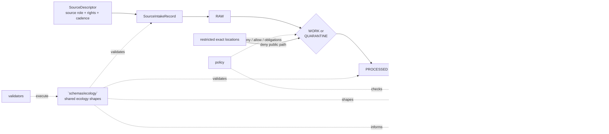

<!-- [KFM_META_BLOCK_V2]
doc_id: kfm://doc/<NEEDS_VERIFICATION_UUID>
title: schemas/ecology
type: standard
version: v1
status: draft
owners: <NEEDS_VERIFICATION_OWNER>
created: 2026-04-24
updated: 2026-04-24
policy_label: <NEEDS_VERIFICATION_POLICY_LABEL>
related: [../README.md, ../contracts/README.md, ../contracts/v1/README.md, ../../docs/adr/ADR-schema-home.md, ../../policy/README.md, ../../tests/README.md, ../../tools/validators/README.md, ../../data/registry/README.md]
tags: [kfm, schemas, ecology, habitat, fauna, flora, evidence, governance]
notes: [doc_id owner and policy_label need repo verification, schema-home authority remains unresolved until ADR and branch inspection, proposed schema names below are not claimed as existing files]
[/KFM_META_BLOCK_V2] -->

<a id="top"></a>

# `schemas/ecology`

Boundary README for ecology-facing schema work across habitat, fauna, flora, ecosystem context, and public-safe ecological claims.

> **Impact block**  
> **Status:** `experimental` · **Doc status:** `draft` · **Owners:** `<NEEDS_VERIFICATION_OWNER>`  
>       
> **Quick jumps:** [Scope](#scope) · [Repo fit](#repo-fit) · [Inputs](#inputs) · [Exclusions](#exclusions) · [Directory tree](#directory-tree) · [Quickstart](#quickstart) · [Usage](#usage) · [Diagram](#diagram) · [Tables](#tables) · [Task list](#task-list--definition-of-done) · [FAQ](#faq) · [Appendix](#appendix)  
> **Repo fit:** path `schemas/ecology/README.md` · upstream [`../README.md`](../README.md) · versioned contract lane [`../contracts/v1/README.md`](../contracts/v1/README.md) · policy sibling [`../../policy/README.md`](../../policy/README.md) · fixture/testing sibling [`../../tests/README.md`](../../tests/README.md)  
> **Accepted inputs:** schema boundary notes, JSON Schema files or schema indexes for shared ecology object families, public-safe examples, migration notes, and schema-to-validator routing.  
> **Exclusions:** raw ecological data, exact sensitive locations, source credentials, live connector code, publication artifacts, UI runtime components, and policy bundles.

> [!IMPORTANT]
> `schemas/ecology/` is a **schema boundary**, not an ecology truth store. It must not contain raw biodiversity records, exact rare-species coordinates, source-pull caches, release bundles, or public-facing claims that cannot resolve through `EvidenceRef -> EvidenceBundle`.

---

## Scope

`schemas/ecology/` exists to keep shared ecological schema concerns visible without collapsing KFM’s distinct ecological lanes.

Use this directory for schema-level material that cuts across one or more of:

- habitat context and habitat assignment
- fauna occurrence, taxon, status, range, and public-safe derivative views
- flora occurrence, rare-plant sensitivity, vegetation, and community context
- ecosystem services, landcover, ecological monitoring, and modeled ecological support
- public-safe geometry transforms and sensitivity classification
- Evidence Drawer and Focus Mode payload compatibility, when the payload is ecology-specific

This README intentionally keeps **schema authorship**, **policy enforcement**, **source admission**, **runtime behavior**, and **publication proof** separate.

### Working labels used here

| Label | Meaning in this README |
|---|---|
| `CONFIRMED` | Verified from current project doctrine or from direct workspace inspection in the authoring session. |
| `INFERRED` | Reasonable placement or relationship derived from neighboring KFM doctrine, but not branch-verified. |
| `PROPOSED` | Safe build direction that still needs active-branch implementation evidence. |
| `UNKNOWN` | Not verifiable until the actual repo tree, tests, workflows, or runtime artifacts are inspected. |
| `NEEDS VERIFICATION` | Specific check required before promotion from draft to review or active use. |

[Back to top](#top)

---

## Repo fit

This file should behave as the ecology schema lane’s navigational edge. It should help maintainers answer: “Does this schema-shaped ecology thing belong here, under versioned shared contracts, under policy, or somewhere else?”

| Relationship | Path from `schemas/ecology/` | Status | Use |
|---|---:|---|---|
| Schema root | [`../README.md`](../README.md) | `NEEDS VERIFICATION` | Parent schema boundary and repository-wide schema posture. |
| Human/machine contract split | [`../contracts/README.md`](../contracts/README.md) | `NEEDS VERIFICATION` | Contract lane companion when schemas live under `schemas/contracts/`. |
| Versioned contract schemas | [`../contracts/v1/README.md`](../contracts/v1/README.md) | `NEEDS VERIFICATION` | Likely canonical home for shared object-family schemas after ADR resolution. |
| Schema-home ADR | [`../../docs/adr/ADR-schema-home.md`](../../docs/adr/ADR-schema-home.md) | `PROPOSED / NEEDS VERIFICATION` | Records whether ecology machine files live here, under `schemas/contracts/v1/`, or elsewhere. |
| Policy | [`../../policy/README.md`](../../policy/README.md) | `NEEDS VERIFICATION` | Deny-by-default rules, obligations, source-role policy, and sensitivity/publication checks. |
| Validators | [`../../tools/validators/README.md`](../../tools/validators/README.md) | `NEEDS VERIFICATION` | Schema validation, fixture validation, EvidenceBundle checks, and no-bypass checks. |
| Tests | [`../../tests/README.md`](../../tests/README.md) | `NEEDS VERIFICATION` | Valid/invalid fixtures, no-network tests, policy-deny tests, and runtime-proof slices. |
| Source registry | [`../../data/registry/README.md`](../../data/registry/README.md) | `NEEDS VERIFICATION` | Source descriptors, source-role posture, rights, cadence, and activation status. |

> [!NOTE]
> The target path is user-specified and repo-ready, but the active branch was not mounted during authoring. Keep links and file homes reviewable until a maintainer verifies the branch layout.

[Back to top](#top)

---

## Inputs

### What belongs here

Place material in `schemas/ecology/` when the primary object is a **schema-level ecology contract** or a **schema-routing note** for ecological object families.

| Accepted input | Fits here when… | Required posture |
|---|---|---|
| Ecology schema index | It routes shared ecological schema files and their validators. | Must not claim unresolved files exist. |
| Ecology claim schema | It defines claim text, spatial/temporal scope, evidence refs, source role, and review/release posture for ecology-specific claims. | Must require evidence linkage. |
| Habitat assignment schema | It describes a public-safe relation between an occurrence or ecological unit and habitat context. | Must distinguish observation, derivation, and model support. |
| Public occurrence view schema | It defines a release-safe outward view of occurrence-derived data. | Must exclude restricted geometry and private source fields. |
| Sensitivity classification schema | It classifies ecological sensitivity, embargo, steward review, and public geometry rules. | Must fail closed when sensitivity or rights are unknown. |
| Public geometry transform schema | It records generalization, aggregation, withholding, or redaction transforms. | Must include transform reason and receipt linkage. |
| Ecosystem context schema | It describes landcover, habitat, ecological service, or modeled context without turning it into occurrence truth. | Must label modeled/supporting context visibly. |
| Ecology layer manifest extension | It adds ecology-specific layer fields to a shared `LayerManifest`. | Must not replace the shared manifest schema. |
| Schema migration note | It maps older ecology schema names to current names. | Must include compatibility and rollback guidance. |

### Minimum schema posture

Every schema accepted here should be able to answer four review questions:

1. What object family does this schema govern?
2. What evidence, source role, rights, sensitivity, and review fields are required?
3. What public output is explicitly disallowed?
4. Which validator or fixture set proves the contract?

[Back to top](#top)

---

## Exclusions

This directory is **not** the canonical home for every ecology-adjacent artifact.

| Does **not** belong here | Put it here instead | Why |
|---|---|---|
| Raw GBIF, eBird, iNaturalist, KDWP, NatureServe, USFWS, NLCD, LANDFIRE, GAP, NWI, PAD-US, or similar source pulls | governed data lifecycle zones | Source payload custody is lifecycle work, not schema work. |
| Exact sensitive species, rare plant, nest, den, roost, hibernacula, spawning, or steward-controlled coordinates | restricted RAW / WORK / QUARANTINE surfaces | Schema files must never carry sensitive real-world coordinates. |
| Source credentials, API keys, access tokens, cookies, or private source terms | secret management and source registry controls | Secrets and private terms do not belong in schemas or docs. |
| Policy-as-code bundles | [`../../policy/README.md`](../../policy/README.md) | Policy enforcement should stay executable and reviewable in the policy lane. |
| Live connector code, scraper code, watcher code, or scheduling logic | tools, pipelines, or package lanes | Implementation code should consume schemas, not live inside them. |
| Release manifests, proof packs, receipts, signatures, and published bundles | release, proof, receipt, or catalog surfaces | Publication proof is a separate KFM trust object family. |
| MapLibre components, React components, or Evidence Drawer UI code | application/UI surfaces | UI consumes schema-shaped payloads but should not define schema authority by itself. |
| General `EvidenceBundle`, `DecisionEnvelope`, `RunReceipt`, or `ReleaseManifest` definitions | shared versioned contract schemas | Shared trust objects should not be redefined per domain. |
| Broad habitat, fauna, or flora implementation manuals | domain documentation lanes | This README is a routing boundary, not a replacement for domain architecture docs. |

[Back to top](#top)

---

## Directory tree

### Current safe claim

At authoring time, no active branch inventory was available. The only safe target claim is the requested README path itself.

```text
schemas/
└── ecology/
    └── README.md
```

### Preferred growth shape (`PROPOSED` / `NEEDS VERIFICATION`)

Use this only after the schema-home ADR and active branch inspection confirm that ecology machine files belong directly under `schemas/ecology/`.

```text
schemas/
└── ecology/
    ├── README.md
    ├── ecology_claim.schema.json
    ├── habitat_assignment.schema.json
    ├── occurrence_public_view.schema.json
    ├── sensitivity_classification.schema.json
    ├── public_geometry_transform.schema.json
    ├── ecosystem_context.schema.json
    ├── ecology_layer_manifest_extension.schema.json
    ├── migration_map.md
    └── examples/
        ├── public_safe_habitat_assignment.example.json
        ├── generalized_occurrence_view.example.json
        └── denied_sensitive_exact_location.example.json
```

### Alternate growth shape if versioned contracts are canonical (`PROPOSED`)

If the repo resolves machine schemas under `schemas/contracts/v1/`, keep this directory as a routing README and place machine-readable files under a versioned contract lane.

```text
schemas/
├── ecology/
│   └── README.md
└── contracts/
    └── v1/
        └── ecology/
            ├── ecology_claim.schema.json
            ├── habitat_assignment.schema.json
            ├── occurrence_public_view.schema.json
            ├── sensitivity_classification.schema.json
            ├── public_geometry_transform.schema.json
            └── ecosystem_context.schema.json
```

> [!TIP]
> Do not maintain divergent copies in both locations. If both paths exist, one must be a compatibility index, alias map, or migration surface—not a competing authority.

[Back to top](#top)

---

## Quickstart

Run these checks from the repository root before adding or moving ecology schemas.

### 1) Confirm branch and path reality

```bash
git status --short
find schemas -maxdepth 3 -type f | sort
find schemas/ecology -maxdepth 3 -type f | sort
find schemas/contracts/v1 -maxdepth 4 -type f | sort
```

### 2) Inspect adjacent governance surfaces

```bash
find docs policy tests tools data/registry -maxdepth 3 -type f 2>/dev/null | sort
find .github -maxdepth 3 -type f 2>/dev/null | sort
```

### 3) Validate ecology schemas with repo-native tooling

The commands below are `PROPOSED` placeholders. Replace them with the repo’s actual validator commands once verified.

```bash
python tools/validators/validate_schema_registry.py --domain ecology --no-network
python tools/validators/validate_evidence_bundle.py --fixtures tests/fixtures/ecology --no-network
python tools/validators/validate_layer_manifest.py --domain ecology --no-network
```

### 4) Check for sensitive-data mistakes

```bash
grep -RInE 'restricted_geometry_ref|private_lat|private_lon|exact_sensitive|api_key|token|secret' schemas/ecology tests/fixtures/ecology 2>/dev/null || true
```

> [!CAUTION]
> A clean grep is not a privacy guarantee. It is only a cheap first pass. Public-safe ecology work still needs policy checks, source-rights review, sensitivity classification, and redaction receipt validation.

[Back to top](#top)

---

## Usage

### Placement rule

Use `schemas/ecology/` when the schema is **shared across ecological lanes** or when it defines the outward-safe form of an ecology object. Use a narrower lane when the schema belongs only to habitat, fauna, flora, agriculture, hydrology, or another domain.

### Separation rule

Do not collapse these into one trust class:

- observed occurrence
- specimen or survey record
- modeled habitat suitability
- regulatory or statutory status
- protected-area context
- landcover or ecosystem context
- public-safe derived layer
- AI or Focus Mode summary

Each schema should make the source role and knowledge character visible enough that validators, Evidence Drawer payloads, and Focus Mode responses cannot silently blur them.

### Public-safe output rule

Any outward-facing ecology schema must make room for:

- `source_role`
- `evidence_refs`
- `rights_status`
- `sensitivity_class`
- `precision_served`
- `generalized`
- `redaction_receipt_ref`
- `review_state`
- `release_state`

Illustrative example only:

```json
{
  "claim_id": "kfm:claim:ecology:example-public-safe-habitat-assignment",
  "domain": "ecology",
  "claim_kind": "habitat_assignment",
  "source_role": "derived_context",
  "spatial_scope": {
    "precision_served": "generalized_grid",
    "generalized": true
  },
  "evidence_refs": [
    "kfm:evidence:bundle:example"
  ],
  "rights_status": "public_release_allowed",
  "sensitivity_class": "public_generalized",
  "review_state": "reviewed",
  "release_state": "published"
}
```

> [!IMPORTANT]
> The example above is illustrative. Do not treat field names as canonical until the active branch’s shared schemas and validator expectations are verified.

[Back to top](#top)

---

## Diagram



This diagram shows the schema lane as a **validation and shape surface**, not as a storage, publication, or runtime authority.

[Back to top](#top)

---

## Tables

### Boundary matrix

| Object family | Should `schemas/ecology/` own it? | Better home when not owned here | Notes |
|---|---:|---|---|
| `EcologyClaim` | `PROPOSED` | `schemas/contracts/v1/ecology/` if versioned contracts are canonical | Shared claim envelope for ecology-specific claim semantics. |
| `HabitatAssignment` | `PROPOSED` | habitat/fauna/flora lane if narrower | Must preserve derivation and public-safety posture. |
| `OccurrencePublicView` | `PROPOSED` | fauna/flora occurrence schema lane if domain-specific | Public view only; no restricted geometry. |
| `SensitivityClassification` | `PROPOSED` | shared policy schema if repo has one | Should align with policy obligations. |
| `PublicGeometryTransform` | `PROPOSED` | shared redaction/receipt schema if repo has one | Must link to transform receipt. |
| `EcosystemContext` | `PROPOSED` | landcover/ecosystem-services schema lane if narrower | Must label modeled/supporting context. |
| `SourceDescriptor` | no | source contract / data registry surface | Ecology uses descriptors; it should not redefine the shared descriptor. |
| `EvidenceBundle` | no | shared versioned contract schema | Ecology schemas reference bundles. |
| `DecisionEnvelope` / `RuntimeResponseEnvelope` | no | shared runtime contract schema | Ecology payloads should fit shared finite outcomes. |
| `LayerManifest` | extension only | shared layer manifest schema | Ecology-specific extension must not replace root manifest. |
| `RunReceipt` / `ReleaseManifest` | no | shared proof/release contract schemas | Release proof is not domain-schema ownership. |

### Trust posture matrix

| Situation | Schema posture | Expected downstream behavior |
|---|---|---|
| Public-safe generalized habitat assignment | Permit schema validation if evidence refs, source role, review, and release state are present. | `ANSWER` may be allowed by governed runtime after policy checks. |
| Missing provenance or missing source role | Schema should fail or force explicit unresolved state. | `ABSTAIN` or `HOLD`; do not bluff. |
| Unknown rights | Schema may validate as a candidate only if rights are marked unknown. | Public promotion denied until rights are resolved. |
| Exact sensitive species location | Schema must not permit outward public payloads carrying exact restricted geometry. | `DENY`, withhold, or require steward review. |
| Modeled habitat or ecosystem context | Schema must label it as modeled/supporting context. | UI and Focus Mode must not present it as observed occurrence truth. |
| Malformed ecology payload | Schema validation should fail visibly. | `ERROR` for runtime proof, not a disguised abstention. |

[Back to top](#top)

---

## Task list & definition of done

### Before this README moves from `draft` to `review`

- [ ] Replace `<NEEDS_VERIFICATION_UUID>` with a real `kfm://doc/<uuid>` value.
- [ ] Replace `<NEEDS_VERIFICATION_OWNER>` with repo-backed owner evidence.
- [ ] Replace `<NEEDS_VERIFICATION_POLICY_LABEL>` with the repo’s actual label.
- [ ] Verify whether `schemas/ecology/` exists on the active branch.
- [ ] Verify whether machine schemas belong here or under `schemas/contracts/v1/ecology/`.
- [ ] Add or link the schema-home ADR.
- [ ] Confirm sibling `policy`, `tests`, `tools/validators`, and `data/registry` paths.
- [ ] Confirm whether habitat, fauna, and flora have existing schema lanes that this README must not duplicate.

### Ecology schema definition of done

- [ ] Schema has a clear object family and version.
- [ ] Schema requires evidence linkage where the object can support a consequential claim.
- [ ] Schema distinguishes observation, derivation, model, regulatory context, and public-safe summary.
- [ ] Schema supports source role, rights, sensitivity, review, and release state.
- [ ] Schema cannot validate a public payload that leaks restricted exact geometry.
- [ ] Valid and invalid fixtures exist.
- [ ] Validator command is documented and no-network capable.
- [ ] Policy-deny cases are represented in fixtures or tests.
- [ ] Migration or alias behavior is documented if a previous schema name existed.
- [ ] Rollback is possible by reverting schema files and invalidating only affected derived artifacts.

### Review gates

- [ ] Documentation review: headings, links, and meta block are consistent.
- [ ] Schema review: fields are canonical or explicitly marked proposed.
- [ ] Policy review: deny-by-default behavior is not weakened.
- [ ] Steward/sensitivity review: rare species and controlled ecological data cannot leak.
- [ ] Test review: valid/invalid fixtures prove the schema’s real boundary.
- [ ] Release review: schemas do not imply publication readiness.

[Back to top](#top)

---

## FAQ

### Why an `ecology` schema lane if habitat, fauna, and flora are separate?

Because some schema concerns are shared across ecological lanes: public-safe claim shape, habitat assignment, sensitivity classification, redaction transform, and Evidence Drawer payload compatibility. This directory should coordinate those shared shapes without flattening habitat, fauna, and flora into one model.

### Can source descriptors live here?

Usually no. Actual source descriptors and activation posture belong in source registry or source contract surfaces. This directory may define or reference the schema shape used by source descriptors, but it should not become the source registry.

### Can this directory contain exact occurrence examples?

No. Example fixtures under this lane must be synthetic, generalized, masked, or intentionally invalid. Exact sensitive ecological locations do not belong in public schema examples.

### Can an AI or Focus Mode response cite an ecology schema as evidence?

No. A schema defines shape. It is not evidence for a real-world ecological claim. Runtime or AI outputs must resolve evidence through `EvidenceRef -> EvidenceBundle` and pass policy checks.

### What happens if `schemas/contracts/v1/ecology/` already exists?

Treat this README as a compatibility and routing surface. Do not duplicate machine schemas. Update the directory tree, related links, and migration map so maintainers can tell which path is canonical.

[Back to top](#top)

---

## Appendix

<details>
<summary><strong>Appendix A — Proposed ecology schema review checklist</strong></summary>

Use this checklist when introducing a new ecology schema.

| Check | Pass condition |
|---|---|
| Object identity | The schema has stable `$id`, title, version, and object family. |
| Evidence posture | Objects that support claims require `evidence_refs` or explicitly state why not. |
| Source role | Schema requires source role when source authority affects interpretation. |
| Rights | Unknown or restricted rights cannot pass public-promotion fixtures. |
| Sensitivity | Sensitive exact geometry is denied or withheld from public output shapes. |
| Review state | Schema distinguishes draft, candidate, reviewed, held, denied, and published states where relevant. |
| Release state | Outward public objects cannot pretend candidate/work artifacts are published. |
| Temporal scope | Event date, source freshness, and publication date are not collapsed. |
| Spatial scope | Precision served is explicit and not confused with source precision. |
| Validator | Valid and invalid fixtures exist and run without network access. |
| Migration | Older names or paths are mapped or explicitly deprecated. |

</details>

<details>
<summary><strong>Appendix B — Suggested minimal field vocabulary (`PROPOSED`)</strong></summary>

These field names are proposed vocabulary only. Reconcile with mounted repo schemas before treating them as canonical.

```text
claim_id
domain
claim_kind
source_refs
source_role
evidence_refs
rights_status
sensitivity_class
review_state
release_state
spatial_scope
temporal_scope
precision_source
precision_served
generalized
redaction_receipt_ref
policy_labels
spec_hash
run_receipt_ref
catalog_record_ref
```

</details>

<details>
<summary><strong>Appendix C — Anti-patterns this README should prevent</strong></summary>

- Treating a modeled habitat surface as observed species presence.
- Treating a regulatory status layer as occurrence evidence.
- Publishing exact rare-species or steward-controlled coordinates through examples or fixtures.
- Creating ecology-specific clones of shared `EvidenceBundle`, `DecisionEnvelope`, `RunReceipt`, or `ReleaseManifest`.
- Letting source-role fields become optional because a map layer “looks right.”
- Accepting unknown rights as public-release-safe.
- Allowing AI, Focus Mode, or UI text to cite schemas instead of evidence.
- Maintaining competing schema copies under both `schemas/ecology/` and `schemas/contracts/v1/ecology/`.

</details>

[Back to top](#top)
