<!-- [KFM_META_BLOCK_V2]
doc_id: kfm://doc/schemas-evidence-readme
title: schemas/evidence/ — Evidence-Schema Compatibility and Migration Boundary
type: README
version: v0.3
status: draft; repository-grounded; compatibility-pointer; two-document-lane; no-direct-schemas; versioned-family-mixed-maturity; migration-unresolved; non-authoritative; non-enforcing; non-release
owner: NEEDS VERIFICATION — CODEOWNERS routes schemas/ review to @bartytime4life, but routing is not accepted stewardship, required independent approval, or release authority
created: 2026-05-02
updated: 2026-08-13
policy_label: public
owning_root: schemas/
current_path: schemas/evidence/README.md
responsibility: Preserve a bounded compatibility index for legacy evidence-schema references and route all machine-shape authoring to the governed versioned evidence family without creating parallel authority.
truth_posture: cite-or-abstain; repository state is commit-pinned; proposals, conflicts, unknowns, and holds remain explicit
evidence_snapshot: main@0b0abda8f32ed93833bb5f51dbf1e24bf4460f25; tree ac04f04e78a31d3b073c001388f1771bfc37c259; directory tree d9de1868580a4a61e8c0e18b6cf90d3fc485a18a; prior README blob c948d7657942d5c013bb0b0de050493bb7843b1d
related:
  - schemas/README.md
  - schemas/evidence/spec_normalization.md
  - schemas/contracts/v1/evidence/README.md
  - schemas/contracts/v1/evidence/spec_normalization.md
  - contracts/evidence/README.md
  - policy/evidence/README.md
  - fixtures/contracts/v1/evidence/README.md
  - tools/validators/evidence/README.md
  - docs/adr/ADR-0001-schema-home--schemas-contracts-v1-is-canonical.md
  - docs/adr/ADR-0011-receipts-vs-proofs-vs-manifests-vs-catalog-separation.md
  - docs/adr/ADR-0029-adopt-directory-governance-standard-v2.md
  - docs/doctrine/directory-rules.md
  - control_plane/root_registry.yaml
  - .github/CODEOWNERS
notes:
  - The path first appears in Git history on 2026-05-02; the current lineage was recreated on 2026-07-05.
  - This README owns routing and compatibility guidance only; it defines no schema, semantic contract, admissibility policy, validator result, lifecycle transition, release decision, or publication state.
  - The direct directory inventory is exactly README.md plus spec_normalization.md; no schema file is authored here.
  - The versioned evidence family contains 67 Draft 2020-12 schema files with unique dollar-id values, but maturity, closure, and implementation coverage are mixed.
  - Known conflicts remain HOLD items: divergent hyphenated and underscored EvidenceBundle schemas, plus incompatible proposed spec_hash grammars.
[/KFM_META_BLOCK_V2] -->

<a id="top"></a>

# `schemas/evidence/` — Evidence-Schema Compatibility and Migration Boundary

> **One-line purpose.** This directory preserves legacy evidence-schema links and routes authors to the
> versioned machine-shape family; it is not a second schema home.

<kbd>COMPATIBILITY POINTER</kbd> <kbd>2 DIRECT DOCUMENTS</kbd> <kbd>0 DIRECT SCHEMAS</kbd>
<kbd>67 VERSIONED SCHEMAS</kbd> <kbd>MIXED MATURITY</kbd> <kbd>PUBLISHER: NO</kbd>

> [!IMPORTANT]
> **Author new or changed evidence schemas under
> [`schemas/contracts/v1/evidence/`](../contracts/v1/evidence/README.md).**
> Keep human meaning in [`contracts/evidence/`](../../contracts/evidence/README.md), admissibility
> decisions in [`policy/evidence/`](../../policy/evidence/README.md), examples in
> [`fixtures/contracts/v1/evidence/`](../../fixtures/contracts/v1/evidence/README.md), and executable
> checks in [`tools/validators/evidence/`](../../tools/validators/evidence/README.md).

> [!CAUTION]
> A schema can prove only that a tested payload has the declared machine shape. It cannot prove that
> evidence is true, complete, current, admissible, rights-cleared, sensitivity-safe, reviewed,
> released, or publishable. This lane creates none of those states.

**Quick navigation:** [Status](#1-status-at-the-pinned-snapshot) ·
[Truth labels](#2-truth-and-authority-language) · [Authority](#3-authority-and-inheritance) ·
[Routing](#4-authoring-and-read-routing) · [Versioned family](#5-versioned-family-inventory-and-maturity) ·
[Responsibilities](#6-responsibility-and-object-family-boundaries) ·
[Flow](#7-evidence-lifecycle-and-trust-flow) · [Normalization](#8-spec-normalization-and-identity-conflicts) ·
[Safety](#9-trust-security-privacy-and-ai-boundaries) · [Validation](#10-validation-and-ci-evidence) ·
[Contributing](#11-safe-contributor-workflow) · [Migration](#12-compatibility-migration-retirement-and-rollback) ·
[Open work](#15-open-verification-register) · [Evidence](#17-evidence-ledger)

---

## 1. Status at the pinned snapshot

All repository claims in this edition are bounded to
`main@0b0abda8f32ed93833bb5f51dbf1e24bf4460f25` and its recursive tree
`ac04f04e78a31d3b073c001388f1771bfc37c259`. Later repository state can differ.

### 1.1 Direct directory inventory

The complete direct tree of `schemas/evidence/` is
`d9de1868580a4a61e8c0e18b6cf90d3fc485a18a`:

```text
schemas/evidence/
├── README.md
└── spec_normalization.md
```

| Direct child | Blob | Current role |
|---|---|---|
| [`README.md`](README.md) | `c948d7657942d5c013bb0b0de050493bb7843b1d` before this revision | Compatibility index, routing boundary, and migration guardrail |
| [`spec_normalization.md`](spec_normalization.md) | `5fa81f67cc76766cb73dd3811e06e9475a75189f` | Non-authoritative compatibility pointer to the versioned normalization note |

**CONFIRMED:** the lane has two blobs, no subdirectory, and zero `*.schema.json` files.

**CORRECTED:** `spec_normalization.md` is a substantial compatibility pointer, not a short placeholder.
It explicitly tells implementers not to derive behavior from the legacy path.

### 1.2 Adjacent implementation surfaces

| Surface | Pinned inventory | What the inventory proves |
|---|---:|---|
| [Versioned evidence schemas](../contracts/v1/evidence/README.md) | 70 direct blobs: 67 `*.schema.json` files, two Markdown documents, one non-schema JSON placeholder | Files and parseable schema bodies exist; activation and semantic closure do not follow |
| [Evidence semantic contracts](../../contracts/evidence/README.md) | 66 direct Markdown files plus one `evidence_bundle/` subtree | Human contract material exists; acceptance and implementation parity remain per artifact |
| [Evidence contract fixtures](../../fixtures/contracts/v1/evidence/README.md) | 63 direct fixture-family directories plus the README | Many fixture lanes exist; one-to-one coverage of all 67 schemas is not established |
| [Evidence validators](../../tools/validators/evidence/README.md) | 52 direct Python files plus the README | Many executable checks exist; one-to-one schema coverage is not established |
| [Focused evidence tests](../../tests/evidence/) | 8 direct Python tests | A bounded test lane exists; it is not the complete evidence-schema test surface |
| [Evidence policy](../../policy/evidence/README.md) | README plus `bundle_closure_required.rego` | A small executable policy surface exists; the README records its limits |

Counts are structural evidence only. Similar names across roots do not prove wiring, behavioral parity,
release maturity, or an accepted owner.

### 1.3 Current classification

| Question | Answer |
|---|---|
| Is `schemas/evidence/` a schema-authoring home? | **No.** Compatibility documentation only. |
| May consumers keep reading these two documents? | **Yes**, while the compatibility lane remains tracked. |
| Where do new evidence schema bytes go? | [`schemas/contracts/v1/evidence/`](../contracts/v1/evidence/README.md). |
| Is every versioned schema active? | **No.** Statuses and implementation maturity are mixed. |
| Is placement still unresolved? | **No for default responsibility placement.** Accepted ADR-0029 adopted Directory Rules v2. **Yes for artifact-specific conflicts and retirement timing.** |
| Does this README resolve `spec_hash` or EvidenceBundle conflicts? | **No.** Both remain `CONFLICTED` and therefore `HOLD` for authority-changing use. |
| Does this README publish anything? | **No.** |

[Back to top](#top)

---

## 2. Truth and authority language

This README uses the repository's cite-or-abstain vocabulary:

| Label | Meaning here |
|---|---|
| `CONFIRMED` | Directly observed in the pinned Git tree, file bytes, or named workflow run. |
| `INFERRED` | A bounded conclusion from confirmed facts; the inference is stated and may require review. |
| `PROPOSED` | A design or change that has not acquired the required decision and implementation evidence. |
| `UNKNOWN` | Evidence was not available or the question was outside the inspected scope. |
| `NEEDS VERIFICATION` | A named check can resolve the question, but that check is not yet evidenced. |
| `CONFLICTED` | Two or more live artifacts make materially incompatible claims or shapes. |
| `HOLD` | Do not promote, retire, or rely on the disputed behavior until the conflict is decided and tested. |

The labels describe epistemic and governance state. They are not schema keywords, policy outcomes, GitHub
review states, release statuses, or runtime response envelopes.

### 2.1 Finite non-effects

Editing this directory does **not**:

- accept an ADR or change adopted doctrine;
- activate, deprecate, supersede, or release a schema;
- define semantic meaning or evidence admissibility;
- resolve an EvidenceRef or construct an EvidenceBundle;
- validate a citation, checksum, license, rights statement, or sensitivity label;
- move data through `RAW -> WORK / QUARANTINE -> PROCESSED -> CATALOG / TRIPLETS -> PUBLISHED`;
- create a receipt, proof, manifest, policy decision, correction notice, rollback card, or public artifact;
- authorize AI output, a governed API response, merge, release, deployment, or publication.

[Back to top](#top)

---

## 3. Authority and inheritance

### 3.1 Decision ladder

Apply these sources in order:

1. [ADR-0029](../../docs/adr/ADR-0029-adopt-directory-governance-standard-v2.md) is `accepted`.
   It adopts the exact Directory Rules v2 bytes and establishes responsibility-first placement,
   compatibility discipline, migration controls, and deletion holds.
2. [Directory Rules v2](../../docs/doctrine/directory-rules.md) is the adopted doctrine body through
   ADR-0029. Its embedded pre-adoption document-control header remains historical text; the accepted ADR
   supplies the effective adoption decision.
3. [`schemas/README.md`](../README.md) defines the schema root as machine-shape authority while denying
   semantic, policy, evidence, lifecycle, release, and publication authority.
4. [ADR-0001](../../docs/adr/ADR-0001-schema-home--schemas-contracts-v1-is-canonical.md) remains
   `proposed`. Its preferred schema-home direction matches current configuration, but this README does
   not misstate the ADR as accepted.
5. [`control_plane/root_registry.yaml`](../../control_plane/root_registry.yaml) is a machine projection
   only. It does not outrank the accepted human decision and doctrine.
6. This README explains the local boundary. It cannot override any higher-authority source.

Accepted Directory Rules place default contract-backed machine schemas under
`schemas/contracts/v1/<family>/`. Therefore the versioned evidence family is the governed write route
under current placement law, even though ADR-0001's more specific decision remains proposed. That routing
fact does not make every file in the family canonical, active, stable, or released.

### 3.2 Review routing is not stewardship

[`.github/CODEOWNERS`](../../.github/CODEOWNERS) routes `/schemas/` review to
`@bartytime4life`. The file itself says CODEOWNERS is not a StewardshipAssignment, ReviewRecord,
PolicyDecision, release approval, publication authority, or proof that review occurred.

Accordingly:

- repository review routing is `CONFIRMED`;
- an accepted evidence-schema steward and independent approval quorum are `NEEDS VERIFICATION`;
- no author should invent an owner or treat an automatically requested reviewer as approval.

### 3.3 Local authority statement

This lane may:

- explain why the legacy path exists;
- route readers and writers to responsibility-owned homes;
- record pinned inventory, conflicts, validation evidence, migration conditions, and rollback;
- preserve old links while a reviewed migration remains open.

This lane must not:

- receive new schema definitions or duplicate versioned schema bytes;
- restate a semantic contract as if it were machine authority;
- encode policy or release decisions in prose;
- become a stable import path for runtime validation;
- silently redirect one conflicting EvidenceBundle profile to another.

[Back to top](#top)

---

## 4. Authoring and read routing

### 4.1 Responsibility router

| Need | Write or review here | Do not put it here |
|---|---|---|
| Human meaning, invariants, field semantics | [`contracts/evidence/`](../../contracts/evidence/README.md) | `schemas/evidence/` |
| Versioned JSON Schema shape | [`schemas/contracts/v1/evidence/`](../contracts/v1/evidence/README.md) | `schemas/evidence/` or `contracts/evidence/` |
| Evidence admissibility or disclosure rule | [`policy/evidence/`](../../policy/evidence/README.md) | Schema descriptions |
| Valid and invalid examples | [`fixtures/contracts/v1/evidence/`](../../fixtures/contracts/v1/evidence/README.md) | Schema files or policy modules |
| Schema/semantic executable checks | [`tools/validators/evidence/`](../../tools/validators/evidence/README.md) and relevant test lanes | Compatibility prose |
| Resolver candidate implementation | [`packages/evidence-resolver/`](../../packages/evidence-resolver/) | Schema or policy roots |
| Resolver fixture profile | [`fixtures/packages/evidence_resolver/`](../../fixtures/packages/evidence_resolver/) | Contract-fixture lane |
| Process memory | [`data/receipts/`](../../data/receipts/) | Schemas, proofs, or release records |
| Support and closure evidence | [`data/proofs/`](../../data/proofs/) | Receipts or schemas |
| Discovery/interchange record | [`data/catalog/`](../../data/catalog/) | Release-decision lane |
| Release decision or manifest | [`release/`](../../release/) | `data/published/` or schemas |
| Public-safe released carrier | [`data/published/`](../../data/published/) | RAW, WORK, QUARANTINE, schema, or release roots |
| Compatibility migration record | [`migrations/schema/`](../../migrations/schema/) plus cited decision/receipt | An undocumented file move |

### 4.2 Write rule

A proposed schema change should be one reviewable cross-root packet:

1. amend or cite the semantic contract;
2. change one versioned schema identity deliberately;
3. add or update at least one valid and one invalid fixture when behavior changes;
4. update the responsible validator and focused tests;
5. state policy effects explicitly, including “none” when correct;
6. record compatibility, consumer, migration, and rollback consequences;
7. keep activation, promotion, release, and publication as separate reviewed actions.

Do not copy the versioned schema into this directory “for convenience.” If an old consumer still requires
this path, document that consumer and use an explicit, byte-verifiable compatibility mechanism approved by
the migration decision.

### 4.3 Read rule

- Readers arriving at `schemas/evidence/README.md` should follow this index.
- Readers arriving at `schemas/evidence/spec_normalization.md` should treat it as a pointer and continue
  to the [versioned normalization note](../contracts/v1/evidence/spec_normalization.md).
- Validators and runtimes should resolve explicit versioned `$id` values or reviewed local paths.
- No consumer should infer schema identity from a filename alone.

[Back to top](#top)

---

## 5. Versioned family inventory and maturity

The current versioned family tree contains 67 `*.schema.json` files. A bounded parse of every file found:

| Check | Result at the pinned snapshot | Boundary |
|---|---:|---|
| Valid JSON | 67 / 67 | Syntax only |
| Draft declaration | 67 / 67 declare JSON Schema Draft 2020-12 | Declared dialect, not runtime support |
| `$id` present | 67 / 67 | Identity string present |
| Duplicate `$id` values | 0 | Filename/profile conflicts can still exist |
| Top-level `additionalProperties: false` | 64 / 67 | Top-level closed shape only |
| Top-level `additionalProperties: true` empty scaffolds | 3 / 67 | Payload acceptance is intentionally broad and not closure |
| `x-kfm.status = PROPOSED_INACTIVE` | 26 | Explicitly inactive proposal |
| `x-kfm.status = PROPOSED_FIXTURE_FIRST` | 1 | Fixture-first proposal |
| `x-kfm.status = PROPOSED` | 10 | Proposal |
| No explicit `x-kfm.status` | 30 | Maturity is `NEEDS VERIFICATION`, not implicitly active |

The three permissive top-level scaffolds are:

- `evidence-bundle.schema.json`;
- `evidence_drawer_payload.schema.json`;
- `redaction_receipt.schema.json`.

The family also contains `evidence-bundle.json`, a non-schema JSON placeholder that points to a source
document. Its presence does not add a 68th schema and does not establish an active contract.

### 5.1 EvidenceBundle collision

Two versioned schema files have similar names but materially different identities and behavior:

| File | Pinned blob | Observed shape |
|---|---|---|
| `evidence_bundle.schema.json` | `cf5256831b63dca46a5f68b168441adcf68b8751` | Fielded, required, top-level closed, `PROPOSED`, linked to the semantic contract and validator |
| `evidence-bundle.schema.json` | `10729144ef983f9e68f64f50d437d71ad402b8c9` | Empty `properties`, top-level permissive, `PROPOSED` scaffold with a different `$id` root |

This is not a duplicate-`$id` error; it is a semantic and compatibility collision. Until an accepted
disposition selects identities, consumers, alias behavior, fixture migration, and rollback:

- the pair is `CONFLICTED`;
- authority-changing adoption is `HOLD`;
- new consumers must not choose a profile from punctuation or import convenience;
- this compatibility lane must not hide the collision behind an undocumented redirect.

### 5.2 Coverage is not cardinality

There are 67 schemas, 63 direct fixture-family directories, 52 direct evidence-validator Python files,
and 8 focused `tests/evidence/` tests. These counts are not expected to be numerically equal, because one
validator may cover multiple schemas and tests also live under `tests/schemas/`, `tests/contracts/`, and
package-specific lanes. They do prove that complete schema-to-contract-to-fixture-to-validator-to-test
parity cannot be claimed from directory names or counts alone.

A trustworthy coverage statement requires a machine-readable mapping or a complete, reviewed inventory
that resolves each schema to:

- its semantic contract;
- valid and invalid fixtures;
- executable validator;
- positive, negative, and boundary tests;
- policy interaction, if any;
- producer and consumer versions;
- migration and retirement state.

[Back to top](#top)

---

## 6. Responsibility and object-family boundaries

### 6.1 Root responsibilities stay separate

| Root or artifact family | Owns | Does not own |
|---|---|---|
| `contracts/` | Human meaning, invariants, roles, semantics | Machine shape, admissibility, runtime truth |
| `schemas/` | Machine-checkable payload shape and identity | Meaning, evidence truth, policy, release |
| `policy/` | Admissibility, access, sensitivity, transformation, disclosure outcomes | Schema identity or semantic definition |
| `fixtures/` | Reviewed examples and rejection cases | Production facts or release evidence |
| `tools/validators/` | Executable checks and bounded reports | Review, policy authority, publication |
| `packages/evidence-resolver/` | Bounded resolution behavior | Source truth, policy creation, release |
| `data/receipts/` | Append-only process memory | Proof of truth or release by itself |
| `data/proofs/` | Support and closure evidence | Release decision by itself |
| `data/catalog/` | Discovery and interchange projections | Hand-authored release truth |
| `release/` | Release governance, decisions, manifests, rollback control | Published payload storage |
| `data/published/` | Released public-safe carriers | Internal canonical stores or release authority |

[ADR-0011](../../docs/adr/ADR-0011-receipts-vs-proofs-vs-manifests-vs-catalog-separation.md)
documents this separation in detail but remains `proposed`. The accepted Directory Rules independently
establish the responsibility-root placement boundaries. Neither source makes a specific artifact mature
without its own evidence.

### 6.2 Evidence-family roles

| Object | Minimum role | Never infer from shape validity |
|---|---|---|
| `EvidenceRef` | Stable pointer that must resolve before consequential use | That the target exists, is current, or supports a claim |
| `EvidenceBundle` | Bounded context joining claim scope, evidence references, source records, citations, rights, sensitivity, transforms, and integrity | Truth, admissibility, release, or public safety |
| `CitationValidationReport` | Result of bounded citation-resolution checks | Source authority, reviewer approval, or release readiness |
| `SchemaValidationReport` / validation report | Records tested machine-shape outcomes | Semantic correctness or evidence closure |
| `PolicyDecision` | Records a bounded policy outcome for stated input and policy version | Schema validity, human review, or release approval |
| `RunReceipt` and related receipts | Records what a process attempted and emitted | That emitted content is true, accepted, or released |
| `ReleaseManifest` / promotion decision | Binds a reviewed release candidate and decision | Public bytes are safe unless all required gates close |
| Correction / revocation record | Changes the usable status of referenced material | Permission to erase historical process memory |

### 6.3 Dependency direction

Schema files may reference other schemas. They may cite semantic contracts and policy homes as metadata.
They must not:

- embed policy decisions as schema truth;
- treat a fixture as an authoritative observation;
- import generated data or public artifacts as schema authority;
- use a resolver result to rewrite a historical receipt;
- let UI, map, search, graph, or generated language outrank the EvidenceBundle/source ledger;
- make compatibility output a new source of truth.

[Back to top](#top)

---

## 7. Evidence lifecycle and trust flow

The following diagram is explanatory. It shows responsibility and gating; it does not assert that every
edge is fully implemented.

```mermaid
flowchart LR
    SRC[Source record and source descriptor]
    RAW[RAW]
    WQ[WORK or QUARANTINE]
    PROC[PROCESSED]
    EREF[EvidenceRef]
    RES[Bounded resolver]
    EB[EvidenceBundle candidate]
    SHAPE[Schema validation]
    CITE[Citation and closure validation]
    POL[Policy decision]
    REV[Required human review]
    REL[Release decision and manifest]
    PUB[Governed API or public-safe artifact]
    ABSTAIN[ABSTAIN, DENY, ERROR, or HOLD]
    LEG[schemas/evidence compatibility pointer]
    VER[schemas/contracts/v1/evidence versioned shapes]

    SRC --> RAW --> WQ --> PROC --> EREF --> RES --> EB
    EB --> SHAPE --> CITE --> POL --> REV --> REL --> PUB
    SHAPE -- invalid --> ABSTAIN
    CITE -- unresolved --> ABSTAIN
    POL -- deny or abstain --> ABSTAIN
    LEG -. routes authors; creates no trust .-> VER
    VER -. constrains tested shape only .-> SHAPE
```



### 7.1 Lifecycle invariant

`RAW -> WORK / QUARANTINE -> PROCESSED -> CATALOG / TRIPLETS -> PUBLISHED` is a governed sequence.
Promotion is a state transition, not a file copy. Evidence objects, receipts, proofs, catalog projections,
release records, and published carriers retain distinct responsibilities at every phase.

### 7.2 Fail-closed outcomes

Consequential consumers should not continue as if evidence were complete when:

- an EvidenceRef does not resolve;
- the resolved bundle identity or membership is inconsistent;
- required citations or source records are missing;
- a correction, revocation, supersession, or temporal inconsistency applies;
- policy denies, abstains, or errors;
- rights or sensitivity posture is absent or incompatible;
- the schema profile or normalization identity is disputed;
- release and publication gates are not evidenced.

The correct outcome is a bounded `ABSTAIN`, `DENY`, `ERROR`, `UNRESOLVED`, or governance `HOLD` according
to the responsible contract. A compatibility README cannot turn any of those into `RESOLVED` or `ALLOW`.

[Back to top](#top)

---

## 8. Spec normalization and identity conflicts

[`schemas/evidence/spec_normalization.md`](spec_normalization.md) is a compatibility pointer. The active
authoring note is
[`schemas/contracts/v1/evidence/spec_normalization.md`](../contracts/v1/evidence/spec_normalization.md),
and that note is itself a `proposed` normalization profile rather than accepted runtime behavior.

### 8.1 Current `spec_hash` conflict

Repository evidence records incompatible proposed grammars:

- [ADR-0013](../../docs/adr/ADR-0013-spec_hash-and-run_id-identity-grammar.md) proposes
  `jcs:sha256:<64hex>`;
- [`schemas/contracts/v1/common/spec_hash.schema.json`](../contracts/v1/common/spec_hash.schema.json)
  currently accepts the bare `sha256:<64hex>` form.

The versioned normalization note also records unresolved runtime details. Therefore:

- no document in this compatibility lane defines canonical hash bytes;
- a digest string matching one regex does not prove canonicalization;
- producers must not silently strip or add the `jcs:` prefix;
- cross-profile promotion depending on `spec_hash` is `HOLD` until decided, migrated, and tested.

### 8.2 Required normalization closure

An accepted normalization profile needs explicit, fixture-backed answers for:

1. canonical JSON algorithm and exact version;
2. duplicate-key rejection before parsing;
3. Unicode normalization and escaping;
4. numeric representation, negative zero, non-finite numbers, and precision;
5. object-key ordering and array ordering rules;
6. included and excluded/transient fields;
7. line endings and byte encoding;
8. digest algorithm, prefix, case, and URI grammar;
9. producer/validator behavior in every supported language;
10. golden positive, mutation, ambiguity, and cross-runtime fixtures;
11. migration behavior for existing bare and prefixed digests;
12. correction and rollback behavior when historical digests cannot be reproduced.

### 8.3 EvidenceBundle identity closure

The hyphenated/underscored schema collision requires a separate decision:

- select the surviving semantic identity;
- document whether the other profile is an alias, a distinct object, or retired drift;
- inventory producers, consumers, `$ref` values, fixtures, validators, data, and receipts;
- prevent a permissive scaffold from validating payloads intended for a closed profile;
- add positive and negative compatibility tests;
- preserve historical identifiers without creating parallel write authority;
- define rollback before any redirect, tombstone, or deletion.

Until both normalization and object-identity conflicts close, this README reports them; it does not
normalize them away.

[Back to top](#top)

---

## 9. Trust, security, privacy, and AI boundaries

### 9.1 Threat and control matrix

| Risk | Required posture |
|---|---|
| Malformed or ambiguous JSON | Parse strictly; reject duplicate keys where identity matters; validate against the intended explicit schema identity |
| Permissive scaffold mistaken for production contract | Treat the three open scaffolds as proposals; require reviewed fielded profiles and negative fixtures before activation |
| Remote `$ref` or schema substitution | Use reviewed, digest-pinned/local resolution rules; do not let validation perform unbounded network retrieval |
| Stale, corrected, revoked, or superseded evidence | Resolve current status and temporal ordering; fail closed on ambiguity |
| Rights or sensitivity leakage | Evaluate source rights, policy labels, disclosure transforms, and public projection separately from shape |
| Exact sensitive geometry | Keep internal precision out of public carriers unless a reviewed policy explicitly permits it |
| AI-generated text treated as evidence | Require resolved, policy-safe EvidenceBundle context; generated language never becomes its own source |
| Map, tile, graph, search, or UI result treated as truth | Resolve back to evidence and source records; presentation is a carrier |
| Receipt treated as proof or release | Preserve family separation and require the appropriate closure and release records |
| Compatibility path becomes a shadow authority | Deny new schema writes here; inventory consumers and retire through governed migration |

### 9.2 Public boundary

Public clients must not read `RAW`, `WORK`, `QUARANTINE`, private source folders, or internal canonical
stores directly. Public responses should use the governed API or released, public-safe artifacts whose
evidence, policy, review, release, correction, and rollback relationships remain traceable.

A public-safe schema shape still does not prove the instance is safe. Instance-specific rights,
sensitivity, minimization, transformation, and release gates remain mandatory.

### 9.3 AI boundary

An AI or summarization surface:

- receives only the bounded context authorized by the governed runtime;
- cites resolved evidence for consequential claims or abstains;
- cannot infer missing claim scope, rights, sensitivity, or reviewer approval;
- must preserve finite outcomes such as `ANSWER`, `ABSTAIN`, `DENY`, and `ERROR`;
- must not read restricted lifecycle lanes or publish autonomously;
- must not persist hidden chain-of-thought as evidence or a receipt.

Schema conformance can constrain the response envelope. It cannot make model output true.

### 9.4 Retention and correction

- Receipts and release records are append-only process/governance memory unless an accepted retention
  policy says otherwise.
- Corrections should append explicit status and replacement links rather than rewrite history silently.
- Sensitive payload retention belongs to data, policy, and security governance, not this README.
- A schema retirement must preserve enough identity and migration evidence to interpret historical
  receipts and released artifacts.

[Back to top](#top)

---

## 10. Validation and CI evidence

### 10.1 Local documentation checks

Run from the repository root:

```bash
python tools/validators/docs/meta-block/check_meta_blocks.py +  --repo-root . --profile required schemas/evidence/README.md

python tools/validators/docs/stale-scan/check_stale_docs.py +  --repo-root . --as-of 2026-08-13 --profile bounded-required +  schemas/evidence/README.md

python tools/validators/docs/link-check/check_links.py +  --repo-root . schemas/evidence/README.md
```

These checks cover bounded metadata, freshness signals, and repository-local links. They do not validate
the truth of prose or any evidence object.

### 10.2 Schema and contract checks

Repository workflows currently invoke:

```bash
make schemas
python -m pytest -q tests/schemas tests/contracts
make test
make evidence-resolver
make evidence-resolver-deny
```

Use the repository's declared dependency installer and pinned environment in CI. A local pass can differ
from hosted exact-head execution and does not establish branch-protection or required-check status.

### 10.3 Pinned current-main workflow baseline

The push at `main@0b0abda8f32ed93833bb5f51dbf1e24bf4460f25` produced 45 workflow runs:
41 `success`, 3 `failure`, and 1 `skipped`.

Relevant successful runs:

| Workflow | Run | Bounded conclusion |
|---|---:|---|
| `docs-meta-block` | [31762678633](https://github.com/bartytime4life/Kansas-Frontier-Matrix/actions/runs/31762678633) | Current documentation metadata lane passed |
| `docs-stale-scan` | [31762678523](https://github.com/bartytime4life/Kansas-Frontier-Matrix/actions/runs/31762678523) | Current freshness scan passed |
| `link-check` | [31762678524](https://github.com/bartytime4life/Kansas-Frontier-Matrix/actions/runs/31762678524) | Current repository-local link lane passed |
| `docs-build` | [31762678717](https://github.com/bartytime4life/Kansas-Frontier-Matrix/actions/runs/31762678717) | Current docs build passed |
| `contracts-validate` | [31762678657](https://github.com/bartytime4life/Kansas-Frontier-Matrix/actions/runs/31762678657) | Bounded contract lane passed |
| `citation-validation` | [31762678852](https://github.com/bartytime4life/Kansas-Frontier-Matrix/actions/runs/31762678852) | Bounded citation-validation lane passed |
| `evidence-resolver` | [31762678880](https://github.com/bartytime4life/Kansas-Frontier-Matrix/actions/runs/31762678880) | Synthetic resolver and negative profiles passed |

The resolver run processed 21 synthetic fixtures in its complete profile:
`RESOLVED=2`, `UNRESOLVED=13`, `ERROR=5`, `DENIED=1`, `FAILED=0`. Its negative-only job kept all
19 negative fixtures non-`RESOLVED`. The workflow states that it queried no live registry, created no
evidence or policy, inferred no claim scope, and authorized no review, release, public response, or
publication.

Relevant failing runs:

| Workflow | Run | Observed failing step | Safe interpretation |
|---|---:|---|---|
| `schema-validation` | [31762678743](https://github.com/bartytime4life/Kansas-Frontier-Matrix/actions/runs/31762678743) | `make schemas`; aggregate `repository-topology` validator rejected current baseline parity | The preflight parsed 874 schema-root JSON files, meta-schema checked 865 `*.schema.json` files, found 855 canonical-v1 unique IDs, and confirmed 8 aggregate validators with 27 valid and 41 invalid fixtures before the topology failure |
| `validator-suite` | [31762678668](https://github.com/bartytime4life/Kansas-Frontier-Matrix/actions/runs/31762678668) | `make repository-guardrails`; directory-topology report returned `FAIL_INVARIANT` and baseline-set mismatch | This is current-main topology debt, not evidence that this README passed or failed |
| `docs-document-graph` | [31762678745](https://github.com/bartytime4life/Kansas-Frontier-Matrix/actions/runs/31762678745) | Changed-file documentation-graph workbench | Focused graph tests passed first; the workbench step exited 1. The log did not expose a durable report artifact in the inspected output, so the exact finding is `NEEDS VERIFICATION` |

`APIsec` run [31762678734](https://github.com/bartytime4life/Kansas-Frontier-Matrix/actions/runs/31762678734)
was `skipped`. Skipped is not passed.

### 10.4 Interpretation rule

Workflow status is commit-specific evidence:

- a green run proves only the named checks over the named revision and inputs;
- a failing current-main check must be disclosed, not reframed as this change's regression;
- a future pull request must compare exact failure fingerprints before calling a failure inherited;
- no workflow conclusion substitutes for semantic review, evidence closure, policy approval, rights or
  sensitivity clearance, release readiness, or publication authority.

[Back to top](#top)

---

## 11. Safe contributor workflow

### 11.1 Before changing an evidence schema

- [ ] Identify the semantic contract and object identity.
- [ ] Confirm the intended versioned `$id` and all local/remote `$ref` consumers.
- [ ] Check for filename, punctuation, case, singular/plural, and version collisions.
- [ ] Read the accepted directory-governance decision and schema-root README.
- [ ] Determine whether the change is additive, breaking, corrective, compatibility-only, or
      authority-changing.
- [ ] Inventory producers, consumers, fixtures, validators, tests, policy modules, receipts, data, and
      released artifacts.
- [ ] Resolve or explicitly hold any `spec_hash` or EvidenceBundle identity dependency.
- [ ] Name required reviewers without inventing stewardship.

### 11.2 While implementing

- [ ] Keep human meaning, machine shape, policy, fixtures, validation, runtime, and release changes in
      their responsibility roots.
- [ ] Preserve Draft 2020-12 validity and deliberate `$id` stability.
- [ ] Prefer closed object shapes unless extensibility is explicitly contracted and negatively tested.
- [ ] Add valid, invalid, boundary, ambiguity, and mutation fixtures appropriate to the change.
- [ ] Test fail-closed behavior, not only acceptance.
- [ ] Pin normalization and digest behavior where identity depends on bytes.
- [ ] State all non-effects.
- [ ] Avoid network-dependent validation unless an accepted design explicitly governs it.

### 11.3 Before requesting review

- [ ] Run targeted docs, schema, contract, fixture, validator, and package tests.
- [ ] Record exact commands, revision, outcomes, and limitations.
- [ ] Verify repository-local links against the full revision, not only a sparse checkout.
- [ ] Check hosted pull-request runs and compare failures with the pinned base.
- [ ] Add migration and rollback records for consumer-visible identity or path changes.
- [ ] Keep the pull request focused; do not combine documentation cleanup with activation, release, or
      publication.

### 11.4 Review burden

| Change | Minimum review concerns |
|---|---|
| Compatibility prose only | Documentation governance, schema routing accuracy, no-loss review |
| Non-breaking schema clarification | Semantic contract, schema, fixtures/validation, affected consumer |
| Breaking field, `$id`, or normalization change | Architecture, semantic contract, schema, migration, producer/consumer, fixtures/validation, security/policy as applicable |
| Evidence admissibility effect | Policy, evidence, rights/sensitivity, affected domain |
| Release/public projection effect | Release authority, separation of duties, governed API/public surface, rollback |
| Retirement/deletion | Accepted disposition, consumer closure, migration receipt, rollback, independent review trigger |

CODEOWNERS may route the request, but approval and separation-of-duties evidence remain separate.

[Back to top](#top)

---

## 12. Compatibility migration, retirement, and rollback

### 12.1 Compatibility contract

While `schemas/evidence/` exists:

- it remains read-only for schema authority;
- its direct inventory remains small and explicit;
- every pointer names the versioned destination and its limitations;
- links must not silently select between conflicting profiles;
- new consumers should use versioned identities;
- historical consumers and receipts must remain interpretable.

### 12.2 Retirement gates

Do not tombstone or delete this lane until all of the following are evidenced:

1. an accepted decision states the disposition and effective version;
2. every tracked inbound reference and runtime consumer is inventoried;
3. target identities and compatibility aliases are unambiguous;
4. the EvidenceBundle and `spec_hash` conflicts are resolved or explicitly excluded;
5. versioned contract/schema/fixture/validator/test parity meets the accepted threshold;
6. consumers have migrated and no new writes use the compatibility path;
7. link, docs, schema, contract, and consumer checks pass at the migration revision;
8. an append-only migration receipt binds before/after revisions and artifacts;
9. a rollback or forward-fix path is tested;
10. any required independent review is recorded.

Missing evidence produces `HOLD`, not implied completion.

### 12.3 Rollback and forward correction

If a pointer, identity, or migration is wrong:

1. stop promotion and publication that depends on it;
2. restore the last verified pointer or versioned schema identity;
3. append a correction record that names affected revisions and consumers;
4. re-run bounded schema, fixture, validator, resolver, docs, and consumer checks;
5. preserve historical receipts and released identifiers;
6. issue a forward migration when already published artifacts cannot be rewritten safely.

Never use destructive history rewriting to conceal an evidence-schema identity error.

[Back to top](#top)

---

## 13. Maintenance triggers

Review this README when any of these changes:

- the direct `schemas/evidence/` inventory;
- ADR-0029, Directory Rules, ADR-0001, or ADR-0011 status;
- the versioned evidence-family count, dialect, `$id` inventory, or status distribution;
- the hyphenated/underscored EvidenceBundle profiles;
- `spec_hash` grammar or normalization behavior;
- contract, fixture, validator, resolver, policy, test, receipt, proof, release, or public-surface routing;
- CODEOWNERS or accepted stewardship;
- workflow names, commands, or failure baselines;
- migration, deprecation, tombstone, or deletion state.

Refresh commit/blob/run references when making repository-current claims. Do not update the date alone.

### 13.1 Staleness rule

If the pinned snapshot no longer supports a number or status:

- label the statement stale or replace it with a newly pinned fact;
- retain historical evidence in the change ledger or receipt;
- avoid converting an old `CONFIRMED` claim into a timeless statement.

[Back to top](#top)

---

## 14. Definition of done

A documentation-only update to this README is complete when:

- [ ] the direct two-document inventory and zero-direct-schema boundary are accurate;
- [ ] all repository-state claims are commit/blob/run pinned;
- [ ] accepted, proposed, conflicted, unknown, and hold states are not collapsed;
- [ ] the canonical write route and every responsibility boundary are clear;
- [ ] schema validity is not described as evidence truth or release authority;
- [ ] the 67-schema maturity summary and coverage limitations remain accurate;
- [ ] the EvidenceBundle and `spec_hash` conflicts are visible;
- [ ] security, privacy, AI, lifecycle, correction, migration, rollback, and non-effects are explicit;
- [ ] local and hosted validation outcomes are reported honestly;
- [ ] links resolve in the full repository revision;
- [ ] the generated receipt, if required by the change process, binds the exact README bytes;
- [ ] review remains pending until a human reviewer records it;
- [ ] no merge, activation, release, deployment, or publication is performed by the documentation change.

[Back to top](#top)

---

## 15. Open verification register

| ID | State | Question or conflict | Closure evidence |
|---|---|---|---|
| `EV-SCHEMA-01` | `CONFLICTED / HOLD` | Which EvidenceBundle schema identity survives: underscored, hyphenated, or a versioned successor? | Accepted disposition, consumer inventory, migration map, fixtures, validators, rollback |
| `EV-SCHEMA-02` | `CONFLICTED / HOLD` | Is canonical `spec_hash` `sha256:…` or `jcs:sha256:…`, and what exact bytes are hashed? | Accepted normalization profile and cross-runtime golden tests |
| `EV-SCHEMA-03` | `NEEDS VERIFICATION` | What maturity applies to the 30 schemas without explicit `x-kfm.status`? | Reviewed family registry or per-schema status changes |
| `EV-SCHEMA-04` | `NEEDS VERIFICATION` | Are the three permissive scaffolds intentionally open and safe for every current consumer? | Contracted extensibility, negative fixtures, consumer review |
| `EV-SCHEMA-05` | `NEEDS VERIFICATION` | Which of the 67 schemas have complete contract/fixture/validator/test parity? | Machine-readable coverage map plus exact-head checks |
| `EV-SCHEMA-06` | `NEEDS VERIFICATION` | Who holds accepted evidence-schema stewardship and independent approval duties? | Accepted stewardship assignments and review policy |
| `EV-SCHEMA-07` | `PROPOSED` | Will ADR-0001 be accepted, amended, superseded, or remain informative beside adopted Directory Rules? | ADR decision and synchronized indexes |
| `EV-SCHEMA-08` | `UNKNOWN` | Which external or historical consumers still dereference `schemas/evidence/`? | Complete consumer/reference inventory |
| `EV-SCHEMA-09` | `NEEDS VERIFICATION` | What caused the pinned docs-document-graph workbench exit beyond the visible step failure? | Preserved report artifact or reproducible exact-head run |
| `EV-SCHEMA-10` | `HOLD` | When may this compatibility lane be tombstoned or deleted? | All retirement gates in `12.2 |

[Back to top](#top)

---

## 16. No-loss change ledger

This v0.3 revision reorganizes and strengthens the prior v0.2 content without intentionally dropping a
governance concern.

| Prior v0.2 concern | v0.3 location |
|---|---|
| Status, evidence, and truth labels | ``1–2` |
| Purpose, authority, and repository fit | ``1, 3` |
| Directly verified inventory | `1.1` |
| Canonical routing | `4` |
| Responsibility boundaries | ``4, 6` |
| Versioned-family maturity | `5` |
| Spec-normalization compatibility | `8` |
| Evidence, trust, public, security, privacy, and AI boundaries | ``6–9` |
| Validation, tests, and CI | `10` |
| Contributor workflow and maintenance | ``11, 13` |
| Migration, retirement, correction, and rollback | `12` |
| Definition of done | `14` |
| Open register | `15` |
| Evidence ledger | `17` |

Material corrections in v0.3:

- the direct inventory is now exact rather than recursively unknown;
- the normalization document is correctly classified as a full compatibility pointer;
- accepted ADR-0029 resolves default placement authority while artifact-specific conflicts remain;
- the 67-schema inventory, status distribution, permissiveness, duplicate-profile conflict, and adjacent
  coverage counts are pinned;
- current-main workflow failures and the bounded resolver pass are disclosed with their authority limits.

[Back to top](#top)

---

## 17. Evidence ledger

### 17.1 Repository objects

| Evidence | Pinned identity | Supports |
|---|---|---|
| Main commit | `0b0abda8f32ed93833bb5f51dbf1e24bf4460f25` | Snapshot boundary |
| Main tree | `ac04f04e78a31d3b073c001388f1771bfc37c259` | Complete recursive inventory source |
| `schemas/evidence/` tree | `d9de1868580a4a61e8c0e18b6cf90d3fc485a18a` | Exact direct two-document inventory |
| Prior README | `c948d7657942d5c013bb0b0de050493bb7843b1d` | v0.2 no-loss baseline |
| Compatibility normalization pointer | `5fa81f67cc76766cb73dd3811e06e9475a75189f` | Pointer status and unresolved normalization |
| Schema-root README | `ce53d0ddb998ddcb8208d0367c90f9c25e31a8ad` | Machine-shape boundary |
| Versioned evidence README | `57e8d9e36000147be8d56a1a8615e920f172dd13` | Family-local guidance |
| Versioned normalization note | `7ebd4753546093fc1e6795798e312e727cf931ae` | Proposed profile and conflicts |
| Strict underscored EvidenceBundle schema | `cf5256831b63dca46a5f68b168441adcf68b8751` | Fielded profile |
| Permissive hyphenated EvidenceBundle schema | `10729144ef983f9e68f64f50d437d71ad402b8c9` | Empty scaffold profile |
| Common `spec_hash` schema | `80b496b01b8de8c0e8ba67bf020977e6b1f3c652` | Bare `sha256:` grammar |
| Evidence contracts README | `e0eaf9072faf42edc020787bb6926be9fc5c49e1` | Semantic-contract boundary |
| EvidenceBundle contract | `731c348832add23cddd14e796aa56ce2b9268259` | Proposed semantic contract |
| Evidence policy README | `afb49eaaa038ff971d47fb75ae9c39d03bfe91f5` | Policy boundary |
| Fixture README | `79e58e6749a9b098602fe91de2c4c650c49dfb4b` | Fixture boundary |
| Validator README | `24c91ba6938987cfbce85f81b2b077fd6c36763f` | Validator boundary |
| ADR-0029 | `3ba5f902ffe20a65a259cb0a7dab07f1725d204b` | Accepted directory-governance decision |
| Directory Rules body | `fd49a0b83e55cef52c1124281f093e263526898d` | Adopted placement doctrine bytes |
| ADR-0001 | `3c520ea8f2f8bcb3d478329a87d98b135ea335fd` | Proposed schema-home decision |
| ADR-0011 | `d67c5c5d4cc70f51ca172651d28aad9a60fa4d41` | Proposed artifact-family separation |
| Root registry | `024f668b5f0a9239bafa4f8b09e2afd86300ff8c` | Machine projection only |
| CODEOWNERS | `dd2a84aa514d8ecd9208bc347f90f9a2ed37dd61` | Review routing only |

### 17.2 Executable evidence

| Workflow source | Blob | Pinned run |
|---|---|---:|
| `contracts-validate.yml` | `e646a152af9d7abf84223a8ebd024a116708a221` | `31762678657` — success |
| `evidence-resolver.yml` | `776bf8773ffc1f00b08a04b86a747248978a539f` | `31762678880` — success |
| `schema-validation.yml` | `0e1562f539323daa401184738a0c490b51e2999b` | `31762678743` — failure at aggregate topology validator |
| `validator-suite.yml` | `dca889a3135b408767ff6cf21b7ce6eedfcc4781` | `31762678668` — failure at topology guardrail |

The ledger supports traceability, not timeless truth. Re-inspect the current branch before relying on any
count, hash, decision status, or workflow conclusion.

[Back to top](#top)

---

## 18. Correction protocol

If this README overstates implementation, maturity, ownership, or authority:

1. label the claim `CONFLICTED` or `NEEDS VERIFICATION` immediately;
2. pin the contradictory repository object or workflow evidence;
3. submit a focused correction that preserves the prior evidence trail;
4. update any generated authoring receipt to bind the corrected bytes;
5. notify affected schema, contract, policy, validator, consumer, and release reviewers;
6. block promotion or retirement when the error changes trust or compatibility;
7. prefer a forward correction over destructive rewriting.

---

**Last reviewed:** 2026-08-13 against
`main@0b0abda8f32ed93833bb5f51dbf1e24bf4460f25`. Human stewardship and independent review remain
`NEEDS VERIFICATION`.
