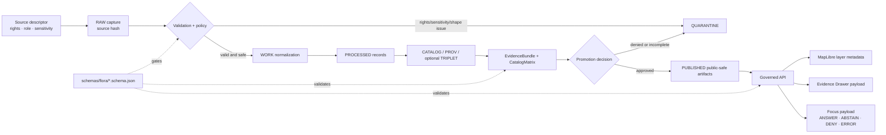

<!-- [KFM_META_BLOCK_V2]
doc_id: kfm://doc/TODO-UUID-VERIFY-ON-COMMIT
title: Flora Schemas
type: standard
version: v1
status: draft
owners: TODO-VERIFY-FLORA-STEWARD
created: TODO-VERIFY-ON-COMMIT
updated: TODO-VERIFY-ON-COMMIT
policy_label: TODO-VERIFY
related: []
tags: [kfm, flora, schemas, biodiversity, evidence, governance]
notes: [Target path requested: schemas/flora/README.md; schema-home authority remains NEEDS VERIFICATION until repo inspection and ADR evidence confirm it.]
[/KFM_META_BLOCK_V2] -->

<a id="top"></a>

# Flora Schemas

Schema entry point for KFM Flora contracts that keep taxon identity, occurrence support, source roles, sensitivity, evidence, runtime envelopes, and release artifacts inspectable before public use.

## Impact block


| Field | Value |
| --- | --- |
| **Status** | **experimental** |
| **Owners** | `TODO-VERIFY-FLORA-STEWARD` |
| **Target path** | `schemas/flora/README.md` |
| **Schema-home posture** | **NEEDS VERIFICATION** — current target path is requested, but repository schema authority must be confirmed before machine files proliferate. |
| **Quick jumps** | [Scope](#scope) · [Repo fit](#repo-fit) · [Inputs](#accepted-inputs) · [Exclusions](#exclusions) · [Directory tree](#directory-tree) · [Schema matrix](#schema-matrix) · [Source roles](#source-role-vocabulary) · [Lifecycle](#lifecycle-and-trust-flow) · [Validation](#validation-gates) · [Done](#definition-of-done) |

> [!IMPORTANT]
> `schemas/flora/` is a schema and contract surface. It is not a data store, source registry, policy engine, proof pack, release directory, UI component folder, or public truth source.

---

## Scope

**PROPOSED for this README:** `schemas/flora/` documents Flora lane schema objects that describe what valid Flora records, support objects, trust payloads, and release-adjacent contracts must look like.

This directory supports the Flora lane without collapsing distinct knowledge types into one “plant layer.” Flora observations, specimens, taxon names, steward-reviewed records, modeled range, habitat associations, generalized public surfaces, EvidenceBundles, and Focus responses remain separate object families.

### In scope

- Flora taxon identity and taxon-name crosswalk contracts.
- Flora occurrence and occurrence-batch contracts.
- Source descriptor and source-role profile contracts.
- Rights, sensitivity, redaction, and public-eligibility contract fields.
- Flora-specific profiles for shared governance objects when a shared schema is not already available.
- Evidence Drawer, Focus Mode, governed API response, and MapLibre layer descriptor payload schemas.
- Promotion, review, catalog closure, release manifest, and rollback-adjacent schema shapes.

### Out of scope

- Raw source data, extracted data, normalized data, public artifacts, credentials, exact sensitive coordinates, live connector code, validators, policy files, UI components, generated tiles, proof packs, release manifests, and runtime answers.

[Back to top](#top)

---

## Repo fit

**Current path:** `schemas/flora/README.md`

This README should sit inside the schema layer and point maintainers toward adjacent domain, policy, validator, fixture, and runtime surfaces. All paths below are **NEEDS VERIFICATION** until the real repository tree is mounted and inspected.

| Relationship | Path / link from `schemas/flora/` | Truth label | Role |
| --- | --- | --- | --- |
| Parent schema index | [`../README.md`](../README.md) | NEEDS VERIFICATION | Explains global schema conventions and validator linkage. |
| Flora domain docs | [`../../docs/domains/flora/README.md`](../../docs/domains/flora/README.md) | PROPOSED / NEEDS VERIFICATION | Human-readable lane architecture, current state, source registry guide, policy guide, and roadmap. |
| Schema-home ADR | [`../../docs/adr/ADR-flora-schema-home.md`](../../docs/adr/ADR-flora-schema-home.md) | PROPOSED / NEEDS VERIFICATION | Settles whether Flora schemas live here, under `schemas/contracts/v1/flora/`, or under `contracts/flora/`. |
| Source registry | `../../data/registry/flora/` | PROPOSED / NEEDS VERIFICATION | Source descriptors, source roles, sensitivity policies, taxon authorities, layer registry, and rights profiles. |
| Validators | `../../tools/validators/flora/` | PROPOSED / NEEDS VERIFICATION | Executable schema, rights, sensitivity, geometry, catalog, and runtime payload checks. |
| Policy | `../../policy/flora/` | PROPOSED / NEEDS VERIFICATION | Fail-closed publication, sensitivity, rights, and source-role rules. |
| Fixtures | `../../tests/fixtures/flora/` | PROPOSED / NEEDS VERIFICATION | Valid, invalid, promotion, policy, API, and UI payload examples. |
| Governed API | `../../apps/governed_api/` or repo-equivalent | UNKNOWN | Runtime API contracts and handlers consume validated schemas; exact path must be verified. |
| UI payload consumers | `../../ui/` or repo-equivalent | UNKNOWN | MapLibre layer descriptors, Evidence Drawer payloads, Focus fixtures, and review fixtures. |
| Release and proofs | `../../data/{catalog,receipts,proofs,published}/flora/` or repo-equivalent | PROPOSED / NEEDS VERIFICATION | Catalog/provenance closure, receipts, proof objects, and published public-safe artifacts. |

> [!WARNING]
> If the mounted repository proves a different canonical schema home, preserve this README’s semantics but move or redirect it through an ADR and migration note. Do not maintain parallel Flora schema definitions in multiple homes.

[Back to top](#top)

---

## Accepted inputs

| Input type | Belongs here? | Requirements |
| --- | --- | --- |
| JSON Schema files for Flora object families | Yes | Must be versioned, reviewable, and tied to valid/invalid fixtures outside this directory. |
| Flora-specific profiles of shared KFM governance objects | Yes, conditionally | Only add a Flora-specific schema if a shared `SourceDescriptor`, `EvidenceBundle`, `DecisionEnvelope`, `ReleaseManifest`, or equivalent object does not already satisfy the need. |
| Schema-local notes about required fields | Yes | Keep concise; move long rationale to domain docs or ADRs. |
| Enum definitions that are schema-owned | Yes | Source-role, sensitivity, rights, and outcome enums should be centralized if a shared vocabulary exists. |
| Minimal illustrative JSON snippets | Conditional | Use sparingly; full fixtures belong under `tests/fixtures/flora/`. |
| Changelog entries for schema edits | Conditional | Prefer the repo’s changelog convention; do not hide semantic schema changes in comments only. |

---

## Exclusions

| Excluded item | Why it does not belong here | Preferred home |
| --- | --- | --- |
| Raw source responses | Schemas describe shape; they do not store source material. | `data/raw/flora/` |
| Work, quarantine, or processed records | Lifecycle artifacts must remain separate from contracts. | `data/work/flora/`, `data/quarantine/flora/`, `data/processed/flora/` |
| Source credentials or controlled-access details | Public repo schemas must not expose access secrets or restricted source terms. | Secret manager / controlled ops docs |
| Exact sensitive flora locations | Exact public coordinates can create species and stewardship risk. | Controlled internal store; public-safe generalized surfaces only after review |
| Rego / policy-as-code files | Policy execution is downstream of schemas. | `policy/flora/` |
| Validator code | Validators use schemas but are not schemas. | `tools/validators/flora/` |
| Test fixtures | Fixtures must prove schemas and policy behavior without cluttering the schema directory. | `tests/fixtures/flora/` |
| API routes, services, and DTOs | Runtime implementation must consume governed contracts, not define them ad hoc. | `apps/governed_api/` or repo-equivalent |
| MapLibre style JSON and UI components | Renderer and UI state are downstream surfaces. | `ui/`, layer registry, or repo-equivalent |
| Published tiles, GeoJSON, manifests, and proof packs | Publication is a governed release state, not a schema file. | `data/published/flora/`, `data/proofs/flora/`, `release/` |

[Back to top](#top)

---

## Directory tree

**PROPOSED neighbor files only.** Confirm schema home, shared-object reuse, naming conventions, and validator expectations before adding these files.

```text
schemas/flora/
├── README.md
├── flora_source_descriptor.schema.json
├── flora_taxon.schema.json
├── flora_taxon_crosswalk.schema.json
├── flora_occurrence.schema.json
├── flora_occurrence_batch.schema.json
├── flora_run_receipt.schema.json
├── flora_redaction_receipt.schema.json
├── flora_evidence_bundle.schema.json
├── flora_decision_envelope.schema.json
├── flora_release_manifest.schema.json
├── flora_catalog_matrix.schema.json
├── flora_review_record.schema.json
├── flora_promotion_candidate.schema.json
├── flora_layer_descriptor.schema.json
├── flora_evidence_drawer_payload.schema.json
├── flora_focus_payload.schema.json
├── flora_api_response.schema.json
├── flora_plant_community.schema.json
├── flora_vegetation_class.schema.json
├── flora_range_map.schema.json
├── flora_habitat_association.schema.json
└── flora_phenology_condition_product.schema.json
```

> [!TIP]
> Prefer shared KFM governance schemas where they exist. Flora-specific schemas should constrain Flora semantics, not fork global release law.

---

## Schema matrix

### P0 schema wave

| Schema | Purpose | Must not do |
| --- | --- | --- |
| `flora_source_descriptor.schema.json` | Defines source identity, provider, role, cadence, rights, sensitivity, access posture, and authority boundary. | Must not activate a live connector by itself. |
| `flora_taxon.schema.json` | Defines accepted Flora taxon identity, rank, authority, naming fields, and status pointers. | Must not replace source authority or steward review. |
| `flora_taxon_crosswalk.schema.json` | Connects raw, accepted, synonym, historical, and common names with validity and authority context. | Must not silently merge taxa without traceable authority. |
| `flora_occurrence.schema.json` | Defines atomic observed Flora support with taxon, method, geometry, uncertainty, source, rights, sensitivity, and review state. | Must not represent range maps, habitat suitability, or modeled surfaces. |
| `flora_occurrence_batch.schema.json` | Describes grouped occurrence loads and fixture batches. | Must not substitute for run receipts or release manifests. |
| `flora_run_receipt.schema.json` | Captures process-memory for fetch, normalize, validate, or transform runs. | Must not be treated as a proof object. |
| `flora_redaction_receipt.schema.json` | Records generalization, withholding, or redaction transforms applied for public safety. | Must not hide that a transform occurred. |
| `flora_evidence_bundle.schema.json` | Resolves EvidenceRefs into support the UI/API can inspect. | Must not be replaced by generated language, map style, or model output. |
| `flora_decision_envelope.schema.json` | Captures finite runtime decisions: `ANSWER`, `ABSTAIN`, `DENY`, or `ERROR`. | Must not allow vague “helpful” output that masks denial or abstention. |
| `flora_release_manifest.schema.json` | Lists release artifacts, digests, catalog refs, policy decisions, and rollback targets. | Must not contain raw/work/quarantine data. |
| `flora_catalog_matrix.schema.json` | Checks catalog/provenance closure across STAC/DCAT/PROV, manifests, proofs, and runtime payloads. | Must not be treated as validation if refs do not close. |
| `flora_evidence_drawer_payload.schema.json` | Defines trust-visible payload fields for source, evidence, policy, review, freshness, redaction, and audit display. | Must not leak restricted exact details. |
| `flora_focus_payload.schema.json` | Defines bounded Focus Mode payloads with scope, evidence pool, citations, policy state, and finite outcome. | Must not become a chatbot transcript schema. |
| `flora_api_response.schema.json` | Defines governed API response envelope for Flora runtime surfaces. | Must not expose internal stores or unresolved evidence. |

<details>
<summary>P1 / P2 candidate schemas</summary>

| Schema | Purpose | Priority |
| --- | --- | --- |
| `flora_review_record.schema.json` | Steward or reviewer decision record for schema-adjacent review flows. | P1 |
| `flora_promotion_candidate.schema.json` | Candidate object submitted to promotion gate. | P1 |
| `flora_layer_descriptor.schema.json` | Map layer metadata carrying trust semantics outside style expressions. | P1 |
| `flora_plant_community.schema.json` | Plant community or assemblage contract. | P1 |
| `flora_vegetation_class.schema.json` | Vegetation class or land-cover-derived Flora context contract. | P1 |
| `flora_range_map.schema.json` | Range or distribution surface contract, separate from observed occurrence. | P1 |
| `flora_habitat_association.schema.json` | Derived association between Flora taxa/communities and habitat/covariate evidence. | P1 |
| `flora_phenology_condition_product.schema.json` | Seasonal, condition, index, or phenology-derived product contract. | P1/P2 |

</details>

[Back to top](#top)

---

## Schema rules

| Rule | Label | Practical effect |
| --- | --- | --- |
| Source role is first-class. | PROPOSED | Every descriptor and downstream object must carry source role or a resolvable source reference. |
| Unknown rights fail closed. | PROPOSED | Missing or unresolved terms block public promotion and can force `ABSTAIN` or `DENY`. |
| Sensitive exact geometry fails closed. | PROPOSED | Exact rare-plant or controlled-access locations cannot enter public artifacts without explicit review and transform receipts. |
| Occurrence is not range. | CONFIRMED doctrine / PROPOSED schema rule | Observed occurrence, specimen evidence, modeled range, habitat suitability, and generalized public surfaces remain distinct. |
| Shared objects outrank forks. | PROPOSED | Reuse shared KFM governance objects where present; Flora profiles add constraints only where needed. |
| Receipts are not proofs. | CONFIRMED doctrine / PROPOSED schema rule | `run_receipt` captures process memory; release proof requires catalog/proof/release closure. |
| UI payloads are downstream. | CONFIRMED doctrine / PROPOSED schema rule | Evidence Drawer and Focus schemas consume validated, released, policy-safe evidence; they do not become canonical truth. |
| Finite outcomes are mandatory. | CONFIRMED doctrine / PROPOSED schema rule | Runtime payloads must distinguish `ANSWER`, `ABSTAIN`, `DENY`, and `ERROR`. |

---

## Source-role vocabulary

**PROPOSED pending `ADR-flora-source-roles.md`.**

| Source role | Meaning | Default trust use | Publication default |
| --- | --- | --- | --- |
| `official` | Government or legally responsible source for status, regulation, or authoritative spatial layer. | Can anchor official status claims within authority boundary. | Publish only after rights, sensitivity, and review resolve. |
| `institutional` | Museum, herbarium, university, research institute, or agency-managed collection. | Strong evidence for specimen or collection facts. | Public-safe metadata; exact geometry depends on rights and sensitivity. |
| `steward_reviewed` | Curated by responsible Flora steward, heritage program, or qualified reviewer. | Can lift quarantine or allow controlled internal use. | Public only with explicit release decision. |
| `corroborative` | Useful support but not controlling authority for legal or status claims. | Can corroborate presence, name, or context. | Usually aggregate or generalize; cite limitations. |
| `community_observation` | Public or community record, such as an observation platform or project dataset. | Useful with quality labels, reviewer status, and license checks. | Publish only if license and sensitivity allow; avoid false precision. |
| `controlled_access` | Source requiring terms, license, steward approval, or access-controlled use. | May inform internal review. | Deny public exact publication unless authorization is explicit. |
| `derived_model` | Model, index, interpolation, suitability, range, or generalized summary. | Contextual or interpretive support. | Publish with model card, uncertainty, and evidence lineage. |
| `generalized_public_surface` | Public-safe geometry or layer derived from internal details. | Outward display after redaction/generalization. | Publishable when transform lineage, sensitivity, and rights resolve. |

[Back to top](#top)

---

## Lifecycle and trust flow

Schemas do not move data through the lifecycle. They define the shapes that validators, policy gates, catalog closure, and runtime envelopes can inspect.



---

## Quickstart

> [!CAUTION]
> These commands are **NEEDS VERIFICATION** because the package manager, validator runner, and schema home were not confirmed in the visible workspace.

```bash
# 1. Confirm the repo state before editing.
git status --short
git branch --show-current

# 2. Confirm this directory and parent schema convention.
find schemas -maxdepth 3 -type f | sort | sed -n '1,120p'

# 3. Check whether shared governance objects already exist.
find schemas contracts -type f \
  \( -iname '*source*descriptor*' -o -iname '*evidence*bundle*' -o -iname '*decision*envelope*' -o -iname '*release*manifest*' \) \
  2>/dev/null | sort

# 4. Replace this placeholder with the repo-native validator command.
# Example only; do not treat as confirmed:
python tools/validators/flora/validate.py \
  --schema-dir schemas/flora \
  --fixtures tests/fixtures/flora
```

No destructive command belongs in the quickstart.

---

## Usage

### Adding a Flora schema

1. Confirm the schema home through the repo’s current convention or `ADR-flora-schema-home.md`.
2. Check whether the object belongs to a shared KFM governance schema instead of a Flora-specific schema.
3. Add the schema with a stable `$id`, explicit `schema_version`, required lifecycle/evidence fields, and bounded enums.
4. Add one valid fixture and at least one invalid fixture under `tests/fixtures/flora/`.
5. Add or update validator coverage under `tools/validators/flora/`.
6. Add or update policy coverage where rights, sensitivity, review, or public release state is affected.
7. Update this README, Flora domain docs, and changelog entries in the same PR.

### Reviewing a schema PR

Reviewers should check:

- The schema does not create a hidden public path from RAW, WORK, or QUARANTINE data.
- Rights, sensitivity, source role, evidence refs, and review state are explicit where relevant.
- Exact sensitive geometry cannot validate as a public artifact without a redaction/generalization receipt.
- Runtime schemas use finite outcomes and do not allow unbounded generated text.
- New object families do not duplicate existing shared governance objects.
- Valid and invalid fixtures prove the important gates, not just happy-path shape.

[Back to top](#top)

---

## Validation gates

| Gate | Blocks | Minimum proof |
| --- | --- | --- |
| Schema validation | Invalid or incomplete Flora objects | Valid and invalid JSON fixtures. |
| Source-role validation | Unknown or incompatible source roles | Descriptor fixture with accepted role and negative fixture with unknown role. |
| Rights validation | Unknown, incompatible, or unreviewed publication rights | Deny fixture for unknown rights; allow fixture only with explicit public eligibility. |
| Sensitivity validation | Exact sensitive public geometry or unknown sensitivity | Deny fixture for exact sensitive public geometry; public generalized fixture with redaction receipt. |
| Taxonomy validation | Unresolved accepted taxon or unsupported name merge | Taxon and crosswalk fixtures with authority pointers. |
| Evidence closure | Dangling EvidenceRefs or missing bundle support | EvidenceBundle fixture with closed refs and checksums. |
| Catalog closure | Missing STAC/DCAT/PROV/release cross-links where required | CatalogMatrix fixture with resolvable artifact refs. |
| Runtime envelope validation | Ambiguous or unbounded answer states | `ANSWER`, `ABSTAIN`, `DENY`, and `ERROR` fixtures. |
| No raw public path | Public payload points to RAW, WORK, QUARANTINE, or canonical/internal stores | Negative fixture rejected by validator/policy. |
| No direct model-client path | Focus or AI payload bypasses governed evidence and policy checks | Policy fixture returns `DENY` or `ABSTAIN`. |

---

## Public-safety posture

> [!IMPORTANT]
> Flora public output is public-safe only when source rights, sensitivity, precision, review state, evidence support, and release state are all explicit. Unknowns do not become public by optimistic default.

The public-facing schema posture is:

- `public_ok`: public release may proceed if validation, evidence, catalog, and review gates also pass.
- `public_generalized_only`: exact geometry is not public; generalized or redacted geometry requires a redaction receipt.
- `controlled_only`: internal or steward-controlled use only.
- `deny`: public release is blocked.
- `unknown`: public release is blocked until resolved.

---

## Definition of done

A Flora schema PR is not done until these are true or explicitly waived in review:

- [ ] Repo schema home is confirmed, or an ADR records the chosen home and migration behavior.
- [ ] Owner/steward field is resolved beyond `TODO-VERIFY-FLORA-STEWARD`.
- [ ] Every added schema has at least one valid fixture and one meaningful invalid fixture.
- [ ] Source role, rights, sensitivity, review, and public eligibility fields are validated where relevant.
- [ ] Exact sensitive Flora geometry cannot validate as a public artifact without a public-safe transform.
- [ ] EvidenceBundle / EvidenceRef closure is tested for runtime or publication-facing schemas.
- [ ] `ANSWER`, `ABSTAIN`, `DENY`, and `ERROR` cases are represented for runtime payloads.
- [ ] Shared governance schemas are reused or referenced when available.
- [ ] Policy tests fail closed for unknown rights, unknown sensitivity, and missing review state.
- [ ] This README and related domain docs are updated together.
- [ ] Rollback or supersession behavior is documented for changed schema semantics.

[Back to top](#top)

---

## FAQ

### Is `schemas/flora/` the canonical schema home?

**UNKNOWN.** The current task targets `schemas/flora/README.md`, but the broader KFM materials preserve a schema-home conflict between `contracts/`, `schemas/contracts/v1/`, and domain-specific schema homes. Resolve this through repo inspection and ADR before adding many machine files.

### Can a Flora occurrence schema publish a plant location?

No. A schema only defines a valid shape. Public release requires rights resolution, sensitivity handling, review state, EvidenceBundle closure, catalog/proof/release posture, and governed promotion.

### Can a modeled range or habitat suitability surface count as occurrence evidence?

No. Occurrence, range, habitat association, vegetation class, and derived model products are separate object families. Derived models may support context, but they must not masquerade as observed occurrence truth.

### Should Flora create its own `EvidenceBundle` and `DecisionEnvelope` schemas?

Only if shared KFM governance schemas are unavailable or insufficient. Prefer `$ref` or profile constraints over parallel release law.

### Can Focus Mode answer Flora questions from these schemas alone?

No. Focus Mode needs released, admissible evidence resolved through EvidenceRef → EvidenceBundle, policy/sensitivity checks, citation validation, and finite runtime envelopes. Schemas are necessary, not sufficient.

---

## Appendix

<details>
<summary>Truth labels used in this README</summary>

| Label | Meaning |
| --- | --- |
| **CONFIRMED** | Verified from current-session evidence or controlling doctrine. |
| **PROPOSED** | Recommended design or file shape not verified as present implementation. |
| **UNKNOWN** | Not verifiable from the visible workspace or attached corpus. |
| **NEEDS VERIFICATION** | Specific check must occur before implementation, activation, or release. |
| **CONFLICTED** | Multiple plausible homes or conventions exist; resolve by repo evidence and ADR. |

</details>

<details>
<summary>Minimum schema field posture</summary>

For public-facing or promotion-adjacent Flora schemas, require or resolve these field families:

```json
{
  "identity": {
    "id": "stable object id",
    "schema_version": "versioned schema",
    "spec_hash": "deterministic semantic hash where applicable"
  },
  "source": {
    "source_id": "registered source id",
    "source_role": "official | institutional | steward_reviewed | corroborative | community_observation | controlled_access | derived_model | generalized_public_surface",
    "authority_boundary": "what this source may and may not support"
  },
  "evidence": {
    "evidence_refs": [],
    "evidence_bundle_refs": [],
    "citation_refs": []
  },
  "rights_sensitivity": {
    "rights_status": "resolved | unknown | restricted",
    "public_publication_eligibility": "public_ok | public_generalized_only | controlled_only | deny | unknown",
    "sensitivity_posture": "public | internal | restricted | controlled | review_required",
    "redaction_receipt_ref": "required when generalized or withheld"
  },
  "time": {
    "observed_at": "when applicable",
    "valid_time": "when applicable",
    "retrieved_at": "when applicable",
    "as_of": "when applicable"
  },
  "review_release": {
    "review_state": "unreviewed | reviewed | steward_reviewed | release_approved | denied",
    "promotion_state": "candidate | approved | denied | withdrawn",
    "rollback_ref": "when release-facing"
  }
}
```

</details>

<details>
<summary>Neighboring docs to create or verify</summary>

- `docs/domains/flora/README.md`
- `docs/domains/flora/ARCHITECTURE.md`
- `docs/domains/flora/CURRENT_STATE.md`
- `docs/domains/flora/SOURCE_REGISTRY.md`
- `docs/domains/flora/DATA_MODEL.md`
- `docs/domains/flora/PUBLICATION_AND_POLICY.md`
- `docs/domains/flora/UI_AND_EVIDENCE_DRAWER.md`
- `docs/domains/flora/VERIFICATION_BACKLOG.md`
- `docs/adr/ADR-flora-schema-home.md`
- `docs/adr/ADR-flora-source-roles.md`
- `docs/adr/ADR-flora-sensitive-location-policy.md`
- `docs/runbooks/flora-ingest.md`
- `docs/runbooks/flora-promotion.md`
- `docs/runbooks/flora-rollback.md`

</details>

[Back to top](#top)
