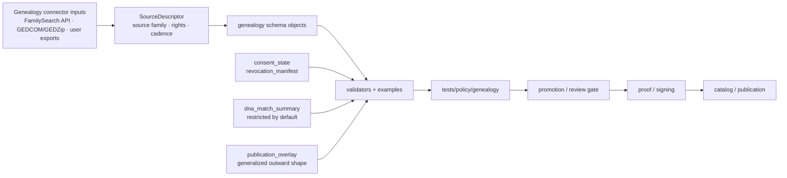

<!-- [KFM_META_BLOCK_V2]
doc_id: kfm://doc/schemas/genealogy/readme
title: schemas/genealogy
type: standard
version: v1
status: draft
owners: @bartytime4life
created: 2026-04-15
updated: 2026-04-15
policy_label: restricted
related: [
  ../README.md,
  ../soil_moisture/README.md,
  ../../docs/connectors/genealogy/README.md,
  ../../tests/policy/genealogy/README.md,
  ../../policy/README.md,
  ../../contracts/README.md,
  ../../schemas/README.md,
  ../../.github/workflows/README.md
]
tags: [kfm, schemas, genealogy, consent, revocation, dna, publication-safety]
notes: [
  Current public-facing evidence proves this path exists.
  This README is a truthful schema-lane fill-in and does not imply mounted genealogy subtrees beyond what the branch visibly shows.
]
[/KFM_META_BLOCK_V2] -->

<a id="top"></a>

# `schemas/genealogy/`

Schema-side landing page for genealogy object shapes, disclosure-aware field semantics, and publication-safety boundaries in KFM.

> [!NOTE]
> **Status:** `draft`  
> **Owners:** `@bartytime4life`  
> **Path:** `schemas/genealogy/README.md`  
> **Posture:** schema-centered · restricted-sensitivity · disclosure-aware · truthful about mounted scope  
> 
> 
> 
> 
> 
> 
>
> **Quick jumps:** [Scope](#scope) · [Evidence posture](#evidence-posture) · [Repo fit](#repo-fit) · [Accepted inputs](#accepted-inputs) · [Exclusions](#exclusions) · [Directory tree](#directory-tree) · [Quickstart](#quickstart) · [Usage](#usage) · [Diagram](#diagram) · [Object family matrix](#object-family-matrix) · [Task list](#task-list--definition-of-done) · [FAQ](#faq) · [Appendix](#appendix)

> [!IMPORTANT]
> This leaf clarifies **machine shape, field semantics, and schema growth discipline** for genealogy. It is **not** the authority for connector implementation, policy law, runtime proof, release proof, or workflow enforcement.

> [!WARNING]
> Do not let this README silently create repo truth for unproven sibling trees such as `policy/genealogy/` or `contracts/genealogy/`. This document should stay honest about what the branch visibly contains.

> [!TIP]
> In KFM, a schema lane should make sensitive distinctions machine-visible without pretending that shape alone authorizes publication.

---

## Scope

`schemas/genealogy/` is the schema-side landing page for genealogy-specific object families that may support governed intake, validation, restriction, and outward-safe publication.

This leaf exists to make it easier to answer questions such as:

- Which genealogy objects need explicit machine shape before they can be validated or reviewed?
- Which genealogy fields are inherently **restricted**, **generalized**, or **public-safe**?
- Where should **consent**, **revocation**, **living-person status**, and **DNA sensitivity** become machine-visible instead of prose-only?
- How should genealogy shapes stay connected to connector intake, policy burden, and runtime proof without collapsing those concerns into one file?

### Truth labels used here

| Label | Meaning in this README |
|---|---|
| **CONFIRMED** | directly visible on the current repo-facing surface or strongly anchored by nearby authoritative docs |
| **INFERRED** | strongly suggested by neighboring docs and repeated KFM doctrine, but not re-proven here as mounted implementation |
| **PROPOSED** | commit-ready target shape consistent with KFM doctrine, not asserted as current branch fact |
| **UNKNOWN** | not supported strongly enough here to present as current fact |
| **NEEDS VERIFICATION** | specific path, owner, workflow, or enforcement detail that should be checked against the active checkout before merge |

### Working rule

Keep this lane **schema-centered, disclosure-aware, and boringly truthful**.

If a change mostly defines:

- **connector or import behavior**, put it under [`../../docs/connectors/genealogy/README.md`](../../docs/connectors/genealogy/README.md)
- **policy law or allow/deny semantics**, put it under [`../../policy/README.md`](../../policy/README.md) and the relevant policy-proof lane
- **repo-facing runtime or negative-path proof**, put it under [`../../tests/policy/genealogy/README.md`](../../tests/policy/genealogy/README.md) or runtime-proof lanes
- **machine shape and field semantics** for genealogy objects, it belongs here

[Back to top](#top)

---

## Evidence posture

| Surface or claim | Status | Why it matters |
|---|---|---|
| `schemas/genealogy/` is a real repo path | **CONFIRMED** | this is a real lane, not a hypothetical subtree |
| This README should behave like a child of `schemas/` | **CONFIRMED** | prevents lane drift into policy, runtime, or release ownership |
| Genealogy needs explicit disclosure-aware field semantics | **INFERRED / STRONGLY DOCTRINAL** | living-person, DNA, place precision, and consent are too important to hide in generic person/event shapes |
| Connector guidance for genealogy already exists | **CONFIRMED** | this leaf should complement, not duplicate, intake doctrine |
| Genealogy policy-behavior proof already exists | **CONFIRMED** | schema semantics should stay aligned with consent, DNA, provenance, and publication-control burdens |
| Mounted genealogy schema files beyond `README.md` | **NEEDS VERIFICATION** | do not claim `.schema.json` siblings unless the branch visibly contains them |
| Genealogy-specific workflow or CI enforcement | **NEEDS VERIFICATION** | do not imply runner depth or gating without proof |

[Back to top](#top)

---

## Repo fit

**Path:** `schemas/genealogy/README.md`  
**Role in repo:** schema-lane index for genealogy-specific object families, shape boundaries, and disclosure-aware field semantics.

### Path and neighboring surfaces

| Direction | Surface | Why it matters |
|---|---|---|
| Upstream | [`../README.md`](../README.md) | parent schema-lane doctrine and boundary |
| Sibling pattern | [`../soil_moisture/README.md`](../soil_moisture/README.md) | useful neighboring schema-leaf pattern for structure and tone |
| Domain intake | [`../../docs/connectors/genealogy/README.md`](../../docs/connectors/genealogy/README.md) | intake/source-family guidance already lives there |
| Domain proof | [`../../tests/policy/genealogy/README.md`](../../tests/policy/genealogy/README.md) | policy-behavior proof for genealogy stays there |
| Root policy authority | [`../../policy/README.md`](../../policy/README.md) | deny-by-default and obligations belong there, not here |
| Root contract authority | [`../../contracts/README.md`](../../contracts/README.md) | trust-bearing envelopes and contract ownership stay there |
| Workflow lane | [`../../.github/workflows/README.md`](../../.github/workflows/README.md) | workflow intent should be proven there or in actual YAML |

### Current evidence posture by neighbor

| Surface | Current reading | Why it matters |
|---|---|---|
| [`../README.md`](../README.md) | real parent schema boundary | this leaf should read like a child of `schemas/` |
| [`../soil_moisture/README.md`](../soil_moisture/README.md) | strong neighboring schema-leaf pattern | useful baseline for lane fit and truthful subtree claims |
| [`../../docs/connectors/genealogy/README.md`](../../docs/connectors/genealogy/README.md) | genealogy intake guidance already exists | avoid duplicating source-admission behavior here |
| [`../../tests/policy/genealogy/README.md`](../../tests/policy/genealogy/README.md) | genealogy-specific proof lane already exists | shape and semantics should stay aligned with tested burden |
| `../../policy/genealogy/` | **not proven here** | do not imply it as current fact |
| `../../contracts/genealogy/` | **not proven here** | do not imply it as current fact |
| [`../../.github/workflows/README.md`](../../.github/workflows/README.md) | workflow-doc boundary exists | workflow naming and gates still need explicit proof before being claimed here |

> [!NOTE]
> This README should behave like a **schema leaf with domain pressure**, not a replacement for connector docs, policy docs, contract docs, or proof lanes.

[Back to top](#top)

---

## Accepted inputs

| Input class | Examples | Why it belongs here |
|---|---|---|
| Genealogy object-family proposals | publication overlay, consent state, revocation manifest, DNA match summary, event record | these are candidate schema families |
| Tiny illustrative payloads | minimal JSON examples for passing and failing shapes | keeps the leaf reviewable without exposing sensitive material |
| Field-level semantic notes | `living_status`, `visibility_class`, `kit_hash`, `place_bucket`, `evidence_refs` | genealogy needs explicit disclosure semantics |
| Compatibility notes | `schema_ver`, `spec_hash`, `derived_from`, stable IDs, hash rules | helps validators and downstream docs avoid silent drift |
| Source-family distinctions | FamilySearch API, GEDCOM/GEDZip, raw genotype export, DNA match export | these inputs are not interchangeable and should stay machine-distinct |
| Generalization rules | exact place vs. bucketed place, exact date vs. time bucket | outward-safe genealogy depends on disclosure-aware shape design |
| Validation-shape notes | structural validator result, semantic validator result, non-silent failure state | belongs here only if it stays shape-centered |

### Input rules

1. Prefer **small, public-safe examples** over copied family payloads.
2. Keep **source family explicit**; do not flatten FamilySearch, GEDCOM, and DNA-derived material into one implied truth class.
3. Keep **living-person and DNA-sensitive semantics visible** at the field level.
4. Keep **public-safe derivatives** separate from richer intake objects.
5. Keep **generalization fields explicit** instead of hiding them in prose.
6. Label illustrative examples as **illustrative**.
7. Keep **schema shape** separate from policy decision, receipt, proof, and catalog object responsibilities.

[Back to top](#top)

---

## Exclusions

| Does **not** belong here | Put it here instead | Why |
|---|---|---|
| Connector logic, polling, auth flow, vendor quirks | [`../../docs/connectors/genealogy/README.md`](../../docs/connectors/genealogy/README.md) and implementation lanes | this README is not an implementation guide |
| Policy law, allow/deny behavior, consent enforcement rules | [`../../policy/README.md`](../../policy/README.md) and [`../../tests/policy/genealogy/README.md`](../../tests/policy/genealogy/README.md) | shape is not governed decision logic |
| Raw GEDCOM / GEDZip archives | governed intake or fixture lanes | this path is for shape definitions, not archives |
| Raw genotype files, cleartext kit IDs, full segment coordinates, direct match exports | restricted intake lanes only | these are not public-safe schema examples |
| Release manifests, run receipts, signatures, attestation bundles, catalog closure objects | release / runtime / proof lanes | schema meaning must not collapse receipt, proof, and publication into one file |
| Living-person disclosure decisions | policy and review surfaces | this leaf may model status fields, but it should not self-authorize publication |
| Exact household coordinates or overly precise recent-era place data | nowhere public-safe in this leaf | schema examples should not normalize unsafe disclosure |
| Narrative family-history prose or user-facing historical interpretation | docs / story / dossier lanes | this is a technical lane index |

> [!WARNING]
> A well-written genealogy schema README is still **not evidence** that live publication, CI wiring, or release signing already exist for genealogy on the active branch.

[Back to top](#top)

---

## Directory tree

### Current safe claim

```text
schemas/
└── genealogy/
    └── README.md
```

That is the only subtree claim this README can make safely without inventing checked-in schema files that the current visible surface does not prove.

### Preferred growth shape (`PROPOSED` / `NEEDS VERIFICATION`)

```text
schemas/
└── genealogy/
    ├── README.md
    ├── publication_overlay.schema.json
    ├── consent_state.schema.json
    ├── revocation_manifest.schema.json
    ├── dna_match_summary.schema.json
    ├── person_stub.schema.json
    ├── event_record.schema.json
    └── validator_result.schema.json
```

### Why this proposed shape is narrow enough

| Proposed file | Why it is a sensible first wave |
|---|---|
| `publication_overlay.schema.json` | outward-safe generalized representation is the highest-pressure genealogy surface |
| `consent_state.schema.json` | consent chronology is too important to leave as free text |
| `revocation_manifest.schema.json` | reversal and withdrawal need explicit machine shape before broader automation |
| `dna_match_summary.schema.json` | restricted summary shape is safer than pretending raw DNA is a public object |
| `person_stub.schema.json` | useful only as a non-authoritative shell, not sovereign family truth |
| `event_record.schema.json` | lets date/place/source pressure become explicit |
| `validator_result.schema.json` | useful after structural and semantic validation patterns stabilize |

> [!TIP]
> Start smaller than the tree above if needed. One truthful schema plus one passing and one failing example is better than a decorative empty family.

[Back to top](#top)

---

## Quickstart

Use inspection-first commands so this leaf stays honest as the branch evolves.

### 1) Confirm what is actually mounted

```bash
find schemas -maxdepth 3 -print 2>/dev/null | sort
find schemas/genealogy -maxdepth 3 -print 2>/dev/null | sort
```

### 2) Re-read adjacent authority surfaces

```bash
sed -n '1,220p' schemas/README.md 2>/dev/null || true
sed -n '1,260p' schemas/soil_moisture/README.md 2>/dev/null || true
sed -n '1,260p' docs/connectors/genealogy/README.md 2>/dev/null || true
sed -n '1,260p' tests/policy/genealogy/README.md 2>/dev/null || true
sed -n '1,220p' contracts/README.md 2>/dev/null || true
sed -n '1,220p' policy/README.md 2>/dev/null || true
```

### 3) Search for already-used genealogy vocabulary before minting new fields

```bash
grep -RIn "genealogy\|GEDCOM\|GEDZip\|FamilySearch\|consent\|revocation\|living\|DNA\|kit_hash\|match_hash\|evidence_refs" . 2>/dev/null
```

### 4) Add the smallest useful schema first

```bash
touch schemas/genealogy/publication_overlay.schema.json
touch schemas/genealogy/examples.pass.json
touch schemas/genealogy/examples.fail.json
```

### 5) Document only consumers the branch can actually show

```bash
git grep -n "schemas/genealogy" -- . ':(exclude).git'
```

[Back to top](#top)

---

## Usage

### Why this lane should exist at all

Genealogy is one of the easiest KFM domains to over-flatten.

A generic `person` or `event` schema is not enough, because this lane has to preserve at least six distinctions:

1. **source family** — FamilySearch API, GEDCOM/GEDZip export, and DNA-export-derived data are not the same
2. **living-person risk** — recent or living individuals cannot be treated like ordinary historic entities
3. **place precision** — exact coordinates and exact family locations are not automatically outward-safe
4. **DNA sensitivity** — a match summary is not the same thing as raw genotype or segment detail
5. **consent / revocation posture** — publishability can change after ingest
6. **public-safe derivative vs. intake object** — a generalized overlay is not sovereign family truth

### Working rules

1. Keep **FamilySearch API**, **GEDCOM/GEDZip**, **raw genotype export**, and **DNA match export** as distinct source families.
2. Default **raw DNA**, **cleartext vendor IDs**, and **segment-level details** to restricted-only handling.
3. Keep `living_status` explicit; do not let `unknown` quietly behave like `safe`.
4. Keep `visibility_class` explicit; `public_safe`, `restricted`, and `internal` should not blur together.
5. Use generalized `place_bucket` style fields for outward-safe shapes; avoid normalizing exact coordinates into examples.
6. Separate `event_time`, `time_bucket`, `ingested_at`, and `released_at`; they do different jobs.
7. Keep `evidence_refs` visible on any object that expresses a consequential relationship or overlay claim.
8. Prefer `kit_hash` / `match_hash` style fields over cleartext vendor identifiers.
9. Keep `schema_ver` and `spec_hash` available where deterministic identity or comparison matters.
10. Preserve **schema ≠ validator result ≠ policy decision ≠ receipt ≠ proof ≠ catalog object**.

### Illustrative minimal payload (`PROPOSED`)

The example below is illustrative only. It is here to make the lane concrete without pretending the final shape is already mounted.

```json
{
  "overlay_id": "sha256:example-overlay",
  "source_family": "familysearch",
  "source_role": "user_authorized_tree_or_place_data",
  "visibility_class": "public_safe",
  "living_status": "deceased_or_not_recent",
  "event_type": "birth",
  "time_bucket": "1889-03",
  "place_bucket": {
    "geohash": "9yq",
    "precision": 3
  },
  "relationship_hint": "shared_ancestor",
  "evidence_refs": [
    "kfm://evidence/example-001"
  ],
  "schema_ver": 1
}
```

### Shape boundary that should stay explicit

| Surface | What it should mean here | What it should **not** become |
|---|---|---|
| Schema object | field names, allowed values, disclosure-aware semantics | silent publication authorization |
| Validator result | structural or semantic shape outcome | the only policy decision record |
| Policy decision | allow / deny / review-bearing outcome | a substitute for shape definitions |
| Run receipt | process memory about what happened | sovereign proof of safe publication |
| Proof / attestation | signed evidence about release-bearing artifacts | a substitute for schema clarity |
| Catalog object | outward discoverability and linkage | an excuse to skip consent / revocation semantics |

[Back to top](#top)

---

## Diagram



> [!NOTE]
> This flow does **not** claim every stage is already mounted for genealogy. It shows which downstream seams a good schema family should eventually support.

[Back to top](#top)

---

## Object family matrix

| Proposed family | Primary responsibility | Public-safety posture | Current status |
|---|---|---|---|
| `publication_overlay.schema.json` | outward-safe generalized overlay for maps, drawers, and evidence-linked public surfaces | must be public-safe by design | **PROPOSED** |
| `consent_state.schema.json` | machine-visible consent issuance, scope, expiration, and review posture | usually restricted / internal | **PROPOSED** |
| `revocation_manifest.schema.json` | machine-visible withdrawal or invalidation register for prior overlays or references | restricted / internal | **PROPOSED** |
| `dna_match_summary.schema.json` | restricted summary of relationship-bearing DNA match facts without raw genotype payload | restricted by default | **PROPOSED** |
| `person_stub.schema.json` | non-authoritative shell for cross-linking person-like references | public-safe only when heavily narrowed | **PROPOSED** |
| `event_record.schema.json` | time/place/source-linked event shape with explicit generalization support | mixed; depends on event and disclosure class | **PROPOSED** |
| `validator_result.schema.json` | stable output shape for schema/semantic checks | internal or review-facing | **PROPOSED** |

### Semantics that must stay machine-visible

| Field or concept | Why it matters |
|---|---|
| `source_family` | prevents FamilySearch, GEDCOM, and DNA inputs from being flattened into one implied truth class |
| `source_role` | keeps admission meaning visible rather than decorative |
| `living_status` | prevents silent public exposure of living or unknown-living persons |
| `visibility_class` | keeps outward-safe vs. restricted handling explicit |
| `consent_state` | prevents publishability from being inferred loosely |
| `kit_hash` / `match_hash` | supports deterministic linkage without cleartext vendor IDs |
| `time_bucket` | lets outward-safe chronology differ from exact ingest values |
| `place_bucket` | prevents exact place disclosure from sneaking into “safe” shapes |
| `evidence_refs` | keeps consequential claims tied to inspectable support |
| `schema_ver` | reduces silent drift |
| `spec_hash` | helps deterministic comparison and review where applicable |
| `derived_from` | preserves relationship to upstream, non-public-safe objects |

### Source-family distinctions to preserve

| Source family | Typical shape pressure | Handling cue |
|---|---|---|
| FamilySearch API | structured person / relationship / place payloads | keep API-derived object family separate from export-derived family |
| GEDCOM / GEDZip | user-supplied tree export with uneven semantics | treat as user-export lane, not sovereign truth |
| Raw genotype export | dense, highly sensitive molecular payload | do not normalize as a public-safe schema target |
| DNA match / segment export | relationship-bearing metrics and segments | prefer summary shape plus hashes; restrict by default |
| Publication overlay | generalized outward-safe derivative | must stay visibly distinct from raw intake or family-tree truth |

[Back to top](#top)

---

## Task list / Definition of done

Use this checklist before treating this README as settled for a branch:

- [ ] Current mounted subtree was rechecked before claiming any file beyond `README.md`.
- [ ] Title, one-line purpose, repo fit, accepted inputs, and exclusions are explicit.
- [ ] Current public-tree truth and target-state growth shape are clearly separated.
- [ ] Relative links resolve from `schemas/genealogy/README.md`.
- [ ] No `policy/genealogy/` or `contracts/genealogy/` subtree is implied as current fact without branch proof.
- [ ] Raw DNA, cleartext kit IDs, exact coordinates, and living-person public export are excluded explicitly.
- [ ] Schema vs. validator vs. policy vs. receipt vs. proof vs. catalog boundaries remain visible.
- [ ] At least one meaningful diagram remains current.
- [ ] At least one narrow schema family is identified as the first practical landing step.
- [ ] Any future example payloads remain public-safe and clearly marked illustrative.
- [ ] This README is revisited when adjacent connector or genealogy policy-test docs change materially.

### Sensible first thin slice

If this lane moves from README-only to executable schema work, the safest narrow first step is:

1. `publication_overlay.schema.json`
2. one passing example
3. one failing example
4. one short validator note
5. cross-links back to genealogy connector and genealogy policy-test docs

> [!CAUTION]
> In this lane, **truthful narrowness beats decorative completeness**.

[Back to top](#top)

---

## FAQ

### Why not just reuse one generic person/event schema?

Because genealogy carries extra burdens that generic historical or civic entity schemas often hide: living-person risk, consent chronology, revocation, DNA sensitivity, and exact-location disclosure.

### Does this README prove live genealogy schemas already exist?

No. It documents the lane honestly and proposes a disciplined growth shape. The current safe subtree claim remains `README.md` only unless the active branch proves more.

### Why link to `tests/policy/genealogy/` from a schema README?

Because genealogy shape and genealogy policy behavior are tightly coupled. This leaf should not own policy law, but it should stay visibly aligned with the lane that proves consent, living-person, DNA, provenance, and publication-control behavior.

### Why not point to `policy/genealogy/` or `contracts/genealogy/`?

Because that subtree is not proven here as current repo fact. This README should not create branch truth by implication.

### Is raw DNA a valid public-safe schema target here?

No. A safer first move is a restricted summary shape such as `dna_match_summary`, not raw genotype or full segment payloads.

### Does a schema here authorize publication?

No. Publication still depends on policy, review, release state, and proof-bearing downstream surfaces.

[Back to top](#top)

---

## Appendix

<details>
<summary><strong>Appendix A — conservative starter field register</strong></summary>

| Field | Suggested meaning | Status |
|---|---|---|
| `overlay_id` | deterministic identifier for a generalized overlay object | **PROPOSED** |
| `source_family` | FamilySearch / GEDCOM / DNA-export family split | **INFERRED / PROPOSED** |
| `source_role` | source admission meaning made machine-visible | **INFERRED / PROPOSED** |
| `visibility_class` | `public_safe`, `restricted`, `internal`, or equivalent | **PROPOSED** |
| `living_status` | `living`, `deceased`, `unknown`, or equivalent | **PROPOSED** |
| `consent_state` | publishability posture, when applicable | **PROPOSED** |
| `time_bucket` | generalized outward-safe time granularity | **PROPOSED** |
| `place_bucket` | generalized outward-safe place granularity | **PROPOSED** |
| `evidence_refs` | references to inspectable support objects | **INFERRED / PROPOSED** |
| `kit_hash` / `match_hash` | deterministic restricted identifiers for DNA-derived references | **PROPOSED** |
| `schema_ver` | stable version field for the shape itself | **PROPOSED** |
| `spec_hash` | deterministic comparison / review hash where appropriate | **PROPOSED** |

</details>

<details>
<summary><strong>Appendix B — open verification items</strong></summary>

Before treating this README as fully settled local-checkout documentation, verify:

1. whether `/schemas/` has a narrower `CODEOWNERS` rule than the current fallback;
2. whether any actual `schemas/genealogy/*.schema.json` files already exist off the public snapshot used here;
3. whether validator utilities for schema leaves live under `tools/`, `schemas/tests/`, or another visible convention on the active branch;
4. whether genealogy-specific fixtures are meant to live beside this lane or under a shared schema-fixture subtree;
5. whether any branch-local workflow YAML already checks schema leaves touching genealogy;
6. whether the eventual canonical home for genealogy machine contracts should remain under `schemas/` or move toward a stronger contract-side authority surface.

</details>

[Back to top](#top)
