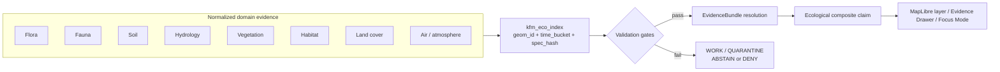

<!-- [KFM_META_BLOCK_V2]
doc_id: kfm://doc/<NEEDS_VERIFICATION_UUID>
title: Ecology Cross-Domain Join Index
type: standard
version: v1
status: draft
owners: @bartytime4life
created: <NEEDS_VERIFICATION_CREATED_DATE>
updated: 2026-04-24
policy_label: <NEEDS_VERIFICATION_POLICY_LABEL>
related: [
  data/registry/ecology/README.md,
  data/catalog/ecology/README.md,
  schemas/contracts/v1/ecology/ecological_composite_claim.schema.json,
  data/processed/README.md,
  data/work/README.md,
  data/receipts/README.md,
  data/proofs/README.md
]
tags: [kfm, ecology, join-index, cross-domain, hydrology, soil, vegetation, fauna, flora]
notes: [
  "Logical-first cross-domain ecological join index specification.",
  "Physical storage, schema home, validators, and runtime integration remain NEEDS VERIFICATION until a mounted repo is inspected.",
  "Target path inferred from the supplied draft: schemas/kfm_eco_index.md."
]
[/KFM_META_BLOCK_V2] -->

<a id="top"></a>

# Ecology Cross-Domain Join Index (`kfm_eco_index`)

Proposed governed join surface for resolving ecological evidence across domains in the Kansas Frontier Matrix.

> [!IMPORTANT]
> **Truth posture:** `PROPOSED` logical contract. This document does **not** confirm that `kfm_eco_index` is already implemented, materialized, validated, published, or wired to runtime APIs.


| Field | Value |
|---|---|
| **Status** | `draft` / `experimental` |
| **Owners** | `@bartytime4life` from supplied draft; stewardship roster `NEEDS VERIFICATION` |
| **Primary path** | `schemas/kfm_eco_index.md` — **PROPOSED** from the supplied draft |
| **Alternate path** | `data/processed/ecology/index/README.md` — only if the repo confirms this is a directory README |
| **Core role** | Normalize ecological joins before claim, catalog, map, Focus Mode, or export surfaces consume them |
| **Quick jumps** | [Purpose](#purpose) · [Repo fit](#repo-fit) · [Inputs](#inputs) · [Exclusions](#exclusions) · [Design](#design) · [Keys](#keys) · [Join patterns](#join-patterns) · [Constraints](#constraints) · [Examples](#examples) · [Validation](#validation) · [Open questions](#open-questions) |

---

<a id="purpose"></a>

## Purpose

The `kfm_eco_index` gives KFM a stable, inspectable place to join ecological evidence across domains **without letting raw geometry, renderer state, model output, or convenience joins become truth**.

It is designed to combine evidence from:

| Domain family | Example evidence carried into the join |
|---|---|
| Vegetation | NDVI / vegetation condition change, phenology windows, stress indicators |
| Soil | Soil map unit, soil series, soil moisture baseline, soil constraints |
| Hydrology | Watershed, reach, station, flow or water-context support |
| Fauna | Public-safe species observations, range context, habitat relationships |
| Flora | Public-safe plant observations, rare-species controlled records, plant distribution context |
| Habitat | Habitat class, suitability model, corridor or fragmentation context |
| Land cover | NLCD or derived class, transition class, raster-to-grid alignment support |
| Atmosphere / air | Station baseline, smoke/air-quality context, climate or seasonal stress window |

Without a governed index, ecological claims drift toward fragile joins: inconsistent across datasets, difficult to replay, and hard to validate deterministically.

With a governed index, ecological claims can remain bounded by **where**, **when**, **which transform**, **which source role**, **which policy posture**, and **which EvidenceBundle**.

[Back to top](#top)

---

<a id="repo-fit"></a>

## Repo fit

> [!NOTE]
> Repo topology was not verified in this session. Paths below are repo-root references from the supplied draft and KFM doctrine, not proof that those files currently exist.

| Relationship | Path or surface | Expected role |
|---|---|---|
| Proposed document home | `schemas/kfm_eco_index.md` | Human-readable logical join-index specification |
| Candidate materialization home | `data/processed/ecology/index/` | Physical output only after processing, receipts, validation, and catalog closure |
| Upstream lifecycle stage | `data/work/` | Join construction and intermediate alignment work |
| Source registry | `data/registry/ecology/README.md` | Source roles, activation state, rights, cadence, and authority posture |
| Claim contract | `schemas/contracts/v1/ecology/ecological_composite_claim.schema.json` | Downstream claim envelope using index-resolved evidence |
| Catalog linkage | `data/catalog/ecology/README.md` | STAC / DCAT / PROV-style public catalog closure after promotion |
| Receipts | `data/receipts/` | Transform, validation, redaction, and promotion receipts |
| Proofs | `data/proofs/` | Proof packs, catalog closure checks, and release evidence |
| Runtime consumers | governed API, Evidence Drawer, Focus Mode | Consume released, evidence-resolved index outputs only |

**Upstream:** normalized domain records and released source descriptors.  
**Downstream:** EvidenceBundle resolution, ecological composite claims, MapLibre layer descriptors, Evidence Drawer payloads, Focus Mode responses, and public-safe exports.

[Back to top](#top)

---

<a id="inputs"></a>

## Inputs

Accepted inputs must already be normalized enough to participate in governed joins.

| Input type | Belongs here when... | Minimum required support |
|---|---|---|
| Domain observation | It has a bounded spatial support and explicit time basis | `geom_id`, `time_bucket`, source descriptor, evidence reference |
| Raster-derived value | It has been aligned to a governed grid, polygon, HUC, county, or hex | raster transform receipt, alignment spec, `spec_hash` |
| Station record | It can be joined by `station_id` and time bucket | station registry record, time window, parameter identity |
| Species / taxon record | It is public-safe or access-controlled according to sensitivity policy | `taxon_id`, observation evidence, geoprivacy decision when applicable |
| Habitat / land-cover class | It has a class system, version, and transform identity | class vocabulary, layer ID, `spec_hash` |
| Watershed / reach context | It resolves to a governed hydrologic identifier | `watershed_id` or `reach_id`, source role, evidence reference |

Inputs that do not resolve to evidence should stay in `data/work/` or `data/quarantine/` until corrected, generalized, or denied.

[Back to top](#top)

---

<a id="exclusions"></a>

## Exclusions

| Does not belong in `kfm_eco_index` | Route it to... | Reason |
|---|---|---|
| Raw geometry-only joins | domain processing or `data/work/` | KFM joins must use governed identifiers, not ad hoc spatial coincidence |
| Exact sensitive species locations for public use | controlled domain records plus geoprivacy/redaction receipts | Public index rows must not leak restricted locations |
| Unreviewed model output treated as observation | model-output lane or quarantine | Modeled support is not observational evidence |
| Renderer state, viewport selection, or map click results | UI state / governed API query parameters | The renderer must not become the join authority |
| Free-form AI summary joins | governed AI / Focus Mode after evidence resolution | AI is interpretive, not the root truth source |
| Conflicted evidence collapsed into one row | conflict-preserving evidence set | Conflict must remain visible for review and claims |

[Back to top](#top)

---

<a id="design"></a>

## Design

The index is intentionally small at its core and strict at its boundaries.

| Property | Requirement |
|---|---|
| Deterministic | Same governed inputs plus same transform spec produce the same join outputs |
| Time-aware | Every join is bound to explicit buckets or windows; no implicit temporal proximity |
| Spatially normalized | Raw geometries collapse to governed IDs before joins are used for claims |
| Multi-domain | Flora, fauna, soil, hydrology, habitat, vegetation, land cover, and air context can participate without collapsing into one domain |
| Evidence-first | Every promoted join row resolves to EvidenceRef / EvidenceBundle support |
| Policy-aware | Sensitive, restricted, generalized, redacted, and review-required rows carry visible policy state |
| Reversible | Join outputs are rebuildable from source descriptors, transform specs, receipts, and `spec_hash` |

### Logical flow



The diagram is logical, not proof of implemented routes, tables, validators, or UI components.

[Back to top](#top)

---

<a id="keys"></a>

## Keys

### Core identity keys

| Key | Requirement | Notes |
|---|---|---|
| `geom_id` | Required | Canonical spatial identifier such as HUC12, county, grid cell, hex, or other governed spatial support |
| `time_bucket` | Required | Explicit temporal aggregation unit such as daily, monthly, seasonal, annual, or named ecological window |
| `spec_hash` | Required | Deterministic transform identity; any transform-spec change creates a new hash |

### Domain join keys

| Key | Domain | Requirement |
|---|---|---|
| `taxon_id` | Flora / fauna | Required when a species, taxon, or organism record participates |
| `obs_id` | Observation-level evidence | Required when joining a specific observation record |
| `soil_id` | Soil | Soil series, map unit, or other governed soil identifier |
| `landcover_class` | Land cover / habitat | Versioned class value; do not mix class vocabularies silently |
| `watershed_id` | Hydrology | HUC12 or other governed watershed identifier |
| `reach_id` | Hydrology | NHD / NHDPlus-style flowline or reach identity, when applicable |
| `station_id` | Hydrology / air / mesonet | Station identity from a governed station registry |
| `layer_id` | Map / delivery layer | Released layer or source-layer reference; not a renderer-derived truth object |

### Evidence and policy fields

These fields are **PROPOSED** as row metadata because the existing draft requires evidence resolution but does not define the row-level linkage fields.

| Field | Requirement | Why it exists |
|---|---|---|
| `evidence_refs[]` | Required before promotion | Resolves the join to EvidenceBundle support |
| `source_descriptor_ids[]` | Required before promotion | Preserves source role, rights, cadence, and authority posture |
| `knowledge_character` | Required before public claim use | Distinguishes observed, documentary, derived, modeled, generalized, or source-dependent support |
| `policy_flags[]` | Required when applicable | Carries restricted, generalized, redacted, review-required, or public-safe state |
| `review_state` | Required before publication | Prevents draft, quarantined, stale, or withdrawn joins from being treated as current |
| `receipt_refs[]` | Required when transforms occur | Links alignment, redaction, validation, and promotion receipts |

### Full index sketch

```text
kfm_eco_index:
  # Core support
  geom_id
  time_bucket
  spec_hash

  # Conditional domain anchors
  taxon_id
  obs_id
  soil_id
  landcover_class
  watershed_id
  reach_id
  station_id
  layer_id

  # Evidence, policy, and review support
  evidence_refs[]
  source_descriptor_ids[]
  knowledge_character
  policy_flags[]
  review_state
  receipt_refs[]
```

> [!CAUTION]
> `geom_id + time_bucket + spec_hash` identifies join support, not necessarily a unique ecological fact. Conflicting evidence, separate source roles, or distinct knowledge characters may require separate rows or a conflict-preserving evidence set.

[Back to top](#top)

---

<a id="join-patterns"></a>

## Join patterns

### 1. Vegetation ↔ Soil ↔ Hydrology

```text
geom_id + time_bucket + spec_hash
  -> vegetation condition change
  -> soil moisture or soil-property baseline
  -> watershed / reach / station context
  -> EvidenceBundle
```

Used for drought impact analysis, vegetation stress detection, and seasonal landscape condition summaries.

### 2. Fauna ↔ Habitat ↔ Land cover

```text
geom_id + time_bucket + landcover_class + spec_hash
  -> public-safe species observation or range support
  -> habitat classification or suitability support
  -> land-cover context
  -> EvidenceBundle
```

Used for nesting viability, corridor context, habitat fragmentation detection, and public-safe species summaries.

### 3. Flora ↔ Soil ↔ Hydrology

```text
geom_id + soil_id + watershed_id + spec_hash
  -> plant distribution support
  -> soil constraint support
  -> water-availability context
  -> EvidenceBundle
```

Used for vegetation regime classification, ecological zoning, rare-plant review support, and restoration-context reasoning.

### 4. Air ↔ Vegetation ↔ Time

```text
station_id + geom_id + time_bucket + spec_hash
  -> air-quality or smoke baseline
  -> vegetation response window
  -> seasonal stress pattern
  -> EvidenceBundle
```

Used for pollution-impact screening, seasonal stress patterns, and source-dependent atmosphere-to-vegetation context.

[Back to top](#top)

---

<a id="constraints"></a>

## Constraints

### Spatial normalization

| Rule | Requirement |
|---|---|
| No raw geometry joins for claims | All claim-bearing joins must use `geom_id` or a governed domain identifier |
| Sensitive species protection | Public rows must use generalized, redacted, or controlled-access geometry according to policy |
| Raster alignment | Raster values must resolve to governed grid, polygon, HUC, county, or hex support |
| Support clarity | The spatial support of the row must be visible; do not mix point, polygon, watershed, and raster-cell support without labels |

### Temporal normalization

| Rule | Requirement |
|---|---|
| Explicit windows | No implicit time joins; every row carries `time_bucket` |
| Bucket registry | Bucket names should be defined by a documented temporal vocabulary or registry |
| Cross-domain sync | Domains must align to the same bucket or declare the transform that reconciles buckets |
| Freshness visibility | Runtime consumers must be able to expose stale, superseded, or source-dependent state |

### Determinism

| Rule | Requirement |
|---|---|
| Transform identity | Every materialized join uses `spec_hash` |
| Reproducibility | Joins must be replayable from source descriptors, transform spec, and receipts |
| Version tracking | A spec change produces a new `spec_hash` and should not overwrite prior evidence silently |
| Conflict preservation | Contradictory evidence remains visible; it is not collapsed into a smoother claim |

### Evidence requirements

| Rule | Requirement |
|---|---|
| Each join resolves to evidence | No promoted row without `evidence_refs[]` |
| Missing domain means abstain | A missing domain is not inferred from neighboring domains |
| Policy block means deny | Sensitive or rights-blocked rows do not publish as ordinary public outputs |
| Review state travels | Runtime and UI consumers must preserve review, correction, supersession, and withdrawal state |

[Back to top](#top)

---

<a id="examples"></a>

## Examples

Examples are illustrative until matching schemas, fixtures, validators, and source descriptors are verified in the repo.

### Example 1 — vegetation stress candidate

```json
{
  "geom_id": "HUC12:102600080305",
  "time_bucket": "2024_growing_season",
  "soil_id": "SOIL:KS123",
  "landcover_class": "NLCD:grassland",
  "watershed_id": "HUC12:102600080305",
  "station_id": "MESONET:EXAMPLE",
  "layer_id": "kfm.ecology.vegetation.ndvi_change.v1",
  "spec_hash": "aaaaaaaaaaaaaaaaaaaaaaaaaaaaaaaaaaaaaaaaaaaaaaaaaaaaaaaaaaaaaaaa",
  "evidence_refs": [
    "evidence://vegetation/ndvi-change/example-2024",
    "evidence://soil/moisture-baseline/example-2024",
    "evidence://hydrology/watershed-context/example-2024"
  ],
  "source_descriptor_ids": [
    "source://example/vegetation",
    "source://example/soil",
    "source://example/hydrology"
  ],
  "knowledge_character": "derived",
  "policy_flags": ["public_safe"],
  "review_state": "draft",
  "receipt_refs": ["receipt://join/kfm_eco_index/example-2024"]
}
```

### Example 2 — habitat decline candidate

```json
{
  "geom_id": "GRID:KS_10KM_204",
  "time_bucket": "2023_annual",
  "landcover_class": "NLCD:cropland",
  "taxon_id": "TAXON:EXAMPLE",
  "obs_id": "OBS:EXAMPLE_PUBLIC_SAFE",
  "layer_id": "kfm.ecology.habitat.fragmentation.v1",
  "spec_hash": "bbbbbbbbbbbbbbbbbbbbbbbbbbbbbbbbbbbbbbbbbbbbbbbbbbbbbbbbbbbbbbbb",
  "evidence_refs": [
    "evidence://fauna/public-safe-occurrence/example-2023",
    "evidence://habitat/landcover-context/example-2023"
  ],
  "source_descriptor_ids": [
    "source://example/fauna",
    "source://example/landcover"
  ],
  "knowledge_character": "generalized",
  "policy_flags": ["generalized", "review_required"],
  "review_state": "draft",
  "receipt_refs": [
    "receipt://geoprivacy/example-2023",
    "receipt://join/kfm_eco_index/example-2023"
  ]
}
```

[Back to top](#top)

---

## Integration points

| Surface | Role | Failure posture |
|---|---|---|
| `data/work/` | Build candidate joins and alignment outputs | Keep incomplete rows out of public paths |
| `data/quarantine/` | Hold rights-blocked, source-conflicted, or sensitivity-blocked joins | `DENY` or `ABSTAIN` until resolved |
| `data/processed/` | Materialize validated join artifacts, if repo architecture confirms this home | Do not overwrite prior `spec_hash` outputs silently |
| `data/catalog/` | Register promoted artifacts and source/citation closure | Block publication when catalog closure fails |
| `data/receipts/` | Record transform, redaction, validation, and promotion actions | Missing receipt blocks promotion |
| `data/proofs/` | Store proof packs and validation evidence | Missing proof blocks release claims |
| Governed API | Resolve EvidenceRef to EvidenceBundle before answering | Return finite negative envelope when unresolved |
| Evidence Drawer | Explain source role, time, spatial support, policy, review, and correction state | Never act as optional tooltip for consequential claims |
| Focus Mode | Synthesize only released, evidence-bounded context | `ABSTAIN` on missing evidence; `DENY` on policy block |

---

## Anti-patterns

| Anti-pattern | Why invalid |
|---|---|
| Direct raster-to-observation joins | Non-deterministic unless raster alignment, support, and transform identity are recorded |
| Missing time bucket | Creates temporal ambiguity and non-replayable claims |
| Geometry-only joins | Bypasses governed spatial identifiers and source support |
| Renderer-driven joins | Violates evidence-first architecture; view state is not truth state |
| Cross-domain inference without evidence | Violates cite-or-abstain posture |
| One-row conflict smoothing | Hides contradictory evidence and weakens review/correction paths |
| Public exact sensitive-species rows | Creates avoidable location-exposure risk |

---

<a id="validation"></a>

## Validation

A join row is not ready for public or runtime claim use until it passes the following gates.

| Gate | Check | Expected disposition on failure |
|---|---|---|
| `V1.identity` | `geom_id`, `time_bucket`, and `spec_hash` exist and match allowed formats | `ABSTAIN` / return to `data/work/` |
| `V2.domain_keys` | At least one valid domain anchor exists and matches its registry | `ABSTAIN` |
| `V3.evidence_closure` | Every promoted row resolves to EvidenceRef / EvidenceBundle | `ABSTAIN` |
| `V4.policy` | Rights, sensitivity, geoprivacy, and public-safety posture are satisfied | `DENY` or controlled-access only |
| `V5.receipts` | Transform, alignment, redaction, and validation receipts exist where required | block promotion |
| `V6.conflicts` | Conflicting support is preserved or explicitly represented | block claim simplification |
| `V7.runtime` | API / Focus / Evidence Drawer can preserve review and evidence state | block public UI consumption |

### Definition of done for first implementation slice

- [ ] Confirm actual schema home and document the decision in an ADR if `schemas/` vs `contracts/` is ambiguous.
- [ ] Add or update a machine-readable contract for the row shape.
- [ ] Add valid and invalid fixtures for each core join pattern.
- [ ] Add validators for identity, evidence closure, policy flags, and receipt references.
- [ ] Emit at least one transform receipt for an illustrative no-network fixture.
- [ ] Register source descriptors for every fixture source.
- [ ] Produce a catalog/proof dry run without public publication.
- [ ] Confirm no raw geometry, raw source, or direct model-client path can use the join index as public truth.

[Back to top](#top)

---

## Physical implementation decision

Physical storage is intentionally unresolved until repo evidence confirms the canonical pattern.

| Option | Status | Tradeoff |
|---|---|---|
| Logical spec only at `schemas/kfm_eco_index.md` | `PROPOSED` | Safest first step; documents the contract before implementation |
| Materialized rows under `data/processed/ecology/index/` | `NEEDS VERIFICATION` | Useful for pipeline outputs, but must not bypass catalog/proof gates |
| Warehouse relation or API-backed view | `NEEDS VERIFICATION` | Useful for runtime query, but must remain downstream of governed evidence and policy |
| Derived tile/search layer | `NEEDS VERIFICATION` | Useful for maps, but never replaces canonical join evidence |

---

<a id="open-questions"></a>

## Open questions

| Question | Why it matters | Current posture |
|---|---|---|
| What is the canonical schema home for KFM machine contracts? | Prevents duplicate authority across `schemas/` and `contracts/` | `UNKNOWN` |
| Is `kfm_eco_index` a virtual index, processed artifact, database relation, or all three with separate names? | Determines lifecycle, validation, and rollback mechanics | `NEEDS VERIFICATION` |
| Which spatial supports are allowed for `geom_id` in ecology joins? | Prevents mixing HUC, county, grid, hex, and point support without labels | `PROPOSED` |
| What temporal bucket registry governs ecological windows? | Prevents implicit time joins and inconsistent seasonal labels | `PROPOSED` |
| Which domain source descriptors are active and public-safe? | Determines rights, sensitivity, and EvidenceBundle closure | `UNKNOWN` |
| How are conflicts represented in the downstream ecological composite claim contract? | Avoids evidence smoothing and claim overreach | `NEEDS VERIFICATION` |

---

<details>
<summary>Appendix — maintainer review checklist</summary>

Before promoting this document or any implementation slice:

- [ ] KFM Meta Block v2 values are verified or intentionally left as placeholders.
- [ ] Target path is confirmed and visible links are adjusted relative to that path.
- [ ] `policy_label` is resolved or explicitly retained as `NEEDS VERIFICATION`.
- [ ] Schema-home ADR exists if the repo contains both `schemas/` and `contracts/` patterns.
- [ ] Examples are either fixture-backed or still labeled illustrative.
- [ ] Sensitive species, rare plant, and controlled-access cases fail closed.
- [ ] Runtime consumers preserve EvidenceBundle, source role, policy, review, freshness, correction, and supersession state.
- [ ] Generated summaries cite or abstain; they do not infer missing domains.
- [ ] MapLibre layers consume released artifacts only and do not perform UI-side policy decisions.
- [ ] Rollback targets include prior `spec_hash`, catalog record, receipts, and proof pack.

</details>

[Back to top](#top)
