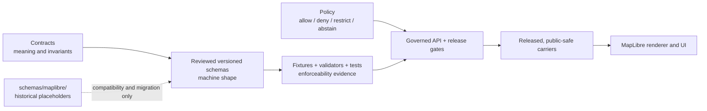

<!-- [KFM_META_BLOCK_V2]
doc_id: kfm://doc/schemas-maplibre-readme
title: schemas/maplibre/ — MapLibre Performance-Schema Compatibility and Readiness Boundary
type: README
version: v0.3
status: draft; repository-grounded; transitional-compatibility-lane; eight-permissive-placeholders; workflow-held; migration-unresolved; non-authoritative; non-release
owner: NEEDS VERIFICATION — CODEOWNERS routes /schemas/ to @bartytime4life, but routing is not accepted stewardship or independent approval
created: 2026-07-05
updated: 2026-08-13
policy_label: public
owning_root: schemas/
current_path: schemas/maplibre/README.md
responsibility: Preserve a bounded compatibility index for eight unversioned MapLibre performance-schema placeholders, prevent new reliance on them, and route future machine-shape work through reviewed versioned object families without claiming runtime, release, or publication maturity.
truth_posture: CONFIRMED repository and hosted-workflow evidence; PROPOSED or UNKNOWN semantics, object-family destinations, ownership, consumers, activation, migration, release, and retirement unless separately proved
evidence_snapshot: main@98b28dc94057e29b7f79cedfd07fa81045d9f666; repository tree 531fe76a0bf5c081e594d0099b90bd4b9a0bec64; target tree 3fcb458b7542c97bf962293b13d7fe57200d245f; prior README blob 68d152a17e12d29aa573056ff9e7997fcd1f63dc
related:
  - schemas/README.md
  - schemas/contracts/v1/map/README.md
  - schemas/contracts/v1/layers/README.md
  - configs/maplibre/README.md
  - contracts/README.md
  - policy/README.md
  - tools/validators/maplibre/README.md
  - tests/maplibre/README.md
  - tests/fixtures/maplibre/README.md
  - packages/maplibre/README.md
  - docs/doctrine/directory-rules.md
  - docs/adr/ADR-0001-schema-home--schemas-contracts-v1-is-canonical.md
  - docs/adr/ADR-0004-apps-governed-api-is-the-trust-membrane.md
  - docs/adr/ADR-0029-adopt-directory-governance-standard-v2.md
  - docs/quality/maplibre-perf-governance.md
  - .github/workflows/maplibre-perf-governance.yml
tags: [kfm, schemas, maplibre, performance, compatibility, readiness, validation, migration, evidence]
notes:
  - Every direct schema file is the same Draft 2020-12 accept-any-object placeholder at blob 511e7f34ca84390fd5d000326ab33c46c3050fc4.
  - The latest applicable main-branch MapLibre performance workflow reviewed for this revision concluded success while explicitly recording WORKFLOW_HOLD; success is not readiness, release, or publication evidence.
  - ADR-0029 is accepted and adopts Directory Rules v2. ADR-0001 and the implementation-facing MapLibre ADRs remain proposed; this README does not accept them.
  - This revision changes documentation only. It does not modify schemas, contracts, fixtures, validators, tests, workflows, runtime code, artifacts, evidence, policy, release records, or KFM publication state.
[/KFM_META_BLOCK_V2] -->

<a id="top"></a>

# `schemas/maplibre/` — MapLibre Performance-Schema Compatibility and Readiness Boundary

> **One-line purpose.** Keep eight historical MapLibre performance-schema placeholders visible and bounded while preventing their syntax, paths, or green checks from being mistaken for semantic contracts, runtime readiness, release approval, or publication authority.

<kbd>TRANSITIONAL COMPATIBILITY</kbd> <kbd>8 IDENTICAL PLACEHOLDERS</kbd> <kbd>SEMANTIC VALIDATION: NONE</kbd> <kbd>LATEST APPLICABLE WORKFLOW: SUCCESS + HOLD</kbd> <kbd>PUBLISHER: NO</kbd>

> [!IMPORTANT]
> `schemas/maplibre/` is a non-authoritative compatibility lane beneath the canonical [`schemas/`](../README.md) machine-shape root. Its eight JSON files parse as JSON Schema Draft 2020-12 and accept any JSON object. They do not define meaningful fields, identities, invariants, evidence requirements, policy outcomes, promotion gates, release state, or safe presentation rules.

> [!CAUTION]
> Do not add new consumers, extend these unversioned placeholders, or infer readiness from a successful workflow conclusion. The inspected MapLibre workflow deliberately verifies that placeholder and verifier maturity has **not** advanced and records `WORKFLOW_HOLD`. A migration or implementation change requires explicit object-family routing, reviewed schemas, paired contracts, fixtures, validators, negative tests, consumer evidence, and release governance.

**Quick navigation:** [Purpose](#purpose) · [Authority](#authority-and-inheritance) · [Status](#status-and-evidence) · [Map](#current-directory-map) · [Inventory](#complete-placeholder-inventory) · [Shape](#verified-placeholder-shape) · [Routing](#object-family-and-authority-routing) · [Flow](#governed-responsibility-flow) · [Boundaries](#what-belongs-here) · [Interfaces](#inputs-outputs-writers-and-consumers) · [Validation](#validation-and-negative-checks) · [CI](#current-ci-and-readiness-boundary) · [Migration](#compatibility-migration-and-retirement) · [Review](#review-burden-and-escalation) · [Done](#definition-of-done) · [Open items](#open-verification-register) · [Evidence](#evidence-ledger) · [Correction](#correction-and-rollback)

---

## Purpose

This directory retains eight historical, unversioned filenames while KFM resolves what each object means, which versioned schema family owns its shape, which contract owns its semantics, which policy and release controls apply, and which existing consumers—if any—must migrate.

This compatibility lane exists to:

- make the exact current bytes and their limitations discoverable;
- stop unversioned file paths from quietly becoming stable public contracts;
- preserve migration context without creating a parallel schema authority;
- separate machine shape from meaning, evidence, policy, configuration, runtime rendering, and release state;
- provide fail-closed contribution and review rules; and
- record the evidence required before any placeholder can be promoted, redirected, deprecated, tombstoned, or removed.

It does **not** make the filenames canonical, the schemas meaningful, the workflow operational, the MapLibre adapter implemented, or any result safe to publish.

The durable responsibility split is:

| Responsibility root | Owns | Does not gain authority from this README |
|---|---|---|
| `contracts/` | Semantic meaning, invariants, lifecycle, and cross-object relationships | Machine shape, policy execution, or release approval |
| `schemas/` | Machine-checkable shape and versioned schema identity | Truth, rights, sensitivity, review, or publication |
| `policy/` | Allow, deny, restrict, abstain, and escalation logic | Schema validity or artifact release by itself |
| `configs/` | Commit-safe thresholds and defaults | Evidence, promotion, or release records |
| `fixtures/` and `tests/` | Representative examples, counterexamples, and enforceability proof | Runtime production behavior unless explicitly exercised |
| `tools/validators/` | Executable checks with bounded inputs and finite outcomes | Authority to waive failed policy or release gates |
| `data/receipts/`, proof, and evidence surfaces | Append-oriented records about evaluated events | Retroactive truth or automatic publication |
| `release/` | Promotion, release, correction, withdrawal, and rollback governance | Semantic contract authorship or renderer implementation |
| `packages/` and `apps/` | Adapter, renderer, governed API, and UI behavior | Canonical schema or policy authority |

MapLibre is downstream of these authorities. It renders reviewed, released, public-safe carriers; it does not become a source of truth because an object can be displayed.

## Authority and inheritance

### Governing authority

| Source | Status at the evidence snapshot | Effect here |
|---|---|---|
| [ADR-0029](../../docs/adr/ADR-0029-adopt-directory-governance-standard-v2.md) | **ACCEPTED** | Adopts the exact Directory Rules v2 bytes and their responsibility-root, README, placement, compatibility, and change-control rules. |
| [Directory Rules v2](../../docs/doctrine/directory-rules.md) | **ADOPTED BY ADR-0029**; its pinned internal header still records its original proposal posture | Defines `schemas/` as machine shape, requires the contracts/schemas/policy split, and defaults new schema families to `schemas/contracts/v1/<family>/` unless an accepted ADR establishes another versioned profile. |
| [`schemas/README.md`](../README.md) | **CURRENT ROOT CONTRACT** | Classifies this child as a transitional, permissive, readiness-held compatibility lane and supplies parent validation and maturity rules. |
| [`control_plane/root_registry.yaml`](../../control_plane/root_registry.yaml) | **MACHINE PROJECTION ONLY** | Registers `root.schemas`. It does not accept a child-family destination, activate a schema, or create independent authority. |
| [ADR-0001](../../docs/adr/ADR-0001-schema-home--schemas-contracts-v1-is-canonical.md) | **PROPOSED** | Describes stronger schema-home canonicalization and migration intent; it is useful design context, not accepted migration authority. |
| [ADR-0004](../../docs/adr/ADR-0004-apps-governed-api-is-the-trust-membrane.md) | **DRAFT source / effectively PROPOSED** | Describes the governed API trust-membrane design. It does not prove that the trust membrane or these object flows are implemented. |
| MapLibre adapter and renderer decisions | **PROPOSED** | ADR-0006 and ADR-0007 describe a single adapter seam and browser-renderer posture; neither makes the current placeholder package or adapter operational. |

### Local authority statement

This README may document observed repository state, route contributors, preserve compatibility facts, and name unresolved decisions. It must not:

- accept, supersede, or silently implement an ADR;
- assign a canonical versioned family to any object without review;
- create a second writable schema authority;
- define contract semantics, policy decisions, evidence requirements, or release gates in prose;
- activate a validator, consumer, workflow stage, package, adapter, API, renderer, or public map;
- authorize promotion, release, publication, correction, withdrawal, rollback execution, tombstoning, or deletion; or
- convert placeholders into implemented artifacts by relabeling them.

`CODEOWNERS` routes `/schemas/` review to `@bartytime4life`. That is review routing only. It does not prove an accepted schema steward, object-family owner, independent approver, separation of duties, branch protection, or release authority.

### Authority precedence

When sources disagree, apply the following fail-closed order:

1. accepted ADRs and the exact adopted doctrine bytes they identify;
2. current responsibility-root contracts and accepted versioned-family rules;
3. machine projections and executable validators within their declared scope;
4. local compatibility documentation;
5. architecture lineage and proposals.

File proximity, age, naming, import history, or workflow success does not override accepted authority.

## Status and evidence

The following statements are pinned to `main@98b28dc94057e29b7f79cedfd07fa81045d9f666` unless a hosted run is named separately.

| Question | Evidence-backed answer | Truth label |
|---|---|---|
| Is this directory tracked? | Yes; tree `3fcb458b7542c97bf962293b13d7fe57200d245f` contains one README and eight schema files. | **CONFIRMED** |
| Were all direct schema files inspected? | Yes. The recursive target-tree inventory and each file blob were compared. | **CONFIRMED** |
| Are the eight schema files distinct implementations? | No. All eight resolve to blob `511e7f34ca84390fd5d000326ab33c46c3050fc4`. | **CONFIRMED** |
| Do they parse and declare a JSON Schema draft? | Yes. Each declares `https://json-schema.org/draft/2020-12/schema`. | **CONFIRMED** |
| Do they validate meaningful fields? | No. Each accepts any JSON object, allows every property, and defines no properties or required keys. | **CONFIRMED PLACEHOLDER** |
| Do they define `$id`, title, version, KFM metadata, examples, or annotations? | No. Those identity and maturity signals are absent from the shared blob. | **CONFIRMED ABSENT** |
| Is `schemas/` the correct responsibility root for machine shape? | Yes, under accepted ADR-0029 and Directory Rules v2. | **CONFIRMED** |
| Is this unversioned child the accepted final home? | No accepted decision assigning these eight objects here was verified. | **NEEDS VERIFICATION / HOLD** |
| Is one `map` family the correct destination for all eight objects? | Not established. Receipts, proofs, release manifests, correction notices, failure bundles, and rollback plans cross semantic and lifecycle boundaries. | **UNKNOWN / NEEDS OBJECT-FAMILY REVIEW** |
| Are wrapper validators present? | Yes; eight thin wrappers invoke the common JSON Schema runner against these placeholders. | **CONFIRMED, STRUCTURALLY NARROW** |
| Are broader performance-governance verifiers implemented? | No. The inspected workflow asserts that seven remain placeholders. | **CONFIRMED HOLD** |
| Are there executable negative tests? | Three pure tests reject a zero frame budget, negative memory, and tile error rate above one. | **CONFIRMED, NARROW** |
| Is the MapLibre adapter implemented? | No. The inspected app adapter is comment-only; the package exports a placeholder and declares no dependencies. | **CONFIRMED PLACEHOLDER** |
| Did the latest applicable main MapLibre performance run pass? | Run `31654973078` concluded `success` while its logs explicitly recorded `WORKFLOW_HOLD`. | **CONFIRMED SUCCESS + HOLD** |
| Does that run prove browser performance, render parity, proof, release, rollback, or publication? | No. Those stages were not executed by the inspected workflow. | **CONFIRMED NON-PROOF** |
| Are owner, consumer set, migration schedule, and retirement criteria accepted? | No complete accepted record was verified. | **NEEDS VERIFICATION** |

### Truth labels used here

| Label | Meaning |
|---|---|
| **CONFIRMED** | Directly observed in the pinned Git tree, file bytes, workflow definition, hosted run, or adopted authority. |
| **INFERRED** | A bounded conclusion from confirmed evidence; the inference and its limits are stated. |
| **PROPOSED** | Declared design or candidate state that is not accepted or active. |
| **UNKNOWN** | Available evidence does not establish the answer. |
| **NEEDS VERIFICATION** | A specific repository, governance, test, runtime, or consumer check remains open. |
| **HOLD** | Do not rely, migrate, activate, release, publish, retire, or delete until the named gates close. |

## Current directory map

Directory Rules `DIR-README-003` requires this map to show the current directory and direct children only.

```text
schemas/maplibre/
├── README.md
├── perf-correction-notice.schema.json
├── perf-envelope.schema.json
├── perf-failure-bundle.schema.json
├── perf-proof-pack.schema.json
├── perf-receipt.schema.json
├── perf-release-manifest.schema.json
├── perf-rollback-plan.schema.json
└── render-diff-report.schema.json
```

No nested directory is present in the inspected target tree. The inventory is exact for the pinned snapshot; it is not a claim about later commits.

## Complete placeholder inventory

| File | Confirmed machine behavior | Filename-implied concern only | Canonical destination |
|---|---|---|---|
| [`perf-envelope.schema.json`](./perf-envelope.schema.json) | Accept any JSON object | Performance thresholds or measured envelope | **NEEDS VERIFICATION** |
| [`perf-receipt.schema.json`](./perf-receipt.schema.json) | Accept any JSON object | Evaluation or execution receipt | **NEEDS VERIFICATION** |
| [`render-diff-report.schema.json`](./render-diff-report.schema.json) | Accept any JSON object | Render comparison report | **NEEDS VERIFICATION** |
| [`perf-proof-pack.schema.json`](./perf-proof-pack.schema.json) | Accept any JSON object | Proof or evidence aggregation | **NEEDS VERIFICATION** |
| [`perf-rollback-plan.schema.json`](./perf-rollback-plan.schema.json) | Accept any JSON object | Release rollback planning | **NEEDS VERIFICATION** |
| [`perf-failure-bundle.schema.json`](./perf-failure-bundle.schema.json) | Accept any JSON object | Failure triage or diagnostic bundle | **NEEDS VERIFICATION** |
| [`perf-release-manifest.schema.json`](./perf-release-manifest.schema.json) | Accept any JSON object | Release or promotion manifest | **NEEDS VERIFICATION** |
| [`perf-correction-notice.schema.json`](./perf-correction-notice.schema.json) | Accept any JSON object | Correction or withdrawal notice | **NEEDS VERIFICATION** |

The third column is vocabulary suggested by filenames, not confirmed semantics. Do not use it to generate payloads, APIs, schemas, validators, or release logic without an accepted contract and object-family review.

## Verified placeholder shape

Every direct schema file contains exactly this machine shape:

```json
{
  "$schema": "https://json-schema.org/draft/2020-12/schema",
  "type": "object",
  "additionalProperties": true
}
```

All eight files share Git blob `511e7f34ca84390fd5d000326ab33c46c3050fc4`.

### What this proves

- the bytes parse as JSON;
- the declared meta-schema URI is Draft 2020-12;
- non-object instances are rejected by the `type` keyword; and
- object instances with any property set are accepted.

### What this does not prove

- object identity, version, naming, or canonical URI;
- required fields, value domains, units, timestamps, or clock semantics;
- source, layer, style, tile, renderer, browser, device, or environment identity;
- deterministic measurement method, sample size, baseline, tolerance, or comparison rules;
- evidence lineage, citations, hashes, signatures, review, or separation of duties;
- rights, sensitivity, consent, public-safety, or access-policy outcomes;
- promotion, release, rollback, correction, withdrawal, or publication state;
- compatibility with a consumer, API, package, adapter, workflow, or UI; or
- that any filename-implied object exists at runtime.

A common JSON Schema runner can correctly report these placeholders valid while providing almost no semantic assurance. That is expected behavior, not evidence of implementation maturity.

## Object-family and authority routing

Accepted Directory Rules provide a default versioned pattern, not an automatic destination for every historical filename. Each object must be routed according to its semantic aggregate and lifecycle boundaries.

### Adjacent versioned families

| Surface | Confirmed state | Safe use here |
|---|---|---|
| [`schemas/contracts/v1/map/`](../contracts/v1/map/README.md) | README plus 17 schema files; mixed maturity | Candidate adjacency for machine shapes whose accepted semantic aggregate is `map`, not a blanket destination for performance, proof, receipt, or release objects. |
| `map/layer_manifest.schema.json` | Proposed accept-any scaffold | No stronger than a placeholder for semantic assurance. |
| `map/style_manifest.schema.json` | Proposed accept-any scaffold | Does not prove style compilation, safety, or release. |
| `map/tile_artifact_manifest.schema.json` | Proposed accept-any scaffold | Does not prove tile generation, integrity, or publication. |
| `map/map_release_manifest.schema.json` | Substantive, strict, fixture-first `PROPOSED_INACTIVE` profile | Demonstrates a stronger machine-backed profile while explicitly denying activation. It does not absorb all MapLibre performance objects. |
| [`schemas/contracts/v1/layers/`](../contracts/v1/layers/README.md) | Shared layer schemas with permissive scaffolds and overlapping domain profiles | Requires bounded ownership and overlap review before any routing. |

### Required routing questions

Before moving or replacing any of the eight placeholders, reviewers must establish:

1. the semantic aggregate and canonical contract path;
2. the versioned schema family and stable `$id` policy;
3. the difference between configuration, observation, receipt, proof, decision, and release record;
4. the authoritative writer and authorized mutation model;
5. intended readers and actual existing consumers;
6. applicable rights, consent, sensitivity, security, and public-safety policy;
7. fixtures, validators, negative tests, and compatibility expectations;
8. promotion, release, correction, withdrawal, and rollback relationships;
9. retention and redaction requirements; and
10. migration, redirect, deprecation, and retirement evidence.

### Cross-family caution

The filename prefix `perf-` and the renderer name `maplibre` are not sufficient domain boundaries. A receipt may belong to a generic evaluation or evidence family; a proof pack may be evidence infrastructure; a release manifest, correction notice, and rollback plan may be release-governance objects. **INFERRED:** forcing all eight into one map-specific family would risk coupling renderer compatibility to cross-cutting trust and release semantics. Final placement remains **NEEDS VERIFICATION**.

## Governed responsibility flow



This diagram is a responsibility model. It is not proof that the proposed governed API, release gates, carrier pipeline, or MapLibre adapter are currently implemented.

### Renderer boundary

MapLibre may consume released styles, sources, tiles, overlays, interaction metadata, and public-safe presentation carriers. It must not independently decide:

- whether a source is authoritative or merely contextual;
- whether a claim is sufficiently evidenced;
- whether rights, consent, sensitivity, or disclosure policy permit exposure;
- whether a draft or reviewed object is promoted or released;
- whether a correction, withdrawal, or rollback is required; or
- whether an AI-generated suggestion is factual, approved, or publishable.

Those decisions belong upstream and require explicit records. Rendering is presentation, not governance.

## Source, layer, style, and performance separation

These concepts must remain distinguishable even when one workflow or UI touches all of them.

| Concern | Primary question | Required evidence before reliance |
|---|---|---|
| Source metadata | What is the source, lineage, role, rights posture, freshness, and access boundary? | Source contract, metadata schema, validation, and policy result |
| Layer definition | What geographic or thematic object is represented, at what scale and geometry? | Layer contract, versioned schema, fixtures, topology checks, and domain review |
| Style or presentation | How may released data be symbolized and interacted with? | Style contract, accessibility, disclosure, renderer compatibility, and release review |
| Tile or artifact | What generated carrier is addressed, hashed, bounded, and released? | Deterministic build evidence, integrity, provenance, and release manifest |
| Performance observation | Under which reproducible environment were metrics measured? | Identified environment, method, samples, baselines, tolerances, and raw evidence |
| Render comparison | What images or scene states were compared and under which deterministic rules? | Baseline identity, captured output, algorithm, thresholds, and reviewed result |
| Receipt or proof | What evaluation occurred, against which inputs and rules, with what outcome? | Immutable identifiers, hashes, validator version, finite outcome, and reviewer trace |
| Release or correction | What changed operational state, who authorized it, and how can it be reversed? | Accepted gate result, separation of duties, release record, correction/rollback path |

Passing one concern must not silently satisfy another.

## What belongs here

While this compatibility lane remains tracked, acceptable changes are limited to:

- this evidence-bounded README;
- reviewed compatibility notes tied to exact source and destination identities;
- explicit deprecation or redirect metadata authorized by an accepted migration;
- temporary compatibility schemas only when an accepted decision requires them and their authority is clearly subordinate; and
- machine-verifiable exit criteria and removal evidence.

Any retained compatibility file must state its status, canonical destination, allowed readers, write prohibition, sunset criteria, and rollback plan. The current placeholders do not yet satisfy that future standard; they are retained under hold, not endorsed.

## What does not belong here

Do not place or author the following in this directory:

- semantic contracts or prose that creates contract meaning;
- normative policy bundles or allow/deny decisions;
- configuration instances, thresholds, environment profiles, or secrets;
- fixtures, snapshots, screenshots, golden images, metrics, traces, or runtime logs;
- validators, test code, workflows, browser harnesses, or benchmark runners;
- source, layer, style, tile, or release payload instances;
- receipts, proof packs, evidence bundles, attestations, signatures, or audit logs;
- release manifests, correction notices, withdrawal records, or rollback executions;
- generated artifacts, public exports, tiles, reports, dashboards, or map applications; or
- executable package, adapter, API, renderer, or UI code.

The presence of similarly named schema placeholders is not a precedent for storing their instances here.

## Compatibility rules

1. **Single-write authority.** New authoritative schema work goes to the reviewed versioned family. This lane must not evolve independently.
2. **No new binding.** New code, workflows, contracts, or APIs must not bind to these unversioned paths.
3. **Dual-read only when approved.** A migration may temporarily read old and new shapes only when an accepted plan defines precedence, telemetry, error handling, duration, and exit criteria.
4. **No silent coercion.** Unknown or invalid legacy fields must fail closed or produce a bounded migration error; they must not be silently reinterpreted.
5. **Identity before redirect.** A redirect or compatibility `$ref` requires stable source and destination identities, version rules, cycle checks, and fixture-backed validation.
6. **No schema copy drift.** Copying a versioned schema into this lane creates parallel authority unless the compatibility mechanism is explicitly generated and checked.
7. **No maturity laundering.** Renaming a placeholder, adding a `$id`, or making CI green does not make semantics accepted or runtime implemented.
8. **Consumer closure before retirement.** Deletion requires exact reference search, runtime and workflow consumer evidence, documentation repair, rollback, and accepted change control.

## Consumer rules

### New consumers

New consumers are prohibited while the schemas remain permissive placeholders. A new consumer must bind to a reviewed versioned schema with:

- an accepted semantic contract;
- stable identity and version rules;
- valid and invalid fixtures;
- executable validation and negative tests;
- explicit unknown-field and forward-compatibility behavior;
- finite outcomes and fail-closed policy behavior;
- evidence and release relationships; and
- an accountable owner and review path.

### Existing consumers

The complete existing consumer set is **UNKNOWN**. Before changing a filename or shape, search at minimum:

- source code and package imports;
- scripts, validators, tests, fixtures, and configuration;
- workflow path filters and command lines;
- docs, ADRs, root registries, catalogs, and generated indexes;
- release, evidence, receipt, and artifact builders; and
- externally documented APIs or integration instructions.

Reference presence is not consumer proof, and absence from a simple text search is not sufficient closure. Dynamic path construction, generated code, workflow matrices, and external clients may require separate evidence.

### Public and runtime clients

Browser, API, and MapLibre clients must receive only governed, released, public-safe carriers. They must not consume draft schema repositories as content stores or use local schema validity as an authorization result.

## Inputs, outputs, writers, and consumers

This directory currently describes machine-shape placeholders; it is not an event-processing component.

| Interface | Current evidence-backed posture |
|---|---|
| Inputs | Repository commits and reviews that change these nine tracked files. No runtime payload input is authorized here. |
| Outputs | JSON Schema bytes and this documentation. Validating an object against the current schema can only establish that it is an object. |
| Writers | Git contributors subject to repository review. Accepted stewardship and independent approval remain **NEEDS VERIFICATION**. |
| Readers | Validators, workflows, tests, scripts, docs, and potential external clients may reference these paths; the complete set is **UNKNOWN**. |
| Mutations | Git history only. Runtime mutation, in-place evidence edits, or generated artifact writes do not belong here. |
| Side effects | None are authorized. A schema read or validation result must not promote, release, publish, delete, notify, or mutate external state. |

### Non-effects contract

Neither this README nor any current schema in this directory may be used as sufficient evidence that:

- a payload is truthful, authoritative, complete, current, or fit for use;
- a benchmark ran or passed;
- a render diff was captured or reviewed;
- an evidence bundle, proof pack, or receipt is trustworthy;
- rights, consent, sensitivity, or security checks passed;
- an object was promoted, released, published, corrected, withdrawn, or rolled back; or
- a MapLibre view is safe for public access.

## Security, privacy, exposure, and retention

Schema repositories are public and must not contain secrets, credentials, access tokens, private endpoints, personal data, restricted coordinates, unpublished vulnerabilities, signed private evidence, or production traces.

Any future object family must explicitly classify:

- identifier sensitivity and linkability;
- location precision and re-identification risk;
- source licensing, consent, and redistribution limits;
- environment and device fingerprints;
- screenshot or render contents;
- failure details and security-sensitive diagnostics;
- signature, attestation, and key-reference handling;
- retention, correction, withdrawal, legal hold, and deletion rules; and
- public, restricted, and internal projections.

Schema shape must not embed policy outcomes as defaults. Exposure decisions require policy evaluation and release-state evidence outside this directory.

## Validation and negative checks

Validation is layered. A green lower layer must not be reported as a green higher layer.

| Layer | Required check | Current posture |
|---|---|---|
| Inventory | Exactly one README plus the eight named direct schemas | **CONFIRMED** at the pinned tree |
| JSON syntax | Parse each schema as JSON | **CONFIRMED** |
| Meta-schema | Validate each schema against Draft 2020-12 | **CONFIRMED by source/workflow posture** |
| Identity | Unique stable `$id`, version, title, status, and metadata | **ABSENT / HOLD** |
| Semantic shape | Required fields, constraints, cross-field rules, units, and outcomes | **ABSENT / HOLD** |
| Fixtures | Representative valid, invalid, edge, privacy, and migration cases | **NOT ESTABLISHED for these schemas** |
| Validator | Bounded executable validator with finite outcomes | **Eight structural wrappers; broader verifiers held** |
| Negative paths | Demonstrate rejection of invalid and unsafe inputs | **Three narrow scalar tests only** |
| Runtime | Browser, renderer, device, network, and environment execution | **NOT EXECUTED by the inspected perf workflow** |
| Evidence | Hashes, provenance, logs, receipts, signatures, and review | **NOT PRODUCED for these schemas by the inspected workflow** |
| Policy and release | Governed decision, separation of duties, promotion, correction, rollback | **NOT ESTABLISHED** |

### Documentation checks for this README

Run from repository root:

```bash
python tools/validators/docs/meta-block/check_meta_blocks.py \
  --repo-root . --profile required schemas/maplibre/README.md

python tools/validators/docs/stale-scan/check_stale_docs.py \
  --repo-root . --as-of 2026-08-13 --profile bounded-required \
  schemas/maplibre/README.md

python tools/validators/docs/link-check/check_links.py \
  --repo-root . schemas/maplibre/README.md
```

Also verify:

- exactly one H1 and a monotonic heading structure;
- the metadata block is first and complete;
- every relative link resolves at the reviewed commit;
- the direct-child map matches the Git tree;
- all eight schema contents and blob identities are rechecked;
- Markdown renders without broken tables, alerts, code fences, anchors, or Mermaid syntax; and
- the no-loss and evidence ledgers are updated.

### Schema and wrapper checks

The current eight wrapper validators exercise the common JSON Schema runner against the eight permissive files. That proves plumbing and Draft compatibility within the runner's scope. It does not prove filename-implied semantics.

Future schema promotion must add, at minimum:

- a stable `$id` and version policy;
- an accepted paired contract;
- strict or explicitly justified unknown-field behavior;
- valid, invalid, boundary, malicious, privacy-sensitive, compatibility, and rollback fixtures;
- tests that prove every normative constraint rejects counterexamples;
- deterministic output and finite validator outcomes;
- no-network or explicitly bounded-network execution;
- consumer compatibility evidence; and
- promotion and release checks separate from validation.

## Current CI and readiness boundary

### MapLibre performance-governance workflow

The inspected [workflow](../../.github/workflows/maplibre-perf-governance.yml) includes `schemas/maplibre/**` in its path filters. It currently:

- checks JavaScript syntax for seven MapLibre scripts;
- parses the MapLibre Python validator surface;
- invokes three scalar negative-path tests directly;
- checks readiness-inventory drift;
- asserts that all eight schemas remain the exact permissive placeholder shape;
- asserts that eight schema wrappers and seven broader placeholder verifiers retain their expected maturity;
- reviews the workspace lock posture while the `@kfm/maplibre` package remains dependency-free; and
- emits explicit skip and hold records.

It does **not** install a browser, start a server, exercise a MapLibre renderer, capture screenshots, measure frames or memory, compare renders, validate a real receipt or proof pack, sign an attestation, upload governed artifacts, promote a release, publish a map, issue a correction, or execute rollback.

### Latest applicable hosted run

At documentation review time, [run `31654973078`](https://github.com/bartytime4life/Kansas-Frontier-Matrix/actions/runs/31654973078) on main commit `3911c519…` concluded `success`. Its job logs explicitly recorded `WORKFLOW_SKIPPED_EXPLICIT` and `WORKFLOW_HOLD`.

Safe conclusion:

```text
workflow definition and readiness guard executed successfully
≠ browser benchmark executed
≠ performance envelope satisfied
≠ render parity established
≠ proof or attestation accepted
≠ release approved
≠ artifact published
```

The hold is a designed outcome, not a hidden failure and not permission to bypass missing stages.

### Adjacent workflows

- The latest reviewed MapLibre source-metadata run (`30958539690`) succeeded on 2026-08-04. It validates a separate source-metadata projection and does not make these eight placeholders semantic.
- The current-main schema-validation run (`31758530911`) parsed 874 JSON files, found 865 meta-schema-valid schemas, checked 855 canonical v1 schema IDs, and passed eight configured aggregate validators; it then failed the repository-topology validator and skipped later schema/contract tests.
- The current-main validator-suite run (`31758530894`) failed the same topology ratchet after its canary passed; later jobs were skipped.

Those current-main failures are repository-level preflight evidence. A change to this README must still run its own PR checks, and any failure must be compared by exact job, log, and fingerprint before it is called inherited. Documentation must not normalize, conceal, or relabel a failing required check.

## Safe change workflow

1. Pin the current base commit, target tree, README blob, and all eight schema blobs.
2. Search open pull requests and active branches for overlapping target changes.
3. Re-read accepted ADR-0029, the exact adopted Directory Rules bytes, the schema-root README, and relevant proposed ADRs.
4. Classify every assertion as **CONFIRMED**, **INFERRED**, **PROPOSED**, **UNKNOWN**, **NEEDS VERIFICATION**, or **HOLD**.
5. Identify the semantic aggregate and object-family owner before proposing a schema destination.
6. Inspect existing consumers, workflows, validators, tests, fixtures, configuration, evidence builders, release tooling, and docs.
7. Keep validation separate from policy, promotion, release, publication, correction, and rollback.
8. Update one focused branch with the README and its traceability receipt only.
9. Run metadata, staleness, link, structure, rendering, and repository-specific checks.
10. Open a draft pull request; inspect every PR check and disclose held or inherited failures precisely.
11. Require explicit review before any schema, consumer, workflow, runtime, or migration change.

If evidence is incomplete or authority conflicts, stop at **HOLD**.

## Compatibility, migration, and retirement

### Required migration sequence

1. **Inventory:** prove the old paths, exact bytes, references, consumers, writers, readers, and generated dependencies.
2. **Contract:** accept the semantic aggregate, invariants, lifecycle, evidence, and correction model.
3. **Placement:** approve the versioned schema family and identity/version strategy.
4. **Implementation:** author machine shape, fixtures, validators, negative tests, and documentation.
5. **Consumer proof:** demonstrate intended consumers on the new version and characterize legacy behavior.
6. **Compatibility:** if required, implement bounded dual-read/single-write behavior with telemetry and expiry.
7. **Promotion:** run separate policy and release gates; validation alone cannot promote.
8. **Redirect or tombstone:** preserve discoverability and fail clearly for unsupported use.
9. **Retirement:** remove only after reference, runtime, workflow, documentation, and rollback closure.

### Promotion gates

No placeholder may be described as implemented or promoted until all of the following are recorded:

- accepted semantic contract and versioned placement;
- accountable owner and independent review path;
- non-permissive machine constraints or an explicit, reviewed reason for extensibility;
- stable identity and compatibility rules;
- representative positive and negative fixtures;
- executable validators and tests with deterministic outcomes;
- security, privacy, rights, consent, sensitivity, and retention review;
- real consumer and runtime evidence where applicable;
- evidence and receipt design that does not self-attest;
- release, correction, withdrawal, and rollback controls; and
- a decision record that changes maturity without rewriting history.

### Retirement gates

Deletion remains **HOLD** until an accepted record proves:

- the canonical destination for every object;
- no unauthorized writes remain;
- all consumers migrated or were intentionally retired;
- no workflow, tool, fixture, config, doc, or external integration requires the old path;
- redirects or tombstones satisfy compatibility needs;
- release and rollback procedures are tested; and
- documentation, registries, catalogs, and receipts are repaired.

## Review burden and escalation

| Change | Minimum review burden |
|---|---|
| README wording only | Schema-root documentation review; verify truth labels, links, inventory, non-effects, and no-loss ledger |
| Placeholder metadata or `$id` | Schema steward, contract steward, identity/version review, consumer search, fixtures, validators, and negative tests |
| Field or constraint change | Accepted contract evidence, schema review, compatibility analysis, consumer tests, migration and rollback plan |
| New or changed receipt/proof shape | Evidence and security review; prevent self-attestation and distinguish observation from decision |
| Release/correction/rollback object | Release governance, separation of duties, policy review, immutable history, and tested reversal path |
| Validator or workflow change | Validator, CI, security, and domain review; prove finite outcomes and distinguish success from hold |
| Runtime or MapLibre binding | Adapter, governed API, renderer, accessibility, privacy, policy, release, and operational review |
| Redirect, tombstone, or deletion | Accepted migration decision, consumer closure, reference closure, documentation repair, and rollback evidence |

Escalate when object-family ownership conflicts, a compatibility reader could become a writer, public exposure is possible, a receipt can authorize its own action, a workflow masks skipped stages, or a proposed change weakens a fail-closed outcome.

## Definition of done

### This README revision

- [x] Metadata block updated with a current evidence snapshot.
- [x] Accepted ADR-0029 distinguished from proposed ADRs.
- [x] Exact direct-child tree and all eight files recorded.
- [x] Shared placeholder bytes and blob identity recorded.
- [x] Semantic, policy, evidence, release, and renderer non-effects stated.
- [x] Adjacent map and layer families described without assigning all objects to them.
- [x] Workflow success distinguished from `WORKFLOW_HOLD` and unexecuted stages.
- [x] Contributor, migration, review, correction, and rollback controls preserved and strengthened.
- [x] Open verification and no-loss ledgers included.
- [ ] Human review and acceptance of this documentation change.

### Executable and migration maturity

- [ ] Accepted semantic contract exists for each object.
- [ ] Canonical versioned family and stable identity are approved.
- [ ] Accountable owner, consumers, and separation of duties are recorded.
- [ ] Strict schemas or justified extension points are implemented.
- [ ] Positive, negative, edge, malicious, privacy, migration, and rollback fixtures exist.
- [ ] Validators and tests prove normative constraints.
- [ ] Browser, renderer, benchmark, and render-diff stages run where applicable.
- [ ] Evidence, proof, receipt, attestation, and reviewer boundaries are implemented without self-approval.
- [ ] Policy, promotion, release, correction, withdrawal, and rollback gates are separate and tested.
- [ ] Compatibility readers, telemetry, exit criteria, and retirement evidence are complete.

The first checklist can complete while the second remains entirely held. Documentation quality does not imply implementation maturity.

## Open verification register

| ID | Question | Required evidence | Current action |
|---|---|---|---|
| MAPLIBRE-SCHEMA-001 | Who is accountable for this compatibility lane and each destination family? | Accepted ownership record and review path | **HOLD new authority claims** |
| MAPLIBRE-SCHEMA-002 | Which semantic contract owns each of the eight objects? | Contract inventory and accepted aggregate mapping | **HOLD schema promotion** |
| MAPLIBRE-SCHEMA-003 | Which versioned schema family is canonical for each object? | Accepted placement decision and stable `$id` plan | **HOLD migration** |
| MAPLIBRE-SCHEMA-004 | Which code, workflows, tools, fixtures, docs, or external clients consume the old paths? | Repository-wide and integration consumer inventory | **HOLD rename or deletion** |
| MAPLIBRE-SCHEMA-005 | What is configuration versus observation versus receipt versus proof versus release record? | Lifecycle model with writers, readers, immutability, and correction rules | **HOLD payload authoring** |
| MAPLIBRE-SCHEMA-006 | Which benchmark environments, baselines, tolerances, and sampling rules are accepted? | Reproducible performance contract and fixtures | **HOLD performance claims** |
| MAPLIBRE-SCHEMA-007 | What constitutes an accepted render comparison? | Deterministic capture and diff protocol with reviewed baselines | **HOLD parity claims** |
| MAPLIBRE-SCHEMA-008 | Which rights, consent, sensitivity, privacy, and public-safety controls apply? | Policy profiles, tests, decisions, and public projections | **HOLD exposure** |
| MAPLIBRE-SCHEMA-009 | How are proof and receipt records protected from self-attestation or mutation? | Evidence architecture, signer/reviewer boundaries, hashes, and append-only correction | **HOLD trust claims** |
| MAPLIBRE-SCHEMA-010 | What promotes, releases, corrects, withdraws, and rolls back a MapLibre artifact? | Accepted release workflow and tested records | **HOLD release** |
| MAPLIBRE-SCHEMA-011 | When can the old paths be redirected, tombstoned, or removed? | Consumer closure, compatibility expiry, documentation repair, and rollback evidence | **HOLD retirement** |
| MAPLIBRE-SCHEMA-012 | Do current PR checks reproduce or change the known topology failures? | PR run IDs, job logs, fingerprints, and base comparison | **VERIFY on every PR** |

## Review checklist

- [ ] The base commit, target tree, prior README blob, and eight schema blobs were rechecked immediately before publication.
- [ ] No open pull request overlaps `schemas/maplibre/README.md`.
- [ ] Relative links resolve against the proposed commit.
- [ ] The direct-child map still matches the target tree.
- [ ] No proposed ADR is presented as accepted.
- [ ] No architecture source is presented as current implementation proof.
- [ ] No filename-implied semantics are presented as confirmed contract meaning.
- [ ] No workflow conclusion is presented without its explicit skipped and held stages.
- [ ] No owner, consumer, schema destination, runtime behavior, release state, or publication claim is invented.
- [ ] The change does not modify schemas, validators, tests, workflows, runtime code, artifacts, policy, or release state.
- [ ] Documentation and traceability checks pass or are disclosed precisely.
- [ ] Human reviewers confirm the evidence snapshot and non-effects contract.

## No-loss ledger

| v0.2 concern | v0.3 disposition |
|---|---|
| Purpose and non-authoritative compatibility posture | Preserved and strengthened with accepted Directory Rules authority. |
| Status and truth labels | Preserved; added **INFERRED** and **HOLD**, current Git and hosted-run evidence, and removed the obsolete placement conflict. |
| Boundary: may and must not | Preserved across `What belongs here`, `What does not belong here`, compatibility rules, and non-effects. |
| Repository fit and placement basis | Preserved as direct-child map, authority inheritance, adjacent versioned families, and responsibility routing. |
| Exact inventory and completeness boundary | Preserved and upgraded to the exact target-tree inventory. |
| Verified shared placeholder shape | Preserved byte-for-byte with common blob identity and proof/non-proof analysis. |
| Object-family and cross-family caution | Preserved; made explicit that `map` is adjacency rather than a blanket destination. |
| Compatibility and consumer rules | Preserved; added single-write, dual-read constraints, identity, telemetry, and consumer closure. |
| Validation, narrow tests, and wrappers | Preserved; separated structural, semantic, runtime, evidence, policy, and release layers. |
| Current workflow boundary and held conditions | Preserved; added latest applicable hosted-run evidence and current-main schema/validator topology status. |
| Migration and promotion gates | Preserved; expanded into ordered migration, promotion, and retirement gates. |
| Review burden | Preserved and expanded by change class and escalation trigger. |
| Definition of done | Preserved; split documentation completion from executable and migration maturity. |
| Open questions | Preserved as a numbered verification register with required evidence and hold action. |
| Evidence ledger | Preserved and updated to the current repository, workflow, implementation, and supplied-reference snapshot. |
| Correction and rollback | Preserved and expanded below. |

No v0.2 operational capability is removed because v0.2 documented boundaries rather than implemented capabilities. Statements made stale by accepted ADR-0029 or newly available run evidence are corrected explicitly rather than silently carried forward.

## Evidence ledger

| Evidence | Observation used | Limits |
|---|---|---|
| `main@98b28dc94057e29b7f79cedfd07fa81045d9f666` | Pinned repository snapshot for this revision | Later commits require re-verification |
| Repository tree `531fe76a0bf5c081e594d0099b90bd4b9a0bec64` | Base tree identity | Does not independently explain semantics |
| Target tree `3fcb458b7542c97bf962293b13d7fe57200d245f` | Exact README-plus-eight-schema inventory | Direct target only |
| Prior README blob `68d152a17e12d29aa573056ff9e7997fcd1f63dc` | v0.2 source preserved through no-loss review | Prior claims may be stale |
| Shared schema blob `511e7f34ca84390fd5d000326ab33c46c3050fc4` | All eight schemas have the same permissive object shape | Proves no semantic maturity |
| [ADR-0029](../../docs/adr/ADR-0029-adopt-directory-governance-standard-v2.md) and adopted doctrine blob `fd49a0b83e55cef52c1124281f093e263526898d` | Accepted responsibility and placement rules | Does not choose every object family |
| [`schemas/README.md`](../README.md) | Parent classification of this lane and maturity posture | Documentation, not runtime proof |
| [ADR-0001](../../docs/adr/ADR-0001-schema-home--schemas-contracts-v1-is-canonical.md) | Proposed schema-home and migration context | Not accepted |
| [ADR-0004](../../docs/adr/ADR-0004-apps-governed-api-is-the-trust-membrane.md) | Proposed governed API boundary | Not accepted implementation proof |
| [`schemas/contracts/v1/map/`](../contracts/v1/map/README.md) and [`layers/`](../contracts/v1/layers/README.md) | Adjacent versioned families with mixed maturity | Do not absorb all eight objects automatically |
| `apps/explorer-web/src/adapters/MapLibreAdapter.ts` blob `663ba0f7a05498948f67d644387c73ab19d5c16c` | Comment-only adapter | No runtime capability proof |
| `packages/maplibre/src/index.ts` blob `91664eb00583f9e3d0405eb7954fefa9a48f4ee9` and package manifest blob `b0582955feeb51016327113692fa5c98ecad8816` | Placeholder export and dependency-free package | No runtime capability proof |
| [`maplibre-perf-governance.yml`](../../.github/workflows/maplibre-perf-governance.yml) blob `306040e1c9283be5a95de76c09d205a58038f380` | Static readiness checks, placeholder assertions, explicit skip and hold | No browser or release execution |
| Hosted run `31654973078`, job `94307343990` | Latest applicable reviewed main run: success plus explicit hold | Snapshot in time; not a release receipt |
| Hosted source-metadata run `30958539690` | Separate projection checks succeeded | Does not validate these eight schemas |
| Hosted current-main runs `31758530911` and `31758530894` | Repository-topology ratchet failed after earlier checks | Must be compared with PR runs before calling inherited |
| `configs/maplibre/perf-envelope.v1.json` blob `2833f99b5316df91e71c0f8913bb06d70917abcf` | A concrete configuration instance exists | Placeholder schema does not meaningfully validate it |
| MapLibre validator and test trees | Eight thin wrappers, seven held verifiers, three scalar negative tests, and separate source/readiness validators | Narrow and mixed scope |
| Supplied MapLibre operating manual | Architecture lineage: MapLibre downstream of governance and release | Corpus source only; not repository implementation evidence |
| Supplied MapLibre component atlas | Separates confirmed source evidence from proposed implementation and denies publication by file presence | Corpus source only; not acceptance or runtime proof |

## Correction and rollback

If this README is wrong, stale, or overclaims maturity:

1. stop new reliance on the disputed statement or path;
2. open a focused correction that identifies the exact claim, evidence, and affected consumers;
3. restore the last reviewed documentation bytes when that is the safest reversible action;
4. do not rewrite or delete receipts, workflow logs, release records, or Git history;
5. add a superseding correction record when an append-oriented evidence surface is involved;
6. re-run metadata, staleness, link, inventory, schema, and relevant CI checks;
7. reassess any migration, consumer binding, promotion, release, publication, or retirement decision that depended on the claim; and
8. keep runtime rollback, data correction, release withdrawal, and schema compatibility as distinct procedures.

Rolling back this README restores documentation only. It does not roll back schema bytes, consumers, validators, workflows, packages, adapters, releases, public artifacts, or external integrations.

---

**Last evidence review:** 2026-08-13 · **Document version:** v0.3 · **Implementation posture:** eight permissive placeholders; migration and runtime readiness held

[Back to top](#top)
