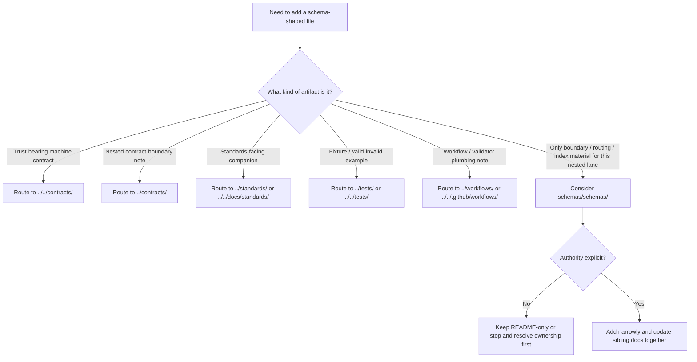

<a id="top"></a>

# schemas/schemas

_Boundary README for the `schemas/schemas/` scaffold so this nested lane stays deliberate, non-canonical, and hard to misuse as a catch-all._

> **Status:** experimental  
> **Doc status:** draft  
> **Owners:** `@bartytime4life` *(current public fallback owner; no narrower `/schemas/` rule was directly verified)*  
>        
> **Repo fit:** path `schemas/schemas/README.md` · parent [`../README.md`](../README.md) · sibling scaffold lanes [`../contracts/README.md`](../contracts/README.md), [`../standards/README.md`](../standards/README.md), [`../tests/README.md`](../tests/README.md), [`../workflows/README.md`](../workflows/README.md) · stronger machine-contract lane [`../../contracts/README.md`](../../contracts/README.md) · standards index [`../../docs/standards/README.md`](../../docs/standards/README.md) · repo-wide tests [`../../tests/README.md`](../../tests/README.md) · workflow execution lane [`../../.github/workflows/README.md`](../../.github/workflows/README.md)  
> **Quick jumps:** [Scope](#scope) · [Repo fit](#repo-fit) · [Accepted inputs](#accepted-inputs) · [Exclusions](#exclusions) · [Directory tree](#directory-tree) · [Quickstart](#quickstart) · [Usage](#usage) · [Diagram](#diagram) · [Tables](#tables) · [Task list](#task-list--definition-of-done) · [FAQ](#faq) · [Appendix](#appendix)

> [!IMPORTANT]
> **CONFIRMED:** the current public `main` view of `schemas/schemas/` shows this directory containing `README.md` only.

> [!WARNING]
> **NEEDS VERIFICATION:** nothing in this path currently proves a mounted schema registry, merge gate, or canonical schema-home decision. Do **not** quietly treat `schemas/schemas/` as the authoritative place for trust-bearing contract families.

> [!NOTE]
> The parent [`../README.md`](../README.md) still carries older inventory wording from before the visible nested `schemas/` scaffold exposed sibling lanes such as `contracts/`, `schemas/`, `standards/`, `tests/`, and `workflows`. Keep parent and child inventory language synchronized when tree-shape prose changes.

## Scope

`schemas/schemas/` is the narrowest — and easiest to misread — directory in the nested `schemas/` scaffold.

The safe reading today is simple: this lane is a **boundary and placement-control surface** first. It exists to prevent ambiguous schema-shaped work from silently turning into a shadow authority surface.

This README therefore does four jobs:

1. records the path-level reality without overstating maturity
2. routes additions toward more specific sibling or repo-wide lanes
3. protects the repo from “parallel schema universe” drift
4. keeps this directory lightweight until a stronger authority decision is written down

### Truth labels used here

| Label | Meaning in this file |
|---|---|
| **CONFIRMED** | Directly visible from the current public repo tree or adjacent README surfaces |
| **INFERRED** | Strongly suggested by adjacent docs and lane boundaries, but not directly declared as law here |
| **PROPOSED** | Safe next-step guidance that fits the current repo shape but is not yet repo-proven |
| **UNKNOWN / NEEDS VERIFICATION** | Not directly supported strongly enough to claim as current repo fact |

[Back to top](#top)

## Repo fit

### What this path is for

Think of `schemas/schemas/` as the place you visit **before** you create a schema-shaped file in the wrong place.

It is useful when a contributor asks one of these questions:

- “Is this actually a contract?”
- “Is this a standards companion instead?”
- “Is this fixture material?”
- “Is this workflow/validation plumbing?”
- “Is this path only documenting boundary logic for now?”

### Upstream and downstream relationships

| Direction | Surface | Relationship |
|---|---|---|
| Upstream | [`../README.md`](../README.md) | Parent lane overview for the nested `schemas/` scaffold |
| Sideways | [`../contracts/README.md`](../contracts/README.md) | Nested contract-adjacent boundary lane |
| Sideways | [`../standards/README.md`](../standards/README.md) | Nested standards/schema guidance lane |
| Sideways | [`../tests/README.md`](../tests/README.md) | Nested fixtures/examples/testing lane |
| Sideways | [`../workflows/README.md`](../workflows/README.md) | Nested workflow-shape guidance lane |
| Stronger repo-wide machine-contract signal | [`../../contracts/README.md`](../../contracts/README.md) | Current stronger place to reason about trust-bearing machine contracts |
| Stronger repo-wide standards signal | [`../../docs/standards/README.md`](../../docs/standards/README.md) | Human-readable standards index; routes API endpoint schemas and machine contracts away from standards prose |
| Stronger repo-wide verification signal | [`../../tests/README.md`](../../tests/README.md) | Repo-wide test surface |
| Workflow execution surface | [`../../.github/workflows/README.md`](../../.github/workflows/README.md) | Public workflow inventory / execution-lane docs |

### Current posture

| Question | Current posture |
|---|---|
| Is this directory real in public `main`? | **CONFIRMED** |
| Does it currently contain more than this README? | **CONFIRMED:** no |
| Is it safe to call this the canonical schema home? | **NO — NEEDS VERIFICATION** |
| Should trust-bearing machine contracts be duplicated here by default? | **NO** |
| Can this directory hold narrow boundary/index material? | **INFERRED:** yes, if it stays explicit and non-authoritative |

[Back to top](#top)

## Accepted inputs

Only put material here when it is specifically about the role of **this nested lane**.

| Accepted input | Status | Notes |
|---|---|---|
| This README | **CONFIRMED** | Current visible content |
| Boundary notes specific to `schemas/schemas/` | **INFERRED** | Must explain placement, not quietly define new law |
| Routing/index notes for schema-shaped artifacts | **INFERRED** | Keep compact; point outward to stronger owning lanes |
| Explicitly marked non-authoritative generated mirrors or indexes | **PROPOSED** | Only after maintainers clearly label the source-of-truth elsewhere and update adjacent docs together |

### Minimum bar for anything added here

A new file in `schemas/schemas/` should meet **all** of these conditions:

1. it cannot be named more accurately as a contract, standards companion, fixture, or workflow support file
2. it explicitly states whether it is authoritative or non-authoritative
3. it links to the stronger owning lane
4. it does not duplicate a trust-bearing family already described elsewhere
5. it does not create ambiguity about validator scope or schema-home authority

## Exclusions

This directory should stay strict.

| Do **not** put this here | Better home | Why |
|---|---|---|
| Canonical trust-bearing machine contracts | [`../../contracts/README.md`](../../contracts/README.md) | Stronger repo-wide contract signal already exists there |
| Nested contract-boundary material | [`../contracts/README.md`](../contracts/README.md) | More specific sibling lane |
| Standards prose or standards-profile docs | [`../../docs/standards/README.md`](../../docs/standards/README.md) | Standards belong in the standards docs lane |
| Standards-adjacent machine notes | [`../standards/README.md`](../standards/README.md) | More specific sibling lane |
| Valid / invalid fixtures and examples | [`../tests/README.md`](../tests/README.md) or [`../../tests/README.md`](../../tests/README.md) | Fixture ownership should stay visible |
| Workflow YAML or merge gates | [`../../.github/workflows/README.md`](../../.github/workflows/README.md) | Public execution lane is separate |
| Policy registries, reason codes, or obligation vocabularies | [`../../policy/README.md`](../../policy/README.md) | Policy should not drift into a generic schema lane |
| Runtime/service implementation | app or package surfaces | This directory is documentation/placement-oriented, not a code lane |
| Scratch “misc schema” drops | _Do not land until ownership is clear_ | Catch-all behavior is exactly what this README is trying to prevent |

> [!CAUTION]
> If you can name the artifact as **contract**, **standards companion**, **fixture**, or **workflow support**, it probably does **not** belong in `schemas/schemas/`.

[Back to top](#top)

## Directory tree

### Current public snapshot

```text
schemas/
├── README.md
├── contracts/
│   ├── README.md
│   ├── v1/
│   └── vocab/
├── schemas/
│   └── README.md
├── standards/
│   └── README.md
├── tests/
│   ├── README.md
│   └── fixtures/
└── workflows/
    └── README.md
```

### Current local target

```text
schemas/schemas/
└── README.md
```

### Conservative future shape

The safest default is to keep this directory README-only until the repo writes down a stronger reason for expansion.

```text
schemas/schemas/
└── README.md
```

If maintainers later decide this lane needs more than a README, treat any growth here as **PROPOSED** until authority, ownership, and validator scope are updated together.

## Quickstart

Before adding anything here, inspect the neighboring lanes first.

```bash
# Read the immediate nested scaffold docs
sed -n '1,220p' schemas/README.md
sed -n '1,220p' schemas/schemas/README.md
sed -n '1,220p' schemas/contracts/README.md
sed -n '1,220p' schemas/standards/README.md
sed -n '1,220p' schemas/tests/README.md
sed -n '1,220p' schemas/workflows/README.md

# Read the stronger repo-wide surfaces
sed -n '1,240p' contracts/README.md
sed -n '1,240p' docs/standards/README.md
sed -n '1,240p' tests/README.md
sed -n '1,240p' .github/workflows/README.md
sed -n '1,240p' policy/README.md

# Inspect current file inventory around this lane
find schemas -maxdepth 4 -type f | sort
find schemas -maxdepth 4 -type d | sort
```

### Fast review questions

Use these before opening a PR:

1. Is the artifact trust-bearing?
2. Is it machine-contract material?
3. Is it fixture or validator support?
4. Is it standards-facing rather than schema-home-facing?
5. Would landing it here make schema authority more ambiguous?

If any answer points outward, route the change outward.

## Usage

### For contributors

Use this directory when your real job is to **clarify placement**.

Do not use it as the default answer to “I made a schema.”

### For maintainers

Keep this lane lean. The value of this README is not volume; it is boundary clarity.

Good changes here usually do one of these:

- tighten wording
- clarify routing
- remove ambiguity
- synchronize tree/inventory language with adjacent docs

### For reviewers

Reject additions that would make this lane silently authoritative.

That includes:

- trust-bearing schema families with no stronger owning surface
- duplicated registries
- hidden fixture homes
- validator references that point here without updating sibling docs
- generic “misc schema” drops that blur ownership

### For future authority changes

If the repo later decides `schemas/schemas/` should hold real artifacts, make that change **deliberately**, not by accretion.

Minimum safe move:

1. write down the decision in the project’s governing docs first
2. mark this lane authoritative or non-authoritative explicitly
3. update parent and sibling README surfaces in the same change
4. update validator and workflow references in the same change
5. make sure the stronger repo-wide contract/standards/test docs still agree

[Back to top](#top)

## Diagram



## Tables

### Current verified signals

| Surface | Current visible state | Why it matters here |
|---|---|---|
| `schemas/schemas/` | README-only | This lane is still a scaffold boundary, not a proven schema registry |
| `schemas/` | Visible nested scaffold with `contracts/`, `schemas/`, `standards/`, `tests/`, `workflows` | Parent/child inventory prose must stay synchronized |
| `schemas/contracts/` | Has `README.md`, `v1/`, `vocab/` | More specific nested lane already exists for contract-adjacent material |
| `schemas/tests/` | Has `README.md` and `fixtures/` | Fixture intent already has a more specific home |
| `schemas/tests/fixtures/contracts/v1/` | `valid/` and `invalid/` subdirs are visible | Even nested fixture routing is already more specific than this lane |
| Top-level `contracts/` | Substantive repo-wide contract README exists | Stronger current machine-contract signal sits outside this nested lane |
| `docs/standards/` | Standards README explicitly routes API endpoint schemas and machine contracts away from standards prose | Avoids conflating standards documentation with schema authority |
| `.github/workflows/` | Public README surface visible; workflow YAML not publicly evidenced in that lane here | Do not imply merge-gate reality from docs alone |

### Placement decision matrix

| Candidate addition | Put it in `schemas/schemas/` now? | Better home | Decision rule |
|---|---|---|---|
| `runtime_response_envelope.schema.json` | **No** | [`../../contracts/README.md`](../../contracts/README.md) | Trust-bearing machine contract |
| `decision_envelope` examples | **No** | [`../tests/README.md`](../tests/README.md) or [`../../tests/README.md`](../../tests/README.md) | Fixtures belong with tests/validation surfaces |
| Standards profile note for STAC / DCAT / PROV fit | **Usually no** | [`../standards/README.md`](../standards/README.md) and [`../../docs/standards/README.md`](../../docs/standards/README.md) | Standards-facing guidance already has a lane |
| Workflow note about schema linting | **No** | [`../workflows/README.md`](../workflows/README.md) or [`../../.github/workflows/README.md`](../../.github/workflows/README.md) | Execution / validation plumbing is not this lane |
| Placement-control note for this nested lane | **Yes** | `schemas/schemas/README.md` | This is the core purpose of the directory |
| Explicitly generated non-authoritative mirror index | **Maybe, later** | Only here if source-of-truth is declared elsewhere | Must stay visibly non-authoritative |

### What “good” looks like here

| Quality check | Pass condition |
|---|---|
| Boundary clarity | A reader can tell why this lane exists in under a minute |
| Authority honesty | No line quietly turns this directory into the canonical schema home |
| Routing clarity | A contributor can tell where a contract, fixture, standards note, or workflow note should go instead |
| Tree honesty | Current public tree shape is described accurately |
| Review friendliness | A reviewer can reject ambiguous additions using this README alone |

[Back to top](#top)

## Task list / Definition of done

- [x] State the path and current lane role clearly
- [x] Record the current public nested tree shape without overstating implementation maturity
- [x] Name upstream, sibling, and stronger repo-wide lanes
- [x] Define accepted inputs for this path
- [x] Define exclusions and where those artifacts go instead
- [x] Include at least one meaningful Mermaid decision diagram
- [x] Include compact tables for routing and review
- [x] Keep schema-home authority unresolved unless repo evidence changes
- [ ] Re-sync parent `schemas/README.md` inventory wording if/when tree-shape prose is revised again
- [ ] Revisit this README if the repo lands a written schema-home decision or real validator/workflow artifacts

## FAQ

### Why does `schemas/schemas/` exist if it is README-only?

Because the nested `schemas/` scaffold already exists, and self-referential paths are easy to misread. A boundary README is the smallest honest way to explain the path without inventing maturity.

### Is `schemas/schemas/` the canonical schema home?

No. This README is intentionally written to avoid claiming that.

### Can I add a real schema file here?

Only if you can explain, in the same change, why it does **not** belong in a more specific sibling lane or the stronger repo-wide contract lane — and why adding it here will not increase schema-authority ambiguity.

### Why not just use this directory for “misc schemas”?

Because “misc” becomes shadow authority surprisingly fast. KFM’s trust posture works better when ownership is explicit.

### What if the parent `schemas/README.md` and this child README drift apart?

Update them together. This child should not silently correct the parent forever.

[Back to top](#top)

## Appendix

<details>
<summary>Open verification items and maintainer shorthand</summary>

### Open verification items

- **UNKNOWN / NEEDS VERIFICATION:** whether this lane should remain README-only after schema-home authority is formally resolved
- **UNKNOWN / NEEDS VERIFICATION:** whether a narrower `/schemas/` ownership rule should be added to `.github/CODEOWNERS`
- **UNKNOWN / NEEDS VERIFICATION:** whether future validators, fixtures, or workflow gates will ever point to this lane directly
- **PROPOSED review rule:** if the first non-README file lands here, require the PR to explain why it does not belong in:
  - `../contracts/`
  - `../standards/`
  - `../tests/`
  - `../workflows/`
  - `../../contracts/`

### Maintainer shorthand

- one authoritative schema home
- one visible fixture story
- one visible validator story
- zero accidental shadow authorities

</details>
