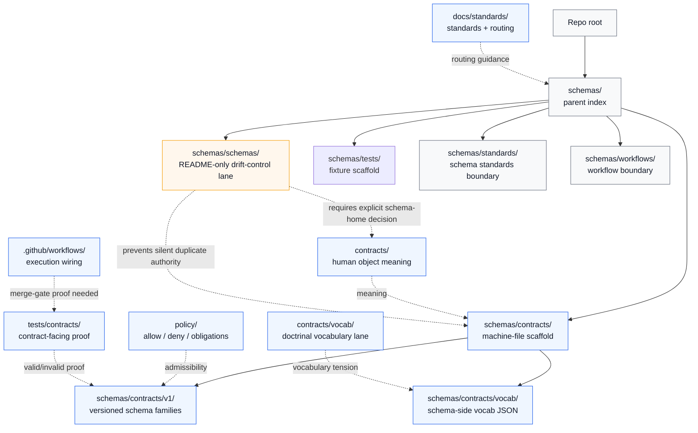

<!-- [KFM_META_BLOCK_V2]
doc_id: kfm://doc/TODO-NEEDS-VERIFICATION
title: schemas/schemas
type: standard
version: v1
status: draft
owners: @bartytime4life
created: TODO-NEEDS-VERIFICATION
updated: 2026-04-23
policy_label: public
related: [../README.md, ../contracts/README.md, ../contracts/v1/README.md, ../contracts/vocab/README.md, ../standards/README.md, ../tests/README.md, ../workflows/README.md, ../../contracts/README.md, ../../contracts/vocab/README.md, ../../docs/standards/README.md, ../../policy/README.md, ../../tests/contracts/README.md, ../../.github/workflows/README.md]
tags: [kfm, schemas, schema-authority, drift-control, contracts, verification]
notes: [doc_id and created date need verification, owner uses current documented public-main fallback pending narrower CODEOWNERS review, this lane is treated as a README-only boundary for schema-shaped drift control unless the active checkout proves otherwise]
[/KFM_META_BLOCK_V2] -->

# `schemas/schemas`

Boundary README for schema-shaped drift control inside KFM’s schema/documentation lattice.

> [!IMPORTANT]
> **Status:** experimental  
> **Doc status:** draft  
> **Owners:** `@bartytime4life` *(documented fallback; narrower `/schemas/` ownership still NEEDS VERIFICATION)*  
> **Path:** `schemas/schemas/README.md`  
> **Repo fit:** child boundary lane under [`../README.md`](../README.md); adjacent to the machine-file scaffold in [`../contracts/`](../contracts/README.md), standards boundary in [`../standards/`](../standards/README.md), fixture scaffold in [`../tests/`](../tests/README.md), and workflow boundary in [`../workflows/`](../workflows/README.md).  
> **Upstream authority signals:** [`../../contracts/`](../../contracts/README.md), [`../../contracts/vocab/`](../../contracts/vocab/README.md), [`../../docs/standards/`](../../docs/standards/README.md), [`../../policy/`](../../policy/README.md), [`../../tests/contracts/`](../../tests/contracts/README.md), and [`../../.github/workflows/`](../../.github/workflows/README.md).  
>
> 
> 
> 
> 
> 
> 
>
> **Quick jumps:** [Scope](#scope) · [Repo fit](#repo-fit) · [Accepted inputs](#accepted-inputs) · [Exclusions](#exclusions) · [Directory tree](#directory-tree) · [Quickstart](#quickstart) · [Usage](#usage) · [Diagram](#diagram) · [Tables](#tables) · [Task list](#task-list--definition-of-done) · [FAQ](#faq) · [Appendix](#appendix)

> [!WARNING]
> This lane must not become a second schema registry by accident. KFM’s current documentation signals a split between human-readable contract meaning, machine-checkable shape, policy admissibility, fixtures, and emitted proof objects. Until an ADR or equivalent decision settles canonical schema-home authority, do not add trust-bearing schema bodies here.

---

## Scope

`schemas/schemas/` is a narrow boundary lane. Its job is to prevent schema-shaped material from drifting into the wrong place.

Use this README to answer questions like:

- “Is this a real JSON Schema, or a note about where schemas belong?”
- “Does this change belong under `schemas/contracts/`, root `contracts/`, `tests/contracts/`, or policy?”
- “Are we creating a new authority surface, or only documenting routing?”
- “Does a proposed schema family have valid fixtures, invalid fixtures, policy adjacency, and validator ownership?”

This path is intentionally conservative. It may describe schema-placement rules, document ambiguity, and route contributors to the correct owner. It should not silently become the home for authoritative schema files.

[Back to top](#schemasschemas)

---

## Repo fit

| Relationship | Path | Role |
|---|---|---|
| Parent | [`../README.md`](../README.md) | Parent schema-lane index and authority warning |
| Machine-file scaffold | [`../contracts/README.md`](../contracts/README.md) | Current schema-side contract/scaffold surface |
| Versioned families | [`../contracts/v1/README.md`](../contracts/v1/README.md) | Versioned machine-contract family index |
| Vocabulary scaffold | [`../contracts/vocab/README.md`](../contracts/vocab/README.md) | Schema-side reason/obligation/reviewer vocabulary surface |
| Standards boundary | [`../standards/README.md`](../standards/README.md) | Standards-shaped companion lane |
| Fixture scaffold | [`../tests/README.md`](../tests/README.md) | Schema-side fixture routing and placeholder surface |
| Workflow boundary | [`../workflows/README.md`](../workflows/README.md) | Workflow-shaped schema boundary lane |
| Human contract signal | [`../../contracts/README.md`](../../contracts/README.md) | Root contract meaning and object-language surface |
| Root vocabulary signal | [`../../contracts/vocab/README.md`](../../contracts/vocab/README.md) | Doctrinal vocabulary lane adjacent to schema-side JSON registries |
| Standards signal | [`../../docs/standards/README.md`](../../docs/standards/README.md) | Cross-cutting standards and contract-routing guidance |
| Policy signal | [`../../policy/README.md`](../../policy/README.md) | Deny-by-default admissibility, obligations, reasons, sensitivity, and release behavior |
| Contract proof signal | [`../../tests/contracts/README.md`](../../tests/contracts/README.md) | Contract-facing validation and negative-path proof |
| Workflow proof signal | [`../../.github/workflows/README.md`](../../.github/workflows/README.md) | CI/workflow intent; merge-gate depth still NEEDS VERIFICATION |

### Working interpretation

The safest reading is:

1. `schemas/README.md` owns the subtree index.
2. `schemas/contracts/` is a real machine-file-bearing scaffold, but that does not automatically settle canonical law.
3. `schemas/schemas/` is README-only drift control unless the active branch proves otherwise.
4. Root `contracts/`, root `contracts/vocab/`, `docs/standards/`, and `tests/contracts/` must be reviewed together before authority claims are changed.
5. New trust-bearing schema families should wait for an explicit schema-home decision, valid/invalid fixtures, validator entry point, and policy adjacency.

[Back to top](#schemasschemas)

---

## Accepted inputs

| Belongs here | Why |
|---|---|
| Boundary guidance for `schemas/schemas/` | This file exists to keep the nested path from becoming a confusing duplicate schema home |
| Schema-home ambiguity notes | This lane can record unresolved placement tension without resolving it by inertia |
| Child/sibling routing notes | Contributors need a clear path when a proposed file is “schema-like” but not actually owned here |
| Migration notes for moving schema-shaped content elsewhere | Useful when files are relocated into the decided canonical home |
| Review checklists for schema-placement decisions | Keeps placement, fixtures, validators, and policy adjacency tied together |
| Links to authoritative homes | This README should make readers leave for the right lane quickly |

### Minimum bar for adding content here

A change belongs in this README only when it:

- explains the role of this boundary lane;
- reduces ambiguity across `schemas/`, `contracts/`, `policy/`, `tests/`, and workflows;
- avoids adding a second machine authority surface;
- preserves KFM’s cite-or-abstain, fail-closed, and proof-object posture;
- keeps relative links accurate from `schemas/schemas/README.md`.

[Back to top](#schemasschemas)

---

## Exclusions

| Do not put here | Better home | Reason |
|---|---|---|
| Authoritative JSON Schema bodies | [`../contracts/v1/`](../contracts/v1/README.md) or the ADR-approved canonical home | This lane is not the schema registry |
| Human semantic contract prose | [`../../contracts/`](../../contracts/README.md) | Contracts explain what objects mean |
| Policy decisions, obligations, deny rules, or sensitivity gates | [`../../policy/`](../../policy/README.md) | Policy decides what the system may do |
| Valid / invalid fixtures | [`../tests/`](../tests/README.md) or [`../../tests/contracts/`](../../tests/contracts/README.md), once fixture-home authority is explicit | Verification should not silently fork |
| Workflow YAML | [`../../.github/workflows/`](../../.github/workflows/README.md) | Workflows execute checks; schema READMEs do not |
| Validator code | `../../tools/validators/` *(verify exact path before linking)* | Validators belong in tooling, not boundary docs |
| Runtime DTOs, handlers, or model adapters | app/package lanes *(NEEDS VERIFICATION)* | Runtime consumers reference schemas; they do not live here |
| Emitted receipts, manifests, proof packs, or release artifacts | `../../data/receipts/`, `../../data/proofs/`, `../../release/` *(verify exact paths)* | Emitted instances prove a run; they are not normative definitions |

> [!CAUTION]
> A file that “looks like a schema” is not automatically a schema-authority file. Check the object meaning, validation home, fixture home, policy adjacency, and release/proof relationship before adding or moving it.

[Back to top](#schemasschemas)

---

## Directory tree

Current intended shape for this lane:

```text
schemas/schemas/
└── README.md
```

Broader context to inspect with it:

```text
schemas/
├── README.md
├── contracts/
│   ├── README.md
│   ├── v1/
│   │   └── README.md
│   └── vocab/
│       └── README.md
├── schemas/
│   └── README.md
├── standards/
│   └── README.md
├── tests/
│   └── README.md
└── workflows/
    └── README.md
```

> [!NOTE]
> The active checkout should be inspected before relying on this tree as complete. The current workspace used to draft this README did not include a mounted repository.

[Back to top](#schemasschemas)

---

## Quickstart

Use this before changing schema-shaped documentation or adding files under the schema subtree.

```bash
# 1. Confirm branch and local state first.
git status --short
git branch --show-current

# 2. Inspect this lane and its parent/siblings together.
find schemas -maxdepth 4 -type f | sort

sed -n '1,240p' schemas/README.md
sed -n '1,240p' schemas/contracts/README.md
sed -n '1,240p' schemas/contracts/v1/README.md
sed -n '1,240p' schemas/contracts/vocab/README.md
sed -n '1,240p' schemas/schemas/README.md
sed -n '1,240p' schemas/standards/README.md
sed -n '1,240p' schemas/tests/README.md
sed -n '1,240p' schemas/workflows/README.md

# 3. Compare root-level authority and proof surfaces.
sed -n '1,240p' contracts/README.md
sed -n '1,240p' contracts/vocab/README.md
sed -n '1,240p' docs/standards/README.md
sed -n '1,240p' policy/README.md
sed -n '1,240p' tests/contracts/README.md
sed -n '1,220p' .github/workflows/README.md
sed -n '1,220p' .github/CODEOWNERS

# 4. Search for authority language before adding new schema-shaped files.
git grep -nE 'schema home|canonical schema|machine contract|fixtures/contracts|reason_codes|obligation_codes|reviewer_roles' -- \
  schemas contracts docs policy tests .github || true
```

### Safe first move

The safe first move is not “add another schema-like file.”

The safe first move is:

1. identify the intended object family;
2. confirm the human contract home;
3. confirm or propose the executable schema home;
4. confirm fixture home;
5. identify validator entry point;
6. identify policy adjacency;
7. update the smallest README set needed to keep routing true.

[Back to top](#schemasschemas)

---

## Usage

### Placement decision routine

```text
Question 1: Is the proposed artifact a machine-checkable schema body?
  Yes -> Route to the canonical schema home, not here.
  No  -> Continue.

Question 2: Is it human-readable meaning for a trust-bearing object?
  Yes -> Route to root contracts or the appropriate domain contract doc.
  No  -> Continue.

Question 3: Is it valid/invalid example evidence?
  Yes -> Route to the canonical fixture or contract-test home.
  No  -> Continue.

Question 4: Is it a policy rule, obligation, reason, or release gate?
  Yes -> Route to policy.
  No  -> Continue.

Question 5: Is it a note about schema placement ambiguity, routing, or drift?
  Yes -> This README may be the right home.
  No  -> Open a placement issue or ADR before adding it.
```

### Schema-shaped drift definition

In this lane, **schema-shaped drift** means any of the following:

- a schema body added under a path that sounds authoritative but is not the chosen home;
- a vocabulary file duplicated between root `contracts/` and schema-side `vocab/`;
- fixtures added near schemas without a contract-facing test strategy;
- validator references that point to multiple homes for the same object family;
- policy-facing fields added without deny/abstain behavior;
- README text that treats scaffold-state files as enforcement proof.

[Back to top](#schemasschemas)

---

## Diagram



Reading rule: this lane exists to slow down misplaced authority. If a change would make `schemas/schemas/` own real schema law, stop and resolve the schema-home decision first.

[Back to top](#schemasschemas)

---

## Tables

### A. Authority split

| Layer | Decides | Does not decide |
|---|---|---|
| `contracts/` | What the object means, including field intent and lifecycle semantics | Whether a particular JSON instance validates |
| `schemas/` | What shape an object must validate as | Release permission or policy obligations |
| `policy/` | What KFM may do with a valid object | Object meaning in full |
| `tests/fixtures/` and `tests/contracts/` | How valid and invalid cases are recognized | Production doctrine by themselves |
| `data/receipts/`, `data/proofs/`, and release artifacts | That a specific instance/run existed | Normative contract or schema definitions |
| `schemas/schemas/` | Boundary guidance and drift-control notes | Canonical schema law |

### B. Change routing matrix

| Candidate change | Put it here? | Preferred handling |
|---|---:|---|
| Update this README’s routing guidance | Yes | Keep links relative and verify sibling docs |
| Add a new JSON Schema file | No | Use `../contracts/v1/` or the ADR-approved schema home |
| Add a new schema-family README | Usually no | Put it in the specific family lane |
| Add vocabulary values | No | Use one explicit vocabulary authority; do not duplicate silently |
| Add examples | No | Use the canonical fixture or contract-test home |
| Add a validator command | No | Document here only as a link after the validator exists |
| Resolve schema-home ambiguity | Not alone | Use an ADR or equivalent decision, then update this README |
| Describe current uncertainty | Yes | Use `UNKNOWN` or `NEEDS VERIFICATION` plainly |

### C. Review labels

| Label | Use in this README |
|---|---|
| `CONFIRMED` | Directly verified in the active checkout or supplied current documentation |
| `INFERRED` | Strongly implied by adjacent docs but not directly proven in this lane |
| `PROPOSED` | A safe design direction or next change |
| `UNKNOWN` | Not verifiable from this lane or current checkout |
| `NEEDS VERIFICATION` | Must be checked before implementation or release |
| `CONFLICTED` | Adjacent sources imply incompatible placement or authority |

[Back to top](#schemasschemas)

---

## Task list / Definition of done

### Current lane checks

- [ ] Confirm `schemas/schemas/` is README-only in the active branch.
- [ ] Confirm the parent `schemas/README.md` no longer describes stale subtree inventory.
- [ ] Confirm `schemas/contracts/`, `schemas/contracts/v1/`, and `schemas/contracts/vocab/` are linked accurately from this README.
- [ ] Confirm whether root `contracts/` and schema-side `schemas/contracts/` have a documented authority relationship.
- [ ] Confirm whether root `contracts/vocab/` and schema-side `schemas/contracts/vocab/` have a documented vocabulary relationship.
- [ ] Confirm fixture-home authority between `schemas/tests/` and root `tests/contracts/`.
- [ ] Confirm validator entry points and workflow wiring before claiming merge-gate enforcement.
- [ ] Confirm `.github/CODEOWNERS` ownership for `/schemas/` and this nested lane.

### Change gate for adding new schema-shaped material

- [ ] Human contract home identified.
- [ ] Executable schema home identified.
- [ ] Valid fixture path identified.
- [ ] Invalid fixture path identified.
- [ ] Validator command or test entry point identified.
- [ ] Policy adjacency identified.
- [ ] Emitted artifact location identified when relevant.
- [ ] Parent and sibling READMEs updated together.
- [ ] Ambiguity labeled `UNKNOWN`, `NEEDS VERIFICATION`, or `CONFLICTED` rather than smoothed over.

[Back to top](#schemasschemas)

---

## FAQ

### Why does `schemas/schemas/` exist?

It is a narrow boundary lane for schema-shaped drift control. Its name is easy to misread as “the place schemas go.” This README makes the opposite point: do not treat the nested path as authority without an explicit decision.

### Is this the canonical schema home?

No. This README does not settle canonical schema-home authority. It points to the active tension and routes contributors to the parent schema index, schema-side contract scaffold, root contract docs, policy, fixtures, and workflow proof surfaces.

### Should real `*.schema.json` files be added here?

No, not by default. Add machine-checkable schemas only to the decided canonical schema home. If that home is still unsettled, resolve the decision first.

### What should happen if a branch already has files here?

Do not delete or move them blindly. Inventory them, classify each as contract, schema, fixture, policy, workflow, or emitted artifact, then migrate through an ADR-backed compatibility note.

### Why so much caution?

KFM’s trust model depends on visible authority boundaries. A path name should not decide what counts as truth, policy, validation, or release evidence.

[Back to top](#schemasschemas)

---

## Appendix

<details>
<summary><strong>Sync checklist for schema-adjacent docs</strong></summary>

Review these together when this README changes:

- [`../README.md`](../README.md)
- [`../contracts/README.md`](../contracts/README.md)
- [`../contracts/v1/README.md`](../contracts/v1/README.md)
- [`../contracts/vocab/README.md`](../contracts/vocab/README.md)
- [`../standards/README.md`](../standards/README.md)
- [`../tests/README.md`](../tests/README.md)
- [`../workflows/README.md`](../workflows/README.md)
- [`../../contracts/README.md`](../../contracts/README.md)
- [`../../contracts/vocab/README.md`](../../contracts/vocab/README.md)
- [`../../docs/standards/README.md`](../../docs/standards/README.md)
- [`../../policy/README.md`](../../policy/README.md)
- [`../../tests/contracts/README.md`](../../tests/contracts/README.md)
- [`../../.github/workflows/README.md`](../../.github/workflows/README.md)
- [`../../.github/CODEOWNERS`](../../.github/CODEOWNERS)

</details>

<details>
<summary><strong>Contradiction watchlist</strong></summary>

Keep these visible until a later authority pass resolves them:

1. `schemas/contracts/` may be machine-file-bearing without being the final canonical schema home.
2. Root `contracts/` may define human object meaning while schema-side files define validation shape.
3. Root `contracts/vocab/` and schema-side `schemas/contracts/vocab/` need a documented relationship before either becomes vocabulary law.
4. `schemas/tests/` and `tests/contracts/` need a single fixture/proof strategy.
5. Workflow READMEs do not prove merge-gate enforcement; checked-in workflow YAML and run results are needed.
6. Placeholder or scaffold-state schema bodies must not be cited as validator readiness.

</details>

<details>
<summary><strong>Maintainer shorthand</strong></summary>

One parent index.  
One explicit schema home.  
One vocabulary story.  
One fixture strategy.  
One validator path.  
No authority by folder-name inertia.

</details>