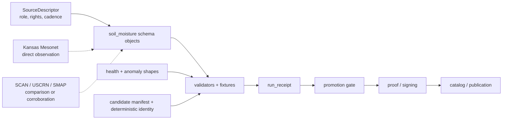

<!-- [KFM_META_BLOCK_V2]
doc_id: kfm://doc/NEEDS-VERIFICATION
title: soil_moisture
type: standard
version: v1
status: draft
owners: NEEDS-VERIFICATION
created: YYYY-MM-DD
updated: 2026-04-15
policy_label: NEEDS-VERIFICATION
related: [
  ../README.md,
  ../contracts/README.md,
  ../contracts/v1/README.md,
  ../tests/README.md,
  ../../contracts/README.md,
  ../../contracts/soil_moisture/reading.schema.json,
  ../../contracts/source/kansas_mesonet_source_descriptor.md,
  ../../tools/validators/soil_moisture/README.md,
  ../../tools/validators/promotion_gate/README.md,
  ../../tests/README.md,
  ../../policy/README.md,
  ../../.github/workflows/README.md
]
tags: [kfm, schemas, soil-moisture, mesonet, hydrology, spec_hash, run_receipt]
notes: [
  Built from attached KFM doctrine plus recent repo-facing README material, source-descriptor work, validator work, fixture work, and the prior soil-moisture schema draft supplied in-session.
  Exact mounted leaf inventory, owner assignment, consumer list, and canonical schema-home authority remain NEEDS VERIFICATION.
  This revision preserves the stronger existing schema-lane doctrine while making the contracts-versus-schemas boundary, object-family split, and downstream validator/promotion compatibility more explicit.
]
[/KFM_META_BLOCK_V2] -->

<a id="top"></a>

# `soil_moisture`

Schema-side landing page for KFM soil-moisture object shapes, semantics, and validation boundaries.

> [!IMPORTANT]
> **Status:** experimental  
> **Owners:** `NEEDS VERIFICATION`  
> **Path:** `schemas/soil_moisture/README.md`  
>        
> **Quick jumps:** [Scope](#scope) · [Repo fit](#repo-fit) · [Accepted inputs](#accepted-inputs) · [Exclusions](#exclusions) · [Directory tree](#directory-tree) · [Quickstart](#quickstart) · [Usage](#usage) · [Diagram](#diagram) · [Object families](#object-family-matrix) · [Task list](#task-list--definition-of-done) · [FAQ](#faq) · [Appendix](#appendix)

> [!NOTE]
> This README documents a **schema lane**, not mounted implementation proof.  
> The current session surfaced KFM doctrine, repo-facing README material, source-descriptor work, validator and fixture contracts, and adjacent schema / contract / test boundaries. It did **not** directly surface a checked-out `schemas/soil_moisture/` subtree, active consumers, or merge-blocking workflow enforcement.

> [!WARNING]
> Do not let this leaf quietly settle the repo’s still-visible `contracts/` versus `schemas/` authority tension.  
> Its job is to make soil-moisture object shapes reviewable and machine-checkable, not to invent a second sovereign truth surface.

---

## Scope

`schemas/soil_moisture/` is the schema-side lane for **soil-moisture-specific object shapes** and their smallest supporting notes.

This lane exists because soil moisture is easy to flatten incorrectly. A generic “sensor data” object is not enough when the burden includes:

- **depth identity**
- **measurement kind** such as `VWC` versus `percent_saturation`
- **observation time** versus **fetch / normalization / promotion time**
- **provider preliminary / QC posture**
- **direct observation** versus **derived health or anomaly state**
- **deterministic identity** and downstream replay burden
- **receipt-bearing handoff** without collapsing schema into execution memory

This leaf should help KFM keep those distinctions explicit **before** data becomes validator results, receipts, proofs, or catalogs.

### Truth labels used in this README

| Label | Meaning here |
| --- | --- |
| **CONFIRMED** | Supported by surfaced KFM doctrine or repo-facing README material in this session |
| **INFERRED** | Conservative reading that fits adjacent materials but is not directly proven as mounted leaf reality |
| **PROPOSED** | Recommended target shape consistent with current doctrine |
| **UNKNOWN** | Not surfaced strongly enough to describe as current repo fact |
| **NEEDS VERIFICATION** | Path, ownership, file inventory, consumer, or enforcement detail that should be rechecked against the active branch before merge |

[Back to top](#top)

---

## Repo fit

This path was explicit in the request, but the current session did **not** directly surface an existing mounted subtree here. Treat this README as a truthful draft or revision target for that path, not as proof that sibling schema files already exist.

### Current evidence posture

| Surface | Status | Why it matters |
| --- | --- | --- |
| `schemas/` as a real parent subtree | **CONFIRMED** | This leaf should read like a child schema lane, not like an isolated note. |
| `schemas/contracts/` and `schemas/contracts/v1/` as visible adjacent schema families | **CONFIRMED** | Soil-moisture schema language should stay legible beside first-wave machine-contract families. |
| `schemas/tests/` as a visible schema-side fixture scaffold | **CONFIRMED** | This lane can reference schema-side pressure without silently absorbing test authority. |
| Exact `schemas/soil_moisture/` leaf inventory | **NEEDS VERIFICATION** | This README must not pretend to know mounted sibling files. |
| Kansas Mesonet as a viable but constrained soil-moisture source role | **CONFIRMED** | Source semantics and usage posture affect schema choices. |
| Soil-moisture object families for observation / series / health / anomaly / validator result | **PROPOSED** | Strongly pressured by doctrine, but not directly surfaced here as mounted files. |

### Adjacent surfaces that matter

| Direction | Surface | Relationship |
| --- | --- | --- |
| Parent | [`../README.md`](../README.md) | Parent schema boundary and subtree context |
| Adjacent | [`../contracts/README.md`](../contracts/README.md) | Schema-side contract scaffold lane |
| Adjacent | [`../contracts/v1/README.md`](../contracts/v1/README.md) | Visible first-wave machine-contract family split |
| Adjacent | [`../tests/README.md`](../tests/README.md) | Schema-side fixture scaffold that should remain distinct from repo-wide governed verification |
| Downstream authority | [`../../contracts/README.md`](../../contracts/README.md) | Human-readable contract meaning still leans here more strongly than anywhere else |
| Canonical row contract | [`../../contracts/soil_moisture/reading.schema.json`](../../contracts/soil_moisture/reading.schema.json) | Current first-wave contract companion for canonical rows |
| Source admission | [`../../contracts/source/kansas_mesonet_source_descriptor.md`](../../contracts/source/kansas_mesonet_source_descriptor.md) | Source-role, cadence, rights, and automation posture pressure the schema family |
| Downstream validator | [`../../tools/validators/soil_moisture/README.md`](../../tools/validators/soil_moisture/README.md) | This lane should make validator burdens explicit rather than implicit |
| Downstream promotion | [`../../tools/validators/promotion_gate/README.md`](../../tools/validators/promotion_gate/README.md) | Downstream promotion depends on deterministic identity and clear object boundaries |
| Downstream verification | [`../../tests/README.md`](../../tests/README.md) | Governed proof surface that should pressure-test these shapes |
| Workflow boundary | [`../../.github/workflows/README.md`](../../.github/workflows/README.md) | Automation intent belongs there, not in schema prose |

> [!TIP]
> Keep the split visible: **shape and vocabulary here, human-readable contract meaning nearby, verification downstream, publication later**.

[Back to top](#top)

---

## Accepted inputs

This lane should hold **schema-facing**, **reviewable**, and **narrowly scoped** materials.

### Typical accepted inputs

| Input class | Examples | Why it belongs here | Status |
| --- | --- | --- | --- |
| Soil-moisture JSON Schema drafts | point observation, ordered series, health-state, anomaly-summary, validator-result shapes | Makes domain-specific structure machine-checkable | **PROPOSED file form** |
| Field registries / enum notes | `measurement_kind`, `unit`, `depth_cm`, `qc_state`, `source_family` | Prevents silent semantics drift | **INFERRED / PROPOSED** |
| Small illustrative payload fragments | one station / one depth / one timestamp examples | Helps reviewers see intended shape without implying mounted fixtures | **PROPOSED** |
| Schema notes tied to source posture | direct observation, preliminary data, constrained automation, comparison-source labeling | Keeps source-role consequences visible at the shape level | **CONFIRMED doctrine / PROPOSED local expression** |
| Version notes | breaking / non-breaking schema commentary | Reduces silent envelope drift | **PROPOSED** |
| Compatibility notes | validator, fixture, `spec_hash`, and `run_receipt` compatibility notes | Keeps downstream seams explicit without moving authority out of contracts / policy | **INFERRED / PROPOSED** |

### What belongs here

- soil-moisture object shapes
- field-level semantic notes
- explicit depth / unit / time-basis rules
- derived-versus-observed distinctions
- tiny illustrative examples when clearly labeled
- compatibility notes that help tests and validators pressure the right things

> [!NOTE]
> A good schema leaf here should make it harder to flatten **Kansas Mesonet**, **SCAN**, **USCRN**, or **SMAP** into one implied truth class.

[Back to top](#top)

---

## Exclusions

| Does **not** belong here | Put it here instead | Why |
| --- | --- | --- |
| Human-readable contract law | [`../../contracts/README.md`](../../contracts/README.md) | This leaf should support contract meaning, not replace it. |
| Policy bundles, reason registries, or decision logic | [`../../policy/README.md`](../../policy/README.md) | Policy remains the source of truth for allow / deny behavior. |
| Repo-wide governed verification guidance | [`../../tests/README.md`](../../tests/README.md) | Tests pressure schema law; they do not originate here. |
| Raw provider snapshots or long-lived mirrors | governed fixture or data lanes | This path is for shapes, not archives. |
| `run_receipt`, proof bundles, signatures, or rollback records as primary objects | receipt / proof / release lanes | Schema meaning must not collapse machine memory, proof, and publication into one file. |
| Live watcher / pipeline code | watcher / tool / pipeline lanes | This README is not implementation proof. |
| Secrets, API credentials, or consent-sensitive automation helpers | secret manager / host configuration | Sensitive operational material must not land in a schema leaf. |
| Prose that quietly settles `contracts/` versus `schemas/` authority | repo-wide contract/schema decision | This leaf should stay truthful about the unresolved seam. |

> [!WARNING]
> Do not treat a well-written schema README as evidence that scheduling, signing, promotion, or catalog closure already exist on the active branch.

[Back to top](#top)

---

## Directory tree

### Current safe claim

```text
schemas/
└── soil_moisture/
    └── README.md
```

That is the only subtree claim this README can make safely without direct branch inspection.

### Preferred growth shape (`PROPOSED` / `NEEDS VERIFICATION`)

```text
schemas/
└── soil_moisture/
    ├── README.md
    ├── station_observation.schema.json
    ├── station_series.schema.json
    ├── station_health.schema.json
    ├── anomaly_summary.schema.json
    ├── validator_result.schema.json
    └── candidate_manifest.schema.json
```

> [!TIP]
> Add only the files the active branch can actually support. A smaller truthful subtree is better than a broad speculative one.

[Back to top](#top)

---

## Quickstart

Use inspection-first commands so this leaf stays honest as the branch evolves.

### 1) Confirm what is actually mounted

```bash
find schemas -maxdepth 4 -print 2>/dev/null | sort
find schemas/soil_moisture -maxdepth 4 -print 2>/dev/null | sort
```

### 2) Re-read the adjacent authority surfaces

```bash
sed -n '1,220p' schemas/README.md 2>/dev/null || true
sed -n '1,240p' schemas/contracts/README.md 2>/dev/null || true
sed -n '1,240p' schemas/contracts/v1/README.md 2>/dev/null || true
sed -n '1,220p' schemas/tests/README.md 2>/dev/null || true
sed -n '1,240p' contracts/README.md 2>/dev/null || true
sed -n '1,220p' contracts/soil_moisture/reading.schema.json 2>/dev/null || true
sed -n '1,220p' contracts/source/kansas_mesonet_source_descriptor.md 2>/dev/null || true
sed -n '1,220p' tools/validators/soil_moisture/README.md 2>/dev/null || true
sed -n '1,220p' tools/validators/promotion_gate/README.md 2>/dev/null || true
sed -n '1,220p' policy/README.md 2>/dev/null || true
sed -n '1,220p' tests/README.md 2>/dev/null || true
sed -n '1,220p' .github/workflows/README.md 2>/dev/null || true
```

### 3) Reconfirm soil-moisture vocabulary before adding new shapes

```bash
grep -RIn \
  -e 'Kansas Mesonet' \
  -e 'soil moisture' \
  -e 'VWC' \
  -e 'percent saturation' \
  -e 'spec_hash' \
  -e 'schema_ver' \
  -e 'run_receipt' \
  -e 'SourceDescriptor' \
  schemas contracts policy tests docs tools pipelines 2>/dev/null || true
```

### 4) Add the smallest useful schema first

Start with one narrow shape before widening the family:

1. one **point observation** shape
2. one **ordered series** shape
3. one **health or anomaly** shape only after the point / series semantics are stable
4. one **validator-result** or **candidate-manifest** shape only after the execution seam is clear
5. one passing example and one failing example before claiming schema readiness

### 5) Document the real consumer only after it exists

If this leaf gains validators, fixtures, or downstream consumers, document the **actual** checked-in path and invocation. Do not leave guessed runner or workflow commands behind.

[Back to top](#top)

---

## Usage

### Why this lane should exist at all

KFM’s current doctrine treats hydrology as a strong first proof lane and treats Kansas Mesonet as a valuable but constrained Kansas-first station context source inside that work.

That means a soil-moisture schema leaf should help preserve all of the following:

- **direct observation / measurement** as a visible source role
- soil-moisture semantics as something more specific than generic telemetry
- depth-specific meaning
- measurement-kind meaning
- time semantics
- preliminary / QC-change posture
- reviewable separation between observation objects and derived anomaly or health objects
- deterministic identity pressure for downstream replay and promotion review

### Working rules

1. Keep **Kansas Mesonet** explicit when it is the source family.
2. Keep **comparison or corroboration families** such as **SCAN**, **USCRN**, or **SMAP** explicit when they appear.
3. Do not silently mix **VWC** and **percent saturation**.
4. Do not silently mix **5 cm**, **10 cm**, **20 cm**, and **50 cm** values.
5. Do not let **health** or **anomaly** objects masquerade as raw observations.
6. Keep **observation time**, **fetch time**, **normalization time**, and **promotion time** distinct.
7. Preserve the split **schema ≠ receipt ≠ proof ≠ catalog**.
8. Keep `schema_ver` explicit where contract evolution matters.
9. Make `spec_hash` compatibility visible where an object participates in deterministic candidate identity.

### Illustrative minimal payload

> [!NOTE]
> The shape below is illustrative only.  
> It is here to make the semantic burden concrete without pretending the final key names or mounted schema family are already verified.

```json
{
  "source_family": "kansas_mesonet",
  "source_role": "direct_observation_measurement",
  "station_id": "MANH",
  "observed_at": "2026-04-13T12:00:00Z",
  "fetch_time": "2026-04-13T12:05:00Z",
  "interval": "hour",
  "depth_cm": 5,
  "measurement_kind": "vwc",
  "value": 0.214,
  "unit": "m3/m3",
  "preliminary": true,
  "qc_state": "provider_preliminary",
  "schema_ver": 1,
  "derived": false
}
```

### Receipt / proof / catalog boundary

| Surface | What it is | What it is not |
| --- | --- | --- |
| Schema object | Shape and semantic law for a domain object | Not the record that a run succeeded |
| `run_receipt` | Compact machine-readable process memory | Not the release-grade proof bundle |
| Proof / attestation bundle | Verifiable trust object for release-significant material | Not the schema leaf itself |
| Catalog object | Discoverability and outward linkage surface | Not the source-admission or validation state |

[Back to top](#top)

---

## Diagram



> [!TIP]
> This lane should stop at **shape clarity**.  
> Validation, receipts, promotion, proofs, and catalogs may consume these objects, but they should remain separate surfaces with separate burdens.

[Back to top](#top)

---

## Object family matrix

### Schema family starter matrix

| Proposed schema | Intended object | Why it should stay separate | Status |
| --- | --- | --- | --- |
| `station_observation.schema.json` | one station × one time × one depth × one measurement | Prevents series, health, and anomaly semantics from leaking into the raw observation shape | **PROPOSED** |
| `station_series.schema.json` | ordered set of observations for one station / depth / window | Series guarantees differ from point observations and should carry ordering / time-window burden explicitly | **PROPOSED** |
| `station_health.schema.json` | freshness / degradation / roster-health state | Health is operational state, not observation truth | **PROPOSED** |
| `anomaly_summary.schema.json` | reviewable anomaly flags or summaries | Anomaly labels are derived and should not masquerade as raw measured values | **PROPOSED** |
| `validator_result.schema.json` | subject-level validation outcome | Keeps validation output distinct from promotion decisions and receipts | **PROPOSED** |
| `candidate_manifest.schema.json` | canonical batch-level candidate object | Makes deterministic identity and downstream handoff pressure explicit | **PROPOSED** |

### Soil-moisture semantics that must stay machine-visible

| Semantic item | Keep explicit | Why |
| --- | --- | --- |
| `source_family` | `kansas_mesonet`, `scan`, `uscrn`, `smap`, or another declared source family | Prevents “all soil moisture is the same thing” drift |
| `source_role` | direct observation / measurement versus derived / modeled / summary | Preserves knowledge character |
| `station_id` | required when a station-backed record is claimed | Keeps point identity reviewable |
| `observed_at` | required on observation and series members | Observation time is not the same as fetch or release time |
| `fetch_time` / `normalized_at` / `released_at` | separate fields or clearly separate surrounding objects | Prevents clock collapse |
| `interval` / cadence | required when a window or regular feed is implied | Supports freshness, health, and anomaly logic |
| `depth_cm` | required for station observations | Soil-moisture values are not interchangeable across depths |
| `measurement_kind` | keep `vwc` and `percent_saturation` distinct | Similar-looking values can carry different meanings |
| `unit` | always explicit | Avoids silent unit drift |
| `preliminary` / `qc_state` | explicit when provider posture is mutable | Prevents false finality |
| `schema_ver` | explicit where contract evolution matters | Keeps version drift reviewable |
| `derived` / `derived_from` | explicit on health / anomaly or aggregated objects | Derived state should not masquerade as direct observation |
| `spec_hash` compatibility | explicit where candidate identity depends on the object | Supports replay and promotion review without guessing |

### Source-role distinctions to preserve

| Source or class | Keep visible as | Do **not** silently turn it into |
| --- | --- | --- |
| **Kansas Mesonet** | Kansas-first direct observation / measurement source family | regulatory truth or sovereign publication state |
| **SCAN** | corroborative in-situ federal station family | implicit replacement for Mesonet |
| **USCRN** | higher-control comparison family | generic catch-all “ground truth” without labeling |
| **SMAP** | remote-sensing context | station-equivalent observation without qualification |
| Health / anomaly outputs | derived interpretive objects | raw observation objects |
| Validator result | subject-level review outcome | promotion decision or proof object |

[Back to top](#top)

---

## Task list / Definition of done

Treat this README as healthy only when the lane stays both readable and truthful.

- [ ] Verify whether `schemas/soil_moisture/` already exists on the active branch or is being created intentionally.
- [ ] Replace meta-block placeholders with repo-backed values.
- [ ] Confirm owner coverage for this leaf instead of borrowing from another subtree.
- [ ] Add one narrow schema before widening the family.
- [ ] Add one passing example and one failing example before claiming schema readiness.
- [ ] Keep **Kansas Mesonet** explicit wherever it drives the shape.
- [ ] Keep **VWC** and **percent saturation** distinct.
- [ ] Keep `schema_ver` explicit where relevant.
- [ ] Keep `run_receipt`, proof, and catalog boundaries explicit.
- [ ] Do not imply active scheduler, workflow, signing, or promotion enforcement unless the branch proves it.
- [ ] Revisit this README whenever adjacent schema-home or contract-home authority changes materially.

[Back to top](#top)

---

## FAQ

### Why not fold this into a generic sensor schema?

Because soil moisture carries domain-specific burdens that generic telemetry often hides: depth, measurement kind, unit, time basis, provider preliminary posture, deterministic identity pressure, and derived-versus-observed distinction.

### Is Kansas Mesonet the only source this lane should ever support?

No. It is the strongest currently surfaced Kansas-first source role for local soil-moisture context. Comparison families such as **SCAN**, **USCRN**, or **SMAP** can belong here too, but only when their roles stay visibly explicit.

### Should percent saturation be the canonical metric?

Not by default in this README. The current lane pressure most strongly favors keeping **VWC** explicit and treating **percent saturation** as distinct rather than silently interchangeable.

### Does this README prove active automation, validation, or publication?

No. It documents shape and semantic intent. Active consumers, validators, workflows, and enforcement posture remain separate proof burdens.

### Does this settle whether `contracts/` or `schemas/` is the final canonical home?

No. The current surfaced material still shows a live tension between human-readable contract law and schema-side machine-file scaffolds. This leaf should stay honest about that.

[Back to top](#top)

---

## Appendix

<details>
<summary><strong>Appendix A — Candidate field register</strong></summary>

A conservative starter register for first-wave soil-moisture shapes:

| Field | Intended burden | Status |
| --- | --- | --- |
| `source_family` | provider / source class identity | **INFERRED / PROPOSED** |
| `source_role` | direct observation / measurement versus derived / model | **CONFIRMED doctrine / PROPOSED field** |
| `station_id` | station identity | **INFERRED / PROPOSED** |
| `observed_at` | observation timestamp | **INFERRED / PROPOSED** |
| `fetch_time` | acquisition timestamp | **INFERRED / PROPOSED** |
| `interval` | cadence or window identity | **CONFIRMED burden / PROPOSED field** |
| `depth_cm` | depth semantics | **CONFIRMED burden / PROPOSED field** |
| `measurement_kind` | `vwc`, `percent_saturation`, or other explicit class | **CONFIRMED burden / PROPOSED field** |
| `value` | measured or derived numeric value | **INFERRED / PROPOSED** |
| `unit` | unit semantics | **INFERRED / PROPOSED** |
| `preliminary` | provider mutability flag | **INFERRED / PROPOSED** |
| `qc_state` | provider or local QC posture | **INFERRED / PROPOSED** |
| `schema_ver` | contract-version visibility | **INFERRED / PROPOSED** |
| `derived` | raw versus derived distinction | **INFERRED / PROPOSED** |
| `derived_from` | lineage pointer for derived objects | **INFERRED / PROPOSED** |

</details>

<details>
<summary><strong>Appendix B — Open verification items</strong></summary>

The following remain open until direct branch inspection is surfaced:

- exact leaf inventory under `schemas/soil_moisture/`
- exact owner assignment
- exact `doc_id`
- created / updated document-record dates
- whether active consumers already expect a soil-moisture schema at this path
- whether the branch uses `contracts/` or `schemas/` as the stronger machine-contract home for this subject
- whether adjacent fixtures already exist under `tests/`
- whether any checked-in validators, contracts, or workflows already reference this lane

</details>
