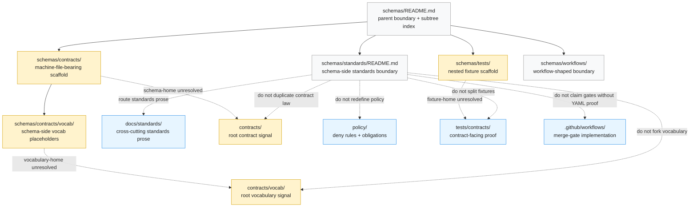

<!-- [KFM_META_BLOCK_V2]
doc_id: kfm://doc/NEEDS_VERIFICATION__schemas_standards_readme
title: standards
type: standard
version: v1
status: draft
owners: @bartytime4life
created: NEEDS_VERIFICATION__YYYY-MM-DD
updated: 2026-04-23
policy_label: public
related: [../../README.md, ../README.md, ../contracts/README.md, ../contracts/v1/README.md, ../contracts/vocab/README.md, ../schemas/README.md, ../tests/README.md, ../workflows/README.md, ../../contracts/README.md, ../../contracts/vocab/README.md, ../../docs/standards/README.md, ../../policy/README.md, ../../tests/README.md, ../../tests/contracts/README.md, ../../.github/workflows/README.md, ../../.github/CODEOWNERS]
tags: [kfm, schemas, standards, contracts, schema-home, governance]
notes: [doc_id and created date need active-branch verification; owners follow surfaced repo-facing KFM README patterns and CODEOWNERS-backed references; policy_label follows public documentation-lane precedent but should be rechecked before merge; this lane is documented as a README-only schema companion boundary, not a proven machine-contract authority; canonical schema-home and fixture-home remain unresolved]
[/KFM_META_BLOCK_V2] -->

<a id="top"></a>

# standards

Standards-shaped schema companion boundary for KFM schema placement, profile routing, and anti-drift review.

> [!IMPORTANT]
> **Status:** experimental  
> **Doc state:** draft  
> **Owners:** `@bartytime4life` *(surface-level owner signal; narrower `/schemas/standards/` ownership still needs active-branch verification)*  
> **Path:** `schemas/standards/README.md`  
> **Repo fit:** child boundary lane of [`../README.md`](../README.md); sibling to [`../contracts/README.md`](../contracts/README.md), [`../schemas/README.md`](../schemas/README.md), [`../tests/README.md`](../tests/README.md), and [`../workflows/README.md`](../workflows/README.md); cross-root standards and authority neighbors at [`../../docs/standards/README.md`](../../docs/standards/README.md), [`../../contracts/README.md`](../../contracts/README.md), [`../../contracts/vocab/README.md`](../../contracts/vocab/README.md), [`../../policy/README.md`](../../policy/README.md), and [`../../tests/contracts/README.md`](../../tests/contracts/README.md).  
> **Quick jumps:** [Scope](#scope) · [Repo fit](#repo-fit) · [Inputs](#inputs) · [Exclusions](#exclusions) · [Directory tree](#directory-tree) · [Quickstart](#quickstart) · [Usage](#usage) · [Diagram](#diagram) · [Tables](#tables) · [Definition of done](#definition-of-done) · [FAQ](#faq) · [Appendix](#appendix)


> [!WARNING]
> Do **not** treat this directory as the canonical home for machine-readable schemas, vocabularies, policy rules, fixtures, or standards prose by inertia. Its current burden is to keep the schema-side standards boundary legible while KFM resolves the split between `schemas/contracts/`, root `contracts/`, root `contracts/vocab/`, `docs/standards/`, and `tests/contracts/`.

---

## Scope

`schemas/standards/` is the schema-side standards companion lane.

It exists to explain how schema-facing standards, profiles, contract families, and validation expectations should be read **from inside the `schemas/` subtree** without turning this README-only lane into a second source of truth.

Use this directory for routing, placement warnings, schema-standard touchpoints, and review prompts that help contributors answer:

- Which standard or profile affects this schema family?
- Is this a schema body, a vocabulary value, a policy rule, a test fixture, or standards prose?
- Which neighboring lane owns the executable artifact?
- Has canonical schema-home authority been decided, or is the change still blocked by `NEEDS VERIFICATION`?

### Truth posture used here

| Marker | Meaning in this README |
|---|---|
| **CONFIRMED** | Directly supported by surfaced repo-facing KFM Markdown or attached KFM doctrine |
| **INFERRED** | Conservative reading of the documented tree shape and adjacent lane roles |
| **PROPOSED** | Safe routing or review guidance not yet verified as settled repo law |
| **UNKNOWN / NEEDS VERIFICATION** | Active-branch, ownership, workflow, validator, branch-protection, or authority detail not proven here |

[Back to top](#top)

---

## Repo fit

| Item | Value |
|---|---|
| Path | `schemas/standards/README.md` |
| Local role | README-only boundary lane for schema-facing standards routing |
| Parent | [`../README.md`](../README.md) |
| Closest machine-file-bearing sibling | [`../contracts/README.md`](../contracts/README.md) |
| Closest schema drift-control sibling | [`../schemas/README.md`](../schemas/README.md) |
| Closest nested fixture sibling | [`../tests/README.md`](../tests/README.md) |
| Closest workflow boundary sibling | [`../workflows/README.md`](../workflows/README.md) |
| Cross-root standards prose | [`../../docs/standards/README.md`](../../docs/standards/README.md) |
| Cross-root contract authority signal | [`../../contracts/README.md`](../../contracts/README.md) |
| Cross-root vocabulary signal | [`../../contracts/vocab/README.md`](../../contracts/vocab/README.md) |
| Contract-facing verification signal | [`../../tests/contracts/README.md`](../../tests/contracts/README.md) |
| Policy authority neighbor | [`../../policy/README.md`](../../policy/README.md) |
| Workflow enforcement neighbor | [`../../.github/workflows/README.md`](../../.github/workflows/README.md) |
| Ownership neighbor | [`../../.github/CODEOWNERS`](../../.github/CODEOWNERS) |
| Authority posture | **UNKNOWN / NEEDS VERIFICATION** — this lane clarifies placement; it does not decide canonical schema law |

### Current evidence snapshot

| Finding | Truth label | Reading rule |
|---|---:|---|
| `schemas/` is documented as a real nested subtree with `contracts/`, `schemas/`, `standards/`, `tests/`, `workflows/`, and `README.md` | CONFIRMED from surfaced repo-facing Markdown | Treat this file as a child boundary, not as an isolated page |
| `schemas/contracts/` is the visible machine-file-bearing schema-side scaffold | CONFIRMED from surfaced repo-facing Markdown | Reference it, but do not let visible files settle authority alone |
| `schemas/standards/` is documented as README-only | CONFIRMED from surfaced repo-facing Markdown | Keep this lane documentary unless an ADR changes it |
| Root `contracts/` and `contracts/vocab/` are adjacent authority signals | CONFIRMED from surfaced repo-facing Markdown | Reconcile before adding new trust-bearing families |
| `docs/standards/README.md` is the cross-cutting standards prose surface | CONFIRMED from surfaced repo-facing Markdown | Put long-form standards there, not here |
| `tests/contracts/` has executable contract-facing signal | CONFIRMED from surfaced repo-facing Markdown | Do not create a second fixture or validation story here |
| Merge-gating workflow depth remains unproven from the surfaced material | NEEDS VERIFICATION | Do not claim enforcement until workflow YAML and branch rules are inspected |

[Back to top](#top)

---

## Inputs

Accepted here:

| Belongs here | Why |
|---|---|
| Schema-side standards routing notes | Helps contributors find the owning standards, schema, policy, test, or workflow lane |
| Placement warnings for schema-facing standards | Prevents accidental authority by directory name |
| Links from schema lanes to cross-cutting standards | Keeps `schemas/` aligned with `docs/standards/` without copying rule text |
| Schema-home ambiguity notes | Keeps unresolved `contracts/` vs `schemas/contracts/` authority visible |
| Standards-to-schema touchpoint summaries | Explains which profile or rule family affects a schema without redefining it |
| Migration notes for this boundary lane | Useful if this directory later becomes a pointer, mirror, or retired lane |
| Review prompts for schema-standard changes | Helps maintainers block drift before new trust-bearing files land |

### Minimum bar for adding content here

A change belongs here only when it:

1. explains schema-side standards placement or reading rules;
2. points to the owning lane instead of becoming the owner;
3. keeps KFM terms stable: `EvidenceBundle`, `DecisionEnvelope`, `ReleaseManifest`, `CatalogMatrix`, `SourceDescriptor`, `LayerManifest`, `RuntimeResponseEnvelope`, `PolicyDecision`, `spec_hash`, and receipts;
4. preserves cite-or-abstain, fail-closed, and governed-publication posture;
5. does not duplicate a machine contract, vocabulary, policy rule, fixture, or standards profile.

[Back to top](#top)

---

## Exclusions

The following do **not** belong here as authoritative artifacts:

| Do not place here | Put it here instead | Why |
|---|---|---|
| Machine-readable schema bodies | [`../contracts/`](../contracts/README.md) or the final ADR-chosen canonical schema home | Schema law must be singular and validator-addressable |
| Shared value registries such as reason, obligation, or reviewer-role codes | [`../contracts/vocab/`](../contracts/vocab/README.md), [`../../contracts/vocab/`](../../contracts/vocab/README.md), or the final ADR-chosen vocabulary home | Vocabularies must not fork silently |
| Long-form standards prose | [`../../docs/standards/`](../../docs/standards/README.md) | This lane is schema-side routing, not the standards library |
| Policy bundles, deny rules, obligations, or sensitivity logic | [`../../policy/`](../../policy/README.md) | Policy must remain executable and reviewable |
| Valid/invalid example packs | [`../../tests/contracts/`](../../tests/contracts/README.md) or the final canonical fixture home | Verification should not split by convenience |
| Runtime emitters, API handlers, UI components, or evidence resolvers | App, package, tool, or governed API lanes | Runtime consumers reference contracts; they do not live in this boundary |
| Workflow YAML or branch-gate configuration | [`../../.github/workflows/`](../../.github/workflows/README.md) | Execution control belongs to the workflow lane |
| Raw data, processed data, proofs, receipts, release bundles, or public artifacts | Governed `data/`, `release/`, receipts, proofs, or publication paths | Lifecycle artifacts are evidence-bearing, not standards-boundary prose |

[Back to top](#top)

---

## Directory tree

### Current documented local lane map

```text
schemas/
├── README.md
├── contracts/
│   ├── README.md
│   ├── v1/
│   │   └── README.md
│   └── vocab/
│       └── README.md
├── schemas/
│   └── README.md
├── standards/
│   └── README.md  # this file
├── tests/
│   └── README.md
└── workflows/
    └── README.md
```

### Adjacent surfaces that affect this lane

```text
contracts/
├── README.md
└── vocab/
    └── README.md

docs/
└── standards/
    └── README.md

policy/
└── README.md

tests/
└── contracts/
    ├── README.md
    └── test_correction_notice_contract.py

.github/
└── workflows/
    └── README.md
```

> [!NOTE]
> The tree above is a documented reading map, not a local checkout claim from this session. Re-run the quickstart commands in the active branch before using it as merge evidence.

[Back to top](#top)

---

## Quickstart

### Inspect before editing

```bash
# Confirm the local schema subtree before changing this README.
find schemas -maxdepth 4 -type f | sort

# Confirm adjacent authority and verification surfaces.
find contracts -maxdepth 3 -type f | sort
find docs/standards -maxdepth 3 -type f | sort
find policy -maxdepth 3 -type f | sort
find tests/contracts -maxdepth 3 -type f | sort
find .github/workflows -maxdepth 2 -type f | sort
```

### Re-open the documents together

```bash
sed -n '1,260p' schemas/README.md
sed -n '1,260p' schemas/standards/README.md
sed -n '1,260p' schemas/contracts/README.md
sed -n '1,260p' schemas/contracts/v1/README.md
sed -n '1,220p' schemas/contracts/vocab/README.md
sed -n '1,220p' schemas/tests/README.md

sed -n '1,260p' contracts/README.md
sed -n '1,220p' contracts/vocab/README.md
sed -n '1,260p' docs/standards/README.md
sed -n '1,260p' policy/README.md
sed -n '1,260p' tests/contracts/README.md
sed -n '1,220p' .github/workflows/README.md
sed -n '1,220p' .github/CODEOWNERS
```

### Search for authority language

```bash
git grep -nE \
  'schema home|canonical schema|machine contracts|standards profile|vocabulary home|fixture home|DecisionEnvelope|EvidenceBundle|ReleaseManifest|SourceDescriptor' \
  -- schemas contracts docs policy tests .github
```

### Safe first move

1. Verify whether this lane is still README-only.
2. Verify whether canonical schema-home authority has been decided.
3. Verify whether vocabulary-home and fixture-home authority have been decided.
4. Update this README only as a boundary/routing surface unless an ADR says otherwise.
5. Wire any validation references to one authoritative schema path only.

[Back to top](#top)

---

## Usage

### For maintainers

Use this file as the schema-side standards checkpoint.

When standards prose, schema bodies, vocabularies, fixtures, validators, or workflow gates move, this README should be updated in the same reviewed change so the `schemas/` subtree does not drift into a false placement story.

### For contributors

Start here when a change touches schema-facing standards but you are not sure where the artifact belongs.

The common placement rule is:

- **rule text** goes to [`../../docs/standards/`](../../docs/standards/README.md);
- **machine schema body** goes to the canonical schema home after authority is explicit;
- **policy rule** goes to [`../../policy/`](../../policy/README.md);
- **contract-facing proof** goes to [`../../tests/contracts/`](../../tests/contracts/README.md);
- **workflow enforcement** goes to [`../../.github/workflows/`](../../.github/workflows/README.md);
- **routing and anti-drift explanation** can live here.

### For reviewers

Reject changes that:

- add schema bodies here without an authority decision;
- copy standards prose from `docs/standards/` instead of linking it;
- create a parallel vocabulary or fixture story;
- imply validators, workflows, or branch protections exist without proof;
- soften `UNKNOWN` or `NEEDS VERIFICATION` into confident implementation language;
- let MapLibre, AI, graph, catalog, or tile layers become source-of-truth shortcuts.

[Back to top](#top)

---

## Diagram



Reading rule: this lane should make the standard/schema boundary visible, then route readers to the owning authority surface. It should not become a shadow standards library or a second schema root.

[Back to top](#top)

---

## Tables

### Boundary matrix

| Surface | Owns | Does not own |
|---|---|---|
| `schemas/standards/` | Schema-side standards routing and anti-drift guidance | Machine schemas, standards prose, policy, fixtures, workflows |
| `schemas/contracts/` | Visible schema-side machine-file scaffold | Final canonical law unless authority is explicit |
| `contracts/` | Root contract authority signal | Automatic override of `schemas/contracts/` without ADR |
| `contracts/vocab/` | Root vocabulary doctrine signal | Automatic mirror of schema-side JSON registries |
| `docs/standards/` | Cross-cutting standards and protocol prose | Executable schema validation by itself |
| `policy/` | Deny-by-default logic, reasons, obligations, sensitivity posture | Schema shape definitions |
| `tests/contracts/` | Contract-facing proof, valid/invalid cases, drift checks | Canonical schema-home decision |
| `.github/workflows/` | CI and merge-gate execution | Evidence of enforcement unless YAML and branch rules are verified |

### Put-it-here matrix

| Candidate change | Belongs here? | Better home |
|---|---:|---|
| “Which KFM STAC/DCAT/PROV profile affects this schema?” routing note | Yes | This README, with links to `docs/standards/` |
| New JSON Schema body | No | Canonical schema home after ADR / authority decision |
| New finite reason code | No | Canonical vocabulary home after ADR / authority decision |
| New policy deny rule | No | `policy/` |
| New valid/invalid fixture | No | `tests/contracts/` or canonical fixture home |
| New Markdown rule | No | `docs/standards/` |
| New workflow gate | No | `.github/workflows/` |
| Clarification that this lane is README-only | Yes | This README |
| Link repair after schema-home ADR | Yes | This README and every affected sibling README |

[Back to top](#top)

---

## Definition of done

### Current boundary duties

- [x] State that this lane is a schema-side standards boundary.
- [x] Link to the parent `schemas/` README and adjacent schema lanes.
- [x] Link to root contract, standards, policy, tests, workflows, and ownership surfaces.
- [x] Keep schema-home authority marked **UNKNOWN / NEEDS VERIFICATION**.
- [x] Explain accepted inputs and exclusions.
- [x] Include inspection-first quickstart commands.
- [x] Include a diagram showing responsibility boundaries.

### Merge gates for future changes

- [ ] Active branch confirms whether `schemas/standards/` is still README-only.
- [ ] Active branch confirms owners and CODEOWNERS coverage.
- [ ] Canonical schema-home decision is recorded in an ADR or equivalent decision file.
- [ ] Canonical vocabulary-home decision is recorded or this README keeps the split explicit.
- [ ] Canonical fixture-home decision is recorded or this README keeps the split explicit.
- [ ] `docs/standards/README.md` and this README agree on where standards prose lives.
- [ ] `contracts/README.md`, `schemas/contracts/README.md`, and this README agree on machine-contract routing.
- [ ] `tests/contracts/README.md` points to one authoritative schema path.
- [ ] Workflow YAML and branch protection claims are verified before enforcement language appears.
- [ ] Any promoted schema/profile change has valid and invalid fixtures.

[Back to top](#top)

---

## FAQ

### Is this a canonical standards directory?

No. It is a schema-side standards companion and boundary lane unless an explicit repository decision promotes it.

### Is this where JSON Schema files should go?

No, not by default. Use the canonical schema home once that authority is explicit. The surfaced KFM materials repeatedly warn against letting visible scaffold growth decide schema-home law by inertia.

### Is this where standards prose should go?

No. Cross-cutting standards prose belongs under `docs/standards/`. This lane can summarize routing and link to the owning standard.

### Can this README reference STAC, DCAT, PROV, JSON Schema, OpenAPI, OPA, or JCS?

Yes, but as routing and review context. The authoritative profile, contract, validator, or policy text should live in the owning lane.

### Why keep this file if `docs/standards/README.md` exists?

Because contributors working inside `schemas/` need a local boundary that says what not to put here and how to route schema-facing standards questions without copying rule text.

### What is the safest next improvement?

Resolve the canonical schema-home, vocabulary-home, and fixture-home decisions before adding new trust-bearing schema families.

[Back to top](#top)

---

## Appendix

<details>
<summary><strong>Authority sync checklist</strong></summary>

Review these files together whenever schema standards, contracts, vocabularies, fixtures, or gates move:

- `schemas/README.md`
- `schemas/standards/README.md`
- `schemas/contracts/README.md`
- `schemas/contracts/v1/README.md`
- `schemas/contracts/vocab/README.md`
- `schemas/tests/README.md`
- `schemas/workflows/README.md`
- `contracts/README.md`
- `contracts/vocab/README.md`
- `docs/standards/README.md`
- `policy/README.md`
- `tests/contracts/README.md`
- `.github/workflows/README.md`
- `.github/CODEOWNERS`

</details>

<details>
<summary><strong>Contradiction watchlist</strong></summary>

Keep these tensions visible until resolved by repo evidence or ADR:

1. `schemas/contracts/` is machine-file-bearing, but canonical schema-home authority remains unresolved.
2. `schemas/contracts/vocab/*.json` and `contracts/vocab/README.md` are separate vocabulary signals.
3. `docs/standards/README.md` is the prose standards surface, while schema-adjacent files need executable homes.
4. `tests/contracts/` has contract-facing proof signal, but fixture-home authority still needs explicit alignment.
5. `.github/workflows/` documentation does not prove merge-blocking enforcement without checked-in workflow YAML and branch settings.
6. README polish must not upgrade placeholder schema bodies, placeholder vocabularies, or scaffold fixtures into implementation maturity.

</details>

<details>
<summary><strong>Maintainer shorthand</strong></summary>

One schema-side standards boundary, one standards prose home, one canonical schema home, one vocabulary story, one fixture strategy, one validator path, and no silent authority by inertia.

</details>

[Back to top](#top)