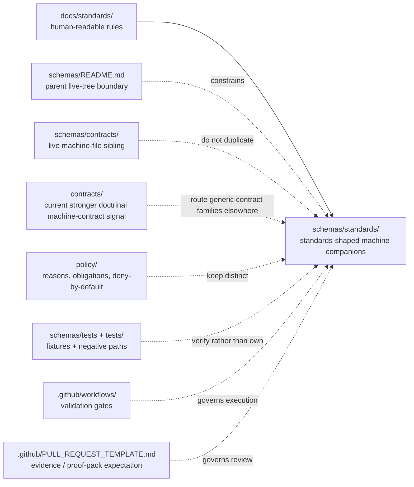

<!-- [KFM_META_BLOCK_V2]
doc_id: kfm://doc/UUID-TBD-VERIFY
title: standards
type: standard
version: v1
status: draft
owners: @bartytime4life
created: YYYY-MM-DD
updated: YYYY-MM-DD
policy_label: TBD-VERIFY
related: [../README.md, ../contracts/README.md, ../tests/README.md, ../workflows/README.md, ../../docs/standards/README.md, ../../contracts/README.md, ../../policy/README.md, ../../tests/README.md, ../../.github/workflows/README.md, ../../.github/CODEOWNERS, ../../.github/PULL_REQUEST_TEMPLATE.md]
tags: [kfm, schemas, standards, profiles, validation]
notes: [owners confirmed from current public CODEOWNERS global fallback; doc_id/created/updated/policy_label still need live-repo verification; parent schemas inventory is now reconciled to the live public-main subtree; standards-lane authority remains unresolved]
[/KFM_META_BLOCK_V2] -->

# standards

_Boundary-and-routing README for the still README-only `schemas/standards/` lane while the broader `schemas/` subtree is now materially nested and schema-home authority remains unresolved._

> **Status:** `experimental`  
> **Doc status:** `draft`  
> **Owners:** `@bartytime4life` *(current public `.github/CODEOWNERS` shows a global fallback plus explicit root rules such as `/.github/` and `/contracts/`, but no narrower `/schemas/` or `/schemas/standards/` rule was directly verified)*  
>         
> **Quick jumps:** [Scope](#scope) · [Repo fit](#repo-fit) · [Accepted inputs](#accepted-inputs) · [Exclusions](#exclusions) · [Directory tree](#directory-tree) · [Quickstart](#quickstart) · [Usage](#usage) · [Diagram](#diagram) · [Tables](#tables) · [Task list](#task-list--definition-of-done) · [FAQ](#faq) · [Appendix](#appendix)  
> **Repo fit:** path `schemas/standards/README.md` · parent [`../README.md`](../README.md) · sibling machine-file lane [`../contracts/README.md`](../contracts/README.md) · nested fixture scaffold [`../tests/README.md`](../tests/README.md) · nested workflow boundary [`../workflows/README.md`](../workflows/README.md) · human-readable standards [`../../docs/standards/README.md`](../../docs/standards/README.md) · root contract guide [`../../contracts/README.md`](../../contracts/README.md) · policy [`../../policy/README.md`](../../policy/README.md) · repo-wide verification [`../../tests/README.md`](../../tests/README.md) · workflow gates [`../../.github/workflows/README.md`](../../.github/workflows/README.md)

> [!IMPORTANT]
> Current public `main` still presents `schemas/standards/` as a **README-only** lane, even though the wider `schemas/` subtree is now visibly nested and `schemas/contracts/` already carries starter machine files.
>
> Treat this directory as a **boundary and placement guide** today, not as proof that a standards-schema registry already exists here.

> [!WARNING]
> Parent inventory is no longer the main problem.
>
> The harder problem now is **split authority**: human-readable standards live in [`../../docs/standards/`](../../docs/standards/), current contract doctrine still points strongly toward [`../../contracts/`](../../contracts/), and sibling machine-file scaffolds now live under [`../contracts/`](../contracts/README.md).
>
> That makes casual growth inside `schemas/standards/` riskier than before.

> [!NOTE]
> [`../README.md`](../README.md) is now reconciled to the live nested `schemas/` subtree, so this file should stop repeating older “parent is stale” language and instead explain why **this lane remains intentionally narrow** beside a more materialized sibling.

## Scope

`schemas/standards/` should answer one narrow question well:

**If KFM later needs machine-facing companions to cross-cutting standards, where do they belong, and what do they not replace?**

Right now, the safe reading is still conservative — but it has to be more current than before.

- **CONFIRMED:** this path exists on public `main` and currently contains `README.md` only.
- **CONFIRMED:** [`../../docs/standards/`](../../docs/standards/) is already the governed human-readable home for cross-cutting standards and profiles.
- **CONFIRMED:** [`../README.md`](../README.md) now indexes the live nested `schemas/` subtree honestly and still keeps canonical schema-home authority unresolved.
- **CONFIRMED:** sibling [`../contracts/`](../contracts/) is now machine-file-bearing on public `main`, including visible `v1/` and `vocab/` subtrees.
- **INFERRED:** this sublane exists to keep standards-shaped machine work distinct from both **generic contract families** and **policy / fixture / workflow** lanes.
- **PROPOSED:** once authority is explicit, this lane can hold machine-facing companions to cross-cutting standards and profiles that are **not** better housed under `schemas/contracts/` or root `contracts/`.
- **NEEDS VERIFICATION:** mounted-branch parity, any lane-specific ownership rule, any validator that reads this path directly, and any fixture strategy tied specifically to standards companions.

This README therefore does four jobs:

1. records the current public-tree truth without overclaiming,
2. explains why `schemas/standards/` is still boundary-only even after sibling schema lanes materialized,
3. prevents standards-profile-shaped machine work from drifting into the wrong lane, and
4. keeps future growth possible **without** letting `schemas/standards/` quietly become a second `docs/standards/`, a second `contracts/`, or a shadow copy of `schemas/contracts/`.

[Back to top](#standards)

## Repo fit

| Item | Value |
|---|---|
| Path | `schemas/standards/README.md` |
| Role now | Boundary README for a standards-profile schema sublane inside the nested `schemas/` subtree |
| Current public `main` snapshot | `schemas/standards/` contains `README.md` only |
| Parent boundary | [`../README.md`](../README.md) now indexes the live nested subtree and keeps authority unresolved |
| Sibling machine-file signal | [`../contracts/README.md`](../contracts/README.md) documents a live `schemas/contracts/` subtree with visible `v1/` and `vocab/` scaffolds |
| Nested fixture signal | [`../tests/README.md`](../tests/README.md) documents `fixtures/contracts/v1/{valid,invalid}` as scaffolded placeholders |
| Nested workflow signal | [`../workflows/README.md`](../workflows/README.md) remains boundary-only |
| Human-readable companion | [`../../docs/standards/README.md`](../../docs/standards/README.md) |
| Strongest current doctrinal machine-contract signal | [`../../contracts/README.md`](../../contracts/README.md) |
| Policy neighbor | [`../../policy/README.md`](../../policy/README.md) |
| Repo-wide verification neighbor | [`../../tests/README.md`](../../tests/README.md) |
| Workflow neighbor | [`../../.github/workflows/README.md`](../../.github/workflows/README.md) |
| Owner signal | `@bartytime4life` via current public `CODEOWNERS` global fallback; no narrower `/schemas/` or `/schemas/standards/` rule directly verified |
| Current authority posture | **UNKNOWN / NEEDS VERIFICATION** — no directly verified repo decision makes this lane canonical for machine-facing standards artifacts |
| Why this file matters | The path is public, still README-only, and now sits beside more materialized sibling schema lanes; without a precise boundary, it becomes easy to misread |

### Baseline used for this revision

| Role | Current evidence anchor | Consequence for this file |
|---|---|---|
| Repo-state anchor | current public `main` raw-file inspection of this lane, its parent, sibling schema-lane READMEs, `CODEOWNERS`, and the PR template | prefer current tree reality over older README-only assumptions |
| Doctrine anchor | March–April 2026 KFM contract / trust / standards doctrine | keep contract authority singular, keep policy and fixtures separate, and avoid inventing mounted implementation depth |
| Review-flow anchor | current PR template | placement or authority changes here should travel with evidence / proof-pack links and an explicit `schemas/` surface declaration |

### Current verified snapshot

| Surface | Current public `main` state | Why it matters |
|---|---|---|
| [`./README.md`](./README.md) | Present; only file in the sublane | The lane is real, but its local inventory is still minimal |
| [`../README.md`](../README.md) | Present; substantive parent index with reconciled live-tree snapshot | Parent/child drift should no longer come from stale subtree prose |
| [`../contracts/README.md`](../contracts/README.md) | Present; substantive boundary-and-inventory README | A sibling schema lane is already machine-file-bearing |
| [`../contracts/v1/README.md`](../contracts/v1/README.md) | Present; documents visible family lanes under `common/`, `correction/`, `data/`, `evidence/`, `policy/`, `release/`, `runtime/`, and `source/` | Generic contract families already have a public nested scaffold elsewhere |
| [`../contracts/vocab/README.md`](../contracts/vocab/README.md) | Present; documents `reason_codes.json`, `obligation_codes.json`, and `reviewer_roles.json` | Shared machine-readable registries are already being scaffolded in a sibling lane |
| [`../schemas/README.md`](../schemas/README.md) | Present; boundary-only nested lane | Another sibling nested lane exists and should stay distinct |
| [`../tests/README.md`](../tests/README.md) | Present; nested schema-test scaffold with `fixtures/contracts/v1/{valid,invalid}` placeholders | Fixture scaffolds are visible elsewhere under `schemas/` and should not drift here |
| [`../workflows/README.md`](../workflows/README.md) | Present; boundary-only nested lane | Workflow-schema placement is already separated from this standards lane |
| [`../../docs/standards/README.md`](../../docs/standards/README.md) | Present; substantive standards index routing to STAC / DCAT / PROV / Markdown / governance docs | Human-readable standards already have a real routing surface |
| [`../../contracts/README.md`](../../contracts/README.md) | Present; substantive root contract guide | Current repo guidance for machine contracts is still stronger there than here |
| [`../../policy/README.md`](../../policy/README.md) | Present; executable-policy boundary README | Policy grammar belongs elsewhere |
| [`../../tests/README.md`](../../tests/README.md) | Present; governed verification index | Fixtures and negative-path proofs belong there at repo-wide level |
| [`../../.github/workflows/README.md`](../../.github/workflows/README.md) | Present; README documents the workflow lane as README-only | Validation consequences belong in workflow docs, not in this schema-placement lane |
| [`../../.github/CODEOWNERS`](../../.github/CODEOWNERS) | Present; global fallback plus explicit root rules such as `/.github/` and `/contracts/`, but no narrower `/schemas/` rule was directly verified | Owner fallback is directly supported; lane-specific ownership remains unresolved |
| [`../../.github/PULL_REQUEST_TEMPLATE.md`](../../.github/PULL_REQUEST_TEMPLATE.md) | Present; asks for evidence / proof-pack links and includes `schemas/` in affected surfaces | Changes here should travel with explicit evidence and doctrine checklists |

### Working interpretation

Use `schemas/standards/` as a **boundary-only standards-profile lane now** and as a **candidate standards-schema lane later**.

That means:

- do **not** put human-readable standards prose here,
- do **not** mirror generic contract-family scaffolds already visible under [`../contracts/`](../contracts/README.md),
- do **not** duplicate policy grammar or shared registry files here,
- do **not** let sibling machine-file presence pressure this lane into accidental growth by symmetry alone,
- and do **not** add files here faster than the repo resolves canonical ownership, fixtures, validators, and placement rules for standards-shaped machine artifacts.

[Back to top](#standards)

## Accepted inputs

Place material here only when it is clearly about **machine-facing companions to cross-cutting standards** rather than general prose, policy, or route / runtime contract families.

| Accepted input | Why it belongs here |
|---|---|
| This README | The lane exists publicly and still needs an explicit boundary contract |
| Tree-accurate placement and authority notes for standards-shaped schema work | This sublane must say what belongs here before files appear |
| ADR references or migration notes that narrow future standards-schema placement | They reduce ambiguity without silently creating a second authority surface |
| **PROPOSED** companion schemas for cross-cutting profiles such as STAC / DCAT / PROV or governed document / metadata protocols | This is the strongest future role that matches the lane name without collapsing into generic contract families |
| Explicitly labeled, **non-authoritative** generated bundles or crosswalk artifacts derived from stronger standards docs | Acceptable only when canonical ownership stays singular and the derived role is obvious |
| Small README-level maps showing how a human-readable standard links to machine checks, fixtures, or validation gates | Useful when they reduce drift across `docs/standards/`, `schemas/contracts/`, `contracts/`, `tests/`, and workflow validation |

### Minimum bar for anything added here

- it is unmistakably **standards-facing**, not endpoint-facing,
- it states whether it is authoritative, derived, mirrored, or purely documentary,
- it links back to the human-readable rule in [`../../docs/standards/`](../../docs/standards/),
- it explains why it does **not** belong under [`../contracts/`](../contracts/README.md) or [`../../contracts/`](../../contracts/README.md),
- it does not duplicate a trust-bearing family already materialized elsewhere,
- it carries evidence / proof-pack links when the change materially affects placement or authority,
- and it updates sibling boundary docs in the same reviewed change when subtree meaning changes.

## Exclusions

This lane should stay small — and now it has more adjacent places to stay distinct from.

| Does **not** belong here | Put it here instead | Why |
|---|---|---|
| Human-readable standards, profiles, governance references, FAIR+CARE notes, or sovereignty guidance | [`../../docs/standards/`](../../docs/standards/) | Explanation belongs in the standards index and its downstream files |
| Generic contract-family schemas already represented by sibling `v1` lanes | [`../contracts/`](../contracts/README.md) and its `v1/` family subtree | A sibling machine-file contract lane already exists |
| API request/response schemas, runtime envelopes, correction notices, release manifests, or other trust-bearing route / runtime contracts | [`../../contracts/`](../../contracts/) and any explicitly designated contract-family lane | These are machine contracts, not standards-topic scaffolding |
| Shared machine-readable registries such as reason / obligation / reviewer-role vocabularies | [`../contracts/vocab/`](../contracts/vocab/README.md) and adjacent policy docs | Shared registries are already scaffolded elsewhere |
| Policy bundles, deny-by-default logic, or executable decision rules | [`../../policy/`](../../policy/) | Policy must remain executable and separately reviewable |
| Canonical valid/invalid fixture packs or drill payloads | [`../tests/`](../tests/README.md), [`../../tests/`](../../tests/README.md), or the owning verification family | Fixtures belong with verification, not standards-topic documentation |
| GitHub Actions YAML, validator runners, or merge-gate wiring | [`../../.github/workflows/`](../../.github/workflows/) and tooling surfaces | Execution is distinct from schema-topic placement |
| Runtime emitters, evidence resolvers, or service code | app / package implementation surfaces | Consumers and emitters should reference contracts, not live in a scaffold README lane |
| Convenience copies of files already owned in `docs/standards/`, `schemas/contracts/`, `contracts/`, `policy/`, or `tests/` | the already authoritative or currently materialized home | Duplicate authority is drift, not resilience |

> [!CAUTION]
> A standards-schema lane becomes dangerous the moment it looks “official enough” to reviewers while pointing to a different tree than standards, contracts, policy, tests, or CI actually use.

[Back to top](#standards)

## Directory tree

### Current confirmed public-main snapshot of the parent subtree *(abridged to verified surfaces)*

```text
schemas/
├── README.md
├── contracts/
│   ├── README.md
│   ├── v1/
│   │   ├── README.md
│   │   ├── common/
│   │   ├── correction/
│   │   ├── data/
│   │   ├── evidence/
│   │   ├── policy/
│   │   ├── release/
│   │   ├── runtime/
│   │   └── source/
│   └── vocab/
│       ├── README.md
│       ├── obligation_codes.json
│       ├── reason_codes.json
│       └── reviewer_roles.json
├── schemas/
│   └── README.md
├── standards/
│   └── README.md
├── tests/
│   ├── README.md
│   └── fixtures/
│       └── contracts/
│           └── v1/
│               ├── invalid/
│               └── valid/
└── workflows/
    └── README.md
```

### Current public snapshot of this lane

```text
schemas/standards/
└── README.md
```

### What this means right now

- the `schemas/` subtree is now a **live nested scaffold**, not a hypothetical parent lane,
- `schemas/standards/` is still **README-only**,
- a sibling machine-file-bearing subtree already exists under [`../contracts/`](../contracts/README.md),
- nested fixture and workflow scaffolds are visible elsewhere under `schemas/`,
- and this README should therefore be **boundary-oriented and tree-accurate**, not nostalgic about older README-only parent snapshots.

### Safe growth rule for this lane

If `schemas/standards/` grows beyond this README, keep the first additions narrow and clearly labeled:

- standards/profile companions,
- protocol or metadata-profile helpers,
- or derived crosswalk artifacts that are explicitly marked non-authoritative.

Do **not** let the first additions be:

- generic contract-family schemas already visible under `schemas/contracts/v1/`,
- shared registry files already visible under `schemas/contracts/vocab/`,
- policy vocabularies,
- workflow execution files,
- or canonical fixture packs.

[Back to top](#standards)

## Quickstart

Inspect the neighboring lanes before adding anything here.

```bash
# inspect the nested schemas subtree and this lane
find schemas -maxdepth 4 \( -type f -o -type d \) 2>/dev/null | sort
find schemas/standards -maxdepth 3 \( -type f -o -type d \) 2>/dev/null | sort
find schemas/contracts -maxdepth 4 \( -type f -o -type d \) 2>/dev/null | sort
find schemas/tests -maxdepth 5 \( -type f -o -type d \) 2>/dev/null | sort

# read the parent and adjacent decision surfaces together
sed -n '1,260p' schemas/README.md
sed -n '1,260p' schemas/standards/README.md
sed -n '1,260p' schemas/contracts/README.md
sed -n '1,260p' schemas/tests/README.md
sed -n '1,260p' docs/standards/README.md
sed -n '1,260p' contracts/README.md
sed -n '1,240p' policy/README.md
sed -n '1,260p' tests/README.md
sed -n '1,240p' .github/workflows/README.md
sed -n '1,220p' .github/CODEOWNERS
sed -n '1,220p' .github/PULL_REQUEST_TEMPLATE.md

# search for placement, authority, and proof language before adding files
git grep -nE 'STAC|DCAT|PROV|proof-pack|affected repo surfaces|schema home|parallel schema|machine contracts|reason_codes|obligation_codes' -- \
  docs schemas contracts policy tests .github
```

### Safe first move

A safe first move is usually **not** “add a schema file here.”

A safer first move is:

1. verify whether the intended artifact is truly standards-facing,
2. confirm whether the human-readable rule already lives in [`../../docs/standards/`](../../docs/standards/),
3. confirm whether the artifact is already better represented by a visible sibling lane such as [`../contracts/`](../contracts/README.md),
4. confirm whether the machine-facing artifact should instead live in [`../../contracts/`](../../contracts/),
5. decide whether this lane would be authoritative, derived, or purely documentary,
6. confirm whether the PR carries evidence / proof-pack links,
7. and update sibling README surfaces in the same reviewed change if placement rules change.

## Usage

### For maintainers

Use this file to keep `schemas/standards/` narrow, reviewable, and hard to misread.

Now that `schemas/contracts/` is materially real on public `main`, this README should stay even more explicit about **why this lane is still empty**. A machine-file-bearing sibling makes accidental sprawl easier, not safer.

If root `contracts/` remains the stronger canonical machine-contract lane, this README should stay pointer-like and boundary-oriented. If the repo later elevates `schemas/standards/`, do it explicitly and update adjacent docs, fixtures, validators, and PR guidance together.

### For contributors

Use this quick placement test:

- If the artifact is **human-readable guidance**, start in [`../../docs/standards/`](../../docs/standards/).
- If the artifact is a **generic contract family schema or shared registry** already reflected by nested machine-file lanes, start with [`../contracts/`](../contracts/README.md) and its child docs.
- If the artifact is a **route or runtime contract**, start in [`../../contracts/`](../../contracts/).
- If the artifact is **policy-bearing grammar or deny-by-default logic**, start in [`../../policy/`](../../policy/).
- If the artifact is a **fixture or negative-path proof**, start in [`../tests/`](../tests/README.md) or [`../../tests/`](../../tests/).
- Use `schemas/standards/` only when the artifact is a **machine-facing companion to a cross-cutting standard** and the repo’s authority story stays singular.

### For reviewers

Reject changes that do any of the following:

- duplicate a trust-bearing family already visible under `schemas/contracts/` or root `contracts/`,
- copy shared registry files or policy vocabularies here,
- move validation consequences without updating sibling docs,
- omit evidence / proof-pack links when the change materially alters this lane’s purpose or authority,
- or imply that this lane is already authoritative when the visible tree, fixtures, or workflow gates do not prove that yet.

### If authority changes later

Do the whole move, not a silent drift:

1. write or link the ADR / authority decision,
2. update [`../README.md`](../README.md),
3. update [`../contracts/README.md`](../contracts/README.md) if sibling responsibilities shift,
4. update [`../../docs/standards/README.md`](../../docs/standards/README.md),
5. update [`../../contracts/README.md`](../../contracts/README.md) if responsibilities shift,
6. update nested and repo-wide fixture docs,
7. update workflow validation paths,
8. update PR template guidance if reviewer expectations change,
9. and update any consumer docs that still point to the old lane.

## Diagram



Reading rule: `schemas/standards/` should reduce ambiguity, not create a second source of machine truth.

## Tables

### A. Current public repo signals

| Signal | Current public state | Why it matters |
|---|---|---|
| `schemas/standards/README.md` | Present; single-file sublane | The lane is real, but current local inventory is minimal |
| `schemas/README.md` | Present; reconciled parent index for the live nested subtree | Parent / child documentation drift should no longer be caused by stale inventory prose |
| `schemas/contracts/README.md` | Present; substantive inventory README | A sibling schema lane already documents live machine files |
| `schemas/contracts/v1/` | Present with family lanes under `common/`, `correction/`, `data/`, `evidence/`, `policy/`, `release/`, `runtime/`, and `source/` | Generic contract-family scaffolds already have a public nested home |
| `schemas/contracts/vocab/` | Present with three starter JSON registries | Shared machine-readable registries are already being scaffolded elsewhere |
| `schemas/tests/` | Present with `fixtures/contracts/v1/{valid,invalid}` placeholders | Nested fixture scaffolds exist outside this lane |
| `schemas/workflows/` | Present; README-only | Workflow-schema placement is already separated |
| `docs/standards/README.md` | Present; substantive index with visible downstream standards files | Human-readable standards already have a primary home |
| `contracts/README.md` | Present; substantive boundary README | Machine-facing contract authority is still signaled more strongly there than here |
| `policy/README.md` | Present; substantive executable-policy surface | Policy grammar and reasons / obligations stay elsewhere |
| `.github/workflows/README.md` | Present; README-only lane | Validation consequences should be documented separately from schema placement |
| `.github/CODEOWNERS` | Global fallback plus explicit root rules; no narrower `/schemas/` or `/schemas/standards/` rule directly verified | Owner fallback is grounded, but lane-specific ownership is unresolved |
| `.github/PULL_REQUEST_TEMPLATE.md` | Evidence / proof-pack links required; `schemas/` is an affected-surface checkbox | Changes here should travel with explicit review evidence |

### B. Put-it-here test

| Candidate change | Belongs in `schemas/standards/` today? | Better home today | Why |
|---|---|---|---|
| Expand STAC / DCAT / PROV rule text | No | `../../docs/standards/` | Human-readable standards already live there |
| Add a generic runtime envelope or correction schema | No | `../contracts/v1/` or `../../contracts/` | These are contract-family objects, not standards-lane scaffolds |
| Add reason / obligation / reviewer-role registries | No | `../contracts/vocab/` and `../../policy/` | Shared registries are already scaffolded elsewhere and have policy consequences |
| Add valid / invalid fixture packs | No | `../tests/` or `../../tests/contracts/` | Fixtures belong with governed verification |
| Mirror an existing `schemas/contracts/v1/*/*.schema.json` family here | No | the already visible sibling family lane | Parallel copies create drift |
| Add README boundary guidance for this lane | Yes | `schemas/standards/` | This is the current meaning of the subtree |
| Add a standards-profile companion schema that is clearly not route-, runtime-, or contract-family-specific | Maybe | depends on explicit authority and labeling | Possible later, but only if the repo keeps authority singular and reviewable |

### C. Candidate future families *(all PROPOSED)*

| Family | Why it could fit here later | Minimum entry condition |
|---|---|---|
| Machine-facing companions to STAC / DCAT / PROV profile rules | Cross-cutting standards are the most natural semantic fit for this lane | Human-readable rule exists, canonical / derived status is explicit, and the artifact is not better placed under current contract-family lanes |
| Governed document / metadata protocol companion schemas | They are standards-shaped rather than endpoint-shaped | The protocol is already owned in `docs/standards/`, and the machine-facing companion does not duplicate route DTOs or sibling contract scaffolds |
| Derived crosswalk or normalization bundles | They can help bridge prose standards to machine checks | They are explicitly labeled non-authoritative and linked to the stronger source of truth |
| Standards-oriented example packs | They can help reviewers understand a profile family | Canonical fixture law is explicit and the examples are clearly labeled illustrative, mirror, or generated |

[Back to top](#standards)

## Task list / definition of done

- [x] `schemas/standards/README.md` exists on public `main`.
- [x] Current public `schemas/standards/` snapshot is `README.md` only.
- [x] Parent `schemas/README.md` is now reconciled with the live nested subtree inventory.
- [x] Sibling `schemas/contracts/` now materially exposes `v1/` and `vocab/` subtrees.
- [x] Nested `schemas/tests/` fixture scaffolds are visible on public `main`.
- [x] Human-readable standards already have a substantive index in `docs/standards/README.md`.
- [x] Current public `CODEOWNERS` directly supports `@bartytime4life` as the fallback owner signal for this lane.
- [x] Current public PR template includes both evidence / proof-pack links and a `schemas/` affected-surface checkbox.
- [ ] An ADR or equivalent repo decision states whether standards-shaped machine companions live here, under `schemas/contracts/`, under root `contracts/`, or across a deliberate split with explicit rules.
- [ ] Any first non-README file added here links to its human-readable standard, canonical source, fixture strategy, validator path, and reason it does not belong under current contract lanes.
- [ ] No trust-bearing family exists in both `schemas/standards/` and current contract lanes without an explicit, reviewed reason.
- [ ] Workflow and test docs are updated when validation consequences change.

### Definition of done for this README

This file is doing its job when a reviewer can answer **“why does this lane still exist?”**, **“what should not land here?”**, and **“why doesn’t sibling machine-file presence automatically make this lane canonical?”** without opening half the repo first.

## FAQ

### Is this the same thing as `docs/standards/`?

No.  
`../../docs/standards/` is the human-readable standards surface.  
`schemas/standards/` is, at most, a machine-facing companion lane for those standards — and today it is still only a scaffold boundary.

### Does this lane currently own any real schemas?

Not on the public `main` tree inspected for this revision.  
The visible local subtree is `README.md` only.

### Why not put STAC, DCAT, or PROV machine artifacts here today?

Because the current repo already gives those rule families a substantive human-readable home in `docs/standards/`, keeps generic machine-contract doctrine stronger in root `contracts/`, and now exposes a sibling machine-file scaffold under `schemas/contracts/`.  
That means a first addition here needs a much tighter justification than “it sounds standards-shaped.”

### Why keep the directory at all if it is still scaffolding?

Because the public tree already exposes it.  
A visible scaffold without a boundary contract invites accidental overreach; a documented scaffold makes its limits reviewable.

### What is the safest next improvement after this README?

Resolve standards-companion authority explicitly across `docs/standards/`, `schemas/standards/`, `schemas/contracts/`, and root `contracts/` before landing the first non-README file here.

[Back to top](#standards)

## Appendix

<details>
<summary>Open verification items and future alignment notes</summary>

### Open verification items

- Whether a narrower `/schemas/` or `/schemas/standards/` CODEOWNERS rule should replace the current global fallback.
- Whether this lane will ever be authoritative, or whether it should remain boundary-only / documentary / derived-only.
- Whether standards-profile companions should land here, under `schemas/contracts/`, under root `contracts/`, or under a mixed but explicitly governed split.
- Which validator, if any, will eventually read this lane directly.
- Whether nested `schemas/tests/` fixture scaffolds remain purely local placeholders or later become part of a standards-companion validation story.
- Whether reviewer guidance for evidence / proof-pack links needs a lane-specific addition beyond the current repo-wide PR template.

### Maintainer reminders

- Prefer links over duplication.
- If the first non-README file lands here, label its role plainly: **authoritative**, **derived**, **mirror**, or **illustrative**.
- When the tree changes, update this file and [`../README.md`](../README.md) together.
- If sibling contract or fixture lanes change in ways that affect placement here, update this README in the same change stream.
- If authority resolves away from this lane, simplify this README into a crisp pointer instead of letting it accumulate stale theory.

</details>

[Back to top](#standards)
