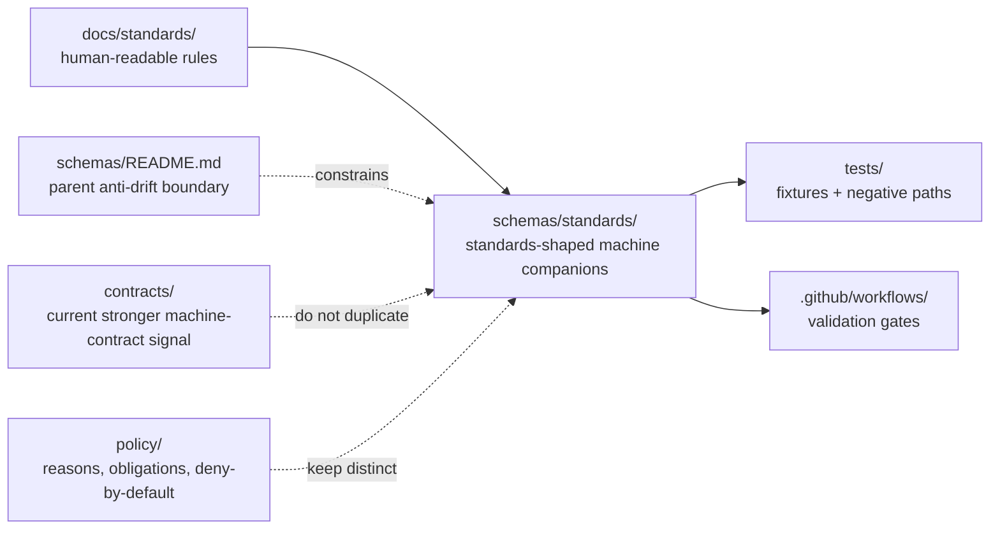

<!-- [KFM_META_BLOCK_V2]
doc_id: kfm://doc/UUID-TBD-VERIFY
title: standards
type: standard
version: v1
status: draft
owners: @bartytime4life
created: YYYY-MM-DD
updated: YYYY-MM-DD
policy_label: TBD-VERIFY
related: [../README.md, ../../docs/standards/README.md, ../../contracts/README.md, ../../policy/README.md, ../../tests/README.md, ../../.github/workflows/README.md]
tags: [kfm, schemas, standards, profiles, validation]
notes: [owners derived from current CODEOWNERS global fallback; doc_id/created/updated/policy_label still need live-repo verification]
[/KFM_META_BLOCK_V2] -->

# standards

Schema-lane boundary for any machine-facing companions to KFM cross-cutting standards and profiles — currently scaffold-only, documentary, and intentionally non-canonical.

> **Status:** `experimental`  
> **Doc status:** `draft`  
> **Owners:** `@bartytime4life` *(current `.github/CODEOWNERS` global fallback; no narrower `/schemas/` or `/schemas/standards/` rule was directly verified)*  
>        
> **Quick jumps:** [Scope](#scope) · [Repo fit](#repo-fit) · [Accepted inputs](#accepted-inputs) · [Exclusions](#exclusions) · [Directory tree](#directory-tree) · [Quickstart](#quickstart) · [Usage](#usage) · [Diagram](#diagram) · [Tables](#tables) · [Task list](#task-list--definition-of-done) · [FAQ](#faq) · [Appendix](#appendix)  
> **Repo fit:** path `schemas/standards/README.md` · parent [`../README.md`](../README.md) · human-readable standards [`../../docs/standards/README.md`](../../docs/standards/README.md) · stronger machine-contract lane [`../../contracts/README.md`](../../contracts/README.md) · policy [`../../policy/README.md`](../../policy/README.md) · verification [`../../tests/README.md`](../../tests/README.md) · workflow gates [`../../.github/workflows/README.md`](../../.github/workflows/README.md)

> [!IMPORTANT]
> Current public `main` shows `schemas/standards/` containing `README.md` only.
> Treat this directory as a **boundary and placement guide** today, not as proof that a standards-schema registry already exists.

> [!WARNING]
> The parent [`../README.md`](../README.md) still carries older inventory language that describes `schemas/` as `README.md`-only.
> The live public tree now shows visible scaffold subdirectories under `schemas/`, so parent and child READMEs need to stay synchronized.

> [!NOTE]
> [`../../docs/standards/README.md`](../../docs/standards/README.md) is already the human-readable standards index, and it currently routes “API endpoint schemas and machine contracts” toward [`../../contracts/`](../../contracts/).
> This lane should grow only in ways that preserve that split and keep contract authority singular.

## Scope

`schemas/standards/` should answer one narrow question well:

**If KFM later needs machine-facing companions to cross-cutting standards, where do they belong, and what do they not replace?**

Right now, the safe reading is intentionally conservative.

- **CONFIRMED:** this path exists on public `main` and currently contains `README.md` only.
- **CONFIRMED:** `docs/standards/` is already the governed human-readable home for cross-cutting standards and profiles.
- **CONFIRMED:** `schemas/README.md` warns against parallel schema authority, even though its tree-inventory wording lags the current public subtree.
- **INFERRED:** this sublane exists to keep standards-shaped schema work distinct from sibling schema families such as `contracts`, `tests`, and `workflows` under `schemas/`.
- **PROPOSED:** once authority is explicit, this lane can hold machine-facing companions to cross-cutting standards and profiles.
- **NEEDS VERIFICATION:** mounted-branch parity, any real standards-schema inventory, any narrower ownership rule, any validator that reads this path, and any fixture strategy tied to it.

This README therefore does three jobs:

1. records the current public-tree truth without overclaiming,
2. prevents standards-profile-shaped schema work from drifting into the wrong lane, and
3. keeps future growth possible **without** letting `schemas/standards/` quietly become a second `docs/standards/` or a shadow copy of `contracts/`.

[Back to top](#standards)

## Repo fit

| Item | Value |
|---|---|
| Path | `schemas/standards/README.md` |
| Role now | Boundary README for a standards-profile schema sublane inside `schemas/` |
| Current public `main` snapshot | `schemas/standards/` contains `README.md` only |
| Human-readable companion | [`../../docs/standards/README.md`](../../docs/standards/README.md) |
| Stronger current machine-contract signal | [`../../contracts/README.md`](../../contracts/README.md) |
| Policy neighbor | [`../../policy/README.md`](../../policy/README.md) |
| Verification neighbor | [`../../tests/README.md`](../../tests/README.md) |
| Workflow neighbor | [`../../.github/workflows/README.md`](../../.github/workflows/README.md) |
| Parent boundary | [`../README.md`](../README.md) |
| Owner signal | `@bartytime4life` via current global `CODEOWNERS` fallback |
| Current authority posture | **UNKNOWN / NEEDS VERIFICATION** — no directly verified repo decision makes this lane canonical for machine-facing standards artifacts |
| Why this file matters | The path is public and should not remain semantically undefined |

### Current verified snapshot

| Surface | Current public `main` state | Why it matters |
|---|---|---|
| [`./README.md`](./README.md) | Present; only file in the sublane | The lane is real, but subtree inventory is still minimal |
| [`../README.md`](../README.md) | Present; boundary guide | Parent lane exists, but its inventory text understates the live subtree |
| `schemas/` tree | Visible child lanes: `contracts/`, `schemas/`, `standards/`, `tests/`, `workflows` | The schema subtree is no longer literally README-only at tree level |
| `schemas/standards/` tree | `README.md` only | This sublane is still documentary scaffolding today |
| `schemas/tests/` tree | `README.md` plus `fixtures/` | Nested schema sublanes already differ in maturity and should not be flattened together |
| [`../../docs/standards/README.md`](../../docs/standards/README.md) | Present; substantive index | Human-readable standards already have a real routing surface |
| [`../../contracts/README.md`](../../contracts/README.md) | Present; substantive boundary README | Current repo guidance for machine contracts is stronger there than here |
| [`../../.github/workflows/README.md`](../../.github/workflows/README.md) | Present; README-only | No checked-in workflow YAML was directly visible on public `main` during this review |

### Working interpretation

Use `schemas/standards/` as a **boundary lane now** and as a **candidate standards-schema lane later**.

That means:

- do **not** put human-readable standards prose here,
- do **not** put route DTOs or runtime trust envelopes here,
- do **not** duplicate policy grammar here,
- and do **not** add files here faster than the repo resolves canonical ownership, fixtures, and validators.

[Back to top](#standards)

## Accepted inputs

Place material here only when it is clearly about **machine-facing companions to cross-cutting standards** rather than general prose, policy, or route contracts.

| Accepted input | Why it belongs here |
|---|---|
| This README | The lane exists publicly and needs an explicit boundary contract |
| Placement and authority notes for standards-shaped schema work | This sublane must say what belongs here before files appear |
| ADR references or migration notes that narrow future standards-schema placement | They reduce ambiguity without silently creating a second authority surface |
| **PROPOSED** companion schemas for cross-cutting profiles such as STAC/DCAT/PROV or governed document/metadata protocols | This is the strongest future role that matches the lane name without collapsing into route contracts |
| Explicitly labeled, **non-authoritative** generated bundles or crosswalk artifacts derived from stronger sources | Acceptable only when canonical ownership stays singular and the derived role is obvious |
| Small README-level maps showing how a human-readable standard links to machine checks, fixtures, or validation gates | Useful when they reduce drift across `docs/standards/`, `contracts/`, `tests/`, and workflow validation |

### Minimum bar for anything added here

- it is unmistakably **standards-facing**, not endpoint-facing,
- it states whether it is authoritative, derived, mirrored, or purely documentary,
- it links back to the human-readable rule in [`../../docs/standards/`](../../docs/standards/),
- it does not duplicate a trust-bearing family already owned elsewhere,
- and it does not make schema-home authority harder to understand.

## Exclusions

This lane should stay small.

| Does **not** belong here | Put it here instead | Why |
|---|---|---|
| Human-readable standards, profiles, governance references, FAIR+CARE notes, or sovereignty guidance | [`../../docs/standards/`](../../docs/standards/) | Explanation belongs in the standards index and its downstream files |
| API request/response schemas, runtime envelopes, correction notices, release manifests, or other trust-bearing contract families | [`../../contracts/`](../../contracts/) | These are machine contracts, not standards-topic scaffolding |
| Policy bundles, reason codes, obligation codes, reviewer-role registries, or deny-by-default logic | [`../../policy/`](../../policy/) | Policy must remain executable and separately reviewable |
| Canonical valid/invalid fixtures or drill payloads | [`../../tests/`](../../tests/) and any confirmed canonical fixture lane | Fixtures belong with verification, not standards-topic documentation |
| GitHub Actions YAML, validator runners, or merge-gate wiring | [`../../.github/workflows/`](../../.github/workflows/) and tooling surfaces | Execution is distinct from schema-topic placement |
| Runtime emitters, evidence resolvers, or service code | app / package implementation surfaces | Consumers and emitters should reference contracts, not live in a scaffold README lane |
| Convenience copies of files already owned in `docs/standards/`, `contracts/`, `policy/`, or `tests/` | the already authoritative home | Duplicate authority is drift, not resilience |

> [!CAUTION]
> A standards-schema lane becomes dangerous the moment it looks “official enough” to reviewers while pointing to a different tree than contracts, policy, tests, or CI.

[Back to top](#standards)

## Directory tree

### Current public snapshot of the parent subtree

```text
schemas/
├── README.md
├── contracts/
├── schemas/
├── standards/
│   └── README.md
├── tests/
│   ├── README.md
│   └── fixtures/
└── workflows/
    └── README.md
```

### Current public snapshot of this lane

```text
schemas/standards/
└── README.md
```

### What this means right now

- the `schemas/` subtree is **no longer a single-file lane** on public `main`,
- `schemas/standards/` is still **README-only**,
- sibling schema sublanes do not all have the same maturity,
- and this README should describe the sublane honestly without pretending that standards-shaped schema authority has already been resolved.

### Safe growth rule for this lane

If `schemas/standards/` grows beyond this README, keep the first additions narrow and clearly labeled:

- standards/profile companions,
- protocol or metadata-profile helpers,
- or derived crosswalk artifacts that are explicitly marked non-authoritative.

Do **not** let the first additions be generic route contracts, policy vocabularies, workflow execution files, or canonical fixture packs.

[Back to top](#standards)

## Quickstart

Inspect the neighboring lanes before adding anything here.

```bash
# inspect the schema subtree and this lane
find schemas -maxdepth 3 \( -type f -o -type d \) 2>/dev/null | sort
find schemas/standards -maxdepth 3 \( -type f -o -type d \) 2>/dev/null | sort

# read the parent and adjacent decision surfaces together
sed -n '1,260p' schemas/README.md
sed -n '1,260p' schemas/standards/README.md
sed -n '1,260p' docs/standards/README.md
sed -n '1,260p' contracts/README.md
sed -n '1,240p' policy/README.md
sed -n '1,260p' tests/README.md
sed -n '1,240p' .github/workflows/README.md

# search for placement and authority language before adding files
git grep -nE 'STAC|DCAT|PROV|Markdown Work Protocol|schema home|parallel schema|machine contracts' -- \
  docs schemas contracts policy tests .github
```

### Safe first move

A safe first move is usually **not** “add a schema file here.”

A safer first move is:

1. verify whether the intended artifact is truly standards-facing,
2. confirm whether the human-readable rule already lives in [`../../docs/standards/`](../../docs/standards/),
3. confirm whether the machine-facing artifact should actually live in [`../../contracts/`](../../contracts/),
4. decide whether this lane would be authoritative, derived, or purely documentary,
5. and update sibling README surfaces in the same reviewed change if placement rules change.

## Usage

### For maintainers

Use this file to keep `schemas/standards/` narrow, reviewable, and hard to misread.

If top-level `contracts/` remains the stronger canonical machine-contract lane, this README should stay pointer-like and boundary-oriented. If the repo later elevates `schemas/standards/`, do it explicitly and update adjacent docs, fixtures, and validators together.

### For contributors

Use this quick placement test:

- If the artifact is **human-readable guidance**, start in [`../../docs/standards/`](../../docs/standards/).
- If the artifact is a **route or runtime contract**, start in [`../../contracts/`](../../contracts/).
- If the artifact is **policy-bearing grammar or deny-by-default logic**, start in [`../../policy/`](../../policy/).
- If the artifact is a **fixture or negative-path proof**, start in [`../../tests/`](../../tests/).
- Use `schemas/standards/` only when the artifact is a **machine-facing companion to a cross-cutting standard** and the repo’s authority story stays singular.

### For reviewers

Reject changes that do any of the following:

- duplicate a trust-bearing family across `schemas/standards/` and `../../contracts/`,
- copy policy vocabularies or reasons/obligations here,
- move validation consequences without updating sibling docs,
- or imply that this lane is already authoritative when the visible tree, fixtures, or workflow gates do not prove that yet.

### If authority changes later

Do the whole move, not a silent drift:

1. write or link the ADR / authority decision,
2. update [`../README.md`](../README.md),
3. update [`../../docs/standards/README.md`](../../docs/standards/README.md),
4. update [`../../contracts/README.md`](../../contracts/README.md) if responsibilities shift,
5. update fixture paths,
6. update workflow validation paths,
7. and update any consumer docs that point to the old lane.

## Diagram



Reading rule: `schemas/standards/` should reduce ambiguity, not create a second source of machine truth.

## Tables

### A. Current public repo signals

| Signal | Current public state | Why it matters |
|---|---|---|
| `schemas/standards/README.md` | Present; single-file sublane | The lane is real, but current subtree inventory is minimal |
| `schemas/` child taxonomy | `contracts/`, `schemas/`, `standards/`, `tests/`, and `workflows` are all visible | The subtree is no longer literally README-only and needs synchronized boundary docs |
| `schemas/README.md` | Present, but still says `schemas/` contains `README.md` only | Parent doc needs reconciliation with the live tree |
| `docs/standards/README.md` | Present; substantive index | Human-readable standards already have a primary home |
| `contracts/README.md` | Present; stronger machine-contract narrative | Machine-facing contract authority is signaled more strongly there than here |
| `.github/workflows/README.md` | Present; README-only | No checked-in workflow YAML was directly evidenced on public `main` |

### B. Put-it-here test

| Candidate change | Belongs in `schemas/standards/` today? | Better home today | Why |
|---|---|---|---|
| Expand STAC/DCAT/PROV rule text | No | `../../docs/standards/` | Human-readable standards already live there |
| Add a runtime response or correction schema | No | `../../contracts/` | Trust-bearing route/runtime contract family |
| Add reason or obligation registries | No | `../../policy/` | Policy grammar should stay executable and separate |
| Add valid/invalid fixture packs | No | `../../tests/` | Fixtures belong with governed verification |
| Add README boundary guidance for this lane | Yes | `schemas/standards/` | This is the current meaning of the subtree |
| Add a derived, clearly labeled standards crosswalk artifact | Maybe | depends on explicit authority and labeling | Derived artifacts are acceptable only when canonical ownership stays obvious |

### C. Candidate future families *(all PROPOSED)*

| Family | Why it could fit here later | Minimum entry condition |
|---|---|---|
| Machine-facing companions to STAC/DCAT/PROV profile rules | Cross-cutting standards are the most natural semantic fit for this lane | Human-readable rule exists, canonical/derived status is explicit, and fixtures/validators have a confirmed home |
| Governed document / metadata protocol companion schemas | They are standards-shaped rather than endpoint-shaped | The protocol is already owned in `docs/standards/`, and the machine-facing companion does not duplicate route DTOs |
| Derived crosswalk or normalization bundles | They can help bridge prose standards to machine checks | They are explicitly labeled non-authoritative and linked to the stronger source of truth |
| Standards-oriented example packs | They can help reviewers understand a profile family | Canonical fixture law is explicit and examples are clearly labeled illustrative, mirror, or generated |

[Back to top](#standards)

## Task list / definition of done

- [x] `schemas/standards/README.md` exists on public `main`.
- [x] Current public `schemas/standards/` snapshot is `README.md` only.
- [x] Parent `schemas/` tree visibly contains scaffold child lanes.
- [x] Human-readable standards already have a substantive index in `docs/standards/README.md`.
- [ ] `schemas/README.md` is reconciled with the live subtree inventory.
- [ ] An ADR or equivalent repo decision states whether `schemas/standards/` is authoritative, documentary, or generated-output-only.
- [ ] Any machine-facing standards companion added here links to its human-readable standard, canonical source, fixture strategy, and validator path in the same PR.
- [ ] No trust-bearing family exists in both `schemas/standards/` and `../../contracts/` without an explicit, reviewed reason.
- [ ] Workflow and test docs are updated when validation consequences change.

### Definition of done for this README

This file is doing its job when a reviewer can answer **“why does this lane exist?”** and **“what should not land here?”** without opening half the repo first.

## FAQ

### Is this the same thing as `docs/standards/`?

No.  
`../../docs/standards/` is the human-readable standards surface.  
`schemas/standards/` is, at most, a machine-facing companion lane for those standards — and today it is still only a scaffold boundary.

### Does this lane currently own any real schemas?

Not on the public `main` tree inspected for this revision.  
The visible subtree is `README.md` only.

### Should STAC, DCAT, or PROV machine artifacts go here today?

Not by default.  
The current repo signals still route human-readable rules through `../../docs/standards/` and machine-facing contracts more strongly through `../../contracts/`.

### Why keep the directory at all if it is still scaffolding?

Because the public tree already exposes it.  
A visible scaffold without a boundary contract invites accidental overreach; a documented scaffold makes its limits reviewable.

### What is the safest next improvement after this README?

Reconcile [`../README.md`](../README.md) with the live `schemas/` tree and resolve authoritative schema-home law explicitly before adding trust-bearing files here.

[Back to top](#standards)

## Appendix

<details>
<summary>Open verification items and future alignment notes</summary>

### Open verification items

- Whether a narrower `/schemas/` or `/schemas/standards/` CODEOWNERS rule should replace the current global fallback.
- Whether this lane will ever be authoritative, or whether it should remain documentary / derived-only.
- Whether any hidden descendants exist on the merge target beyond the public `main` snapshot inspected here.
- Whether nested `schemas/tests/` fixture scaffolds are canonical, mirrored, or purely local documentation aids.
- Which validator, if any, will eventually read this lane directly.

### Maintainer reminders

- Prefer links over duplication.
- If the first non-README file lands here, label its role plainly: **authoritative**, **derived**, **mirror**, or **illustrative**.
- When the tree changes, update this file and [`../README.md`](../README.md) together.
- If authority resolves away from this lane, simplify this README into a crisp pointer instead of letting it accumulate stale theory.

</details>

[Back to top](#standards)
