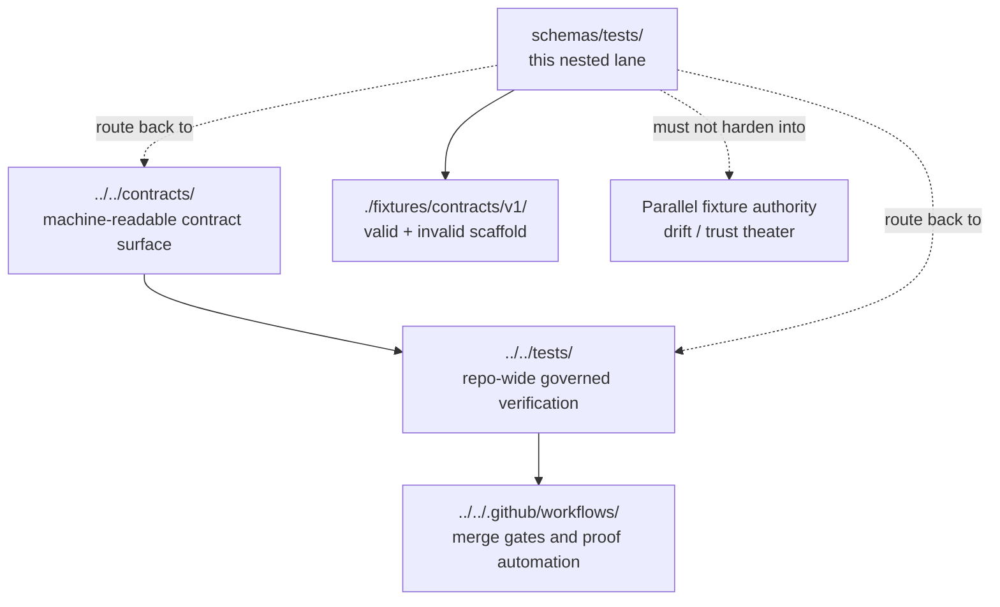

# tests
Schema-lane fixture boundary for scaffolded contract examples, valid/invalid packs, and authority-safe routing between `schemas/`, `contracts/`, and `tests/`.

> **Status:** experimental  
> **Owners:** `@bartytime4life` *(via current public `.github/CODEOWNERS` global fallback; no narrower rule for `schemas/tests/` was directly verified)*  
> 
> 
> 
> 
>   
> **Repo fit:** path `schemas/tests/README.md` · parent [`../README.md`](../README.md) · stronger contract lane [`../../contracts/README.md`](../../contracts/README.md) · stronger repo-wide verification lane [`../../tests/README.md`](../../tests/README.md) · workflow gate lane [`../../.github/workflows/README.md`](../../.github/workflows/README.md)  
> **Quick jumps:** [Scope](#scope) · [Repo fit](#repo-fit) · [Accepted inputs](#accepted-inputs) · [Exclusions](#exclusions) · [Directory tree](#directory-tree) · [Quickstart](#quickstart) · [Usage](#usage) · [Diagram](#diagram) · [Tables](#tables) · [Task list](#task-list--definition-of-done) · [FAQ](#faq) · [Appendix](#appendix)
>
> [!IMPORTANT]
> The public `main` branch currently exposes `schemas/tests/` as a real nested lane with `README.md` and `fixtures/`. The visible fixture subtree under `fixtures/contracts/v1/{valid,invalid}/` is scaffold-only today.
>
> [!WARNING]
> This directory does **not** by itself settle authoritative fixture-home or schema-home law. `schemas/README.md` still warns against parallel schema authority, `contracts/README.md` keeps schema-home authority unresolved, and `tests/README.md` remains the stronger repo-wide governed verification surface.

## Scope
`schemas/tests/` exists today as a branch-visible nested scaffold inside `schemas/`.

Its job is narrow: document what this lane is, prevent it from accidentally becoming a second canonical test system, and give contributors a safe place to orient around nested schema-adjacent fixtures without overclaiming what is live.

This README should help reviewers answer four questions quickly:

- What is currently visible here?
- What kinds of files may live here without creating contract drift?
- What should still go to `../../contracts/` or `../../tests/` instead?
- What must be verified before anyone treats this lane as canonical?

### Truth labels used here

| Label | Meaning in this README |
|---|---|
| **CONFIRMED** | Directly visible on current public `main` or directly stated in current repo docs inspected for this revision |
| **INFERRED** | Conservative interpretation of current repo docs and branch-visible structure |
| **PROPOSED** | Repo-native pattern that fits KFM doctrine but is not yet proven as mounted implementation |
| **UNKNOWN / NEEDS VERIFICATION** | Not directly verified strongly enough to present as settled repo law |

[Back to top](#tests)

## Repo fit
**Path:** `schemas/tests/README.md`  
**Role:** Nested schema-lane README for fixture-scaffold boundaries, versioned valid/invalid examples, and authority-safe routing back to the stronger contract and verification surfaces.

| Item | Current reading |
|---|---|
| Parent lane | [`../README.md`](../README.md) documents `schemas/` as a boundary surface rather than a full registry |
| Nested scope | `schemas/tests/` is visible on public `main` and currently contains `README.md` plus `fixtures/` |
| Stronger machine-contract signal | [`../../contracts/README.md`](../../contracts/README.md) |
| Stronger repo-wide verification signal | [`../../tests/README.md`](../../tests/README.md) |
| Workflow / merge-gate signal | [`../../.github/workflows/README.md`](../../.github/workflows/README.md) still documents `.github/workflows/` as README-only |
| Authority posture | **UNKNOWN / NEEDS VERIFICATION** — current public docs do not yet make this nested lane the singular fixture home |

### Upstream and downstream links

| Direction | Path | Why it matters |
|---|---|---|
| Upstream | [`../README.md`](../README.md) | Parent `schemas/` boundary and schema-home caution |
| Lateral | [`../../contracts/README.md`](../../contracts/README.md) | Stronger current contract surface |
| Lateral | [`../../tests/README.md`](../../tests/README.md) | Stronger current governed verification surface |
| Lateral | [`../../policy/README.md`](../../policy/README.md) | Reason / obligation / review consequences once policy artifacts become real |
| Lateral | [`../../docs/standards/README.md`](../../docs/standards/README.md) | Standards routing and profile placement |
| Downstream | [`./fixtures/README.md`](./fixtures/README.md) | Local scaffold index |
| Downstream | [`./fixtures/contracts/README.md`](./fixtures/contracts/README.md) | Contract-flavored nested fixture scaffold |
| Downstream | [`./fixtures/contracts/v1/README.md`](./fixtures/contracts/v1/README.md) | Current versioned sublane |
| Downstream | [`./fixtures/contracts/v1/valid/README.md`](./fixtures/contracts/v1/valid/README.md) | Placeholder for positive examples |
| Downstream | [`./fixtures/contracts/v1/invalid/README.md`](./fixtures/contracts/v1/invalid/README.md) | Placeholder for invalid / negative examples |

### Path reconciliation note
The public branch now visibly contains nested scaffolds under `schemas/`, including this directory. This README therefore describes the **current visible tree here** without pretending that schema authority has been settled or that the parent lane is already a mature fixture registry.

[Back to top](#tests)

## Accepted inputs
Use this lane for material that helps people understand or safely stage **schema-adjacent** fixtures without silently creating a second canonical truth system.

Accepted here:

- directory READMEs that explain what nested fixture folders mean
- clearly labeled **non-authoritative** examples or mirrors that exist only to support schema-local explanation, review, or generated output
- versioned `valid/` and `invalid/` folders when they are explicitly treated as scaffold or derived mirrors
- notes that map this nested lane back to `../../contracts/` and `../../tests/`
- small, public-safe example packs that are explicitly marked as **illustrative** or **generated**, not canonical, if the repo later adopts that pattern deliberately

## Exclusions
These do **not** belong here unless repo law changes and the change is documented explicitly.

| Exclusion | Why it stays out | Go here instead |
|---|---|---|
| Singular source-of-truth JSON Schemas | Avoids parallel schema authority | [`../../contracts/`](../../contracts/) unless a future ADR says otherwise |
| Repo-wide canonical fixture inventory used by blocking gates | Current doctrine points more strongly to the root verification surface | [`../../tests/`](../../tests/) |
| Workflow YAML, validator entrypoints, or merge-gate definitions | This lane is not the workflow control plane | [`../../.github/workflows/`](../../.github/workflows/) and `../../tools/` |
| Free-text policy vocab or decision grammar | Creates drift away from governed shared vocab | [`../../policy/`](../../policy/) and contract/vocab surfaces |
| Runtime outputs, proof packs, or release artifacts | This lane is not a publication or runtime artifact home | governed release/data/app surfaces |
| Sensitive or rights-unclear examples | Nested convenience scaffolds are the wrong place for ambiguous publication burden | quarantine / steward-only governed lanes |

[Back to top](#tests)

## Directory tree

### Current verified snapshot

```text
schemas/tests/
├── README.md
└── fixtures/
    ├── README.md
    └── contracts/
        ├── README.md
        └── v1/
            ├── README.md
            ├── invalid/
            │   └── README.md
            └── valid/
                └── README.md
```

### Starter naming pattern if real examples are later introduced *(PROPOSED, illustrative only)*

```text
schemas/tests/fixtures/contracts/v1/
├── valid/
│   └── <artifact-family>__minimal.example.json
└── invalid/
    └── <artifact-family>__<failure-mode>.example.json
```

> [!NOTE]
> Keep any future example filenames honest about purpose. If an example is illustrative, mirrored, or generated from a stronger source, say so in the filename, README, or both.

[Back to top](#tests)

## Quickstart
Use the inspection loop below before you document this lane as though it were canonical.

```bash
# inspect the nested schema-test scaffold
find schemas/tests -maxdepth 6 -type f | sort

# compare this lane with the stronger current contract and test surfaces
sed -n '1,220p' schemas/README.md
sed -n '1,260p' contracts/README.md
sed -n '1,260p' tests/README.md
sed -n '1,220p' .github/workflows/README.md

# check whether this nested lane contains real fixture payloads yet
find schemas/tests/fixtures -type f ! -name 'README.md' | sort

# check whether root tests/ already owns the real fixture inventory
find tests -maxdepth 6 -type f | sort | sed -n '1,260p'

# search for authority signals before adding new files here
grep -RIn "authoritative schema home\|parallel schema\|schemas/tests\|valid\|invalid" \
  README.md schemas contracts tests docs .github 2>/dev/null || true
```

### Minimal review questions before adding anything here
1. Is this file authoritative, mirrored, generated, or purely explanatory?
2. Would adding it here create a second home for the same trust-bearing object?
3. Does the same burden already belong under `../../contracts/` or `../../tests/`?
4. Will a future merge gate need to read this exact path, or would that create avoidable ambiguity?
5. Is the example public-safe and clearly labeled when it is not canonical?

[Back to top](#tests)

## Usage

### Decision order
1. **Start with authority.** If the file defines a trust-bearing object or gate-bearing fixture pack, assume it belongs in the stronger contract or root test lane first.
2. **Use this lane for local clarity, not silent law.** A nested schema-adjacent example is acceptable only when its non-authoritative role is obvious.
3. **Keep versioning explicit.** If examples remain here, keep them under versioned folders like `v1/`.
4. **Pair positive and negative cases.** KFM doctrine is explicit that fail-closed and negative-path behavior must be proven, not merely described.
5. **Retire ambiguity when repo law changes.** If a future ADR or merge gate makes this lane authoritative, update this README, the parent `schemas/README.md`, the root `tests/README.md`, and any workflow docs in the same change set.

### Practical working rules
- Prefer links over duplication when the same explanation already lives in `../../contracts/` or `../../tests/`.
- Prefer README guidance over placeholder payload files when the repo has not yet settled authority.
- If a real payload lands here temporarily, mark it as `PROPOSED`, `illustrative`, `generated`, or `mirror` unless the repo has already made this lane canonical.
- Never let `valid/` or `invalid/` become a quiet second fixture inventory that a validator could read inconsistently.

[Back to top](#tests)

## Diagram



[Back to top](#tests)

## Tables

### Current visible scaffold map

| Path | Current visible state | Working interpretation |
|---|---|---|
| `./README.md` | Substantive README target for this directory | Boundary contract for the nested lane |
| `./fixtures/` | Directory plus `README.md` | Local fixture scaffold root |
| `./fixtures/contracts/` | Directory plus `README.md` | Contract-flavored nested fixture scaffold |
| `./fixtures/contracts/v1/` | Directory plus `README.md`, `valid/`, `invalid/` | Versioned scaffold, not yet a proven canonical inventory |
| `./fixtures/contracts/v1/valid/` | `README.md` only | Placeholder for positive examples |
| `./fixtures/contracts/v1/invalid/` | `README.md` only | Placeholder for negative examples |

### Placement matrix

| Candidate addition | Put it here? | Preferred home | Why |
|---|---|---|---|
| This directory README | Yes | `schemas/tests/` | Local boundary and routing guidance belongs here |
| Explanatory nested fixture README | Yes | `schemas/tests/fixtures/...` | Helps reviewers navigate scaffolded structure |
| Canonical JSON Schema file | No | `../../contracts/` | Avoids parallel schema authority |
| Canonical gate-bearing valid/invalid fixture pack | Usually no | `../../tests/` | Current doctrine points more strongly to the root governed verification lane |
| Generated mirror of a stronger fixture source | Maybe, if clearly labeled | case-by-case | Acceptable only when non-authoritative status is obvious |
| Workflow YAML or required check definition | No | `../../.github/workflows/` | Workflow control plane belongs there |
| Policy vocab registry | No | contract / policy vocab surfaces | Shared vocab must stay singular |

### What this README intentionally does **not** claim

| Claim | Status | Why it is not presented as settled fact |
|---|---|---|
| `schemas/tests/` is the canonical fixture home | **UNKNOWN / NEEDS VERIFICATION** | Current repo docs do not settle that |
| Merge gates currently read this nested lane | **UNKNOWN / NEEDS VERIFICATION** | `.github/workflows/` is still README-only on public `main` |
| Real fixture payloads already live here | **CONFIRMED false on current public snapshot** | The visible leaf folders are still README-only |
| Parent `schemas/README.md` fully reflects the current visible nested tree | **INFERRED no** | This nested lane is public, so parent snapshot language should be re-checked when merged |

[Back to top](#tests)

## Task list & definition of done

- [ ] The directory tree in this README matches the active branch at merge time.
- [ ] Every nested README in `schemas/tests/` explains role, authority, and routing clearly enough to prevent drift.
- [ ] No file added here silently duplicates a canonical contract or root test fixture pack.
- [ ] Any real payload added here is labeled as **authoritative**, **generated**, **mirror**, or **illustrative**.
- [ ] `schemas/README.md`, `contracts/README.md`, `tests/README.md`, and `.github/workflows/README.md` remain cross-consistent after this change.
- [ ] If a future merge gate will read this lane directly, that decision is documented explicitly in an ADR or equivalent repo-native decision record.
- [ ] Valid/invalid example expectations stay paired and versioned.
- [ ] Unknowns remain visible instead of being polished into fake certainty.

[Back to top](#tests)

## FAQ

### Why does `schemas/tests/` exist if root `tests/` already exists?
Because the public branch currently publishes this nested lane. Leaving it undocumented would make the ambiguity worse, not better.

### Is this the canonical home for contract fixtures?
Not on the evidence available for this revision. Current repo docs keep schema-home and fixture-home authority unresolved or routed more strongly elsewhere.

### Can I add a quick JSON example here for discussion?
Yes, but only if it is clearly marked as non-authoritative and it does not become the quiet source another contributor or validator could mistake for canonical.

### Should CI ever read this path directly?
Only after the repo documents that decision explicitly. Right now, the visible workflow lane is still README-only on public `main`.

### Why keep `valid/` and `invalid/` here at all?
Because the nested scaffold already exists and versioned positive/negative shape is a useful navigation cue. The key is to stop that cue from silently becoming a second source of truth.

[Back to top](#tests)

## Appendix

<details>
<summary><strong>Open verification items</strong></summary>

- Whether `schemas/tests/` is meant to be transient scaffold, generated mirror, or eventual canonical fixture lane.
- Whether `schemas/README.md` should be updated in the same PR to stop describing the lane as README-only if the active branch still exposes nested scaffolds.
- Whether root `tests/` and nested `schemas/tests/` should share one naming convention or one generated mirror flow.
- Whether future validators will read only the root `tests/` lane, or a unified fixture inventory that can point to multiple roots safely.
- Whether the repo wants a dedicated ADR that settles both schema-home and fixture-home authority together.

</details>

<details>
<summary><strong>Illustrative future pattern if this lane becomes a generated mirror</strong></summary>

```text
schemas/tests/
└── fixtures/
    └── contracts/
        └── v1/
            ├── valid/
            │   ├── runtime_response_envelope__minimal.generated.json
            │   └── correction_notice__minimal.generated.json
            └── invalid/
                ├── runtime_response_envelope__missing_citations.generated.json
                └── correction_notice__broken_lineage.generated.json
```

In that model, the stronger source would still live elsewhere; this lane would exist for review convenience or schema-local browsing, not primary governance.

</details>

[Back to top](#tests)
