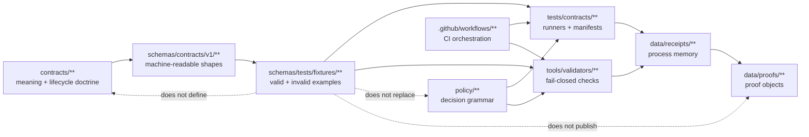

<!-- [KFM_META_BLOCK_V2]
doc_id: kfm://doc/NEEDS_VERIFICATION__schemas_tests_readme
title: schemas/tests
type: standard
version: v1
status: draft
owners: @bartytime4life
created: NEEDS_VERIFICATION__YYYY-MM-DD
updated: 2026-04-23
policy_label: NEEDS_VERIFICATION__public_or_internal
related: [../README.md, ../contracts/README.md, ../contracts/v1/README.md, ../contracts/vocab/README.md, ./fixtures/README.md, ./fixtures/contracts/README.md, ./fixtures/contracts/v1/README.md, ./fixtures/contracts/v1/valid/README.md, ./fixtures/contracts/v1/invalid/README.md, ../../contracts/README.md, ../../policy/README.md, ../../tests/README.md, ../../tests/contracts/README.md, ../../data/receipts/README.md, ../../data/proofs/README.md, ../../tools/validators/README.md, ../../docs/standards/README.md, ../../.github/workflows/README.md, ../../.github/CODEOWNERS]
tags: [kfm, schemas, tests, fixtures, contracts, validation, evidence]
notes: [doc_id and created date need governance-record verification; owners reflect surfaced broad repo ownership patterns and need active-branch confirmation for schemas/tests; this README treats schemas/tests as a schema-side fixture scaffold, not repo-wide test authority or merge-blocking proof; exact fixture inventory and workflow wiring remain NEEDS VERIFICATION.]
[/KFM_META_BLOCK_V2] -->

<a id="top"></a>

# `schemas/tests/`

Schema-side fixture scaffold for KFM contract examples, negative cases, and reviewable validation pressure.

> [!NOTE]
> **Status:** `experimental`  
> **Doc state:** `draft`  
> **Owners:** `@bartytime4life` *(leaf-level ownership still needs active-branch verification)*  
> **Path:** `schemas/tests/README.md`  
> **Repo fit:** child lane of [`../README.md`](../README.md); companion to [`../contracts/README.md`](../contracts/README.md), [`../contracts/v1/README.md`](../contracts/v1/README.md), and [`../contracts/vocab/README.md`](../contracts/vocab/README.md); upstream fixture input for root verification surfaces such as [`../../tests/contracts/README.md`](../../tests/contracts/README.md), validators under [`../../tools/validators/README.md`](../../tools/validators/README.md), and policy checks under [`../../policy/README.md`](../../policy/README.md).  
> **Quick jumps:** [Scope](#scope) · [Repo fit](#repo-fit) · [Accepted inputs](#accepted-inputs) · [Exclusions](#exclusions) · [Directory tree](#directory-tree) · [Quickstart](#quickstart) · [Usage](#usage) · [Diagram](#diagram) · [Reference tables](#reference-tables) · [Task list](#task-list--definition-of-done) · [FAQ](#faq) · [Appendix](#appendix)


> [!IMPORTANT]
> This lane is **fixture-facing**, not authority-facing.
>
> `schemas/tests/` may hold or describe valid/invalid example payloads that pressure-test schemas, but it does **not** define canonical schema shapes, contract meaning, policy decisions, promotion eligibility, runtime behavior, or publication readiness.

---

## Scope

`schemas/tests/` is the schema-side place to make fixture expectations visible near versioned machine contracts.

It exists to help maintainers answer review questions like:

- “Which examples prove this schema accepts the intended minimum object?”
- “Which examples prove this schema rejects unsafe, ambiguous, or incomplete objects?”
- “Which root test or validator consumes this fixture?”
- “Is this example synthetic and public-safe?”
- “Does this fixture support KFM’s cite-or-abstain, fail-closed, and governed-promotion posture?”

### Current posture

| Claim | Truth label | Working interpretation |
|---|---:|---|
| `schemas/tests/` is a documented schema-side fixture scaffold | **CONFIRMED from surfaced repo-facing docs** | Treat this as a real documentation lane. |
| Exact active-branch fixture inventory | **NEEDS VERIFICATION** | Re-run the inspection commands before adding or moving examples. |
| Merge-blocking workflow coverage for this lane | **UNKNOWN / NEEDS VERIFICATION** | Do not assume CI enforcement from README presence. |
| Fixture-home authority | **NEEDS VERIFICATION** | `schemas/tests/fixtures/` is visible, but root `tests/contracts/` remains the stronger execution lane. |
| Schema-home authority | **NEEDS VERIFICATION** | Machine schema homes are visible under `schemas/contracts/v1/`, but final authority still depends on repo doctrine and ADRs. |

[Back to top](#top)

---

## Repo fit

### Responsibility boundary

| Direction | Surface | Relationship |
|---|---|---|
| Parent schema index | [`../README.md`](../README.md) | Declares the broader `schemas/` subtree and should stay aligned with this lane. |
| Machine-contract families | [`../contracts/v1/README.md`](../contracts/v1/README.md) | Schemas under `schemas/contracts/v1/**` are the nearest versioned shape companions. |
| Schema vocabulary | [`../contracts/vocab/README.md`](../contracts/vocab/README.md) | Shared finite tokens and schema-side vocabulary must not be duplicated in fixture payloads without review. |
| Human-readable contract meaning | [`../../contracts/README.md`](../../contracts/README.md) | Contract prose explains meaning; fixtures only demonstrate examples. |
| Policy authority | [`../../policy/README.md`](../../policy/README.md) | Deny/allow/restrict logic belongs to policy, not to fixture naming. |
| Root contract verification | [`../../tests/contracts/README.md`](../../tests/contracts/README.md) | Runnable contract tests should consume or mirror fixtures through explicit manifests, not silent duplication. |
| Receipt and proof surfaces | [`../../data/receipts/README.md`](../../data/receipts/README.md), [`../../data/proofs/README.md`](../../data/proofs/README.md) | Process memory and proof objects belong outside this schema-side fixture lane. |
| Validator helpers | [`../../tools/validators/README.md`](../../tools/validators/README.md) | Validators operationalize schemas and fixtures; they do not make this lane the sole authority. |
| Workflow boundary | [`../../.github/workflows/README.md`](../../.github/workflows/README.md) | Workflow documentation matters, but branch protection and required checks must be verified separately. |

### Fit sentence

`schemas/tests/` sits between **machine-readable schema shape** and **repo-wide verification execution**. It should keep examples close enough to schemas for review, while still sending executable burden to `tests/`, `tools/validators/`, and CI.

[Back to top](#top)

---

## Accepted inputs

Put these here only when they are small, synthetic, reviewable, and tied to a visible schema or documented contract burden:

- schema-side fixture README files
- valid and invalid JSON examples for versioned contract families
- fixture manifests that map examples to schemas and expected outcomes
- minimal synthetic payloads for first-wave governed objects
- negative-case fixtures for missing required fields, unknown enum values, unsafe disclosure, bad references, and malformed integrity blocks
- fixture-local notes explaining expected validator behavior
- branch-local migration notes when fixture placement changes

### Good fit examples

| Input | Example path shape | Notes |
|---|---|---|
| Minimal valid runtime envelope fixture | `fixtures/contracts/v1/valid/runtime_response_envelope.answer.minimal.valid.json` | **PROPOSED naming pattern**; verify schema body and runner manifest before use. |
| Invalid source descriptor fixture | `fixtures/contracts/v1/invalid/source_descriptor.missing_source_role.invalid.json` | Should name the expected reason or schema error. |
| Release manifest rollback fixture | `fixtures/contracts/v1/invalid/release_manifest.missing_rollback_ref.invalid.json` | Keep release proof artifacts out of this lane; this is only a shape example. |
| Evidence bundle closure fixture | `fixtures/contracts/v1/valid/evidence_bundle.single_source.valid.json` | Must not include real sensitive source data. |

> [!CAUTION]
> A fixture that passes here is not automatically publishable, policy-safe, rights-cleared, promoted, or evidence-complete. It only proves the narrow shape or example expectation declared by its manifest.

[Back to top](#top)

---

## Exclusions

Do **not** put these in `schemas/tests/`:

| Do not put here | Better home | Why |
|---|---|---|
| Canonical schema bodies | [`../contracts/v1/`](../contracts/v1/) or the repo-approved schema home | Fixtures must not redefine schema law. |
| Human-readable contract doctrine | [`../../contracts/`](../../contracts/) | Meaning belongs in contracts and standards docs. |
| Runnable root test suites | [`../../tests/contracts/`](../../tests/contracts/) or a more specific `tests/` family | Execution belongs in the test surface. |
| Policy rules, Rego bundles, or allow/deny semantics | [`../../policy/`](../../policy/) and [`../../tests/policy/`](../../tests/policy/) | Policy remains centralized and fail-closed. |
| Raw source data, harvested records, or unpublished candidate data | `../../data/raw/`, `../../data/work/`, or `../../data/quarantine/` | This lane must remain synthetic and safe. |
| Receipts, attestations, signed bundles, or proof packs | [`../../data/receipts/`](../../data/receipts/), [`../../data/proofs/`](../../data/proofs/), and attestation tooling | Process memory and proof objects are separate surfaces. |
| Live connector output | domain pipeline or governed ingest lanes | Live source activation requires rights, source-role, and policy review. |
| Runtime API handlers or UI payload components | app/package lanes | Runtime implementation consumes contracts; it does not live in schema fixtures. |

[Back to top](#top)

---

## Directory tree

Current documented scaffold, kept intentionally narrow:

```text
schemas/tests/
├── README.md
└── fixtures/
    ├── README.md
    └── contracts/
        ├── README.md
        └── v1/
            ├── README.md
            ├── invalid/
            │   └── README.md
            └── valid/
                └── README.md
```

### Reading rule

Use this tree as a **documented scaffold**, not as evidence of complete fixture coverage.

- README presence means the lane is visible.
- `valid/` and `invalid/` presence means fixture intent is visible.
- It does **not** prove fixture density, validator wiring, CI enforcement, branch protection, or full contract-wave coverage.

[Back to top](#top)

---

## Quickstart

### Inspect before editing

```bash
# Open the schema-side fixture lane exactly as checked out.
find schemas/tests -maxdepth 6 -type f | sort

# Compare nearby schema contract homes before adding examples.
find schemas/contracts -maxdepth 5 -type f | sort

# Compare root execution and policy lanes before assuming ownership.
find tests/contracts tests/policy policy tools/validators -maxdepth 5 -type f 2>/dev/null | sort
```

### Re-open boundary docs together

```bash
sed -n '1,260p' schemas/README.md
sed -n '1,260p' schemas/contracts/README.md
sed -n '1,260p' schemas/contracts/v1/README.md
sed -n '1,260p' schemas/contracts/vocab/README.md
sed -n '1,260p' schemas/tests/README.md
sed -n '1,220p' schemas/tests/fixtures/contracts/v1/README.md

sed -n '1,260p' contracts/README.md
sed -n '1,260p' policy/README.md
sed -n '1,260p' tests/README.md
sed -n '1,260p' tests/contracts/README.md
sed -n '1,220p' .github/workflows/README.md
```

### Find fixture candidates

```bash
# Candidate schema-side fixtures.
find schemas/tests/fixtures/contracts -type f \
  \( -name '*.json' -o -name '*.yaml' -o -name '*.yml' \) \
  | sort

# Candidate root-side contract fixtures, if the repo also uses them.
find tests/contracts -type f \
  \( -name '*.json' -o -name '*.yaml' -o -name '*.yml' \) \
  | sort
```

### Drift check

```bash
grep -RIn \
  -e 'SourceDescriptor' \
  -e 'IngestReceipt' \
  -e 'ValidationReport' \
  -e 'DatasetVersion' \
  -e 'CatalogClosure' \
  -e 'DecisionEnvelope' \
  -e 'ReviewRecord' \
  -e 'ReleaseManifest' \
  -e 'EvidenceBundle' \
  -e 'RuntimeResponseEnvelope' \
  -e 'CorrectionNotice' \
  -e 'ABSTAIN' \
  -e 'DENY' \
  -e 'ERROR' \
  -e 'schemas/tests/fixtures/contracts/v1' \
  -e 'tests/contracts' \
  contracts schemas policy tests tools docs .github 2>/dev/null || true
```

> [!TIP]
> Run inspection commands before adding fixtures. In KFM, a quiet fixture duplicate can become a governance problem if it accidentally creates a second authority path.

[Back to top](#top)

---

## Usage

### Placement rules

1. **Start with the schema target.** Do not add a fixture unless the schema path or proposed schema target is explicit.
2. **Pair positive and negative coverage.** A new valid fixture should normally have at least one meaningful invalid sibling.
3. **Keep invalid cases purposeful.** Prefer contract-relevant failures over random malformed JSON.
4. **Declare the expected outcome.** A fixture manifest or README note should say whether the expected result is `valid`, `invalid`, `ABSTAIN`, `DENY`, or `ERROR` when that distinction matters.
5. **Stay synthetic.** Use minimal public-safe examples; never copy sensitive real records into schema fixtures.
6. **Do not fork authority.** If the same fixture also appears under `tests/contracts/`, link it through a manifest or migration note.
7. **Escalate broader burden.** Cross-service, runtime, policy, promotion, release, and correction proof belong in the matching root `tests/` family.

### Recommended fixture metadata

For every non-trivial fixture, keep this metadata visible in a manifest, README table, or adjacent comment file:

| Field | Meaning |
|---|---|
| `fixture_id` | Stable local identifier for the example. |
| `schema_ref` | Relative path or schema `$id` being tested. |
| `expected_result` | `valid`, `invalid`, or a finite runtime/policy outcome when applicable. |
| `negative_reason` | Required for invalid fixtures; describes what should fail. |
| `source_posture` | `synthetic`, `redacted`, or `public_safe_example`. |
| `consumer` | Root test, validator, or documentation surface expected to consume it. |
| `review_state` | `draft`, `reviewed`, or `needs_update`. |

### Minimal manifest sketch

```json
{
  "fixture_id": "runtime_response_envelope.answer.minimal.valid",
  "schema_ref": "schemas/contracts/v1/runtime/runtime_response_envelope.schema.json",
  "fixture_path": "schemas/tests/fixtures/contracts/v1/valid/runtime_response_envelope.answer.minimal.valid.json",
  "expected_result": "valid",
  "source_posture": "synthetic",
  "consumer": "tests/contracts",
  "review_state": "draft"
}
```

> [!IMPORTANT]
> The sketch above is illustrative until a repo-approved fixture manifest schema exists. Do not treat these keys as implemented contract law without a checked-in schema and runner.

[Back to top](#top)

---

## Diagram



[Back to top](#top)

---

## Reference tables

### Fixture-state vocabulary

| State | Use it when | Review consequence |
|---|---|---|
| `draft` | Fixture is newly added or schema target is still settling. | Do not rely on it for release gates. |
| `reviewed` | Fixture has a target schema, expected outcome, and consumer documented. | Safe to wire into contract tests. |
| `deprecated` | Fixture is retained for compatibility but should not guide new work. | Keep migration notes and replacement link. |
| `quarantined` | Fixture contains disputed, unsafe, or rights-unclear content. | Do not run as public-safe evidence; remove or replace. |
| `superseded` | Newer fixture replaces it under documented schema evolution. | Keep lineage until downstream runners are updated. |

### Where to put the change

| Change | Put it here? | Better path if not |
|---|---:|---|
| Valid fixture for an existing schema | Yes | — |
| Invalid fixture for an existing schema | Yes | — |
| Fixture manifest for schema examples | Yes, if schema-side | Root runner manifest may belong in `../../tests/contracts/`. |
| New schema body | No | `../contracts/v1/**` or repo-approved schema home. |
| Contract prose | No | `../../contracts/**`. |
| Policy deny rule | No | `../../policy/**`. |
| Policy test case | No | `../../tests/policy/**`. |
| Runtime proof request/response fixture | Usually no | `../../tests/e2e/runtime_proof/**`. |
| Release assembly fixture | Usually no | `../../tests/e2e/release_assembly/**`. |
| Correction drill fixture | Usually no | `../../tests/e2e/correction/**`. |
| Receipt/proof artifact | No | `../../data/receipts/**` or `../../data/proofs/**`. |

### First-wave object families to keep visible

| Object family | Fixture pressure |
|---|---|
| `SourceDescriptor` | source role, rights posture, update cadence, authority scope |
| `IngestReceipt` | run identity, source reference, retrieval status, checksum |
| `ValidationReport` | pass/fail summaries, warnings, blocking errors |
| `DatasetVersion` | deterministic version identity, temporal coverage, source linkage |
| `EvidenceBundle` | evidence references, provenance, support strength, citation closure |
| `DecisionEnvelope` | finite outcome, reason codes, obligations |
| `RuntimeResponseEnvelope` | `ANSWER` / `ABSTAIN` / `DENY` / `ERROR` behavior |
| `ReleaseManifest` | release contents, integrity, rollback reference |
| `CorrectionNotice` | supersession, correction reason, affected artifacts |
| `ReviewRecord` | reviewer role, decision state, review timestamp |

[Back to top](#top)

---

## Task list / Definition of done

### Before adding fixtures

- [ ] Active branch confirms `schemas/tests/` and the expected fixture subtree.
- [ ] Target schema path exists or is explicitly marked `PROPOSED`.
- [ ] Human-readable contract meaning is linked.
- [ ] Policy implications are checked for the object family.
- [ ] Fixture-home authority is not being changed silently.
- [ ] No real sensitive, restricted, raw, or unpublished source data is included.

### For each fixture

- [ ] Filename states object family and expected direction clearly.
- [ ] Fixture has a target schema reference.
- [ ] Fixture has an expected result.
- [ ] Invalid fixture has an expected failure reason.
- [ ] Fixture is synthetic or public-safe.
- [ ] Fixture is small enough for review.
- [ ] Consumer path is documented.
- [ ] If copied or mirrored elsewhere, lineage is explicit.

### Before merge

- [ ] `schemas/tests/README.md` links still resolve from this directory.
- [ ] `schemas/README.md` and `tests/contracts/README.md` remain aligned.
- [ ] Any fixture move has a migration note.
- [ ] Any new object family is reflected in the relevant contract/schema docs.
- [ ] CI or workflow enforcement status is labeled as **CONFIRMED**, **PROPOSED**, **UNKNOWN**, or **NEEDS VERIFICATION**.
- [ ] No README language claims release, publication, runtime, or promotion enforcement without direct proof.

[Back to top](#top)

---

## FAQ

### Does `schemas/tests/` own contract authority?

No. Contract meaning belongs in `contracts/` and machine shape belongs in the chosen schema home. This lane shows examples that help prove those shapes.

### Do fixtures here automatically run in CI?

**UNKNOWN / NEEDS VERIFICATION.** README presence does not prove branch protection, required checks, or workflow execution. Root test manifests and `.github/workflows/` must be verified before making enforcement claims.

### Should valid and invalid fixtures live here or under `tests/contracts/`?

Use the burden split:

- schema-adjacent examples may live here;
- executable runners and root proof reports belong under `tests/contracts/`;
- if the repo later chooses root-side fixtures as canonical, document the migration instead of duplicating examples silently.

### Can real source samples go here?

No. Use synthetic minimal examples. Real source-derived examples belong only after rights, sensitivity, lifecycle state, and public-safety review choose an appropriate data or test fixture lane.

### What should happen when a schema changes?

Update fixtures in the smallest reversible step:

1. add or revise the schema,
2. add paired valid/invalid examples,
3. update root runner manifests,
4. update validator expectations,
5. record supersession or migration notes,
6. keep rollback possible until downstream tests pass.

[Back to top](#top)

---

## Appendix

<details>
<summary><strong>Contradiction and drift watchlist</strong></summary>

These tensions should stay visible until an ADR, branch inspection, or governance record resolves them:

1. `schemas/contracts/v1/**` is visible as a machine-contract lane, but final schema-home authority still needs verification.
2. `schemas/tests/fixtures/**` is visible as a nested fixture scaffold, but root `tests/contracts/**` remains the stronger execution surface.
3. Fixture presence does not prove fixture density, validator coverage, or merge-blocking CI.
4. Shared vocabulary can drift if values are duplicated across schemas, contracts, policy rules, and fixtures.
5. Receipt, proof, release, review, and correction objects are related but not interchangeable.
6. A fixture can be shape-valid and still be policy-denied, rights-blocked, sensitivity-blocked, review-incomplete, or unpublished.

</details>

<details>
<summary><strong>Reviewer shorthand</strong></summary>

Keep this lane boring in the right way:

**small fixtures, explicit schema targets, paired negative cases, synthetic content, no authority drift, no hidden CI claims.**

</details>

<details>
<summary><strong>Maintainer checklist for path changes</strong></summary>

When changing the fixture-home strategy, update these surfaces together:

- [`../README.md`](../README.md)
- [`../contracts/README.md`](../contracts/README.md)
- [`../contracts/v1/README.md`](../contracts/v1/README.md)
- [`../../contracts/README.md`](../../contracts/README.md)
- [`../../tests/README.md`](../../tests/README.md)
- [`../../tests/contracts/README.md`](../../tests/contracts/README.md)
- [`../../tools/validators/README.md`](../../tools/validators/README.md)
- [`../../.github/workflows/README.md`](../../.github/workflows/README.md)

</details>

[Back to top](#top)