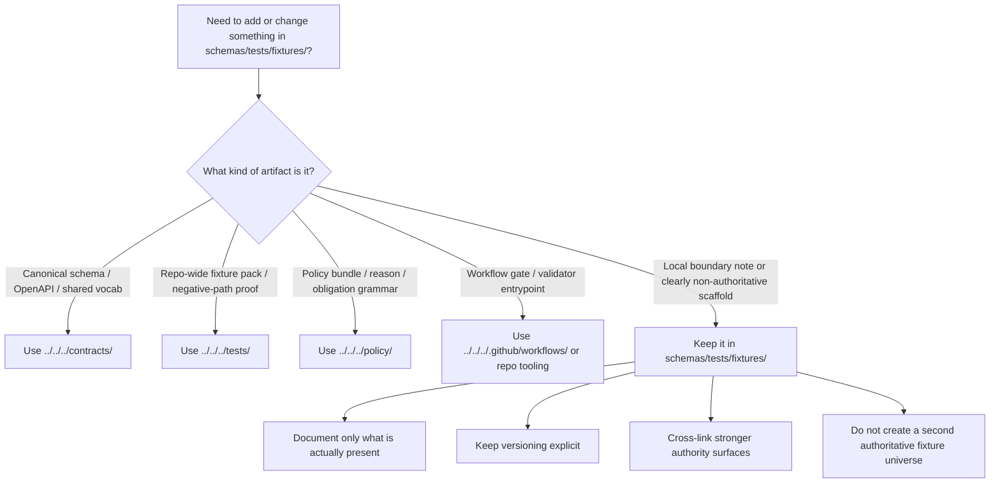

<!-- [KFM_META_BLOCK_V2]
doc_id: kfm://doc/TODO-UUID
title: fixtures
type: standard
version: v1
status: draft
owners: @bartytime4life (global fallback owner; no narrower /schemas/ or /schemas/tests/fixtures/ rule was directly verified on public main)
created: TODO-YYYY-MM-DD
updated: TODO-YYYY-MM-DD
policy_label: TODO-POLICY-LABEL
related: [../README.md, ./contracts/README.md, ./contracts/v1/README.md, ./contracts/v1/valid/README.md, ./contracts/v1/invalid/README.md, ../../README.md, ../../../contracts/README.md, ../../../tests/README.md, ../../../policy/README.md, ../../../docs/standards/README.md, ../../../.github/workflows/README.md]
tags: [kfm, schemas, tests, fixtures, contracts]
notes: [Current public main verifies this subtree and its nested README-only scaffold; doc_id, created, updated, and policy_label remain reviewable placeholders until confirmed on the working branch.]
[/KFM_META_BLOCK_V2] -->

# fixtures

Schema-adjacent fixture scaffold for the visible `schemas/tests/fixtures/` subtree.

> [!NOTE]
> The KFM Meta Block V2 above uses reviewable placeholders for `doc_id`, `created`, `updated`, and `policy_label` because those values were not directly confirmed from the public repo surfaces inspected for this revision.

> **Status:** experimental  
> **Doc status:** draft  
> **Owners:** `@bartytime4life` *(via current public `.github/CODEOWNERS` global fallback; no narrower `/schemas/` or `/schemas/tests/fixtures/` rule was directly verified)*  
> **Path:** `schemas/tests/fixtures/README.md`  
> 
> 
> 
> 
>   
> **Repo fit:** path `schemas/tests/fixtures/README.md` · upstream [`../README.md`](../README.md), [`../../README.md`](../../README.md) · stronger current contract / verification / policy lanes [`../../../contracts/README.md`](../../../contracts/README.md), [`../../../tests/README.md`](../../../tests/README.md), [`../../../policy/README.md`](../../../policy/README.md) · standards / workflow neighbors [`../../../docs/standards/README.md`](../../../docs/standards/README.md), [`../../../.github/workflows/README.md`](../../../.github/workflows/README.md) · downstream local subtree [`./contracts/README.md`](./contracts/README.md), [`./contracts/v1/README.md`](./contracts/v1/README.md), [`./contracts/v1/valid/README.md`](./contracts/v1/valid/README.md), [`./contracts/v1/invalid/README.md`](./contracts/v1/invalid/README.md)  
> **Quick jumps:** [Scope](#scope) · [Repo fit](#repo-fit) · [Accepted inputs](#accepted-inputs) · [Exclusions](#exclusions) · [Current verified snapshot](#current-verified-snapshot) · [Directory tree](#directory-tree) · [Quickstart](#quickstart) · [Usage](#usage) · [Diagram](#diagram) · [Operating matrix](#operating-matrix) · [Task list](#task-list--definition-of-done) · [FAQ](#faq) · [Appendix](#appendix)

> [!IMPORTANT]
> Treat this directory as a **boundary surface and local scaffold** unless the repo explicitly declares it the authoritative fixture home. The stronger current signals still point to `contracts/` for machine-contract law and `tests/` for governed verification burden.

> [!WARNING]
> This path is visible on public `main`, but visibility is not authority. Do not let `schemas/tests/fixtures/` become a quiet second schema registry or a second canonical fixture inventory.

## Scope

`schemas/tests/fixtures/` is a real nested subtree on public `main`, but its role is still deliberately narrow.

This README should help contributors answer four questions quickly:

1. What is currently visible here?
2. What kinds of files may live here without creating contract drift?
3. What should still go to `../../../contracts/` or `../../../tests/` instead?
4. What must be verified before anyone treats this lane as canonical?

The working rule is simple: **document the subtree, preserve boundary clarity, and avoid overstating authority**.

### Truth labels used here

| Label | Meaning in this README |
|---|---|
| **CONFIRMED** | Directly visible on current public `main` or stated in current repo docs inspected for this revision |
| **INFERRED** | Conservative interpretation of current repo docs and branch-visible structure |
| **PROPOSED** | Repo-native guidance that fits KFM doctrine but is not yet proven as mounted implementation |
| **UNKNOWN** | Not supported strongly enough to present as settled repo law |
| **NEEDS VERIFICATION** | Important enough to call out explicitly before relying on it |

[Back to top](#fixtures)

## Repo fit

**Path:** `schemas/tests/fixtures/README.md`  
**Role:** Nested fixture-boundary README for schema-adjacent scaffolding, versioned valid/invalid leaf folders, and authority-safe routing back to the stronger contract and verification surfaces.

| Surface | Current reading |
|---|---|
| Parent lane | [`../README.md`](../README.md) already treats `schemas/tests/` as a nested scaffold, not a second canonical verification system |
| Schema boundary | [`../../README.md`](../../README.md) still warns against parallel schema authority |
| Stronger machine-contract signal | [`../../../contracts/README.md`](../../../contracts/README.md) |
| Stronger repo-wide verification signal | [`../../../tests/README.md`](../../../tests/README.md) |
| Workflow / merge-gate signal | [`../../../.github/workflows/README.md`](../../../.github/workflows/README.md) still documents a README-only workflow lane on public `main` |
| Local subtree | `./contracts/README.md`, `./contracts/v1/README.md`, `./contracts/v1/valid/README.md`, and `./contracts/v1/invalid/README.md` are all already present as checked-in boundary/scaffold surfaces |
| Authority posture | **UNKNOWN / NEEDS VERIFICATION** — current public docs do not yet make this subtree the singular fixture home |

### Path reconciliation note

The public tree now visibly contains more under `schemas/tests/fixtures/` than a bare directory stub. Parent and sibling docs should therefore stay synchronized when tree snapshots change.

That means this README should describe the **live visible subtree here** without quietly hardening schema-home or fixture-home law.

[Back to top](#fixtures)

## Accepted inputs

Use this lane for material that helps people understand or safely stage **schema-adjacent fixture scaffolding** without creating a second canonical truth system.

| Accept here | Why it belongs |
|---|---|
| Path-local `README.md` files | They explain what nested folders mean and how they relate to stronger authority surfaces |
| Human-readable inventory or migration notes | They make the visible subtree inspectable without overstating live implementation |
| Clearly labeled **non-authoritative** examples or mirrors | Acceptable only when they support explanation or generated output and do not compete with canonical sources |
| Versioned `valid/` and `invalid/` folders used as scaffold | Useful when their README language makes their non-canonical role explicit |
| Notes that route contributors back to `../../../contracts/` and `../../../tests/` | They reduce drift and keep authority visible |

> [!NOTE]
> “Accepted here” does **not** mean “make canonical here.” This lane is safest when it stays README-first, pointer-heavy, and explicit about its limits.

## Exclusions

These do **not** belong here unless repo law changes and that change is documented explicitly.

| Do not place here | Put it here instead | Why |
|---|---|---|
| Canonical `*.schema.json`, OpenAPI, or shared vocab files | [`../../../contracts/`](../../../contracts/) | Avoids parallel machine-contract authority |
| Repo-wide canonical fixture packs used by blocking gates | [`../../../tests/`](../../../tests/) | Keeps governed verification burden attached to the stronger repo-wide verification surface |
| Policy bundles, reason codes, obligation codes, or decision grammar | [`../../../policy/`](../../../policy/) | Policy should remain executable and centralized |
| Workflow YAML, validator entrypoints, or merge-gate wiring | [`../../../.github/workflows/`](../../../.github/workflows/) and repo tooling lanes | This directory is not the workflow control plane |
| Runtime outputs, proof packs, or release artifacts | Governed data / release / runtime surfaces | This lane is not a publication home |
| Sensitive or rights-unclear examples | Quarantine or steward-only governed lanes | Nested convenience scaffolds are the wrong place for ambiguous publication burden |

[Back to top](#fixtures)

## Current verified snapshot

This table documents what is currently visible and safe to describe from the public repo surface.

| Surface | Current public `main` state | Working meaning | Posture |
|---|---|---|---|
| `./README.md` | Present | This boundary README is a real checked-in surface | **CONFIRMED** |
| `./contracts/README.md` | Present | Local contract-flavored boundary note exists | **CONFIRMED** |
| `./contracts/v1/README.md` | Present | Versioned scaffold root exists | **CONFIRMED** |
| `./contracts/v1/valid/README.md` | Present | Positive-example leaf is still README-only scaffold | **CONFIRMED** |
| `./contracts/v1/invalid/README.md` | Present | Negative-example leaf is still README-only scaffold | **CONFIRMED** |
| Parent `schemas/tests/README.md` | Present | Parent lane already describes this subtree as scaffold-only and authority-limited | **CONFIRMED** |
| Parent `schemas/README.md` inventory wording | Still older and narrower than the now-visible child scaffolds | Parent and child inventory language should be reconciled together | **CONFIRMED** |
| Mounted validator entrypoints targeting this subtree | Not established by checked-in docs here | Do not claim live validator wiring from this path alone | **UNKNOWN** |
| This path is the singular authoritative fixture home | Not established by public-main docs | Must stay unresolved until an ADR or equivalent repo decision says otherwise | **NEEDS VERIFICATION** |

[Back to top](#fixtures)

## Directory tree

### Current verified tree

```text
schemas/
└── tests/
    ├── README.md
    └── fixtures/
        ├── README.md
        └── contracts/
            ├── README.md
            └── v1/
                ├── README.md
                ├── invalid/
                │   └── README.md
                └── valid/
                    └── README.md
```

### Starter naming pattern if real examples are later introduced

*PROPOSED, illustrative only.*

```text
schemas/tests/fixtures/contracts/v1/
├── valid/
│   └── __minimal.example.valid.json
└── invalid/
    └── __minimal.example.invalid.json
```

> [!TIP]
> Keep future filenames honest about role. If an example is illustrative, mirrored, generated, or non-authoritative, say so in the filename, README, or both.

[Back to top](#fixtures)

## Quickstart

Use this directory in an inspection-first way.

```bash
# 1) Inspect the local fixture scaffold exactly as checked out
find schemas/tests/fixtures -maxdepth 6 -type f | sort

# 2) Read the parent and sibling authority docs before editing here
sed -n '1,240p' schemas/README.md
sed -n '1,260p' schemas/tests/README.md
sed -n '1,260p' contracts/README.md
sed -n '1,260p' tests/README.md
sed -n '1,240p' .github/workflows/README.md

# 3) Check whether this subtree contains real payloads yet
find schemas/tests/fixtures -type f ! -name 'README.md' | sort

# 4) Search for authority and fixture-home language before adding files
grep -RIn 'parallel schema\|authoritative schema\|schemas/tests/fixtures\|valid\|invalid' \
  README.md schemas contracts tests docs .github 2>/dev/null || true
```

### Minimal review questions before adding anything here

1. Is this file authoritative, mirrored, generated, or purely explanatory?
2. Would adding it here create a second home for the same trust-bearing object?
3. Does the same burden already belong under `../../../contracts/` or `../../../tests/`?
4. Will a future merge gate need to read this exact path, or would that create avoidable ambiguity?
5. Is the example public-safe and clearly labeled when it is not canonical?

> [!WARNING]
> Do not invent validator commands or claim merge-gate behavior from this README alone. Use checked-in repo-native entrypoints once they exist and are verified.

[Back to top](#fixtures)

## Usage

### Decision order

1. **Start with authority.** If the file defines a trust-bearing object or gate-bearing fixture pack, assume it belongs in the stronger contract or root test lane first.
2. **Use this lane for local clarity, not silent law.** A nested schema-adjacent example is acceptable only when its non-authoritative role is obvious.
3. **Keep versioning explicit.** If examples remain here, keep them under versioned folders such as `v1/`.
4. **Pair positive and negative cases carefully.** `valid/` and `invalid/` are useful scaffolds, but they are not proof of governed verification on their own.
5. **Retire ambiguity when repo law changes.** If a future ADR or merge gate makes this lane authoritative, update this README, the parent `schemas/tests/README.md`, the parent `schemas/README.md`, and any workflow-facing docs in the same change set.

### Practical working rules

- Prefer links over duplication when the same explanation already lives in `../../../contracts/` or `../../../tests/`.
- Prefer README guidance over placeholder payload files when the repo has not yet settled fixture-home authority.
- If a real payload lands here temporarily, mark it as **PROPOSED**, **illustrative**, **generated**, or **mirror** unless the repo has already made this lane canonical.
- Never let `valid/` or `invalid/` become a quiet second fixture inventory that a validator could read inconsistently.

### Keep sibling lanes distinct

- [`../README.md`](../README.md) owns the nested `schemas/tests/` boundary.
- [`./contracts/README.md`](./contracts/README.md) owns the contract-flavored pointer note inside this subtree.
- [`../../../contracts/README.md`](../../../contracts/README.md) remains the stronger current signal for machine-readable contract ownership.
- [`../../../tests/README.md`](../../../tests/README.md) remains the stronger repo-wide verification surface.
- [`../../../policy/README.md`](../../../policy/README.md) owns executable policy posture and shared decision grammar.
- [`../../../.github/workflows/README.md`](../../../.github/workflows/README.md) owns workflow-lane documentation and merge-gate claims.

### Truth-status interpretation used in this README

| Label | Meaning here |
|---|---|
| **CONFIRMED** | Supported by the current public repo surface or current checked-in docs inspected for this revision |
| **INFERRED** | Strongly implied by those docs and the visible tree, but not proven as detailed runtime behavior |
| **PROPOSED** | Recommended path or next move, not a current implementation fact |
| **UNKNOWN** | Not supported strongly enough to present as live repo truth |
| **NEEDS VERIFICATION** | Important enough to flag before anyone relies on it for review or automation |

[Back to top](#fixtures)

## Diagram



## Operating matrix

| Question | Safest current answer | Posture |
|---|---|---|
| Does this subtree exist on public `main`? | Yes | **CONFIRMED** |
| Are the `valid/` and `invalid/` leaf folders materialized as README-only scaffolds? | Yes | **CONFIRMED** |
| Is this subtree already the canonical fixture home? | Not yet proven | **NEEDS VERIFICATION** |
| Should new machine-contract law be added here by default? | No; start with `../../../contracts/` | **CONFIRMED** |
| Should broad executable verification packs be anchored here by default? | Prefer `../../../tests/` | **INFERRED** |
| Should edits here review parent and sibling docs in the same PR? | Yes | **PROPOSED** |
| Is it safe to leave parent/child inventory wording out of sync after a tree change? | No | **CONFIRMED working rule** |

## Task list / definition of done

- [ ] The directory tree shown here matches the checked-out branch
- [ ] No sentence quietly upgrades this path into the canonical fixture home without an explicit repo decision
- [ ] Any new local example is marked **non-authoritative**
- [ ] No trust-bearing object family is duplicated across `schemas/` and `contracts/`
- [ ] Links to parent, sibling, and downstream README surfaces still resolve
- [ ] Commands remain inspection-first and non-destructive
- [ ] Any authority change is accompanied by sibling README updates and, where needed, an ADR
- [ ] Any new `valid/` or `invalid/` example is consistent with the stronger contract and verification surfaces
- [ ] Any claim of validator, CI, or merge-gate behavior is backed by checked-in evidence, not README implication
- [ ] Placeholder meta-block fields are either retired before merge or deliberately left review-visible with an explanation

[Back to top](#fixtures)

## FAQ

### Why document this path instead of deleting it?

Because it already exists as a public repo surface. Undocumented ambiguity is worse than explicit ambiguity.

### Can I add canonical `*.schema.json` files here?

Not by default. Put canonical machine contracts under [`../../../contracts/`](../../../contracts/) unless the repo has explicitly moved schema authority here.

### Can I store golden screenshots or wide regression packs here?

Usually no. Those belong with the broader governed verification surface under [`../../../tests/`](../../../tests/).

### What should happen after the authoritative-home decision lands?

Update this README, the parent/sibling docs, and the local subtree contents in the **same PR** so contributors do not see two competing answers.

### Are `valid/` and `invalid/` directories enough to prove real verification?

No. They are useful scaffolding, but governed verification still needs an explicit validator path, policy tests where relevant, and a merge-blocking gate that demonstrates invalid fixtures fail visibly.

## Appendix

<details>
<summary>Illustrative local file patterns</summary>

These patterns are useful only when they document the visible subtree without creating new contract law.

| File or pattern | Intended use | Posture |
|---|---|---|
| `README.md` | Local scope and boundary explanation | **CONFIRMED** |
| `inventory.md` | Human-readable listing of what the subtree currently contains | **PROPOSED** |
| `migration-notes.md` | Mapping from this subtree to stronger authority surfaces | **PROPOSED** |
| `contracts/v1/README.md` | Version-local explanation of the visible subtree | **CONFIRMED** |
| `*.example.valid.json` / `*.example.invalid.json` | Only when explicitly linked to an external canonical schema and clearly marked non-authoritative | **PROPOSED** |

</details>

[Back to top](#fixtures)
