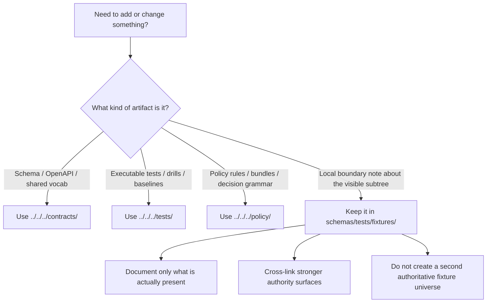

<!-- [KFM_META_BLOCK_V2]
doc_id: kfm://doc/TODO-UUID
title: fixtures
type: standard
version: v1
status: draft
owners: @bartytime4life (global fallback owner; path-specific ownership needs verification)
created: TODO-YYYY-MM-DD
updated: TODO-YYYY-MM-DD
policy_label: TODO-POLICY-LABEL
related: [../README.md, ../../README.md, ../../../contracts/README.md, ../../../tests/README.md, ../../../policy/README.md, ../../../docs/standards/README.md, ../../../.github/workflows/README.md]
tags: [kfm, schemas, tests, fixtures, contracts]
notes: [Workspace evidence was PDF-only in this session; repo tree was not directly mounted, so path-level claims below are limited to the task-visible subtree description plus attached repo-grounded doctrine and summary artifacts.]
[/KFM_META_BLOCK_V2] -->

# fixtures

Schema-adjacent fixture scaffold for the currently visible `schemas/tests/fixtures/` subtree.

> **Status:** experimental  
> **Owners:** `@bartytime4life` _(global fallback owner; path-specific ownership needs verification)_  
> **Path:** `schemas/tests/fixtures/README.md`  
> **Badges:**      
> **Quick links:** [Scope](#scope) · [Repo fit](#repo-fit) · [Accepted inputs](#accepted-inputs) · [Exclusions](#exclusions) · [Current task-visible snapshot](#current-task-visible-snapshot) · [Directory tree](#directory-tree) · [Quickstart](#quickstart) · [Usage](#usage) · [Diagram](#diagram) · [Operating matrix](#operating-matrix) · [Task list](#task-list) · [FAQ](#faq) · [Appendix](#appendix)

> [!IMPORTANT]
> Treat this directory as a **boundary surface and local scaffold** unless the repo explicitly declares it the authoritative fixture home. The stronger current doctrine points to `contracts/` for machine-contract law, `tests/` for governed verification work, and a contract-first thin slice with valid/invalid fixtures and merge-blocking validation as the preferred next trust step.

## Scope

This directory documents the currently visible `schemas/tests/fixtures/` subtree **without** quietly promoting it into a second authoritative contract or test universe.

In practice, this README should help contributors answer three questions quickly:

1. What is here right now?
2. What kinds of changes are safe here?
3. Which neighboring surfaces own canonical schema, policy, and verification law?

A working rule for this file: be explicit about boundaries, be useful about the local tree, and avoid overstating mounted implementation reality.

[Back to top](#fixtures)

## Repo fit

| Relationship | Path | Role in this area |
|---|---|---|
| Current directory | `schemas/tests/fixtures/` | Local scaffold documented here |
| Parent schema-test surface | [`../README.md`](../README.md) | Immediate parent context |
| Schema boundary / authority warning | [`../../README.md`](../../README.md) | Explains why `schemas/` should not silently become a second contract authority |
| Machine-contract lane | [`../../../contracts/README.md`](../../../contracts/README.md) | Stronger current home for machine-readable contracts |
| Verification lane | [`../../../tests/README.md`](../../../tests/README.md) | Stronger current home for governed verification work |
| Policy lane | [`../../../policy/README.md`](../../../policy/README.md) | Deny-by-default and decision-grammar context |
| Standards routing | [`../../../docs/standards/README.md`](../../../docs/standards/README.md) | Cross-links standards posture to contract ownership |
| Workflow lane | [`../../../.github/workflows/README.md`](../../../.github/workflows/README.md) | CI/CD surface to inspect before claiming any gate behavior |

### Repo-fit interpretation

This README should complement adjacent docs, not compete with them.

The safest current interpretation is:

- `schemas/tests/fixtures/` is a **visible local subtree**
- `contracts/` is the **stronger machine-contract surface**
- `tests/` is the **stronger governed verification surface**
- any future authority decision should be made **explicitly**, not by quiet accretion

## Accepted inputs

The following belong here today.

| Accept here | Why it belongs |
|---|---|
| Path-local `README.md` files | They explain what the local subtree contains and does not contain |
| Human-readable inventory notes | They make the visible tree inspectable without overstating implementation |
| Migration notes for this subtree | They help contributors understand how this path relates to stronger neighboring surfaces |
| Cross-links to canonical contract / test / policy docs | They reduce drift and make authority visible |
| Tiny schema-adjacent examples that are **explicitly marked non-authoritative** | They can clarify local structure without creating new contract law |
| Fixture-shape notes for `valid/` and `invalid/` lanes | They help contributors keep negative-path expectations legible before stronger validator wiring is proven |

> [!NOTE]
> “Accept here” does **not** mean “make canonical here.” This directory is safest when it documents current structure, boundary, and migration posture clearly.

## Exclusions

The following do **not** belong here by default.

| Do not place here | Put it here instead | Why |
|---|---|---|
| Canonical `*.schema.json`, OpenAPI, or shared vocab files | [`../../../contracts/README.md`](../../../contracts/README.md) | Machine-contract law should not fork across multiple roots |
| Executable regression suites, drill harnesses, or broad verification packs | [`../../../tests/README.md`](../../../tests/README.md) | Verification should stay attached to the wider governed test surface |
| Policy bundles, reason codes, obligation codes, or decision rules | [`../../../policy/README.md`](../../../policy/README.md) | Policy grammar should remain executable and centralized |
| Workflow gates or CI runner definitions | [`../../../.github/workflows/README.md`](../../../.github/workflows/README.md) | Gates belong with workflow configuration, not fixture scaffolding |
| Duplicate copies of object families already defined elsewhere | The already-owning surface | Duplicate authority is worse than visible incompleteness |
| Claims that this subtree is already the canonical fixture home | An ADR or equivalent authority decision | Authority should be explicit, reviewable, and synchronized |

[Back to top](#fixtures)

## Current task-visible snapshot

> [!CAUTION]
> The current session did **not** expose a mounted repository checkout for direct path inspection. The table below is therefore limited to the subtree description visible in this task, plus repo-grounded planning documents that describe fixture expectations more broadly. Treat these rows as a **task-visible snapshot**, not as independent branch verification.

| Item | What is visible now | Posture |
|---|---|---|
| `./README.md` | Local directory README is the target of this revision | **CONFIRMED (task-visible)** |
| `./contracts/README.md` | Local contracts sub-area README is shown in the task-visible subtree | **CONFIRMED (task-visible)** |
| `./contracts/v1/README.md` | Versioned local subtree README is shown in the task-visible subtree | **CONFIRMED (task-visible)** |
| `./contracts/v1/valid/` | Versioned valid-lane directory is shown in the task-visible subtree | **CONFIRMED (task-visible)** |
| `./contracts/v1/invalid/` | Versioned invalid-lane directory is shown in the task-visible subtree | **CONFIRMED (task-visible)** |
| Mounted validator entrypoints targeting this subtree | Not established by this directory alone | **UNKNOWN** |
| This path is the single authoritative fixture home | Not established | **NEEDS VERIFICATION** |
| Real `.schema.json` inventory already wired to this subtree | Not established by mounted repo inspection in this session | **UNKNOWN** |
| Future long-term role of this subtree | Boundary doc, migration surface, pointer lane, or retirement candidate | **INFERRED** |

## Directory tree

### Currently visible tree

```text
schemas/
└── tests/
    ├── README.md
    └── fixtures/
        ├── README.md
        └── contracts/
            ├── README.md
            └── v1/
                ├── README.md
                ├── invalid/
                └── valid/
```

### Working interpretation

The current tree is useful because it is **real in the task-visible materials**. It is not yet sufficient to prove that this subtree is the long-term canonical fixture root.

## Quickstart

Use this directory in an inspection-first way.

```bash
# 1) Inspect the local subtree exactly as checked out
find schemas/tests/fixtures -maxdepth 4 \( -type d -o -type f \) | sort

# 2) Read the three adjacent authority docs before changing anything here
sed -n '1,220p' schemas/README.md
sed -n '1,260p' contracts/README.md
sed -n '1,260p' tests/README.md

# 3) Compare authority language and fixture-home language
git grep -nE 'parallel schema|authoritative schema|tests/fixtures|schemas/tests/fixtures' -- \
  schemas contracts tests docs .github
```

> [!TIP]
> Before adding anything here, read in this order:
> 1. [`../../README.md`](../../README.md)
> 2. [`../../../contracts/README.md`](../../../contracts/README.md)
> 3. [`../../../tests/README.md`](../../../tests/README.md)

> [!WARNING]
> Do not invent validator commands or claim merge-gate behavior from this README alone. Use checked-in repo-native entrypoints once they exist and are verified.

[Back to top](#fixtures)

## Usage

### Decision rule

When a contributor wants to add or change something, the safest current routing is:

| Change you want to make | Best current home | Posture |
|---|---|---|
| Document the local subtree that already exists | `schemas/tests/fixtures/` | **CONFIRMED safe** |
| Add canonical JSON Schema or OpenAPI | `../../../contracts/` | **CONFIRMED stronger fit** |
| Add executable contract fixtures intended to prove behavior | `../../../tests/` or the explicitly declared canonical fixture lane | **INFERRED / NEEDS VERIFICATION** |
| Add policy rules or shared decision vocab | `../../../policy/` | **CONFIRMED stronger fit** |
| Add merge gates or workflow checks | `../../../.github/workflows/` | **CONFIRMED stronger fit** |
| Retire duplicate local material after an authority decision | This directory **plus** sibling docs in the same PR | **PROPOSED** |

### Working rule for local additions

If material must be added here before the authoritative-home decision is explicit:

- keep it **small**
- mark it **non-authoritative**
- link it to the owning contract / policy / test surface
- avoid copying the same object family into both `schemas/` and `contracts/`
- update neighboring docs in the same PR when boundary meaning changes

### Truth-status interpretation used in this README

| Label | Meaning here |
|---|---|
| **CONFIRMED** | Supported by the supplied task materials or stronger attached doctrine |
| **INFERRED** | Strongly implied by doctrine or surrounding structure, but not directly reverified in the mounted repo |
| **PROPOSED** | Recommended path or next move, not current implementation fact |
| **UNKNOWN** | Not supported strongly enough in the current session |
| **NEEDS VERIFICATION** | Important enough to call out explicitly before relying on it |

## Diagram



## Operating matrix

| Question | Safest current answer | Posture |
|---|---|---|
| Does this directory exist as a visible subtree in the task materials? | Yes | **CONFIRMED** |
| Is it the canonical fixture home? | Not yet proven | **NEEDS VERIFICATION** |
| Should new machine-contract law be added here by default? | No; start with `../../../contracts/` | **CONFIRMED** |
| Should broad executable verification packs be anchored here by default? | Prefer `../../../tests/` | **INFERRED** |
| Should a PR touching this directory review sibling authority docs too? | Yes | **PROPOSED** |
| Is it safe to leave authority ambiguous after a boundary change? | No | **CONFIRMED working rule** |

## Task list

### Definition of done for edits in this directory

- [ ] The directory tree shown here matches the checked-out branch
- [ ] No sentence quietly upgrades this path into the canonical fixture home without an explicit repo decision
- [ ] Any new local example is marked **non-authoritative**
- [ ] No object family is duplicated across `schemas/` and `contracts/`
- [ ] Links to sibling authority docs still resolve
- [ ] Commands remain inspection-first and non-destructive
- [ ] Any authority change is accompanied by sibling README updates and, where needed, an ADR
- [ ] Any new `valid/` or `invalid/` example is consistent with the stronger contract and verification surfaces
- [ ] Any claim of validator, CI, or merge-gate behavior is backed by checked-in evidence, not README implication

[Back to top](#fixtures)

## FAQ

### Why document this path instead of deleting it?

Because it already exists in the task-visible tree. Undocumented ambiguity is worse than explicit ambiguity.

### Can I add canonical `*.schema.json` files here?

Not by default. Put canonical machine contracts under [`../../../contracts/`](../../../contracts/) unless the repo has explicitly moved schema authority here.

### Can I store golden screenshots or wide regression packs here?

Usually no. Those belong with the broader verification surface under [`../../../tests/`](../../../tests/).

### What should happen after the authoritative-home decision lands?

Update this README, the parent/sibling docs, and the local subtree contents in the **same PR** so contributors do not see two competing answers.

### Are `valid/` and `invalid/` directories enough to prove real verification?

No. They are useful scaffolding, but governed verification still needs an explicit validator path, policy tests where relevant, and a merge-blocking gate that demonstrates invalid fixtures fail visibly.

## Appendix

<details>
<summary>Illustrative local file patterns (safe, narrow, and mostly non-authoritative)</summary>

These patterns are useful only when they document the visible subtree without creating new contract law.

| File or pattern | Intended use | Posture |
|---|---|---|
| `README.md` | Local scope and boundary explanation | **CONFIRMED** |
| `inventory.md` | Human-readable listing of what the subtree currently contains | **PROPOSED** |
| `migration-notes.md` | Mapping from this subtree to stronger authority surfaces | **PROPOSED** |
| `contracts/v1/README.md` | Version-local explanation of the visible subtree | **CONFIRMED (task-visible)** |
| `*.example.valid.json` / `*.example.invalid.json` | Only when explicitly linked to an external canonical schema and clearly marked non-authoritative | **PROPOSED** |

</details>

[Back to top](#fixtures)
